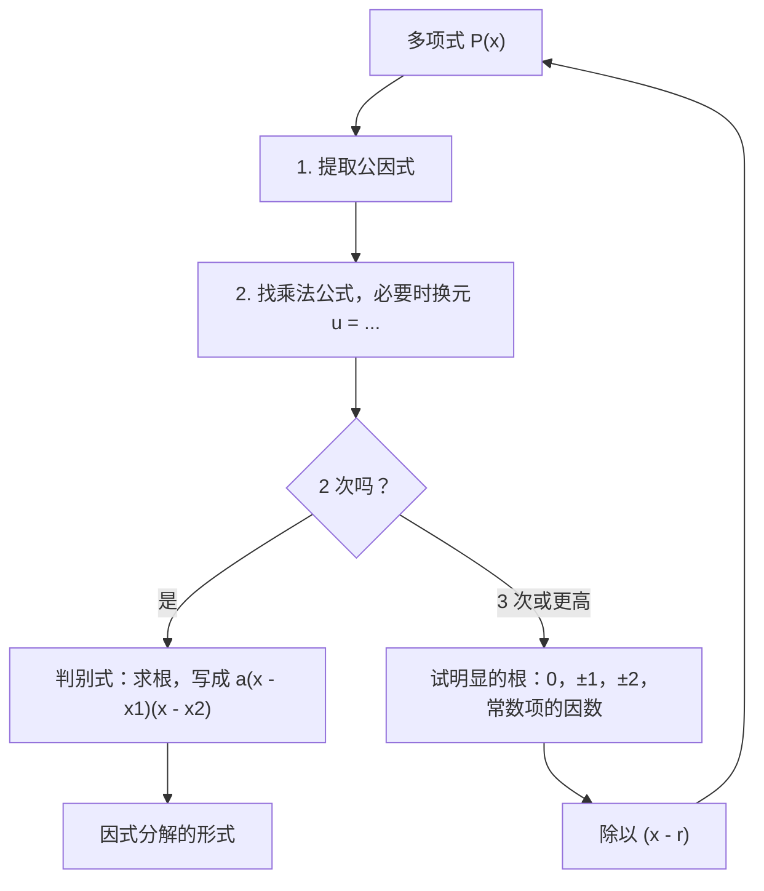
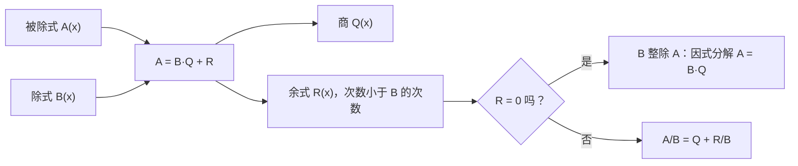

# 2. 多项式：因式分解与多项式除法

> **目标**：把多项式分解成一次因式的乘积，做多项式（带余）除法，化简有理分式。这些技巧**到处**都会用到：符号表、$$\frac{0}{0}$$ 型极限、导数。对应 TE 1 的「因式乘积」（« Produit de facteurs »）和「多项式除法」（« Division polynomiale »）。

---

## 1. 引言与定义

### 1.1 多项式

$$n$$ 次**多项式**（polynôme）是如下表达式：

$$P(x) = a_nx^n + a_{n-1}x^{n-1} + \dots + a_1x + a_0, \qquad a_n \neq 0$$

$$P$$ 的**零点**（zéro，根）是使 $$P(r) = 0$$ 的实数 $$r$$。

### 1.2 因式定理

> $$r$$ 是 $$P$$ 的零点**当且仅当** $$(x - r)$$ 整除 $$P(x)$$，即 $$P(x) = (x - r)\,Q(x)$$，其中 $$\deg Q = n - 1$$。

这是因式分解的关键：**每找到一个零点，就得到一个因式**。

### 1.3 带余除法

对两个多项式 $$A$$ 和 $$B$$（$$B \neq 0$$），存在唯一的**商** $$Q$$ 和唯一的**余式** $$R$$，使得：

$$A(x) = B(x)\,Q(x) + R(x), \qquad \deg R < \deg B$$

两边除以 $$B$$：

$$\frac{A(x)}{B(x)} = Q(x) + \frac{R(x)}{B(x)}$$

若 $$B(x) = x - r$$，余式是一个**数**，等于 $$R = A(r)$$（余数定理）。

### 1.4 因式分解的工具

| 工具 | 公式 |
| --- | --- |
| 提取公因式 | $$ab + ac = a(b + c)$$ |
| 乘法公式 | $$a^2 \pm 2ab + b^2 = (a \pm b)^2$$ 和 $$a^2 - b^2 = (a - b)(a + b)$$ |
| 二次三项式（$$\Delta \geq 0$$） | $$ax^2 + bx + c = a(x - x_1)(x - x_2)$$，其中 $$x_{1,2} = \frac{-b \pm\sqrt{\Delta}}{2a}$$ |
| 立方 | $$a^3 - b^3 = (a - b)(a^2 + ab + b^2)$$ 和 $$a^3 + b^3 = (a + b)(a^2 - ab + b^2)$$ |
| 明显的根 $$r$$ | 除以 $$(x - r)$$ |

判别式为**负**的三项式在 $$\mathbb{R}$$ 中**不能**分解：它是「不可约」的。

---

## 2. 解题方法

### 方法 A：尽可能彻底地因式分解

### 方法 B：竖式多项式除法

1. 把 $$A$$ 和 $$B$$ 按**降幂**排列，缺项写系数 $$0$$。
2. 用 $$A$$ 的**最高次项**除以 $$B$$ 的最高次项：得到商的第一项。
3. 用这一项乘以 $$B$$，再从 $$A$$ 中**减去**结果。
4. 对得到的余式重复以上步骤，直到它的次数小于 $$\deg B$$。
5. **检验**：$$B \cdot Q + R$$ 必须等于 $$A$$。

### 方法 C：霍纳法（综合除法，除以 $$x - r$$）

写出 $$A$$ 的系数；把第一个系数落下来；然后重复「乘以 $$r$$，加到下一个系数上」。得到的数是商的系数，最后一个是余数。

---

## 3. 详细计算示例

### 示例 1：因式乘积（TE 1，2024）

*把 $$(4x + 5)^2 - 2(4x + 5) + 1$$ 写成一次因式的乘积。*

**思路**：$$(4x + 5)$$ 重复出现。令 $$u = 4x + 5$$：

$$u^2 - 2u + 1 = (u - 1)^2$$

这是完全平方公式 $$(a - b)^2$$。换回 $$x$$：

$$(4x + 5 - 1)^2 = (4x + 4)^2 = \left[4(x + 1)\right]^2 = 16(x + 1)^2$$

> 先展开也可以（$$16x^2 + 32x + 16 = 16(x^2 + 2x + 1)$$），但更长也更容易出错。**要找出重复出现的整体。**

### 示例 2：多项式除法（TE 1，2024）

*补全等式 $$\dfrac{x^3 - 4x^2 - 4x - 5}{x - 3} = \dots$$*

**第 1 步**：$$\frac{x^3}{x} = x^2$$。减去 $$x^2(x - 3) = x^3 - 3x^2$$：

$$(x^3 - 4x^2 - 4x - 5) - (x^3 - 3x^2) = -x^2 - 4x - 5$$

**第 2 步**：$$\frac{-x^2}{x} = -x$$。减去 $$-x(x - 3) = -x^2 + 3x$$：

$$(-x^2 - 4x - 5) - (-x^2 + 3x) = -7x - 5$$

**第 3 步**：$$\frac{-7x}{x} = -7$$。减去 $$-7(x - 3) = -7x + 21$$：

$$(-7x - 5) - (-7x + 21) = -26$$

余式 $$-26$$ 的次数 $$0 < 1$$：停止。**商** $$Q = x^2 - x - 7$$，**余式** $$R = -26$$：

$$\frac{x^3 - 4x^2 - 4x - 5}{x - 3} = x^2 - x - 7 - \frac{26}{x - 3}$$

**用余数定理检验**：$$A(3) = 27 - 36 - 12 - 5 = -26$$ ✓。

**用霍纳法做同样的计算**（系数 $$1, -4, -4, -5$$，$$r = 3$$）：

| | $$1$$ | $$-4$$ | $$-4$$ | $$-5$$ |
| --- | --- | --- | --- | --- |
| $$\times 3$$ | | $$3$$ | $$-3$$ | $$-21$$ |
| 和 | $$1$$ | $$-1$$ | $$-7$$ | $$-26$$ |

读出 $$Q = x^2 - x - 7$$，$$R = -26$$ ✓。

### 示例 3：用明显的根因式分解

*分解 $$P(x) = x^3 - 2x^2 - 5x + 6$$。*

1. 试 $$x = 1$$：$$1 - 2 - 5 + 6 = 0$$。所以 $$(x - 1)$$ 是一个因式。
2. 对 $$1, -2, -5, 6$$ 用霍纳法（$$r = 1$$）：得到 $$1, -1, -6$$，余数 $$0$$。所以 $$P(x) = (x - 1)(x^2 - x - 6)$$。
3. $$x^2 - x - 6 = (x - 3)(x + 2)$$（根为 $$3$$ 和 $$-2$$）。

$$P(x) = (x - 1)(x - 3)(x + 2)$$

### 示例 4：为求极限做准备（Test 1，2023）

*分解 $$16x^2 + 16x - 5$$，以便求 $$\lim_{x \to -5/4}\frac{16x^2 + 16x - 5}{8x + 10}$$。*

分母在 $$x = -\frac{5}{4}$$ 处为零；如果分子也为零，则 $$(4x + 5)$$ 是公因式。验证：$$16\cdot\frac{25}{16} - 20 - 5 = 0$$ ✓。$$16x^2 + 16x - 5$$ 除以 $$4x + 5$$：$$16x^2 \div 4x = 4x$$；余 $$16x - 20x - 5 = -4x - 5$$；再得 $$-1$$；余 $$0$$。所以：

$$16x^2 + 16x - 5 = (4x + 5)(4x - 1)$$

分式化简为 $$\frac{(4x + 5)(4x - 1)}{2(4x + 5)} = \frac{4x - 1}{2}$$（见第 5 章）。

---

## 4. 可视化：除法等式

---

## 5. 练习

### 练习 1：彻底因式分解

分解：a) $$3x^3 - 12x$$；b) $$(2x - 1)^2 - (x + 3)^2$$；c) $$2x^2 - 5x - 3$$。

点击查看提示

a) 提取公因式，再用 $$a^2 - b^2$$。b) 直接是两个平方的差。c) 判别式。

**详细解答**

a) $$3x(x^2 - 4) = 3x(x - 2)(x + 2)$$。

b) $$a^2 - b^2 = (a - b)(a + b)$$，其中 $$a = 2x - 1$$，$$b = x + 3$$：

$$\left[(2x - 1) - (x + 3)\right]\left[(2x - 1) + (x + 3)\right] = (x - 4)(3x + 2)$$

c) $$\Delta = 25 + 24 = 49$$，根 $$\frac{5 \pm 7}{4}$$，即 $$3$$ 和 $$-\frac{1}{2}$$：

$$2x^2 - 5x - 3 = 2(x - 3)\left(x + \frac{1}{2}\right) = (x - 3)(2x + 1)$$

### 练习 2：多项式除法

用 $$B(x) = x + 2$$ 除 $$A(x) = 2x^3 + 3x^2 - 5x + 7$$，把 $$\frac{A(x)}{B(x)}$$ 写成 $$Q(x) + \frac{R}{B(x)}$$ 的形式。

点击查看提示

除以 $$x + 2$$ 就是除以 $$x - (-2)$$：用 $$r = -2$$ 的霍纳法，并验证余数等于 $$A(-2)$$。

**详细解答**

对 $$2, 3, -5, 7$$ 用 $$r = -2$$ 的霍纳法：

| | $$2$$ | $$3$$ | $$-5$$ | $$7$$ |
| --- | --- | --- | --- | --- |
| $$\times(-2)$$ | | $$-4$$ | $$2$$ | $$6$$ |
| 和 | $$2$$ | $$-1$$ | $$-3$$ | $$13$$ |

$$Q(x) = 2x^2 - x - 3$$，$$R = 13$$。验证：$$A(-2) = -16 + 12 + 10 + 7 = 13$$ ✓。

$$\frac{2x^3 + 3x^2 - 5x + 7}{x + 2} = 2x^2 - x - 3 + \frac{13}{x + 2}$$

### 练习 3：化简分式（TE 1，2020）

写成一个化简后的分式：$$\dfrac{2x - 5}{x} - \dfrac{2x - 3}{x - 3}$$。

点击查看提示

公分母 $$x(x - 3)$$。仔细展开分子中的两个乘积；注意第二个分式前面的「减号」。

**详细解答**

1. 分子：$$(2x - 5)(x - 3) - (2x - 3)x = (2x^2 - 11x + 15) - (2x^2 - 3x) = -8x + 15$$。
2. 结果：

$$\frac{2x - 5}{x} - \frac{2x - 3}{x - 3} = \frac{15 - 8x}{x(x - 3)}, \qquad x \neq 0,\ x \neq 3$$
