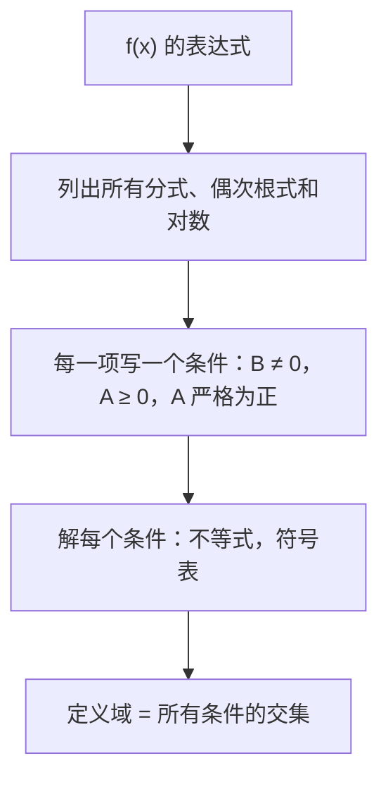
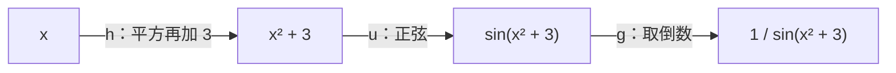

# 3. 函数：定义域、值域、复合、奇偶性与变换

> **目标**：求函数的定义域和值域，复合与分解函数，研究奇偶性，认出图像的变换，写出分段函数。这是「笔试 1」（2022）和 2023 年 11 月 TE 的核心内容。

---

## 1. 引言与定义

### 1.1 函数、定义域、值域

**函数** $$f$$ 把它的**定义域**（domaine de définition）$$D_f$$ 中的每个 $$x$$ 对应到**唯一的**实数 $$f(x)$$。

- **定义域** $$D_f$$：使 $$f(x)$$ 的计算有意义的 $$x$$ 的集合。
- **值域**（image）$$\operatorname{Im}(f)$$：$$f(x)$$ 实际取到的所有值的集合。
- **图像**（graphe）：点 $$(x; f(x))$$ 的集合。

**竖直线检验**：一条曲线是某个函数的图像，当且仅当每条竖直线与它**至多相交一次**。

### 1.2 定义域的三条禁令

| 表达式 | 条件 |
| --- | --- |
| $$\frac{A}{B}$$ | $$B \neq 0$$ |
| $$\sqrt{A}$$（以及所有偶次根式） | $$A \geq 0$$ |
| $$\ln(A)$$，$$\log_a(A)$$ | $$A > 0$$ |

多项式、$$e^x$$、$$a^x$$、$$\sin$$、$$\cos$$、**立方**根在**整个** $$\mathbb{R}$$ 上有定义。

### 1.3 复合

**复合函数** $$g \circ f$$（读作「$$g$$ 圈 $$f$$」）先作用 $$f$$，再作用 $$g$$：

$$(g \circ f)(x) = g\left(f(x)\right)$$

一般 $$g \circ f \neq f \circ g$$。**分解**一个函数，就是把它写成一串简单函数（对链式求导很有用）。

### 1.4 奇偶性

- 若对所有 $$x \in D_f$$ 有 $$f(-x) = f(x)$$，则 $$f$$ 是**偶函数**（paire）：图像**关于 $$Oy$$ 轴对称**（例：$$x^2$$，$$\cos x$$，$$\lvert x \rvert$$）。
- 若 $$f(-x) = -f(x)$$，则 $$f$$ 是**奇函数**（impaire）：图像**关于原点对称**（例：$$x^3$$，$$\sin x$$，$$\frac{1}{x}$$）。
- 定义域必须对称（$$x \in D_f \Rightarrow -x \in D_f$$）。
- 大多数函数**既不是奇函数也不是偶函数**。

运算规则：偶 × 偶 = 偶；奇 × 奇 = 偶；偶 × 奇 = 奇（就像符号 $$+$$ 和 $$-$$）。

### 1.5 图像的变换

从 $$y = f(x)$$ 的图像出发，$$c > 0$$：

| 新函数 | 对图像的作用 |
| --- | --- |
| $$f(x) + c$$ | 向**上**平移 $$c$$ |
| $$f(x) - c$$ | 向**下**平移 $$c$$ |
| $$f(x + c)$$ | 向**左**平移 $$c$$ |
| $$f(x - c)$$ | 向**右**平移 $$c$$ |
| $$-f(x)$$ | 关于 $$Ox$$ 轴对称 |
| $$f(-x)$$ | 关于 $$Oy$$ 轴对称 |
| $$a\,f(x)$$ | 竖直方向拉伸 $$a$$ 倍 |
| $$f(ax)$$ | 水平方向压缩 $$a$$ 倍 |

> 在 $$f(\dots)$$ **里面**的变换作用于 $$x$$，方向是「反的」：$$f(x + 3)$$ 向**左**平移。

### 1.6 一次函数与分段函数

过 $$(x_1; y_1)$$ 和 $$(x_2; y_2)$$ 的直线斜率为 $$m = \frac{y_2 - y_1}{x_2 - x_1}$$，方程为 $$y = m(x - x_1) + y_1$$。两条直线斜率相同则**平行**，$$m_1m_2 = -1$$ 则**垂直**。

**分段函数**（fonction définie par morceaux）在不同区间上用不同的公式：用大括号书写。

---

## 2. 解题方法

### 方法 A：定义域

### 方法 B：函数的值域

1. 从定义域的端点出发，跟踪每一步变换（夹逼）。
2. 或者画出图像，读出取到的纵坐标区间。

### 方法 C：奇偶性

1. 检查定义域是否对称。
2. 把**每个** $$x$$ 换成 $$(-x)$$ 计算 $$f(-x)$$，并化简。
3. 与 $$f(x)$$ 和 $$-f(x)$$ 比较。要证明「既非奇也非偶」，举一个数值反例就够了（例如 $$f(1)$$ 和 $$f(-1)$$）。

### 方法 D：求变换后曲线的表达式

在 $$f$$ 的图像和变换后的曲线上找一个特征点（顶点、零点、渐近线）：水平和竖直方向的偏移，以及是否「翻转」，就给出了公式。

---

## 3. 详细计算示例

### 示例 1：定义域（笔试 1，2022）

**i.** $$f_1(x) = \frac{7}{\sqrt{x - 3}}$$：分母有根式 → $$x - 3 > 0$$（严格，因为分母不能为零）。$$D = \left]3, +\infty\right[$$。

**ii.** $$f_2(x) = \frac{2x - 5}{3(x + 9)(x - 1)}$$：分母 $$\neq 0$$ → $$x \neq -9$$ 且 $$x \neq 1$$。$$D = \mathbb{R} \setminus \{-9, 1\}$$。

**iii.** $$f_3(x) = \ln\left(\frac{1}{x + 2}\right)$$：需要 $$x + 2 \neq 0$$ **且** $$\frac{1}{x + 2} > 0$$，即 $$x + 2 > 0$$。$$D = \left]-2, +\infty\right[$$。

**iv.** $$f_4(x) = 5^{3x + 1}$$：指数函数处处有定义。$$D = \mathbb{R}$$。

### 示例 2：定义域与值域（笔试 1，2022）

*画出 $$g(x) = -\sqrt{4 - x^2}$$ 的草图并求值域。*

- 定义域：$$4 - x^2 \geq 0 \iff x^2 \leq 4 \iff -2 \leq x \leq 2$$。
- $$y = \sqrt{4 - x^2}$$ 是圆心为 $$O$$、半径为 $$2$$ 的**上半圆**（因为 $$y^2 = 4 - x^2 \iff x^2 + y^2 = 4$$，$$y \geq 0$$）。
- 负号把它翻转：$$g$$ 是**下半圆**。
- 值域：$$\sqrt{4 - x^2}$$ 从 $$0$$ 变到 $$2$$，所以 $$g(x)$$ 从 $$-2$$ 变到 $$0$$。$$\operatorname{Im}(g) = [-2, 0]$$。

### 示例 3：复合（笔试 1，2022）

*$$f(x) = \sqrt{2x + 3}$$，$$g(x) = x^2 + 1$$。求 $$(f \circ g)(x)$$ 和 $$(g \circ f)(x)$$。*

$$(f \circ g)(x) = f\left(x^2 + 1\right) = \sqrt{2(x^2 + 1) + 3} = \sqrt{2x^2 + 5}$$

$$(g \circ f)(x) = g\left(\sqrt{2x + 3}\right) = \left(\sqrt{2x + 3}\right)^2 + 1 = 2x + 4$$

（最后一个等式在 $$f$$ 的定义域 $$x \geq -\frac{3}{2}$$ 上成立。）

*把 $$f(x) = \frac{1}{\sin(x^2 + 3)}$$ 分解为 $$g \circ u \circ h$$。* 按**从里到外**的顺序读运算：$$h(x) = x^2 + 3$$，然后 $$u(x) = \sin x$$，然后 $$g(x) = \frac{1}{x}$$。

### 示例 4：奇偶性（笔试 1，2022）

*a) $$f(x) = \frac{x^3 - 2x}{4\sin x}$$。* 定义域对称（$$\sin x \neq 0$$）。由 $$\sin(-x) = -\sin x$$：

$$f(-x) = \frac{(-x)^3 - 2(-x)}{4\sin(-x)} = \frac{-(x^3 - 2x)}{-4\sin x} = f(x)$$

$$f$$ 是**偶函数**（两个奇函数的商）。

*b) $$g(x) = 3x^2 - x^4 + 2x^5$$。* $$g(-x) = 3x^2 - x^4 - 2x^5$$，既不等于 $$g(x)$$，也不等于 $$-g(x) = -3x^2 + x^4 - 2x^5$$。反例：$$g(1) = 4$$，$$g(-1) = 0$$。$$g$$ **既非奇也非偶**。

### 示例 5：复合函数序列（TE，2025 年 11 月）

*$$f_0(x) = \frac{x}{x + 1}$$，$$f_{n+1} = f_0 \circ f_n$$。求 $$f_1$$、$$f_2$$、$$f_3$$，再求 $$f_n$$。*

$$f_1(x) = f_0\left(f_0(x)\right) = \frac{\frac{x}{x + 1}}{\frac{x}{x + 1} + 1} = \frac{\frac{x}{x + 1}}{\frac{2x + 1}{x + 1}} = \frac{x}{2x + 1}$$

同理：

$$f_2(x) = \frac{\frac{x}{2x + 1}}{\frac{x}{2x + 1} + 1} = \frac{x}{3x + 1} \qquad f_3(x) = \frac{x}{4x + 1}$$

猜出规律：$$f_n(x) = \frac{x}{(n + 1)x + 1}$$。（且 $$D_{f_0} = \mathbb{R}\setminus\{-1\}$$。）

### 示例 6：分段函数（TE，2023 年 11 月）

*图像由连接 $$(-2; 2)$$ 和 $$(-1; 0)$$ 的线段，以及圆心为 $$O$$、半径为 $$1$$ 的上半圆组成。*

- 线段：斜率 $$m = \frac{0 - 2}{-1 - (-2)} = -2$$；$$y = -2(x + 1) = -2x - 2$$。
- 上半圆：$$y = \sqrt{1 - x^2}$$，$$-1 \leq x \leq 1$$。

$$f(x) = \begin{cases} -2x - 2 & \text{若 } -2 \leq x < -1 \\ \sqrt{1 - x^2} & \text{若 } -1 \leq x \leq 1 \end{cases}$$

两段在 $$(-1; 0)$$ 处衔接：函数连续。

---

## 4. 可视化：读懂复合

---

## 5. 练习

### 练习 1：定义域

求定义域：a) $$f(x) = \sqrt{-x^2 + 6x - 8}$$；b) $$g(x) = \frac{1}{\sqrt{x^2 - 3x}}$$；c) $$h(x) = \ln(\ln(x) - 3)$$。

点击查看提示

a) 分解 $$-x^2 + 6x - 8 = -(x - 2)(x - 4)$$。b) 分母有根式：**严格**不等式。c) 两层对数：两个条件。

**详细解答**

a) $$-(x - 2)(x - 4) \geq 0 \iff (x - 2)(x - 4) \leq 0 \iff x \in [2, 4]$$。$$D_f = [2, 4]$$。

b) $$x^2 - 3x > 0 \iff x(x - 3) > 0 \iff x < 0$$ 或 $$x > 3$$。$$D_g = \left]-\infty, 0\right[ \cup \left]3, +\infty\right[$$。

c) $$x > 0$$ 且 $$\ln x - 3 > 0 \iff \ln x > 3 \iff x > e^3$$。$$D_h = \left]e^3, +\infty\right[$$。

### 练习 2：变换（笔试 1，2022）

图像 (b) 是 $$-f(x)$$ 的图像。图像 (a) 是 $$f$$ 的图像向左平移 4 个单位、向上平移 1 个单位；图像 (c) 是 $$f$$ 关于 $$Oy$$ 轴的对称图形再向下平移 2 个单位。写出 (a) 和 (c) 的方程。

点击查看提示

向左平移 4：$$f(x + 4)$$。关于 $$Oy$$ 轴对称：$$f(-x)$$。

**详细解答**

(a)：$$y = f(x + 4) + 1$$（水平平移在**里面**，竖直平移在**外面**）。

(c)：$$y = f(-x) - 2$$。

用一个点检验：若 $$f$$ 的顶点在 $$(1; 3)$$，则 (a) 的顶点在 $$(1 - 4; 3 + 1) = (-3; 4)$$，(c) 的顶点在 $$(-1; 1)$$。

### 练习 3：奇偶性与复合

a) 研究 $$f(x) = x^2\sin(x) + \tan(x)$$ 的奇偶性。b) 对 $$f(x) = \cos x$$ 和 $$g(x) = \frac{1}{x}$$，求 $$f \circ g$$、$$g \circ f$$ 和 $$f \circ f$$。

点击查看提示

a) $$x^2$$ 是偶函数，$$\sin$$ 和 $$\tan$$ 是奇函数。b) 用定义 $$(g \circ f)(x) = g(f(x))$$。

**详细解答**

a) $$f(-x) = (-x)^2\sin(-x) + \tan(-x) = -x^2\sin x - \tan x = -f(x)$$：$$f$$ 是**奇函数**。

b) $$(f \circ g)(x) = \cos\left(\frac{1}{x}\right)$$；$$(g \circ f)(x) = \frac{1}{\cos x} = \sec x$$；$$(f \circ f)(x) = \cos(\cos x)$$。
