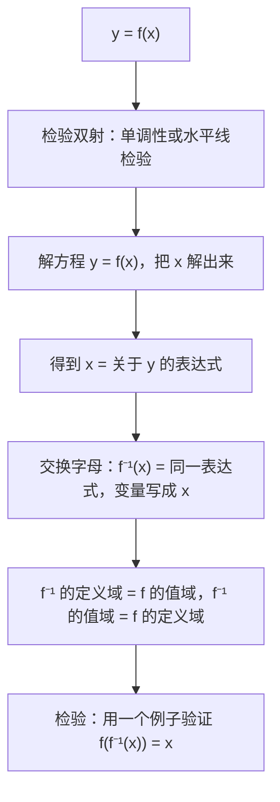
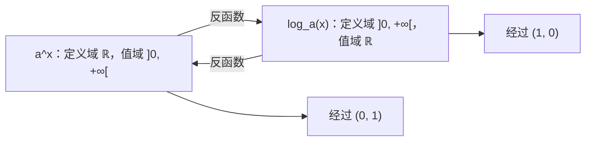

# 4. 反函数、指数函数与对数函数

> **目标**：知道函数何时有反函数并把它求出来（连同定义域和值域），解指数方程和对数方程，包括应用模型（里氏震级、电容器充电）。对应「笔试 1」的最后部分和 11 月的 TE。

---

## 1. 引言与定义

### 1.1 双射与反函数

若 $$B$$ 中**每个** $$y$$ 都被 $$A$$ 中**恰好一个** $$x$$ 取到，函数 $$f : A \to B$$ 就是**双射**（bijective）。这时它有一个**反函数**（fonction réciproque）$$f^{-1} : B \to A$$，满足：

$$y = f(x) \iff x = f^{-1}(y) \qquad f^{-1}\left(f(x)\right) = x \qquad f\left(f^{-1}(y)\right) = y$$

- **水平线检验**：若每条水平线与图像**至多相交一次**，则 $$f$$ 是单射（在它的值域上是双射）。严格单调的函数一定通过这个检验。
- $$f^{-1}$$ 的定义域是 $$f$$ 的**值域**，$$f^{-1}$$ 的值域是 $$f$$ 的**定义域**。
- $$f^{-1}$$ 的图像是 $$f$$ 的图像关于直线 $$y = x$$ 的对称图形。

> $$f^{-1}(x)$$ **不是** $$\frac{1}{f(x)}$$ 的意思。

### 1.2 指数与对数

对 $$a > 0$$，$$a \neq 1$$，函数 $$x \mapsto a^x$$ 是从 $$\mathbb{R}$$ 到 $$\left]0, +\infty\right[$$ 的双射。它的反函数是**以 $$a$$ 为底的对数**：

$$y = a^x \iff x = \log_a(y) \qquad (y > 0)$$

特例：$$\ln = \log_e$$（底为 $$e \approx 2{,}718$$）和 $$\log_{10}$$。

**运算规则**（$$x, y > 0$$）：

| 指数 | 对数 |
| --- | --- |
| $$a^x a^y = a^{x + y}$$ | $$\log_a(xy) = \log_a x + \log_a y$$ |
| $$\frac{a^x}{a^y} = a^{x - y}$$ | $$\log_a\frac{x}{y} = \log_a x - \log_a y$$ |
| $$(a^x)^y = a^{xy}$$ | $$\log_a(x^y) = y\log_a x$$ |
| $$a^0 = 1$$ | $$\log_a 1 = 0$$ 且 $$\log_a a = 1$$ |

**换底公式**：$$\log_a x = \frac{\ln x}{\ln a}$$，$$a^x = e^{x\ln a}$$。

> $$\log_a(x + y) \neq \log_a x + \log_a y$$：和的对数**没有**公式。

---

## 2. 解题方法

### 方法 A：求反函数

### 方法 B：指数方程

1. 如果可以，把两边写成**同底的幂**：$$a^{A} = a^{B} \iff A = B$$。
2. 否则先**分离出**幂，再两边取 $$\ln$$：$$e^{A} = c \iff A = \ln c$$（若 $$c > 0$$；若 $$c \leq 0$$ 则无解）。

### 方法 C：对数方程

1. **先求定义域**：每个对数的真数必须 $$> 0$$。
2. 用运算规则把每一边合并成**一个对数**。
3. 化成指数形式：$$\log_a(A) = c \iff A = a^c$$。
4. 求解，然后**舍去**不在定义域中的解。

---

## 3. 详细计算示例

### 示例 1：分式线性函数的反函数（笔试 1，2022）

*$$g : \mathbb{R}\setminus\left\{\frac{3}{2}\right\} \to \mathbb{R}\setminus\left\{\frac{5}{2}\right\}$$，$$g(x) = \frac{5x - 7}{2x - 3}$$ 是双射。求 $$g^{-1}$$。*

解关于 $$x$$ 的方程 $$y = \frac{5x - 7}{2x - 3}$$：

$$y(2x - 3) = 5x - 7 \iff 2xy - 3y = 5x - 7 \iff 2xy - 5x = 3y - 7 \iff x(2y - 5) = 3y - 7$$

$$x = \frac{3y - 7}{2y - 5}$$

交换变量名：

$$g^{-1}(x) = \frac{3x - 7}{2x - 5}, \qquad D_{g^{-1}} = \mathbb{R}\setminus\left\{\frac{5}{2}\right\}$$

一致：$$g^{-1}$$ 的定义域正是 $$g$$ 的值域。

### 示例 2：含根式的反函数（笔试 1，2022）

*$$h : [3, +\infty[ \to \operatorname{Im}(h)$$，$$h(x) = \sqrt{x - 3} - 5$$。*

- $$h$$ 是平方根函数向右平移 3、向下平移 5：它**严格递增**，所以通过水平线检验。$$\operatorname{Im}(h) = [-5, +\infty[$$。
- $$y = \sqrt{x - 3} - 5 \iff y + 5 = \sqrt{x - 3} \iff (y + 5)^2 = x - 3$$（因为 $$y + 5 \geq 0$$，所以可以平方）$$\iff x = (y + 5)^2 + 3$$。

$$h^{-1}(x) = (x + 5)^2 + 3 = x^2 + 10x + 28, \qquad h^{-1} : [-5, +\infty[ \to [3, +\infty[$$

### 示例 3：嵌套对数的反函数（TE，2025 年 11 月）

*$$f(x) = \ln(\ln(x) - 3)$$。*

- 定义域：$$x > 0$$ 且 $$\ln x > 3$$，即 $$D_f = \left]e^3, +\infty\right[$$。
- $$y = \ln(\ln x - 3) \iff e^y = \ln x - 3 \iff \ln x = e^y + 3 \iff x = e^{e^y + 3}$$。

$$f^{-1}(x) = e^{e^x + 3}, \qquad D_{f^{-1}} = \mathbb{R}$$

### 示例 4：方程（笔试 1，2022）

**b)** $$4^{x^2 + x} = 16$$。同底：$$16 = 4^2$$，所以 $$x^2 + x = 2 \iff x^2 + x - 2 = 0 \iff (x + 2)(x - 1) = 0$$。$$S = \{-2; 1\}$$。

**c)** $$e^{2x + 3} - 7 = 0 \iff e^{2x + 3} = 7 \iff 2x + 3 = \ln 7 \iff x = \frac{\ln 7 - 3}{2} \approx -0{,}527$$。

**d)** $$\log_3(2x + 1) - 2\log_3(x - 3) = 2$$。

1. 定义域：$$2x + 1 > 0$$ 且 $$x - 3 > 0$$，即 $$x > 3$$。
2. 合并成一个对数：$$2\log_3(x - 3) = \log_3\left((x - 3)^2\right)$$，所以 $$\log_3\frac{2x + 1}{(x - 3)^2} = 2$$。
3. 化成以 3 为底的指数：$$\frac{2x + 1}{(x - 3)^2} = 9 \iff 2x + 1 = 9(x^2 - 6x + 9) \iff 9x^2 - 56x + 80 = 0$$。
4. $$\Delta = 3136 - 2880 = 256$$：$$x = \frac{56 \pm 16}{18}$$，即 $$x = 4$$ 或 $$x = \frac{20}{9} \approx 2{,}2$$。
5. $$\frac{20}{9} < 3$$ **不在定义域中**：舍去。$$S = \{4\}$$。

### 示例 5：里氏震级（TE，2025 年 11 月）

*$$M = \frac{\log_{10}(E) - 11{,}4}{1{,}5}$$（$$E$$ 的单位为焦耳）。a) 用 $$M$$ 表示 $$E$$。b) 6 级地震比 4 级地震多释放多少能量？*

a) $$1{,}5M = \log_{10}E - 11{,}4 \iff \log_{10}E = 1{,}5M + 11{,}4 \iff E = 10^{1{,}5M + 11{,}4}$$。

b) 能量的**比值**：

$$\frac{E(6)}{E(4)} = \frac{10^{1{,}5\cdot 6 + 11{,}4}}{10^{1{,}5\cdot 4 + 11{,}4}} = 10^{1{,}5\cdot 2} = 10^3 = 1000$$

6 级地震释放的能量是 4 级的 **1000 倍**。用绝对值表示，差为 $$E(6) - E(4) = 10^{20{,}4} - 10^{17{,}4} \approx 2{,}51\cdot 10^{20}$$ J。

### 示例 6：电容器充电（TE，2022）

*$$Q(t) = Q_0\left(1 - e^{-t/a}\right)$$，$$a > 0$$。写出反函数并解释它。*

$$\frac{Q}{Q_0} = 1 - e^{-t/a} \iff e^{-t/a} = 1 - \frac{Q}{Q_0} \iff -\frac{t}{a} = \ln\left(1 - \frac{Q}{Q_0}\right) \iff t = -a\ln\left(1 - \frac{Q}{Q_0}\right)$$

这个函数给出达到电荷 $$Q$$ 所**需要的时间**（$$0 \leq Q < Q_0$$）。

---

## 4. 可视化：指数与对数互为「镜像」

---

## 5. 练习

### 练习 1：（笔试 1，2022）

函数 $$f(x) = 2\log_3(x)$$，从 $$\left]0, +\infty\right[$$ 到 $$\mathbb{R}$$，是双射。求 $$f^{-1}$$、它的定义域和值域。

点击查看提示

先分离出 $$\log_3(x) = \frac{y}{2}$$，再化成以 $$3$$ 为底的指数。

**详细解答**

1. $$y = 2\log_3 x \iff \log_3 x = \frac{y}{2} \iff x = 3^{y/2}$$。
2. $$f^{-1}(x) = 3^{x/2} = \left(\sqrt{3}\right)^x$$。
3. $$D_{f^{-1}} = \mathbb{R}$$（$$f$$ 的值域），$$\operatorname{Im}(f^{-1}) = \left]0, +\infty\right[$$（$$f$$ 的定义域）。

### 练习 2：方程

解：a) $$2^{2x + 1} = 3\cdot 2^x + 2$$；b) $$\ln(x) + \ln(x + 2) = \ln(8)$$；c) $$e^{2x} - 5e^x + 6 = 0$$。

点击查看提示

a) 和 c)：令 $$u = 2^x$$（或 $$u = e^x$$），得到关于 $$u$$ 的二次方程，且 $$u > 0$$。b) 先求定义域，再用 $$\ln A + \ln B = \ln(AB)$$。

**详细解答**

a) $$2^{2x + 1} = 2\cdot(2^x)^2$$。令 $$u = 2^x > 0$$：$$2u^2 - 3u - 2 = 0$$，$$\Delta = 9 + 16 = 25$$，$$u = \frac{3 \pm 5}{4}$$，即 $$u = 2$$ 或 $$u = -\frac{1}{2}$$（舍去，因为 $$u > 0$$）。$$2^x = 2 \iff x = 1$$。

b) 定义域：$$x > 0$$。$$\ln\left(x(x + 2)\right) = \ln 8 \iff x^2 + 2x - 8 = 0 \iff (x + 4)(x - 2) = 0$$。$$x = -4$$ 不在定义域中。$$S = \{2\}$$。

c) $$u = e^x > 0$$：$$u^2 - 5u + 6 = 0 \iff u = 2$$ 或 $$u = 3$$。所以 $$x = \ln 2$$ 或 $$x = \ln 3$$。

### 练习 3：冷却模型

一杯咖啡的温度满足 $$T(t) = 20 + 70e^{-0{,}05t}$$（$$t$$ 以分钟计，$$T$$ 以 °C 计）。a) 初始温度？b) 多久之后咖啡降到 $$50$$ °C？c) 用 $$T$$ 表示 $$t$$。

点击查看提示

先分离出指数，再取 $$\ln$$。

**详细解答**

a) $$T(0) = 20 + 70 = 90$$ °C。

b) $$50 = 20 + 70e^{-0{,}05t} \iff e^{-0{,}05t} = \frac{30}{70} = \frac{3}{7} \iff -0{,}05t = \ln\frac{3}{7} \iff t = 20\ln\frac{7}{3} \approx 16{,}9$$ 分钟。

c) $$e^{-0{,}05t} = \frac{T - 20}{70} \iff t = -20\ln\left(\frac{T - 20}{70}\right) = 20\ln\left(\frac{70}{T - 20}\right)$$，其中 $$20 < T \leq 90$$。
