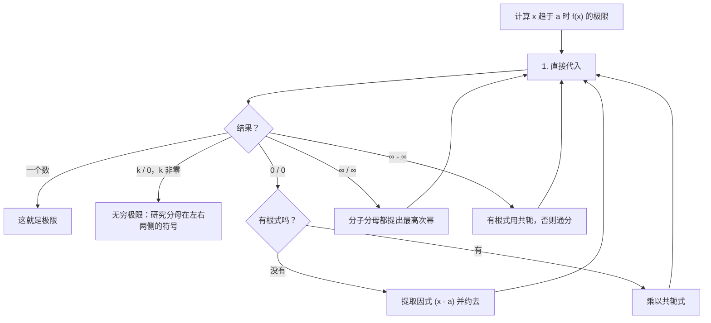
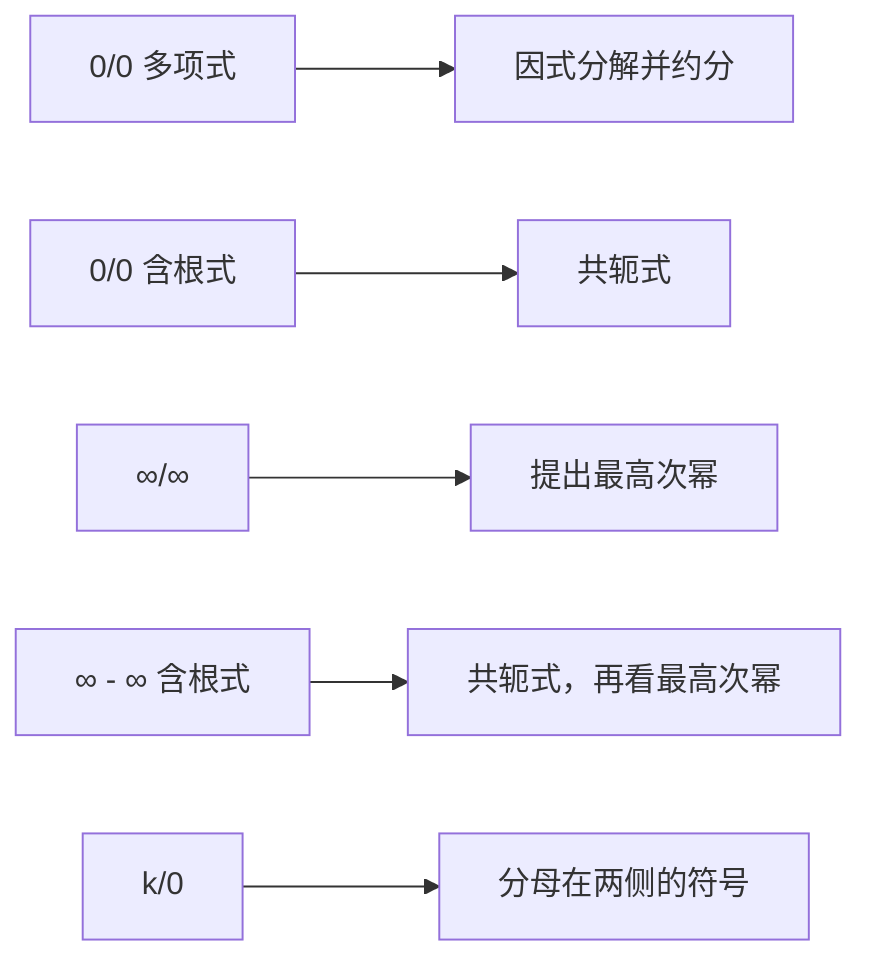

# 5. 极限与渐近线

> **目标**：从图像上读极限，通过消除不定式（$$\frac{0}{0}$$、$$\frac{\infty}{\infty}$$、$$\infty - \infty$$、$$\frac{k}{0}$$）计算极限，求渐近线，并根据极限条件画出函数草图。它出现在分析**所有**的 TE 1 和 TE 2 中（「极限计算」、「图像极限」）。

> 常见要求：「不允许使用洛必达法则」（« il n'est pas autorisé d'utiliser la règle de l'Hospital »）。下面所有方法都是**代数**方法。

---

## 1. 引言与定义

### 1.1 极限的概念

$$\lim_{x \to a} f(x) = L$$ 的意思是：**当 $$x$$ 接近 $$a$$**（不一定到达）**时，$$f(x)$$ 接近 $$L$$**。$$f(a)$$ 本身的值无关紧要（它甚至可以不存在）。

### 1.2 单侧极限

- $$\lim_{x \to a^-} f(x)$$：$$x$$ **从左边**接近 $$a$$（$$x < a$$）。
- $$\lim_{x \to a^+} f(x)$$：$$x$$ **从右边**接近 $$a$$（$$x > a$$）。

> （双侧）极限存在**当且仅当**两个单侧极限都存在且**相等**。

### 1.3 无穷极限与在无穷远处的极限

- $$\lim_{x \to a} f(x) = +\infty$$：$$f(x)$$ 变得任意大。一定要写 **$$+\infty$$ 或 $$-\infty$$**，不要写不带符号的「$$\infty$$」。
- $$\lim_{x \to +\infty} f(x) = L$$：$$x$$ 变得很大时的行为。

### 1.4 渐近线

| 类型 | 条件 | 方程 |
| --- | --- | --- |
| 竖直渐近线 | $$\lim_{x \to a^\pm} f(x) = \pm\infty$$ | $$x = a$$ |
| 水平渐近线 | $$\lim_{x \to \pm\infty} f(x) = L$$ | $$y = L$$ |
| 斜渐近线 | $$\lim_{x \to \pm\infty}\left[f(x) - (mx + p)\right] = 0$$ | $$y = mx + p$$ |

竖直渐近线要在**禁止值**处找（分母为零但分子**不**为零的点）。

### 1.5 运算规则与不定式

若 $$f$$ 在 $$a$$ 处连续（多项式、非禁止值处的分式、根式、指数、对数……），就**直接代入**：$$\lim_{x \to a} f(x) = f(a)$$。

下面的形式是**确定的**（$$k$$ 为非零实数）：

$$\frac{k}{\pm\infty} = 0 \qquad \frac{k}{0^{\pm}} = \pm\infty \text{（符号法则）} \qquad +\infty + \infty = +\infty \qquad k\cdot\infty = \pm\infty$$

**不定式**需要代数处理：

$$\frac{0}{0} \qquad \frac{\infty}{\infty} \qquad \infty - \infty \qquad 0\cdot\infty$$

---

## 2. 解题方法

### 决策树

### 方法 A：多项式的 $$\frac{0}{0}$$

若 $$P(a) = 0$$ 且 $$Q(a) = 0$$，则 $$(x - a)$$ 同时整除 $$P$$ **和** $$Q$$（因式定理，第 2 章）。因式分解，约分，再代入。

### 方法 B：含根式的 $$\frac{0}{0}$$ 或 $$\infty - \infty$$：共轭式

利用 $$(\sqrt{A} - \sqrt{B})(\sqrt{A} + \sqrt{B}) = A - B$$：分子**和**分母同乘共轭式（expression conjuguée），消去「麻烦」的根式。

### 方法 C：有理分式的 $$\frac{\infty}{\infty}$$（在 $$\pm\infty$$ 处）

提出最高次幂。要记住的结果（$$a_n$$、$$b_m$$ 为首项系数）：

| 次数 | $$\lim_{x \to \pm\infty}\frac{a_nx^n + \dots}{b_mx^m + \dots}$$ |
| --- | --- |
| $$n < m$$ | $$0$$ |
| $$n = m$$ | $$\frac{a_n}{b_m}$$（水平渐近线） |
| $$n > m$$ | $$\pm\infty$$（需要研究符号） |

### 方法 D：$$\frac{k}{0}$$：研究符号

在**每一侧**判断分母趋于 $$0^+$$ 还是 $$0^-$$，看每个因式的符号。

### 方法 E：有界函数

$$\sin x$$ 和 $$\cos x$$ 始终在 $$-1$$ 和 $$1$$ 之间：与趋于无穷的项相比，它们可以**忽略**。

---

## 3. 详细计算示例

### 示例 1：从图上读（TE 1，2024）

*在一个图像上：在 $$x = -1$$ 附近，曲线从两侧都到达高度 $$1$$（另外有一个孤立点）；在 $$x = 1$$ 处有跳跃；在 $$x = 2$$ 处有竖直渐近线，曲线在两侧都跌向 $$-\infty$$。*

- $$\lim_{x \to -1} f(x) = 1$$：两侧到达同一高度，与 $$f(-1)$$ 的值无关。
- $$\lim_{x \to 1} f(x)$$ **不存在**：左右极限不同（跳跃）。
- $$\lim_{x \to 2^+} f(x) = -\infty$$。

### 示例 2：无穷极限（TE 2，2024）

$$\lim_{x \to -1^+}\frac{4x^2 - 5x + 7}{x + 1}$$

代入：分子 $$\to 4 + 5 + 7 = 16$$；分母 $$\to 0$$。形式为 $$\frac{16}{0}$$。当 $$x > -1$$ 时，$$x + 1 > 0$$：分母趋于 $$0^+$$。

$$\lim_{x \to -1^+}\frac{4x^2 - 5x + 7}{x + 1} = \frac{16}{0^+} = +\infty$$

### 示例 3：多项式的 $$\frac{0}{0}$$（TE 2，2024）

$$\lim_{x \to -2}\frac{2x^2 + 5x + 2}{-2 - x}$$

代入：$$\frac{8 - 10 + 2}{0} = \frac{0}{0}$$。因式分解：$$2x^2 + 5x + 2 = (x + 2)(2x + 1)$$，$$-2 - x = -(x + 2)$$：

$$\lim_{x \to -2}\frac{(x + 2)(2x + 1)}{-(x + 2)} = \lim_{x \to -2}-(2x + 1) = -(-4 + 1) = 3$$

### 示例 4：共轭式（TE 2，2024）

$$\lim_{x \to -3}\frac{\sqrt{2x + 7} - \sqrt{4 + x}}{x + 3}$$

代入：$$\frac{\sqrt{1} - \sqrt{1}}{0} = \frac{0}{0}$$。乘以共轭式 $$\sqrt{2x + 7} + \sqrt{4 + x}$$：

$$= \lim_{x \to -3}\frac{(2x + 7) - (4 + x)}{(x + 3)\left(\sqrt{2x + 7} + \sqrt{4 + x}\right)} = \lim_{x \to -3}\frac{x + 3}{(x + 3)\left(\sqrt{2x + 7} + \sqrt{4 + x}\right)}$$

$$= \frac{1}{\sqrt{1} + \sqrt{1}} = \frac{1}{2}$$

### 示例 5：分子乘以共轭式（笔试 2，2022）

$$\lim_{x \to -2}\frac{3 - \sqrt{x^2 + 5}}{3x + 6}$$

形式 $$\frac{0}{0}$$。共轭式 $$3 + \sqrt{x^2 + 5}$$：

$$= \lim_{x \to -2}\frac{9 - (x^2 + 5)}{3(x + 2)\left(3 + \sqrt{x^2 + 5}\right)} = \lim_{x \to -2}\frac{(2 - x)(2 + x)}{3(x + 2)\left(3 + \sqrt{x^2 + 5}\right)} = \frac{4}{3\cdot 6} = \frac{2}{9}$$

### 示例 6：$$\frac{\infty}{\infty}$$（TE 2，2024 和 TE 2025）

$$\lim_{x \to -\infty}\frac{(3x + 2)(x^2 - 4x + 3)}{5x^3 - x}$$

分子和分母都是 3 次；首项系数分别为 $$3\cdot 1 = 3$$ 和 $$5$$。详细写：

$$= \lim_{x \to -\infty}\frac{x^3\left(3 + \frac{2}{x}\right)\left(1 - \frac{4}{x} + \frac{3}{x^2}\right)}{x^3\left(5 - \frac{1}{x^2}\right)} = \frac{3\cdot 1}{5} = \frac{3}{5}$$

同样 $$\lim_{x \to +\infty}\frac{8x^2 + 2}{-x^2 + x + 1} = \frac{8}{-1} = -8$$。

### 示例 7：$$\infty - \infty$$（TE，2023 年 11 月）

$$\lim_{x \to +\infty}\left(\sqrt{x^2 + 2x} - x\right)$$

共轭式：

$$= \lim_{x \to +\infty}\frac{(x^2 + 2x) - x^2}{\sqrt{x^2 + 2x} + x} = \lim_{x \to +\infty}\frac{2x}{x\left(\sqrt{1 + \frac{2}{x}} + 1\right)} = \frac{2}{1 + 1} = 1$$

（对 $$x > 0$$，$$\sqrt{x^2} = x$$。）

### 示例 8：有界函数（笔试 2，2022）

$$\lim_{x \to +\infty}\frac{3x^2 + 4}{5x^2 + \sin x} = \lim_{x \to +\infty}\frac{3 + \frac{4}{x^2}}{5 + \frac{\sin x}{x^2}} = \frac{3}{5}$$

因为 $$-\frac{1}{x^2} \leq \frac{\sin x}{x^2} \leq \frac{1}{x^2}$$，所以 $$\frac{\sin x}{x^2} \to 0$$。

### 示例 9：求参数（TE，2025 年 11 月）

*$$f(x) = ax + \frac{2}{x - b}$$。已知 $$\lim_{x \to 3^-} f(x) = -\infty$$ 且 $$\lim_{x \to 5} f(x) = 11$$，求 $$a$$ 和 $$b$$。*

1. 在 $$3$$ 处的无穷极限只能来自分式：必须在 $$x = 3$$ 时 $$x - b \to 0$$，所以 $$b = 3$$。验证：当 $$x < 3$$ 时 $$x - 3 \to 0^-$$，$$\frac{2}{0^-} = -\infty$$ ✓。
2. $$\lim_{x \to 5} f(x) = 5a + \frac{2}{5 - 3} = 5a + 1 = 11$$，所以 $$a = 2$$。

### 示例 10：渐近线（笔试 2，2022）

*$$f(x) = \frac{3x^2 + x - 4}{(x + 1)^2}$$。*

- 定义域：$$\mathbb{R}\setminus\{-1\}$$。在 $$x = -1$$ 处：分子 $$3 - 1 - 4 = -4 \neq 0$$，分母 $$\to 0^+$$（平方）。两侧都有 $$\lim_{x \to -1} f(x) = \frac{-4}{0^+} = -\infty$$：**竖直渐近线** $$x = -1$$。
- 次数相同，首项系数 $$3$$ 和 $$1$$：$$\lim_{x \to \pm\infty} f(x) = 3$$：**水平渐近线** $$y = 3$$。

---

## 4. 可视化：不定式及其对策

---

## 5. 练习

### 练习 1：（笔试 2，2022）

不用洛必达法则计算：a) $$\lim_{x \to 4}\frac{x^2 - 4x}{x^2 - 3x - 4}$$；b) $$\lim_{x \to 5^+}\frac{7}{x^2 - 3x - 10}$$；c) $$\lim_{x \to -\infty}\frac{7x^3 + 2x^2 + x}{3x^2 - 5x + 1}$$。

点击查看提示

a) $$\frac{0}{0}$$ 型：因式分解。b) 分母分解为 $$(x - 5)(x + 2)$$，研究它在 $$5$$ 右侧的符号。c) 分子次数高于分母。

**详细解答**

a) $$\frac{x(x - 4)}{(x - 4)(x + 1)} = \frac{x}{x + 1} \to \frac{4}{5}$$。

b) 当 $$x > 5$$：$$x - 5 \to 0^+$$，$$x + 2 \to 7 > 0$$，分母趋于 $$0^+$$：极限为 $$\frac{7}{0^+} = +\infty$$。

c) $$\frac{x^3\left(7 + \frac{2}{x} + \frac{1}{x^2}\right)}{x^2\left(3 - \frac{5}{x} + \frac{1}{x^2}\right)} = x\cdot\frac{7 + \dots}{3 - \dots}$$。当 $$x \to -\infty$$ 时，它的行为像 $$\frac{7}{3}x \to -\infty$$。

### 练习 2：（TE，2023 年 11 月）

计算：a) $$\lim_{x \to 0}\frac{\sqrt{x^2 + 4} + 1}{2x + 1}$$；b) $$\lim_{x \to 1}\frac{2x^2 + x - 3}{1 - x}$$；c) $$\lim_{x \to -\infty}\frac{2x + 7x^2 - 3x^5}{x^2 + 3x^6}$$。

点击查看提示

a) 先试试直接代入！b) $$x = 1$$ 使分子为零。c) 比较次数。

**详细解答**

a) 不是不定式：$$\frac{\sqrt{4} + 1}{1} = 3$$。

b) $$2x^2 + x - 3 = (x - 1)(2x + 3)$$，$$1 - x = -(x - 1)$$：极限为 $$-(2 + 3) = -5$$。

c) 分子 5 次，分母 6 次：极限为 $$0$$。

### 练习 3：渐近线与草图（TE 2，2019）

设 $$f(x) = \frac{3 - x}{4 + x}$$。a) 求渐近线。b) 用定义（第 7 章）计算 $$f'(x)$$ 或验证它的符号，并画出图像草图。

点击查看提示

禁止值 $$x = -4$$；研究 $$\frac{7}{0^\pm}$$ 的符号。在 $$\pm\infty$$ 处次数相同。

**详细解答**

a) 在 $$x = -4$$ 处：分子 $$\to 7$$。

- $$\lim_{x \to -4^+} f(x) = \frac{7}{0^+} = +\infty$$，$$\lim_{x \to -4^-} f(x) = \frac{7}{0^-} = -\infty$$：**竖直渐近线** $$x = -4$$。
- $$\lim_{x \to \pm\infty}\frac{-x + 3}{x + 4} = \frac{-1}{1} = -1$$：**水平渐近线** $$y = -1$$。

b) $$f'(x) = \frac{-(4 + x) - (3 - x)}{(4 + x)^2} = \frac{-7}{(4 + x)^2} < 0$$：$$f$$ 在定义域的每个区间上递减。草图：一条双曲线，右支从 $$+\infty$$（靠近 $$x = -4$$）下降到 $$-1$$，经过 $$(3; 0)$$ 和 $$\left(0; \frac{3}{4}\right)$$；左支从 $$-1$$（在 $$-\infty$$ 处）下降到 $$-\infty$$（靠近 $$x = -4$$）。
