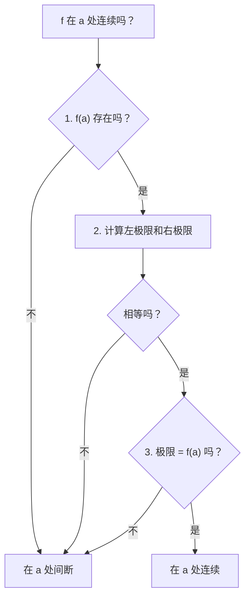
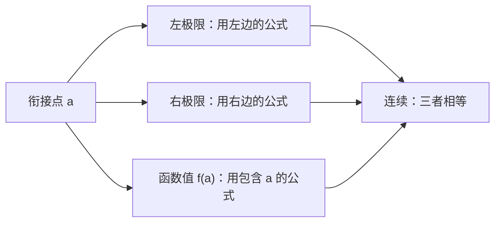

# 6. 连续性

> **目标**：用定义说明函数在某点是否连续，从图像上读出连续区间，并**求参数**使分段函数连续。对应 TE 2 的「问题 4. 连续性」以及笔试 2（2022）的练习 2。

---

## 1. 引言与定义

### 1.1 定义

直观地说，如果**不用抬笔**就能画出函数的图像，函数就是**连续的**（continue）。正式地：

> $$f$$ **在 $$a$$ 处连续**，当且仅当以下**三个条件**同时成立：
> 1. $$f(a)$$ 存在（$$a \in D_f$$）；
> 2. $$\lim_{x \to a} f(x)$$ 存在（左极限等于右极限）；
> 3. $$\lim_{x \to a} f(x) = f(a)$$。

若 $$f$$ 在区间上的每一点都连续，则称 $$f$$ **在该区间上连续**（在闭区间的端点处用相应的单侧极限）。

### 1.2 间断点的类型

| 类型 | 问题所在 | 图像 |
| --- | --- | --- |
| **跳跃** | 左右极限不同 | 曲线「跳」了一下 |
| **洞**（可去间断点） | 极限存在，但 $$f(a)$$ 不存在或不同 | 一个「移位」或缺失的点 |
| **无穷** | 某个单侧极限为无穷 | 竖直渐近线 |

### 1.3 「标准」连续函数

在**各自的定义域上**连续的有：多项式、有理分式、根式、$$e^x$$、$$\ln x$$、$$\sin$$、$$\cos$$、$$\tan$$，以及它们的和、积、商与复合。所以对**分段函数**，只需研究**衔接点**。

### 1.4 连续与可导

在 $$a$$ 处可导的函数一定在 $$a$$ 处连续。反之不成立：$$\lvert x \rvert$$ 在 $$0$$ 处连续，但有一个**角点**（没有唯一的切线）。

---

## 2. 解题方法

### 方法 A：说明在某点连续

答题要求：明确写出三个量 $$f(a)$$、$$\lim_{x \to a^-} f(x)$$、$$\lim_{x \to a^+} f(x)$$，再下结论。

### 方法 B：分段函数的参数

1. 对每个衔接点 $$a$$：用左边的公式算左极限，用右边的公式算右极限，用包含 $$a$$ 的公式算 $$f(a)$$。
2. 写出**等式**（每个衔接点一个或两个方程）。
3. 解关于参数的方程组。

### 方法 C：从图像读连续区间

找出所有「有问题」的点（跳跃、洞、渐近线、孤立点）。连续区间在这些点处断开；若函数在端点有定义，并且图像从区间内部「到达」这个实心点，则该端点是**闭**的。

---

## 3. 详细计算示例

### 示例 1：两个参数，一个衔接点（TE 2，2019）

*求 $$a$$ 和 $$b$$，使 $$f$$ 在 $$x = 1$$ 处连续：*

$$f(x) = \begin{cases} x^2 + b & \text{若 } x < 1 \\ 3 & \text{若 } x = 1 \\ ax + b & \text{若 } x > 1 \end{cases}$$

1. $$f(1) = 3$$。
2. 左侧：$$\lim_{x \to 1^-}(x^2 + b) = 1 + b$$。需要 $$1 + b = 3$$，所以 $$b = 2$$。
3. 右侧：$$\lim_{x \to 1^+}(ax + b) = a + b$$。需要 $$a + b = 3$$，所以 $$a = 1$$。

### 示例 2：在 $$\mathbb{R}$$ 上连续（笔试 2，2022）

*求 $$A$$ 和 $$B$$，使 $$f$$ 在 $$\mathbb{R}$$ 上连续：*

$$f(x) = \begin{cases} Ax + 3 & \text{若 } x < 1 \\ 2 & \text{若 } x = 1 \\ x^2 + B & \text{若 } x > 1 \end{cases}$$

每一段都是多项式，因此连续；只有 $$x = 1$$ 需要检查。需要 $$\lim_{1^-} = f(1) = \lim_{1^+}$$：

$$A + 3 = 2 \Rightarrow A = -1 \qquad 1 + B = 2 \Rightarrow B = 1$$

### 示例 3：可去间断点（TE，2022）

*当 $$x \neq 1$$ 时 $$f(x) = \frac{x^2 - x}{x^2 - 1}$$，且 $$f(1) = 0$$。$$f$$ 在 $$x = 1$$ 处连续吗？*

1. $$f(1) = 0$$ 存在。
2. $$\lim_{x \to 1}\frac{x(x - 1)}{(x - 1)(x + 1)} = \lim_{x \to 1}\frac{x}{x + 1} = \frac{1}{2}$$（极限存在）。
3. $$\frac{1}{2} \neq 0 = f(1)$$：**$$f$$ 在 $$1$$ 处不连续**。这是一个「洞」：若令 $$f(1) = \frac{1}{2}$$，它就变成连续的。

### 示例 4：两个衔接点，方程组（TE，2020）

*求 $$a$$ 和 $$b$$，使 $$f$$ 在 $$\mathbb{R}$$ 上连续：*

$$f(x) = \begin{cases} \frac{x^2 - 4}{x - 2} & \text{若 } x < 2 \\ ax^2 - bx + 3 & \text{若 } 2 \leq x < 3 \\ 2x - a + b & \text{若 } x \geq 3 \end{cases}$$

**在 2 处衔接**：$$\lim_{x \to 2^-}\frac{(x - 2)(x + 2)}{x - 2} = 4$$，$$f(2) = 4a - 2b + 3$$。所以 $$4a - 2b + 3 = 4$$，即 $$4a - 2b = 1$$。

**在 3 处衔接**：$$\lim_{x \to 3^-}(ax^2 - bx + 3) = 9a - 3b + 3$$，$$f(3) = 6 - a + b$$。所以 $$9a - 3b + 3 = 6 - a + b$$，即 $$10a - 4b = 3$$。

**方程组**：第 1 个方程乘以 $$2$$：$$8a - 4b = 2$$。用第 2 个方程减去它：$$2a = 1$$，所以 $$a = \frac{1}{2}$$，再由 $$4\cdot\frac{1}{2} - 2b = 1 \Rightarrow b = \frac{1}{2}$$。

### 示例 5：读图（TE，2025 年 11 月）

*在 $$g$$ 的图像上：$$x = -2$$ 处有跳跃（下方有一个孤立的实心点）；在 $$x = 2$$ 处，左边的曲线到达一个空心圆，右边的曲线从更低处的实心点出发；$$x = 4$$ 处有竖直渐近线；$$x = 6$$ 处有一个洞，另有一个孤立点；曲线在 $$x = 8$$ 处以空心圆结束。*

连续区间：$$[-4, -2[$$；$$]-2, 2[$$；$$[2, 4[$$；$$]4, 6[$$；$$]6, 8[$$。

端点的理由：在 $$-2$$ 和 $$6$$ 处，函数值与两侧极限都不相符（两边都是开端点）；在 $$2$$ 处，实心点属于右边的分支（右边是闭端点）；在 $$4$$ 处是渐近线（开端点）。

---

## 4. 可视化

---

## 5. 练习

### 练习 1：（TE 2，2019）

求 $$g(x) = \begin{cases} x^2 & \text{若 } 0 \leq x < 2 \\ 3x + 1 & \text{若 } 2 \leq x < 5 \end{cases}$$ 的连续区间。

点击查看提示

每一段都连续。比较在 $$2$$ 处的左极限与 $$g(2)$$。

**详细解答**

1. $$g(2) = 3\cdot 2 + 1 = 7$$，$$\lim_{x \to 2^+} g(x) = 7$$。
2. $$\lim_{x \to 2^-} g(x) = 4 \neq 7$$：在 $$x = 2$$ 处**跳跃**。
3. $$g$$ 在 $$[0, 2[$$ 和 $$[2, 5[$$ 上连续（在 $$2$$ 处**右连续**），但在 $$[0, 5[$$ 上不连续。

### 练习 2：在某点的连续性（TE，2022）

$$f(x) = \begin{cases} \sqrt{-x} & \text{若 } x < 0 \\ 2 - x & \text{若 } 0 \leq x < 2 \\ (x - 2)^2 & \text{若 } x \geq 2 \end{cases}$$。研究在 $$x = 0$$ 和 $$x = 2$$ 处的连续性。

点击查看提示

在每个衔接点计算三个量（左、右、函数值）。

**详细解答**

在 $$x = 0$$：$$\lim_{0^-}\sqrt{-x} = 0$$，$$\lim_{0^+}(2 - x) = 2$$。极限不同：**不连续**（跳跃）。

在 $$x = 2$$：$$\lim_{2^-}(2 - x) = 0$$，$$\lim_{2^+}(x - 2)^2 = 0$$，$$f(2) = 0$$。在 $$2$$ 处**连续**（是角点，但没有跳跃）。

### 练习 3：一个参数

$$k$$ 取何值时，函数 $$h(x) = \begin{cases} \frac{\sqrt{x + 4} - 2}{x} & \text{若 } x \neq 0 \\ k & \text{若 } x = 0 \end{cases}$$ 在 $$0$$ 处连续？

点击查看提示

在 $$0$$ 处的极限是含根式的 $$\frac{0}{0}$$ 型：用共轭式。

**详细解答**

$$\lim_{x \to 0}\frac{\sqrt{x + 4} - 2}{x} = \lim_{x \to 0}\frac{(x + 4) - 4}{x\left(\sqrt{x + 4} + 2\right)} = \lim_{x \to 0}\frac{1}{\sqrt{x + 4} + 2} = \frac{1}{4}$$

需要 $$k = \frac{1}{4}$$。
