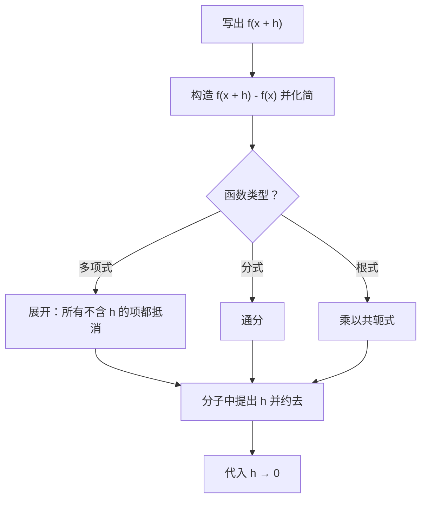
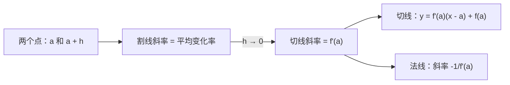

# 7. 导数：变化率、定义与切线

> **目标**：把导数理解为**瞬时变化率**和**切线斜率**，**用定义**（极限）计算导数，写出割线、切线和法线的方程，并在具体情境（人口、速度）中解释导数。对应 TE 1 和 TE 2 的「变化率」、「导数的定义」和「割线、切线与法线」。

---

## 1. 引言与定义

### 1.1 平均变化率

在 $$x = a$$ 与 $$x = b$$ 之间，函数从 $$f(a)$$ 变到 $$f(b)$$。**平均变化率**（taux de variation moyen）为：

$$\frac{\Delta f}{\Delta x} = \frac{f(b) - f(a)}{b - a}$$

它是经过 $$(a; f(a))$$ 和 $$(b; f(b))$$ 的**割线斜率**。在物理中：平均速度、平均加速度……

令 $$b = x + h$$（从 $$x$$ 出发走一小步 $$h$$）：

$$T_v(x, h) = \frac{f(x + h) - f(x)}{h}$$

### 1.2 瞬时变化率：导数

让步长 $$h$$ 趋于 $$0$$，割线「转动」成为**切线**。它的斜率就是**导数**（dérivée）：

$$f'(x) = \lim_{h \to 0}\frac{f(x + h) - f(x)}{h}$$

等价记号：$$f'(x)$$，$$\frac{df}{dx}$$，$$\frac{dy}{dx}$$，$$\dot{x}(t)$$（物理中）。若极限存在，则 $$f$$ 在 $$x$$ 处**可导**。

### 1.3 解释

| 情境 | $$f'(a)$$ 表示…… | 单位 |
| --- | --- | --- |
| 几何 | 图像在 $$a$$ 处切线的斜率 | — |
| 位置 $$x(t)$$ | 瞬时速度 | m/s |
| 速度 $$v(t)$$ | 瞬时加速度 | m/s² |
| 人口 $$N(t)$$ | 人口增长的速度 | 个体/年 |

> 导数的**单位**永远是「$$f$$ 的单位」**每**「$$x$$ 的单位」。

### 1.4 切线与法线

$$f$$ 的图像在横坐标 $$a$$ 处的**切线**（tangente）：

$$t(x) = f'(a)\,(x - a) + f(a)$$

**法线**（normale）是在同一点与切线**垂直**的直线。它的斜率为 $$-\frac{1}{f'(a)}$$（若 $$f'(a) \neq 0$$）：

$$n(x) = -\frac{1}{f'(a)}\,(x - a) + f(a)$$

若 $$f'(a) = 0$$，切线是水平的，法线是竖直线 $$x = a$$。

### 1.5 函数在哪里不可导？

- 在**间断点**；
- 在**角点**（左右斜率不同，例如 $$\lvert x \rvert$$ 在 $$0$$ 处）；
- 在**竖直切线**处（例如 $$\sqrt[3]{x}$$ 在 $$0$$ 处）。

---

## 2. 解题方法

### 方法 A：用定义求导

> 在化简之前**绝不**把 $$h$$ 换成 $$0$$：否则会得到 $$\frac{0}{0}$$。

### 方法 B：直线方程

1. 过 $$(a; f(a))$$ 和 $$(b; f(b))$$ 的**割线**：斜率 $$m = \frac{f(b) - f(a)}{b - a}$$，然后 $$y = m(x - a) + f(a)$$。
2. $$a$$ 处的**切线**：计算 $$f(a)$$ **和** $$f'(a)$$，代入公式。
3. $$a$$ 处的**法线**：斜率 $$-\frac{1}{f'(a)}$$，同一点。
4. **检验**：直线必须经过该点；斜率要与图像的走势一致。

### 方法 C：由 $$f$$ 的图像读 $$f'$$ 的图像

- $$f$$ 上升处 $$f' > 0$$；$$f$$ 下降处 $$f' < 0$$。
- 在波峰和波谷（水平切线）处 $$f' = 0$$。
- $$f$$ 最陡的地方，$$\lvert f' \rvert$$ 最大。
- 在角点处 $$f'$$ 无定义（$$f'$$ 的图像有跳跃）。

---

## 3. 详细计算示例

### 示例 1：变化率（TE 1，2024）

*求 $$f(x) = 5x^2 + 3$$ 的变化率。*

$$T_v = \frac{f(x + h) - f(x)}{h} = \frac{5(x + h)^2 + 3 - 5x^2 - 3}{h} = \frac{5x^2 + 10xh + 5h^2 - 5x^2}{h} = \frac{10xh + 5h^2}{h} = 10x + 5h$$

（$$h \neq 0$$）。令 $$h \to 0$$，得到导数 $$f'(x) = 10x$$。

### 示例 2：用定义求分式的导数（笔试 3，2023）

*用定义计算 $$f(x) = \frac{1}{2 - 3x}$$ 的导数。*

**第 1 步：差**，通分：

$$f(x + h) - f(x) = \frac{1}{2 - 3x - 3h} - \frac{1}{2 - 3x} = \frac{(2 - 3x) - (2 - 3x - 3h)}{(2 - 3x - 3h)(2 - 3x)} = \frac{3h}{(2 - 3x - 3h)(2 - 3x)}$$

**第 2 步：除以 $$h$$** 再取极限：

$$f'(x) = \lim_{h \to 0}\frac{3}{(2 - 3x - 3h)(2 - 3x)} = \frac{3}{(2 - 3x)^2}$$

### 示例 3：含根式的定义（TE 2，2019）

*用定义计算 $$g(x) = \sqrt{1 - x}$$ 的导数。*

$$\frac{g(x + h) - g(x)}{h} = \frac{\sqrt{1 - x - h} - \sqrt{1 - x}}{h}\cdot\frac{\sqrt{1 - x - h} + \sqrt{1 - x}}{\sqrt{1 - x - h} + \sqrt{1 - x}} = \frac{(1 - x - h) - (1 - x)}{h\left(\sqrt{1 - x - h} + \sqrt{1 - x}\right)}$$

$$= \frac{-1}{\sqrt{1 - x - h} + \sqrt{1 - x}} \xrightarrow[h \to 0]{} \frac{-1}{2\sqrt{1 - x}}$$

### 示例 4：割线、切线、法线（TE 2，2019）

*设 $$f(x) = 3x^2$$（所以 $$f'(x) = 6x$$）。*

**a) 割线**，过 $$(2; f(2)) = (2; 12)$$ 和 $$(5; f(5)) = (5; 75)$$：

$$m = \frac{75 - 12}{5 - 2} = 21 \qquad y = 21(x - 2) + 12 = 21x - 30$$

**b) $$x = 2$$ 处的切线**：$$f'(2) = 12$$：

$$y = 12(x - 2) + 12 = 12x - 12$$

**c) $$x = 2$$ 处的法线**：斜率 $$-\frac{1}{12}$$：

$$y = -\frac{1}{12}(x - 2) + 12 = -\frac{x}{12} + \frac{73}{6}$$

### 示例 5：更复杂的切线与法线（TE 3，2019）

*$$f(x) = 3x^3 - 6x + \frac{2}{x}$$，$$g(x) = 3e^{2x}$$。a) $$f$$ 在 $$x = 2$$ 处的切线。b) $$g$$ 在 $$x = -1$$ 处的法线。*

a) $$f(2) = 24 - 12 + 1 = 13$$，$$f'(x) = 9x^2 - 6 - \frac{2}{x^2}$$，所以 $$f'(2) = 36 - 6 - \frac{1}{2} = \frac{59}{2}$$：

$$t(x) = \frac{59}{2}(x - 2) + 13 = \frac{59}{2}x - 46$$

b) $$g(-1) = 3e^{-2}$$，$$g'(x) = 6e^{2x}$$，所以 $$g'(-1) = 6e^{-2}$$。法线斜率：$$-\frac{1}{6e^{-2}} = -\frac{e^2}{6}$$：

$$n(x) = -\frac{e^2}{6}(x + 1) + \frac{3}{e^2}$$

### 示例 6：情境中的变化率（笔试 2，2022）

*a) 人口数为 $$N(t) = \frac{200t}{1 + t} + 60$$（$$t$$ 以年计）。$$t = 2$$ 时的瞬时变化率？*

可以用定义或求导法则（第 8 章）：$$N'(t) = \frac{200(1 + t) - 200t}{(1 + t)^2} = \frac{200}{(1 + t)^2}$$，所以

$$N'(2) = \frac{200}{9} \approx 22{,}2 \text{ 个体/年}$$

**解释**：在 $$t = 2$$ 年的时刻，人口以每年约 22 个个体的速度增长。

*b) 一个物体的速度为 $$v(t) = 1{,}2\sqrt{t}$$ m/s。速度在 $$[1\text{ s}, 4\text{ s}]$$ 上的平均变化率？*

$$\frac{v(4) - v(1)}{4 - 1} = \frac{2{,}4 - 1{,}2}{3} = 0{,}4 \text{ m/s}^2$$

这是 1 s 到 4 s 之间的**平均加速度**。瞬时变化率 $$v'(4) = \frac{0{,}6}{\sqrt{4}} = 0{,}3$$ m/s² 是 $$v$$ 的图像在 $$t = 4$$ 处**切线的斜率**。

---

## 4. 可视化：从割线到切线

---

## 5. 练习

### 练习 1：定义（TE，2024）

用定义计算 $$f(x) = \frac{x}{x + 1}$$ 的导数。

点击查看提示

把 $$\frac{x + h}{x + h + 1} - \frac{x}{x + 1}$$ 通分；分子中除了一个 $$h$$ 的倍数，其他项都会抵消。

**详细解答**

1. 差的分子：$$(x + h)(x + 1) - x(x + h + 1) = x^2 + x + hx + h - x^2 - xh - x = h$$。
2. 所以 $$\frac{f(x + h) - f(x)}{h} = \frac{h}{h(x + h + 1)(x + 1)} = \frac{1}{(x + h + 1)(x + 1)}$$。
3. 极限：$$f'(x) = \frac{1}{(x + 1)^2}$$。

### 练习 2：切线、割线、法线（TE 2，2024）

函数 $$f$$ 经过点 $$(1; -1)$$ 和 $$(2; 8)$$，导数为 $$f'(x) = 6x$$。求：a) 过这两点的割线；b) $$x = 1$$ 处的切线；c) $$x = 1$$ 处的法线。

点击查看提示

b) 和 c)：切点是 $$(1; -1)$$，切线斜率是 $$f'(1)$$。

**详细解答**

a) $$m = \frac{8 - (-1)}{2 - 1} = 9$$；$$y = 9(x - 1) - 1 = 9x - 10$$。

b) $$f'(1) = 6$$；$$y = 6(x - 1) - 1 = 6x - 7$$。

c) 斜率 $$-\frac{1}{6}$$；$$y = -\frac{1}{6}(x - 1) - 1 = -\frac{x}{6} - \frac{5}{6}$$。

### 练习 3：理解导数（Test 1，2023）

种群数量 $$P(t)$$ 在 $$[a, b]$$ 上**增长**，但它的**增长率在减小**。a) 哪个表达式表示瞬时增长率？b) $$P'(t)$$ 在 $$]a, b[$$ 上的符号？c) 如何用数学表达「增长率在减小」？d) 描述曲线的形状。

点击查看提示

增长率是一个导数；「增长率在减小」涉及的是**导数的导数**。

**详细解答**

a) $$P'(t)$$。

b) 种群在增长：$$P'(t) > 0$$。

c) 增长率 $$P'$$ 在减小：它的导数为负，$$P''(t) < 0$$。

d) 一条**上升**但**逐渐变平**的曲线：上升得越来越慢（法语叫 concave，即 $$P'' < 0$$，形状像拱形 ∩），就像 $$\sqrt{t}$$ 或 $$\ln t$$。
