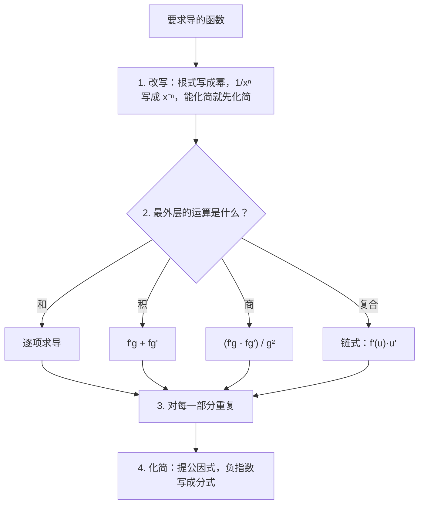
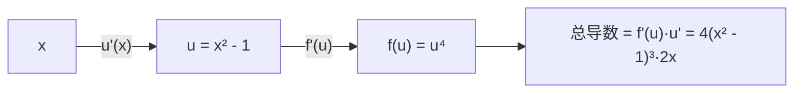

# 8. 求导法则

> **目标**：快速而准确地求出由常用函数（幂、根式、指数、对数、三角函数、arctan）构成的**任何**函数的导数，综合运用乘积、商和链式法则，并**化简**结果。对应 TE 2、TE 3、Test 1（2023）和 2023 年 12 月考试中的「导数」题。

---

## 1. 引言与定义

用定义求导（第 7 章）很费时间。我们一次性记住基本函数的导数，以及把它们**组合**起来的**法则**。

### 1.1 常用导数表

| $$f(x)$$ | $$f'(x)$$ | 备注 |
| --- | --- | --- |
| $$c$$（常数） | $$0$$ | $$\pi$$、$$e^2$$、$$\ln 2$$、$$\sin 4$$ 都是常数！ |
| $$x^n$$ | $$nx^{n-1}$$ | 对任意实数指数 $$n$$ 成立 |
| $$\sqrt{x}$$ | $$\frac{1}{2\sqrt{x}}$$ | $$n = \frac{1}{2}$$ 的情形 |
| $$\frac{1}{x}$$ | $$-\frac{1}{x^2}$$ | $$n = -1$$ 的情形 |
| $$e^x$$ | $$e^x$$ | |
| $$a^x$$ | $$a^x\ln a$$ | |
| $$\ln x$$ | $$\frac{1}{x}$$ | |
| $$\log_a x$$ | $$\frac{1}{x\ln a}$$ | |
| $$\sin x$$ | $$\cos x$$ | |
| $$\cos x$$ | $$-\sin x$$ | |
| $$\tan x$$ | $$\frac{1}{\cos^2 x} = 1 + \tan^2 x = \sec^2 x$$ | |
| $$\arctan x$$ | $$\frac{1}{1 + x^2}$$ | |
| $$\arcsin x$$ | $$\frac{1}{\sqrt{1 - x^2}}$$ | |
| $$\arccos x$$ | $$-\frac{1}{\sqrt{1 - x^2}}$$ | |

### 1.2 组合法则

**线性**：$$(af + bg)' = af' + bg'$$。

**乘积法则**：

$$(f\cdot g)' = f'g + fg'$$

**商法则**：

$$\left(\frac{f}{g}\right)' = \frac{f'g - fg'}{g^2}$$

**链式法则**（复合函数，règle de chaîne）：「外层函数的导数，在内层处取值，**乘以**内层函数的导数」：

$$\left(f(u(x))\right)' = f'(u(x))\cdot u'(x)$$

链式法则的常用形式：

$$\left(u^n\right)' = nu^{n-1}u' \qquad \left(e^u\right)' = e^uu' \qquad \left(\ln u\right)' = \frac{u'}{u} \qquad \left(\sin u\right)' = u'\cos u \qquad \left(\sqrt{u}\right)' = \frac{u'}{2\sqrt{u}}$$

### 1.3 高阶导数

$$f'' = (f')'$$ 是**二阶导数**（凹凸性、加速度），$$f''' = (f'')'$$ 是三阶导数，依此类推。莱布尼茨记号：$$\frac{d^2y}{dx^2}$$，$$\frac{d^3x}{dt^3}$$。

---

## 2. 解题方法

### 一般方法

### 技巧

- **求导前先化简**：$$\frac{x}{e^x} = xe^{-x}$$；$$\ln(5t^2) = \ln 5 + 2\ln t$$；$$\frac{x^2 - 3x}{x^3} = \frac{1}{x} - \frac{3}{x^2}$$。
- 对**幂的乘积**，最后提出公共的**最低次幂**。
- 要求某点处的导数值，先求导，**再**代入。

---

## 3. 详细计算示例

### 示例 1：幂的和（TE 2，2024）

$$a(x) = 2x^5 - 8x^3 + 11x^2 + 7\sqrt[3]{x} + \frac{1}{3x} + \frac{5}{\sqrt{x}}$$

**改写**成幂：$$a(x) = 2x^5 - 8x^3 + 11x^2 + 7x^{1/3} + \frac{1}{3}x^{-1} + 5x^{-1/2}$$。

用 $$(x^n)' = nx^{n-1}$$ **逐项求导**：

$$a'(x) = 10x^4 - 24x^2 + 22x + \frac{7}{3}x^{-2/3} - \frac{1}{3}x^{-2} - \frac{5}{2}x^{-3/2}$$

$$a'(x) = 10x^4 - 24x^2 + 22x + \frac{7}{3\sqrt[3]{x^2}} - \frac{1}{3x^2} - \frac{5}{2x\sqrt{x}}$$

> 考试中见过的错误：$$\left(\frac{1}{3x}\right)' = -\frac{1}{3x^2}$$，而不是 $$-\frac{1}{9x^2}$$ 或 $$-3x^{-2}$$。$$\frac{1}{3}$$ 是一个常数因子。

### 示例 2：商（TE 2，2024）

$$b(t) = \frac{2t - 5}{1 - 3t} \qquad b'(t) = \frac{2(1 - 3t) - (2t - 5)(-3)}{(1 - 3t)^2} = \frac{2 - 6t + 6t - 15}{(1 - 3t)^2} = \frac{-13}{(1 - 3t)^2}$$

### 示例 3：各种形式的链式法则（TE 3，2024）

**a)** $$a(x) = \log_7(5x^2 - 3)$$：$$(\log_7 u)' = \frac{u'}{u\ln 7}$$，$$u' = 10x$$：

$$a'(x) = \frac{10x}{(5x^2 - 3)\ln 7}$$

**b)** $$b(x) = 3^{4x + 5}$$：$$(3^u)' = 3^u\ln 3\cdot u'$$：

$$b'(x) = 4\ln 3\cdot 3^{4x + 5}$$

（注意：**不能**写成 $$4\cdot 3^{4x+5} = 12^{4x+5}$$！）

**c)** $$c(x) = 4\arctan\left(\sqrt{x - 1}\right)$$：两层链式：

$$c'(x) = 4\cdot\frac{1}{1 + \left(\sqrt{x - 1}\right)^2}\cdot\frac{1}{2\sqrt{x - 1}} = \frac{4}{x}\cdot\frac{1}{2\sqrt{x - 1}} = \frac{2}{x\sqrt{x - 1}}$$

**d)** $$d(x) = \cos\left(\frac{2}{3x}\right)$$：内层 $$u = \frac{2}{3}x^{-1}$$，$$u' = -\frac{2}{3x^2}$$：

$$d'(x) = -\sin\left(\frac{2}{3x}\right)\cdot\left(-\frac{2}{3x^2}\right) = \frac{2}{3x^2}\sin\left(\frac{2}{3x}\right)$$

### 示例 4：幂的乘积与因式分解（TE 3，2024）

$$e(x) = (x^2 - 1)^4(x^3 + 2)^5$$

乘积法则，再对每个因子用链式法则：

$$e'(x) = 4(x^2 - 1)^3\cdot 2x\cdot(x^3 + 2)^5 + (x^2 - 1)^4\cdot 5(x^3 + 2)^4\cdot 3x^2$$

提出公共的最低次幂 $$x(x^2 - 1)^3(x^3 + 2)^4$$：

$$e'(x) = x(x^2 - 1)^3(x^3 + 2)^4\left[8(x^3 + 2) + 15x(x^2 - 1)\right] = x(x^2 - 1)^3(x^3 + 2)^4\left(23x^3 - 15x + 16\right)$$

### 示例 5：指数与对数（TE 3，2024）

- $$h(x) = (x - 1)e^{-2x}$$：$$h'(x) = e^{-2x} + (x - 1)(-2)e^{-2x} = e^{-2x}(1 - 2x + 2) = e^{-2x}(3 - 2x)$$。
- $$i(x) = \ln\left(\sin(3e^{2x})\right)$$：$$i'(x) = \frac{\cos(3e^{2x})\cdot 6e^{2x}}{\sin(3e^{2x})} = 6e^{2x}\cot\left(3e^{2x}\right)$$。
- $$j(x) = \frac{x}{e^x} = xe^{-x}$$：$$j'(x) = e^{-x} - xe^{-x} = e^{-x}(1 - x)$$。
- $$g(x) = 5\sin^2(4x)$$：$$g'(x) = 5\cdot 2\sin(4x)\cdot\cos(4x)\cdot 4 = 40\sin(4x)\cos(4x) = 20\sin(8x)$$（二倍角公式）。

### 示例 6：某点的导数与三阶导数（笔试 3，2023）

*e) 对 $$y = \frac{x^2 - x - 2}{x^2 - 6}$$ 求 $$\frac{dy}{dx}\Big\vert_{x = 4}$$。*

$$y' = \frac{(2x - 1)(x^2 - 6) - (x^2 - x - 2)(2x)}{(x^2 - 6)^2} \qquad y'(4) = \frac{7\cdot 10 - 10\cdot 8}{100} = -\frac{1}{10}$$

*f) 对 $$x(t) = \ln(5t^2)$$ 求 $$x'''(t)$$。* 先化简：$$x(t) = \ln 5 + 2\ln t$$（$$t > 0$$）。

$$x'(t) = \frac{2}{t} \qquad x''(t) = -\frac{2}{t^2} \qquad x'''(t) = \frac{4}{t^3}$$

---

## 4. 可视化：链式法则就像一串齿轮

每一「层」都乘上它自己的导数（在下一层处取值）。

---

## 5. 练习

### 练习 1：（笔试 3，2023）

求导：a) $$f(x) = 5x^6\tan x$$；b) $$g(t) = 2\sqrt{t^2 + t}$$；c) $$k(y) = \cos(3y^3 - 5y) + 2$$；d) $$h(t) = 2te^{4t^2}$$。

点击查看提示

a) 乘积；b) 对 $$\sqrt{u}$$ 用链式；c) 对 $$\cos u$$ 用链式（常数 $$2$$ 消失）；d) 乘积**和**链式。

**详细解答**

a) $$f'(x) = 30x^5\tan x + 5x^6\cdot\frac{1}{\cos^2 x} = 5x^5\left(6\tan x + \frac{x}{\cos^2 x}\right)$$。

b) $$g'(t) = 2\cdot\frac{2t + 1}{2\sqrt{t^2 + t}} = \frac{2t + 1}{\sqrt{t^2 + t}}$$。

c) $$k'(y) = -\sin(3y^3 - 5y)\cdot(9y^2 - 5) = (5 - 9y^2)\sin(3y^3 - 5y)$$。

d) $$h'(t) = 2e^{4t^2} + 2t\cdot e^{4t^2}\cdot 8t = 2e^{4t^2}\left(1 + 8t^2\right)$$。

### 练习 2：（TE 3，2019）

求导：a) $$f(x) = 2e^{-\sqrt{x}} + \pi^2x - \ln(2)x^2$$；b) $$g(a) = \sqrt[7]{(4a^3 + 2)^5}$$；c) $$h(u) = \frac{u^2 - 2}{7 - 3u}$$。

点击查看提示

a) $$\pi^2$$ 和 $$\ln 2$$ 是**常数**。b) 写成 $$(4a^3 + 2)^{5/7}$$。c) 商。

**详细解答**

a) $$f'(x) = 2e^{-\sqrt{x}}\cdot\left(-\frac{1}{2\sqrt{x}}\right) + \pi^2 - 2\ln(2)\,x = -\frac{e^{-\sqrt{x}}}{\sqrt{x}} + \pi^2 - 2\ln(2)\,x$$。

b) $$g'(a) = \frac{5}{7}(4a^3 + 2)^{-2/7}\cdot 12a^2 = \frac{60a^2}{7\sqrt[7]{(4a^3 + 2)^2}}$$。

c) $$h'(u) = \frac{2u(7 - 3u) - (u^2 - 2)(-3)}{(7 - 3u)^2} = \frac{14u - 6u^2 + 3u^2 - 6}{(7 - 3u)^2} = \frac{-3u^2 + 14u - 6}{(7 - 3u)^2}$$。

### 练习 3：（考试，2023 年 12 月）

a) $$f(x) = \frac{(x^2 - 16)^2}{\pi}$$；b) $$f(x) = \ln\left(e^{x^2 - 5x + 3}\right)$$；c) $$f(x) = (x^2 - 7)\sqrt{3x - 5}$$；d) 已知 $$f(2) = -4$$，$$f'(2) = 1$$，写出 $$x = 2$$ 处的切线。

点击查看提示

a) $$\frac{1}{\pi}$$ 是常数。b) 先化简：$$\ln(e^A) = A$$。d) 切线公式。

**详细解答**

a) $$f'(x) = \frac{2(x^2 - 16)\cdot 2x}{\pi} = \frac{4x(x^2 - 16)}{\pi} = \frac{4x^3 - 64x}{\pi}$$。

b) $$f(x) = x^2 - 5x + 3$$，所以 $$f'(x) = 2x - 5$$。

c) $$f'(x) = 2x\sqrt{3x - 5} + (x^2 - 7)\cdot\frac{3}{2\sqrt{3x - 5}} = \frac{4x(3x - 5) + 3(x^2 - 7)}{2\sqrt{3x - 5}} = \frac{15x^2 - 20x - 21}{2\sqrt{3x - 5}}$$。

d) $$y = f'(2)(x - 2) + f(2) = (x - 2) - 4 = x - 6$$。
