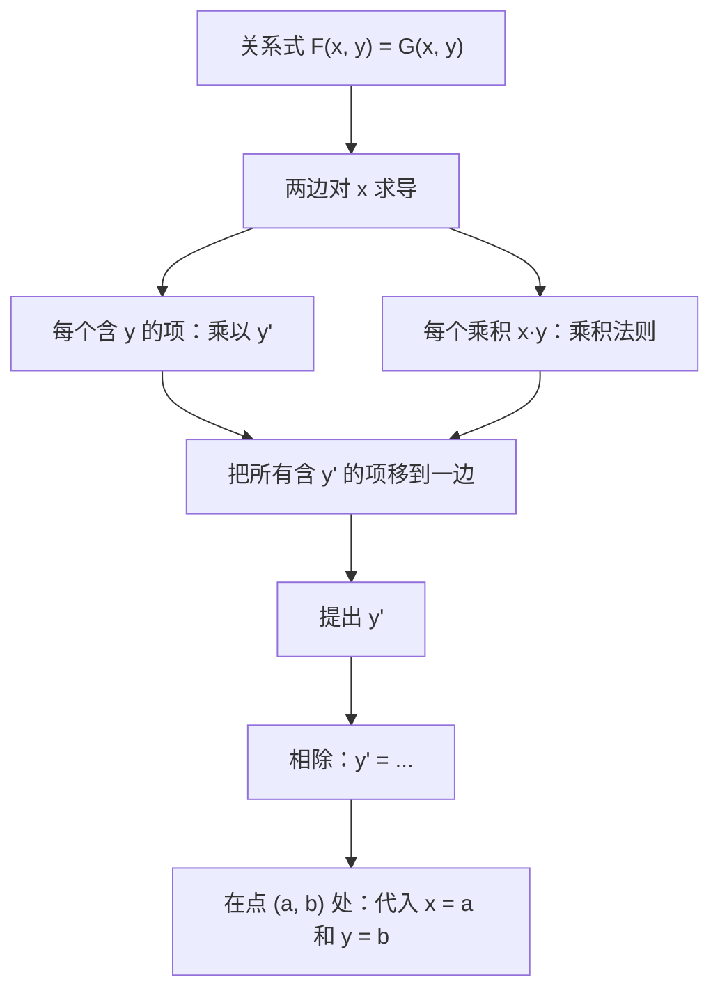
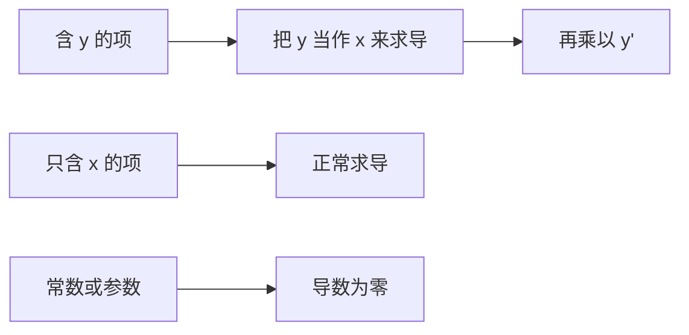

# 9. 隐函数求导与对数求导

> **目标**：对无法解出 $$y$$ 的关系式 $$F(x, y) = 0$$ 求导（**隐函数**求导），求曲线在某点的斜率，以及对 $$f(x)^{g(x)}$$ 型函数求导（**对数**求导）。对应 TE 2、TE 3 的「隐函数导数」，TE 3（2024）的「对数导数」，以及「笛卡尔叶形线」（Test 1，2023）。

---

## 1. 引言与定义

### 1.1 隐函数

像 $$x^2 + y^2 = 25$$ 这样的方程描述了一条曲线（这里是一个圆），但没有把 $$y$$ **显式地**写成 $$x$$ 的函数。在一个点附近，$$y$$ 局部地**是** $$x$$ 的函数：$$y = y(x)$$。我们可以**不解出 $$y$$** 就对它求导。

**原理**：两边同时对 $$x$$ 求导，并记住 $$y$$ 依赖于 $$x$$。由链式法则：

$$\frac{d}{dx}\left(y^2\right) = 2y\cdot y' \qquad \frac{d}{dx}\left(e^y\right) = e^y\cdot y' \qquad \frac{d}{dx}\left(\sin y\right) = \cos y\cdot y'$$

由乘积法则：

$$\frac{d}{dx}\left(xy\right) = 1\cdot y + x\cdot y'$$

> **条件反射**：每次对含 $$y$$ 的表达式求导，都要乘以 $$y'$$（即 $$\frac{dy}{dx}$$）。这就是以 $$y$$ 为「内层函数」的链式法则。

### 1.2 对数求导

对于变量**同时出现在底数和指数中**的函数，比如 $$y = x^x$$ 或 $$y = (\cos 3x)^{\sin 3x}$$，第 8 章的法则都不能直接用（$$(u^n)' = nu^{n-1}u'$$ 要求指数是常数；$$(a^u)' = a^u\ln a\, u'$$ 要求底数是常数）。

取对数：

$$y = f(x)^{g(x)} \implies \ln y = g(x)\ln f(x)$$

然后隐函数求导：$$\frac{y'}{y} = \left(g(x)\ln f(x)\right)'$$，最后 $$y' = y\cdot\left(g(x)\ln f(x)\right)'$$。

等价做法：$$f^g = e^{g\ln f}$$，再用链式法则。

---

## 2. 解题方法

### 方法 A：隐函数求导

### 方法 B：隐函数曲线的切线

1. 检验该点在曲线上。
2. 隐函数求导得 $$y'$$，在该点取值：斜率 $$m$$。
3. $$y = m(x - a) + b$$。

### 方法 C：对数求导

1. 写 $$\ln y = g(x)\ln f(x)$$（设 $$y > 0$$）。
2. 求导：$$\frac{y'}{y} = g'(x)\ln f(x) + g(x)\frac{f'(x)}{f(x)}$$。
3. 乘以 $$y$$，再把 $$y$$ 换成它的表达式。

---

## 3. 详细计算示例

### 示例 1：基础例子（TE 3，2024）

$$e^{xy} + x^2 = 10 + y^2$$

**第 1 步：对每一项求导**：

- $$\frac{d}{dx}e^{xy} = e^{xy}\cdot\frac{d}{dx}(xy) = e^{xy}(y + xy')$$（先链式后乘积）；
- $$\frac{d}{dx}x^2 = 2x$$；$$\frac{d}{dx}10 = 0$$；$$\frac{d}{dx}y^2 = 2yy'$$。

$$e^{xy}(y + xy') + 2x = 2yy'$$

**第 2 步：把 $$y'$$ 移到左边**：

$$xe^{xy}y' - 2yy' = -ye^{xy} - 2x \iff y'\left(xe^{xy} - 2y\right) = -\left(ye^{xy} + 2x\right)$$

**第 3 步：解出**：

$$y' = -\frac{ye^{xy} + 2x}{xe^{xy} - 2y}$$

### 示例 2：两个变量和一个参数（TE 3，2019）

*对 $$8ux^3y + 3e^{-4x} - 7x^2y^{-3} = 0$$ 求 $$\frac{dy}{dx}$$ 和 $$\frac{dy}{du}$$。*

**$$\frac{dy}{dx}$$**（$$u$$ 是**常数**）：

$$8u\left(3x^2y + x^3y'\right) - 12e^{-4x} - 7\left(2xy^{-3} - 3x^2y^{-4}y'\right) = 0$$

$$y'\left(8ux^3 + 21x^2y^{-4}\right) = 12e^{-4x} + 14xy^{-3} - 24ux^2y$$

$$\frac{dy}{dx} = \frac{12e^{-4x} + 14xy^{-3} - 24ux^2y}{8ux^3 + 21x^2y^{-4}}$$

**$$\frac{dy}{du}$$**（现在 $$x$$ 是**常数**，$$y = y(u)$$）：

$$8x^3\left(y + uy'\right) + 0 - 7x^2\left(-3y^{-4}y'\right) = 0 \iff y'\left(8ux^3 + 21x^2y^{-4}\right) = -8x^3y$$

$$\frac{dy}{du} = \frac{-8x^3y}{8ux^3 + 21x^2y^{-4}}$$

### 示例 3：曲线在某点的斜率：笛卡尔叶形线（Test 1，2023）

*曲线 $$x^3 + y^3 = 9xy$$ 经过 $$P(4; 2)$$。求 $$P$$ 处切线的斜率。*

**检验**：$$64 + 8 = 72$$，$$9\cdot 4\cdot 2 = 72$$ ✓。

**求导**：

$$3x^2 + 3y^2y' = 9y + 9xy' \iff y'\left(3y^2 - 9x\right) = 9y - 3x^2 \iff y' = \frac{3y - x^2}{y^2 - 3x}$$

**在 $$P$$ 处**：

$$y'(4; 2) = \frac{6 - 16}{4 - 12} = \frac{-10}{-8} = \frac{5}{4}$$

切线：$$y = \frac{5}{4}(x - 4) + 2 = \frac{5}{4}x - 3$$。

### 示例 4：含三角函数的切线（考试，2023 年 1 月）

*求曲线 $$\sin(x + y) = 2x - 2y$$ 在点 $$(\pi; \pi)$$ 处的切线方程。*

**检验**：$$\sin(2\pi) = 0$$，$$2\pi - 2\pi = 0$$ ✓。

**求导**：$$\cos(x + y)\cdot(1 + y') = 2 - 2y'$$。

**解出**：$$y'\left(\cos(x + y) + 2\right) = 2 - \cos(x + y)$$，所以 $$y' = \frac{2 - \cos(x + y)}{2 + \cos(x + y)}$$。

**在 $$(\pi; \pi)$$ 处**：$$\cos(2\pi) = 1$$，所以 $$y' = \frac{1}{3}$$：

$$y = \frac{1}{3}(x - \pi) + \pi = \frac{x}{3} + \frac{2\pi}{3}$$

### 示例 5：对数求导（TE 3，2024）

*a) $$f(x) = (\cos 3x)^{\sin 3x}$$，在 $$\left]-\frac{\pi}{6}, \frac{\pi}{6}\right[$$ 上（此处 $$\cos 3x > 0$$）。*

$$\ln y = \sin(3x)\ln\left(\cos 3x\right)$$

$$\frac{y'}{y} = 3\cos(3x)\ln(\cos 3x) + \sin(3x)\cdot\frac{-3\sin 3x}{\cos 3x}$$

$$f'(x) = 3(\cos 3x)^{\sin 3x}\left[\cos(3x)\ln(\cos 3x) - \sin(3x)\tan(3x)\right]$$

*b) $$f(x) = x^{2e^x}$$，$$x > 0$$。*

$$\ln y = 2e^x\ln x \implies \frac{y'}{y} = 2e^x\ln x + \frac{2e^x}{x} \implies f'(x) = 2e^x\,x^{2e^x}\left(\ln x + \frac{1}{x}\right)$$

---

## 4. 可视化

---

## 5. 练习

### 练习 1：（TE 3，2024）

对 $$3^x + \ln(xy^2) = 5y$$ 求 $$\frac{dy}{dx}$$（设 $$x > 0$$，$$y \neq 0$$）。

点击查看提示

先化简 $$\ln(xy^2) = \ln x + 2\ln\lvert y \rvert$$。$$2\ln\lvert y \rvert$$ 的导数是 $$\frac{2y'}{y}$$。

**详细解答**

1. $$3^x + \ln x + 2\ln\lvert y \rvert = 5y$$。
2. 求导：$$3^x\ln 3 + \frac{1}{x} + \frac{2y'}{y} = 5y'$$。
3. 整理：$$y'\left(5 - \frac{2}{y}\right) = 3^x\ln 3 + \frac{1}{x}$$。
4. 分子分母同乘 $$xy$$ 化简：

$$\frac{dy}{dx} = \frac{3^x\ln 3 + \frac{1}{x}}{5 - \frac{2}{y}} = \frac{y\left(x\,3^x\ln 3 + 1\right)}{x(5y - 2)}$$

### 练习 2：（考试，2023 年 1 月）

对 $$\cos(xy) = \sin(x + y)$$ 求 $$\frac{dy}{dx}$$。

点击查看提示

$$\frac{d}{dx}\cos(xy) = -\sin(xy)\cdot(y + xy')$$，$$\frac{d}{dx}\sin(x + y) = \cos(x + y)\cdot(1 + y')$$。

**详细解答**

1. $$-\sin(xy)(y + xy') = \cos(x + y)(1 + y')$$。
2. 展开：$$-y\sin(xy) - xy'\sin(xy) = \cos(x + y) + y'\cos(x + y)$$。
3. 整理：$$-y'\left[x\sin(xy) + \cos(x + y)\right] = \cos(x + y) + y\sin(xy)$$。

$$\frac{dy}{dx} = -\frac{\cos(x + y) + y\sin(xy)}{x\sin(xy) + \cos(x + y)}$$

### 练习 3：圆的切线与对数求导

a) 求圆 $$x^2 + y^2 = 25$$ 在点 $$(3; -4)$$ 处的切线。b) 对 $$y = x^{\sin x}$$（$$x > 0$$）求导。

点击查看提示

a) $$2x + 2yy' = 0$$。检验：圆的切线与半径垂直。b) $$\ln y = \sin x\ln x$$。

**详细解答**

a) $$y' = -\frac{x}{y}$$，所以在 $$(3; -4)$$ 处 $$y' = \frac{3}{4}$$。切线：$$y = \frac{3}{4}(x - 3) - 4 = \frac{3}{4}x - \frac{25}{4}$$。检验：半径的斜率为 $$\frac{-4}{3}$$，而 $$\frac{3}{4}\cdot\left(-\frac{4}{3}\right) = -1$$ ✓（互相垂直）。

b) $$\frac{y'}{y} = \cos x\ln x + \frac{\sin x}{x}$$，所以 $$y' = x^{\sin x}\left(\cos x\ln x + \frac{\sin x}{x}\right)$$。
