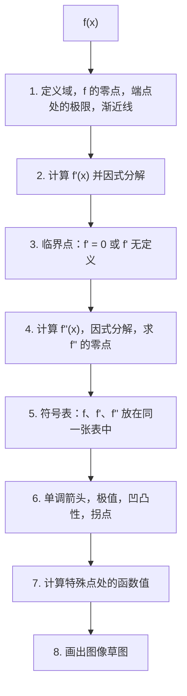
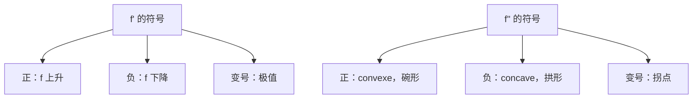

# 10. 函数研究：单调性、极值与凹凸性

> **目标**：用 $$f'$$ 和 $$f''$$ 求单调区间、极值（局部与全局）、凹凸性和拐点，构造**完整的符号表**并画出图像草图。对应「函数研究」（TE 3，2019）、「单调性与极值」（TE 4，2025）、「图像表示」以及笔试 3（2023）的练习 6–7。

> **术语提醒**：中文教材里「凹」「凸」的用法不统一。本章统一采用考卷的法语说法，并写明 $$f''$$ 的符号：**convexe**（$$f'' > 0$$，碗形 ∪）和 **concave**（$$f'' < 0$$，拱形 ∩）。

---

## 1. 引言与定义

### 1.1 单调性与导数的符号

在一个区间上：

- $$f'(x) > 0 \implies f$$ **递增**（croissante）；
- $$f'(x) < 0 \implies f$$ **递减**（décroissante）；
- 处处 $$f'(x) = 0 \implies f$$ 为常数。

### 1.2 临界点与极值

**临界点**（point critique，valeur critique）是满足 $$f'(c) = 0$$ **或** $$f'(c)$$ 不存在的 $$c \in D_f$$。

- $$c$$ 处的**局部极大值**（maximum relatif）：对 $$c$$ 附近的 $$x$$，$$f(c) \geq f(x)$$。
- **局部极小值**（minimum relatif）：在附近 $$f(c) \leq f(x)$$。
- 区间 $$I$$ 上的**全局（绝对）极值**（extremum absolu）：$$f$$ 在**整个** $$I$$ 上的最大（最小）值。

> **定理**：定义域内部的局部极值只能出现在**临界点**。但临界点不一定是极值：$$f(x) = x^3$$ 满足 $$f'(0) = 0$$，却没有极值（这是一个**鞍点**，point selle，也叫「平台点」）。

### 1.3 一阶导数检验

在临界点 $$c$$：

| $$f'$$ 在左边和右边的符号 | 结论 |
| --- | --- |
| 先 $$+$$ 后 $$-$$ | 局部**极大值** |
| 先 $$-$$ 后 $$+$$ | 局部**极小值** |
| 两边符号相同 | 没有极值（若 $$f'(c) = 0$$ 则为鞍点） |

### 1.4 凹凸性与二阶导数

- $$f''(x) > 0$$：$$f$$ 是 **convexe**（曲线呈「碗形」∪）；切线在曲线**下方**。
- $$f''(x) < 0$$：$$f$$ 是 **concave**（曲线呈「拱形」∩）。
- **拐点**（point d'inflexion）是凹凸性**改变**的点（通常在 $$f'' = 0$$ **且**变号的地方）。

**二阶导数检验**：若 $$f'(c) = 0$$ 且 $$f''(c) < 0$$，则为极大值；若 $$f''(c) > 0$$，则为极小值；若 $$f''(c) = 0$$，无法判断（回到一阶导数检验）。

### 1.5 闭区间 $$[a, b]$$ 上的全局极值

在 $$[a, b]$$ 上**连续**的函数一定取到全局最大值和最小值。它们出现在**临界点或端点**。

### 1.6 图像上的特殊点

- **角点**（point anguleux）：$$f$$ 连续，但左右斜率不同（$$f'$$ 不存在）。
- **尖点**（point de rebroussement）：竖直切线，斜率为 $$\pm\infty$$（例如 $$x^{2/3}$$ 在 $$0$$ 处）。
- **渐近线**：见第 5 章。

---

## 2. 解题方法

### 完整的函数研究方法

### 方法：$$[a, b]$$ 上的全局极值

1. 找出 $$]a, b[$$ **内部**的临界点。
2. 计算这些点**以及** $$a$$ 和 $$b$$ 处的 $$f$$ 值。
3. 最大的值是全局最大值，最小的值是全局最小值。
4. 用单调性表判断其他点的性质（局部极值）。

### 反向方法：根据条件画符号表

当题目给出 $$f'$$ 和 $$f''$$ 在各区间上的符号时，把它们填入表中，再解读每种组合：

| $$f'$$ | $$f''$$ | 形状 |
| --- | --- | --- |
| $$+$$ | $$+$$ | 上升得越来越快（$$\nearrow$$，convexe） |
| $$+$$ | $$-$$ | 上升得越来越慢（$$\nearrow$$，concave） |
| $$-$$ | $$+$$ | 下降并减速（$$\searrow$$，convexe） |
| $$-$$ | $$-$$ | 下降并加速（$$\searrow$$，concave） |

---

## 3. 详细计算示例

### 示例 1：多项式的完整研究（TE 3，2019）

*$$f(x) = (x^2 - 2x + 1)(2x + 7)$$。*

**a) 零点。** $$x^2 - 2x + 1 = (x - 1)^2$$，所以 $$f(x) = (x - 1)^2(2x + 7)$$：零点 $$x = 1$$（二重）和 $$x = -\frac{7}{2}$$。

**b) 导数**（乘积法则）：

$$f'(x) = 2(x - 1)(2x + 7) + (x - 1)^2\cdot 2 = 2(x - 1)\left[(2x + 7) + (x - 1)\right] = 2(x - 1)(3x + 6) = 6(x - 1)(x + 2)$$

$$f'$$ 的零点：$$x = 1$$ 和 $$x = -2$$。

**c) 二阶导数**：$$f'(x) = 6(x^2 + x - 2)$$，所以 $$f''(x) = 6(2x + 1)$$，在 $$x = -\frac{1}{2}$$ 处为零。

**d) 符号表。**

| $$x$$ | $$x < -\frac{7}{2}$$ | $$-\frac{7}{2}$$ | $$]-\frac{7}{2}, -2[$$ | $$-2$$ | $$]-2, -\frac{1}{2}[$$ | $$-\frac{1}{2}$$ | $$]-\frac{1}{2}, 1[$$ | $$1$$ | $$x > 1$$ |
| --- | --- | --- | --- | --- | --- | --- | --- | --- | --- |
| $$f$$ | $$-$$ | $$0$$ | $$+$$ | $$+$$ | $$+$$ | $$+$$ | $$+$$ | $$0$$ | $$+$$ |
| $$f'$$ | $$+$$ | $$+$$ | $$+$$ | $$0$$ | $$-$$ | $$-$$ | $$-$$ | $$0$$ | $$+$$ |
| $$f''$$ | $$-$$ | $$-$$ | $$-$$ | $$-$$ | $$-$$ | $$0$$ | $$+$$ | $$+$$ | $$+$$ |
| 形状 | $$\nearrow$$ concave | | $$\nearrow$$ concave | **极大** | $$\searrow$$ concave | **拐点** | $$\searrow$$ convexe | **极小** | $$\nearrow$$ convexe |

**函数值**：$$f(-2) = 9\cdot 3 = 27$$（局部极大值）；$$f(1) = 0$$（局部极小值）；$$f\left(-\frac{1}{2}\right) = \frac{9}{4}\cdot 6 = \frac{27}{2}$$（拐点）。

### 示例 2：单调性与极值（TE 4，2025）

*$$f(x) = x^5 - \frac{25}{3}x^3 + 20x + e^{2\pi}$$。*

$$e^{2\pi}$$ 是**常数**：它的导数为零。

$$f'(x) = 5x^4 - 25x^2 + 20 = 5(x^4 - 5x^2 + 4) = 5(x^2 - 1)(x^2 - 4)$$

零点：$$\pm 1$$ 和 $$\pm 2$$。符号：

| $$x$$ | $$x < -2$$ | $$-2 < x < -1$$ | $$-1 < x < 1$$ | $$1 < x < 2$$ | $$x > 2$$ |
| --- | --- | --- | --- | --- | --- |
| $$x^2 - 1$$ | $$+$$ | $$+$$ | $$-$$ | $$+$$ | $$+$$ |
| $$x^2 - 4$$ | $$+$$ | $$-$$ | $$-$$ | $$-$$ | $$+$$ |
| $$f'$$ | $$+$$ | $$-$$ | $$+$$ | $$-$$ | $$+$$ |

- 在 $$]-\infty, -2]$$、$$[-1, 1]$$ 和 $$[2, +\infty[$$ 上递增；在 $$[-2, -1]$$ 和 $$[1, 2]$$ 上递减。
- 在 $$x = -2$$ 和 $$x = 1$$ 处取局部**极大值**；在 $$x = -1$$ 和 $$x = 2$$ 处取局部**极小值**。

### 示例 3：含指数函数（笔试 3，2023）

*$$f(x) = x^2e^{-x^2}$$。*

**a) 临界点**（乘积 + 链式）：

$$f'(x) = 2xe^{-x^2} + x^2\cdot(-2x)e^{-x^2} = 2xe^{-x^2}\left(1 - x^2\right) = 2x(1 - x)(1 + x)e^{-x^2}$$

$$e^{-x^2} > 0$$ 永不为零：临界点 $$x = 0$$、$$x = 1$$、$$x = -1$$。

**b) 单调性**：$$2x(1 - x^2)$$ 的符号：

| $$x$$ | $$x < -1$$ | $$-1 < x < 0$$ | $$0 < x < 1$$ | $$x > 1$$ |
| --- | --- | --- | --- | --- |
| $$f'$$ | $$+$$ | $$-$$ | $$+$$ | $$-$$ |

在 $$x = \pm 1$$ 处取局部极大值：$$f(\pm 1) = e^{-1} \approx 0{,}37$$；在 $$x = 0$$ 处取局部极小值：$$f(0) = 0$$。

**c) 草图**：只有一个零点（$$x = 0$$），$$f \geq 0$$，在 $$\pm\infty$$ 处 $$f \to 0$$：一条**偶函数**曲线，形如圆滑的「M」，在 $$0$$ 处碰到横轴，在 $$\pm 1$$ 处达到最高 $$e^{-1}$$。

### 示例 4：$$f'$$ 不存在的临界点（笔试 3，2023）

*$$f(x) = x^{2/3}(2x - 5)$$，$$D_f = \mathbb{R}$$。a) 证明 $$f'(x) = \frac{10(x - 1)}{3\sqrt[3]{x}}$$。b) 已知 $$f(3) \approx 2{,}08$$，求 $$f$$ 在 $$[-1, 3]$$ 上的极值。*

**a)** 乘积法则：

$$f'(x) = \frac{2}{3}x^{-1/3}(2x - 5) + 2x^{2/3} = \frac{2(2x - 5)}{3x^{1/3}} + \frac{6x}{3x^{1/3}} = \frac{4x - 10 + 6x}{3\sqrt[3]{x}} = \frac{10(x - 1)}{3\sqrt[3]{x}}$$

（这里写了 $$2x^{2/3} = \frac{2x^{2/3}\cdot 3x^{1/3}}{3x^{1/3}} = \frac{6x}{3x^{1/3}}$$。）

**b)** 临界点：$$x = 1$$（$$f' = 0$$）和 $$x = 0$$（$$f'$$ **无定义**：分母为零）。符号：

| $$x$$ | $$-1 < x < 0$$ | $$0 < x < 1$$ | $$1 < x < 3$$ |
| --- | --- | --- | --- |
| $$10(x - 1)$$ | $$-$$ | $$-$$ | $$+$$ |
| $$\sqrt[3]{x}$$ | $$-$$ | $$+$$ | $$+$$ |
| $$f'$$ | $$+$$ | $$-$$ | $$+$$ |

函数值：$$f(-1) = 1\cdot(-7) = -7$$；$$f(0) = 0$$；$$f(1) = 1\cdot(-3) = -3$$；$$f(3) \approx 2{,}08$$。

- $$x = 0$$ 处为**局部极大值**（$$f = 0$$）：这是一个**尖点**（竖直切线）。
- $$x = 1$$ 处为**局部极小值**（$$f = -3$$）。
- $$[-1, 3]$$ 上的**全局最小值**：$$x = -1$$ 处的 $$-7$$；**全局最大值**：$$x = 3$$ 处的 $$\approx 2{,}08$$。

### 示例 5：区间上的极值（Test 2，2024）

*$$f(x) = 2x^2e^{-x} + 4xe^{-x} - 4e^{-x}$$，在 $$[-2, 8]$$ 上。*

$$f(x) = e^{-x}(2x^2 + 4x - 4)$$，所以：

$$f'(x) = -e^{-x}(2x^2 + 4x - 4) + e^{-x}(4x + 4) = e^{-x}(8 - 2x^2) = 2e^{-x}(2 - x)(2 + x)$$

临界点：$$x = \pm 2$$（$$-2$$ 同时也是端点）。在 $$[-2, 2]$$ 上 $$f' \geq 0$$，在 $$]2, 8]$$ 上 $$f' < 0$$。

$$f(-2) = e^2(8 - 8 - 4) = -4e^2 \approx -29{,}6 \qquad f(2) = e^{-2}(8 + 8 - 4) = 12e^{-2} \approx 1{,}62 \qquad f(8) = 156e^{-8} \approx 0{,}05$$

- **全局最小值**：$$x = -2$$ 处的 $$-4e^2$$。
- **全局最大值**：$$x = 2$$ 处的 $$12e^{-2}$$。
- $$x = 8$$ 处：**局部极小值**（函数一直递减到端点），但不是全局最小值。

---

## 4. 可视化：$$f'$$ 和 $$f''$$ 告诉我们什么

---

## 5. 练习

### 练习 1：根据条件画表（TE 4，2025）

$$f$$ 连续，$$f'(2) = f'(5) = 0$$，$$f'(7)$$ 不存在；当 $$x < 2$$ 或 $$2 < x < 5$$ 时 $$f' > 0$$；当 $$x > 5$$ 时 $$f' < 0$$。当 $$2 < x < 4$$ 或 $$x > 7$$ 时 $$f'' > 0$$；当 $$x < 2$$ 或 $$4 < x < 7$$ 时 $$f'' < 0$$。a) 画出表格并描述 $$x = 2, 4, 5, 7$$ 处的点。b) $$x = 7$$ 处发生了什么？

点击查看提示

在 $$x = 2$$ 处，$$f'$$ 为零但不变号。在 $$x = 7$$ 处，$$f$$ 连续但不可导，且 $$f'$$ 保持同号。

**详细解答**

| $$x$$ | $$x < 2$$ | $$2$$ | $$]2, 4[$$ | $$4$$ | $$]4, 5[$$ | $$5$$ | $$]5, 7[$$ | $$7$$ | $$x > 7$$ |
| --- | --- | --- | --- | --- | --- | --- | --- | --- | --- |
| $$f'$$ | $$+$$ | $$0$$ | $$+$$ | $$+$$ | $$+$$ | $$0$$ | $$-$$ | 无定义 | $$-$$ |
| $$f''$$ | $$-$$ | | $$+$$ | $$0$$ | $$-$$ | $$-$$ | $$-$$ | | $$+$$ |
| 形状 | $$\nearrow$$ concave | **鞍点** | $$\nearrow$$ convexe | **拐点** | $$\nearrow$$ concave | **极大** | $$\searrow$$ concave | **角点** | $$\searrow$$ convexe |

a) $$x = 2$$：鞍点（水平切线，没有极值，同时凹凸性改变）。$$x = 4$$：拐点。$$x = 5$$：局部极大值。

b) 在 $$x = 7$$ 处，$$f$$ 连续但 $$f'$$ 不存在：这是一个**角点**（不是渐近线，也不是洞，因为 $$f$$ 连续）。

### 练习 2：临界点及其性质（考试，2023 年 1 月）

设 $$f(x) = \frac{x}{x^2 + 4}$$。a) 求临界点。b) 用二阶导数检验判断它们的性质。

点击查看提示

$$f'(x) = \frac{4 - x^2}{(x^2 + 4)^2}$$。求 $$f''$$ 时，先约去一个因子 $$(x^2 + 4)$$ 再展开。

**详细解答**

a) $$f'(x) = \frac{(x^2 + 4) - x\cdot 2x}{(x^2 + 4)^2} = \frac{4 - x^2}{(x^2 + 4)^2}$$，在 $$x = \pm 2$$ 处为零。

b) 二阶导数：

$$f''(x) = \frac{-2x(x^2 + 4)^2 - (4 - x^2)\cdot 2(x^2 + 4)\cdot 2x}{(x^2 + 4)^4} = \frac{-2x(x^2 + 4) - 4x(4 - x^2)}{(x^2 + 4)^3} = \frac{2x(x^2 - 12)}{(x^2 + 4)^3}$$

- $$f''(2) = \frac{4\cdot(-8)}{8^3} < 0$$：局部**极大值**，$$f(2) = \frac{1}{4}$$。
- $$f''(-2) = \frac{-4\cdot(-8)}{8^3} > 0$$：局部**极小值**，$$f(-2) = -\frac{1}{4}$$。

### 练习 3：全局极值（考试，2023 年 1 月）

求 $$f(x) = (x^2 - 4)^2$$ 在 $$[-2, 3]$$ 上的全局最值。

点击查看提示

$$f'(x) = 4x(x^2 - 4)$$。比较 $$]-2, 3[$$ 内临界点处和两个端点处的 $$f$$ 值。

**详细解答**

1. $$f'(x) = 2(x^2 - 4)\cdot 2x = 4x(x - 2)(x + 2)$$：临界点 $$0$$、$$2$$（$$-2$$ 是端点）。
2. 函数值：$$f(-2) = 0$$，$$f(0) = 16$$，$$f(2) = 0$$，$$f(3) = 25$$。
3. **全局最大值**：$$x = 3$$ 处的 $$25$$。**全局最小值**：$$x = -2$$ 和 $$x = 2$$ 处的 $$0$$。（$$x = 0$$ 处：**局部**极大值 $$16$$。）
