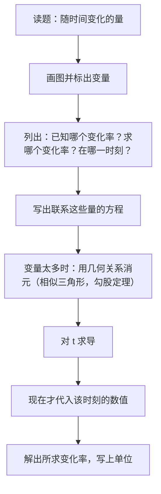
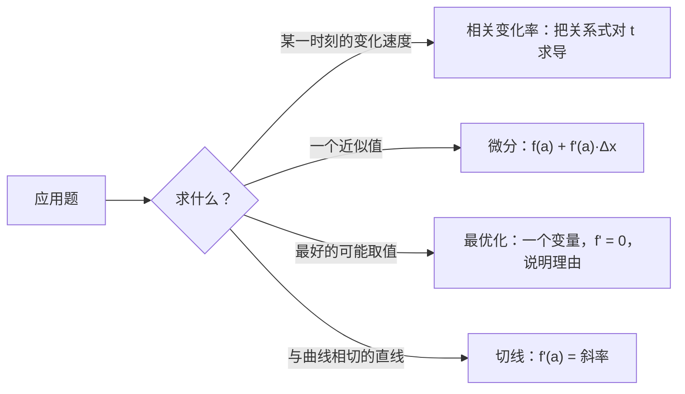

# 11. 导数的应用：相关变化率、线性近似与最优化

> **目标**：解决三大类应用题：**相关变化率**（气球、圆锥、雷达），用微分做**线性近似**，以及**最优化**（横梁、罐头盒、光合作用），还有**切线**问题（飞机与靶子、水平切线）。对应 TE 4「导数的应用」（2025）、Test 2「导数的应用」（2024）和 2023 年 1 月的考试。

---

## 1. 引言与定义

### 1.1 相关变化率

当几个量都依赖于**时间**，并且由一个（几何或物理）方程联系在一起时，它们的**变化速度**也相互联系。把方程对 $$t$$ 求导（隐函数求导，第 9 章）：

$$V = \frac{4}{3}\pi r^3 \implies \frac{dV}{dt} = 4\pi r^2\frac{dr}{dt}$$

### 1.2 线性近似（微分）

在点 $$a$$ 附近，图像与它的切线几乎重合。对一个小的变化量 $$\Delta x$$：

$$f(a + \Delta x) \approx f(a) + f'(a)\,\Delta x$$

量 $$df = f'(a)\,dx$$ 叫做**微分**（différentielle）。选 $$a$$ 时要让它**接近**所求的值，并且 **$$f(a)$$ 容易计算**。

### 1.3 最优化

找出使某个量**最大**或**最小**的变量值：这就是求全局极值（第 10 章），但函数要先根据题意**建立**出来。

---

## 2. 解题方法

### 方法 A：相关变化率

> **求导之后**才代入数值：一个在变化的量不能在求导之前就被换成常数。

### 方法 B：线性近似

1. 确定函数 $$f$$（例如 $$f(x) = e^x$$、$$\sin x$$、$$\sqrt[3]{x}$$）。
2. 选一个接近所求值的「简单」的 $$a$$，令 $$\Delta x = \text{所求值} - a$$。
3. 对于角度：**把 $$\Delta x$$ 换成弧度**。
4. 计算 $$f(a) + f'(a)\Delta x$$。

### 方法 C：最优化

1. 确定要优化的量，用公式写出来（一开始可能有几个变量）。
2. 利用**约束条件**化成**一个变量**。
3. 确定这个变量的实际**取值范围**（长度为正……）。
4. 求导，找临界点。
5. 说明这确实是最大值或最小值（符号表或 $$f''$$）。
6. 回答题目**所问的**内容（所有尺寸，带单位）。

### 方法 D：过外部一点的切线

1. 写出在**未知**点 $$a$$ 处的切线：$$y = f'(a)(x - a) + f(a)$$。
2. 要求外部点 $$(x_0; y_0)$$ 满足这个方程。
3. 解出关于 $$a$$ 的方程。

---

## 3. 详细计算示例

### 示例 1：球形气球（TE 4，2025）

*给一个球形气球充气。当半径为 $$2$$ m 时，体积以 $$2\pi$$ m³/min 的速度增加。a) 半径以什么速度变化？b) 表面积呢？*

**a)** $$V = \frac{4}{3}\pi r^3$$。对 $$t$$ 求导：

$$\frac{dV}{dt} = 4\pi r^2\frac{dr}{dt} \implies \frac{dr}{dt} = \frac{dV/dt}{4\pi r^2} = \frac{2\pi}{4\pi\cdot 4} = \frac{1}{8} \text{ m/min}$$

**b)** $$A = 4\pi r^2$$：

$$\frac{dA}{dt} = 8\pi r\frac{dr}{dt} = 8\pi\cdot 2\cdot\frac{1}{8} = 2\pi \text{ m}^2/\text{min}$$

### 示例 2：圆锥形容器（Test 2，2024）

*向一个圆锥（尖端朝下）中倒水，圆锥高 $$H = 100$$ cm，半径 $$R = 20$$ cm。当水深为 $$5$$ cm 时，水面以 $$2$$ cm/s 的速度上升。此时体积以什么速度增加？*

**第 1 步：变量**：$$h(t)$$ 为水深，$$r(t)$$ 为水面半径。$$V = \frac{1}{3}\pi r^2h$$。

**第 2 步：消去 $$r$$**：由相似三角形，$$\frac{r}{h} = \frac{R}{H}$$，所以 $$r = \frac{R}{H}h$$，于是：

$$V = \frac{1}{3}\pi\frac{R^2}{H^2}h^3$$

**第 3 步：求导**：

$$\frac{dV}{dt} = \pi\frac{R^2}{H^2}h^2\frac{dh}{dt}$$

**第 4 步：代入**（$$h = 5$$，$$\frac{dh}{dt} = 2$$）：

$$\frac{dV}{dt} = \pi\cdot\frac{400}{10\,000}\cdot 25\cdot 2 = 2\pi \text{ cm}^3/\text{s} \approx 6{,}28 \text{ cm}^3/\text{s}$$

### 示例 3：线性近似（TE 4，2025）

**a)** $$e^{0{,}03}$$：$$f(x) = e^x$$，$$a = 0$$，$$\Delta x = 0{,}03$$：

$$e^{0{,}03} \approx e^0 + e^0\cdot 0{,}03 = 1{,}03$$

**b)** $$\sin(59°)$$：$$f(x) = \sin x$$，$$a = 60° = \frac{\pi}{3}$$，$$\Delta x = -1° = -\frac{\pi}{180}$$ rad：

$$\sin(59°) \approx \sin\frac{\pi}{3} + \cos\frac{\pi}{3}\cdot\left(-\frac{\pi}{180}\right) = \frac{\sqrt{3}}{2} - \frac{\pi}{360} \approx 0{,}8573$$

**c)** $$\sqrt[3]{124}$$：$$f(x) = \sqrt[3]{x}$$，$$a = 125$$，$$\Delta x = -1$$，$$f'(x) = \frac{1}{3\sqrt[3]{x^2}}$$：

$$\sqrt[3]{124} \approx 5 + \frac{1}{3\cdot 25}\cdot(-1) = 5 - \frac{1}{75} = \frac{374}{75} \approx 4{,}9867$$

（精确值：$$4{,}98663...$$：近似得非常好。）

### 示例 4：最结实的横梁（TE 4，2025）

*矩形截面（底 $$b$$，高 $$h$$）横梁的强度为 $$R = bh^2$$。从直径 $$30$$ cm 的圆木中能锯出的最结实的横梁尺寸是多少？*

**约束**：矩形的对角线是直径：$$b^2 + h^2 = 30^2 = 900$$，所以 $$h^2 = 900 - b^2$$。

**一个变量**：$$R(b) = b(900 - b^2) = 900b - b^3$$，$$b \in \left]0, 30\right[$$。

**求导**：$$R'(b) = 900 - 3b^2 = 0 \iff b^2 = 300 \iff b = 10\sqrt{3}$$（舍去负值）。

**性质**：$$R''(b) = -6b < 0$$：是**最大值**。

**答案**：$$b = 10\sqrt{3} \approx 17{,}3$$ cm，$$h = \sqrt{900 - 300} = 10\sqrt{6} \approx 24{,}5$$ cm。

### 示例 5：罐头盒（Test 2，2024）

*体积为 $$16\pi$$ cm³ 的圆柱形罐头盒，怎样的尺寸用料最少？*

- 总表面积（两个圆盖 + 侧面）：$$A = 2\pi r^2 + 2\pi rh$$。
- 约束：$$\pi r^2h = 16\pi$$，所以 $$h = \frac{16}{r^2}$$。
- $$A(r) = 2\pi r^2 + \frac{32\pi}{r}$$，$$r > 0$$。
- $$A'(r) = 4\pi r - \frac{32\pi}{r^2} = 0 \iff r^3 = 8 \iff r = 2$$ cm。
- $$A'' = 4\pi + \frac{64\pi}{r^3} > 0$$：最小值。
- $$h = \frac{16}{4} = 4$$ cm，$$A = 8\pi + 16\pi = 24\pi$$ cm²。

（注意 $$h = 2r$$：最优的罐头盒高度等于直径。）

### 示例 6：飞机与靶子（Test 1，2023）

*一架飞机沿轨迹 $$y = \frac{2x + 1}{x}$$（$$x > 0$$）飞行，并沿**切线**方向向 $$Ox$$ 轴上 $$x = 1, 2, 3, 4$$ 处的靶子射击。a) 从 $$(1; 3)$$ 射击能打中 4 号靶吗？b) 要打中 2 号靶，应该从哪里射击？*

写成 $$y = 2 + \frac{1}{x}$$，所以 $$y' = -\frac{1}{x^2}$$。

**a)** 在 $$x = 1$$ 处：斜率 $$-1$$；切线 $$y = -(x - 1) + 3 = -x + 4$$。在 $$x = 4$$ 处：$$y = 0$$。**能**，打中 4 号靶。

**b)** 横坐标为 $$a$$ 的点处的切线：$$y = -\frac{1}{a^2}(x - a) + 2 + \frac{1}{a}$$。要求它经过 $$(2; 0)$$：

$$0 = -\frac{2 - a}{a^2} + 2 + \frac{1}{a} \iff 0 = -(2 - a) + 2a^2 + a \iff 2a^2 + 2a - 2 = 0 \iff a^2 + a - 1 = 0$$

$$a = \frac{-1 + \sqrt{5}}{2} \approx 0{,}618 \quad (\text{负根舍去，因为 } x > 0)$$

射击点：$$\left(\frac{\sqrt{5} - 1}{2};\ 2 + \frac{2}{\sqrt{5} - 1}\right) = \left(\frac{\sqrt{5} - 1}{2};\ \frac{5 + \sqrt{5}}{2}\right) \approx (0{,}618; 3{,}618)$$。

### 示例 7：水平切线（TE 3，2019）

*$$x$$ 取何值时，函数 $$f(x) = (5 - x^3)^4(4x^2 - 11)^5$$ 有水平切线？*

水平切线 $$\iff f'(x) = 0$$。乘积法则加链式法则：

$$f'(x) = 4(5 - x^3)^3(-3x^2)(4x^2 - 11)^5 + (5 - x^3)^4\cdot 5(4x^2 - 11)^4\cdot 8x$$

提出公因式 $$4x(5 - x^3)^3(4x^2 - 11)^4$$：

$$f'(x) = 4x(5 - x^3)^3(4x^2 - 11)^4\left[-3x(4x^2 - 11) + 10(5 - x^3)\right] = 4x(5 - x^3)^3(4x^2 - 11)^4\left(-22x^3 + 33x + 50\right)$$

容易求出的零点：$$x = 0$$，$$x = \sqrt[3]{5}$$，$$x = \pm\frac{\sqrt{11}}{2}$$。这就是**四个值**（最后一个因式还有一个实根，但手算很难求出）。

---

## 4. 可视化：三类问题

---

## 5. 练习

### 练习 1：曲线上的动点（考试，2023 年 1 月）

一个动点沿曲线 $$y = \sqrt{1 + x^3}$$ 运动。当它经过点 $$(2; 3)$$ 时，纵坐标以 $$8$$ cm/s 的速度增加。此时横坐标以什么速度增加？

点击查看提示

把 $$y = \sqrt{1 + x^3}$$ 对时间求导：$$\frac{dy}{dt} = \frac{3x^2}{2\sqrt{1 + x^3}}\cdot\frac{dx}{dt}$$。

**详细解答**

1. $$\frac{dy}{dt} = \frac{3x^2}{2\sqrt{1 + x^3}}\frac{dx}{dt}$$。
2. 在 $$(2; 3)$$ 处：$$\frac{3\cdot 4}{2\cdot 3} = 2$$，所以 $$8 = 2\frac{dx}{dt}$$。
3. $$\frac{dx}{dt} = 4$$ cm/s。

### 练习 2：光合作用（考试，2023 年 1 月）

某种浮游植物的光合作用速率为 $$P(I) = \frac{100I}{I^2 + I + 4}$$，其中 $$I > 0$$ 是光照强度。光照强度为多少时 $$P$$ 最大？

点击查看提示

商法则；在 $$P'$$ 的分子中，$$I^2$$ 项和 $$I$$ 项会部分抵消。

**详细解答**

1. $$P'(I) = \frac{100(I^2 + I + 4) - 100I(2I + 1)}{(I^2 + I + 4)^2} = \frac{100(4 - I^2)}{(I^2 + I + 4)^2}$$。
2. $$P'(I) = 0 \iff I = 2$$（因为 $$I > 0$$）。
3. 当 $$0 < I < 2$$ 时 $$P' > 0$$，当 $$I > 2$$ 时 $$P' < 0$$：在 $$I = 2$$ 处取**最大值**，$$P(2) = \frac{200}{10} = 20$$。

### 练习 3：雷达与微分（TE，2022 和 Test 2，2024）

a) 一架飞机以 $$750$$ km/h 的速度在 $$1{,}8$$ km 的高度水平飞行，在 $$t = 0$$ 时恰好经过雷达站正上方。当飞机与雷达站的水平距离为 $$2{,}4$$ km 时，飞机与雷达之间的距离以什么速度增加？b) 用微分近似计算 $$\ln\left(\frac{1}{0{,}98}\right)$$。

点击查看提示

a) $$s^2 = 1{,}8^2 + d^2$$，且 $$\frac{dd}{dt} = 750$$。b) $$\ln\left(\frac{1}{x}\right) = -\ln x$$，取 $$a = 1$$，$$\Delta x = -0{,}02$$。

**详细解答**

a) 对 $$s^2 = 1{,}8^2 + d^2$$ 求导：$$2s\frac{ds}{dt} = 2d\frac{dd}{dt}$$，所以 $$\frac{ds}{dt} = \frac{d}{s}\cdot\frac{dd}{dt}$$。当 $$d = 2{,}4$$ 时：$$s = \sqrt{3{,}24 + 5{,}76} = 3$$ km。所以 $$\frac{ds}{dt} = \frac{2{,}4}{3}\cdot 750 = 600$$ km/h。

b) $$f(x) = -\ln x$$，$$f'(x) = -\frac{1}{x}$$；在 $$a = 1$$ 处：$$f(1) = 0$$，$$f'(1) = -1$$。取 $$\Delta x = -0{,}02$$：

$$\ln\left(\frac{1}{0{,}98}\right) \approx 0 + (-1)(-0{,}02) = 0{,}02$$

（精确值 $$\approx 0{,}0202$$。）
