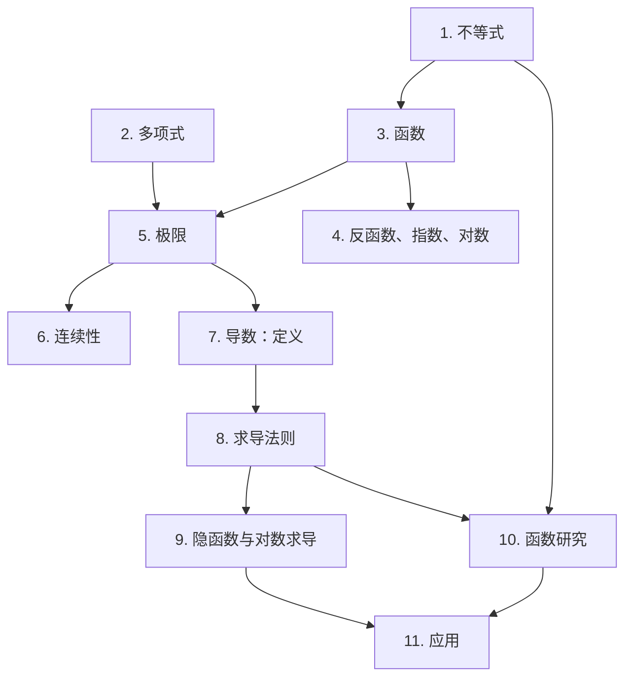

# 分析 1（Analyse 1）

本课程重建分析 1（ISC，HEIA-FR）2019 至 2025 年各次笔试中**考过的全部内容**：TE「复习与极限」、「极限与导数」、「导数」、「导数的应用」，Test 1 和 Test 2（2023–2024），以及各次考试（« Travail écrit A/B »）。

## 课程目录

| # | 章节 | 考试出处 |
| --- | --- | --- |
| 1 | [不等式、符号表与绝对值](01-inequations-et-valeurs-absolues.md) | TE 1 « Inéquations »，各次考试（第 1 题） |
| 2 | [多项式：因式分解与多项式除法](02-polynomes-factorisation-division.md) | TE 1 « Produit de facteurs »，« Division polynomiale » |
| 3 | [函数：定义域、值域、复合、奇偶性、变换](03-fonctions-generalites.md) | 笔试 1（2022），2023–2025 年考试 |
| 4 | [反函数、指数函数与对数函数](04-reciproques-exponentielles-logarithmes.md) | 笔试 1（2022），TE 2025 年 11 月（里氏震级） |
| 5 | [极限与渐近线](05-limites-et-asymptotes.md) | TE 1，TE 2，笔试 2，Test 1 |
| 6 | [连续性](06-continuite.md) | TE 2 « Continuité »，笔试 2 |
| 7 | [导数：变化率、定义与切线](07-derivee-definition-et-tangentes.md) | TE 1，TE 2，笔试 2 和 3 |
| 8 | [求导法则](08-regles-de-derivation.md) | TE 2，TE 3，Test 1，2023 年 12 月考试 |
| 9 | [隐函数求导与对数求导](09-derivation-implicite-et-logarithmique.md) | TE 3，Test 1（笛卡尔叶形线），2023 年考试 |
| 10 | [函数研究：单调性、极值与凹凸性](10-etude-de-fonction.md) | TE 3，TE 4，笔试 3，Test 2 |
| 11 | [导数的应用：相关变化率、近似、最优化](11-applications-des-derivees.md) | TE 4，Test 2（2024），2023 年 1 月考试 |

## 各章之间的联系

## 每一章的结构

1. **引言与定义**：一步一步讲解理论。
2. **解题方法**：针对每一类考题的「做题步骤」。
3. **详细示例**：取自考卷，并解释每一步**为什么**这样做。
4. **可视化**：一张总结图。
5. **练习**：可折叠的提示，然后是完整解答。

> **考试要求提醒**：« 所有题目都必须写出详细计算过程；没有推导的答案按错误处理。代数答案必须化简。数值答案必须精确。» 另外常常要求：求极限时**不许用洛必达法则**。

> **法语小词典**：考卷是法语的。每个重要概念第一次出现时，括号里都给出了法语名称，例如 定义域（domaine de définition）、极限（limite）、导数（dérivée）。
