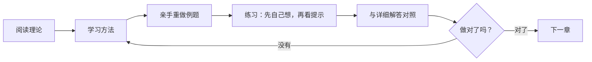

# 数学：完整课程（ISC，HEIA-FR）

欢迎！这本 GitBook 是一套**完整的理论课程**，根据往年的测验、笔试和考试（**线性代数 1** 和 **分析 1**）编写而成。考卷中出现过的每一类题目，这里都有讲解、方法和答案。

> 本课程是法语版课程的中文版本，内容完全相同。考试是用法语进行的，所以重要概念第一次出现时都附有法语名称。

## 两个部分

| 部分 | 内容 | 入口 |
| --- | --- | --- |
| **线性代数 1** | 三角学、振动、复数、向量、数量积/向量积/混合积、直线与平面、极坐标 | [线性代数](algebre/algebre.md) |
| **分析 1** | 不等式、多项式、函数、指数与对数、极限、连续性、导数及其应用 | [分析](analyse/analyse.md) |

## 如何使用本课程

## 图标说明

- **目标**：这一章教你做什么，以及它在考试中出现在哪里。
- **要记住**：必须熟记的关键规则。
- **注意**：考卷中常见的错误。
- 练习的**提示**是折叠起来的：先自己尝试！

## 记号

- 行内公式：$$f(x) = x^2$$；居中公式：

$$\lim_{x \to 0}\frac{\sin(x)}{x} = 1$$

- 虚数单位：$$j$$（$$j^2 = -1$$），与电工学中相同。
- 法式区间写法：$$]a, b[$$ 是开区间（相当于中国写法的 $$(a, b)$$），$$[a, b]$$ 是闭区间。
- 法式小数写法：用**逗号**作小数点，$$3{,}5$$ 就是 3.5。
