# 1. Angles, triangles et mouvements circulaires


**Objectif** : maîtriser les unités d'angle, la géométrie du cercle (arc, secteur, angle inscrit) et la résolution de triangles quelconques. Ces outils reviennent dans <mark style="color:blue;">chaque premier test</mark> d'Algèbre linéaire (« Test 1 Pb 1 », « TE F-1 – Triangle & Co »).


---

## 1. Introduction & définitions

### 1.1 Mesurer un angle : degrés et radians

Un angle mesure une <mark style="color:blue;">ouverture</mark> entre deux demi-droites. On utilise deux unités :

* le <mark style="color:blue;">degré</mark> : un tour complet vaut 360° ;
* le <mark style="color:blue;">radian</mark> : un tour complet vaut 2π rad.

Le radian est l'unité « naturelle » : un angle de 1 rad intercepte, sur un cercle de rayon r, <mark style="color:green;">un arc de longueur exactement r</mark>.

<figure>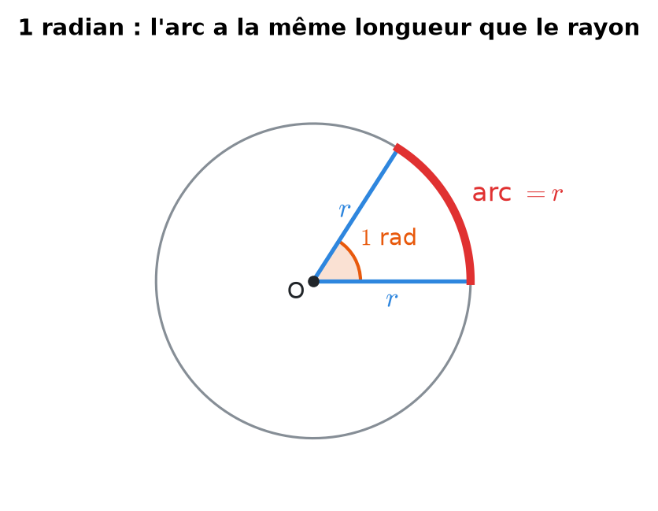<figcaption>
Un radian : l'arc rouge a la même longueur que le rayon bleu.
</figcaption></figure>

D'où la règle de conversion, à connaître par cœur :

$$\Large \boxed{\color{#2F9E44} \pi \text{ rad} = 180°}$$

On passe d'une unité à l'autre par une règle de trois :

$$\large \alpha_{\text{rad}} = \alpha_{\text{deg}} \cdot \frac{\pi}{180} \qquad\qquad \alpha_{\text{deg}} = \alpha_{\text{rad}} \cdot \frac{180}{\pi}$$

Les degrés se subdivisent aussi en <mark style="color:blue;">minutes</mark> et <mark style="color:blue;">secondes</mark> :

$$\large 1° = 60' \qquad 1' = 60'' \qquad \text{exemple : } 7{,}5° = 7°30'$$

| Degrés | 0° | 30° | 45° | 60° | 90° | 180° | 270° | 360° |
| --- | --- | --- | --- | --- | --- | --- | --- | --- |
| Radians | $$0$$ | $$\frac{\pi}{6}$$ | $$\frac{\pi}{4}$$ | $$\frac{\pi}{3}$$ | $$\frac{\pi}{2}$$ | $$\pi$$ | $$\frac{3\pi}{2}$$ | $$2\pi$$ |

<figure>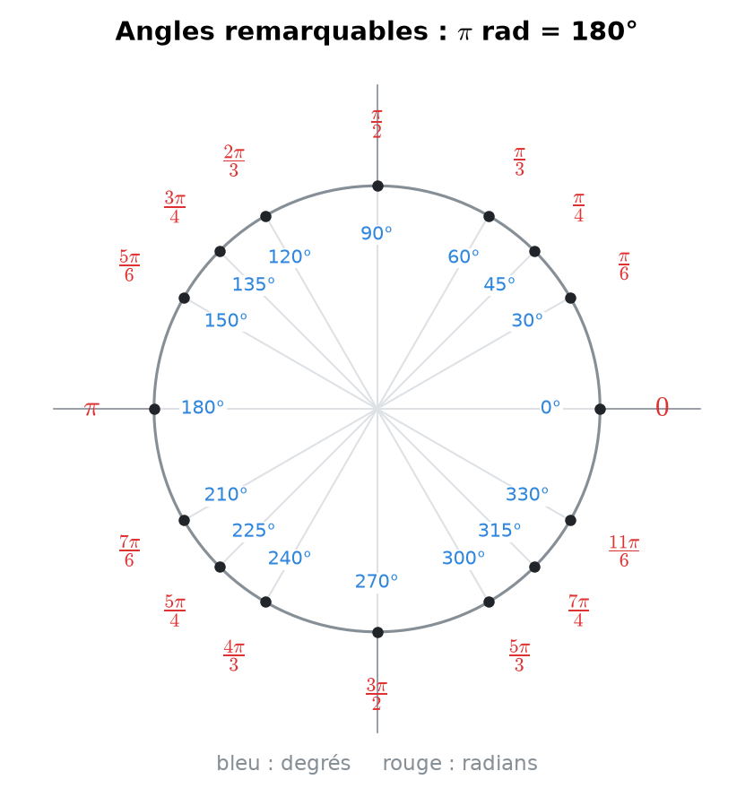<figcaption>
Les angles remarquables, en degrés (bleu) et en radians (rouge).
</figcaption></figure>

### 1.2 Arc et secteur de cercle

Sur un cercle de rayon r, un angle au centre α (<mark style="color:red;">en radians !</mark>) intercepte un <mark style="color:blue;">arc</mark> et un <mark style="color:blue;">secteur</mark> (la « part de pizza ») :

$$\Large \boxed{\color{#E03131} L = r\,\alpha} \qquad \boxed{\color{#2F9E44} A = \tfrac{1}{2}\, r^2 \alpha}$$

<figure>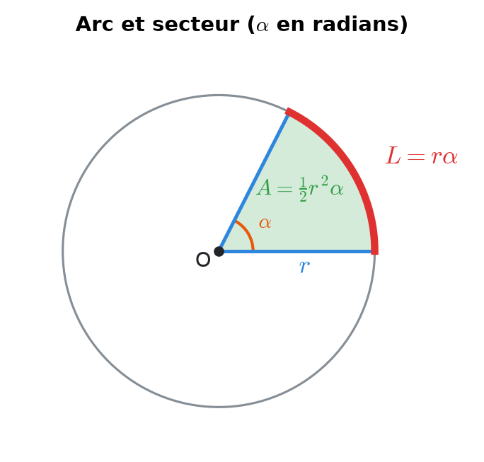<figcaption>
L'arc (rouge) et le secteur (vert) interceptés par l'angle α.
</figcaption></figure>


Ces deux formules ne sont vraies <mark style="color:red;">qu'en radians</mark>. En degrés, il faudrait écrire :

$$L = 2\pi r \cdot \frac{\alpha}{360}$$


### 1.3 Angle au centre et angle inscrit

* Un <mark style="color:blue;">angle inscrit</mark> a son sommet **sur** le cercle.
* Un <mark style="color:green;">angle au centre</mark> a son sommet au centre O.


**Théorème de l'angle au centre** : un angle au centre vaut <mark style="color:green;">le double</mark> de l'angle inscrit qui intercepte le même arc.

$$\Large \alpha_{\text{centre}} = 2\,\theta_{\text{inscrit}}$$


Cas particulier, le <mark style="color:blue;">théorème de Thalès</mark> : un angle inscrit qui intercepte un demi-cercle vaut 90°. Tout triangle inscrit dans un demi-cercle, avec le diamètre comme côté, est donc <mark style="color:green;">rectangle</mark>.

<figure>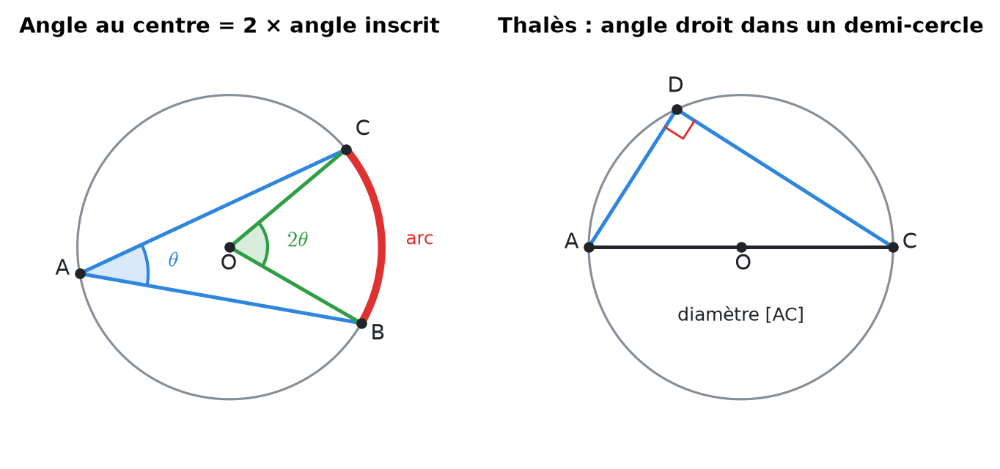<figcaption>
À gauche : l'angle au centre (vert) vaut le double de l'angle inscrit (bleu). À droite : Thalès.
</figcaption></figure>

### 1.4 Trigonométrie du triangle rectangle

Dans un triangle rectangle, pour un angle aigu α :

<figure>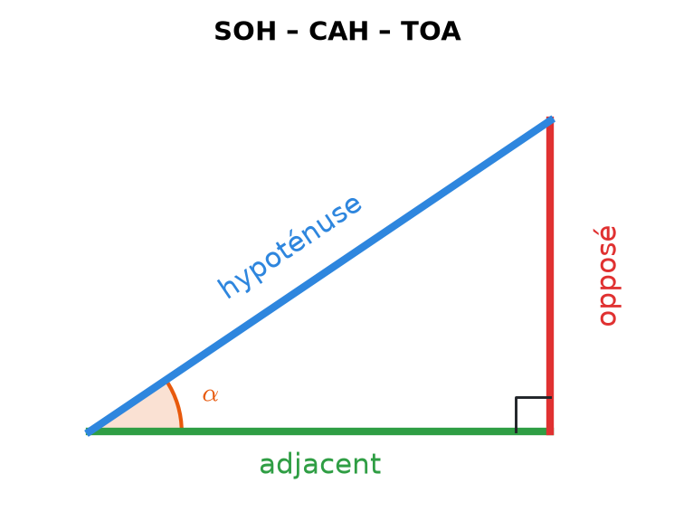<figcaption>
Les trois côtés vus depuis l'angle α.
</figcaption></figure>

$$\Large \sin\alpha = \frac{\color{#E03131}\text{opposé}}{\color{#2E86DE}\text{hypoténuse}} \qquad \cos\alpha = \frac{\color{#2F9E44}\text{adjacent}}{\color{#2E86DE}\text{hypoténuse}} \qquad \tan\alpha = \frac{\color{#E03131}\text{opposé}}{\color{#2F9E44}\text{adjacent}}$$

Moyen mnémotechnique : <mark style="color:green;">SOH-CAH-TOA</mark> (Sinus = Opposé/Hypoténuse, Cosinus = Adjacent/Hypoténuse, Tangente = Opposé/Adjacent).

On définit aussi les <mark style="color:blue;">inverses multiplicatifs</mark> (très fréquents dans les tests) :

$$\large \sec\alpha = \frac{1}{\cos\alpha} \qquad \csc\alpha = \frac{1}{\sin\alpha} \qquad \cot\alpha = \frac{1}{\tan\alpha} = \frac{\cos\alpha}{\sin\alpha}$$

### 1.5 Triangles quelconques

Soit un triangle de côtés a, b, c et d'angles <mark style="color:blue;">opposés</mark> α, β, γ.

<figure>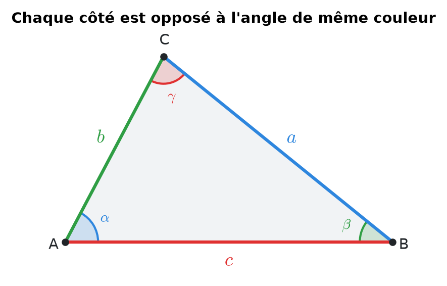<figcaption>
Convention : le côté a est en face de l'angle α, etc.
</figcaption></figure>

<mark style="color:blue;">Loi des sinus</mark> :

$$\Large \boxed{\frac{a}{\sin\alpha} = \frac{b}{\sin\beta} = \frac{c}{\sin\gamma}}$$

<mark style="color:blue;">Loi des cosinus</mark> (un « Pythagore généralisé ») :

$$\Large \boxed{c^2 = a^2 + b^2 - 2ab\cos\gamma}$$

<mark style="color:blue;">Somme des angles</mark> :

$$\large \alpha + \beta + \gamma = \pi \quad (= 180°)$$


**Piège de la loi des sinus** : arcsin ne renvoie que des angles entre −π/2 et π/2. Si l'angle cherché peut être <mark style="color:red;">obtus</mark>, il existe une seconde solution :

$$\beta' = \pi - \beta$$

Pour trouver un angle, préférez la <mark style="color:green;">loi des cosinus</mark> : arccos renvoie directement un angle de \[0, π], sans ambiguïté.


### 1.6 Mouvement circulaire : vitesses angulaire et linéaire

Un objet qui tourne (roue, aiguille, disque) est décrit par :

* la <mark style="color:green;">vitesse angulaire</mark> ω (en rad/s) : l'angle parcouru par unité de temps ;
* la <mark style="color:blue;">fréquence</mark> f (en tours/s = Hz) : le nombre de tours par seconde ;
* la <mark style="color:red;">vitesse linéaire</mark> v (en m/s) d'un point situé à la distance r du centre.

<figure>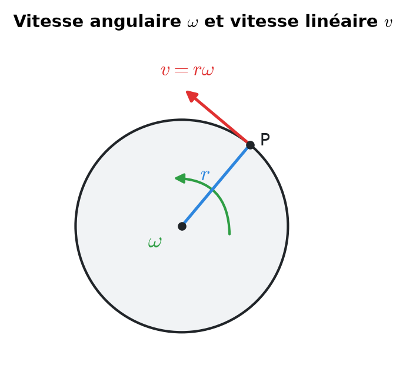<figcaption>
La vitesse linéaire est tangente au cercle.
</figcaption></figure>

$$\Large \boxed{\omega = 2\pi f} \qquad \boxed{v = r\,\omega} \qquad \boxed{T = \frac{1}{f} = \frac{2\pi}{\omega}}$$


Une roue qui <mark style="color:green;">roule sans glisser</mark> avance, à chaque tour, d'une longueur égale à son périmètre : la vitesse du véhicule est la vitesse linéaire v = rω d'un point de la jante.


---

## 2. Méthodes de résolution

### Méthode A — Trouver un rayon à partir d'un arc et d'un angle inscrit

1. Repérer l'<mark style="color:blue;">angle inscrit</mark> θ qui intercepte l'arc.
2. Calculer l'<mark style="color:green;">angle au centre</mark> : α = 2θ.
3. Convertir α <mark style="color:red;">en radians</mark>.
4. Appliquer la formule de l'arc :

$$\Large r = \frac{L}{\alpha}$$

### Méthode B — Résoudre un triangle

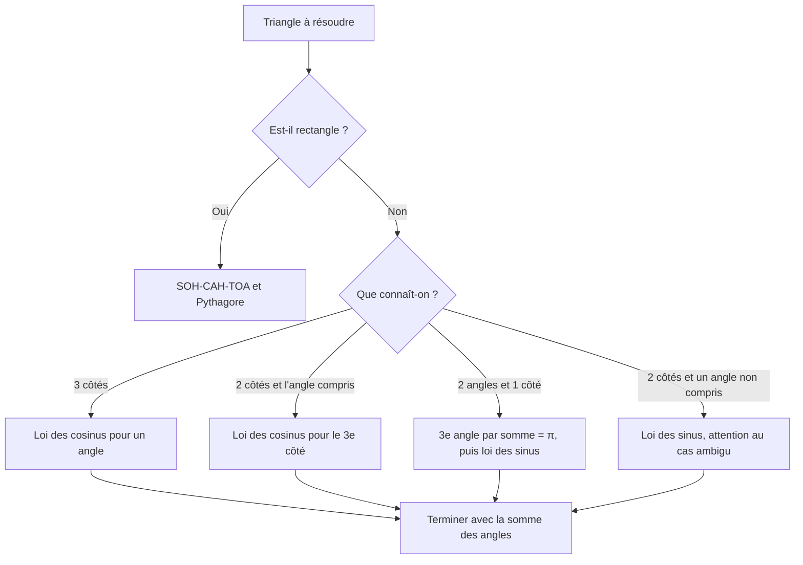

### Méthode C — Problèmes de roues, aiguilles, vitesses

1. Tout convertir en <mark style="color:blue;">unités SI</mark> : km/h → m/s (diviser par 3,6), cm → m, minutes → secondes.
2. Écrire les relations clés v = rω et ω = 2πf.
3. Pour deux roues entraînées ensemble (même véhicule), c'est la <mark style="color:green;">vitesse linéaire qui est commune</mark> :

$$\large v = r_A\,\omega_A = r_B\,\omega_B$$

4. Pour des aiguilles de montre : calculer la position angulaire de chaque aiguille <mark style="color:blue;">depuis midi</mark>, puis la différence.

---

## 3. Exemples de calculs détaillés

### Exemple 1 — Rayon d'un cercle (Test 1, variante A)

*L'arc BC mesure 10 cm et on le voit depuis le point A du cercle sous un angle de 20°. Calculer r.*

<figure>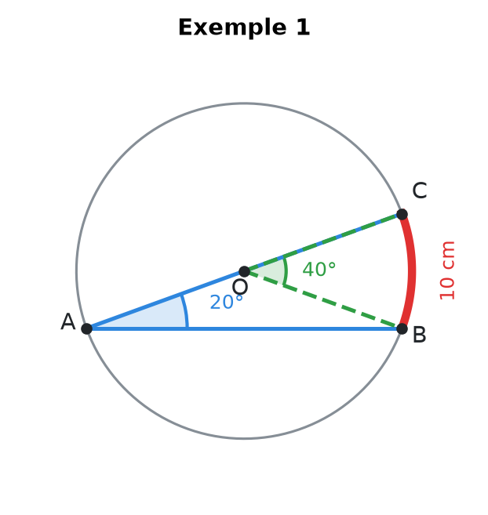<figcaption></figcaption></figure>

<mark style="color:orange;">Étape 1 — Angle au centre.</mark> L'angle de 20° est inscrit (sommet A sur le cercle). L'angle au centre qui intercepte le même arc vaut le double :

$$\large \alpha = 2 \cdot 20° = 40°$$

<mark style="color:orange;">Étape 2 — Conversion</mark> en radians, car la formule de l'arc l'exige :

$$\large \alpha = 40 \cdot \frac{\pi}{180} = \frac{2\pi}{9} \text{ rad}$$

<mark style="color:orange;">Étape 3 — Formule de l'arc</mark> L = rα :

$$\large r = \frac{L}{\alpha} = \frac{10}{2\pi/9} = \frac{90}{2\pi} = \color{#2F9E44}\frac{45}{\pi} \text{ cm} \approx 14{,}3 \text{ cm}$$

### Exemple 2 — Triangle inscrit dans un demi-cercle (TE F-1)

*ADC est un demi-cercle de diamètre AC, avec AD = 25 et DC = √131,25. Trouver AC et l'angle α = ∠DAC.*

<mark style="color:orange;">Étape 1 — Reconnaître l'angle droit.</mark> D est sur le demi-cercle de diamètre AC, donc (Thalès) <mark style="color:green;">l'angle en D est droit</mark>.

<mark style="color:orange;">Étape 2 — Pythagore</mark> pour l'hypoténuse AC :

$$\large AC = \sqrt{AD^2 + DC^2} = \sqrt{625 + 131{,}25} = \sqrt{756{,}25} = \color{#2F9E44}27{,}5$$

<mark style="color:orange;">Étape 3 — Angle.</mark> Dans le triangle rectangle en D, le côté opposé à α est DC :

$$\large \alpha = \arcsin\left(\frac{DC}{AC}\right) = \arcsin\left(\frac{11{,}456}{27{,}5}\right) \approx \color{#2F9E44}0{,}43 \text{ rad} \approx 24{,}6°$$

Ici arcsin est sans danger : dans un triangle rectangle, les angles aigus sont forcément entre 0 et π/2.

### Exemple 3 — La roue d'un caddie (« Vous avez dit crétins ? »)

*Pour décoller d'une rampe, un caddie doit rouler à 79,2 km/h. a) Combien de tours par seconde fait la roue arrière de diamètre 10 cm ? b) La roue avant fait 50 tours/s : quel est son diamètre ?*

<mark style="color:orange;">a) Conversion</mark> en m/s :

$$\large v = \frac{79{,}2}{3{,}6} = 22 \text{ m/s}$$

Le rayon de la roue arrière vaut r\_B = 0,05 m. De v = rω :

$$\large \omega_B = \frac{v}{r_B} = \frac{22}{0{,}05} = 440 \text{ rad/s}$$

Puis f = ω / 2π :

$$\large f_B = \frac{440}{2\pi} \approx \color{#2F9E44}70{,}0 \text{ tours/s}$$

<mark style="color:orange;">b)</mark> La roue avant avance à la <mark style="color:green;">même vitesse</mark> v = 22 m/s (elle est sur le même caddie). Avec f\_A = 50 tours/s :

$$\large \omega_A = 2\pi \cdot 50 = 100\pi \text{ rad/s} \qquad\Rightarrow\qquad r_A = \frac{v}{\omega_A} = \frac{22}{100\pi} \approx 0{,}070 \text{ m}$$

Le diamètre vaut donc environ <mark style="color:green;">14 cm</mark>. La roue avant est plus grande, elle tourne moins vite pour la même vitesse du caddie : c'est cohérent.

### Exemple 4 — Les aiguilles d'une montre (TE F-1, 2023)

*Il est 2 h 38. La petite aiguille mesure 20 cm, la grande 30 cm. a) Vitesses angulaires ? b) Angle entre les aiguilles ? c) Distance entre leurs extrémités ?*

<figure>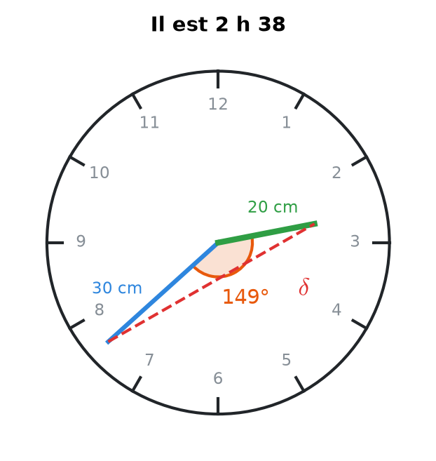<figcaption>
La distance δ entre les extrémités se calcule par la loi des cosinus.
</figcaption></figure>

<mark style="color:orange;">a)</mark> La grande aiguille fait un tour en 60 min, la petite en 12 h = 720 min :

$$\large \omega_M = \frac{360°}{60 \text{ min}} = 6°/\text{min} \qquad \omega_H = \frac{360°}{720 \text{ min}} = 0{,}5°/\text{min}$$

En rad/s :

$$\large \omega_M = \frac{2\pi}{3600} \approx 1{,}75 \cdot 10^{-3} \text{ rad/s} \qquad \omega_H = \frac{2\pi}{43\,200} \approx 1{,}45 \cdot 10^{-4} \text{ rad/s}$$

<mark style="color:orange;">b)</mark> Positions depuis midi (sens horaire). Depuis 12 h, il s'est écoulé 2 · 60 + 38 = 158 min :

$$\large \theta_M = 38 \cdot 6° = 228° \qquad \theta_H = 158 \cdot 0{,}5° = 79°$$

L'angle entre les aiguilles vaut donc :

$$\large 228° - 79° = \color{#2F9E44}149°$$

<mark style="color:orange;">c)</mark> Le triangle formé par le centre et les deux extrémités a deux côtés connus (0,2 m et 0,3 m) et <mark style="color:blue;">l'angle compris</mark> : c'est la loi des cosinus.

$$\large \delta^2 = 0{,}2^2 + 0{,}3^2 - 2 \cdot 0{,}2 \cdot 0{,}3 \cdot \cos(149°) \approx 0{,}13 + 0{,}1029 = 0{,}2329$$

$$\large \delta \approx \color{#2F9E44}0{,}483 \text{ m}$$

---

## 4. Visualisation : la « boîte à outils » du chapitre

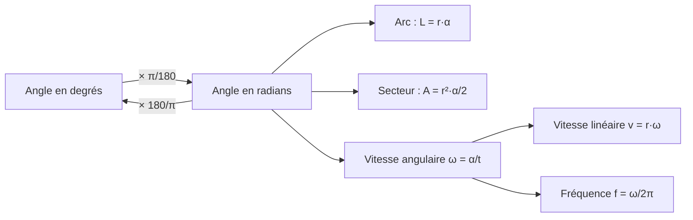

---

## 5. Exercices pratiques

### Exercice 1 — Arc de cercle

On voit un arc BC de longueur 30 cm sous un angle inscrit de 40°. Calculer le rayon r du cercle, puis l'aire du secteur circulaire BOC.

Cliquez pour voir l'indice

L'angle au centre vaut le double de l'angle inscrit. Convertissez-le en radians avant d'utiliser L = rα puis A = ½ r²α.

Solution détaillée

<mark style="color:orange;">1.</mark> Angle au centre, puis conversion en radians :

$$\large \alpha = 2 \cdot 40° = 80° = 80 \cdot \frac{\pi}{180} = \frac{4\pi}{9}$$

<mark style="color:orange;">2.</mark> Rayon :

$$\large r = \frac{L}{\alpha} = \frac{30}{4\pi/9} = \frac{270}{4\pi} = \frac{135}{2\pi} \text{ cm} \approx \color{#2F9E44}21{,}5 \text{ cm}$$

<mark style="color:orange;">3.</mark> Aire du secteur :

$$\large A = \frac{1}{2} r^2 \alpha = \frac{1}{2} r \cdot (r\alpha) = \frac{1}{2} r L = \frac{1}{2} \cdot \frac{135}{2\pi} \cdot 30 = \frac{2025}{2\pi} \approx \color{#2F9E44}322 \text{ cm}^2$$

L'astuce rα = L évite de refaire le calcul de r².

### Exercice 2 — Triangle quelconque

Dans un triangle ABC, on connaît b = 8, c = 5 et l'angle α = 60° (compris entre b et c). Calculer a, puis l'angle β.

Cliquez pour voir l'indice

Deux côtés et l'angle **compris** : c'est la loi des cosinus qui donne le troisième côté. Pour l'angle, réutilisez la loi des cosinus plutôt que la loi des sinus (pas de cas ambigu).

Solution détaillée

<mark style="color:orange;">1.</mark> Loi des cosinus :

$$\large a^2 = b^2 + c^2 - 2bc\cos\alpha = 64 + 25 - 2 \cdot 8 \cdot 5 \cdot \frac{1}{2} = 89 - 40 = 49 \quad\Rightarrow\quad \color{#2F9E44}a = 7$$

<mark style="color:orange;">2.</mark> Pour β (opposé à b), on isole cos β dans la loi des cosinus :

$$\large \cos\beta = \frac{a^2 + c^2 - b^2}{2ac} = \frac{49 + 25 - 64}{70} = \frac{10}{70} = \frac{1}{7}$$

$$\large \beta = \arccos\left(\frac{1}{7}\right) \approx \color{#2F9E44}81{,}8°$$

<mark style="color:orange;">3.</mark> Vérification : γ = 180° − 60° − 81,8° = 38,2°. Le plus petit côté (c = 5) est bien opposé au plus petit angle.

### Exercice 3 — Vitesse d'une voiture

Les roues d'une voiture ont un diamètre de 60 cm et tournent à 12 tours/s. Quelle est la vitesse de la voiture en km/h ? Quelle distance parcourt-elle en 5 min ?

Cliquez pour voir l'indice

Calculez ω = 2πf, puis v = rω avec r en mètres. Multipliez par 3,6 pour passer en km/h.

Solution détaillée

<mark style="color:orange;">1.</mark> Rayon et vitesse angulaire :

$$\large r = 0{,}30 \text{ m} \qquad \omega = 2\pi \cdot 12 = 24\pi \text{ rad/s}$$

<mark style="color:orange;">2.</mark> Vitesse linéaire :

$$\large v = r\omega = 0{,}30 \cdot 24\pi = 7{,}2\pi \approx 22{,}6 \text{ m/s} \approx \color{#2F9E44}81{,}4 \text{ km/h}$$

<mark style="color:orange;">3.</mark> En 5 min = 300 s :

$$\large d = v \cdot t \approx 22{,}6 \cdot 300 \approx 6786 \text{ m} \approx \color{#2F9E44}6{,}8 \text{ km}$$

