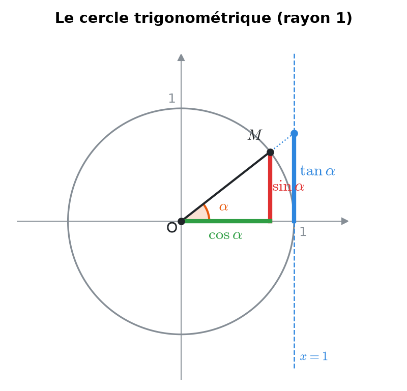
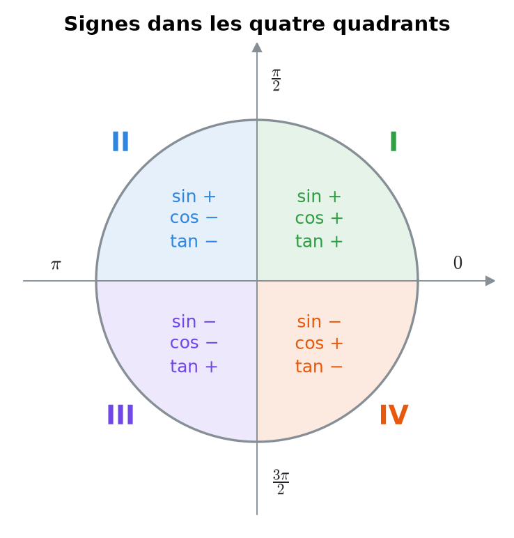
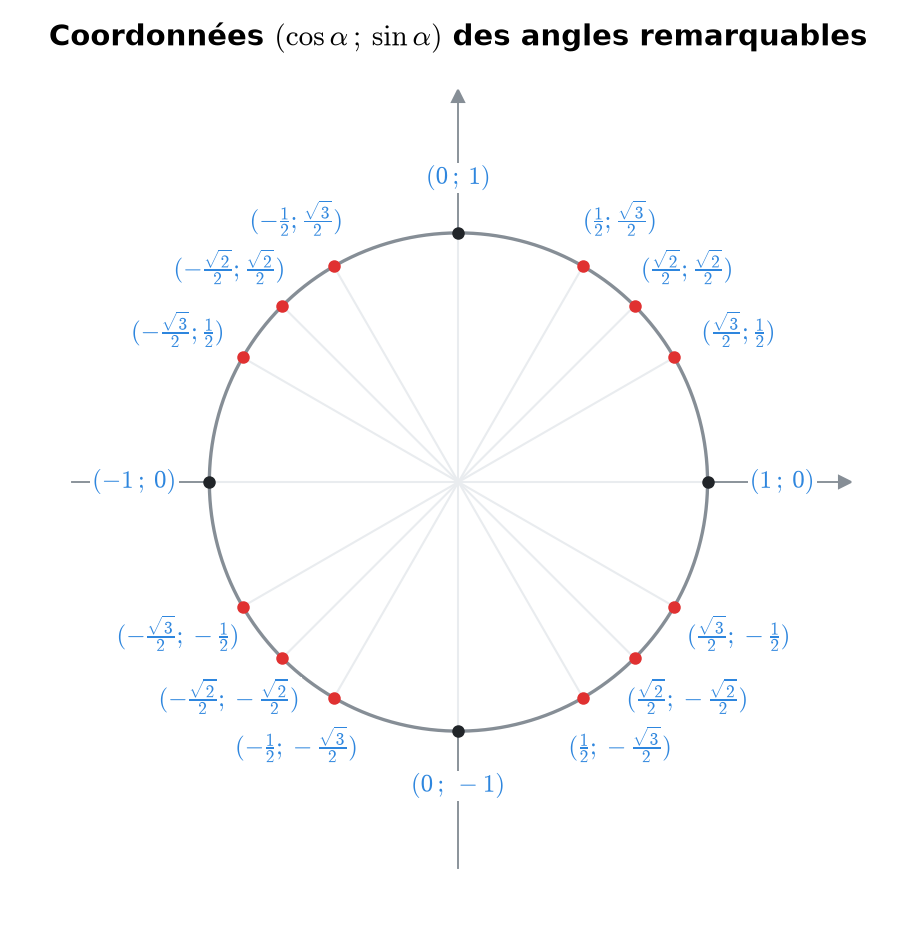
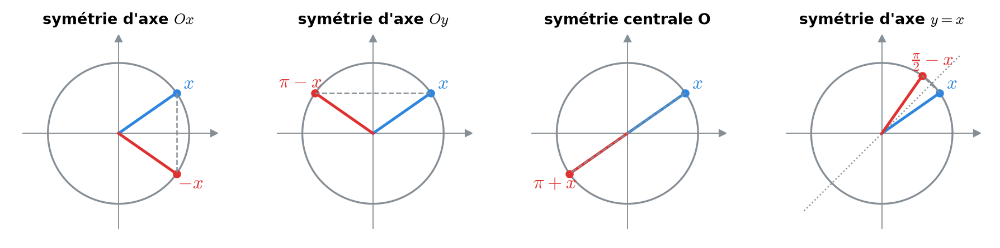
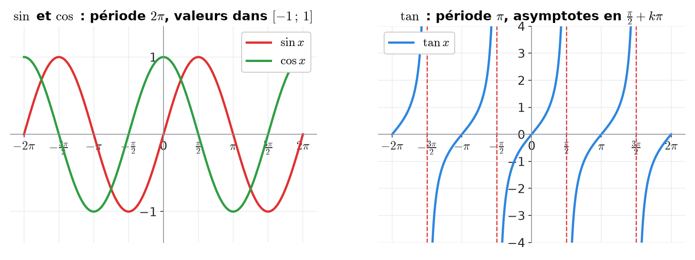
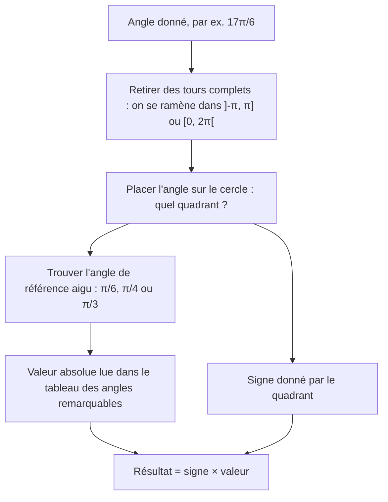
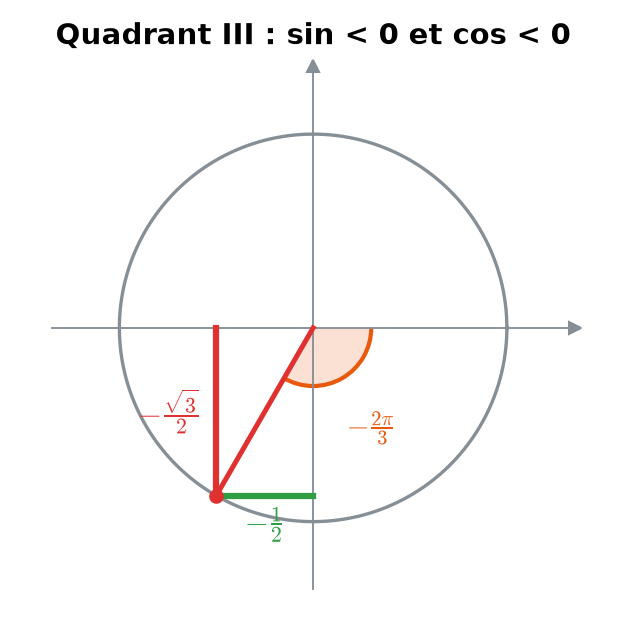
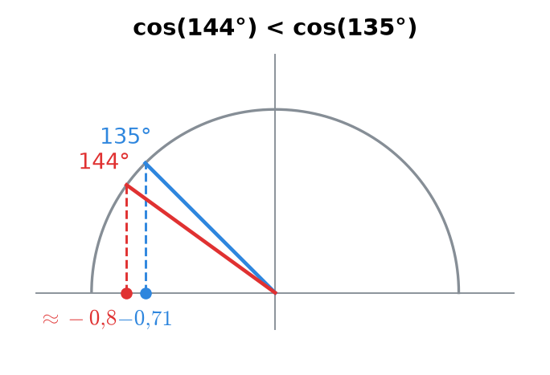
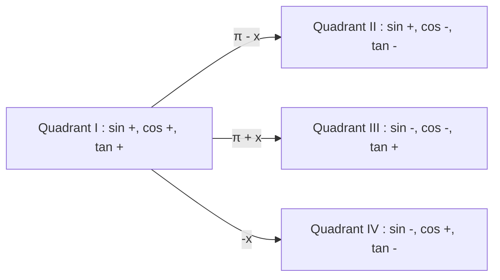

# 2. Le cercle trigonométrique


**Objectif** : lire sinus, cosinus et tangente de <mark style="color:blue;">n'importe quel angle</mark> sur le cercle unité, utiliser les symétries pour se ramener aux angles remarquables, et comparer des valeurs sans calculatrice. Les tests se font <mark style="color:red;">sans calculatrice</mark> : tout repose sur ce chapitre.


---

## 1. Introduction & définitions

### 1.1 Le cercle unité

Le <mark style="color:blue;">cercle trigonométrique</mark> est le cercle de centre O(0 ; 0) et de rayon 1. On y mesure les angles :

* à partir de l'axe Ox positif ;
* dans le <mark style="color:green;">sens antihoraire</mark> (positif) ; un angle négatif tourne dans le sens horaire.

À chaque angle α correspond un point M du cercle. <mark style="color:blue;">Par définition</mark> :

<figure><figcaption>
cos α = abscisse de M, sin α = ordonnée de M, tan α se lit sur la droite x = 1.
</figcaption></figure>

$$\Large \color{#2F9E44}\cos\alpha = x_M \qquad \color{#E03131}\sin\alpha = y_M \qquad \color{#2E86DE}\tan\alpha = \frac{\sin\alpha}{\cos\alpha}$$

Géométriquement, <mark style="color:blue;">tan α se lit sur la droite verticale x = 1</mark> : c'est l'ordonnée du point où la droite (OM) coupe cette tangente au cercle.

Comme M est sur un cercle de rayon 1, Pythagore donne immédiatement l'<mark style="color:green;">identité fondamentale</mark> :

$$\Large \boxed{\sin^2\alpha + \cos^2\alpha = 1}$$

En divisant par cos²α, puis par sin²α, on obtient deux identités utiles :

$$\large 1 + \tan^2\alpha = \sec^2\alpha \qquad\qquad 1 + \cot^2\alpha = \csc^2\alpha$$

### 1.2 Les quatre quadrants et les signes

<figure><figcaption>
Le signe de chaque fonction dépend uniquement du quadrant.
</figcaption></figure>

| Quadrant | Angles | sin | cos | tan |
| --- | --- | --- | --- | --- |
| I | $$\left]0, \frac{\pi}{2}\right[$$ | <mark style="color:green;">+</mark> | <mark style="color:green;">+</mark> | <mark style="color:green;">+</mark> |
| II | $$\left]\frac{\pi}{2}, \pi\right[$$ | <mark style="color:green;">+</mark> | <mark style="color:red;">−</mark> | <mark style="color:red;">−</mark> |
| III | $$\left]\pi, \frac{3\pi}{2}\right[$$ | <mark style="color:red;">−</mark> | <mark style="color:red;">−</mark> | <mark style="color:green;">+</mark> |
| IV | $$\left]\frac{3\pi}{2}, 2\pi\right[$$ | <mark style="color:red;">−</mark> | <mark style="color:green;">+</mark> | <mark style="color:red;">−</mark> |

Les fonctions sec, csc, cot ont respectivement le signe de cos, sin, tan.

### 1.3 Les angles remarquables

| α | 0 | π/6 | π/4 | π/3 | π/2 |
| --- | --- | --- | --- | --- | --- |
| sin α | $$0$$ | $$\frac{1}{2}$$ | $$\frac{\sqrt{2}}{2}$$ | $$\frac{\sqrt{3}}{2}$$ | $$1$$ |
| cos α | $$1$$ | $$\frac{\sqrt{3}}{2}$$ | $$\frac{\sqrt{2}}{2}$$ | $$\frac{1}{2}$$ | $$0$$ |
| tan α | $$0$$ | $$\frac{\sqrt{3}}{3}$$ | $$1$$ | $$\sqrt{3}$$ | non défini |

<figure><figcaption>
Chaque point du cercle a pour coordonnées (cos α ; sin α).
</figcaption></figure>


**Astuce mémoire** : les sinus de 0, π/6, π/4, π/3, π/2 valent

$$\Large \frac{\sqrt{0}}{2},\ \frac{\sqrt{1}}{2},\ \frac{\sqrt{2}}{2},\ \frac{\sqrt{3}}{2},\ \frac{\sqrt{4}}{2}$$

et les cosinus sont <mark style="color:green;">la même liste à l'envers</mark>.


### 1.4 Les symétries (« angles associés »)

Toutes ces formules se <mark style="color:blue;">lisent sur le cercle</mark> : il suffit de dessiner l'angle x et l'angle transformé.

<figure><figcaption>
L'angle x (bleu) et son angle associé (rouge).
</figcaption></figure>

| Transformation | Symétrie sur le cercle | Résultat |
| --- | --- | --- |
| −x | par rapport à l'axe Ox | $$\sin(-x) = -\sin x \quad \cos(-x) = \cos x$$ |
| π − x | par rapport à l'axe Oy | $$\sin(\pi - x) = \sin x \quad \cos(\pi - x) = -\cos x$$ |
| π + x | par rapport à l'origine | $$\sin(\pi + x) = -\sin x \quad \cos(\pi + x) = -\cos x$$ |
| π/2 − x | par rapport à la bissectrice y = x | $$\sin\left(\tfrac{\pi}{2} - x\right) = \cos x \quad \cos\left(\tfrac{\pi}{2} - x\right) = \sin x$$ |
| π/2 + x | rotation d'un quart de tour | $$\sin\left(\tfrac{\pi}{2} + x\right) = \cos x \quad \cos\left(\tfrac{\pi}{2} + x\right) = -\sin x$$ |
| x + 2kπ | un ou plusieurs tours complets | valeurs inchangées (<mark style="color:green;">période 2π</mark>) |

Conséquences pour la tangente :

$$\large \tan(-x) = -\tan x \qquad \tan(\pi + x) = \tan x \qquad \tan\left(\tfrac{\pi}{2} + x\right) = -\cot x \qquad \tan(\pi - x) = -\tan x$$

La tangente a donc une <mark style="color:green;">période π</mark> (et non 2π).

<figure><figcaption>
Graphes de sin, cos (période 2π) et tan (période π).
</figcaption></figure>

---

## 2. Méthodes de résolution

### Méthode A — Évaluer sin, cos, tan d'un angle quelconque

### Méthode B — Une fonction connue, trouver toutes les autres

1. Placer l'angle dans son <mark style="color:blue;">quadrant</mark> (donné par l'énoncé) : cela fixe <mark style="color:green;">tous les signes</mark>.
2. Dessiner un triangle rectangle « de référence » avec les longueurs positives. Par exemple cos α = 4/5 → adjacent 4, hypoténuse 5, donc opposé 3 par Pythagore.
3. Écrire chaque fonction avec les longueurs du triangle, puis <mark style="color:red;">appliquer le signe</mark> du quadrant.

### Méthode C — Estimer une valeur sans calculatrice (« exclure les valeurs erronées »)

1. Placer l'angle : le <mark style="color:blue;">signe</mark> élimine déjà la moitié des propositions.
2. Encadrer l'angle entre deux angles remarquables et utiliser la <mark style="color:blue;">monotonie</mark> de la fonction sur ce quadrant.

### Méthode D — Comparer deux expressions (<, > ou =)

1. Réécrire les deux expressions avec les symétries (par exemple tan(π/2 + α) = −cot α).
2. Déterminer le <mark style="color:blue;">signe</mark> de chaque expression grâce au quadrant.
3. Si les signes sont égaux, comparer les <mark style="color:blue;">valeurs absolues</mark> en lisant le dessin (longueurs des segments sur le cercle).

---

## 3. Exemples de calculs détaillés

### Exemple 1 — Valeurs d'un angle négatif (Test 1, variante A)

*Donner sin, cos et tan de −2π/3.*

<figure><figcaption></figcaption></figure>

<mark style="color:orange;">Étape 1 — Placer l'angle.</mark> −2π/3 = −120° : on tourne de 120° dans le sens horaire. On arrive dans le <mark style="color:blue;">quadrant III</mark> (sin < 0, cos < 0).

<mark style="color:orange;">Étape 2 — Angle de référence</mark> : π − 2π/3 = π/3.

$$\large \sin\left(-\frac{2\pi}{3}\right) = \color{#2F9E44}-\frac{\sqrt{3}}{2} \qquad \cos\left(-\frac{2\pi}{3}\right) = \color{#2F9E44}-\frac{1}{2}$$

$$\large \tan\left(-\frac{2\pi}{3}\right) = \frac{-\sqrt{3}/2}{-1/2} = \color{#2F9E44}\sqrt{3}$$

La tangente est positive, ce qui est bien cohérent avec le quadrant III.

### Exemple 2 — Retrouver toutes les fonctions (Test 1, variante A)

*α ∈ \[3π/2, 2π] et cos α = 4/5. Calculer les autres fonctions trigonométriques.*

<mark style="color:orange;">Étape 1 — Quadrant IV</mark> : cos > 0, sin < 0, donc tan < 0.

<mark style="color:orange;">Étape 2 — Sinus</mark> par l'identité fondamentale :

$$\large \sin^2\alpha = 1 - \frac{16}{25} = \frac{9}{25} \quad\Rightarrow\quad \sin\alpha = \color{#2F9E44}-\frac{3}{5}$$

On garde la racine <mark style="color:red;">négative</mark> à cause du quadrant.

<mark style="color:orange;">Étape 3 — Le reste</mark> découle des définitions :

$$\large \tan\alpha = \frac{-3/5}{4/5} = -\frac{3}{4} \qquad \cot\alpha = -\frac{4}{3} \qquad \sec\alpha = \frac{5}{4} \qquad \csc\alpha = -\frac{5}{3}$$

### Exemple 3 — Réduire un grand angle

*Calculer sin(17π/6) et tan(5π/4).*

<mark style="color:orange;">a)</mark> 17π/6 = 2π + 5π/6 : un tour complet ne change rien, on étudie 5π/6 (quadrant II, référence π/6). Le sinus est positif :

$$\large \sin\left(\frac{17\pi}{6}\right) = \sin\left(\frac{5\pi}{6}\right) = \sin\left(\pi - \frac{\pi}{6}\right) = \sin\left(\frac{\pi}{6}\right) = \color{#2F9E44}\frac{1}{2}$$

<mark style="color:orange;">b)</mark> 5π/4 = π + π/4 et la tangente est de période π :

$$\large \tan\left(\frac{5\pi}{4}\right) = \tan\left(\frac{\pi}{4}\right) = \color{#2F9E44}1$$

### Exemple 4 — Estimation (Test 1)

*cos(4π/5) arrondi à 1 décimale vaut-il 0,3 ; −0,3 ; 0,8 ou −0,8 ?*

<figure><figcaption></figcaption></figure>

<mark style="color:orange;">1.</mark> 4π/5 = 144° est dans le quadrant II : le cosinus est <mark style="color:red;">négatif</mark>. Il reste −0,3 ou −0,8.

<mark style="color:orange;">2.</mark> 144° > 135° et le cosinus décroît sur le quadrant II, donc :

$$\large \cos(144°) < \cos(135°) = -\frac{\sqrt{2}}{2} \approx -0{,}71$$

<mark style="color:green;">Réponse : −0,8.</mark>

*sin(6π/7) vaut-il 0,4 ; −0,4 ; 0,6 ou −0,6 ?*

<mark style="color:orange;">1.</mark> Symétrie d'axe Oy :

$$\large \sin\left(\frac{6\pi}{7}\right) = \sin\left(\pi - \frac{\pi}{7}\right) = \sin\left(\frac{\pi}{7}\right) > 0$$

<mark style="color:orange;">2.</mark> Or π/7 < π/6 et sin(π/6) = 0,5 : la valeur est inférieure à 0,5. <mark style="color:green;">Réponse : 0,4.</mark>

### Exemple 5 — Comparer (TE F-1, « Comparaison d'angles »)

*γ est un angle du quadrant II. Compléter : sec(γ) □ cos(γ).*

<mark style="color:orange;">1.</mark> Dans le quadrant II, cos γ est compris entre −1 et 0.

<mark style="color:orange;">2.</mark> L'inverse d'un nombre compris entre −1 et 0 est inférieur à −1 :

$$\large \sec\gamma = \frac{1}{\cos\gamma} < -1 < \cos\gamma \quad\Rightarrow\quad \color{#2F9E44}\sec(\gamma) < \cos(\gamma)$$

*α est un angle du quadrant I. Compléter : tan(π/2 + α) □ cot(α).*

<mark style="color:orange;">1.</mark> Symétrie :

$$\large \tan\left(\frac{\pi}{2} + \alpha\right) = -\cot\alpha$$

<mark style="color:orange;">2.</mark> Dans le quadrant I, cot α > 0, donc −cot α < 0 < cot α : <mark style="color:green;">on écrit <</mark>.

---

## 4. Visualisation : se repérer sur le cercle

Chaque flèche indique comment l'angle de référence x du quadrant I « se transporte » dans les autres quadrants : la <mark style="color:green;">valeur absolue</mark> reste celle de x, seul le <mark style="color:red;">signe</mark> change.

---

## 5. Exercices pratiques

### Exercice 1 — Trouver les autres fonctions

L'angle α se trouve dans \[−3π/2, −π] et sin α = 3/5. Calculer exactement cos α, tan α, cot α, sec α et csc α.

Cliquez pour voir l'indice

Ajoutez 2π pour voir dans quel quadrant « usuel » se trouve l'intervalle \[−3π/2, −π]. Le signe du cosinus en découle.

Solution détaillée

<mark style="color:orange;">1.</mark> On ajoute un tour :

$$\large \left[-\frac{3\pi}{2}, -\pi\right] + 2\pi = \left[\frac{\pi}{2}, \pi\right]$$

C'est le <mark style="color:blue;">quadrant II</mark> : sin > 0 ✓, cos < 0.

<mark style="color:orange;">2.</mark> Cosinus :

$$\large \cos^2\alpha = 1 - \frac{9}{25} = \frac{16}{25} \quad\Rightarrow\quad \cos\alpha = \color{#2F9E44}-\frac{4}{5}$$

<mark style="color:orange;">3.</mark> Les autres fonctions :

$$\large \tan\alpha = \frac{3/5}{-4/5} = -\frac{3}{4} \qquad \cot\alpha = -\frac{4}{3} \qquad \sec\alpha = -\frac{5}{4} \qquad \csc\alpha = \frac{5}{3}$$

### Exercice 2 — Valeurs exactes

Calculer sans calculatrice :

$$\large \text{a) } \cos\left(\frac{4\pi}{3}\right) \qquad \text{b) } \sin\left(-\frac{5\pi}{6}\right) \qquad \text{c) } \tan\left(\frac{5\pi}{6}\right) \qquad \text{d) } \sec\left(\frac{7\pi}{4}\right)$$

Cliquez pour voir l'indice

Pour chaque angle : quadrant (→ signe), puis angle de référence parmi π/6, π/4, π/3 (→ valeur absolue).

Solution détaillée

<mark style="color:orange;">a)</mark> 4π/3 = π + π/3, quadrant III, cosinus négatif :

$$\large \cos\left(\frac{4\pi}{3}\right) = -\cos\left(\frac{\pi}{3}\right) = \color{#2F9E44}-\frac{1}{2}$$

<mark style="color:orange;">b)</mark> −5π/6 est dans le quadrant III (on tourne de 150° en sens horaire), sinus négatif, référence π/6 :

$$\large \sin\left(-\frac{5\pi}{6}\right) = \color{#2F9E44}-\frac{1}{2}$$

<mark style="color:orange;">c)</mark> 5π/6 = π − π/6, quadrant II, tangente négative :

$$\large \tan\left(\frac{5\pi}{6}\right) = -\tan\left(\frac{\pi}{6}\right) = \color{#2F9E44}-\frac{\sqrt{3}}{3}$$

<mark style="color:orange;">d)</mark> 7π/4 = 2π − π/4, quadrant IV, cosinus positif :

$$\large \cos\left(\frac{7\pi}{4}\right) = \frac{\sqrt{2}}{2} \quad\Rightarrow\quad \sec\left(\frac{7\pi}{4}\right) = \frac{2}{\sqrt{2}} = \color{#2F9E44}\sqrt{2}$$

### Exercice 3 — Comparaisons

Soit β ∈ ]π/2, π\[ (quadrant II) et δ ∈ ]−π/2, 0\[ (quadrant IV). Compléter par <, > ou = :

$$\large \text{a) } \cos(\beta) \;\square\; \tan(\pi - \beta) \qquad \text{b) } \sin(\beta) \;\square\; \sin(\pi - \beta) \qquad \text{c) } \tan(\delta) \;\square\; \tan(-\delta)$$

Cliquez pour voir l'indice

Utilisez tan(π − β) = −tan β et sin(π − β) = sin β, puis raisonnez sur les signes.

Solution détaillée

<mark style="color:orange;">a)</mark> β au quadrant II : cos β < 0. Et tan(π − β) = −tan β ; comme tan β < 0 au quadrant II, −tan β > 0. Donc :

$$\large \color{#2F9E44}\cos(\beta) < \tan(\pi - \beta)$$

<mark style="color:orange;">b)</mark> La symétrie par rapport à l'axe Oy conserve le sinus :

$$\large \color{#2F9E44}\sin(\beta) = \sin(\pi - \beta)$$

<mark style="color:orange;">c)</mark> δ au quadrant IV : tan δ < 0 ; et tan(−δ) = −tan δ > 0. Donc :

$$\large \color{#2F9E44}\tan(\delta) < \tan(-\delta)$$

