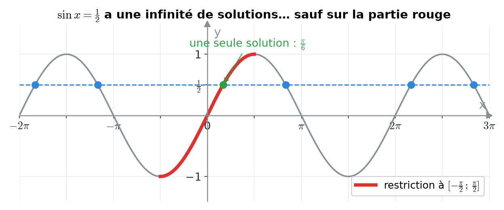
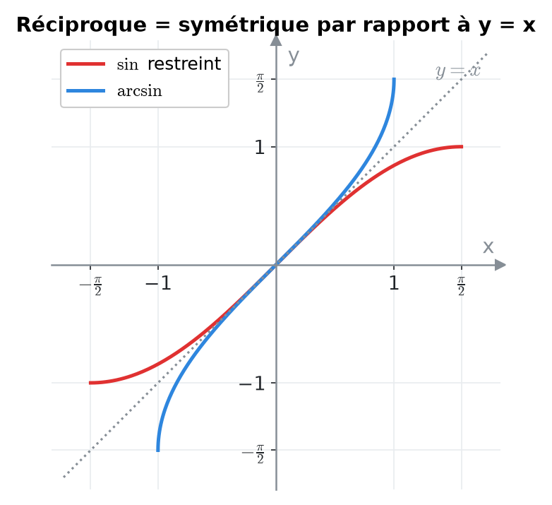
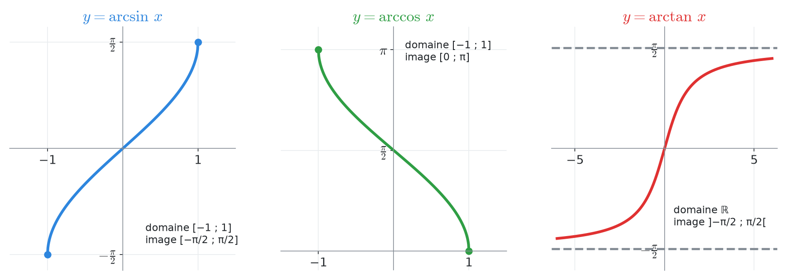
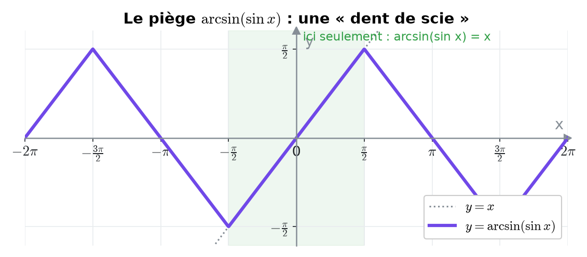
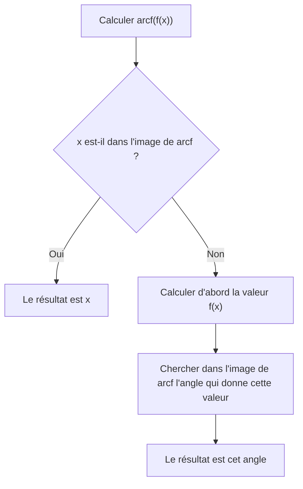
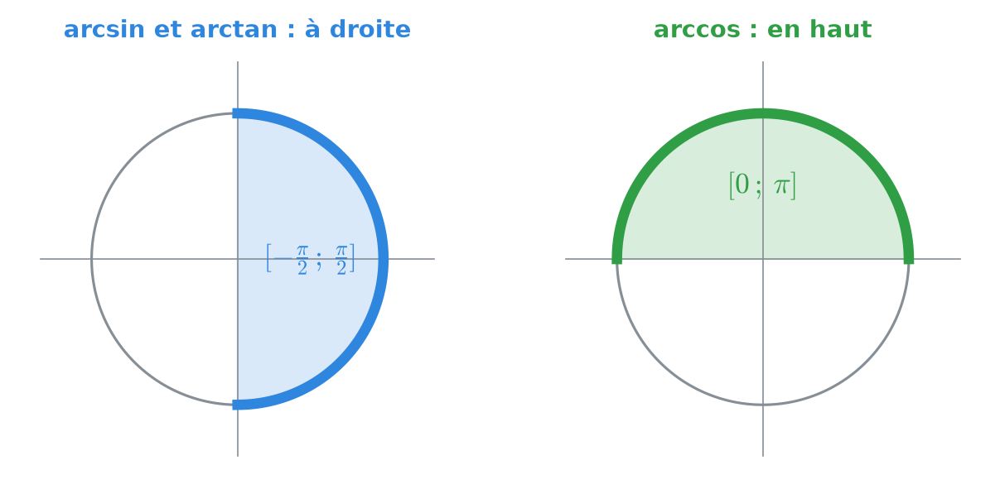
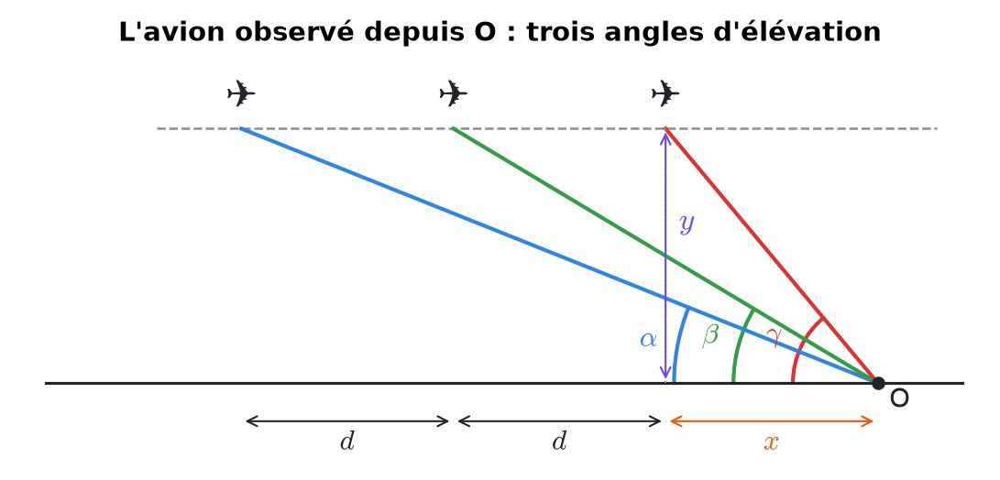
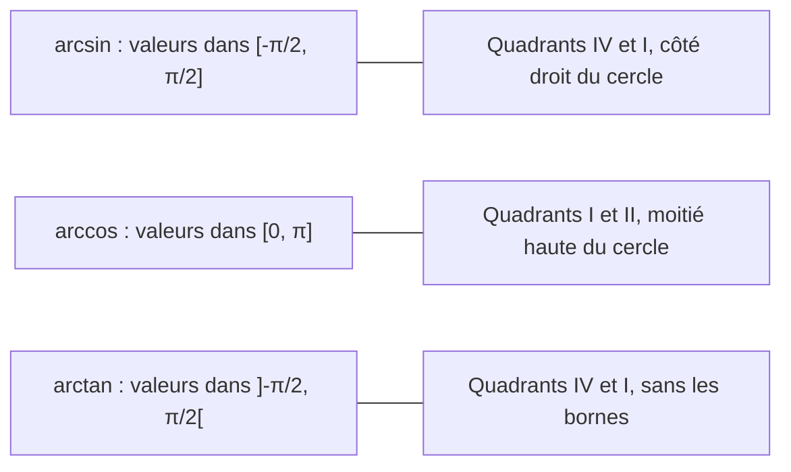

# 3. Fonctions trigonométriques réciproques


**Objectif** : connaître arcsin, arccos, arctan (domaines, images, graphes), calculer leurs valeurs exactes, déjouer les pièges du type arcsin(sin x), et les utiliser pour exprimer un angle inconnu (problème de l'avion). Ce chapitre correspond à <mark style="color:blue;">« Test 1 Pb 2 »</mark>.


---

## 1. Introduction & définitions

### 1.1 Pourquoi « restreindre » ?

On voudrait « défaire » le sinus : trouver l'angle x tel que sin x = y. Problème : il y a <mark style="color:red;">une infinité de réponses</mark>. Par exemple :

$$\large \sin x = \frac{1}{2} \quad\text{pour}\quad x = \frac{\pi}{6},\ \frac{5\pi}{6},\ \frac{13\pi}{6},\ \dots$$

Or une fonction ne peut renvoyer qu'<mark style="color:blue;">une seule valeur</mark>.

<figure><figcaption>
Sur la partie rouge, le sinus prend chaque valeur une seule fois.
</figcaption></figure>

On restreint donc chaque fonction à un intervalle où elle est <mark style="color:green;">bijective</mark> (strictement monotone et prenant toutes ses valeurs une seule fois). Sa réciproque est alors bien définie.

### 1.2 Les trois fonctions

| Fonction | Domaine | Image | Se lit « l'angle… » |
| --- | --- | --- | --- |
| <mark style="color:blue;">arcsin x</mark> | \[−1, 1] | $$\left[-\frac{\pi}{2}, \frac{\pi}{2}\right]$$ | …de \[−90°, 90°] dont le sinus vaut x |
| <mark style="color:green;">arccos x</mark> | \[−1, 1] | $$[0, \pi]$$ | …de \[0°, 180°] dont le cosinus vaut x |
| <mark style="color:red;">arctan x</mark> | ℝ | $$\left]-\frac{\pi}{2}, \frac{\pi}{2}\right[$$ | …de ]−90°, 90°\[ dont la tangente vaut x |

Ainsi, par définition :

$$\Large \boxed{y = \arcsin x \iff \sin y = x \ \text{ et } \ y \in \left[-\tfrac{\pi}{2}, \tfrac{\pi}{2}\right]}$$

### 1.3 Graphes et propriétés

Le graphe d'une réciproque est le <mark style="color:blue;">symétrique</mark> du graphe de la fonction (restreinte) par rapport à la droite y = x.

<figure><figcaption>
arcsin (bleu) est le miroir du sinus restreint (rouge).
</figcaption></figure>

<figure><figcaption>
Les trois fonctions réciproques.
</figcaption></figure>

* <mark style="color:blue;">arcsin</mark> : croissante, impaire, passe par (−1 ; −π/2), (0 ; 0), (1 ; π/2). Tangentes verticales aux extrémités.
* <mark style="color:green;">arccos</mark> : décroissante, passe par (−1 ; π), (0 ; π/2), (1 ; 0). Ni paire ni impaire.
* <mark style="color:red;">arctan</mark> : croissante, impaire, définie sur tout ℝ, avec deux <mark style="color:blue;">asymptotes horizontales</mark> y = −π/2 (en −∞) et y = π/2 (en +∞).

Symétries utiles :

$$\large \arcsin(-x) = -\arcsin x \qquad \arctan(-x) = -\arctan x \qquad \arccos(-x) = \pi - \arccos x$$

| Fonction | Borne min | Borne max | Asymptotes |
| --- | --- | --- | --- |
| arcsin | −π/2 en x = −1 | π/2 en x = 1 | aucune |
| arccos | 0 en x = 1 | π en x = −1 | aucune |
| arctan | aucune (inf. −π/2) | aucune (sup. π/2) | y = ±π/2 |

### 1.4 Compositions : le piège classique

<mark style="color:green;">Toujours vrai</mark> : on part d'un nombre, on prend un angle, on revient au nombre.

$$\Large \sin(\arcsin x) = x \qquad \text{pour tout } x \in [-1, 1]$$

<mark style="color:red;">Seulement si x est dans l'image</mark> :

$$\Large \arcsin(\sin x) = x \qquad \text{seulement si } x \in \left[-\tfrac{\pi}{2}, \tfrac{\pi}{2}\right]$$

Sinon, le résultat est <mark style="color:blue;">l'angle de l'image</mark> \[−π/2, π/2] qui a le même sinus que x.

<figure><figcaption>
arcsin(sin x) ne coïncide avec x que dans la bande verte.
</figcaption></figure>

Mêmes règles pour arccos (image \[0, π]) et arctan (image ]−π/2, π/2\[).

---

## 2. Méthodes de résolution

### Méthode A — Valeur exacte de arcsin a, arccos a, arctan a

1. Chercher l'angle remarquable de référence dont la fonction vaut |a|.
2. Choisir, <mark style="color:red;">dans l'image de la fonction réciproque</mark>, l'angle qui a le bon signe.

### Méthode B — Calculer arcsin(sin x), arccos(cos x), arctan(tan x)

### Méthode C — Calculer sin(arccos a), tan(arcsin a), etc.

1. Poser θ = arccos a : on sait que cos θ = a <mark style="color:blue;">et</mark> θ ∈ \[0, π].
2. Utiliser sin²θ + cos²θ = 1 pour la valeur absolue.
3. Choisir le <mark style="color:red;">signe</mark> grâce à l'intervalle de θ (par exemple, sur \[0, π], sin θ ≥ 0).

### Méthode D — Exprimer un angle inconnu (problèmes de visée)

1. Faire un <mark style="color:blue;">croquis</mark>, introduire les distances inconnues (altitude y, distances horizontales x, d).
2. Écrire une équation en tan (ou cot = 1/tan) pour <mark style="color:blue;">chaque</mark> angle de visée.
3. Éliminer les inconnues auxiliaires par combinaison des équations.
4. Conclure avec arctan (valable si l'angle cherché est aigu).

---

## 3. Exemples de calculs détaillés

### Exemple 1 — Valeurs exactes (Test 1, variante A)

<figure><figcaption>
Où chercher le résultat : à droite pour arcsin / arctan, en haut pour arccos.
</figcaption></figure>

<mark style="color:orange;">a)</mark> arcsin(−√3/2) : l'angle de référence est π/3 ; on cherche dans \[−π/2, π/2] un angle de sinus <mark style="color:red;">négatif</mark> :

$$\large \arcsin\left(-\frac{\sqrt{3}}{2}\right) = \color{#2F9E44}-\frac{\pi}{3}$$

<mark style="color:orange;">b)</mark> arccos(−√2/2) : référence π/4 ; dans \[0, π], le cosinus est négatif au quadrant II :

$$\large \arccos\left(-\frac{\sqrt{2}}{2}\right) = \pi - \frac{\pi}{4} = \color{#2F9E44}\frac{3\pi}{4}$$

<mark style="color:orange;">c)</mark> arctan(−√3) : référence π/3, dans ]−π/2, π/2\[ :

$$\large \arctan(-\sqrt{3}) = \color{#2F9E44}-\frac{\pi}{3}$$

### Exemple 2 — Compositions (Test 1, variante A)

On prend x = 2π/3, qui est au quadrant II.

<mark style="color:orange;">a)</mark> 2π/3 n'est <mark style="color:red;">pas</mark> dans \[−π/2, π/2]. On calcule d'abord le sinus :

$$\large \arcsin\left(\sin\frac{2\pi}{3}\right) = \arcsin\left(\frac{\sqrt{3}}{2}\right) = \color{#2F9E44}\frac{\pi}{3}$$

<mark style="color:orange;">b)</mark> 2π/3 est dans \[0, π], donc le résultat est directement x :

$$\large \arccos\left(\cos\frac{2\pi}{3}\right) = \color{#2F9E44}\frac{2\pi}{3}$$

<mark style="color:orange;">c)</mark> La tangente a une période π, et 2π/3 − π = −π/3 est dans l'image :

$$\large \arctan\left(\tan\frac{2\pi}{3}\right) = \arctan(-\sqrt{3}) = \color{#2F9E44}-\frac{\pi}{3}$$

### Exemple 3 — Un sinus d'arctangente

*Calculer sin(arctan(−1)).*

$$\large \arctan(-1) = -\frac{\pi}{4} \quad\Rightarrow\quad \sin\left(-\frac{\pi}{4}\right) = \color{#2F9E44}-\frac{\sqrt{2}}{2}$$


Erreur fréquente vue dans les copies : répondre sin(3π/4). L'angle 3π/4 a bien une tangente égale à −1, mais il n'est <mark style="color:red;">pas dans l'image de arctan</mark>.


### Exemple 4 — L'avion observé (Test 1 Pb 2)

*Un avion vole horizontalement à altitude inconnue y et vitesse constante. L'observateur en O le voit sous l'angle d'élévation α à l'instant t, sous β une minute plus tard, et sous γ encore une minute plus tard. Les trois angles sont aigus. Exprimer γ en fonction de α et β.*

<figure><figcaption>
En une minute, l'avion parcourt la distance d.
</figcaption></figure>

<mark style="color:orange;">Étape 1 — Notations.</mark> L'avion s'approche de O. Soit x sa distance horizontale à O au 3e instant et d la distance parcourue en une minute. Aux trois instants, les distances horizontales valent x + 2d, x + d et x.

<mark style="color:orange;">Étape 2 — Une équation par angle</mark> (tan = opposé / adjacent) :

$$\large \tan\alpha = \frac{y}{x + 2d} \qquad \tan\beta = \frac{y}{x + d} \qquad \tan\gamma = \frac{y}{x}$$

On inverse les deux premières pour isoler des rapports simples :

$$\large \frac{1}{\tan\alpha} = \frac{x}{y} + 2\frac{d}{y} \quad (1) \qquad\qquad \frac{1}{\tan\beta} = \frac{x}{y} + \frac{d}{y} \quad (2)$$

<mark style="color:orange;">Étape 3 — Éliminer d.</mark> La différence (1) − (2) donne :

$$\large \frac{d}{y} = \frac{1}{\tan\alpha} - \frac{1}{\tan\beta}$$

On remplace dans (2) :

$$\large \frac{x}{y} = \frac{1}{\tan\beta} - \frac{d}{y} = \frac{2}{\tan\beta} - \frac{1}{\tan\alpha}$$

<mark style="color:orange;">Étape 4 — Conclure.</mark> Comme tan γ = y / x :

$$\large \tan\gamma = \frac{1}{\frac{2}{\tan\beta} - \frac{1}{\tan\alpha}} = \frac{\tan\alpha\tan\beta}{2\tan\alpha - \tan\beta}$$

γ étant aigu, il est dans l'image de arctan :

$$\Large \boxed{\color{#2F9E44}\gamma = \arctan\left(\frac{\tan\alpha \tan\beta}{2\tan\alpha - \tan\beta}\right)}$$

<mark style="color:blue;">Contrôle de vraisemblance</mark> : si α = β (l'avion est très loin, les angles varient peu), on obtient tan γ = tan α. C'est cohérent.

---

## 4. Visualisation : où vivent les résultats


Retenir cette image évite 90 % des erreurs : <mark style="color:blue;">arcsin et arctan renvoient un angle « à droite »</mark>, <mark style="color:green;">arccos un angle « en haut »</mark>.


---

## 5. Exercices pratiques

### Exercice 1 — Valeurs réciproques (Test 1, variante B)

Calculer :

$$\large \text{a) } \arcsin\left(-\tfrac{\sqrt{2}}{2}\right) \quad \text{b) } \arccos\left(-\tfrac{\sqrt{3}}{2}\right) \quad \text{c) } \arctan\left(-\tfrac{\sqrt{3}}{3}\right)$$

$$\large \text{d) } \arcsin\left(\sin\tfrac{7\pi}{6}\right) \quad \text{e) } \arccos\left(\cos\tfrac{7\pi}{6}\right) \quad \text{f) } \arctan\left(\tan\tfrac{7\pi}{6}\right)$$

Cliquez pour voir l'indice

Pour d), e), f), calculez d'abord sin, cos et tan de 7π/6 (quadrant III, référence π/6), puis cherchez l'angle dans la bonne image.

Solution détaillée

<mark style="color:orange;">a)</mark> Référence π/4, sinus négatif dans \[−π/2, π/2] : <mark style="color:green;">−π/4</mark>.

<mark style="color:orange;">b)</mark> Référence π/6, cosinus négatif dans \[0, π] : π − π/6 = <mark style="color:green;">5π/6</mark>.

<mark style="color:orange;">c)</mark> Référence π/6 : <mark style="color:green;">−π/6</mark>.

<mark style="color:orange;">d)</mark>

$$\large \sin\frac{7\pi}{6} = -\frac{1}{2} \quad\Rightarrow\quad \arcsin\left(-\frac{1}{2}\right) = \color{#2F9E44}-\frac{\pi}{6}$$

<mark style="color:orange;">e)</mark>

$$\large \cos\frac{7\pi}{6} = -\frac{\sqrt{3}}{2} \quad\Rightarrow\quad \arccos\left(-\frac{\sqrt{3}}{2}\right) = \color{#2F9E44}\frac{5\pi}{6}$$

<mark style="color:orange;">f)</mark>

$$\large \tan\frac{7\pi}{6} = \tan\frac{\pi}{6} = \frac{\sqrt{3}}{3} \quad\Rightarrow\quad \arctan\frac{\sqrt{3}}{3} = \color{#2F9E44}\frac{\pi}{6}$$

### Exercice 2 — Compositions mixtes

Calculer exactement :

$$\large \text{a) } \cos\left(\arcsin\left(-\tfrac{1}{3}\right)\right) \qquad \text{b) } \sin\left(\arctan\tfrac{3}{4}\right) \qquad \text{c) } \tan\left(\arccos\left(-\tfrac{3}{5}\right)\right)$$

Cliquez pour voir l'indice

Posez θ égal à la fonction réciproque. Écrivez ce que vous savez sur θ (une valeur trigonométrique **et** un intervalle), puis utilisez sin² + cos² = 1 ou un triangle rectangle de référence.

Solution détaillée

<mark style="color:orange;">a)</mark> θ = arcsin(−1/3) : sin θ = −1/3 et θ ∈ \[−π/2, 0], où le cosinus est <mark style="color:green;">positif</mark> :

$$\large \cos\theta = +\sqrt{1 - \frac{1}{9}} = \sqrt{\frac{8}{9}} = \color{#2F9E44}\frac{2\sqrt{2}}{3}$$

<mark style="color:orange;">b)</mark> θ = arctan(3/4) : tan θ = 3/4 avec θ ∈ ]0, π/2\[. Triangle de référence : opposé 3, adjacent 4, hypoténuse 5. Donc :

$$\large \sin\theta = \color{#2F9E44}\frac{3}{5}$$

<mark style="color:orange;">c)</mark> θ = arccos(−3/5) : cos θ = −3/5 et θ ∈ \[0, π], donc sin θ ≥ 0 et sin θ = 4/5. D'où :

$$\large \tan\theta = \frac{4/5}{-3/5} = \color{#2F9E44}-\frac{4}{3}$$

### Exercice 3 — Vrai ou faux ? (TE F-1)

Justifier :

* a) arccos(cos(−π/3)) = −π/3 ;
* b) l'équation arccos(x) = −1 possède une solution ;
* c) pour tout x ∈ \[0, 1], sin(arcsin x) = x ;
* d) arcsin(sin 2π/3) = 2π/3.

Cliquez pour voir l'indice

Comparez chaque résultat proposé avec l'**image** de la fonction réciproque.

Solution détaillée

<mark style="color:orange;">a)</mark> <mark style="color:red;">Faux</mark> : cos(−π/3) = 1/2 et arccos(1/2) = π/3. Un arccos ne peut jamais être négatif.

<mark style="color:orange;">b)</mark> <mark style="color:red;">Faux</mark> : l'image de arccos est \[0, π] ; −1 n'y appartient pas.

<mark style="color:orange;">c)</mark> <mark style="color:green;">Vrai</mark> : sin(arcsin x) = x pour tout x ∈ \[−1, 1], donc en particulier sur \[0, 1].

<mark style="color:orange;">d)</mark> <mark style="color:red;">Faux</mark> : 2π/3 n'est pas dans \[−π/2, π/2] ; le résultat vaut π/3.

