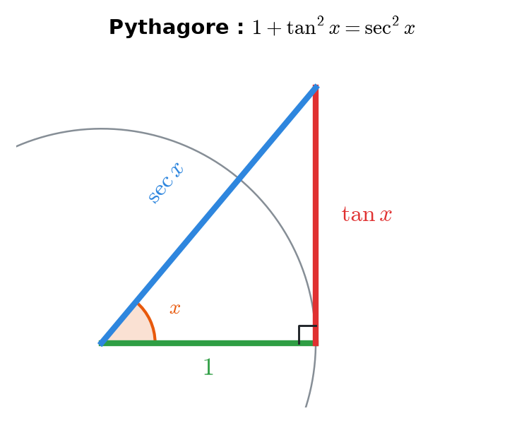
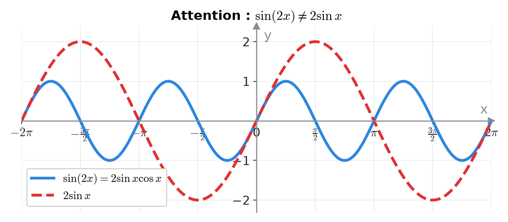
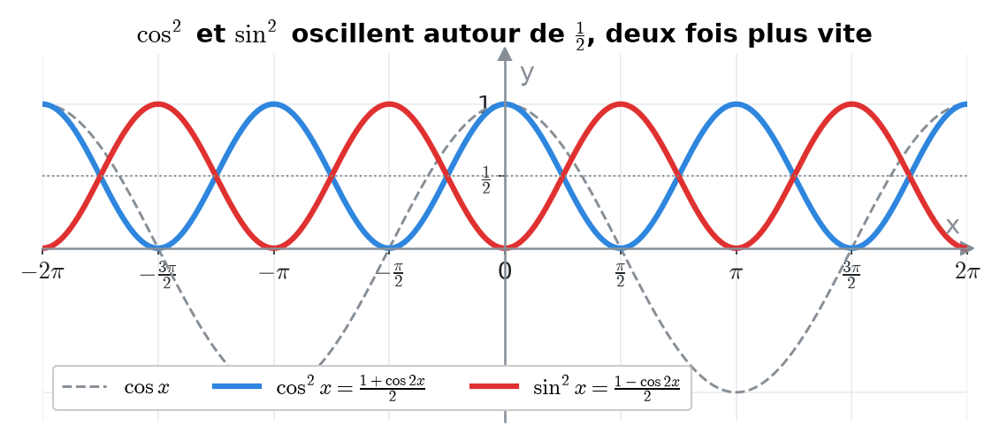
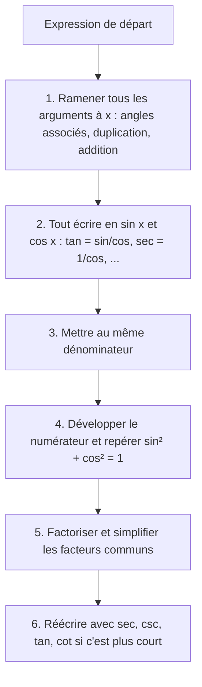
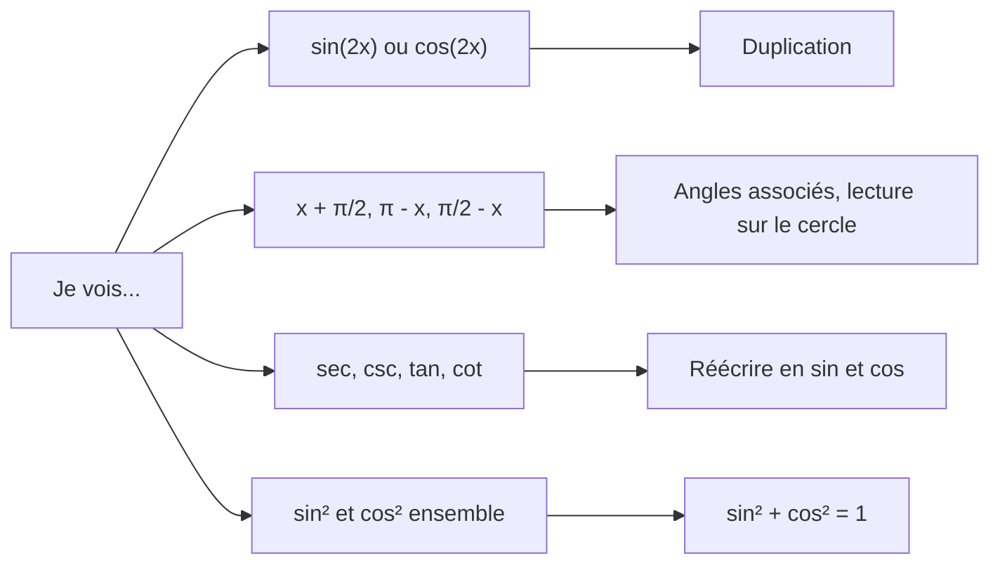

# 4. Identités trigonométriques et simplifications


**Objectif** : transformer une expression trigonométrique pour qu'elle ne contienne plus que l'argument x, puis la simplifier <mark style="color:blue;">« avec le moins de caractères possible »</mark> (consigne de « Test 1 Pb 3 »), et démontrer des identités.


---

## 1. Introduction & définitions

Une <mark style="color:blue;">identité</mark> est une égalité vraie pour <mark style="color:green;">toutes</mark> les valeurs de la variable où les deux membres sont définis (par exemple sin²x + cos²x = 1). On s'en sert comme d'outils de réécriture.

### 1.1 Le formulaire indispensable

#### Identités de Pythagore

$$\Large \boxed{\sin^2 x + \cos^2 x = 1} \qquad 1 + \tan^2 x = \sec^2 x \qquad 1 + \cot^2 x = \csc^2 x$$

<figure><figcaption>
Le triangle de côtés 1, tan x, sec x donne directement 1 + tan²x = sec²x.
</figcaption></figure>

#### Formules d'addition

$$\Large \sin(a \pm b) = \sin a\cos b \pm \cos a\sin b$$

$$\Large \cos(a \pm b) = \cos a\cos b \;{\color{#E03131}\mp}\; \sin a\sin b$$

$$\Large \tan(a \pm b) = \frac{\tan a \pm \tan b}{1 \mp \tan a\tan b}$$


Pour le cosinus, le signe <mark style="color:red;">s'inverse</mark> : cos(a + b) contient un « − ».


#### Formules de duplication (cas a = b = x)

$$\Large \boxed{\sin(2x) = 2\sin x\cos x}$$

$$\Large \boxed{\cos(2x) = \cos^2 x - \sin^2 x = 2\cos^2 x - 1 = 1 - 2\sin^2 x}$$

<figure><figcaption>
sin(2x) n'est pas 2 sin x : il oscille deux fois plus vite, sans changer d'amplitude.
</figcaption></figure>

#### Formules de linéarisation

On les obtient en isolant cos² ou sin² ci-dessus :

$$\Large \cos^2 x = \frac{1 + \cos(2x)}{2} \qquad\qquad \sin^2 x = \frac{1 - \cos(2x)}{2}$$

<figure><figcaption>
cos² x et sin² x sont des sinusoïdes de période π centrées sur 1/2.
</figcaption></figure>

#### Angles associés (voir le chapitre 2)

$$\large \sin\left(\frac{\pi}{2} - x\right) = \cos x \qquad \cos(\pi - x) = -\cos x \qquad \tan\left(x + \frac{\pi}{2}\right) = -\cot x$$


La formule cos(2x) a <mark style="color:green;">trois versions</mark> : choisissez celle qui fait disparaître un terme. S'il y a un « 1 + » à côté, les versions 2cos²x − 1 ou 1 − 2sin²x l'absorbent souvent.


### 1.2 Qu'est-ce qu'une expression « la plus simple » ?

Dans les tests, <mark style="color:blue;">on compte les caractères</mark> : sin²x / 2 compte 7 caractères. On vise donc des résultats comme :

$$\large 2 \qquad \sec x \qquad \tfrac{1}{2}\cot x \qquad -4\sec x\tan x \qquad 4\cos^4 x$$

---

## 2. Méthodes de résolution

### Méthode générale de simplification

### Démontrer une identité A = B

* Partir du membre le <mark style="color:blue;">plus compliqué</mark> et le transformer jusqu'à obtenir l'autre.
* Ne <mark style="color:red;">jamais</mark> partir de « A = B » pour aboutir à « 0 = 0 » en manipulant les deux membres à la fois sans équivalences : c'est une faute de logique.
* Préciser les <mark style="color:green;">propriétés utilisées</mark> à chaque étape (l'énoncé le demande souvent).

---

## 3. Exemples de calculs détaillés

### Exemple 1 — (Test 1 Pb 3, variante A, a)

$$\Large \frac{1 + \cos(2x) - \cos^2 x}{\sin(2x)}$$

<mark style="color:orange;">Étape 1 — Argument x.</mark> On remplace cos(2x) = cos²x − sin²x et sin(2x) = 2 sin x cos x :

$$\large = \frac{1 + \cos^2 x - \sin^2 x - \cos^2 x}{2\sin x\cos x} = \frac{1 - \sin^2 x}{2\sin x\cos x}$$

<mark style="color:orange;">Étape 2 — Pythagore</mark> : 1 − sin²x = cos²x.

$$\large = \frac{\cos^2 x}{2\sin x\cos x} = \frac{\cos x}{2\sin x} = \color{#2F9E44}\frac{1}{2}\cot x$$

### Exemple 2 — (Test 1 Pb 3, variante A, b)

$$\Large \frac{\cos x}{1 - \sin x} - \tan x$$

<mark style="color:orange;">Étape 1 — Tout en sinus et cosinus</mark>, puis dénominateur commun (1 − sin x) cos x :

$$\large = \frac{\cos x \cdot \cos x - \sin x(1 - \sin x)}{(1 - \sin x)\cos x} = \frac{\cos^2 x + \sin^2 x - \sin x}{(1 - \sin x)\cos x}$$

<mark style="color:orange;">Étape 2 — Pythagore au numérateur</mark> :

$$\large = \frac{1 - \sin x}{(1 - \sin x)\cos x} = \frac{1}{\cos x} = \color{#2F9E44}\sec x$$

### Exemple 3 — (Test 1 Pb 3, variante A, c)

$$\Large \frac{\tan x - \tan\left(x + \frac{\pi}{2}\right)}{\csc\left(\frac{\pi}{2} - x\right)}$$

<mark style="color:orange;">Étape 1 — Angles associés.</mark>

$$\large \tan\left(x + \frac{\pi}{2}\right) = -\cot x \qquad \csc\left(\frac{\pi}{2} - x\right) = \frac{1}{\sin\left(\frac{\pi}{2} - x\right)} = \frac{1}{\cos x}$$

$$\large = \frac{\tan x + \cot x}{1/\cos x} = \cos x\left(\frac{\sin x}{\cos x} + \frac{\cos x}{\sin x}\right)$$

<mark style="color:orange;">Étape 2 — Dénominateur commun</mark> :

$$\large = \cos x \cdot \frac{\sin^2 x + \cos^2 x}{\sin x\cos x} = \cos x \cdot \frac{1}{\sin x\cos x} = \frac{1}{\sin x} = \color{#2F9E44}\csc x$$

### Exemple 4 — Un résultat constant (Test 1 Pb 3, variante D)

$$\Large \left[\sec x + \csc x\right]\cdot\left[\sin x + \cos x\right] - 2\csc(2x)$$

<mark style="color:orange;">Étape 1</mark> — Le premier crochet et le dernier terme s'écrivent :

$$\large \sec x + \csc x = \frac{\sin x + \cos x}{\sin x\cos x} \qquad \csc(2x) = \frac{1}{2\sin x\cos x}$$

$$\large = \frac{(\sin x + \cos x)^2}{\sin x\cos x} - \frac{2}{2\sin x\cos x} = \frac{(\sin x + \cos x)^2 - 1}{\sin x\cos x}$$

<mark style="color:orange;">Étape 2</mark> — Identité remarquable et Pythagore : (sin x + cos x)² = 1 + 2 sin x cos x.

$$\large = \frac{2\sin x\cos x}{\sin x\cos x} = \color{#2F9E44}2$$

### Exemple 5 — Démontrer une identité (Test 2017)

*Démontrer que :*

$$\Large \frac{1 - \cos(2x)}{\sin(2x)} = \tan x$$

On part du membre de gauche :

$$\large \frac{1 - \cos(2x)}{\sin(2x)} = \frac{1 - (1 - 2\sin^2 x)}{2\sin x\cos x} = \frac{2\sin^2 x}{2\sin x\cos x} = \frac{\sin x}{\cos x} = \color{#2F9E44}\tan x$$

<mark style="color:blue;">Propriétés utilisées</mark> :

* cos(2x) = 1 − 2 sin²x (duplication, version choisie pour annuler le 1) ;
* sin(2x) = 2 sin x cos x (duplication) ;
* simplification par 2 sin x ≠ 0.

---

## 4. Visualisation : quelle formule choisir ?

---

## 5. Exercices pratiques

### Exercice 1 — (Test 1 Pb 3, variante D, a)

Simplifier :

$$\Large \frac{1 - \sin x}{1 + \sin x} - \frac{1 + \sin x}{1 - \sin x}$$

Cliquez pour voir l'indice

Le dénominateur commun est (1 + sin x)(1 − sin x) = 1 − sin²x = cos²x. Au numérateur, développez les deux carrés.

Solution détaillée

<mark style="color:orange;">1.</mark> Dénominateur commun :

$$\large \frac{(1 - \sin x)^2 - (1 + \sin x)^2}{(1 + \sin x)(1 - \sin x)}$$

<mark style="color:orange;">2.</mark> Numérateur :

$$\large (1 - 2\sin x + \sin^2 x) - (1 + 2\sin x + \sin^2 x) = -4\sin x$$

<mark style="color:orange;">3.</mark> Dénominateur : 1 − sin²x = cos²x.

<mark style="color:orange;">4.</mark> Résultat :

$$\large \frac{-4\sin x}{\cos^2 x} = -4 \cdot \frac{1}{\cos x}\cdot\frac{\sin x}{\cos x} = \color{#2F9E44}-4\sec x\tan x$$

### Exercice 2 — (Test 1 Pb 3, variante B, b)

Simplifier :

$$\Large \left[2\cos x + \sin(2x)\right]\cdot\left[2\cos x - \sin(2x)\right]$$

Cliquez pour voir l'indice

Reconnaissez (a + b)(a − b) = a² − b², puis écrivez sin(2x) = 2 sin x cos x et factorisez par 4cos²x.

Solution détaillée

<mark style="color:orange;">1.</mark> Identité remarquable, puis duplication sin²(2x) = 4 sin²x cos²x :

$$\large = 4\cos^2 x - \sin^2(2x) = 4\cos^2 x - 4\sin^2 x\cos^2 x$$

<mark style="color:orange;">2.</mark> Factorisation :

$$\large = 4\cos^2 x\left(1 - \sin^2 x\right) = 4\cos^2 x \cdot \cos^2 x = \color{#2F9E44}4\cos^4 x$$

### Exercice 3 — (Test 1 Pb 3, variante C)

Simplifier :

$$\Large \text{a) } \frac{1 - \cos(2x) - \sin^2 x}{1 - \sin^2 x} \qquad\qquad \text{b) } \frac{\sec x + \csc x}{1 + \tan x}$$

Cliquez pour voir l'indice

a) Utilisez cos(2x) = 1 − 2 sin²x pour annuler le 1. b) Écrivez tout en sinus et cosinus, puis simplifiez la « fraction de fractions ».

Solution détaillée

<mark style="color:orange;">a)</mark> Numérateur : 1 − (1 − 2 sin²x) − sin²x = sin²x ; dénominateur : cos²x. Donc :

$$\large \frac{\sin^2 x}{\cos^2 x} = \color{#2F9E44}\tan^2 x$$

<mark style="color:orange;">b)</mark> Numérateur et dénominateur en sinus / cosinus :

$$\large \frac{1}{\cos x} + \frac{1}{\sin x} = \frac{\sin x + \cos x}{\sin x\cos x} \qquad 1 + \frac{\sin x}{\cos x} = \frac{\cos x + \sin x}{\cos x}$$

En divisant :

$$\large \frac{\sin x + \cos x}{\sin x\cos x}\cdot\frac{\cos x}{\sin x + \cos x} = \frac{1}{\sin x} = \color{#2F9E44}\csc x$$

