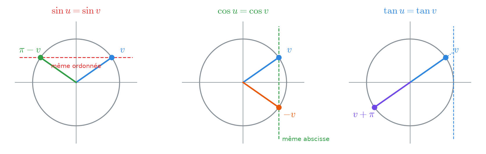
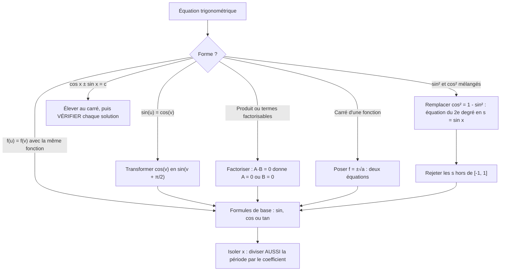
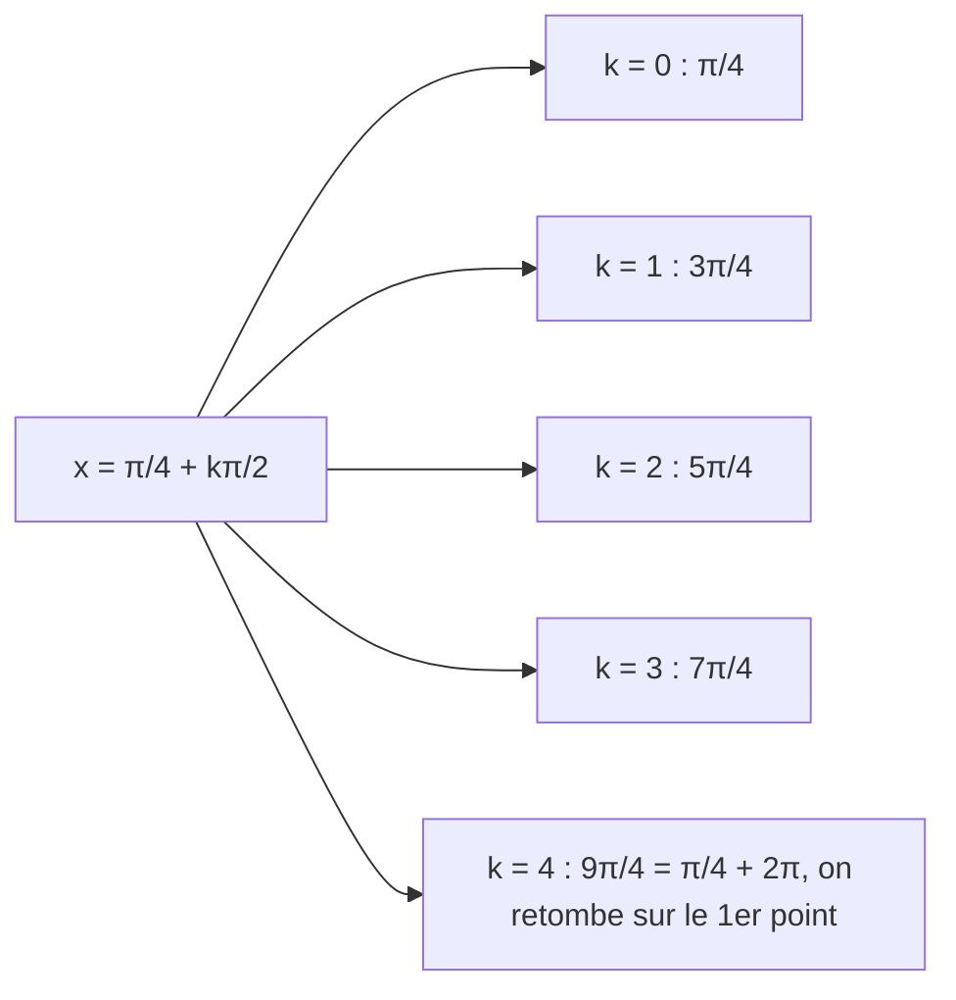

# 5. Équations trigonométriques


**Objectif** : trouver <mark style="color:blue;">toutes</mark> les solutions réelles d'une équation trigonométrique (avec le + 2kπ ou + kπ), les représenter sur le cercle, et éviter les solutions parasites. C'est « Test 1 Pb 4 » et l'exercice « Équation trigonométrique » de chaque TE F-1.


---

## 1. Introduction & définitions

Les fonctions trigonométriques sont <mark style="color:blue;">périodiques</mark> : une équation comme sin x = 1/2 a une <mark style="color:red;">infinité</mark> de solutions. On les décrit par des <mark style="color:green;">familles</mark> de la forme :

$$\Large x = x_0 + 2k\pi, \qquad k \in \mathbb{Z}$$

<figure><figcaption>
sin x = 1/2 : une famille bleue et une famille verte, chacune répétée tous les 2π.
</figcaption></figure>

### 1.1 Les trois équations de base

À partir du cercle trigonométrique :

<figure><figcaption>
Même sinus : symétrie d'axe Oy. Même cosinus : symétrie d'axe Ox. Même tangente : points diamétralement opposés.
</figcaption></figure>

<mark style="color:red;">Sinus</mark> — deux points du cercle ont la même ordonnée, symétriques par rapport à l'axe Oy :

$$\Large \boxed{\sin u = \sin v \iff u = v + 2k\pi \ \text{ ou } \ u = \pi - v + 2k\pi}$$

<mark style="color:green;">Cosinus</mark> — deux points ont la même abscisse, symétriques par rapport à l'axe Ox :

$$\Large \boxed{\cos u = \cos v \iff u = v + 2k\pi \ \text{ ou } \ u = -v + 2k\pi}$$

<mark style="color:blue;">Tangente</mark> — période π, une seule famille :

$$\Large \boxed{\tan u = \tan v \iff u = v + k\pi}$$

(avec toujours k ∈ ℤ).

### 1.2 Cas particuliers à connaître

| Équation | Solutions |
| --- | --- |
| sin u = 0 | $$u = k\pi$$ |
| cos u = 0 | $$u = \frac{\pi}{2} + k\pi$$ |
| sin u = 1 | $$u = \frac{\pi}{2} + 2k\pi$$ |
| cos u = −1 | $$u = \pi + 2k\pi$$ |
| sin u = a avec a > 1 ou a < −1 | <mark style="color:red;">aucune solution</mark> |

### 1.3 Passer d'une fonction à l'autre

Pour obtenir une équation « du même type » des deux côtés, on utilise :

$$\Large \cos\theta = \sin\left(\theta + \frac{\pi}{2}\right) \qquad \sin\theta = \cos\left(\frac{\pi}{2} - \theta\right) \qquad -\sin\theta = \sin(-\theta)$$

---

## 2. Méthodes de résolution

### Points de vigilance


<mark style="color:red;">1. Diviser la période</mark> : la période est divisée elle aussi !

$$3x = \frac{\pi}{2} + 2k\pi \quad\Rightarrow\quad x = \frac{\pi}{6} + \frac{2k\pi}{3}$$

<mark style="color:red;">2. Ne pas diviser par une fonction qui peut s'annuler</mark> : dans sin(2x) = sin x, on <mark style="color:green;">factorise</mark> par sin x au lieu de simplifier, sinon on perd les solutions sin x = 0.

<mark style="color:red;">3. Hypothèses de définition</mark> : dès que tan x ou 1/cos x apparaît, noter « hypothèse cos x ≠ 0 » et vérifier que les solutions la respectent.

<mark style="color:red;">4. Élévation au carré</mark> : elle crée des solutions parasites. Il faut tester chaque famille dans l'équation de départ.


### Représenter les solutions sur le cercle

Une famille de la forme

$$\Large x = x_0 + \frac{2k\pi}{n}$$

donne <mark style="color:green;">n points régulièrement espacés</mark> sur le cercle (un polygone régulier). Par exemple x = π/4 + kπ/2 donne 4 points : π/4, 3π/4, 5π/4, 7π/4.

<figure><figcaption>
Chaque famille dessine un polygone régulier sur le cercle.
</figcaption></figure>

---

## 3. Exemples de calculs détaillés

### Exemple 1 — Sinus contre cosinus (Test 1 Pb 4, variante A, a)

$$\Large \sin\left(2x + \frac{\pi}{3}\right) - \cos\left(x + \frac{\pi}{2}\right) = 0$$

<mark style="color:orange;">Étape 1 — Même fonction des deux côtés.</mark> cos θ = sin(θ + π/2) donne :

$$\large \sin\left(2x + \frac{\pi}{3}\right) = \sin\left(x + \frac{\pi}{2} + \frac{\pi}{2}\right) = \sin(x + \pi)$$

<mark style="color:orange;">Étape 2 — Formule du sinus, première famille :</mark>

$$\large 2x + \frac{\pi}{3} = x + \pi + 2k\pi \iff x = \frac{2\pi}{3} + 2k\pi$$

<mark style="color:orange;">Étape 3 — Deuxième famille :</mark>

$$\large 2x + \frac{\pi}{3} = \pi - (x + \pi) + 2k\pi = -x + 2k\pi \iff 3x = -\frac{\pi}{3} + 2k\pi \iff x = -\frac{\pi}{9} + \frac{2k\pi}{3}$$

$$\Large \color{#2F9E44} S = \left\{\frac{2\pi}{3} + 2k\pi \;;\; -\frac{\pi}{9} + \frac{2k\pi}{3} \;\middle|\; k \in \mathbb{Z}\right\}$$

### Exemple 2 — Un carré (Test 1 Pb 4, variante A, b)

$$\Large \cot^2\left(3x + \frac{\pi}{6}\right) = 3$$

<mark style="color:orange;">Étape 1</mark> — On prend la racine <mark style="color:red;">avec les deux signes</mark> :

$$\large \cot\left(3x + \frac{\pi}{6}\right) = \sqrt{3} \quad\text{ou}\quad \cot\left(3x + \frac{\pi}{6}\right) = -\sqrt{3}$$

<mark style="color:orange;">Étape 2</mark> — Comme cot a une période π :

$$\large \cot u = \sqrt{3} \iff u = \frac{\pi}{6} + k\pi \quad\Rightarrow\quad 3x + \frac{\pi}{6} = \frac{\pi}{6} + k\pi \quad\Rightarrow\quad x = \frac{k\pi}{3}$$

$$\large \cot u = -\sqrt{3} \iff u = \frac{5\pi}{6} + k\pi \quad\Rightarrow\quad 3x = \frac{2\pi}{3} + k\pi \quad\Rightarrow\quad x = \frac{2\pi}{9} + \frac{k\pi}{3}$$

$$\Large \color{#2F9E44} S = \left\{\frac{k\pi}{3} \;;\; \frac{2\pi}{9} + \frac{k\pi}{3} \;\middle|\; k \in \mathbb{Z}\right\}$$

### Exemple 3 — Factorisation (Test 1 Pb 4, variante A, c)

$$\Large \sin(2x) - \tan x = 0 \qquad \text{hypothèse : } \cos x \neq 0$$

<mark style="color:orange;">Étape 1 — Argument x</mark> :

$$\large 2\sin x\cos x - \frac{\sin x}{\cos x} = 0$$

<mark style="color:orange;">Étape 2 — Factoriser</mark> (surtout pas diviser !) par sin x :

$$\large \sin x\left(2\cos x - \frac{1}{\cos x}\right) = 0$$

<mark style="color:orange;">Étape 3 — Produit nul</mark> :

* sin x = 0 ⟺ x = kπ (et cos(kπ) = ±1 ≠ 0 ✓).
* Second facteur :

$$\large 2\cos x = \frac{1}{\cos x} \iff \cos^2 x = \frac{1}{2} \iff \cos x = \pm\frac{\sqrt{2}}{2}$$

Cela donne les 4 angles ±π/4, ±3π/4 modulo 2π, qu'on regroupe en x = π/4 + kπ/2.

$$\Large \color{#2F9E44} S = \left\{k\pi \;;\; \frac{\pi}{4} + \frac{k\pi}{2} \;\middle|\; k \in \mathbb{Z}\right\}$$

### Exemple 4 — Équation du second degré en sin x (Test 2017)

$$\Large 2\cos^2 x + 3\sin x = 0$$

<mark style="color:orange;">Étape 1 — Une seule fonction</mark> : cos²x = 1 − sin²x, d'où

$$\large 2 - 2\sin^2 x + 3\sin x = 0$$

<mark style="color:orange;">Étape 2 — Changement de variable</mark> s = sin x :

$$\large 2s^2 - 3s - 2 = 0 \qquad \Delta = 9 + 16 = 25 \qquad s = \frac{3 \pm 5}{4} \quad\Rightarrow\quad s = 2 \ \text{ ou } \ s = -\frac{1}{2}$$

<mark style="color:orange;">Étape 3 — Tri</mark> : sin x = 2 est <mark style="color:red;">impossible</mark> (un sinus reste dans \[−1, 1]). Reste sin x = −1/2 = sin(−π/6) :

$$\Large \color{#2F9E44} x = -\frac{\pi}{6} + 2k\pi \quad \text{ou} \quad x = \frac{7\pi}{6} + 2k\pi$$

### Exemple 5 — Solutions parasites (TE F-1, 2023)

$$\Large \cos x - \sin x = 1$$

<mark style="color:orange;">Étape 1 — Élever au carré</mark> :

$$\large \cos^2 x - 2\sin x\cos x + \sin^2 x = 1 \iff 1 - \sin(2x) = 1 \iff \sin(2x) = 0$$

<mark style="color:orange;">Étape 2</mark> : 2x = kπ, soit x = kπ/2. Sur un tour, candidats : 0, π/2, π, 3π/2.

<mark style="color:orange;">Étape 3 — Vérifier dans l'équation de départ</mark> :

| x | cos x − sin x | Solution ? |
| --- | --- | --- |
| 0 | 1 − 0 = 1 | <mark style="color:green;">✓</mark> |
| π/2 | 0 − 1 = −1 | <mark style="color:red;">✗</mark> |
| π | −1 − 0 = −1 | <mark style="color:red;">✗</mark> |
| 3π/2 | 0 − (−1) = 1 | <mark style="color:green;">✓</mark> |

<figure><figcaption>
Les croix rouges sont les solutions de cos x − sin x = −1, introduites par le carré.
</figcaption></figure>

$$\Large \color{#2F9E44} S = \left\{2k\pi \;;\; \frac{3\pi}{2} + 2k\pi \;\middle|\; k \in \mathbb{Z}\right\}$$

Le carré avait introduit les solutions de cos x − sin x = −1 : il fallait les éliminer.

### Exemple 6 — Valeur non remarquable (TE F-1, 2025)

$$\Large 4\cos(2x) + 1 = 0 \iff \cos(2x) = -\frac{1}{4}$$

−1/4 n'est pas une valeur remarquable : on garde arccos (calculatrice autorisée au TE) :

$$\large 2x = \pm\arccos\left(-\frac{1}{4}\right) + 2k\pi \iff \color{#2F9E44} x = \pm\frac{1}{2}\arccos\left(-\frac{1}{4}\right) + k\pi \approx \pm 0{,}912 + k\pi$$

---

## 4. Visualisation : de l'équation aux points du cercle

Le nombre de points distincts vaut :

$$\Large n = \frac{2\pi}{\text{période de la famille}} \qquad \text{ici } \frac{2\pi}{\pi/2} = 4$$

soit un carré inscrit dans le cercle.

---

## 5. Exercices pratiques

### Exercice 1 — (TE 2017)

Résoudre dans ℝ :

$$\Large \cos(4x) = \sin x$$

Cliquez pour voir l'indice

Écrivez sin x = cos(π/2 − x), puis utilisez cos u = cos v ⟺ u = ±v + 2kπ.

Solution détaillée

<mark style="color:orange;">1.</mark> Même fonction :

$$\large \cos(4x) = \cos\left(\frac{\pi}{2} - x\right)$$

<mark style="color:orange;">2.</mark> Première famille :

$$\large 4x = \frac{\pi}{2} - x + 2k\pi \iff 5x = \frac{\pi}{2} + 2k\pi \iff x = \frac{\pi}{10} + \frac{2k\pi}{5}$$

<mark style="color:orange;">3.</mark> Deuxième famille :

$$\large 4x = -\frac{\pi}{2} + x + 2k\pi \iff 3x = -\frac{\pi}{2} + 2k\pi \iff x = -\frac{\pi}{6} + \frac{2k\pi}{3}$$

$$\Large \color{#2F9E44} S = \left\{\frac{\pi}{10} + \frac{2k\pi}{5} \;;\; -\frac{\pi}{6} + \frac{2k\pi}{3} \;\middle|\; k \in \mathbb{Z}\right\}$$

### Exercice 2 — (Test 1 Pb 4, variante C)

Résoudre :

$$\Large \sec^2\left(4x + \frac{\pi}{6}\right) = 2$$

Cliquez pour voir l'indice

sec²u = 2 ⟺ cos²u = 1/2 ⟺ cos u = ±√2/2. Les quatre angles correspondants sur un tour s'écrivent en une seule famille de période π/2.

Solution détaillée

<mark style="color:orange;">1.</mark> On passe au cosinus :

$$\large \cos^2\left(4x + \frac{\pi}{6}\right) = \frac{1}{2} \quad\Rightarrow\quad \cos\left(4x + \frac{\pi}{6}\right) = \pm\frac{\sqrt{2}}{2}$$

<mark style="color:orange;">2.</mark> Les angles u vérifiant cos u = ±√2/2 sont π/4, 3π/4, 5π/4, 7π/4 modulo 2π, c'est-à-dire u = π/4 + kπ/2.

<mark style="color:orange;">3.</mark> On isole x (en divisant aussi la période) :

$$\large 4x + \frac{\pi}{6} = \frac{\pi}{4} + \frac{k\pi}{2} \iff 4x = \frac{\pi}{12} + \frac{k\pi}{2} \iff \color{#2F9E44} x = \frac{\pi}{48} + \frac{k\pi}{8}$$

### Exercice 3 — (TE F-1, 2022)

Résoudre, puis représenter les solutions sur le cercle trigonométrique :

$$\Large \frac{1}{3}\tan^2(2x) - 1 = 0$$

Cliquez pour voir l'indice

Isolez tan²(2x) = 3, prenez tan(2x) = ±√3 et n'oubliez pas que la période de la tangente est π (qui devient π/2 après division par 2).

Solution détaillée

<mark style="color:orange;">1.</mark> tan²(2x) = 3 ⟺ tan(2x) = √3 ou tan(2x) = −√3.

<mark style="color:orange;">2.</mark> Les deux familles :

$$\large \tan(2x) = \sqrt{3} \iff 2x = \frac{\pi}{3} + k\pi \iff x = \frac{\pi}{6} + \frac{k\pi}{2}$$

$$\large \tan(2x) = -\sqrt{3} \iff 2x = -\frac{\pi}{3} + k\pi \iff x = -\frac{\pi}{6} + \frac{k\pi}{2}$$

$$\Large \color{#2F9E44} S = \left\{\pm\frac{\pi}{6} + \frac{k\pi}{2} \;\middle|\; k \in \mathbb{Z}\right\}$$

<mark style="color:orange;">3.</mark> Sur le cercle : chaque famille donne 4 points (période π/2), soit 8 points (voir la 3e figure du § 2) :

* π/6, 2π/3, 7π/6, 5π/3 ;
* π/3, 5π/6, 4π/3, 11π/6.

<mark style="color:orange;">4.</mark> Hypothèse de définition : cos(2x) ≠ 0. Aucune de ces valeurs ne l'annule ✓.

