# 5. Équations trigonométriques

<mark style="color:blue;">**Trouver tous les angles qui ont un sinus, un cosinus ou une tangente donné, et comprendre chaque symbole de la réponse.**</mark>

&#x20;


**En bref**

Une équation comme $$\sin x = \frac{1}{2}$$ a une **infinité** de solutions, parce qu'en faisant un tour complet du cercle on retombe sur le même point. On les écrit toutes d'un coup avec un **k** :

$$x = \frac{\pi}{6} + 2k\pi \quad \text{ou} \quad x = \frac{5\pi}{6} + 2k\pi, \qquad k \in \mathbb{Z}$$

Le **k** compte le **nombre de tours** qu'on ajoute (ou qu'on enlève). Ce chapitre explique d'où vient chaque morceau de cette réponse, puis toutes les méthodes des tests (Test 1 Pb 4, TE F-1).


&#x20;


**Prérequis** — ce chapitre utilise :

* le **cercle trigonométrique** et le tableau des **angles remarquables** → [2. Le cercle trigonométrique](02-cercle-trigonometrique.md) ;
* **arcsin, arccos, arctan** pour les valeurs non remarquables → [3. Fonctions trigonométriques réciproques](03-fonctions-trigonometriques-reciproques.md) ;
* les **identités** ($$\sin^2 + \cos^2 = 1$$, $$\sin(2x)$$…) → [4. Identités trigonométriques](04-identites-trigonometriques.md).

La suite logique de ce chapitre : [5 bis. Inéquations trigonométriques](05b-inequations-trigonometriques.md).


&#x20;

***

&#x20;

## <mark style="color:purple;">01</mark> · Les rappels indispensables

&#x20;

Tout ce chapitre repose sur **une seule image** : le cercle trigonométrique (cercle de centre O et de rayon 1).

&#x20;



**Un angle x = un point M du cercle.**

&#x20;

On part de l'axe horizontal (à droite) et on tourne :

* dans le sens **inverse des aiguilles d'une montre** si x > 0 ;
* dans le sens **des aiguilles d'une montre** si x < 0.

&#x20;

Ensuite, par définition :

* <mark style="color:red;">**sin x**</mark> = la **hauteur** du point M (son ordonnée) ;
* <mark style="color:green;">**cos x**</mark> = la **position horizontale** de M (son abscisse) ;
* <mark style="color:blue;">**tan x**</mark> = $$\frac{\sin x}{\cos x}$$.



<figure><figcaption>
cos x = abscisse de M, sin x = ordonnée de M.
</figcaption></figure>



&#x20;

**Les angles remarquables** (à connaître par cœur, les tests sont sans calculatrice) :

&#x20;

| x     | 0   | $$\frac{\pi}{6}$$ (30°)   | $$\frac{\pi}{4}$$ (45°)   | $$\frac{\pi}{3}$$ (60°)   | $$\frac{\pi}{2}$$ (90°) |
| ----- | --- | ------------------------- | ------------------------- | ------------------------- | ----------------------- |
| sin x | 0   | $$\frac{1}{2}$$           | $$\frac{\sqrt{2}}{2}$$    | $$\frac{\sqrt{3}}{2}$$    | 1                       |
| cos x | 1   | $$\frac{\sqrt{3}}{2}$$    | $$\frac{\sqrt{2}}{2}$$    | $$\frac{1}{2}$$           | 0                       |
| tan x | 0   | $$\frac{\sqrt{3}}{3}$$    | 1                         | $$\sqrt{3}$$              | non défini              |

&#x20;


**Rappel : un tour complet = $$2\pi$$ radians** (= 360°). Un demi-tour = $$\pi$$ (= 180°). On travaille **toujours en radians** dans ce chapitre : c'est pour ça qu'on écrit $$2\pi$$ et non 360°.


&#x20;

***

&#x20;

## <mark style="color:purple;">02</mark> · Pourquoi une infinité de solutions ?

&#x20;

### Comparaison avec une équation « normale »

&#x20;

L'équation $$2x + 1 = 5$$ a **une seule** solution : $$x = 2$$. C'est fini.

&#x20;

Avec $$\sin x = \frac{1}{2}$$, c'est différent. Pense à une **grande roue** de fête foraine : ta cabine passe à la même hauteur **à chaque tour**. Le sinus, c'est exactement cette hauteur. Si ta cabine est à la hauteur 1/2 maintenant, elle y sera encore après 1 tour, 2 tours, 100 tours… et elle y était aussi 1 tour avant.

&#x20;

En maths, on dit que le sinus est <mark style="color:blue;">**périodique**</mark> de période $$2\pi$$ :

$$\sin(x + 2\pi) = \sin x \qquad \text{pour tout } x$$

&#x20;

### Ce qu'on voit sur le graphe

&#x20;

On trace la courbe $$y = \sin x$$ et la droite horizontale $$y = \frac{1}{2}$$. **Chaque point où elles se croisent est une solution.** La courbe ondule sans fin, donc il y a une infinité de croisements :

&#x20;

<figure>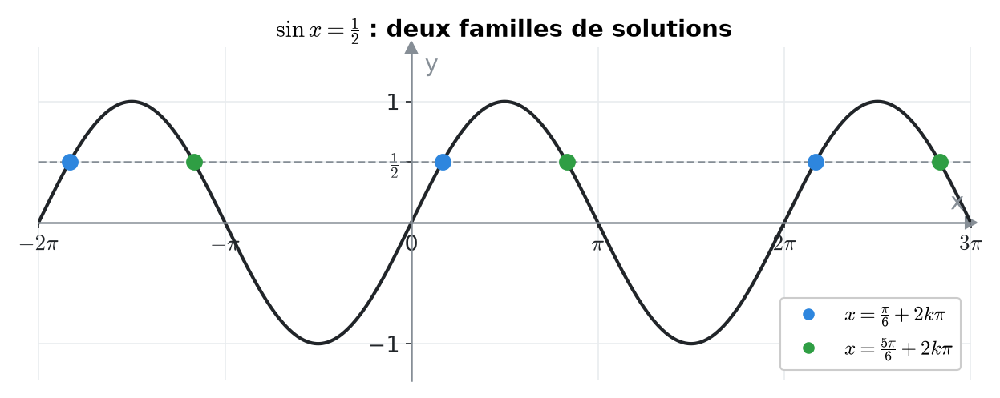<figcaption>
sin x = 1/2 : les points bleus forment une famille, les points verts une autre. Dans chaque famille, deux points voisins sont séparés de 2π.
</figcaption></figure>

&#x20;

On remarque **deux sortes** de points qui se répètent :

* les points <mark style="color:blue;">bleus</mark> : $$\dots,\ -\frac{11\pi}{6},\ \frac{\pi}{6},\ \frac{13\pi}{6},\ \dots$$ (on monte en croisant la droite) ;
* les points <mark style="color:green;">verts</mark> : $$\dots,\ -\frac{7\pi}{6},\ \frac{5\pi}{6},\ \frac{17\pi}{6},\ \dots$$ (on descend en croisant la droite).

&#x20;

Impossible de tous les écrire un par un. On a donc besoin d'une écriture qui les résume : c'est le rôle du **k**.

&#x20;

***

&#x20;

## <mark style="color:purple;">03</mark> · Le k : qu'est-ce que c'est exactement ?

&#x20;

### L'idée

&#x20;

Prends la famille bleue. Tous ses points sont $$\frac{\pi}{6}$$, plus ou moins un certain nombre de tours complets :

$$\frac{\pi}{6}, \quad \frac{\pi}{6} + 2\pi, \quad \frac{\pi}{6} + 2\cdot 2\pi, \quad \frac{\pi}{6} - 2\pi, \quad \frac{\pi}{6} - 2\cdot 2\pi, \quad \dots$$

&#x20;

Au lieu d'écrire cette liste sans fin, on écrit **une seule formule** :

$$\Large x = \frac{\pi}{6} + 2k\pi, \qquad k \in \mathbb{Z}$$

&#x20;

et on la lit : « x vaut π/6 plus **k tours complets**, où k est **n'importe quel nombre entier** ».

&#x20;

<figure>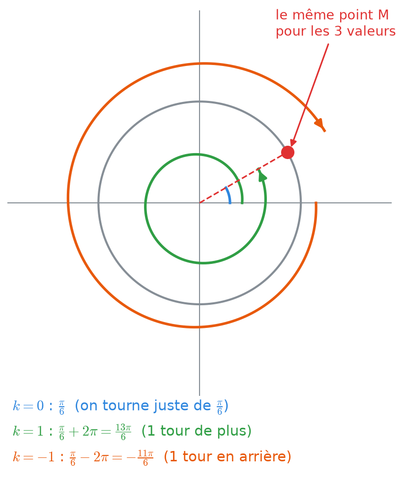<figcaption>
Tourner de π/6, ou de π/6 plus un tour, ou de π/6 moins un tour : on arrive toujours au même point M, donc au même sinus.
</figcaption></figure>

&#x20;

### Chaque valeur de k donne une solution

&#x20;

| k   | Calcul                                  | Solution          | Ce que ça veut dire          |
| --- | --------------------------------------- | ----------------- | ---------------------------- |
| −2  | $$\frac{\pi}{6} + 2(-2)\pi = \frac{\pi}{6} - 4\pi$$ | $$-\frac{23\pi}{6}$$ | 2 tours en arrière     |
| −1  | $$\frac{\pi}{6} - 2\pi$$                | $$-\frac{11\pi}{6}$$ | 1 tour en arrière          |
| 0   | $$\frac{\pi}{6} + 0$$                   | $$\frac{\pi}{6}$$    | aucun tour en plus         |
| 1   | $$\frac{\pi}{6} + 2\pi$$                | $$\frac{13\pi}{6}$$  | 1 tour en plus             |
| 2   | $$\frac{\pi}{6} + 4\pi$$                | $$\frac{25\pi}{6}$$  | 2 tours en plus            |

&#x20;

Vérification avec k = 1 : $$\sin\left(\frac{13\pi}{6}\right) = \sin\left(\frac{\pi}{6} + 2\pi\right) = \sin\frac{\pi}{6} = \frac{1}{2}$$. Ça marche, et ça marchera pour **tous** les k.

&#x20;

### Les questions qu'on se pose toujours

&#x20;

Pourquoi « k ∈ ℤ » et pas « k ∈ ℕ » ?

&#x20;

$$\mathbb{N} = \{0, 1, 2, 3, \dots\}$$ ne contient que les entiers **positifs**. Avec ℕ, on n'aurait que les tours « en avant », et on **raterait** toutes les solutions négatives comme $$-\frac{11\pi}{6}$$.

$$\mathbb{Z} = \{\dots, -2, -1, 0, 1, 2, \dots\}$$ contient aussi les entiers **négatifs** : on peut tourner en arrière. C'est pour ça qu'on écrit toujours **k ∈ ℤ**.

&#x20;

Pourquoi k doit être un entier ? Pourquoi pas k = 0,5 ?

&#x20;

Avec k = 0,5, on ajouterait $$2 \cdot 0{,}5 \cdot \pi = \pi$$, c'est-à-dire un **demi-tour**. Un demi-tour amène de l'autre côté du cercle, où le sinus change de signe : $$\sin\left(\frac{\pi}{6} + \pi\right) = -\frac{1}{2}$$. Ce n'est **plus** une solution.

Seuls les **tours complets** ramènent exactement au même point. Un nombre de tours complets, c'est un nombre entier.

&#x20;

Pourquoi 2kπ et pas 2π tout court ?

&#x20;

$$x = \frac{\pi}{6} + 2\pi$$ ne donne qu'**une** solution (celle avec exactement un tour). Le **k** devant permet de prendre **autant de tours qu'on veut**. Le « 2π » est la longueur d'un tour, le « k » est le nombre de tours.

&#x20;

Pourquoi parfois kπ au lieu de 2kπ ?

&#x20;

Ça arrive quand les solutions se répètent **tous les demi-tours**. C'est le cas :

* de la **tangente**, qui a une période de $$\pi$$ (section 06) ;
* de cas particuliers comme $$\sin x = 0$$, où les deux familles se rejoignent (section 07).

La règle : on écrit **+ (k × l'écart entre deux solutions qui se répètent)**.

&#x20;

Le k de la première famille est-il le même que celui de la deuxième ?

&#x20;

**Non.** Quand on écrit « $$x = \frac{\pi}{6} + 2k\pi$$ **ou** $$x = \frac{5\pi}{6} + 2k\pi$$ », chaque famille a son propre k qui prend toutes les valeurs entières, indépendamment de l'autre. On pourrait écrire $$\frac{5\pi}{6} + 2n\pi$$ avec une autre lettre : ça voudrait dire exactement la même chose. On garde k par habitude.

&#x20;

&#x20;


**À retenir** — $$+2k\pi$$ = « plus un nombre entier de tours complets, en avant ou en arrière ». C'est une façon compacte d'écrire une **liste infinie** de solutions.


&#x20;

***

&#x20;

## <mark style="color:purple;">04</mark> · L'équation sin x = a, pas à pas

&#x20;

On décortique l'exemple complet :

$$\Large \sin x = \frac{1}{2} \iff \sin x = \sin\frac{\pi}{6} \iff x = \frac{\pi}{6} + 2k\pi \quad \text{ou} \quad x = \frac{5\pi}{6} + 2k\pi$$

&#x20;



### Remplacer le nombre par le sinus d'un angle connu

&#x20;

On cherche dans le tableau des angles remarquables un angle dont le sinus vaut $$\frac{1}{2}$$ : c'est $$\frac{\pi}{6}$$. Donc on peut remplacer $$\frac{1}{2}$$ par $$\sin\frac{\pi}{6}$$ :

$$\sin x = \frac{1}{2} \iff \sin x = \sin\frac{\pi}{6}$$

&#x20;

**Pourquoi ?** Parce qu'il est plus facile de comparer **deux sinus** que de comparer un sinus et un nombre. Maintenant la question devient : « quels angles x ont **le même sinus** que π/6 ? »

&#x20;

**Le symbole ⟺** se lit « équivaut à » : les deux équations ont exactement les mêmes solutions. On peut passer de l'une à l'autre dans les deux sens.



### Chercher sur le cercle les points qui ont cette hauteur

&#x20;

Le sinus est la **hauteur** du point sur le cercle. On trace donc la droite horizontale $$y = \frac{1}{2}$$ et on regarde où elle coupe le cercle :

&#x20;

<figure>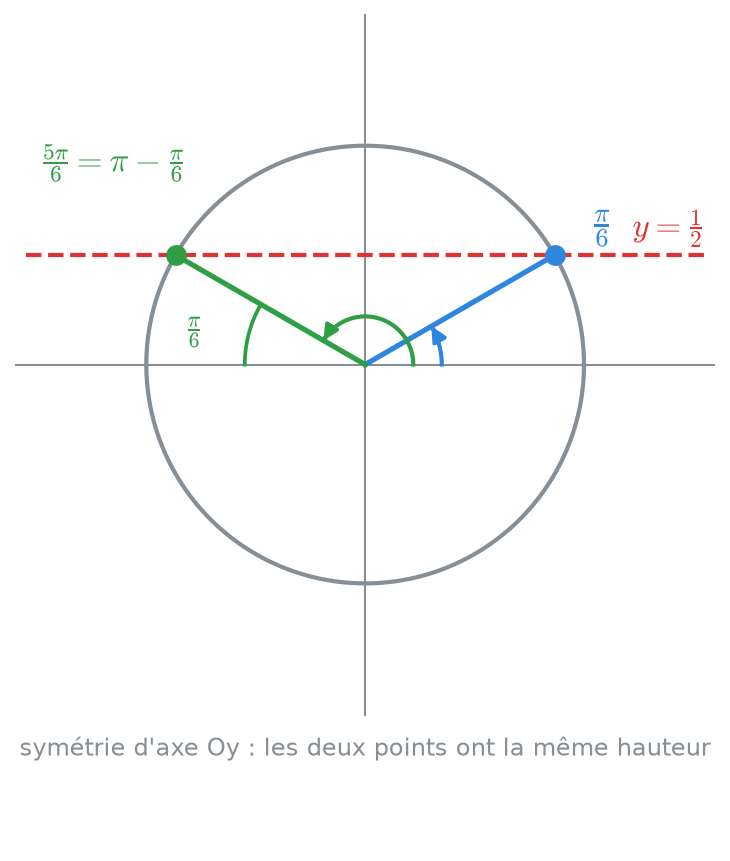<figcaption>
La droite y = 1/2 coupe le cercle en deux points, symétriques par rapport à l'axe vertical.
</figcaption></figure>

&#x20;

Elle coupe le cercle en **deux points** :

* le point <mark style="color:blue;">bleu</mark>, à l'angle $$\frac{\pi}{6}$$ ;
* le point <mark style="color:green;">vert</mark>, son **reflet** dans le miroir vertical (l'axe Oy).

&#x20;

**Pourquoi le point vert est-il à $$\frac{5\pi}{6}$$ ?** Le point bleu est à $$\frac{\pi}{6}$$ **au-dessus de l'axe de droite**. Par symétrie, le point vert est à $$\frac{\pi}{6}$$ **au-dessus de l'axe de gauche**. L'axe de gauche est à l'angle $$\pi$$ (un demi-tour), donc le point vert est à $$\pi - \frac{\pi}{6} = \frac{6\pi}{6} - \frac{\pi}{6} = \frac{5\pi}{6}$$.



### Ajouter les tours complets

&#x20;

Chacun de ces deux points est atteint par une infinité d'angles (un par nombre de tours). On ajoute donc $$2k\pi$$ à **chacun** :

$$x = \frac{\pi}{6} + 2k\pi \quad \text{ou} \quad x = \frac{5\pi}{6} + 2k\pi, \qquad k \in \mathbb{Z}$$

&#x20;

**Pourquoi « ou » ?** Un angle x est solution s'il tombe sur le point bleu **ou** sur le point vert. Il ne peut pas tomber sur les deux à la fois.



### Écrire l'ensemble des solutions

&#x20;

On rassemble tout dans un ensemble S :

$$\Large \color{#2F9E44} S = \left\{\frac{\pi}{6} + 2k\pi \;;\; \frac{5\pi}{6} + 2k\pi \;\middle|\; k \in \mathbb{Z}\right\}$$

&#x20;

Cela se lit : « l'ensemble des nombres de la forme π/6 + 2kπ et de la forme 5π/6 + 2kπ, pour k entier ».



### Vérifier (réflexe gratuit)

&#x20;

$$\sin\frac{5\pi}{6} = \sin\left(\pi - \frac{\pi}{6}\right) = \sin\frac{\pi}{6} = \frac{1}{2}$$. C'est juste.



&#x20;

### La formule générale

&#x20;

Ce qu'on vient de faire marche pour n'importe quel angle v :

$$\Large \boxed{\sin u = \sin v \iff u = v + 2k\pi \quad \text{ou} \quad u = \pi - v + 2k\pi, \quad k \in \mathbb{Z}}$$

&#x20;

* **Première famille** : u tombe sur **le même point** que v.
* **Deuxième famille** : u tombe sur le **reflet** de v par rapport à l'axe vertical, qui est à l'angle $$\pi - v$$.

&#x20;

### Et si a est négatif ?

&#x20;

**Exemple :** $$\sin x = -\frac{\sqrt{2}}{2}$$.

&#x20;

<mark style="color:orange;">1.</mark> On connaît $$\sin\frac{\pi}{4} = \frac{\sqrt{2}}{2}$$. Comme le sinus est impair ($$\sin(-v) = -\sin v$$), on a $$\sin\left(-\frac{\pi}{4}\right) = -\frac{\sqrt{2}}{2}$$. Donc :

$$\sin x = \sin\left(-\frac{\pi}{4}\right)$$

<mark style="color:orange;">2.</mark> On applique la formule avec $$v = -\frac{\pi}{4}$$ :

$$x = -\frac{\pi}{4} + 2k\pi \quad \text{ou} \quad x = \pi - \left(-\frac{\pi}{4}\right) + 2k\pi = \frac{5\pi}{4} + 2k\pi$$

<mark style="color:orange;">3.</mark> Sur le cercle : la droite $$y = -\frac{\sqrt{2}}{2}$$ est **sous** l'axe horizontal ; elle coupe le cercle en bas à droite ($$-\frac{\pi}{4}$$) et en bas à gauche ($$\frac{5\pi}{4}$$). C'est cohérent.

$$\Large \color{#2F9E44} S = \left\{-\frac{\pi}{4} + 2k\pi \;;\; \frac{5\pi}{4} + 2k\pi \;\middle|\; k \in \mathbb{Z}\right\}$$

&#x20;


**On peut écrire la même famille de plusieurs façons.** $$-\frac{\pi}{4} + 2k\pi$$ et $$\frac{7\pi}{4} + 2k\pi$$ décrivent **exactement les mêmes angles** (car $$\frac{7\pi}{4} = -\frac{\pi}{4} + 2\pi$$, c'est juste un k décalé de 1). Les deux réponses sont justes.


&#x20;

***

&#x20;

## <mark style="color:purple;">05</mark> · L'équation cos x = a

&#x20;

Même raisonnement, mais le cosinus est la **position horizontale** du point. On trace donc une droite **verticale**.

&#x20;

**Exemple :** $$\cos x = \frac{1}{2}$$.

&#x20;

<figure>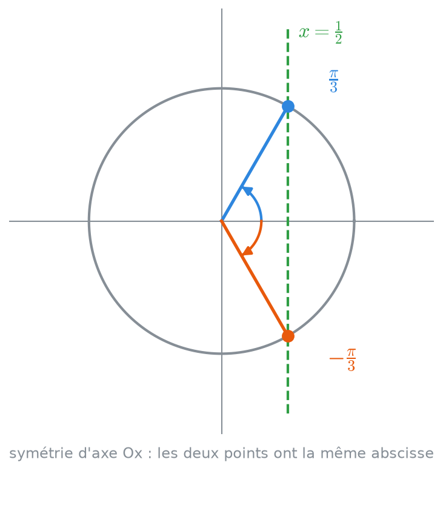<figcaption>
La droite x = 1/2 coupe le cercle en deux points, symétriques par rapport à l'axe horizontal.
</figcaption></figure>

&#x20;

<mark style="color:orange;">1.</mark> Angle connu : $$\cos\frac{\pi}{3} = \frac{1}{2}$$, donc $$\cos x = \cos\frac{\pi}{3}$$.

<mark style="color:orange;">2.</mark> La droite verticale $$x = \frac{1}{2}$$ coupe le cercle en **deux points** : $$\frac{\pi}{3}$$ (en haut) et son **reflet dans le miroir horizontal** (l'axe Ox), qui est $$-\frac{\pi}{3}$$ (en bas).

**Pourquoi $$-\frac{\pi}{3}$$ ?** Le reflet par rapport à l'axe horizontal, c'est le même angle mais en tournant **dans l'autre sens**.

<mark style="color:orange;">3.</mark> On ajoute les tours :

$$x = \frac{\pi}{3} + 2k\pi \quad \text{ou} \quad x = -\frac{\pi}{3} + 2k\pi \qquad \text{qu'on écrit souvent} \qquad \color{#2F9E44} x = \pm\frac{\pi}{3} + 2k\pi$$

&#x20;

### La formule générale

&#x20;

$$\Large \boxed{\cos u = \cos v \iff u = v + 2k\pi \quad \text{ou} \quad u = -v + 2k\pi, \quad k \in \mathbb{Z}}$$

&#x20;



### Sinus : $$\pi - v$$

&#x20;

Même **hauteur** → miroir **vertical** (gauche / droite).

&#x20;

Le reflet de v est $$\pi - v$$.



### Cosinus : $$-v$$

&#x20;

Même **position horizontale** → miroir **horizontal** (haut / bas).

&#x20;

Le reflet de v est $$-v$$.



&#x20;


**Piège classique** — confondre les deux formules. Astuce : **c**osinus → **c**hangement de signe ($$-v$$) ; **s**inus → **s**oustraction à π ($$\pi - v$$). Et en cas de doute, **dessine le cercle** : 10 secondes, et l'erreur disparaît.


&#x20;

### Exemple avec une valeur négative

&#x20;

$$\cos x = -\frac{\sqrt{3}}{2}$$

<mark style="color:orange;">1.</mark> $$\cos\frac{\pi}{6} = \frac{\sqrt{3}}{2}$$. Pour obtenir le **négatif**, on va de l'autre côté de l'axe vertical : $$\cos\left(\pi - \frac{\pi}{6}\right) = -\cos\frac{\pi}{6}$$, donc $$\cos\frac{5\pi}{6} = -\frac{\sqrt{3}}{2}$$.

<mark style="color:orange;">2.</mark> $$\cos x = \cos\frac{5\pi}{6}$$, donc :

$$\color{#2F9E44} x = \pm\frac{5\pi}{6} + 2k\pi$$

&#x20;


**Attention** — pour le cosinus, on ne peut **pas** utiliser $$-\frac{\pi}{6}$$ pour fabriquer un cosinus négatif : $$\cos\left(-\frac{\pi}{6}\right) = +\frac{\sqrt{3}}{2}$$ (le cosinus est **pair**). Il faut passer par $$\pi - v$$ : la valeur de référence d'un cosinus négatif est entre $$\frac{\pi}{2}$$ et $$\pi$$.


&#x20;

***

&#x20;

## <mark style="color:purple;">06</mark> · L'équation tan x = a

&#x20;

**Exemple :** $$\tan x = 1$$.

&#x20;

<figure>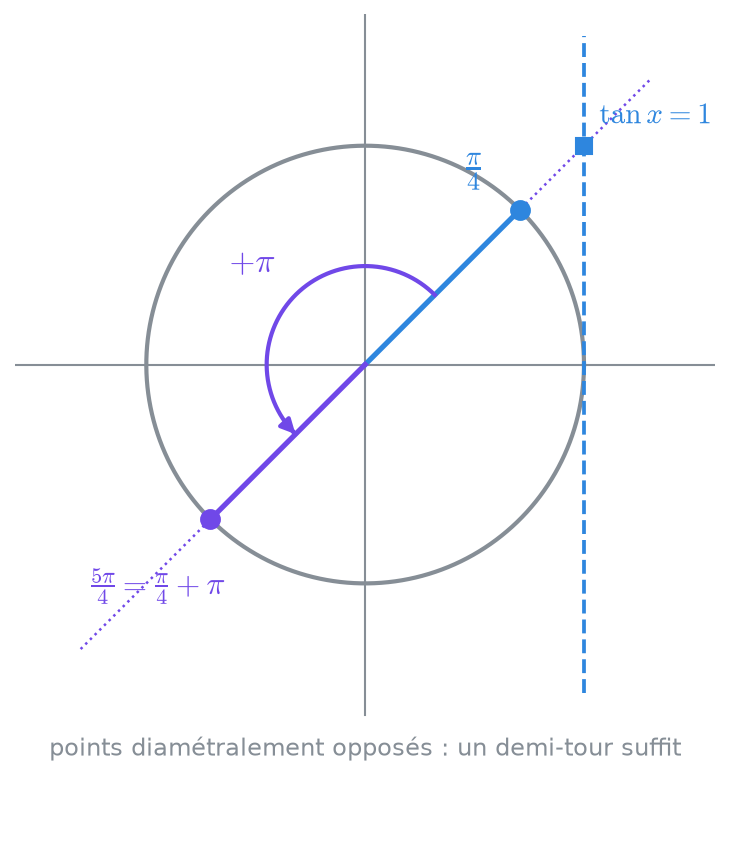<figcaption>
Les deux points qui ont la même tangente sont aux deux bouts d'une même droite passant par le centre.
</figcaption></figure>

&#x20;

<mark style="color:orange;">1.</mark> $$\tan\frac{\pi}{4} = 1$$, donc $$\tan x = \tan\frac{\pi}{4}$$.

<mark style="color:orange;">2.</mark> La tangente, c'est la **pente** de la droite qui va du centre au point M. Deux points ont la même pente s'ils sont sur **la même droite passant par le centre** : le point à $$\frac{\pi}{4}$$ et le point **diamétralement opposé**, à $$\frac{\pi}{4} + \pi = \frac{5\pi}{4}$$.

**Vérification :** au point opposé, le sinus **et** le cosinus changent tous les deux de signe, donc leur quotient ne change pas : $$\frac{-\sin}{-\cos} = \frac{\sin}{\cos}$$.

<mark style="color:orange;">3.</mark> Ces deux points sont séparés d'un **demi-tour** ($$\pi$$). Donc les solutions se répètent tous les $$\pi$$, et **une seule famille** suffit :

$$\color{#2F9E44} x = \frac{\pi}{4} + k\pi, \qquad k \in \mathbb{Z}$$

&#x20;

**Pourquoi une seule famille ?** k = 0 donne $$\frac{\pi}{4}$$, k = 1 donne $$\frac{5\pi}{4}$$ (le point opposé), k = 2 donne $$\frac{9\pi}{4}$$ (= le premier point plus un tour), etc. Le $$k\pi$$ parcourt **automatiquement** les deux points.

&#x20;

### La formule générale

&#x20;

$$\Large \boxed{\tan u = \tan v \iff u = v + k\pi, \quad k \in \mathbb{Z}}$$

&#x20;

**Exemple avec une valeur négative :** $$\tan x = -\sqrt{3}$$. On sait $$\tan\frac{\pi}{3} = \sqrt{3}$$ et la tangente est impaire, donc $$\tan\left(-\frac{\pi}{3}\right) = -\sqrt{3}$$ et :

$$\color{#2F9E44} x = -\frac{\pi}{3} + k\pi$$

&#x20;


**Domaine de la tangente** — $$\tan x$$ n'existe pas quand $$\cos x = 0$$, c'est-à-dire pour $$x = \frac{\pi}{2} + k\pi$$. Dès qu'une tangente apparaît dans une équation, on écrit l'**hypothèse** « $$\cos x \neq 0$$ » et on vérifie à la fin qu'aucune solution ne l'enfreint.


&#x20;

***

&#x20;

## <mark style="color:purple;">07</mark> · Les cas particuliers

&#x20;

Parfois la droite ne coupe pas le cercle en deux points bien séparés :

&#x20;

<figure>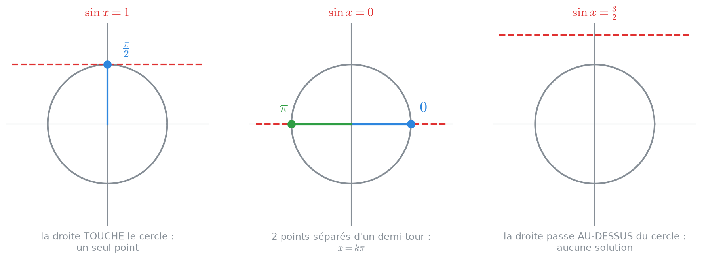<figcaption>
Une droite qui touche le cercle (1 point), qui passe par le centre (2 points opposés), ou qui le rate (aucune solution).
</figcaption></figure>

&#x20;

| Équation                     | Ce qu'on voit sur le cercle                    | Solutions                             |
| ---------------------------- | ---------------------------------------------- | ------------------------------------- |
| $$\sin x = 1$$               | la droite touche le cercle **tout en haut**    | $$x = \frac{\pi}{2} + 2k\pi$$         |
| $$\sin x = -1$$              | **tout en bas**                                | $$x = -\frac{\pi}{2} + 2k\pi$$        |
| $$\sin x = 0$$               | l'axe horizontal : **0 et π**                  | $$x = k\pi$$                          |
| $$\cos x = 1$$               | **tout à droite**                              | $$x = 2k\pi$$                         |
| $$\cos x = -1$$              | **tout à gauche**                              | $$x = \pi + 2k\pi$$                   |
| $$\cos x = 0$$               | l'axe vertical : **π/2 et −π/2**               | $$x = \frac{\pi}{2} + k\pi$$          |
| $$\sin x = a$$ ou $$\cos x = a$$ avec $$a > 1$$ ou $$a < -1$$ | la droite **rate** le cercle | <mark style="color:red;">aucune solution</mark> |

&#x20;

Pourquoi sin x = 1 n'a qu'une famille ?

&#x20;

La formule générale donnerait $$x = \frac{\pi}{2} + 2k\pi$$ **ou** $$x = \pi - \frac{\pi}{2} + 2k\pi = \frac{\pi}{2} + 2k\pi$$. Les deux familles sont **identiques** : le point et son reflet sont confondus (le point du haut est sur le miroir). On n'en écrit donc qu'une.

&#x20;

Pourquoi sin x = 0 donne kπ et pas 2kπ ?

&#x20;

Les deux familles sont $$x = 0 + 2k\pi$$ (les points à droite) et $$x = \pi + 2k\pi$$ (les points à gauche). Ensemble, elles donnent $$\dots, -\pi, 0, \pi, 2\pi, 3\pi, \dots$$ : **tous les multiples de π**. On les résume en $$x = k\pi$$ : les k pairs donnent la première famille, les k impairs la seconde.

&#x20;

Pourquoi aucune solution si a > 1 ?

&#x20;

Le cercle a un rayon de 1 : aucun point n'a une hauteur plus grande que 1 ou plus petite que −1. Donc **le sinus et le cosinus sont toujours entre −1 et 1**. Une équation comme $$\sin x = \frac{3}{2}$$ ou $$\cos x = -2$$ est impossible : $$S = \emptyset$$ (ensemble vide).

**La tangente, elle, peut prendre n'importe quelle valeur** : $$\tan x = 1000$$ a des solutions.

&#x20;

&#x20;

***

&#x20;

## <mark style="color:purple;">08</mark> · Quand la valeur n'est pas remarquable

&#x20;

Si a n'est pas dans le tableau (par exemple $$\sin x = 0{,}3$$), on ne peut pas trouver l'angle de tête. On utilise les **fonctions réciproques** (calculatrice autorisée au TE) :

&#x20;

| Équation        | Angle de référence v      | Solutions                                                      |
| --------------- | ------------------------- | -------------------------------------------------------------- |
| $$\sin x = a$$  | $$v = \arcsin a$$         | $$x = \arcsin a + 2k\pi$$ ou $$x = \pi - \arcsin a + 2k\pi$$  |
| $$\cos x = a$$  | $$v = \arccos a$$         | $$x = \pm\arccos a + 2k\pi$$                                   |
| $$\tan x = a$$  | $$v = \arctan a$$         | $$x = \arctan a + k\pi$$                                       |

&#x20;


**La calculatrice ne donne qu'UNE solution.** $$\arcsin(0{,}3) \approx 0{,}305$$ est l'angle **entre $$-\frac{\pi}{2}$$ et $$\frac{\pi}{2}$$** qui a ce sinus (voir [chapitre 3](03-fonctions-trigonometriques-reciproques.md)). Mais l'autre point du cercle, $$\pi - 0{,}305 \approx 2{,}837$$, est **aussi** solution. Il faut toujours écrire **les deux familles** soi-même.


&#x20;

**Exemple :** $$\sin x = 0{,}3$$

$$x \approx 0{,}305 + 2k\pi \quad \text{ou} \quad x \approx \pi - 0{,}305 + 2k\pi \approx 2{,}837 + 2k\pi$$

&#x20;

**Exemple :** $$\cos x = -0{,}4$$

$$x = \pm\arccos(-0{,}4) + 2k\pi \approx \pm 1{,}982 + 2k\pi$$

&#x20;

***

&#x20;

## <mark style="color:purple;">09</mark> · Quand l'angle est plus compliqué que x

&#x20;

Dans les tests, on a rarement $$\sin x$$ tout seul, mais plutôt $$\sin\left(2x - \frac{\pi}{3}\right)$$ ou $$\cos(3x)$$. La méthode : **on résout d'abord pour tout l'angle, puis on isole x**.

&#x20;

### Exemple complet : $$\sin(3x) = 1$$

&#x20;

<mark style="color:orange;">1. On appelle u l'angle entier :</mark> $$u = 3x$$. L'équation devient $$\sin u = 1$$.

<mark style="color:orange;">2. On résout pour u</mark> (cas particulier) : $$u = \frac{\pi}{2} + 2k\pi$$.

<mark style="color:orange;">3. On remplace u par 3x :</mark> $$3x = \frac{\pi}{2} + 2k\pi$$.

<mark style="color:orange;">4. On isole x en divisant TOUT par 3, y compris le 2kπ :</mark>

$$\color{#2F9E44} x = \frac{\pi}{6} + \frac{2k\pi}{3}$$

&#x20;


**L'erreur n° 1 des tests** — oublier de diviser le $$2k\pi$$ :

* <mark style="color:red;">~~$$x = \frac{\pi}{6} + 2k\pi$$~~</mark> → on perd des solutions !
* <mark style="color:green;">$$x = \frac{\pi}{6} + \frac{2k\pi}{3}$$</mark>


&#x20;

### Pourquoi faut-il diviser la période ?

&#x20;

Regardons concrètement les valeurs données par $$x = \frac{\pi}{6} + \frac{2k\pi}{3}$$ :

&#x20;

| k | x                                                   | 3x                                  | sin(3x)                              |
| - | --------------------------------------------------- | ----------------------------------- | ------------------------------------ |
| 0 | $$\frac{\pi}{6}$$                                   | $$\frac{\pi}{2}$$                   | 1                                    |
| 1 | $$\frac{\pi}{6} + \frac{2\pi}{3} = \frac{5\pi}{6}$$ | $$\frac{5\pi}{2} = \frac{\pi}{2} + 2\pi$$ | 1                              |
| 2 | $$\frac{\pi}{6} + \frac{4\pi}{3} = \frac{3\pi}{2}$$ | $$\frac{9\pi}{2} = \frac{\pi}{2} + 4\pi$$ | 1                              |
| 3 | $$\frac{\pi}{6} + 2\pi$$                            | même point que k = 0                |                                      |

&#x20;

<figure>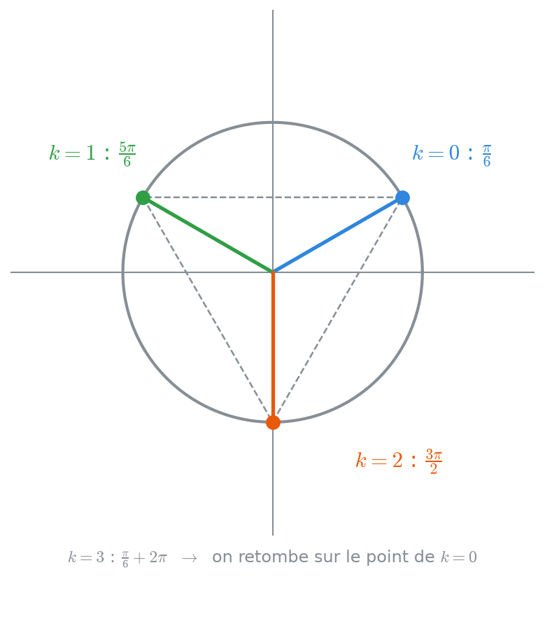<figcaption>
sin(3x) = 1 a trois solutions sur un tour : elles forment un triangle régulier.
</figcaption></figure>

&#x20;

**L'explication intuitive :** quand x fait un tour, 3x fait **trois tours**. L'angle 3x passe donc **trois fois** par le point du haut du cercle pendant que x ne fait qu'un tour. Il y a 3 solutions par tour, espacées de $$\frac{2\pi}{3}$$. Si on avait oublié de diviser, on n'en aurait trouvé qu'**une** sur trois.

&#x20;


**Ça marche aussi dans l'autre sens.** Avec $$\cos\left(\frac{x}{2}\right) = 0$$ : $$\frac{x}{2} = \frac{\pi}{2} + k\pi$$, donc en **multipliant tout par 2** : $$x = \pi + 2k\pi$$. Ici, x doit faire **deux tours** pour que $$\frac{x}{2}$$ en fasse un : les solutions sont **plus espacées**.


&#x20;

### Exemple avec un décalage : $$\cos\left(2x - \frac{\pi}{3}\right) = -\frac{1}{2}$$

&#x20;

<mark style="color:orange;">1.</mark> $$\cos\frac{2\pi}{3} = -\frac{1}{2}$$, donc avec $$u = 2x - \frac{\pi}{3}$$ : $$\cos u = \cos\frac{2\pi}{3}$$, d'où $$u = \pm\frac{2\pi}{3} + 2k\pi$$.

<mark style="color:orange;">2. Famille « + » :</mark>

$$2x - \frac{\pi}{3} = \frac{2\pi}{3} + 2k\pi \iff 2x = \pi + 2k\pi \iff x = \frac{\pi}{2} + k\pi$$

(on a **ajouté** $$\frac{\pi}{3}$$ des deux côtés, puis **divisé tout** par 2.)

<mark style="color:orange;">3. Famille « − » :</mark>

$$2x - \frac{\pi}{3} = -\frac{2\pi}{3} + 2k\pi \iff 2x = -\frac{\pi}{3} + 2k\pi \iff x = -\frac{\pi}{6} + k\pi$$

$$\Large \color{#2F9E44} S = \left\{\frac{\pi}{2} + k\pi \;;\; -\frac{\pi}{6} + k\pi \;\middle|\; k \in \mathbb{Z}\right\}$$

&#x20;

**Vérification** avec $$x = -\frac{\pi}{6}$$ : $$2x - \frac{\pi}{3} = -\frac{\pi}{3} - \frac{\pi}{3} = -\frac{2\pi}{3}$$, et $$\cos\left(-\frac{2\pi}{3}\right) = -\frac{1}{2}$$. Juste.

&#x20;

***

&#x20;

## <mark style="color:purple;">10</mark> · Trouver les solutions dans un intervalle

&#x20;

Souvent l'énoncé demande : « résoudre dans $$[0 ; 2\pi[$$ » ou « dans $$[0 ; \pi]$$ ». On ne veut alors plus **toutes** les solutions, seulement **celles qui tombent dans l'intervalle**.

&#x20;



### Résoudre comme d'habitude, avec k

On trouve les familles de solutions.



### Essayer k = 0, 1, 2, … et k = −1, −2, …

Pour chaque famille, on calcule les valeurs une par une.



### Garder seulement celles qui sont dans l'intervalle

On s'arrête dès qu'on sort de l'intervalle (dans les deux sens).



&#x20;

**Exemple :** résoudre $$\sin(2x) = \frac{\sqrt{3}}{2}$$ dans $$[0 ; 2\pi[$$.

&#x20;

<mark style="color:orange;">1. Résolution générale.</mark> $$\sin\frac{\pi}{3} = \frac{\sqrt{3}}{2}$$, donc :

$$2x = \frac{\pi}{3} + 2k\pi \iff x = \frac{\pi}{6} + k\pi \qquad\qquad 2x = \pi - \frac{\pi}{3} + 2k\pi = \frac{2\pi}{3} + 2k\pi \iff x = \frac{\pi}{3} + k\pi$$

<mark style="color:orange;">2. On teste les valeurs de k :</mark>

&#x20;

| k  | $$x = \frac{\pi}{6} + k\pi$$            | $$x = \frac{\pi}{3} + k\pi$$            |
| -- | --------------------------------------- | --------------------------------------- |
| −1 | $$-\frac{5\pi}{6}$$ (trop petit)        | $$-\frac{2\pi}{3}$$ (trop petit)        |
| 0  | <mark style="color:green;">$$\frac{\pi}{6}$$</mark> | <mark style="color:green;">$$\frac{\pi}{3}$$</mark> |
| 1  | <mark style="color:green;">$$\frac{7\pi}{6}$$</mark> | <mark style="color:green;">$$\frac{4\pi}{3}$$</mark> |
| 2  | $$\frac{13\pi}{6}$$ (trop grand, > 2π)  | $$\frac{7\pi}{3}$$ (trop grand)         |

&#x20;

<figure>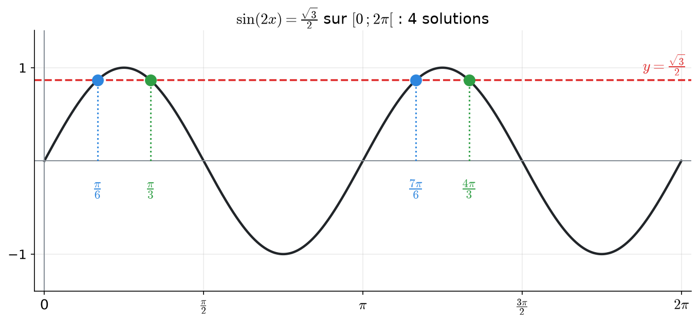<figcaption>
La courbe sin(2x) fait deux oscillations sur [0 ; 2π[ : elle croise la droite 4 fois.
</figcaption></figure>

&#x20;

$$\Large \color{#2F9E44} S = \left\{\frac{\pi}{6} \;;\; \frac{\pi}{3} \;;\; \frac{7\pi}{6} \;;\; \frac{4\pi}{3}\right\}$$

&#x20;

Ici, **plus de k** dans la réponse : on a une liste finie.

&#x20;


**Le crochet $$[0 ; 2\pi[$$** — le crochet tourné vers l'extérieur signifie que $$2\pi$$ est **exclu**. C'est logique : $$2\pi$$ est le même point que 0, on ne veut pas le compter deux fois.


&#x20;

***

&#x20;

## <mark style="color:purple;">11</mark> · Les équations plus difficiles

&#x20;

Chaque type d'équation se ramène, après une transformation, à une équation de base ($$\sin u = \sin v$$, $$\cos u = \cos v$$ ou $$\tan u = \tan v$$).

&#x20;

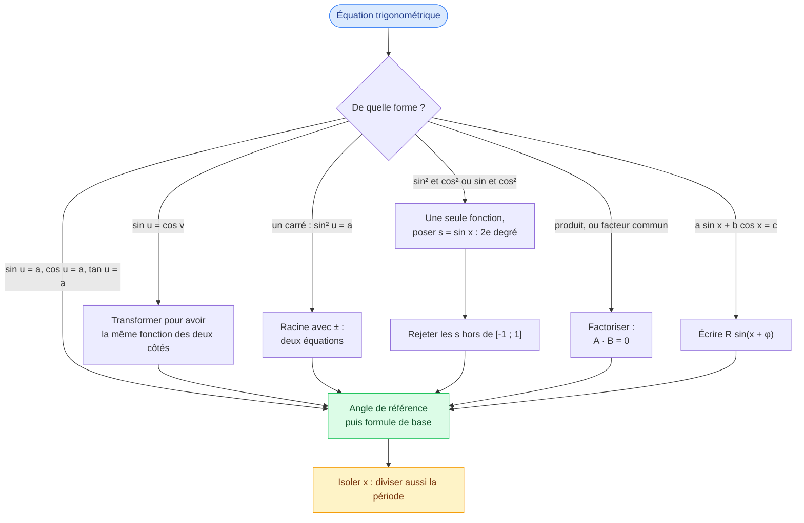

&#x20;



**Idée :** on ne peut comparer que **deux fonctions identiques**. On transforme le cosinus en sinus (ou l'inverse) grâce aux angles associés du [chapitre 2](02-cercle-trigonometrique.md) :

$$\cos\theta = \sin\left(\frac{\pi}{2} - \theta\right) \qquad \sin\theta = \cos\left(\frac{\pi}{2} - \theta\right)$$

&#x20;

**Exemple :** $$\sin(3x) = \cos x$$

<mark style="color:orange;">1.</mark> $$\cos x = \sin\left(\frac{\pi}{2} - x\right)$$, donc $$\sin(3x) = \sin\left(\frac{\pi}{2} - x\right)$$.

<mark style="color:orange;">2. Première famille :</mark>

$$3x = \frac{\pi}{2} - x + 2k\pi \iff 4x = \frac{\pi}{2} + 2k\pi \iff x = \frac{\pi}{8} + \frac{k\pi}{2}$$

<mark style="color:orange;">3. Deuxième famille :</mark>

$$3x = \pi - \left(\frac{\pi}{2} - x\right) + 2k\pi = \frac{\pi}{2} + x + 2k\pi \iff 2x = \frac{\pi}{2} + 2k\pi \iff x = \frac{\pi}{4} + k\pi$$

$$\color{#2F9E44} S = \left\{\frac{\pi}{8} + \frac{k\pi}{2} \;;\; \frac{\pi}{4} + k\pi \;\middle|\; k \in \mathbb{Z}\right\}$$

&#x20;

**Attention aux parenthèses** dans $$\pi - (\dots)$$ : le signe moins s'applique à **tout** ce qu'il y a dedans.



**Idée :** $$y^2 = a$$ donne **deux** possibilités, $$y = \sqrt{a}$$ **ou** $$y = -\sqrt{a}$$. On n'oublie pas le signe moins !

&#x20;

**Exemple :** $$4\sin^2 x = 1$$

<mark style="color:orange;">1.</mark> $$\sin^2 x = \frac{1}{4} \iff \sin x = \frac{1}{2}$$ **ou** $$\sin x = -\frac{1}{2}$$.

<mark style="color:orange;">2.</mark> $$\sin x = \frac{1}{2}$$ : $$x = \frac{\pi}{6} + 2k\pi$$ ou $$x = \frac{5\pi}{6} + 2k\pi$$.

<mark style="color:orange;">3.</mark> $$\sin x = -\frac{1}{2}$$ : $$x = -\frac{\pi}{6} + 2k\pi$$ ou $$x = \frac{7\pi}{6} + 2k\pi$$.

<mark style="color:orange;">4. Regrouper.</mark> Sur un tour, on a 4 points : $$\frac{\pi}{6}, \frac{5\pi}{6}, \frac{7\pi}{6}, \frac{11\pi}{6}$$. On voit que $$\frac{7\pi}{6} = \frac{\pi}{6} + \pi$$ et $$\frac{11\pi}{6} = \frac{5\pi}{6} + \pi$$ : les points vont **par paires opposées**. On peut donc écrire plus court :

$$\color{#2F9E44} x = \frac{\pi}{6} + k\pi \quad \text{ou} \quad x = \frac{5\pi}{6} + k\pi \qquad \left(\text{ou encore } x = \pm\frac{\pi}{6} + k\pi\right)$$



**Idée :** si on a $$\sin^2 x$$ et $$\sin x$$ (ou $$\cos^2 x$$ qu'on transforme), on pose $$s = \sin x$$ et on obtient une équation du second degré, qu'on sait résoudre.

&#x20;

**Exemple :** $$2\sin^2 x + \sin x - 1 = 0$$

<mark style="color:orange;">1. Changement de variable</mark> $$s = \sin x$$ : $$2s^2 + s - 1 = 0$$.

<mark style="color:orange;">2. Discriminant :</mark> $$\Delta = 1^2 - 4 \cdot 2 \cdot (-1) = 9$$, donc $$s = \frac{-1 \pm 3}{4}$$, soit $$s = \frac{1}{2}$$ ou $$s = -1$$.

<mark style="color:orange;">3. Tri :</mark> les deux valeurs sont bien entre −1 et 1, on les garde toutes les deux.

<mark style="color:orange;">4. Retour à x :</mark>

* $$\sin x = \frac{1}{2}$$ : $$x = \frac{\pi}{6} + 2k\pi$$ ou $$x = \frac{5\pi}{6} + 2k\pi$$ ;
* $$\sin x = -1$$ (cas particulier) : $$x = -\frac{\pi}{2} + 2k\pi$$.

$$\color{#2F9E44} S = \left\{\frac{\pi}{6} + 2k\pi \;;\; \frac{5\pi}{6} + 2k\pi \;;\; -\frac{\pi}{2} + 2k\pi \;\middle|\; k \in \mathbb{Z}\right\}$$

&#x20;

**Pourquoi poser s ?** Parce qu'on reconnaît mieux une équation du second degré avec une simple lettre. Mais **n'oublie pas de revenir à x** à la fin : s n'est pas la réponse !



**Idée :** un produit est nul **si et seulement si** l'un des facteurs est nul : $$A \cdot B = 0 \iff A = 0$$ ou $$B = 0$$.

&#x20;

**Exemple :** $$\sin(2x) = \sin x$$

<mark style="color:orange;">1.</mark> $$\sin(2x) = 2\sin x\cos x$$ ([chapitre 4](04-identites-trigonometriques.md)), donc $$2\sin x\cos x - \sin x = 0$$.

<mark style="color:orange;">2. On factorise par sin x :</mark> $$\sin x\,(2\cos x - 1) = 0$$.

<mark style="color:orange;">3. Produit nul :</mark>

* $$\sin x = 0 \iff x = k\pi$$ ;
* $$2\cos x - 1 = 0 \iff \cos x = \frac{1}{2} \iff x = \pm\frac{\pi}{3} + 2k\pi$$.

$$\color{#2F9E44} S = \left\{k\pi \;;\; \pm\frac{\pi}{3} + 2k\pi \;\middle|\; k \in \mathbb{Z}\right\}$$

&#x20;


**Ne jamais diviser par sin x !** Si on « simplifie » $$2\sin x\cos x = \sin x$$ en $$2\cos x = 1$$, on **perd** toutes les solutions $$\sin x = 0$$ ($$x = 0, \pi, 2\pi\dots$$). Diviser par zéro est interdit, et sin x peut valoir zéro. On **factorise** toujours.


&#x20;

**Contrôle :** on aurait aussi pu utiliser directement $$\sin u = \sin v$$ avec $$u = 2x$$, $$v = x$$ : $$2x = x + 2k\pi$$ donne $$x = 2k\pi$$, et $$2x = \pi - x + 2k\pi$$ donne $$x = \frac{\pi}{3} + \frac{2k\pi}{3}$$. Sur un tour, ça fait $$\{0 ; \frac{\pi}{3} ; \pi ; \frac{5\pi}{3}\}$$ : **les mêmes 4 points** que la factorisation. Deux méthodes, même résultat.



**Idée :** une somme $$a\sin x + b\cos x$$ est en fait **une seule sinusoïde** $$R\sin(x + \varphi)$$ (c'est la superposition du [chapitre 6](06-oscillations-harmoniques.md)), avec $$R = \sqrt{a^2 + b^2}$$.

&#x20;

**Exemple :** $$\sin x + \cos x = 1$$

<mark style="color:orange;">1.</mark> $$R = \sqrt{1^2 + 1^2} = \sqrt{2}$$. On met $$\sqrt{2}$$ en évidence :

$$\sin x + \cos x = \sqrt{2}\left(\frac{\sqrt{2}}{2}\sin x + \frac{\sqrt{2}}{2}\cos x\right)$$

<mark style="color:orange;">2.</mark> On reconnaît $$\frac{\sqrt{2}}{2} = \cos\frac{\pi}{4} = \sin\frac{\pi}{4}$$, et la formule d'addition $$\sin x\cos\frac{\pi}{4} + \cos x\sin\frac{\pi}{4} = \sin\left(x + \frac{\pi}{4}\right)$$ :

$$\sin x + \cos x = \sqrt{2}\,\sin\left(x + \frac{\pi}{4}\right)$$

<mark style="color:orange;">3.</mark> L'équation devient $$\sin\left(x + \frac{\pi}{4}\right) = \frac{1}{\sqrt{2}} = \frac{\sqrt{2}}{2} = \sin\frac{\pi}{4}$$ :

$$x + \frac{\pi}{4} = \frac{\pi}{4} + 2k\pi \iff x = 2k\pi \qquad\qquad x + \frac{\pi}{4} = \frac{3\pi}{4} + 2k\pi \iff x = \frac{\pi}{2} + 2k\pi$$

<mark style="color:orange;">4. Vérification :</mark> $$\sin 0 + \cos 0 = 0 + 1 = 1$$ et $$\sin\frac{\pi}{2} + \cos\frac{\pi}{2} = 1 + 0 = 1$$.

$$\color{#2F9E44} S = \left\{2k\pi \;;\; \frac{\pi}{2} + 2k\pi \;\middle|\; k \in \mathbb{Z}\right\}$$

&#x20;

**Pourquoi cette méthode plutôt qu'élever au carré ?** Elle ne crée **aucune** solution parasite (voir l'exemple 5 de la section 13, qui élève au carré et doit ensuite trier).



&#x20;

***

&#x20;

## <mark style="color:purple;">12</mark> · Les pièges à éviter

&#x20;


<mark style="color:red;">**1. Oublier une famille.**</mark> sin et cos ont **deux** familles (sauf cas particuliers), la tangente **une seule**. Dessine le cercle pour ne pas te tromper.

<mark style="color:red;">**2. Oublier de diviser la période.**</mark> $$3x = \frac{\pi}{2} + 2k\pi$$ donne $$x = \frac{\pi}{6} + \frac{2k\pi}{3}$$, **pas** $$+ 2k\pi$$.

<mark style="color:red;">**3. Diviser par une fonction qui peut s'annuler.**</mark> On **factorise** au lieu de simplifier par sin x ou cos x.

<mark style="color:red;">**4. Oublier les hypothèses.**</mark> Avec tan x, cot x, $$\frac{1}{\cos x}$$… on note « $$\cos x \neq 0$$ » (ou $$\sin x \neq 0$$) et on vérifie les solutions.

<mark style="color:red;">**5. Élever au carré sans vérifier.**</mark> Le carré crée des solutions **parasites** : il faut tester chaque famille dans l'équation de départ.

<mark style="color:red;">**6. Garder une valeur impossible.**</mark> Après un changement de variable $$s = \sin x$$, on **rejette** les s plus grands que 1 ou plus petits que −1.

<mark style="color:red;">**7. Oublier le ± d'une racine.**</mark> $$\sin^2 x = \frac{1}{4}$$ donne $$\sin x = \pm\frac{1}{2}$$.


&#x20;

***

&#x20;

## <mark style="color:purple;">13</mark> · Exemples d'examen corrigés

&#x20;

### Exemple 1 — Sinus contre cosinus (Test 1 Pb 4, variante A, a)

&#x20;

$$\Large \sin\left(2x + \frac{\pi}{3}\right) - \cos\left(x + \frac{\pi}{2}\right) = 0$$

&#x20;

<mark style="color:orange;">Étape 1 — Même fonction des deux côtés.</mark> On passe le cosinus de l'autre côté et on le transforme avec $$\cos\theta = \sin\left(\theta + \frac{\pi}{2}\right)$$ (un quart de tour d'avance) :

$$\sin\left(2x + \frac{\pi}{3}\right) = \sin\left(x + \frac{\pi}{2} + \frac{\pi}{2}\right) = \sin(x + \pi)$$

**Pourquoi ?** Pour pouvoir utiliser la formule $$\sin u = \sin v$$, il faut deux sinus.

<mark style="color:orange;">Étape 2 — Première famille</mark> ($$u = v + 2k\pi$$) :

$$2x + \frac{\pi}{3} = x + \pi + 2k\pi \iff x = \frac{2\pi}{3} + 2k\pi$$

<mark style="color:orange;">Étape 3 — Deuxième famille</mark> ($$u = \pi - v + 2k\pi$$) :

$$2x + \frac{\pi}{3} = \pi - (x + \pi) + 2k\pi = -x + 2k\pi \iff 3x = -\frac{\pi}{3} + 2k\pi \iff x = -\frac{\pi}{9} + \frac{2k\pi}{3}$$

(on divise **aussi** $$2k\pi$$ par 3.)

$$\Large \color{#2F9E44} S = \left\{\frac{2\pi}{3} + 2k\pi \;;\; -\frac{\pi}{9} + \frac{2k\pi}{3} \;\middle|\; k \in \mathbb{Z}\right\}$$

&#x20;

### Exemple 2 — Un carré (Test 1 Pb 4, variante A, b)

&#x20;

$$\Large \cot^2\left(3x + \frac{\pi}{6}\right) = 3$$

&#x20;

<mark style="color:orange;">Étape 1</mark> — On prend la racine <mark style="color:red;">avec les deux signes</mark> :

$$\cot\left(3x + \frac{\pi}{6}\right) = \sqrt{3} \quad\text{ou}\quad \cot\left(3x + \frac{\pi}{6}\right) = -\sqrt{3}$$

<mark style="color:orange;">Étape 2</mark> — La cotangente ($$\cot = \frac{\cos}{\sin} = \frac{1}{\tan}$$) a, comme la tangente, une période π. On connaît $$\cot\frac{\pi}{6} = \frac{\cos(\pi/6)}{\sin(\pi/6)} = \frac{\sqrt{3}/2}{1/2} = \sqrt{3}$$ :

$$\cot u = \sqrt{3} \iff u = \frac{\pi}{6} + k\pi \quad\Rightarrow\quad 3x + \frac{\pi}{6} = \frac{\pi}{6} + k\pi \quad\Rightarrow\quad x = \frac{k\pi}{3}$$

$$\cot u = -\sqrt{3} \iff u = \frac{5\pi}{6} + k\pi \quad\Rightarrow\quad 3x = \frac{2\pi}{3} + k\pi \quad\Rightarrow\quad x = \frac{2\pi}{9} + \frac{k\pi}{3}$$

$$\Large \color{#2F9E44} S = \left\{\frac{k\pi}{3} \;;\; \frac{2\pi}{9} + \frac{k\pi}{3} \;\middle|\; k \in \mathbb{Z}\right\}$$

&#x20;

### Exemple 3 — Factorisation (Test 1 Pb 4, variante A, c)

&#x20;

$$\Large \sin(2x) - \tan x = 0 \qquad \text{hypothèse : } \cos x \neq 0$$

&#x20;

<mark style="color:orange;">Étape 1 — Tout écrire avec l'angle x</mark> :

$$2\sin x\cos x - \frac{\sin x}{\cos x} = 0$$

<mark style="color:orange;">Étape 2 — Factoriser</mark> (surtout pas diviser !) par sin x :

$$\sin x\left(2\cos x - \frac{1}{\cos x}\right) = 0$$

<mark style="color:orange;">Étape 3 — Produit nul</mark> :

* $$\sin x = 0 \iff x = k\pi$$. Hypothèse : $$\cos(k\pi) = \pm 1 \neq 0$$, ces solutions sont valables.
* Second facteur :

$$2\cos x = \frac{1}{\cos x} \iff \cos^2 x = \frac{1}{2} \iff \cos x = \pm\frac{\sqrt{2}}{2}$$

Cela donne les 4 angles $$\pm\frac{\pi}{4}$$, $$\pm\frac{3\pi}{4}$$ sur un tour : ils sont espacés d'un quart de tour, on les regroupe en $$x = \frac{\pi}{4} + \frac{k\pi}{2}$$.

$$\Large \color{#2F9E44} S = \left\{k\pi \;;\; \frac{\pi}{4} + \frac{k\pi}{2} \;\middle|\; k \in \mathbb{Z}\right\}$$

&#x20;

### Exemple 4 — Équation du second degré en sin x (Test 2017)

&#x20;

$$\Large 2\cos^2 x + 3\sin x = 0$$

&#x20;

<mark style="color:orange;">Étape 1 — Une seule fonction</mark> : avec $$\cos^2 x = 1 - \sin^2 x$$ (identité de Pythagore),

$$2 - 2\sin^2 x + 3\sin x = 0$$

<mark style="color:orange;">Étape 2 — Changement de variable</mark> $$s = \sin x$$ (et on multiplie par −1) :

$$2s^2 - 3s - 2 = 0 \qquad \Delta = 9 + 16 = 25 \qquad s = \frac{3 \pm 5}{4} \quad\Rightarrow\quad s = 2 \ \text{ ou } \ s = -\frac{1}{2}$$

<mark style="color:orange;">Étape 3 — Tri</mark> : $$\sin x = 2$$ est <mark style="color:red;">impossible</mark> (un sinus reste entre −1 et 1). Reste $$\sin x = -\frac{1}{2} = \sin\left(-\frac{\pi}{6}\right)$$ :

$$\Large \color{#2F9E44} x = -\frac{\pi}{6} + 2k\pi \quad \text{ou} \quad x = \pi + \frac{\pi}{6} + 2k\pi = \frac{7\pi}{6} + 2k\pi$$

&#x20;

### Exemple 5 — Solutions parasites (TE F-1, 2023)

&#x20;

$$\Large \cos x - \sin x = 1$$

&#x20;

<mark style="color:orange;">Étape 1 — Élever au carré</mark> :

$$\cos^2 x - 2\sin x\cos x + \sin^2 x = 1 \iff 1 - \sin(2x) = 1 \iff \sin(2x) = 0$$

<mark style="color:orange;">Étape 2</mark> : $$2x = k\pi$$, soit $$x = \frac{k\pi}{2}$$. Sur un tour, candidats : $$0, \frac{\pi}{2}, \pi, \frac{3\pi}{2}$$.

<mark style="color:orange;">Étape 3 — Vérifier dans l'équation de départ</mark> :

&#x20;

| x                  | cos x − sin x     | Solution ?                                  |
| ------------------ | ----------------- | ------------------------------------------- |
| 0                  | 1 − 0 = 1         | <mark style="color:green;">oui</mark>      |
| $$\frac{\pi}{2}$$  | 0 − 1 = −1        | <mark style="color:red;">non</mark>        |
| $$\pi$$            | −1 − 0 = −1       | <mark style="color:red;">non</mark>        |
| $$\frac{3\pi}{2}$$ | 0 − (−1) = 1      | <mark style="color:green;">oui</mark>      |

&#x20;

<figure>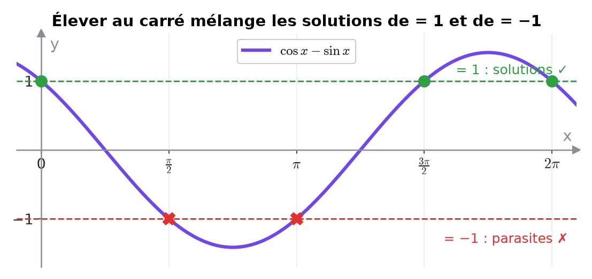<figcaption>
Les croix rouges sont les solutions de cos x − sin x = −1, introduites par le carré.
</figcaption></figure>

&#x20;

$$\Large \color{#2F9E44} S = \left\{2k\pi \;;\; \frac{3\pi}{2} + 2k\pi \;\middle|\; k \in \mathbb{Z}\right\}$$

&#x20;

**Pourquoi le carré crée-t-il des solutions en trop ?** Parce que $$1^2 = (-1)^2$$ : en élevant au carré, on ne fait plus la différence entre « cos x − sin x = 1 » et « cos x − sin x = −1 ». On récupère les solutions des **deux** équations, et il faut éliminer celles de la seconde. (La méthode $$R\sin(x + \varphi)$$ de la section 11 évite ce problème.)

&#x20;

### Exemple 6 — Valeur non remarquable (TE F-1, 2025)

&#x20;

$$\Large 4\cos(2x) + 1 = 0 \iff \cos(2x) = -\frac{1}{4}$$

&#x20;

$$-\frac{1}{4}$$ n'est pas une valeur remarquable : on garde arccos (calculatrice autorisée au TE), et on n'oublie **ni le ±, ni de diviser la période** :

$$2x = \pm\arccos\left(-\frac{1}{4}\right) + 2k\pi \iff \color{#2F9E44} x = \pm\frac{1}{2}\arccos\left(-\frac{1}{4}\right) + k\pi \approx \pm 0{,}912 + k\pi$$

&#x20;

***

&#x20;

## <mark style="color:purple;">14</mark> · Représenter les solutions sur le cercle

&#x20;

Une famille de la forme

$$\Large x = x_0 + \frac{2k\pi}{n}$$

donne <mark style="color:green;">n points régulièrement espacés</mark> sur le cercle (un polygone régulier), comme on l'a vu avec le triangle de la section 09.

&#x20;

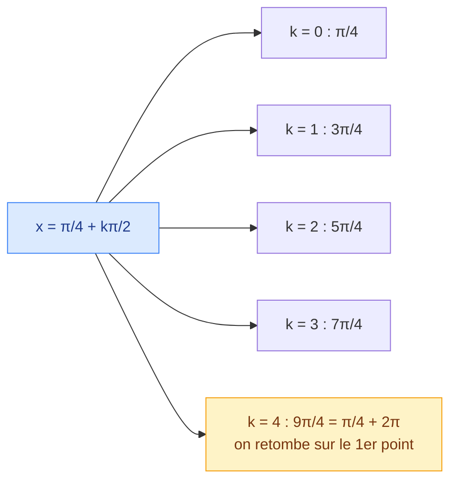

&#x20;

Le nombre de points distincts sur un tour vaut :

$$\Large n = \frac{2\pi}{\text{écart entre deux solutions}} \qquad \text{ici } \frac{2\pi}{\pi/2} = 4 \text{ points (un carré)}$$

&#x20;

<figure>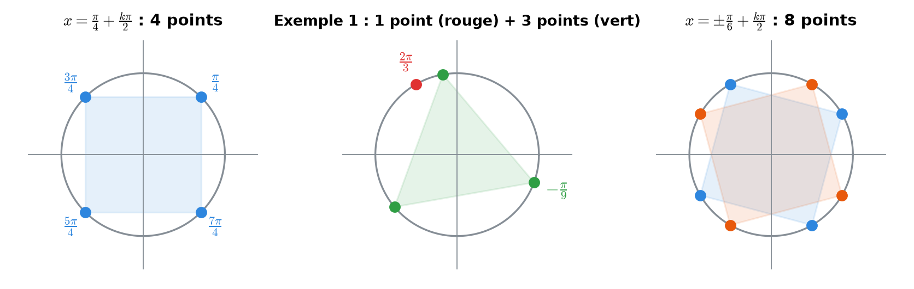<figcaption>
Chaque famille dessine un polygone régulier sur le cercle.
</figcaption></figure>

&#x20;

***

&#x20;

## <mark style="color:purple;">15</mark> · Exercices

&#x20;


**Mode d'emploi** — cherche **sur papier**, dessine le cercle, puis ouvre l'indice si tu bloques, et la solution seulement à la fin.


&#x20;

### Exercice 1 — Les bases

&#x20;

Résoudre dans ℝ : **a)** $$\sin x = \frac{\sqrt{3}}{2}$$ **b)** $$\cos x = -\frac{\sqrt{2}}{2}$$ **c)** $$\tan x = \frac{\sqrt{3}}{3}$$ **d)** $$\sin x = -\frac{\sqrt{3}}{2}$$

&#x20;

Cliquez pour voir l'indice

&#x20;

Trouve d'abord l'angle de référence dans le tableau, puis applique la bonne formule : $$\pi - v$$ pour le sinus, $$-v$$ pour le cosinus, $$+k\pi$$ pour la tangente.

&#x20;

Solution détaillée

&#x20;

**a)** $$\sin\frac{\pi}{3} = \frac{\sqrt{3}}{2}$$ : $$x = \frac{\pi}{3} + 2k\pi$$ ou $$x = \pi - \frac{\pi}{3} + 2k\pi = \frac{2\pi}{3} + 2k\pi$$.

**b)** $$\cos\frac{3\pi}{4} = -\frac{\sqrt{2}}{2}$$ (car $$\frac{3\pi}{4} = \pi - \frac{\pi}{4}$$) : $$x = \pm\frac{3\pi}{4} + 2k\pi$$.

**c)** $$\tan\frac{\pi}{6} = \frac{\sqrt{3}}{3}$$ : $$x = \frac{\pi}{6} + k\pi$$.

**d)** $$\sin\left(-\frac{\pi}{3}\right) = -\frac{\sqrt{3}}{2}$$ : $$x = -\frac{\pi}{3} + 2k\pi$$ ou $$x = \pi + \frac{\pi}{3} + 2k\pi = \frac{4\pi}{3} + 2k\pi$$.

&#x20;

&#x20;

### Exercice 2 — Diviser la période

&#x20;

Résoudre : **a)** $$\cos(2x) = 0$$ **b)** $$\sin\left(\frac{x}{3}\right) = 1$$ **c)** $$\tan\left(4x - \frac{\pi}{4}\right) = 1$$

&#x20;

Cliquez pour voir l'indice

&#x20;

Résous d'abord pour l'angle entier (cas particuliers pour a et b), puis isole x en appliquant la **même opération** au terme avec k.

&#x20;

Solution détaillée

&#x20;

**a)** $$2x = \frac{\pi}{2} + k\pi \iff x = \frac{\pi}{4} + \frac{k\pi}{2}$$ (4 points par tour).

**b)** $$\frac{x}{3} = \frac{\pi}{2} + 2k\pi \iff x = \frac{3\pi}{2} + 6k\pi$$ (on **multiplie** par 3 : une seule solution tous les 3 tours).

**c)** $$4x - \frac{\pi}{4} = \frac{\pi}{4} + k\pi \iff 4x = \frac{\pi}{2} + k\pi \iff x = \frac{\pi}{8} + \frac{k\pi}{4}$$.

&#x20;

&#x20;

### Exercice 3 — Dans un intervalle

&#x20;

Résoudre $$\tan(2x) = -1$$ dans $$[0 ; \pi[$$.

&#x20;

Cliquez pour voir l'indice

&#x20;

$$\tan\left(-\frac{\pi}{4}\right) = -1$$. Trouve la famille, puis teste k = 0, 1, 2…

&#x20;

Solution détaillée

&#x20;

$$2x = -\frac{\pi}{4} + k\pi \iff x = -\frac{\pi}{8} + \frac{k\pi}{2}$$.

| k | x |
| - | - |
| 0 | $$-\frac{\pi}{8}$$ (trop petit) |
| 1 | $$\frac{3\pi}{8}$$ |
| 2 | $$\frac{7\pi}{8}$$ |
| 3 | $$\frac{11\pi}{8}$$ (trop grand) |

$$\color{#2F9E44} S = \left\{\frac{3\pi}{8} \;;\; \frac{7\pi}{8}\right\}$$

&#x20;

&#x20;

### Exercice 4 — Second degré

&#x20;

Résoudre : $$2\cos^2 x - 3\cos x + 1 = 0$$

&#x20;

Cliquez pour voir l'indice

&#x20;

Pose $$c = \cos x$$ et résous $$2c^2 - 3c + 1 = 0$$.

&#x20;

Solution détaillée

&#x20;

$$\Delta = 9 - 8 = 1$$, $$c = \frac{3 \pm 1}{4}$$, donc $$c = 1$$ ou $$c = \frac{1}{2}$$ (les deux sont dans [−1 ; 1]).

* $$\cos x = 1 \iff x = 2k\pi$$ ;
* $$\cos x = \frac{1}{2} \iff x = \pm\frac{\pi}{3} + 2k\pi$$.

$$\color{#2F9E44} S = \left\{2k\pi \;;\; \pm\frac{\pi}{3} + 2k\pi \;\middle|\; k \in \mathbb{Z}\right\}$$

&#x20;

&#x20;

### Exercice 5 — Factoriser

&#x20;

Résoudre : $$\sin x\cos x = \frac{1}{2}\cos x$$

&#x20;

Cliquez pour voir l'indice

&#x20;

Ne divise pas par cos x ! Passe tout du même côté et factorise.

&#x20;

Solution détaillée

&#x20;

$$\cos x\left(\sin x - \frac{1}{2}\right) = 0$$.

* $$\cos x = 0 \iff x = \frac{\pi}{2} + k\pi$$ ;
* $$\sin x = \frac{1}{2} \iff x = \frac{\pi}{6} + 2k\pi$$ ou $$x = \frac{5\pi}{6} + 2k\pi$$.

Si on avait divisé par cos x, on aurait perdu la famille $$\frac{\pi}{2} + k\pi$$.

&#x20;

&#x20;

### Exercice 6 — (TE 2017)

&#x20;

Résoudre dans ℝ : $$\cos(4x) = \sin x$$

&#x20;

Cliquez pour voir l'indice

&#x20;

Écris $$\sin x = \cos\left(\frac{\pi}{2} - x\right)$$, puis utilise $$\cos u = \cos v \iff u = \pm v + 2k\pi$$.

&#x20;

Solution détaillée

&#x20;

<mark style="color:orange;">1.</mark> Même fonction :

$$\cos(4x) = \cos\left(\frac{\pi}{2} - x\right)$$

<mark style="color:orange;">2.</mark> Première famille :

$$4x = \frac{\pi}{2} - x + 2k\pi \iff 5x = \frac{\pi}{2} + 2k\pi \iff x = \frac{\pi}{10} + \frac{2k\pi}{5}$$

<mark style="color:orange;">3.</mark> Deuxième famille :

$$4x = -\frac{\pi}{2} + x + 2k\pi \iff 3x = -\frac{\pi}{2} + 2k\pi \iff x = -\frac{\pi}{6} + \frac{2k\pi}{3}$$

$$\Large \color{#2F9E44} S = \left\{\frac{\pi}{10} + \frac{2k\pi}{5} \;;\; -\frac{\pi}{6} + \frac{2k\pi}{3} \;\middle|\; k \in \mathbb{Z}\right\}$$

&#x20;

&#x20;

### Exercice 7 — (Test 1 Pb 4, variante C)

&#x20;

Résoudre : $$\sec^2\left(4x + \frac{\pi}{6}\right) = 2$$

&#x20;

Cliquez pour voir l'indice

&#x20;

$$\sec u = \frac{1}{\cos u}$$, donc $$\sec^2 u = 2 \iff \cos^2 u = \frac{1}{2} \iff \cos u = \pm\frac{\sqrt{2}}{2}$$. Les quatre angles correspondants sur un tour s'écrivent en une seule famille de période $$\frac{\pi}{2}$$.

&#x20;

Solution détaillée

&#x20;

<mark style="color:orange;">1.</mark> On passe au cosinus :

$$\cos^2\left(4x + \frac{\pi}{6}\right) = \frac{1}{2} \quad\Rightarrow\quad \cos\left(4x + \frac{\pi}{6}\right) = \pm\frac{\sqrt{2}}{2}$$

<mark style="color:orange;">2.</mark> Les angles u vérifiant $$\cos u = \pm\frac{\sqrt{2}}{2}$$ sont $$\frac{\pi}{4}, \frac{3\pi}{4}, \frac{5\pi}{4}, \frac{7\pi}{4}$$ sur un tour, espacés d'un quart de tour : $$u = \frac{\pi}{4} + \frac{k\pi}{2}$$.

<mark style="color:orange;">3.</mark> On isole x (en divisant aussi la période par 4) :

$$4x + \frac{\pi}{6} = \frac{\pi}{4} + \frac{k\pi}{2} \iff 4x = \frac{\pi}{12} + \frac{k\pi}{2} \iff \color{#2F9E44} x = \frac{\pi}{48} + \frac{k\pi}{8}$$

&#x20;

&#x20;

### Exercice 8 — (TE F-1, 2022)

&#x20;

Résoudre, puis représenter les solutions sur le cercle trigonométrique : $$\frac{1}{3}\tan^2(2x) - 1 = 0$$

&#x20;

Cliquez pour voir l'indice

&#x20;

Isole $$\tan^2(2x) = 3$$, prends $$\tan(2x) = \pm\sqrt{3}$$ et n'oublie pas que la période de la tangente est π (qui devient $$\frac{\pi}{2}$$ après division par 2).

&#x20;

Solution détaillée

&#x20;

<mark style="color:orange;">1.</mark> $$\tan^2(2x) = 3 \iff \tan(2x) = \sqrt{3}$$ ou $$\tan(2x) = -\sqrt{3}$$.

<mark style="color:orange;">2.</mark> Les deux familles :

$$\tan(2x) = \sqrt{3} \iff 2x = \frac{\pi}{3} + k\pi \iff x = \frac{\pi}{6} + \frac{k\pi}{2}$$

$$\tan(2x) = -\sqrt{3} \iff 2x = -\frac{\pi}{3} + k\pi \iff x = -\frac{\pi}{6} + \frac{k\pi}{2}$$

$$\Large \color{#2F9E44} S = \left\{\pm\frac{\pi}{6} + \frac{k\pi}{2} \;\middle|\; k \in \mathbb{Z}\right\}$$

<mark style="color:orange;">3.</mark> Sur le cercle : chaque famille donne 4 points (écart $$\frac{\pi}{2}$$), soit 8 points :

* $$\frac{\pi}{6}, \frac{2\pi}{3}, \frac{7\pi}{6}, \frac{5\pi}{3}$$ ;
* $$\frac{\pi}{3}, \frac{5\pi}{6}, \frac{4\pi}{3}, \frac{11\pi}{6}$$.

<mark style="color:orange;">4.</mark> Hypothèse de définition : $$\cos(2x) \neq 0$$. Aucune de ces valeurs ne l'annule.

&#x20;

&#x20;

***

&#x20;

## <mark style="color:purple;">16</mark> · À retenir

&#x20;

* Une équation trigonométrique a en général une **infinité** de solutions, car tourner d'un tour complet ramène au même point.
* **k ∈ ℤ** = le **nombre de tours** ajoutés (k > 0) ou retirés (k < 0). $$+2k\pi$$ pour sin et cos, $$+k\pi$$ pour tan.
* <mark style="color:red;">**sin**</mark> : $$u = v + 2k\pi$$ **ou** $$u = \pi - v + 2k\pi$$ (même hauteur, miroir vertical).
* <mark style="color:green;">**cos**</mark> : $$u = \pm v + 2k\pi$$ (même abscisse, miroir horizontal).
* <mark style="color:blue;">**tan**</mark> : $$u = v + k\pi$$ (points opposés, une seule famille).
* Si $$|a| > 1$$, **pas de solution** pour sin et cos.
* Angle composé : on résout pour l'angle entier, puis on **divise aussi la période**.
* On **factorise**, on ne divise jamais par sin x ou cos x. On vérifie après un carré.

&#x20;


**Page suivante** → [5 bis. Inéquations trigonométriques](05b-inequations-trigonometriques.md) : au lieu de chercher **où** la courbe vaut 1/2, on cherche **où elle est au-dessus** de 1/2.

