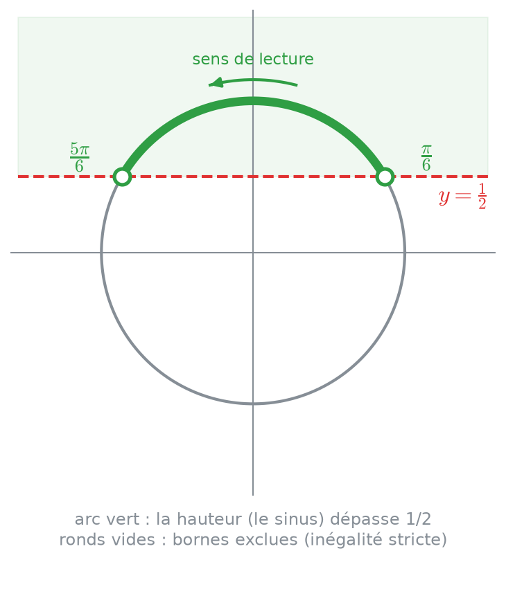
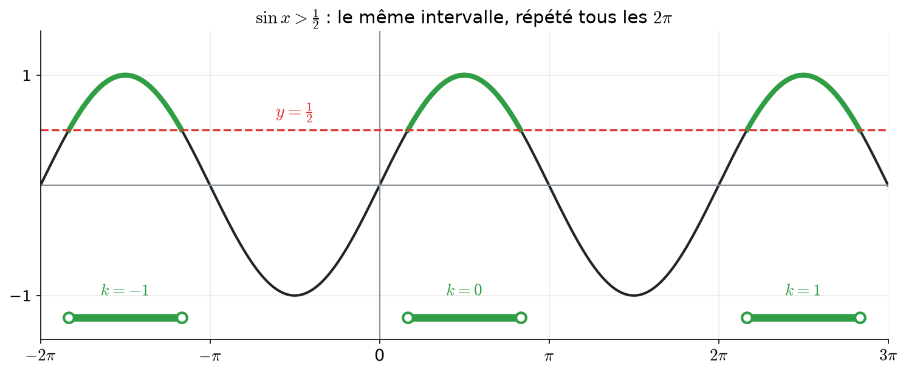
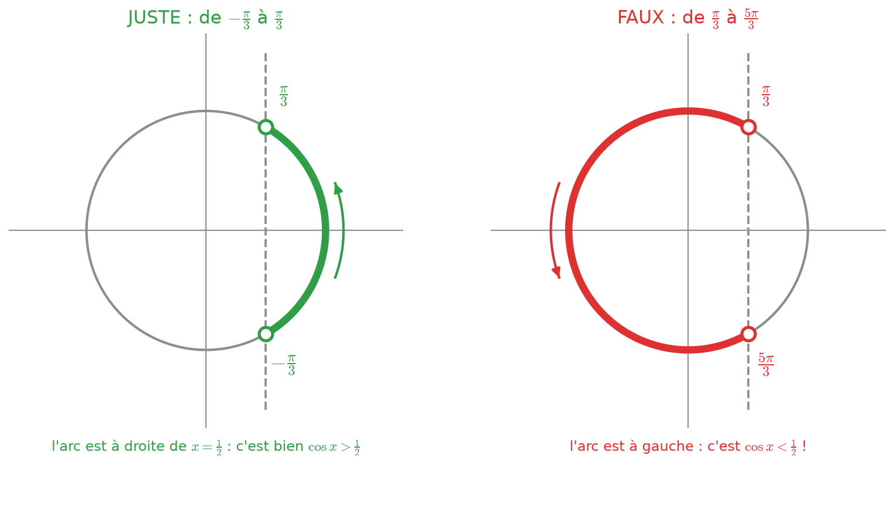
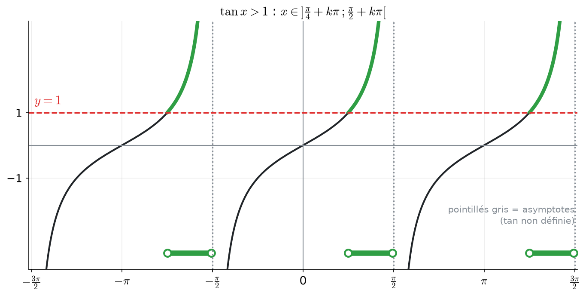
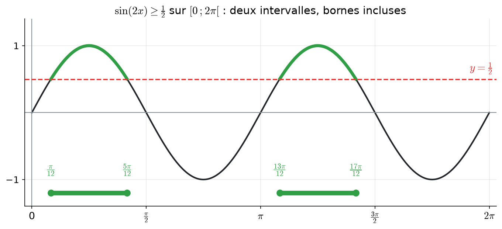

# 5 bis. Inéquations trigonométriques

<mark style="color:blue;">**Ne plus chercher où la courbe vaut 1/2, mais où elle est au-dessus : des points, on passe à des arcs.**</mark>

&#x20;


**En bref**

Pour résoudre $$\sin x > \frac{1}{2}$$ :

1. on résout d'abord l'**équation** $$\sin x = \frac{1}{2}$$ : elle donne les **bornes** ($$\frac{\pi}{6}$$ et $$\frac{5\pi}{6}$$) ;
2. sur le cercle, on colorie l'**arc** où l'inégalité est vraie ;
3. on lit cet arc **dans le sens inverse des aiguilles d'une montre** et on ajoute les tours :

$$x \in \left]\frac{\pi}{6} + 2k\pi \;;\; \frac{5\pi}{6} + 2k\pi\right[, \qquad k \in \mathbb{Z}$$


&#x20;


**Prérequis** — il faut savoir résoudre les équations : [5. Équations trigonométriques](05-equations-trigonometriques.md) (en particulier la signification du **k**). Le cercle et les angles remarquables sont dans [2. Le cercle trigonométrique](02-cercle-trigonometrique.md).


&#x20;

***

&#x20;

## <mark style="color:purple;">01</mark> · Équation ou inéquation : quelle différence ?

&#x20;



### Équation : des points

&#x20;

$$\sin x = \frac{1}{2}$$

&#x20;

On cherche les angles où la hauteur vaut **exactement** 1/2. Sur le cercle, ce sont **2 points**.

&#x20;

Réponse : une liste de valeurs.



### Inéquation : des arcs

&#x20;

$$\sin x > \frac{1}{2}$$

&#x20;

On cherche les angles où la hauteur est **plus grande** que 1/2. Sur le cercle, c'est tout un **morceau de cercle** (un arc).

&#x20;

Réponse : des **intervalles**.



&#x20;

### Rappel : les intervalles

&#x20;

| Écriture       | Signification                    | Bornes                                   |
| -------------- | -------------------------------- | ---------------------------------------- |
| $$[a ; b]$$    | $$a \leq x \leq b$$              | a et b **inclus** (crochets vers l'intérieur) |
| $$]a ; b[$$    | $$a < x < b$$                    | a et b **exclus** (crochets vers l'extérieur) |
| $$[a ; b[$$    | $$a \leq x < b$$                 | a inclus, b exclu                        |
| $$A \cup B$$   | « A **ou** B » (la réunion)      | on met les deux intervalles ensemble     |

&#x20;


**Strict ou large ?**

* **>** ou **<** (inégalité **stricte**) : les bornes sont **exclues**, car à la borne on a l'**égalité**, pas « plus grand ». Crochets $$]\ ;\ [$$, ronds **vides** sur les dessins.
* **≥** ou **≤** (inégalité **large**) : les bornes sont **incluses**. Crochets $$[\ ;\ ]$$, ronds **pleins** sur les dessins.


&#x20;

***

&#x20;

## <mark style="color:purple;">02</mark> · La méthode du cercle, pas à pas

&#x20;

**Exemple :** résoudre $$\sin x > \frac{1}{2}$$.

&#x20;



### Résoudre l'équation correspondante

&#x20;

On remplace « > » par « = » : $$\sin x = \frac{1}{2}$$. Sur un tour, les solutions sont $$\frac{\pi}{6}$$ et $$\frac{5\pi}{6}$$ (voir [chapitre 5](05-equations-trigonometriques.md)).

&#x20;

**Pourquoi ?** Ces deux angles sont les **frontières** : c'est là que le sinus passe de « plus petit que 1/2 » à « plus grand que 1/2 ». Entre deux frontières, le signe de la comparaison ne peut pas changer.



### Dessiner la droite et choisir le bon côté

&#x20;

Le sinus est la **hauteur**. On trace la droite horizontale $$y = \frac{1}{2}$$. On veut une hauteur **plus grande** que 1/2 : on garde la partie du cercle **au-dessus** de la droite.

&#x20;

<figure> 1/2 sur le cercle" width="460"><figcaption>
L'arc vert est l'ensemble des points du cercle dont la hauteur dépasse 1/2.
</figcaption></figure>



### Lire l'arc dans le sens positif

&#x20;

On parcourt l'arc vert **dans le sens inverse des aiguilles d'une montre** (le sens où les angles augmentent). On part de $$\frac{\pi}{6}$$ et on arrive à $$\frac{5\pi}{6}$$. Sur un tour :

$$x \in \left]\frac{\pi}{6} \;;\; \frac{5\pi}{6}\right[$$

&#x20;

Les crochets sont **ouverts** car l'inégalité est stricte : en $$\frac{\pi}{6}$$, le sinus vaut **exactement** 1/2, ce qui n'est pas « plus grand que 1/2 ».



### Ajouter les tours

&#x20;

Comme pour les équations, chaque tour complet ramène au même arc. On ajoute $$2k\pi$$ **aux deux bornes** :

$$x \in \left]\frac{\pi}{6} + 2k\pi \;;\; \frac{5\pi}{6} + 2k\pi\right[, \qquad k \in \mathbb{Z}$$

&#x20;

**Pourquoi aux deux bornes ?** Parce que c'est **tout l'arc** qui tourne d'un tour, pas seulement son début.



### Écrire l'ensemble des solutions

&#x20;

$$\Large \color{#2F9E44} S = \bigcup_{k \in \mathbb{Z}} \left]\frac{\pi}{6} + 2k\pi \;;\; \frac{5\pi}{6} + 2k\pi\right[$$

&#x20;

Le grand symbole $$\bigcup_{k \in \mathbb{Z}}$$ se lit « la réunion, pour tous les k entiers, de… » : on met **ensemble** l'intervalle de k = 0, celui de k = 1, celui de k = −1, etc.



&#x20;

***

&#x20;

## <mark style="color:purple;">03</mark> · Vérifier avec le graphe

&#x20;

La même inéquation se lit aussi sur la courbe $$y = \sin x$$ : on garde les morceaux de courbe **au-dessus** de la droite $$y = \frac{1}{2}$$, et on regarde les x correspondants.

&#x20;

<figure> 1/2 sur le graphe" width="760"><figcaption>
En vert : les morceaux de courbe au-dessus de 1/2. En bas : les intervalles de solutions, un par valeur de k.
</figcaption></figure>

&#x20;

On voit bien le rôle du k : **le même intervalle**, décalé de $$2\pi$$ à chaque fois.

&#x20;


**Le test qui sauve** — prends une valeur **au milieu** de ton intervalle et vérifie. Ici $$x = \frac{\pi}{2}$$ : $$\sin\frac{\pi}{2} = 1 > \frac{1}{2}$$. C'est juste. Puis une valeur **hors** de l'intervalle, par exemple $$x = 0$$ : $$\sin 0 = 0$$, pas plus grand que 1/2. C'est cohérent.


&#x20;

***

&#x20;

## <mark style="color:purple;">04</mark> · Le sens de lecture : le piège du cosinus

&#x20;

**Exemple :** résoudre $$\cos x > \frac{1}{2}$$.

&#x20;

<mark style="color:orange;">1. Bornes :</mark> $$\cos x = \frac{1}{2} \iff x = \pm\frac{\pi}{3}$$ (sur un tour).

<mark style="color:orange;">2. Côté :</mark> le cosinus est la position **horizontale**. On trace la droite verticale $$x = \frac{1}{2}$$ et on garde la partie du cercle **à droite** (cosinus plus grand).

<mark style="color:orange;">3. Lecture :</mark> l'arc de droite va de $$-\frac{\pi}{3}$$ (en bas) jusqu'à $$\frac{\pi}{3}$$ (en haut), **en passant par 0**.

&#x20;

<figure> 1/2" width="780"><figcaption>
À gauche, la bonne lecture. À droite, l'erreur classique : partir de π/3 et tourner jusqu'à 5π/3 donne l'arc opposé.
</figcaption></figure>

&#x20;

$$\Large \color{#2F9E44} S = \bigcup_{k \in \mathbb{Z}} \left]-\frac{\pi}{3} + 2k\pi \;;\; \frac{\pi}{3} + 2k\pi\right[$$

&#x20;


**L'erreur classique** — écrire $$\left]\frac{\pi}{3} ; \frac{5\pi}{3}\right[$$ parce que « π/3 est plus petit que 5π/3 ». Mais en tournant de $$\frac{\pi}{3}$$ à $$\frac{5\pi}{3}$$ dans le sens positif, on passe **par la gauche** du cercle : c'est l'arc des cosinus **plus petits** que 1/2, l'inverse de ce qu'on veut !

**La règle :** on part de l'extrémité où l'arc **commence** quand on tourne dans le sens positif, et on s'arrête là où il **finit**. Si l'arc **traverse l'angle 0** (le point tout à droite), la première borne doit être **négative**.


&#x20;

### Et si l'énoncé demande la réponse dans $$[0 ; 2\pi[$$ ?

&#x20;

L'arc $$\left]-\frac{\pi}{3} ; \frac{\pi}{3}\right[$$ déborde sous 0. Dans $$[0 ; 2\pi[$$, il est **coupé en deux morceaux** :

* le morceau de 0 à $$\frac{\pi}{3}$$ : $$\left[0 ; \frac{\pi}{3}\right[$$ (0 est inclus car $$\cos 0 = 1 > \frac{1}{2}$$) ;
* le morceau de $$-\frac{\pi}{3}$$ à 0, qui s'écrit, en ajoutant un tour, de $$\frac{5\pi}{3}$$ à $$2\pi$$ : $$\left]\frac{5\pi}{3} ; 2\pi\right[$$.

$$\color{#2F9E44} S = \left[0 ; \frac{\pi}{3}\right[ \;\cup\; \left]\frac{5\pi}{3} ; 2\pi\right[$$

&#x20;

C'est le **même arc**, simplement écrit avec des angles entre 0 et 2π.

&#x20;

***

&#x20;

## <mark style="color:purple;">05</mark> · Quel côté du cercle garder ?

&#x20;

| Inéquation                    | Droite à tracer               | Partie du cercle à garder         |
| ----------------------------- | ----------------------------- | --------------------------------- |
| $$\sin x > a$$ ou $$\geq a$$  | horizontale $$y = a$$         | **au-dessus**                     |
| $$\sin x < a$$ ou $$\leq a$$  | horizontale $$y = a$$         | **en dessous**                    |
| $$\cos x > a$$ ou $$\geq a$$  | verticale $$x = a$$           | **à droite**                      |
| $$\cos x < a$$ ou $$\leq a$$  | verticale $$x = a$$           | **à gauche**                      |

&#x20;



<mark style="color:orange;">1. Bornes :</mark> $$\sin x = -\frac{1}{2}$$ donne $$-\frac{\pi}{6}$$ (en bas à droite) et $$\pi + \frac{\pi}{6} = \frac{7\pi}{6}$$ (en bas à gauche).

<mark style="color:orange;">2. Côté :</mark> **en dessous** de la droite $$y = -\frac{1}{2}$$ : c'est le petit arc tout en bas.

<mark style="color:orange;">3. Lecture dans le sens positif :</mark> on part du point en bas à gauche ($$\frac{7\pi}{6}$$), on passe par le bas ($$\frac{3\pi}{2}$$) et on arrive en bas à droite. Ce point, quand on vient de $$\frac{7\pi}{6}$$ en tournant dans le sens positif, s'appelle $$-\frac{\pi}{6} + 2\pi = \frac{11\pi}{6}$$.

$$\color{#2F9E44} x \in \left]\frac{7\pi}{6} + 2k\pi \;;\; \frac{11\pi}{6} + 2k\pi\right[$$

&#x20;

**Remarque :** on peut aussi écrire $$\left]-\frac{5\pi}{6} + 2k\pi ; -\frac{\pi}{6} + 2k\pi\right[$$ (on a enlevé un tour aux deux bornes). C'est exactement le même ensemble. L'important : **la première borne est plus petite que la seconde**, et l'arc entre les deux est le bon.



<mark style="color:orange;">1. Bornes :</mark> $$\cos x = -\frac{\sqrt{2}}{2}$$ donne $$\pm\frac{3\pi}{4}$$.

<mark style="color:orange;">2. Côté :</mark> **à gauche** de la droite $$x = -\frac{\sqrt{2}}{2}$$ : le petit arc tout à gauche, autour de $$\pi$$.

<mark style="color:orange;">3. Lecture :</mark> on part de $$\frac{3\pi}{4}$$ (en haut à gauche), on passe par $$\pi$$, on arrive en bas à gauche, qui vaut $$-\frac{3\pi}{4} + 2\pi = \frac{5\pi}{4}$$.

<mark style="color:orange;">4. Inégalité large :</mark> bornes incluses.

$$\color{#2F9E44} x \in \left[\frac{3\pi}{4} + 2k\pi \;;\; \frac{5\pi}{4} + 2k\pi\right]$$



Comme $$-1 \leq \sin x \leq 1$$ toujours :

&#x20;

| Inéquation              | Solutions                                                    | Pourquoi                                   |
| ----------------------- | ------------------------------------------------------------ | ------------------------------------------ |
| $$\sin x \leq 1$$       | **tout ℝ**                                                   | c'est toujours vrai                        |
| $$\sin x > 1$$          | **aucune** ($$\emptyset$$)                                   | la droite y = 1 est au-dessus de tout      |
| $$\sin x \geq 1$$       | seulement $$x = \frac{\pi}{2} + 2k\pi$$                      | il ne reste que le point d'égalité         |
| $$\cos x > -1$$         | tout ℝ **sauf** $$x = \pi + 2k\pi$$                          | seul le point tout à gauche est exclu      |
| $$\sin x < 2$$          | **tout ℝ**                                                   | la droite y = 2 rate le cercle par le haut |



&#x20;

***

&#x20;

## <mark style="color:purple;">06</mark> · Les inéquations avec la tangente

&#x20;

La tangente ne se lit pas aussi facilement sur le cercle : on utilise son **graphe**.

&#x20;

<figure> 1" width="720"><figcaption>
Sur chaque branche, tan est croissante : elle dépasse 1 à partir de π/4, jusqu'à l'asymptote (exclue).
</figcaption></figure>

&#x20;

**Exemple :** résoudre $$\tan x > 1$$.

&#x20;

<mark style="color:orange;">1. On travaille sur une seule branche</mark>, par exemple $$\left]-\frac{\pi}{2} ; \frac{\pi}{2}\right[$$. Sur cette branche, la tangente est **croissante** (elle monte toujours).

<mark style="color:orange;">2. Borne :</mark> $$\tan x = 1 \iff x = \frac{\pi}{4}$$. Comme tan monte, elle est plus grande que 1 **après** $$\frac{\pi}{4}$$.

<mark style="color:orange;">3. Fin de la branche :</mark> on ne peut pas dépasser $$\frac{\pi}{2}$$, où la tangente **n'existe pas** (asymptote). Donc sur la branche : $$x \in \left]\frac{\pi}{4} ; \frac{\pi}{2}\right[$$.

<mark style="color:orange;">4. On répète tous les π</mark> (la période de la tangente) :

$$\Large \color{#2F9E44} S = \bigcup_{k \in \mathbb{Z}} \left]\frac{\pi}{4} + k\pi \;;\; \frac{\pi}{2} + k\pi\right[$$

&#x20;


**La borne $$\frac{\pi}{2} + k\pi$$ est toujours exclue** — même avec ≥ ou ≤ — car la tangente n'y est pas définie. Une valeur où l'expression n'existe pas ne peut jamais être solution.


&#x20;

**Exemple :** $$\tan x \leq \sqrt{3}$$. Sur la branche $$\left]-\frac{\pi}{2} ; \frac{\pi}{2}\right[$$, tan monte de $$-\infty$$ à $$+\infty$$ et vaut $$\sqrt{3}$$ en $$\frac{\pi}{3}$$. Elle est donc $$\leq \sqrt{3}$$ **du début de la branche jusqu'à** $$\frac{\pi}{3}$$ (inclus) :

$$\color{#2F9E44} x \in \left]-\frac{\pi}{2} + k\pi \;;\; \frac{\pi}{3} + k\pi\right]$$

&#x20;

***

&#x20;

## <mark style="color:purple;">07</mark> · Quand l'angle est plus compliqué que x

&#x20;

Comme pour les équations : **on résout pour l'angle entier, puis on isole x en appliquant l'opération aux deux bornes ET au k**.

&#x20;

**Exemple :** résoudre $$\sin(2x) \geq \frac{1}{2}$$ dans $$[0 ; 2\pi[$$.

&#x20;

<mark style="color:orange;">1. On pose $$u = 2x$$.</mark> L'inéquation $$\sin u \geq \frac{1}{2}$$ se résout comme en section 02 (mais bornes incluses) :

$$\frac{\pi}{6} + 2k\pi \leq u \leq \frac{5\pi}{6} + 2k\pi$$

<mark style="color:orange;">2. On remplace u par 2x et on divise TOUT par 2</mark> (2 est positif, donc les inégalités gardent leur sens) :

$$\frac{\pi}{12} + k\pi \leq x \leq \frac{5\pi}{12} + k\pi$$

<mark style="color:orange;">3. On garde ce qui tombe dans $$[0 ; 2\pi[$$ :</mark>

* k = 0 : $$\left[\frac{\pi}{12} ; \frac{5\pi}{12}\right]$$ ;
* k = 1 : $$\left[\frac{13\pi}{12} ; \frac{17\pi}{12}\right]$$ ;
* k = 2 : commence à $$\frac{25\pi}{12} > 2\pi$$, trop grand.

&#x20;

<figure>= 1/2 sur [0 ; 2π[" width="720"><figcaption>
sin(2x) oscille deux fois plus vite : deux bosses au-dessus de 1/2, donc deux intervalles.
</figcaption></figure>

&#x20;

$$\Large \color{#2F9E44} S = \left[\frac{\pi}{12} ; \frac{5\pi}{12}\right] \cup \left[\frac{13\pi}{12} ; \frac{17\pi}{12}\right]$$

&#x20;


**Diviser par un nombre négatif retourne l'inégalité.** Si l'angle contient $$-2x$$, il est plus simple de se débarrasser du signe moins **avant** avec la parité ([chapitre 2](02-cercle-trigonometrique.md)) : $$\sin(-2x) = -\sin(2x)$$ et $$\cos(-2x) = \cos(2x)$$. Par exemple, $$\sin(-2x) > \frac{1}{2}$$ devient $$\sin(2x) < -\frac{1}{2}$$.


&#x20;

***

&#x20;

## <mark style="color:purple;">08</mark> · Produits et quotients : le tableau de signes

&#x20;

Quand l'inéquation est un **produit** (ou un quotient) comparé à 0, on étudie le **signe de chaque facteur**, puis on applique la règle des signes : $$(+)(+) = +$$, $$(+)(-) = -$$, $$(-)(-) = +$$.

&#x20;

**Exemple :** résoudre $$(2\sin x - 1)\cos x > 0$$ dans $$[0 ; 2\pi[$$.

&#x20;



### Trouver où chaque facteur s'annule

&#x20;

* $$2\sin x - 1 = 0 \iff \sin x = \frac{1}{2} \iff x = \frac{\pi}{6}$$ ou $$x = \frac{5\pi}{6}$$ ;
* $$\cos x = 0 \iff x = \frac{\pi}{2}$$ ou $$x = \frac{3\pi}{2}$$.

&#x20;

**Pourquoi ?** Un facteur ne peut changer de signe **qu'en passant par 0**. Ces 4 valeurs découpent $$[0 ; 2\pi[$$ en morceaux où chaque signe est constant.



### Le signe de chaque facteur, lu sur le cercle

&#x20;

* $$2\sin x - 1 > 0 \iff \sin x > \frac{1}{2}$$ : vrai entre $$\frac{\pi}{6}$$ et $$\frac{5\pi}{6}$$ (section 02), faux ailleurs.
* $$\cos x > 0$$ : à droite du cercle, c'est-à-dire sur $$\left[0 ; \frac{\pi}{2}\right[$$ et $$\left]\frac{3\pi}{2} ; 2\pi\right[$$.



### Remplir le tableau

&#x20;

| x                 | $$0 \to \frac{\pi}{6}$$ | $$\frac{\pi}{6} \to \frac{\pi}{2}$$ | $$\frac{\pi}{2} \to \frac{5\pi}{6}$$ | $$\frac{5\pi}{6} \to \frac{3\pi}{2}$$ | $$\frac{3\pi}{2} \to 2\pi$$ |
| ----------------- | :---: | :---: | :---: | :---: | :---: |
| $$2\sin x - 1$$   | <mark style="color:red;">−</mark> | <mark style="color:green;">+</mark> | <mark style="color:green;">+</mark> | <mark style="color:red;">−</mark> | <mark style="color:red;">−</mark> |
| $$\cos x$$        | <mark style="color:green;">+</mark> | <mark style="color:green;">+</mark> | <mark style="color:red;">−</mark> | <mark style="color:red;">−</mark> | <mark style="color:green;">+</mark> |
| **produit**       | <mark style="color:red;">−</mark> | <mark style="color:green;">**+**</mark> | <mark style="color:red;">−</mark> | <mark style="color:green;">**+**</mark> | <mark style="color:red;">−</mark> |



### Lire la réponse

&#x20;

On veut un produit **strictement positif** : on garde les colonnes « + », bornes exclues (aux bornes, le produit vaut 0).

$$\Large \color{#2F9E44} S = \left]\frac{\pi}{6} ; \frac{\pi}{2}\right[ \cup \left]\frac{5\pi}{6} ; \frac{3\pi}{2}\right[$$

&#x20;

**Vérification** avec $$x = \pi$$ (dans le 2e intervalle) : $$(2 \cdot 0 - 1)(-1) = (-1)(-1) = 1 > 0$$. Juste.



&#x20;


**Pour un quotient** $$\frac{A}{B}$$, c'est la même règle des signes, mais les valeurs où **B = 0 sont toujours exclues** (on ne divise pas par zéro), même avec ≥ ou ≤.


&#x20;

***

&#x20;

## <mark style="color:purple;">09</mark> · Inéquations du second degré

&#x20;

**Exemple :** résoudre $$2\sin^2 x - \sin x - 1 \leq 0$$.

&#x20;

<mark style="color:orange;">1. Changement de variable</mark> $$s = \sin x$$ : $$2s^2 - s - 1 \leq 0$$.

<mark style="color:orange;">2. Racines :</mark> $$\Delta = 1 + 8 = 9$$, $$s = \frac{1 \pm 3}{4}$$, donc $$s = 1$$ ou $$s = -\frac{1}{2}$$. On factorise : $$2s^2 - s - 1 = 2(s - 1)\left(s + \frac{1}{2}\right)$$.

<mark style="color:orange;">3. Signe :</mark> c'est une parabole « qui sourit » (coefficient 2 > 0) : elle est **négative entre ses racines**. Donc :

$$-\frac{1}{2} \leq s \leq 1 \iff -\frac{1}{2} \leq \sin x \leq 1$$

<mark style="color:orange;">4. Simplifier :</mark> $$\sin x \leq 1$$ est **toujours vrai**. Il reste seulement $$\sin x \geq -\frac{1}{2}$$.

<mark style="color:orange;">5. Sur le cercle :</mark> au-dessus de la droite $$y = -\frac{1}{2}$$, les bornes sont $$-\frac{\pi}{6}$$ (en bas à droite) et $$\frac{7\pi}{6}$$ (en bas à gauche). En tournant dans le sens positif, l'arc **du dessus** part de $$-\frac{\pi}{6}$$, passe par 0, $$\frac{\pi}{2}$$, $$\pi$$, et arrive en $$\frac{7\pi}{6}$$ :

$$\Large \color{#2F9E44} S = \bigcup_{k \in \mathbb{Z}} \left[-\frac{\pi}{6} + 2k\pi \;;\; \frac{7\pi}{6} + 2k\pi\right]$$

&#x20;


**Pourquoi c'est plus simple qu'il n'y paraît** — après le changement de variable, c'est une inéquation du second degré **normale**, sauf qu'à la fin on se souvient que s est un sinus, donc toujours entre −1 et 1. Ça élimine souvent une partie des conditions.


&#x20;

***

&#x20;

## <mark style="color:purple;">10</mark> · Les pièges à éviter

&#x20;


<mark style="color:red;">**1. Mauvais sens de lecture.**</mark> On lit l'arc **dans le sens inverse des aiguilles d'une montre**, du début à la fin. Si l'arc passe par l'angle 0, la première borne est négative (ex. $$\left]-\frac{\pi}{3} ; \frac{\pi}{3}\right[$$).

<mark style="color:red;">**2. Mauvais côté.**</mark> sin → droite **horizontale** (dessus / dessous) ; cos → droite **verticale** (droite / gauche).

<mark style="color:red;">**3. Crochets.**</mark> Inégalité stricte → bornes exclues ; large → incluses ; valeurs interdites (asymptotes, dénominateur nul) → **toujours exclues**.

<mark style="color:red;">**4. Oublier le k sur une des bornes.**</mark> On écrit $$+2k\pi$$ (ou $$+k\pi$$) **aux deux bornes**.

<mark style="color:red;">**5. Oublier de diviser la période**</mark> quand l'angle est $$2x$$, $$3x$$… (section 07).

<mark style="color:red;">**6. Ne pas vérifier.**</mark> Une valeur test au milieu d'un intervalle prend 10 secondes et évite les inversions.


&#x20;

***

&#x20;

## <mark style="color:purple;">11</mark> · Exercices

&#x20;


**Mode d'emploi** — dessine **toujours** le cercle (ou le graphe), colorie l'arc, puis écris l'intervalle. Ouvre l'indice si tu bloques.


&#x20;

### Exercice 1

&#x20;

Résoudre dans ℝ : $$\sin x \geq \frac{\sqrt{2}}{2}$$

&#x20;

Cliquez pour voir l'indice

&#x20;

Bornes : $$\sin x = \frac{\sqrt{2}}{2}$$ pour $$\frac{\pi}{4}$$ et $$\frac{3\pi}{4}$$. On garde le dessus de la droite.

&#x20;

Solution détaillée

&#x20;

Au-dessus de $$y = \frac{\sqrt{2}}{2}$$, l'arc va de $$\frac{\pi}{4}$$ à $$\frac{3\pi}{4}$$ (sens positif), bornes incluses (≥) :

$$\color{#2F9E44} S = \bigcup_{k \in \mathbb{Z}} \left[\frac{\pi}{4} + 2k\pi \;;\; \frac{3\pi}{4} + 2k\pi\right]$$

&#x20;

&#x20;

### Exercice 2

&#x20;

Résoudre dans ℝ : $$2\cos x + 1 > 0$$

&#x20;

Cliquez pour voir l'indice

&#x20;

Isole le cosinus : $$\cos x > -\frac{1}{2}$$. Bornes : $$\pm\frac{2\pi}{3}$$. On garde la partie **à droite** de la droite verticale.

&#x20;

Solution détaillée

&#x20;

$$\cos x > -\frac{1}{2}$$. L'arc à droite de $$x = -\frac{1}{2}$$ va de $$-\frac{2\pi}{3}$$ à $$\frac{2\pi}{3}$$ en passant par 0 (première borne négative) :

$$\color{#2F9E44} S = \bigcup_{k \in \mathbb{Z}} \left]-\frac{2\pi}{3} + 2k\pi \;;\; \frac{2\pi}{3} + 2k\pi\right[$$

**Test :** $$x = 0$$ : $$2 \cdot 1 + 1 = 3 > 0$$. Juste.

&#x20;

&#x20;

### Exercice 3

&#x20;

Résoudre dans $$[0 ; 2\pi[$$ : $$\sin x \leq \frac{\sqrt{3}}{2}$$

&#x20;

Cliquez pour voir l'indice

&#x20;

Bornes : $$\frac{\pi}{3}$$ et $$\frac{2\pi}{3}$$. On garde **le dessous** de la droite : c'est presque tout le cercle. Dans $$[0 ; 2\pi[$$, l'arc est coupé en deux morceaux.

&#x20;

Solution détaillée

&#x20;

Sous la droite $$y = \frac{\sqrt{3}}{2}$$, l'arc part de $$\frac{2\pi}{3}$$, passe par le bas, et revient jusqu'à $$\frac{\pi}{3} + 2\pi$$. Dans $$[0 ; 2\pi[$$, cela donne deux morceaux :

$$\color{#2F9E44} S = \left[0 ; \frac{\pi}{3}\right] \cup \left[\frac{2\pi}{3} ; 2\pi\right[$$

**Autre façon de voir :** c'est le contraire de $$\sin x > \frac{\sqrt{3}}{2}$$, qui donne le petit arc $$\left]\frac{\pi}{3} ; \frac{2\pi}{3}\right[$$. On enlève ce petit arc du tour complet.

&#x20;

&#x20;

### Exercice 4

&#x20;

Résoudre dans $$\left]-\frac{\pi}{2} ; \frac{\pi}{2}\right[$$ : $$\tan x > -1$$

&#x20;

Cliquez pour voir l'indice

&#x20;

Sur cette branche, tan est croissante et vaut −1 en $$-\frac{\pi}{4}$$.

&#x20;

Solution détaillée

&#x20;

tan monte : elle dépasse −1 **après** $$-\frac{\pi}{4}$$, jusqu'à l'asymptote $$\frac{\pi}{2}$$ (exclue) :

$$\color{#2F9E44} S = \left]-\frac{\pi}{4} ; \frac{\pi}{2}\right[$$

&#x20;

&#x20;

### Exercice 5

&#x20;

Résoudre dans $$[0 ; \pi]$$ : $$\cos(2x) < 0$$

&#x20;

Cliquez pour voir l'indice

&#x20;

Pose $$u = 2x$$. $$\cos u < 0$$ : moitié gauche du cercle, de $$\frac{\pi}{2}$$ à $$\frac{3\pi}{2}$$. Puis divise tout par 2.

&#x20;

Solution détaillée

&#x20;

$$\frac{\pi}{2} + 2k\pi < 2x < \frac{3\pi}{2} + 2k\pi \iff \frac{\pi}{4} + k\pi < x < \frac{3\pi}{4} + k\pi$$

Dans $$[0 ; \pi]$$, seul k = 0 convient :

$$\color{#2F9E44} S = \left]\frac{\pi}{4} ; \frac{3\pi}{4}\right[$$

&#x20;

&#x20;

### Exercice 6

&#x20;

Résoudre dans ℝ : $$\sin x\cos x > 0$$

&#x20;

Cliquez pour voir l'indice

&#x20;

Deux méthodes : un tableau de signes, ou bien $$\sin x\cos x = \frac{1}{2}\sin(2x)$$ ([chapitre 4](04-identites-trigonometriques.md)).

&#x20;

Solution détaillée

&#x20;

$$\sin x\cos x = \frac{1}{2}\sin(2x) > 0 \iff \sin(2x) > 0$$. Le sinus est positif sur la moitié haute du cercle :

$$2k\pi < 2x < \pi + 2k\pi \iff k\pi < x < \frac{\pi}{2} + k\pi$$

$$\color{#2F9E44} S = \bigcup_{k \in \mathbb{Z}} \left]k\pi \;;\; \frac{\pi}{2} + k\pi\right[$$

**Cohérence :** ce sont les quadrants **I** et **III**, exactement ceux où sin et cos ont le même signe (tableau des signes du [chapitre 2](02-cercle-trigonometrique.md)).

&#x20;

&#x20;

### Exercice 7

&#x20;

Résoudre dans $$[0 ; 2\pi[$$ : $$2\sin^2 x - 3\sin x + 1 > 0$$

&#x20;

Cliquez pour voir l'indice

&#x20;

Avec $$s = \sin x$$ : racines $$s = 1$$ et $$s = \frac{1}{2}$$. La parabole est positive **à l'extérieur** des racines.

&#x20;

Solution détaillée

&#x20;

$$2s^2 - 3s + 1 = 2(s - 1)\left(s - \frac{1}{2}\right) > 0 \iff s < \frac{1}{2}$$ ou $$s > 1$$.

* $$\sin x > 1$$ : impossible.
* $$\sin x < \frac{1}{2}$$ : sous la droite $$y = \frac{1}{2}$$, bornes exclues.

$$\color{#2F9E44} S = \left[0 ; \frac{\pi}{6}\right[ \cup \left]\frac{5\pi}{6} ; 2\pi\right[$$

&#x20;

&#x20;

### Exercice 8

&#x20;

Résoudre dans ℝ : $$|\cos x| \leq \frac{1}{2}$$

&#x20;

Cliquez pour voir l'indice

&#x20;

$$|\cos x| \leq \frac{1}{2} \iff -\frac{1}{2} \leq \cos x \leq \frac{1}{2}$$ : la partie du cercle **entre** les deux droites verticales $$x = -\frac{1}{2}$$ et $$x = \frac{1}{2}$$.

&#x20;

Solution détaillée

&#x20;

Entre les deux droites verticales, il y a deux arcs : en haut de $$\frac{\pi}{3}$$ à $$\frac{2\pi}{3}$$, en bas de $$\frac{4\pi}{3}$$ à $$\frac{5\pi}{3}$$. Le second est le premier décalé de $$\pi$$ : on les regroupe avec $$k\pi$$.

$$\color{#2F9E44} S = \bigcup_{k \in \mathbb{Z}} \left[\frac{\pi}{3} + k\pi \;;\; \frac{2\pi}{3} + k\pi\right]$$

&#x20;

&#x20;

***

&#x20;

## <mark style="color:purple;">12</mark> · À retenir

&#x20;

* On résout d'abord l'**équation** : elle donne les **bornes**.
* **sin** → droite horizontale, on garde le **dessus** (>) ou le **dessous** (<). **cos** → droite verticale, **droite** (>) ou **gauche** (<).
* On lit l'arc **dans le sens positif** ; si l'arc traverse 0, la première borne est **négative**.
* Stricte → bornes **exclues** ; large → **incluses** ; valeurs interdites → **toujours exclues**.
* On ajoute $$2k\pi$$ (ou $$k\pi$$ pour tan) **aux deux bornes**, et on **divise aussi la période** si l'angle est $$2x$$, $$3x$$…
* Produits et quotients → **tableau de signes**. Second degré → $$s = \sin x$$, en se souvenant que $$-1 \leq s \leq 1$$.
* Toujours **tester une valeur** au milieu d'un intervalle.

&#x20;


**Page suivante** → [6. Oscillations harmoniques et phaseurs](06-oscillations-harmoniques.md) · **Page précédente** → [5. Équations trigonométriques](05-equations-trigonometriques.md)

