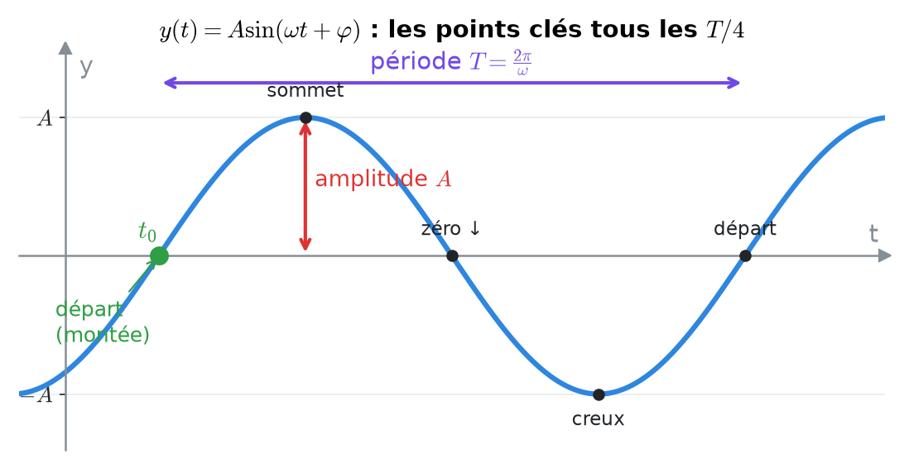
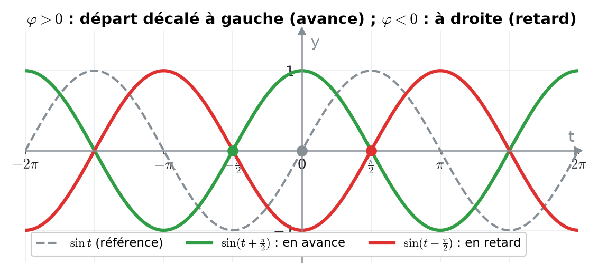
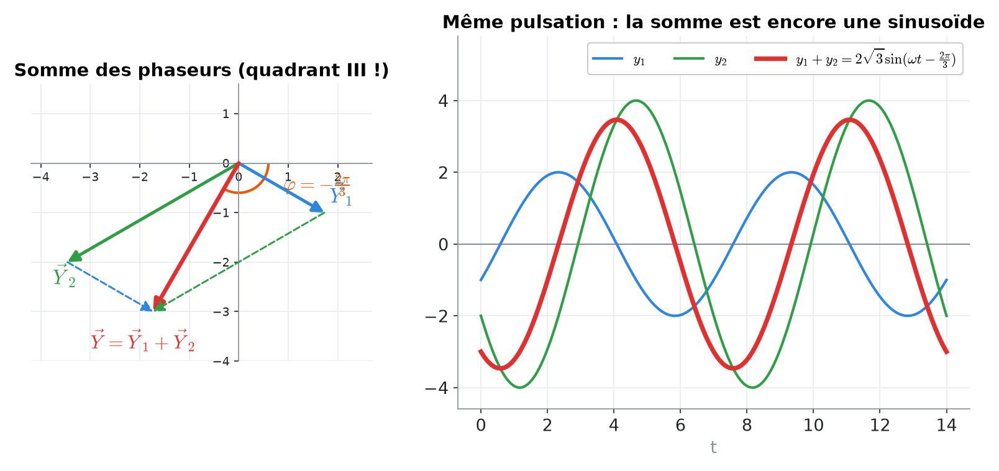
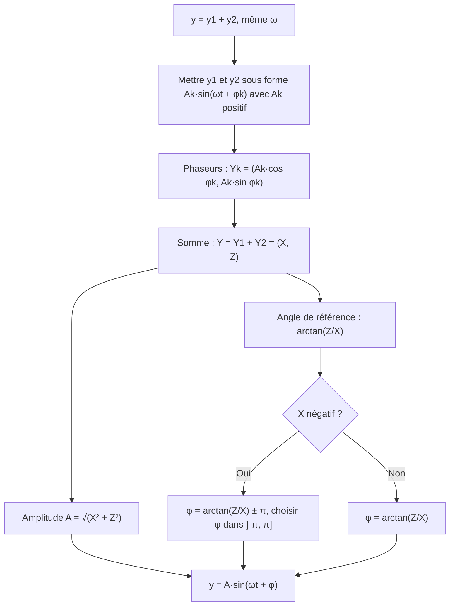
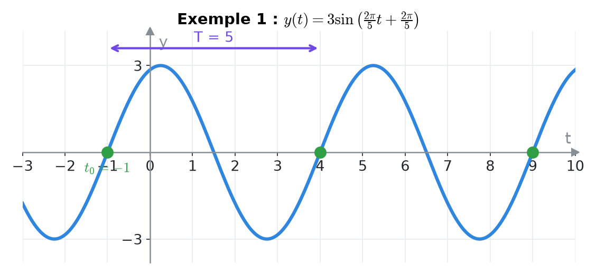
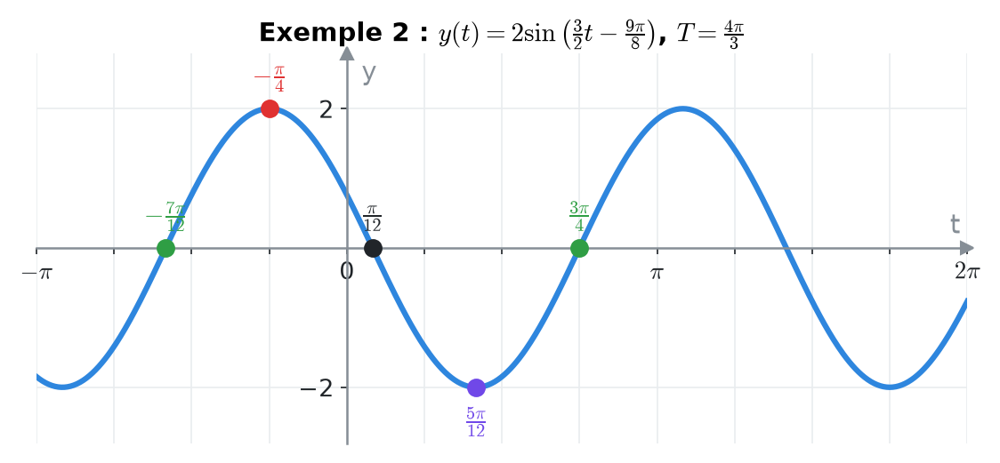
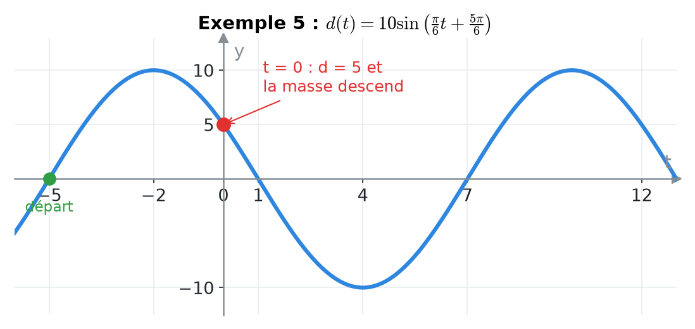

# 6. Oscillations harmoniques et phaseurs


**Objectif** : lire et tracer un signal y(t) = A sin(ωt + φ), déterminer amplitude, période, fréquence et déphasage, et <mark style="color:blue;">additionner deux oscillations</mark> grâce aux phaseurs. C'est « Test 2 Pb 1 » et l'exercice « Oscillations / Superposition » de chaque TE F-1.


---

## 1. Introduction & définitions

### 1.1 Le modèle sinusoïdal

Un <mark style="color:blue;">signal harmonique</mark> (ou sinusoïdal) s'écrit :

$$\Large \boxed{y(t) = {\color{#E03131}A}\sin({\color{#7048E8}\omega} t + {\color{#2F9E44}\varphi})}$$

<figure><figcaption>
Amplitude, période et départ ; les points clés sont espacés d'un quart de période.
</figcaption></figure>

| Symbole | Nom | Unité | Lecture sur le graphe |
| --- | --- | --- | --- |
| <mark style="color:red;">A > 0</mark> | amplitude | unité de y | hauteur d'un sommet par rapport à l'axe |
| <mark style="color:purple;">ω > 0</mark> | vitesse (pulsation) angulaire | rad/s | $$\omega = \frac{2\pi}{T}$$ |
| T | période | s | distance entre deux sommets |
| f | fréquence | Hz | $$f = \frac{1}{T} = \frac{\omega}{2\pi}$$ |
| <mark style="color:green;">φ</mark> | angle de phase (phase initiale) | rad | position du « départ » |

Le <mark style="color:green;">départ</mark> d'un sinus est le point où la courbe <mark style="color:green;">coupe l'axe en montant</mark> (pour sin, c'est l'angle 0).

### 1.2 Déphasage : avance et retard

On peut écrire :

$$\large y(t) = A\sin\left(\omega\left(t + \frac{\varphi}{\omega}\right)\right)$$

Le signal est donc le sinus de base <mark style="color:blue;">décalé dans le temps</mark> de :

$$\Large \Delta t = \frac{\varphi}{\omega}$$

* Si <mark style="color:green;">φ > 0</mark>, le départ a lieu en t = −φ/ω < 0 : le signal est <mark style="color:green;">en avance</mark>.
* Si <mark style="color:red;">φ < 0</mark>, le départ a lieu en t > 0 : le signal est <mark style="color:red;">en retard</mark>.

<figure><figcaption>
Le point marque le départ de chaque signal.
</figcaption></figure>

Comme φ est défini à 2π près, un même signal a une avance <mark style="color:blue;">et</mark> un retard équivalents (différant d'une période T).


**Règle pratique** : lire sur le graphe l'abscisse t₀ d'un départ, puis

$$\varphi = -\omega\, t_0$$


### 1.3 Convertir un cosinus en sinus

Pour mettre un signal sous la forme standard A sin(ωt + φ) avec A > 0 :

$$\Large \cos\theta = \sin\left(\theta + \frac{\pi}{2}\right) \qquad -\sin\theta = \sin(\theta + \pi) \qquad -\cos\theta = \sin\left(\theta - \frac{\pi}{2}\right)$$

### 1.4 Les phaseurs

À chaque oscillation A sin(ωt + φ) on associe un vecteur du plan, le <mark style="color:blue;">phaseur</mark> :

$$\Large \vec{Y} = \begin{pmatrix} A\cos\varphi \\ A\sin\varphi \end{pmatrix}$$

C'est un vecteur de longueur A faisant l'angle φ avec l'axe horizontal.


**Propriété fondamentale** : pour deux signaux de <mark style="color:green;">même pulsation ω</mark>, le phaseur de la somme est <mark style="color:green;">la somme des phaseurs</mark>. On additionne donc des oscillations comme on additionne des vecteurs.


<figure><figcaption>
Exemple 3 : à gauche la somme vectorielle des phaseurs, à droite les signaux correspondants.
</figcaption></figure>

Si y₁ + y₂ = A sin(ωt + φ), les composantes s'additionnent :

$$\large X = A\cos\varphi = A_1\cos\varphi_1 + A_2\cos\varphi_2 \qquad Z = A\sin\varphi = A_1\sin\varphi_1 + A_2\sin\varphi_2$$

$$\Large A = \sqrt{X^2 + Z^2} \qquad \tan\varphi = \frac{Z}{X}$$

Formule directe équivalente (loi des cosinus) :

$$\Large A^2 = A_1^2 + A_2^2 + 2A_1A_2\cos(\varphi_1 - \varphi_2)$$


**Le piège du quadrant** : arctan renvoie un angle de ]−π/2, π/2\[. Si la composante horizontale X est <mark style="color:red;">négative</mark>, le phaseur est au quadrant II ou III et il faut <mark style="color:red;">ajouter ou retrancher π</mark>.


---

## 2. Méthodes de résolution

### Méthode A — Lire les caractéristiques sur un graphe

1. <mark style="color:red;">Amplitude</mark> A : hauteur maximale.
2. <mark style="color:purple;">Période</mark> T : distance entre deux sommets (ou deux départs).
3. ω = 2π/T et f = 1/T.
4. <mark style="color:green;">Départ</mark> : repérer t₀ où la courbe coupe l'axe en montant (le plus proche de 0).
5. φ = −ωt₀ ; avance si t₀ < 0, retard si t₀ > 0.

### Méthode B — Tracer y(t) = A sin(ωt + φ)

1. Calculer la période et le départ :

$$\large T = \frac{2\pi}{\omega} \qquad t_0 = -\frac{\varphi}{\omega}$$

2. Placer le départ, puis les points clés <mark style="color:blue;">tous les quarts de période</mark> : départ (0), sommet (A), zéro descendant (0), creux (−A), nouveau départ.
3. Choisir la grille adaptée : axe gradué en multiples de π si T contient π, en entiers sinon.

### Méthode C — Superposition de deux oscillations

---

## 3. Exemples de calculs détaillés

### Exemple 1 — Lecture de graphe (Test 2 Pb 1, variante A)

*Un signal oscille entre −3 et 3 ; on lit deux départs consécutifs (passages par 0 en montant) en t = −1 et t = 4.*

<figure><figcaption></figcaption></figure>

<mark style="color:orange;">1. Amplitude</mark> : A = 3.

<mark style="color:orange;">2. Période</mark> : distance entre deux départs.

$$\large T = 4 - (-1) = 5 \text{ s} \qquad \omega = \frac{2\pi}{5} \text{ rad/s} \qquad f = 0{,}2 \text{ Hz}$$

<mark style="color:orange;">3. Phase</mark> : départ le plus proche de 0 en t₀ = −1, d'où :

$$\large \varphi = -\omega t_0 = \frac{2\pi}{5}$$

Le signal est <mark style="color:green;">en avance de 1 s</mark> (ou, de manière équivalente, en retard de 4 s avec le départ t₀ = 4 et φ = −8π/5).

$$\Large \color{#2F9E44} y(t) = 3\sin\left(\frac{2\pi}{5}t + \frac{2\pi}{5}\right)$$

<mark style="color:blue;">Contrôle</mark> : le sommet suit le départ d'un quart de période, en t = −1 + 5/4 = 0,25 ; et y(0) = 3 sin(2π/5) ≈ 2,85, juste sous le sommet ✓.

### Exemple 2 — Tracer un signal (Test 2 Pb 1, variante A)

*Tracer :*

$$\Large y(t) = 2\sin\left(\frac{3}{2}t - \frac{9\pi}{8}\right)$$

<mark style="color:orange;">1.</mark> Période (grille en multiples de π) :

$$\large \omega = \frac{3}{2} \text{ rad/s} \quad\Rightarrow\quad T = \frac{2\pi}{3/2} = \frac{4\pi}{3} \text{ s}$$

<mark style="color:orange;">2.</mark> Départ (retard), puis un départ plus proche de 0 :

$$\large t_0 = -\frac{\varphi}{\omega} = \frac{9\pi/8}{3/2} = \frac{3\pi}{4} \qquad\qquad \frac{3\pi}{4} - \frac{4\pi}{3} = -\frac{7\pi}{12}$$

<mark style="color:orange;">3.</mark> Quart de période : T/4 = π/3. À partir de t₀ = −7π/12 :

| Point | départ | sommet | zéro ↓ | creux | départ |
| --- | --- | --- | --- | --- | --- |
| t | −7π/12 | −π/4 | π/12 | 5π/12 | 3π/4 |
| y | 0 | <mark style="color:red;">2</mark> | 0 | <mark style="color:purple;">−2</mark> | 0 |

<figure><figcaption></figcaption></figure>

### Exemple 3 — Superposition (Test 2 Pb 1, variante A)

*Écrire y₁ + y₂ sous la forme A sin(ωt + φ) :*

$$\large y_1(t) = 2\sin\left(\frac{2\pi}{7}t - \frac{\pi}{6}\right) \qquad y_2(t) = 4\sin\left(\frac{2\pi}{7}t - \frac{5\pi}{6}\right)$$

<mark style="color:orange;">Étape 1 — Composantes des phaseurs.</mark>

$$\large X = 2\cos\left(-\frac{\pi}{6}\right) + 4\cos\left(-\frac{5\pi}{6}\right) = \sqrt{3} - 2\sqrt{3} = -\sqrt{3}$$

$$\large Z = 2\sin\left(-\frac{\pi}{6}\right) + 4\sin\left(-\frac{5\pi}{6}\right) = -1 - 2 = -3$$

<mark style="color:orange;">Étape 2 — Amplitude.</mark>

$$\large A = \sqrt{(-\sqrt{3})^2 + (-3)^2} = \sqrt{12} = 2\sqrt{3}$$

<mark style="color:orange;">Étape 3 — Phase.</mark> tan φ = −3 / −√3 = √3, angle de référence π/3. Mais X < 0 et Z < 0 : le phaseur est au <mark style="color:red;">quadrant III</mark>. On retranche π :

$$\large \varphi = \frac{\pi}{3} - \pi = -\frac{2\pi}{3}$$

$$\Large \color{#2F9E44} y_1(t) + y_2(t) = 2\sqrt{3}\sin\left(\frac{2\pi}{7}t - \frac{2\pi}{3}\right)$$

### Exemple 4 — Mélange sinus et cosinus (TE F-1, 2025)

*Exprimer sous la forme A sin(ωt + φ) avec φ ∈ ]−π, π] :*

$$\Large y(t) = \cos\left(\pi t + \frac{\pi}{6}\right) - 2\sin\left(-\pi t + \frac{\pi}{2}\right)$$

<mark style="color:orange;">Étape 1 — Forme standard pour chaque terme.</mark>

$$\large y_1 = \cos\left(\pi t + \frac{\pi}{6}\right) = \sin\left(\pi t + \frac{2\pi}{3}\right) \qquad A_1 = 1,\ \varphi_1 = \frac{2\pi}{3}$$

$$\large y_2 = -2\sin\left(\frac{\pi}{2} - \pi t\right) = -2\cos(\pi t) = 2\sin\left(\pi t - \frac{\pi}{2}\right) \qquad A_2 = 2,\ \varphi_2 = -\frac{\pi}{2}$$

<mark style="color:orange;">Étape 2 — Phaseurs.</mark>

$$\large \vec{Y}_1 = \begin{pmatrix} -\frac{1}{2} \\ \frac{\sqrt{3}}{2} \end{pmatrix} \qquad \vec{Y}_2 = \begin{pmatrix} 0 \\ -2 \end{pmatrix} \qquad \vec{Y} = \begin{pmatrix} -\frac{1}{2} \\ \frac{\sqrt{3}}{2} - 2 \end{pmatrix} \approx \begin{pmatrix} -0{,}5 \\ -1{,}134 \end{pmatrix}$$

<mark style="color:orange;">Étape 3 — Amplitude et phase.</mark>

$$\large A = \sqrt{\frac{1}{4} + \left(\frac{\sqrt{3}}{2} - 2\right)^2} = \sqrt{5 - 2\sqrt{3}} \approx 1{,}24$$

Le phaseur est au <mark style="color:red;">quadrant III</mark> (X < 0, Z < 0) :

$$\large \arctan\left(\frac{-1{,}134}{-0{,}5}\right) \approx 1{,}155 \quad\Rightarrow\quad \varphi \approx 1{,}155 - \pi \approx -1{,}99 \text{ rad}$$

$$\Large \color{#2F9E44} y(t) \approx 1{,}24\sin(\pi t - 1{,}99)$$

### Exemple 5 — Le ressort (TE F-1, 2022)

*d(t) = 10 cos(πt/6 + φ − π/2) (en cm). À t = 0, d = 5 et la masse <mark style="color:blue;">descend</mark>. Trouver φ, puis A, T, f et le déphasage.*

<mark style="color:orange;">Étape 1 — Simplifier</mark> : cos(θ − π/2) = sin θ, donc

$$\large d(t) = 10\sin\left(\frac{\pi}{6}t + \varphi\right)$$

<mark style="color:orange;">Étape 2 — Condition initiale</mark> :

$$\large 10\sin\varphi = 5 \iff \sin\varphi = \frac{1}{2} \iff \varphi = \frac{\pi}{6} \ \text{ ou } \ \varphi = \frac{5\pi}{6}$$

<mark style="color:orange;">Étape 3 — Sens du mouvement.</mark> « Descendre » signifie que d <mark style="color:blue;">diminue</mark>. Juste après t = 0, l'argument augmente à partir de φ : d diminue si le sinus décroît, soit cos φ < 0. Donc <mark style="color:green;">φ = 5π/6</mark>.

<mark style="color:orange;">Étape 4 — Caractéristiques.</mark>

$$\large A = 10 \text{ cm} \qquad T = \frac{2\pi}{\pi/6} = 12 \text{ s} \qquad f = \frac{1}{12} \text{ Hz} \qquad t_0 = -\frac{5\pi/6}{\pi/6} = -5 \text{ s}$$

<figure><figcaption></figcaption></figure>

Le signal est <mark style="color:green;">en avance de 5 s</mark> (départ en t = −5, sommet en t = −2, zéro descendant en t = 1).

---

## 4. Visualisation : les quatre points clés d'une période

---

## 5. Exercices pratiques

### Exercice 1 — Lire un signal

Un signal sinusoïdal a des sommets de hauteur 2 en t = 1 s et t = 7 s (et aucun entre les deux). Déterminer A, T, ω, f, φ (dans ]−π, π]) et l'expression y(t).

Cliquez pour voir l'indice

Le départ se situe un quart de période **avant** un sommet. Ensuite φ = −ωt₀.

Solution détaillée

<mark style="color:orange;">1.</mark> A = 2 ; deux sommets consécutifs sont séparés d'une période : T = 6 s.

<mark style="color:orange;">2.</mark> Pulsation et fréquence :

$$\large \omega = \frac{2\pi}{6} = \frac{\pi}{3} \text{ rad/s} \qquad f = \frac{1}{6} \text{ Hz}$$

<mark style="color:orange;">3.</mark> Départ et phase (avance de 0,5 s) :

$$\large t_0 = 1 - \frac{T}{4} = -0{,}5 \text{ s} \qquad \varphi = -\omega t_0 = \frac{\pi}{6}$$

$$\Large \color{#2F9E44} y(t) = 2\sin\left(\frac{\pi}{3}t + \frac{\pi}{6}\right)$$

Vérification : y(1) = 2 sin(π/3 + π/6) = 2 sin(π/2) = 2 ✓.

### Exercice 2 — Superposition (Test 2 Pb 1, variante C)

Écrire y₁ + y₂ sous la forme A sin(ωt + φ) pour :

$$\large y_1(t) = 2\sin\left(\frac{t}{3} + \frac{2\pi}{3}\right) \qquad y_2(t) = 4\sin\left(\frac{t}{3} - \frac{2\pi}{3}\right)$$

Cliquez pour voir l'indice

Calculez X = 2cos(2π/3) + 4cos(−2π/3) et Z = 2sin(2π/3) + 4sin(−2π/3). Attention au signe de X.

Solution détaillée

<mark style="color:orange;">1.</mark> Composantes :

$$\large X = 2\left(-\frac{1}{2}\right) + 4\left(-\frac{1}{2}\right) = -3 \qquad Z = \sqrt{3} - 2\sqrt{3} = -\sqrt{3}$$

<mark style="color:orange;">2.</mark> Amplitude : A = √(9 + 3) = 2√3.

<mark style="color:orange;">3.</mark> tan φ = √3/3, angle de référence π/6 ; <mark style="color:red;">quadrant III</mark> (X < 0, Z < 0), donc φ = π/6 − π = −5π/6.

$$\Large \color{#2F9E44} y_1 + y_2 = 2\sqrt{3}\sin\left(\frac{t}{3} - \frac{5\pi}{6}\right)$$

### Exercice 3 — Deux ondes (Test 2017)

Soient :

$$\large f(t) = -\sin(4t) \qquad g(t) = 2\cos\left(4t + \frac{\pi}{6}\right)$$

a) Écrire f et g sous la forme A sin(4t + φ). b) Écrire h = f + g sous cette forme.

Cliquez pour voir l'indice

−sin θ = sin(θ + π) et cos θ = sin(θ + π/2). Pour b), la formule A² = A₁² + A₂² + 2A₁A₂cos(φ₁ − φ₂) est rapide.

Solution détaillée

<mark style="color:orange;">a)</mark>

$$\large f(t) = \sin(4t + \pi) \qquad g(t) = 2\sin\left(4t + \frac{\pi}{6} + \frac{\pi}{2}\right) = 2\sin\left(4t + \frac{2\pi}{3}\right)$$

<mark style="color:orange;">b)</mark> Amplitude :

$$\large A^2 = 1 + 4 + 2\cdot 1\cdot 2\cos\left(\pi - \frac{2\pi}{3}\right) = 5 + 4\cos\frac{\pi}{3} = 7 \quad\Rightarrow\quad A = \sqrt{7}$$

Phase par les composantes :

$$\large X = \cos\pi + 2\cos\frac{2\pi}{3} = -2 \qquad Z = \sin\pi + 2\sin\frac{2\pi}{3} = \sqrt{3}$$

On vérifie X² + Z² = 7 ✓. <mark style="color:red;">Quadrant II</mark> (X < 0, Z > 0) :

$$\large \varphi = \arctan\left(\frac{\sqrt{3}}{-2}\right) + \pi \approx -0{,}714 + \pi \approx 2{,}43 \text{ rad}$$

$$\Large \color{#2F9E44} h(t) = \sqrt{7}\sin(4t + 2{,}43)$$

