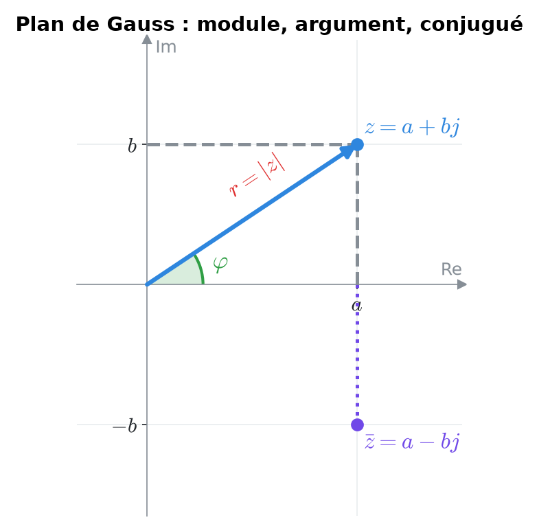
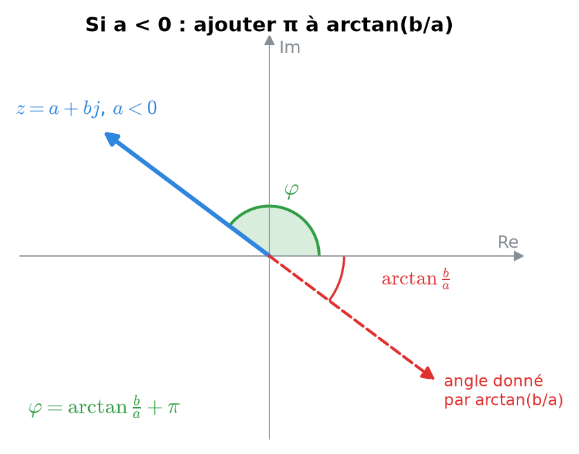
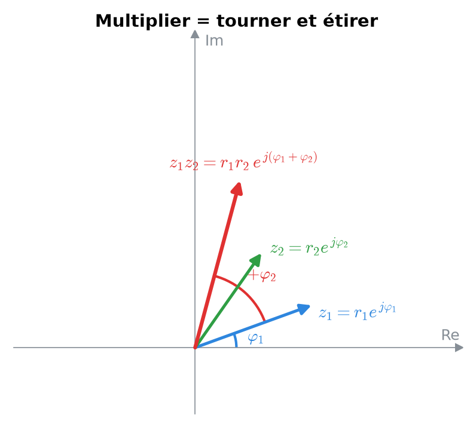
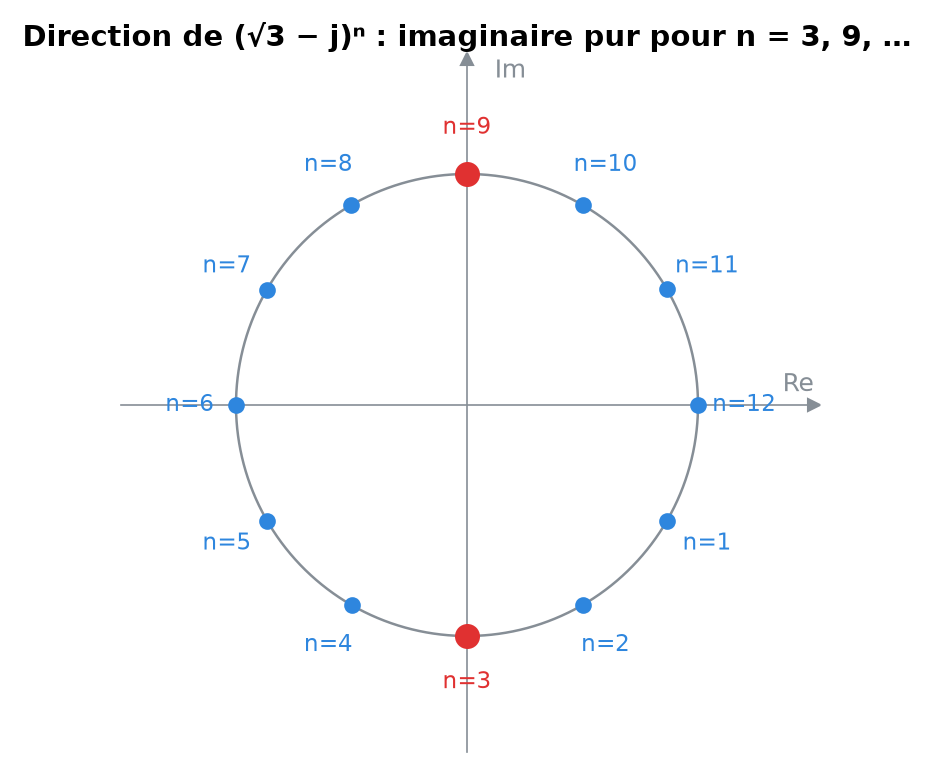
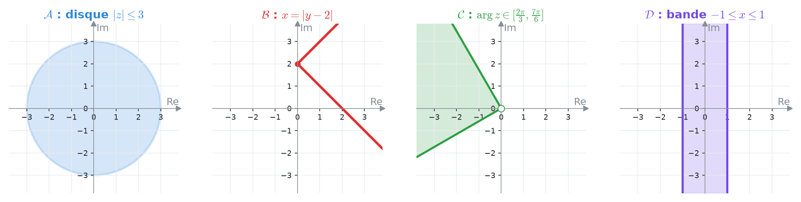
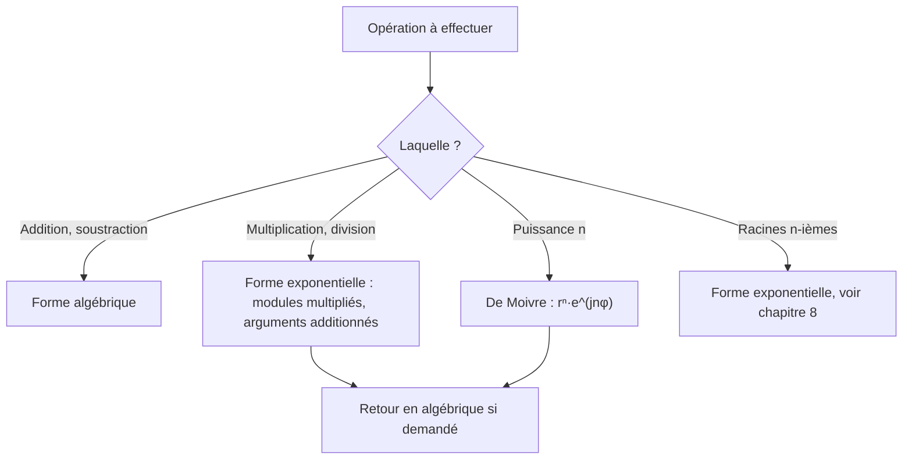
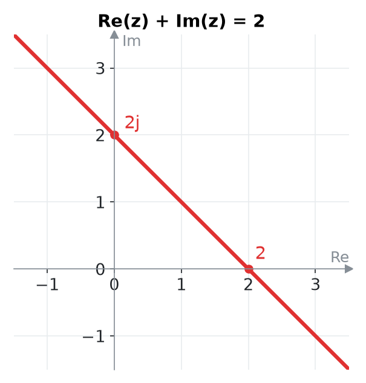

# 7. Nombres complexes : formes et opérations


**Objectif** : passer avec aisance entre les formes <mark style="color:blue;">algébrique</mark>, <mark style="color:green;">trigonométrique</mark> et <mark style="color:purple;">exponentielle</mark>, calculer produits, quotients et puissances, et dessiner des ensembles dans le plan de Gauss. C'est « Test 2 Pb 2 ».



**Notation d'ingénieur** : à la HEIA, l'unité imaginaire se note <mark style="color:blue;">j</mark> (la lettre i est réservée au courant électrique). On a j² = −1.


---

## 1. Introduction & définitions

### 1.1 Forme algébrique

Un nombre complexe s'écrit :

$$\Large z = a + bj \qquad a, b \in \mathbb{R}$$

* a = Re(z) est la <mark style="color:blue;">partie réelle</mark> ;
* b = Im(z) est la <mark style="color:blue;">partie imaginaire</mark> (c'est un <mark style="color:red;">réel</mark> !) ;
* le <mark style="color:purple;">conjugué</mark> est z̄ = a − bj (symétrique par rapport à l'axe réel).

On représente z par le point (a ; b) du <mark style="color:blue;">plan de Gauss</mark> (axe horizontal réel, axe vertical imaginaire).

<figure><figcaption>
Le nombre z, son conjugué, son module r et son argument φ.
</figcaption></figure>

### 1.2 Module et argument

<mark style="color:red;">Module</mark> : la distance à l'origine.

$$\Large \boxed{|z| = r = \sqrt{a^2 + b^2}}$$

<mark style="color:green;">Argument</mark> : l'angle φ = arg(z) entre l'axe réel positif et le vecteur Oz, défini à 2π près.

$$\Large \cos\varphi = \frac{a}{r} \qquad \sin\varphi = \frac{b}{r}$$


tan φ = b/a <mark style="color:red;">ne suffit pas</mark> : si a < 0, le point est à gauche et il faut <mark style="color:red;">ajouter π</mark> à arctan(b/a). Faites toujours un petit croquis du point.


<figure><figcaption>
arctan(b/a) donne la direction opposée quand a < 0.
</figcaption></figure>

### 1.3 Les trois formes

$$\Large z = \underbrace{\color{#2E86DE}a + bj}_{\text{algébrique}} = \underbrace{\color{#2F9E44}r\left(\cos\varphi + j\sin\varphi\right)}_{\text{trigonométrique}} = \underbrace{\color{#7048E8}r\,e^{j\varphi}}_{\text{exponentielle}}$$

Le lien entre les deux dernières est la <mark style="color:blue;">formule d'Euler</mark> :

$$\Large \boxed{e^{j\varphi} = \cos\varphi + j\sin\varphi}$$

### 1.4 Opérations

| Opération | Forme la plus pratique | Règle |
| --- | --- | --- |
| Somme, différence | <mark style="color:blue;">algébrique</mark> | on additionne parties réelles et imaginaires |
| Produit | <mark style="color:purple;">exponentielle</mark> | $$r_1e^{j\varphi_1}\cdot r_2e^{j\varphi_2} = r_1r_2\,e^{j(\varphi_1 + \varphi_2)}$$ |
| Quotient | <mark style="color:purple;">exponentielle</mark>, ou algébrique avec le conjugué | $$\frac{r_1e^{j\varphi_1}}{r_2e^{j\varphi_2}} = \frac{r_1}{r_2}e^{j(\varphi_1 - \varphi_2)}$$ |
| Puissance | <mark style="color:purple;">exponentielle</mark> (De Moivre) | $$\left(re^{j\varphi}\right)^n = r^n e^{jn\varphi}$$ |

<figure><figcaption>
Multiplier : les modules se multiplient, les arguments s'additionnent.
</figcaption></figure>

Propriétés utiles :

$$\large z\bar{z} = |z|^2 \qquad |z_1z_2| = |z_1|\,|z_2| \qquad \arg(z_1z_2) = \arg z_1 + \arg z_2$$

<mark style="color:blue;">Division en forme algébrique</mark> : on multiplie en haut et en bas par le <mark style="color:green;">conjugué du dénominateur</mark>, qui rend le dénominateur réel :

$$\Large \frac{z_1}{z_2} = \frac{z_1\,\bar{z}_2}{z_2\,\bar{z}_2} = \frac{z_1\,\bar{z}_2}{|z_2|^2}$$

### 1.5 Ensembles de points dans le plan de Gauss

En posant z = x + yj :

| Condition | Traduction | Dessin |
| --- | --- | --- |
| $$\lvert z \rvert = R$$ | $$x^2 + y^2 = R^2$$ | cercle de centre O, rayon R |
| $$R_1 \leq \lvert z \rvert \leq R_2$$ | | couronne |
| $$\lvert z - z_0 \rvert \leq R$$ | | disque de centre z₀ |
| $$\arg z \in [\theta_1, \theta_2]$$ | | secteur angulaire (sans l'origine) |
| $$\operatorname{Re}(z) = c$$ | $$x = c$$ | droite verticale |
| $$\operatorname{Im}(z) \geq c$$ | $$y \geq c$$ | demi-plan supérieur |

On choisit le <mark style="color:blue;">repère cartésien</mark> (grille carrée) pour les conditions sur Re et Im, et le <mark style="color:green;">repère polaire</mark> (cercles concentriques) pour les conditions sur |z| et arg z.

---

## 2. Méthodes de résolution

### Méthode A — Conversions entre les formes

### Méthode B — Simplifier une expression « mélangée »

1. Évaluer chaque morceau non standard (par exemple 2j sin(π/3) = √3 j, ou 3e^(jπ/2) = 3j).
2. Tout ramener en forme algébrique pour <mark style="color:blue;">additionner</mark>.
3. Convertir le résultat final dans la forme demandée.

### Méthode C — Conditions sur une puissance (zⁿ réel, imaginaire pur…)

1. Écrire z = r e^(jφ).
2. Appliquer De Moivre :

$$\large z^n = r^n e^{jn\varphi} = r^n\left(\cos(n\varphi) + j\sin(n\varphi)\right)$$

3. <mark style="color:blue;">Réel</mark> ⟺ sin(nφ) = 0 ; <mark style="color:green;">imaginaire pur</mark> ⟺ cos(nφ) = 0.
4. Résoudre l'équation trigonométrique en n et ne garder que les n ∈ ℕ\*.

### Méthode D — Dessiner un ensemble

1. Si la condition porte sur |z| ou arg z : repère polaire, lire directement.
2. Sinon, poser z = x + yj, traduire en équation ou inéquation en x et y, reconnaître la figure (droite, cercle, bande…).

---

## 3. Exemples de calculs détaillés

### Exemple 1 — Les trois formes (Test 2 Pb 2, variante A)

<mark style="color:orange;">a)</mark> z = −√3 + √3 j. Module r = √(3 + 3) = √6. Le point (−√3 ; √3) est au quadrant II, sur la bissectrice : φ = 3π/4.

$$\large z = \sqrt{6}\left(\cos\frac{3\pi}{4} + j\sin\frac{3\pi}{4}\right) = \color{#2F9E44}\sqrt{6}\,e^{j\frac{3\pi}{4}}$$

<mark style="color:orange;">b)</mark>

$$\large z = 2e^{j\frac{\pi}{3}} = 2\left(\cos\frac{\pi}{3} + j\sin\frac{\pi}{3}\right) = 2\left(\frac{1}{2} + \frac{\sqrt{3}}{2}j\right) = \color{#2F9E44}1 + \sqrt{3}\,j$$

<mark style="color:orange;">c)</mark>

$$\large z = 3\left[\cos\frac{5\pi}{6} + j\sin\frac{5\pi}{6}\right] = 3e^{j\frac{5\pi}{6}} = 3\left(-\frac{\sqrt{3}}{2} + \frac{1}{2}j\right) = \color{#2F9E44}-\frac{3\sqrt{3}}{2} + \frac{3}{2}j$$

### Exemple 2 — Expressions piégées (Test 2 Pb 2, variante A)

<mark style="color:orange;">a)</mark> Un imaginaire pur positif a pour argument π/2 :

$$\large 2j\sin\frac{\pi}{3} = 2j\cdot\frac{\sqrt{3}}{2} = \sqrt{3}\,j = \color{#2F9E44}\sqrt{3}\,e^{j\frac{\pi}{2}}$$

<mark style="color:orange;">b)</mark> 4\[cos(−π/6) + j sin(5π/6)] : <mark style="color:red;">attention, les deux angles sont différents</mark>, ce n'est pas une forme trigonométrique ! On calcule chaque valeur :

$$\large 4\left(\frac{\sqrt{3}}{2} + \frac{1}{2}j\right) = 2\sqrt{3} + 2j = \color{#2F9E44}4e^{j\frac{\pi}{6}}$$

<mark style="color:orange;">c)</mark>

$$\large 3e^{j\frac{\pi}{2}} + 2 - j = 3j + 2 - j = 2 + 2j = \color{#2F9E44}2\sqrt{2}\,e^{j\frac{\pi}{4}}$$

### Exemple 3 — Quotients (Test 2 Pb 3)

<mark style="color:blue;">Forme algébrique</mark> : on multiplie par le conjugué 1 + 2j.

$$\large \frac{2 + 3j}{1 - 2j} = \frac{(2 + 3j)(1 + 2j)}{(1 - 2j)(1 + 2j)} = \frac{2 + 4j + 3j + 6j^2}{1 + 4} = \frac{-4 + 7j}{5} = \color{#2F9E44}-\frac{4}{5} + \frac{7}{5}j$$

<mark style="color:purple;">Forme exponentielle</mark> : on convertit chaque nombre, 1 − j = √2 e^(−jπ/4) et √3 + j = 2e^(jπ/6).

$$\large \frac{1 - j}{\sqrt{3} + j} = \frac{\sqrt{2}\,e^{-j\frac{\pi}{4}}}{2e^{j\frac{\pi}{6}}} = \frac{\sqrt{2}}{2}e^{j\left(-\frac{\pi}{4} - \frac{\pi}{6}\right)} = \color{#2F9E44}\frac{\sqrt{2}}{2}e^{-j\frac{5\pi}{12}}$$

### Exemple 4 — Puissance imaginaire pure (Test 2 Pb 3, variante A)

*Pour quels n ∈ ℕ\* le nombre (√3 − j)ⁿ est-il imaginaire pur ?*

<mark style="color:orange;">1.</mark> Forme exponentielle :

$$\large \sqrt{3} - j = 2\left(\frac{\sqrt{3}}{2} - \frac{1}{2}j\right) = 2e^{-j\frac{\pi}{6}}$$

<mark style="color:orange;">2.</mark> De Moivre :

$$\large (\sqrt{3} - j)^n = 2^n\left(\cos\left(-\frac{n\pi}{6}\right) + j\sin\left(-\frac{n\pi}{6}\right)\right)$$

<mark style="color:orange;">3.</mark> Imaginaire pur ⟺ la partie réelle est nulle (le cosinus est pair) :

$$\large \cos\left(\frac{n\pi}{6}\right) = 0 \iff \frac{n\pi}{6} = \frac{\pi}{2} + k\pi \iff n = 3 + 6k$$

<mark style="color:orange;">4.</mark> Avec n ≥ 1 : <mark style="color:green;">n ∈ {3, 9, 15, 21, …}</mark>.

<figure><figcaption>
Chaque puissance tourne de −π/6 : on tombe sur l'axe imaginaire pour n = 3 et n = 9.
</figcaption></figure>

### Exemple 5 — Grande puissance (Test 2017)

*z = −√2/2 + (√6/2) j. Calculer z¹⁰ en forme algébrique, puis le plus petit n ∈ ℕ\* tel que zⁿ soit réel.*

<mark style="color:orange;">1.</mark> Module et argument : point au quadrant II avec tan φ = −√3.

$$\large r = \sqrt{\frac{2}{4} + \frac{6}{4}} = \sqrt{2} \qquad \varphi = \pi - \frac{\pi}{3} = \frac{2\pi}{3}$$

<mark style="color:orange;">2.</mark> De Moivre, avec 20π/3 = 6π + 2π/3 :

$$\large z^{10} = \left(\sqrt{2}\right)^{10}e^{j\frac{20\pi}{3}} = 32\,e^{j\frac{2\pi}{3}} = 32\left(-\frac{1}{2} + \frac{\sqrt{3}}{2}j\right) = \color{#2F9E44}-16 + 16\sqrt{3}\,j$$

<mark style="color:orange;">3.</mark> zⁿ réel :

$$\large \sin\left(\frac{2n\pi}{3}\right) = 0 \iff \frac{2n\pi}{3} = k\pi \iff n = \frac{3k}{2}$$

Le plus petit entier positif : k = 2, <mark style="color:green;">n = 3</mark>.

### Exemple 6 — Ensembles (Test 2 Pb 2, variante A)

<figure><figcaption>
Les quatre ensembles de l'exemple.
</figcaption></figure>

* <mark style="color:blue;">𝒜 = {z : −1 ≤ |z| ≤ 3}</mark> : un module est toujours ≥ 0, la condition −1 ≤ est automatique. C'est le <mark style="color:green;">disque fermé</mark> de centre O et de rayon 3.
* <mark style="color:red;">ℬ = {z : Re(z) = |Im(z) − 2|}</mark> : avec z = x + yj, x = |y − 2|.
  * Si y ≥ 2 : x = y − 2, soit y = x + 2.
  * Si y ≤ 2 : x = 2 − y, soit y = 2 − x.

  C'est un <mark style="color:green;">« V » couché</mark> de sommet (0 ; 2), ouvert vers la droite (x ≥ 0).
* <mark style="color:green;">𝒞 = {z : arg z ∈ \[2π/3, 7π/6]}</mark> : <mark style="color:green;">secteur angulaire</mark> entre les demi-droites d'angles 120° et 210°.
* <mark style="color:purple;">𝒟 = {z : |z|² ≤ Im(z)² + 1}</mark> :

$$\large x^2 + y^2 \leq y^2 + 1 \iff x^2 \leq 1 \iff -1 \leq x \leq 1$$

C'est une <mark style="color:green;">bande verticale</mark>.

---

## 4. Visualisation : quelle forme pour quelle opération ?

---

## 5. Exercices pratiques

### Exercice 1 — Conversions (Test 2 Pb 2, variante B)

Écrire dans les trois formes :

$$\large \text{a) } \sqrt{3} + 3j \qquad \text{b) } \sqrt{2}\,e^{j\frac{3\pi}{4}} \qquad \text{c) } 4\left[\cos\frac{7\pi}{6} + j\sin\frac{7\pi}{6}\right]$$

Cliquez pour voir l'indice

Pour a), r = √(3 + 9) ; factorisez r pour faire apparaître cos φ et sin φ remarquables. Pour b) et c), développez avec les valeurs du cercle trigonométrique.

Solution détaillée

<mark style="color:orange;">a)</mark> r = √12 = 2√3, puis on factorise :

$$\large \sqrt{3} + 3j = 2\sqrt{3}\left(\frac{1}{2} + \frac{\sqrt{3}}{2}j\right) = 2\sqrt{3}\left(\cos\frac{\pi}{3} + j\sin\frac{\pi}{3}\right) = \color{#2F9E44}2\sqrt{3}\,e^{j\frac{\pi}{3}}$$

<mark style="color:orange;">b)</mark>

$$\large \sqrt{2}\left(\cos\frac{3\pi}{4} + j\sin\frac{3\pi}{4}\right) = \sqrt{2}\left(-\frac{\sqrt{2}}{2} + \frac{\sqrt{2}}{2}j\right) = \color{#2F9E44}-1 + j$$

<mark style="color:orange;">c)</mark>

$$\large 4e^{j\frac{7\pi}{6}} = 4\left(-\frac{\sqrt{3}}{2} - \frac{1}{2}j\right) = \color{#2F9E44}-2\sqrt{3} - 2j$$

### Exercice 2 — Calcul (Test 2017)

Calculer en forme algébrique (l'étoile désigne le conjugué) :

$$\Large \frac{(1 - 2j)^*(1 + j)^2}{2 + j}$$

Cliquez pour voir l'indice

(1 − 2j)\* = 1 + 2j et (1 + j)² = 1 + 2j + j² = 2j. Calculez le numérateur, puis multipliez par le conjugué de 2 + j.

Solution détaillée

<mark style="color:orange;">1.</mark> Numérateur :

$$\large (1 + 2j)\cdot 2j = 2j + 4j^2 = -4 + 2j$$

<mark style="color:orange;">2.</mark> Division par 2 + j (conjugué 2 − j, |2 + j|² = 5) :

$$\large \frac{(-4 + 2j)(2 - j)}{5} = \frac{-8 + 4j + 4j - 2j^2}{5} = \frac{-6 + 8j}{5} = \color{#2F9E44}-\frac{6}{5} + \frac{8}{5}j$$

### Exercice 3 — Puissance et ensemble

a) Pour quels n ∈ ℕ\* le nombre (1 − j)ⁿ est-il imaginaire pur ? b) Dessiner {z ∈ ℂ : Re(z) + Im(z) = 2}.

Cliquez pour voir l'indice

a) 1 − j = √2 e^(−jπ/4). b) Posez z = x + yj : c'est une équation de droite.

Solution détaillée

<mark style="color:orange;">a)</mark> De Moivre :

$$\large (1 - j)^n = 2^{n/2}\left(\cos\frac{n\pi}{4} - j\sin\frac{n\pi}{4}\right)$$

$$\large \cos\frac{n\pi}{4} = 0 \iff \frac{n\pi}{4} = \frac{\pi}{2} + k\pi \iff n = 2 + 4k$$

Donc <mark style="color:green;">n ∈ {2, 6, 10, 14, …}</mark>. Contrôle : (1 − j)² = 1 − 2j + j² = −2j ✓.

<mark style="color:orange;">b)</mark> x + y = 2 ⟺ y = 2 − x : la droite passant par 2 (sur l'axe réel) et 2j (sur l'axe imaginaire), de pente −1.

<figure><figcaption></figcaption></figure>

