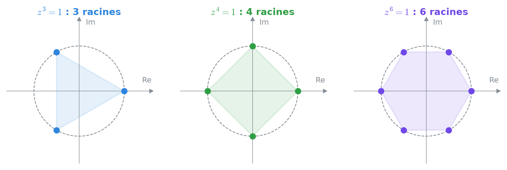
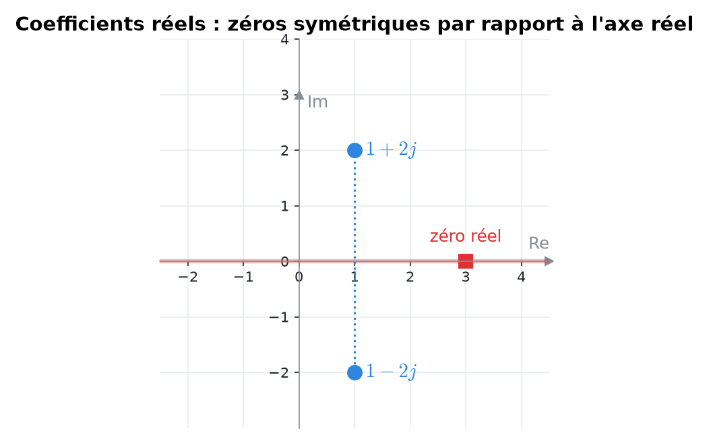
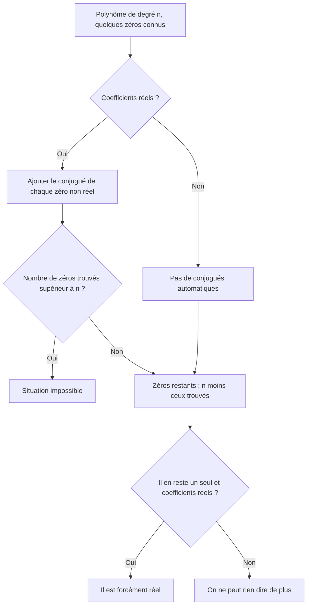
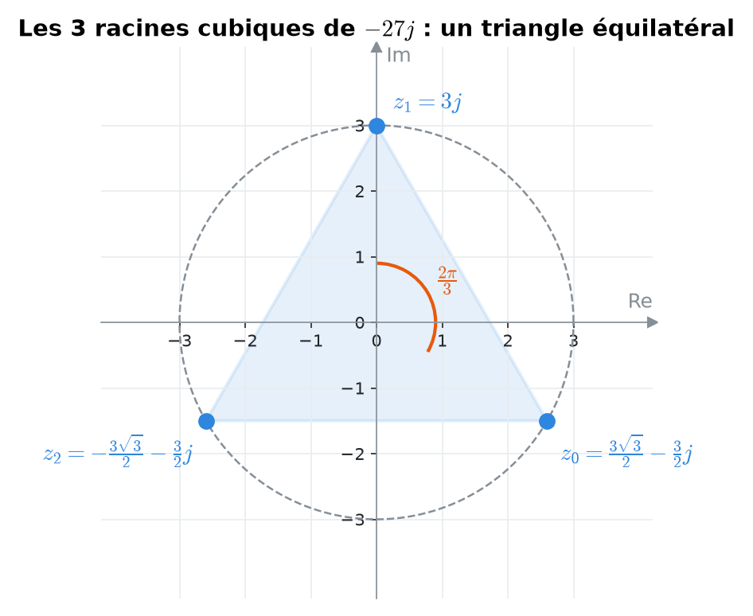
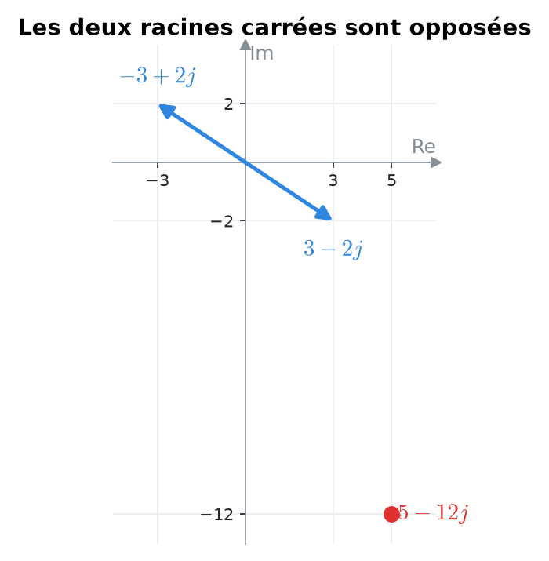
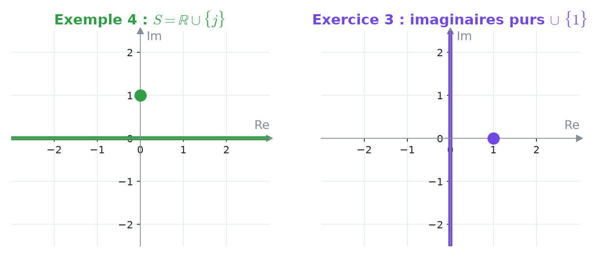
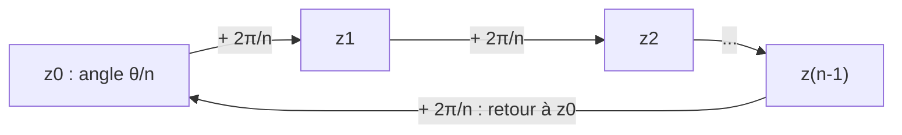
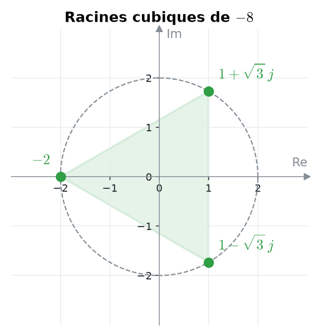

# 8. Racines complexes, équations et polynômes


**Objectif** : calculer toutes les racines n-ièmes d'un complexe, extraire une racine carrée en forme algébrique, résoudre des équations du second degré à coefficients complexes et des équations faisant intervenir |z|, Re, Im, et raisonner sur les zéros d'un polynôme. C'est <mark style="color:blue;">« Test 2 Pb 3 et Pb 4 »</mark>.


---

## 1. Introduction & définitions

### 1.1 Racines n-ièmes

On appelle <mark style="color:blue;">racine n-ième</mark> de c ∈ ℂ tout nombre z tel que zⁿ = c. Contrairement aux réels, tout complexe non nul possède <mark style="color:green;">exactement n racines n-ièmes distinctes</mark>.

Si c = ρ e^(jθ), on cherche z = r e^(jφ) avec rⁿ e^(jnφ) = ρ e^(jθ). Deux complexes sous forme exponentielle sont égaux quand les modules sont égaux et les arguments égaux <mark style="color:red;">à 2kπ près</mark> :

$$\large r^n = \rho \qquad\text{et}\qquad n\varphi = \theta + 2k\pi$$

D'où la formule :

$$\Large \boxed{z_k = \sqrt[n]{\rho}\;e^{j\left(\frac{\theta}{n} + \frac{2k\pi}{n}\right)}, \qquad k = 0, 1, \dots, n - 1}$$


**Interprétation géométrique** : les n racines sont les sommets d'un <mark style="color:green;">polygone régulier à n côtés</mark>, inscrit dans le cercle de rayon ⁿ√ρ. Deux racines consécutives sont séparées de l'angle 2π/n.


<figure><figcaption>
n = 3 : triangle équilatéral ; n = 4 : carré ; n = 6 : hexagone.
</figcaption></figure>

### 1.2 Racine carrée en forme algébrique

Pour √(a + bj), on cherche x + yj avec (x + yj)² = a + bj, c'est-à-dire :

$$\large x^2 - y^2 = a \qquad 2xy = b \qquad x^2 + y^2 = \sqrt{a^2 + b^2} \ \ \text{(égalité des modules)}$$

On obtient :

$$\Large x = \pm\sqrt{\frac{\sqrt{a^2 + b^2} + a}{2}} \qquad y = \pm\sqrt{\frac{\sqrt{a^2 + b^2} - a}{2}}$$


Les signes ne sont pas libres : <mark style="color:red;">xy a le signe de b</mark> (car 2xy = b). On obtient ainsi exactement <mark style="color:green;">deux racines opposées</mark>.


### 1.3 Équation du second degré dans ℂ

Pour az² + bz + c = 0 (a, b, c ∈ ℂ, a ≠ 0), la formule habituelle reste valable :

$$\Large z_{1,2} = \frac{-b \pm \sqrt{\Delta}}{2a}, \qquad \Delta = b^2 - 4ac$$

où ±√Δ désigne les <mark style="color:blue;">deux racines carrées complexes</mark> de Δ. Si Δ est un réel négatif :

$$\large \sqrt{\Delta} = \pm j\sqrt{-\Delta}$$

### 1.4 Zéros des polynômes

<mark style="color:blue;">Théorème fondamental de l'algèbre</mark> : un polynôme de degré n à coefficients complexes a <mark style="color:green;">exactement n zéros</mark> dans ℂ (comptés avec leur multiplicité).

<mark style="color:blue;">Polynôme à coefficients réels</mark> : si z₀ est un zéro, son <mark style="color:green;">conjugué</mark> z̄₀ l'est aussi. Les zéros non réels vont donc par paires conjuguées. Conséquence : un polynôme réel de degré <mark style="color:green;">impair</mark> a toujours au moins un zéro réel.

<figure><figcaption>
Les zéros d'un polynôme réel sont symétriques par rapport à l'axe réel.
</figcaption></figure>

---

## 2. Méthodes de résolution

### Méthode A — Racines n-ièmes

1. Écrire c sous forme exponentielle ρ e^(jθ) (<mark style="color:blue;">croquis !</mark>).
2. Appliquer la formule pour k = 0, …, n − 1.
3. Convertir chaque racine en forme algébrique si demandé.
4. Dessiner le polygone régulier ; choisir le repère <mark style="color:blue;">polaire</mark>.

### Méthode B — Équation où z apparaît avec |z|, z̄, Re, Im

Ces équations ne sont pas « polynomiales en z » : on <mark style="color:red;">ne peut pas</mark> utiliser la formule du discriminant.

1. Poser z = x + yj avec x, y ∈ ℝ.
2. Développer ; séparer <mark style="color:blue;">partie réelle</mark> et <mark style="color:blue;">partie imaginaire</mark>.
3. Un complexe est nul si et seulement si ses deux parties sont nulles : on obtient un <mark style="color:green;">système réel</mark> de deux équations.
4. Factoriser ; attention, les solutions peuvent former un ensemble <mark style="color:red;">infini</mark> (une droite entière, par exemple).

### Méthode C — Raisonner sur les zéros manquants

---

## 3. Exemples de calculs détaillés

### Exemple 1 — Racines cubiques (Test 2 Pb 3, variante A)

*Calculer les racines cubiques de −27j.*

<mark style="color:orange;">Étape 1 — Forme exponentielle.</mark> −27j est sur l'axe imaginaire négatif : ρ = 27, θ = −π/2.

<mark style="color:orange;">Étape 2 — Formule</mark> avec n = 3 : ∛27 = 3 et θ/3 = −π/6.

$$\large z_k = 3\,e^{j\left(-\frac{\pi}{6} + \frac{2k\pi}{3}\right)}, \qquad k = 0, 1, 2$$

<mark style="color:orange;">Étape 3 — Forme algébrique.</mark>

$$\large z_0 = 3e^{-j\frac{\pi}{6}} = \color{#2F9E44}\frac{3\sqrt{3}}{2} - \frac{3}{2}j \qquad z_1 = 3e^{j\frac{\pi}{2}} = \color{#2F9E44}3j \qquad z_2 = 3e^{j\frac{7\pi}{6}} = \color{#2F9E44}-\frac{3\sqrt{3}}{2} - \frac{3}{2}j$$

<figure><figcaption>
Les trois racines forment un triangle équilatéral inscrit dans le cercle de rayon 3.
</figcaption></figure>

<mark style="color:blue;">Contrôle</mark> : z₁³ = (3j)³ = 27j³ = −27j ✓.

### Exemple 2 — Racine carrée algébrique (Test 2 Pb 3, variante A)

*Calculer √(5 − 12j).*

<mark style="color:orange;">1.</mark> a = 5, b = −12, √(a² + b²) = √(25 + 144) = 13.

<mark style="color:orange;">2.</mark> Valeurs absolues :

$$\large x = \pm\sqrt{\frac{13 + 5}{2}} = \pm 3 \qquad y = \pm\sqrt{\frac{13 - 5}{2}} = \pm 2$$

<mark style="color:orange;">3.</mark> b < 0, donc x et y de <mark style="color:red;">signes opposés</mark> :

$$\Large \color{#2F9E44}\sqrt{5 - 12j} = \pm(3 - 2j)$$

<figure><figcaption></figcaption></figure>

<mark style="color:blue;">Contrôle</mark> : (3 − 2j)² = 9 − 12j + 4j² = 5 − 12j ✓.

### Exemple 3 — Équation du second degré (Test 2 Pb 4, variante A)

*Résoudre :*

$$\Large jz^2 - 3(z - 1) = 3jz - 2$$

<mark style="color:orange;">Étape 1 — Forme standard.</mark> On regroupe tout à gauche :

$$\large jz^2 - (3 + 3j)z + 5 = 0 \qquad (a = j,\; b = -(3 + 3j),\; c = 5)$$

<mark style="color:orange;">Étape 2 — Discriminant.</mark>

$$\large \Delta = (3 + 3j)^2 - 4\cdot j\cdot 5 = (9 + 18j + 9j^2) - 20j = -2j$$

<mark style="color:orange;">Étape 3 — Racine carrée de Δ.</mark>

$$\large -2j = 2e^{-j\frac{\pi}{2}} \quad\Rightarrow\quad \sqrt{\Delta} = \pm\sqrt{2}\,e^{-j\frac{\pi}{4}} = \pm(1 - j)$$

<mark style="color:orange;">Étape 4 — Solutions.</mark>

$$\large z_{1,2} = \frac{(3 + 3j) \pm (1 - j)}{2j}$$

Diviser par j revient à multiplier par −j, car 1/j = −j :

$$\large z_1 = \frac{4 + 2j}{2j} = (2 + j)(-j) = \color{#2F9E44}1 - 2j \qquad\qquad z_2 = \frac{2 + 4j}{2j} = (1 + 2j)(-j) = \color{#2F9E44}2 - j$$

### Exemple 4 — Une équation avec |z| et Im (Test 2 Pb 4, variante A)

*Résoudre :*

$$\Large \lvert z \rvert^2 - z^2 = 2\operatorname{Im}(z)$$

<mark style="color:orange;">Étape 1</mark> — Avec z = x + yj :

$$\large \lvert z \rvert^2 = x^2 + y^2 \qquad z^2 = x^2 - y^2 + 2xyj$$

<mark style="color:orange;">Étape 2 — Remplacer</mark> :

$$\large x^2 + y^2 - x^2 + y^2 - 2xyj = 2y \iff 2y^2 - 2y - 2xyj = 0$$

<mark style="color:orange;">Étape 3 — Factoriser</mark> :

$$\large 2y\left[(y - 1) - xj\right] = 0$$

* Soit y = 0 : x est <mark style="color:green;">libre</mark>. Tout réel est solution.
* Soit (y − 1) − xj = 0, c'est-à-dire y = 1 <mark style="color:blue;">et</mark> x = 0 : z = j.

$$\Large \color{#2F9E44} S = \mathbb{R} \cup \{j\}$$

<figure><figcaption>
À gauche, l'exemple 4 ; à droite, l'exercice 3 : les solutions forment une droite plus un point.
</figcaption></figure>

### Exemple 5 — Polynômes réels (Test 2 Pb 4, variante A)

* <mark style="color:blue;">p\_A réel de degré 3, avec z₁ = 1 + 2j</mark> : z̄₁ = 1 − 2j est aussi un zéro ; le troisième zéro existe et est <mark style="color:green;">forcément réel</mark> (s'il était non réel, son conjugué ferait un 4e zéro).
* <mark style="color:blue;">p\_B réel de degré 4, avec z₁ = 1 − 2j et z₂ = 3</mark> : z₃ = 1 + 2j ; le 4e zéro z₄ est <mark style="color:green;">forcément réel</mark>.
* <mark style="color:blue;">p\_C réel de degré 3, avec 1 − 2j et 3 + 4j</mark> : les conjugués 1 + 2j et 3 − 4j sont aussi zéros, soit 4 zéros pour un degré 3 : <mark style="color:red;">impossible</mark>.
* <mark style="color:blue;">p\_D complexe de degré 3, avec 1 − 2j et 3 + 4j</mark> : pas de règle des conjugués. Il existe un 3e zéro z₃ ∈ ℂ, mais on ne peut rien en dire de plus.

---

## 4. Visualisation : les racines forment un polygone

Tous les z\_k sont sur le <mark style="color:green;">même cercle</mark> de rayon ⁿ√ρ.

---

## 5. Exercices pratiques

### Exercice 1 — Racines cubiques (Test 2 Pb 3, variante C)

Calculer toutes les racines cubiques de −8 en forme algébrique et les placer dans le plan de Gauss.

Cliquez pour voir l'indice

−8 = 8e^(jπ). Les racines sont 2e^(j(π/3 + 2kπ/3)) pour k = 0, 1, 2.

Solution détaillée

<mark style="color:orange;">1.</mark> ρ = 8, θ = π ; ∛8 = 2.

<mark style="color:orange;">2.</mark> Les trois racines :

$$\large z_0 = 2e^{j\frac{\pi}{3}} = \color{#2F9E44}1 + \sqrt{3}\,j \qquad z_1 = 2e^{j\pi} = \color{#2F9E44}-2 \qquad z_2 = 2e^{j\frac{5\pi}{3}} = \color{#2F9E44}1 - \sqrt{3}\,j$$

z₁ = −2 est la racine réelle attendue.

<mark style="color:orange;">3.</mark> Dessin : triangle équilatéral inscrit dans le cercle de rayon 2, avec un sommet en −2 et deux sommets conjugués.

<figure><figcaption></figcaption></figure>

### Exercice 2 — Second degré

a) Résoudre z² + 6z + 13 = 0. b) Calculer √(−3 + 4j) en forme algébrique.

Cliquez pour voir l'indice

a) Δ est un réel négatif : √Δ = ±j√(−Δ). b) √(a² + b²) = 5 et b > 0 : x et y de même signe.

Solution détaillée

<mark style="color:orange;">a)</mark> Δ = 36 − 52 = −16, donc √Δ = ±4j :

$$\large z_{1,2} = \frac{-6 \pm 4j}{2} = \color{#2F9E44}-3 \pm 2j$$

Les deux solutions sont conjuguées, ce qui est normal (coefficients réels).

<mark style="color:orange;">b)</mark> Valeurs absolues, puis même signe (b > 0) :

$$\large x = \pm\sqrt{\frac{5 - 3}{2}} = \pm 1 \qquad y = \pm\sqrt{\frac{5 + 3}{2}} = \pm 2 \quad\Rightarrow\quad \color{#2F9E44}\sqrt{-3 + 4j} = \pm(1 + 2j)$$

Contrôle : (1 + 2j)² = 1 + 4j − 4 = −3 + 4j ✓.

### Exercice 3 — (Test 2 Pb 4, variante D)

Résoudre dans ℂ :

$$\Large \lvert z \rvert^2 + z^2 = 2\operatorname{Re}(z)$$

Cliquez pour voir l'indice

Posez z = x + yj, développez, et factorisez par 2x.

Solution détaillée

<mark style="color:orange;">1.</mark> Développement et factorisation :

$$\large x^2 + y^2 + x^2 - y^2 + 2xyj = 2x \iff 2x^2 - 2x + 2xyj = 0 \iff 2x\left[(x - 1) + yj\right] = 0$$

<mark style="color:orange;">2.</mark> Soit x = 0 et y libre : tous les <mark style="color:green;">imaginaires purs</mark> z = yj sont solutions.

<mark style="color:orange;">3.</mark> Soit x − 1 = 0 et y = 0 : z = 1.

$$\Large \color{#2F9E44} S = \{yj : y \in \mathbb{R}\} \cup \{1\}$$

Vérification pour z = 1 : 1 + 1 = 2 = 2 Re(1) ✓. Pour z = 3j : 9 + (−9) = 0 = 2 · 0 ✓.

