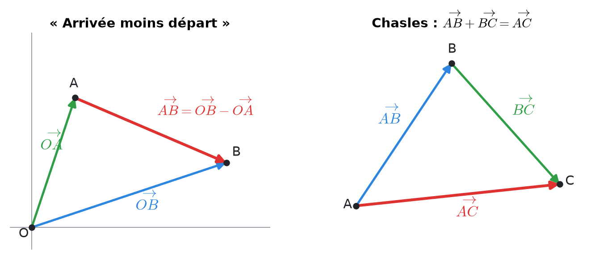
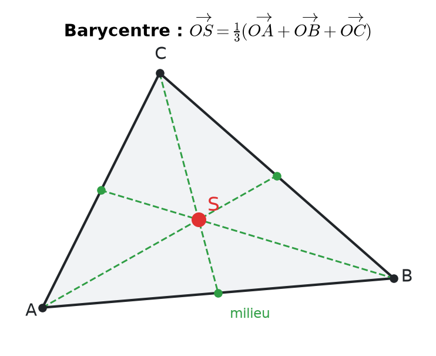
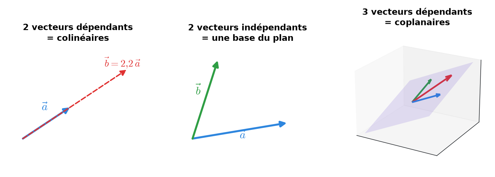
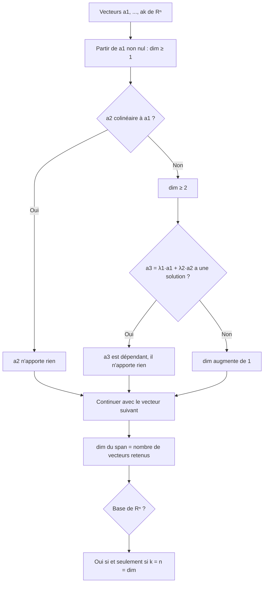
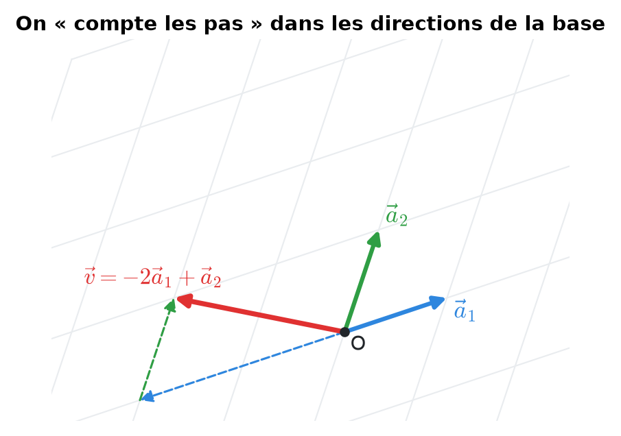
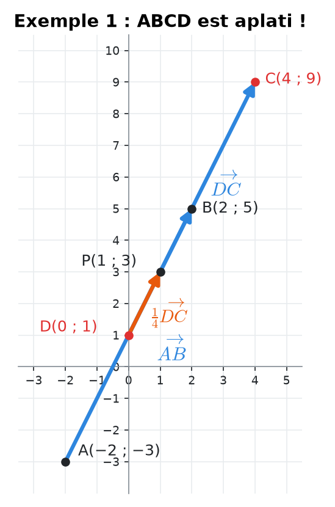
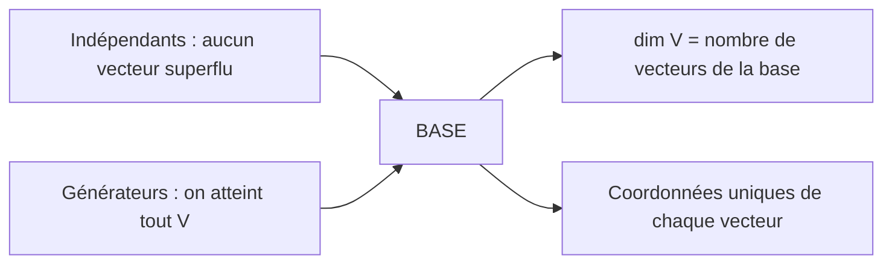

# 9. Vecteurs, combinaisons linéaires et bases


**Objectif** : calculer avec des vecteurs (points, parallélogrammes, barycentres), exprimer un vecteur dans une base, et décider si des vecteurs sont linéairement indépendants, engendrent un espace ou forment une base. C'est <mark style="color:blue;">« Test 3 Pb 1 », « Test 3A »</mark> et l'exercice « Vecteurs » des TE F-2.


---

## 1. Introduction & définitions

### 1.1 Vecteurs et points

Un <mark style="color:blue;">vecteur</mark> est caractérisé par une direction, un sens et une longueur ; il ne dépend pas de son point de départ. Dans un repère, on l'écrit en <mark style="color:blue;">colonne</mark> :

$$\Large \vec{v} = \begin{pmatrix} v_1 \\ v_2 \\ v_3 \end{pmatrix} \in \mathbb{R}^3$$

Un <mark style="color:green;">point</mark> A est repéré par son <mark style="color:green;">vecteur-position</mark> OA. Le vecteur qui va de A à B est :

$$\Large \boxed{\overrightarrow{AB} = \overrightarrow{OB} - \overrightarrow{OA}} \qquad \text{« arrivée moins départ »}$$

<mark style="color:blue;">Relation de Chasles</mark> :

$$\Large \overrightarrow{AB} + \overrightarrow{BC} = \overrightarrow{AC}$$

<figure><figcaption></figcaption></figure>

### 1.2 Configurations classiques

<mark style="color:blue;">Parallélogramme</mark> ABCD (sommets dans l'ordre) :

$$\large \overrightarrow{AB} = \overrightarrow{DC} \qquad \overrightarrow{AD} = \overrightarrow{BC}$$

<mark style="color:blue;">Milieu</mark> M de \[AB] :

$$\large \overrightarrow{OM} = \frac{1}{2}\left(\overrightarrow{OA} + \overrightarrow{OB}\right)$$

<mark style="color:blue;">Point qui partage un segment</mark> : si P ∈ \[DC] avec DP : PC = 1 : 3, alors

$$\large \overrightarrow{DP} = \frac{1}{4}\overrightarrow{DC}$$

<mark style="color:blue;">Barycentre (centre de gravité)</mark> S d'un triangle :

$$\Large \overrightarrow{OS} = \frac{1}{3}\left(\overrightarrow{OA} + \overrightarrow{OB} + \overrightarrow{OC}\right) \qquad \overrightarrow{AS} = \frac{1}{3}\left(\overrightarrow{AB} + \overrightarrow{AC}\right)$$

<figure><figcaption>
Le barycentre S est à l'intersection des médianes (en pointillés verts).
</figcaption></figure>

### 1.3 Combinaison linéaire, span

Une <mark style="color:blue;">combinaison linéaire</mark> de a₁, …, a\_k est un vecteur de la forme :

$$\Large \lambda_1\vec{a}_1 + \dots + \lambda_k\vec{a}_k \qquad \lambda_i \in \mathbb{R}$$

L'ensemble de toutes ces combinaisons est l'<mark style="color:green;">espace engendré</mark> :

$$\large \operatorname{span}(\vec{a}_1, \dots, \vec{a}_k) = \left\{\lambda_1\vec{a}_1 + \dots + \lambda_k\vec{a}_k : \lambda_i \in \mathbb{R}\right\}$$

C'est un <mark style="color:blue;">sous-espace vectoriel</mark> (il contient le vecteur nul et est stable par addition et multiplication par un scalaire).

### 1.4 Indépendance linéaire

Les vecteurs a₁, …, a\_k sont <mark style="color:green;">linéairement indépendants</mark> si la seule combinaison nulle est la combinaison triviale :

$$\Large \lambda_1\vec{a}_1 + \dots + \lambda_k\vec{a}_k = \vec{0} \implies \lambda_1 = \dots = \lambda_k = 0$$

Sinon, ils sont <mark style="color:red;">dépendants</mark> : l'un d'eux au moins s'écrit comme combinaison des autres.

<figure><figcaption></figcaption></figure>

Repères rapides :

* deux vecteurs sont dépendants ⟺ ils sont <mark style="color:red;">colinéaires</mark> (parallèles) ;
* trois vecteurs de ℝ³ sont dépendants ⟺ ils sont <mark style="color:red;">coplanaires</mark> ;
* <mark style="color:red;">plus de n vecteurs</mark> de ℝⁿ sont <mark style="color:red;">toujours</mark> dépendants ;
* toute famille contenant le vecteur nul est dépendante.

### 1.5 Base, coordonnées, dimension

Une <mark style="color:green;">base</mark> d'un espace V est une famille de vecteurs à la fois <mark style="color:blue;">indépendants</mark> et <mark style="color:blue;">générateurs</mark> de V. Tout vecteur v ∈ V s'écrit alors de manière <mark style="color:green;">unique</mark> v = λ₁a₁ + … + λₙaₙ ; les λᵢ sont ses <mark style="color:blue;">coordonnées dans la base</mark> 𝓑 :

$$\Large [\vec{v}]_{\mathcal{B}} = \begin{pmatrix} \lambda_1 \\ \vdots \\ \lambda_n \end{pmatrix}$$

La <mark style="color:blue;">dimension</mark> dim V est le nombre de vecteurs d'une base (toutes les bases en ont le même nombre). Ainsi dim ℝⁿ = n, et dim span(a₁, …, a\_k) est le nombre <mark style="color:green;">maximal</mark> de vecteurs indépendants parmi les aᵢ.


Dans un espace de dimension n, <mark style="color:green;">n vecteurs indépendants forment automatiquement une base</mark> : pas besoin de vérifier qu'ils engendrent l'espace.


---

## 2. Méthodes de résolution

### Méthode A — Trouver des sommets manquants

1. Traduire la figure en <mark style="color:blue;">égalités vectorielles</mark> (parallélogramme : AB = DC, partage : DP = ¼ DC…).
2. Calculer les vecteurs connus par « arrivée moins départ ».
3. Écrire le vecteur-position du point cherché avec Chasles :

$$\large \overrightarrow{OD} = \overrightarrow{OP} + \overrightarrow{PD}$$

### Méthode B — Déterminer dim span(…) et tester une base

### Méthode C — Coordonnées dans une base

1. Poser v = λ₁a₁ + λ₂a₂ + λ₃a₃.
2. Écrire le système <mark style="color:blue;">composante par composante</mark>.
3. Résoudre (par substitution ou élimination) ; la solution est <mark style="color:green;">unique</mark> si c'est une base.

### Méthode D — Lecture graphique dans une base non standard

Sur une figure (quadrillage, carré), on exprime un vecteur en <mark style="color:blue;">« comptant les pas »</mark> dans les directions a₁ et a₂. Par exemple, pour aller de l'origine à l'extrémité de v, il faut reculer de 2 fois a₁ et avancer de 1 fois a₂ :

$$\Large \vec{v} = -2\vec{a}_1 + \vec{a}_2 \qquad [\vec{v}]_{\mathcal{B}} = \begin{pmatrix} -2 \\ 1 \end{pmatrix}$$

<figure><figcaption>
Le quadrillage oblique est construit sur les vecteurs de la base.
</figcaption></figure>

---

## 3. Exemples de calculs détaillés

### Exemple 1 — Parallélogramme (Test 3 Pb 1, variante A)

*ABCD est un parallélogramme avec A(−2 ; −3), B(2 ; 5) ; le point P(1 ; 3) est sur \[DC], plus près de D, et coupe \[DC] dans les proportions ¼ : ¾. Trouver C et D.*

<mark style="color:orange;">Étape 1</mark> — Vecteur connu :

$$\large \overrightarrow{AB} = \begin{pmatrix} 2 - (-2) \\ 5 - (-3) \end{pmatrix} = \begin{pmatrix} 4 \\ 8 \end{pmatrix} = \overrightarrow{DC}$$

<mark style="color:orange;">Étape 2</mark> — Partage :

$$\large \overrightarrow{DP} = \frac{1}{4}\overrightarrow{DC} = \begin{pmatrix} 1 \\ 2 \end{pmatrix}$$

<mark style="color:orange;">Étape 3</mark> — Point D :

$$\large \overrightarrow{OD} = \overrightarrow{OP} - \overrightarrow{DP} = \begin{pmatrix} 1 - 1 \\ 3 - 2 \end{pmatrix} = \begin{pmatrix} 0 \\ 1 \end{pmatrix} \quad\Rightarrow\quad \color{#2F9E44}D(0\,;\,1)$$

<mark style="color:orange;">Étape 4</mark> — Point C :

$$\large \overrightarrow{OC} = \overrightarrow{OD} + \overrightarrow{DC} = \begin{pmatrix} 0 + 4 \\ 1 + 8 \end{pmatrix} \quad\Rightarrow\quad \color{#2F9E44}C(4\,;\,9)$$

<mark style="color:orange;">Étape 5 — Contrôle géométrique.</mark>

$$\large \overrightarrow{AD} = \begin{pmatrix} 2 \\ 4 \end{pmatrix} = \frac{1}{2}\overrightarrow{AB}$$

AD est <mark style="color:red;">colinéaire</mark> à AB : les quatre points sont alignés, le parallélogramme est <mark style="color:red;">dégénéré (aplati)</mark>. Il faut le signaler dans la réponse (voir aussi l'exercice 1).

<figure><figcaption>
Les données de cette variante donnent quatre points alignés.
</figcaption></figure>

### Exemple 2 — Barycentre (Test 3 Pb 1, variante A)

*Dans l'espace, on connaît AB, AC et le barycentre S(3 ; 3 ; 2). Trouver A, B, C.*

$$\large \overrightarrow{AB} = \begin{pmatrix} -1 \\ -5 \\ -1 \end{pmatrix} \qquad \overrightarrow{AC} = \begin{pmatrix} -2 \\ -1 \\ 1 \end{pmatrix}$$

<mark style="color:orange;">Étape 1 — Relation clé.</mark> On part de OS = ⅓(OA + OB + OC) et on fait apparaître AB et AC en écrivant OB = OA + AB et OC = OA + AC :

$$\large \overrightarrow{OS} = \overrightarrow{OA} + \frac{1}{3}\left(\overrightarrow{AB} + \overrightarrow{AC}\right) \quad\Rightarrow\quad \overrightarrow{OA} = \overrightarrow{OS} - \frac{1}{3}\left(\overrightarrow{AB} + \overrightarrow{AC}\right)$$

<mark style="color:orange;">Étape 2 — Numériquement.</mark>

$$\large \overrightarrow{AB} + \overrightarrow{AC} = \begin{pmatrix} -3 \\ -6 \\ 0 \end{pmatrix} \qquad \frac{1}{3}\left(\overrightarrow{AB} + \overrightarrow{AC}\right) = \begin{pmatrix} -1 \\ -2 \\ 0 \end{pmatrix}$$

$$\large \overrightarrow{OA} = \begin{pmatrix} 3 + 1 \\ 3 + 2 \\ 2 - 0 \end{pmatrix} = \begin{pmatrix} 4 \\ 5 \\ 2 \end{pmatrix}$$

$$\Large \color{#2F9E44} A(4\,;\,5\,;\,2) \qquad B = A + \overrightarrow{AB} = (3\,;\,0\,;\,1) \qquad C = A + \overrightarrow{AC} = (2\,;\,4\,;\,3)$$

<mark style="color:blue;">Contrôle</mark> : ⅓(4 + 3 + 2 ; 5 + 0 + 4 ; 2 + 1 + 3) = (3 ; 3 ; 2) = S ✓.

### Exemple 3 — Dimension d'un span (Test 3A)

*Dimension de V = span(a₁, a₂, a₃, a₄) ?*

$$\large \vec{a}_1 = \begin{pmatrix} 1 \\ 2 \\ 0 \\ 1 \end{pmatrix} \quad \vec{a}_2 = \begin{pmatrix} -1 \\ 1 \\ 1 \\ -1 \end{pmatrix} \quad \vec{a}_3 = \begin{pmatrix} -1 \\ 4 \\ 2 \\ -1 \end{pmatrix} \quad \vec{a}_4 = \begin{pmatrix} 1 \\ 0 \\ -1 \\ 1 \end{pmatrix}$$

<mark style="color:orange;">Étape 1</mark> — a₁ et a₂ ne sont pas colinéaires (la 3e composante de a₁ est nulle mais pas celle de a₂) : dim span(a₁, a₂) = 2.

<mark style="color:orange;">Étape 2</mark> — a₃ = λ₁a₁ + λ₂a₂ ? La 3e composante donne λ₂ = 2 ; la 1re : λ₁ − 2 = −1, donc λ₁ = 1. Vérification sur les autres : 2 + 2 = 4 ✓ et 1 − 2 = −1 ✓. Donc :

$$\large \vec{a}_3 = \vec{a}_1 + 2\vec{a}_2 \qquad \text{: il n'augmente pas la dimension}$$

<mark style="color:orange;">Étape 3</mark> — a₄ = λ₁a₁ + λ₂a₂ ? 3e composante : λ₂ = −1 ; 2e : 2λ₁ − 1 = 0, donc λ₁ = ½ ; 1re : ½ + 1 = 3/2 ≠ 1. <mark style="color:red;">Contradiction</mark> : a₄ est indépendant de a₁, a₂.

<mark style="color:orange;">Conclusions</mark> :

* <mark style="color:green;">dim V = 3</mark>.
* a₁, …, a₄ ne sont <mark style="color:red;">pas</mark> indépendants (sinon dim V = 4).
* Ils ne forment <mark style="color:red;">pas</mark> une base de ℝ⁴ (dim V = 3 ≠ 4).
* a₁, a₂, a₃ ne forment pas une base de V : ils sont dépendants et n'engendrent qu'un espace de dimension 2.

### Exemple 4 — Coordonnées dans une base de ℝ³ (Test 3A, 2015)

*Coordonnées de v dans 𝓑 = (a₁, a₂, a₃) ?*

$$\large \vec{a}_1 = \begin{pmatrix} 1 \\ -1 \\ 1 \end{pmatrix} \quad \vec{a}_2 = \begin{pmatrix} 1 \\ 1 \\ 0 \end{pmatrix} \quad \vec{a}_3 = \begin{pmatrix} 0 \\ 1 \\ 2 \end{pmatrix} \quad \vec{v} = \begin{pmatrix} 1 \\ 0 \\ 0 \end{pmatrix}$$

On résout λ₁a₁ + λ₂a₂ + λ₃a₃ = v :

$$\large \begin{cases} \lambda_1 + \lambda_2 = 1 \\ -\lambda_1 + \lambda_2 + \lambda_3 = 0 \\ \lambda_1 + 2\lambda_3 = 0 \end{cases}$$

De la 1re : λ₂ = 1 − λ₁ ; de la 3e : λ₃ = −λ₁/2. Dans la 2e :

$$\large -\lambda_1 + 1 - \lambda_1 - \frac{\lambda_1}{2} = 0 \iff \frac{5}{2}\lambda_1 = 1 \iff \lambda_1 = \frac{2}{5} \qquad \lambda_2 = \frac{3}{5} \qquad \lambda_3 = -\frac{1}{5}$$

$$\Large \color{#2F9E44} [\vec{v}]_{\mathcal{B}} = \frac{1}{5}\begin{pmatrix} 2 \\ 3 \\ -1 \end{pmatrix}$$

La solution est <mark style="color:green;">unique</mark>, ce qui confirme au passage que 𝓑 est une base.

---

## 4. Visualisation : les trois notions clés

---

## 5. Exercices pratiques

### Exercice 1 — Parallélogramme (Test 3 Pb 1, variante C)

ABCD est un parallélogramme avec A(−1 ; −3), B(3 ; 5), et P(4 ; 8) est sur \[DC], plus près de C, dans les proportions ¾ : ¼. Trouver C et D.

Cliquez pour voir l'indice

« Plus près de C » avec les proportions ¾ : ¼ signifie DP = ¾ DC.

Solution détaillée

<mark style="color:orange;">1.</mark> Vecteur connu, puis partage :

$$\large \overrightarrow{AB} = \begin{pmatrix} 4 \\ 8 \end{pmatrix} = \overrightarrow{DC} \qquad \overrightarrow{DP} = \frac{3}{4}\begin{pmatrix} 4 \\ 8 \end{pmatrix} = \begin{pmatrix} 3 \\ 6 \end{pmatrix}$$

<mark style="color:orange;">2.</mark> Points D et C :

$$\large \overrightarrow{OD} = \overrightarrow{OP} - \overrightarrow{DP} = \begin{pmatrix} 1 \\ 2 \end{pmatrix} \qquad \overrightarrow{OC} = \overrightarrow{OD} + \overrightarrow{DC} = \begin{pmatrix} 5 \\ 10 \end{pmatrix}$$

$$\Large \color{#2F9E44} D(1\,;\,2) \qquad C(5\,;\,10)$$

<mark style="color:orange;">3.</mark> Contrôle : AD = (2 ; 5) = BC ✓, et AD n'est pas colinéaire à AB : le parallélogramme n'est pas aplati.


Pensez toujours à ce contrôle géométrique : certaines variantes d'examen (comme l'exemple 1) donnent un parallélogramme <mark style="color:red;">dégénéré</mark>. Dans ce cas, il faut le signaler dans la réponse.


### Exercice 2 — Barycentre

Le triangle ABC a pour barycentre S(−2 ; 1 ; −1), avec :

$$\large \overrightarrow{AB} = \begin{pmatrix} 6 \\ 3 \\ -4 \end{pmatrix} \qquad \overrightarrow{AC} = \begin{pmatrix} 0 \\ 6 \\ -2 \end{pmatrix}$$

Trouver A, B et C.

Cliquez pour voir l'indice

OA = OS − ⅓(AB + AC).

Solution détaillée

<mark style="color:orange;">1.</mark> Somme et tiers :

$$\large \overrightarrow{AB} + \overrightarrow{AC} = \begin{pmatrix} 6 \\ 9 \\ -6 \end{pmatrix} \qquad \frac{1}{3}\left(\overrightarrow{AB} + \overrightarrow{AC}\right) = \begin{pmatrix} 2 \\ 3 \\ -2 \end{pmatrix}$$

<mark style="color:orange;">2.</mark> Point A :

$$\large \overrightarrow{OA} = \begin{pmatrix} -2 - 2 \\ 1 - 3 \\ -1 + 2 \end{pmatrix} = \begin{pmatrix} -4 \\ -2 \\ 1 \end{pmatrix}$$

$$\Large \color{#2F9E44} A(-4\,;\,-2\,;\,1) \qquad B(2\,;\,1\,;\,-3) \qquad C(-4\,;\,4\,;\,-1)$$

<mark style="color:orange;">3.</mark> Contrôle : ⅓(−4 + 2 − 4 ; −2 + 1 + 4 ; 1 − 3 − 1) = (−2 ; 1 ; −1) ✓.

### Exercice 3 — Vrai ou faux (Test 3A)

* a) Trois vecteurs a, b, c tels que a + b = c sont forcément linéairement dépendants.
* b) Si 0·a + 0·b + 0·c = 0, alors a, b, c sont indépendants.
* c) Trois vecteurs de ℝ² sont forcément dépendants.
* d) Si a₁, a₂ ∈ ℝ³ et V = span(a₁, a₂), alors dim V ≤ 2.
* e) ℝ² est un sous-espace vectoriel de ℝ³.

Cliquez pour voir l'indice

Revenez à la **définition** de l'indépendance : c'est une **implication** qui porte sur **toutes** les combinaisons nulles. Pour e), un élément de ℝ² a-t-il 3 composantes ?

Solution détaillée

<mark style="color:orange;">a)</mark> <mark style="color:green;">Vrai</mark> : a + b − c = 0 est une combinaison nulle non triviale (coefficients 1, 1, −1).

<mark style="color:orange;">b)</mark> <mark style="color:red;">Faux</mark> : la combinaison triviale est <mark style="color:red;">toujours</mark> nulle, pour n'importe quels vecteurs. Elle ne prouve rien.

<mark style="color:orange;">c)</mark> <mark style="color:green;">Vrai</mark> : plus de n = 2 vecteurs dans ℝ² sont toujours dépendants.

<mark style="color:orange;">d)</mark> <mark style="color:green;">Vrai</mark> : deux vecteurs engendrent un espace de dimension 0, 1 ou 2.

<mark style="color:orange;">e)</mark> <mark style="color:red;">Faux</mark> : les vecteurs de ℝ² ont 2 composantes, ceux de ℝ³ en ont 3 ; ℝ² n'est pas <mark style="color:blue;">inclus</mark> dans ℝ³ (le plan {z = 0} de ℝ³ lui « ressemble », mais c'est un autre ensemble).

