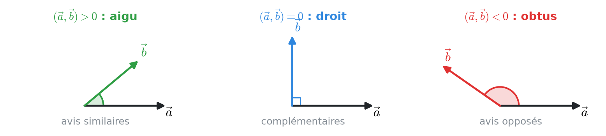
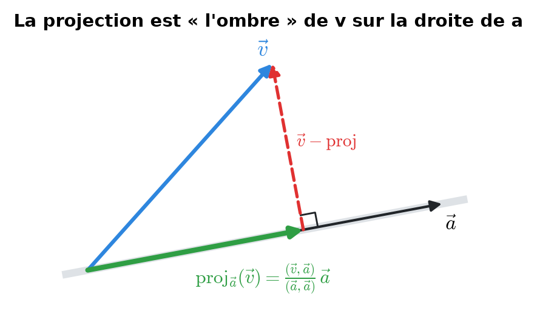
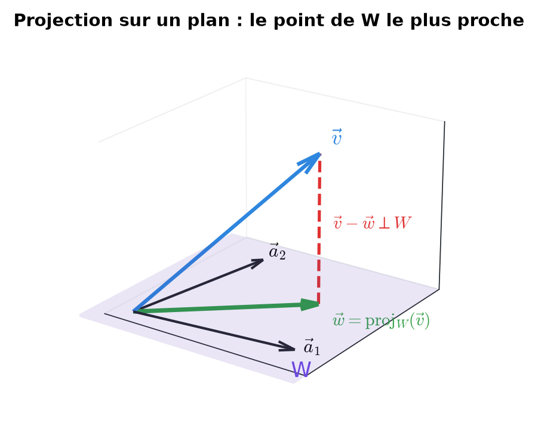
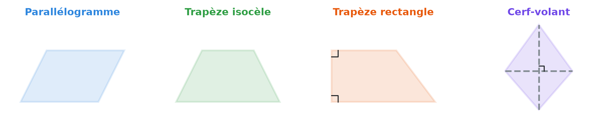
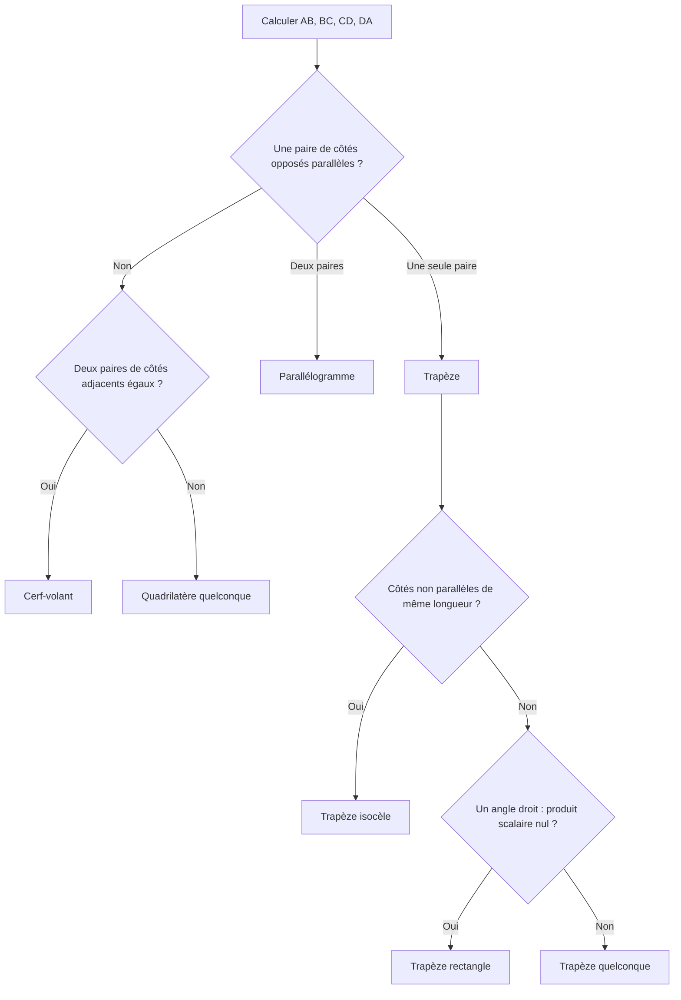
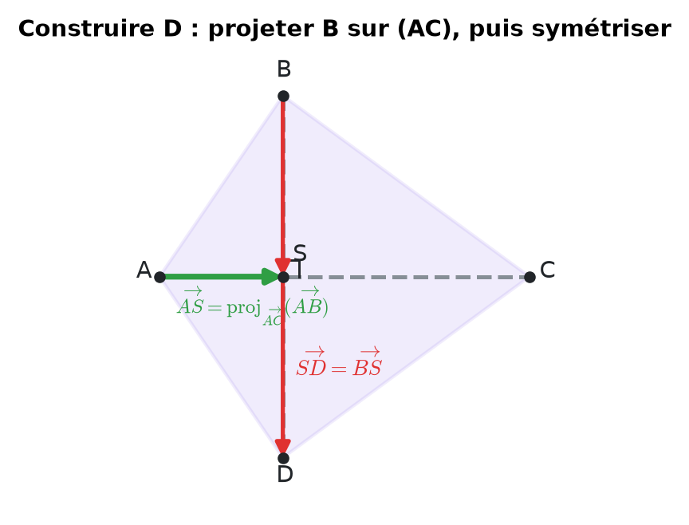
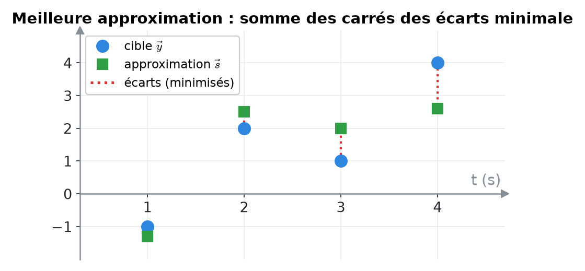
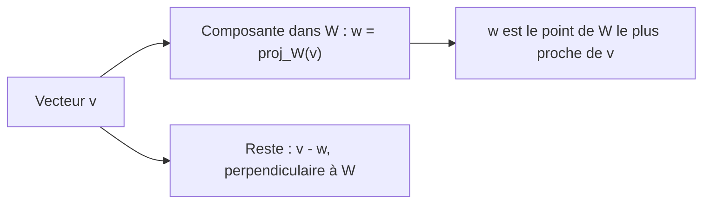

# 10. Produit scalaire, norme, angles et projection orthogonale


**Objectif** : utiliser le produit scalaire euclidien pour calculer longueurs et angles, reconnaître un quadrilatère, projeter un vecteur sur une droite ou sur un sous-espace, et trouver la <mark style="color:blue;">meilleure approximation</mark> d'un signal. C'est « Test 3 Pb 2 et Pb 3 ».


---

## 1. Introduction & définitions

### 1.1 Produit scalaire euclidien

Pour a, b ∈ ℝⁿ, le <mark style="color:blue;">produit scalaire</mark> (noté (a, b)₂ ou a · b) est un <mark style="color:green;">nombre</mark> :

$$\Large \boxed{(\vec{a}, \vec{b})_2 = a_1b_1 + a_2b_2 + \dots + a_nb_n}$$

Propriétés :

$$\large (\vec{a}, \vec{b}) = (\vec{b}, \vec{a}) \qquad (\alpha\vec{a} + \beta\vec{b}, \vec{c}) = \alpha(\vec{a}, \vec{c}) + \beta(\vec{b}, \vec{c}) \qquad (\vec{a}, \vec{a}) \geq 0$$

(symétrique, linéaire, positif).

### 1.2 Norme et distance

La <mark style="color:blue;">norme euclidienne</mark> (longueur) :

$$\Large \lVert\vec{a}\rVert_2 = \sqrt{(\vec{a}, \vec{a})} = \sqrt{a_1^2 + \dots + a_n^2}$$

* La <mark style="color:blue;">distance</mark> entre deux points est d(A, B) = ‖AB‖.
* Un vecteur <mark style="color:blue;">unitaire</mark> a une norme égale à 1 ; on normalise a en calculant a / ‖a‖.

### 1.3 Angle entre deux vecteurs

Le produit scalaire contient l'information d'angle :

$$\Large (\vec{a}, \vec{b}) = \lVert\vec{a}\rVert\,\lVert\vec{b}\rVert\cos\gamma \quad\Rightarrow\quad \gamma = \arccos\left(\frac{(\vec{a}, \vec{b})}{\lVert\vec{a}\rVert\,\lVert\vec{b}\rVert}\right) \in [0, \pi]$$

<figure><figcaption>
Le signe du produit scalaire donne la nature de l'angle.
</figcaption></figure>

| Signe de (a, b) | Angle | Interprétation (« avis ») |
| --- | --- | --- |
| <mark style="color:green;">> 0</mark> | aigu | orientations <mark style="color:green;">similaires</mark> |
| <mark style="color:blue;">= 0</mark> | droit : a ⊥ b | <mark style="color:blue;">indépendants</mark>, complémentaires |
| <mark style="color:red;">< 0</mark> | obtus | orientations <mark style="color:red;">opposées</mark> |

Le quotient cos γ s'appelle aussi <mark style="color:blue;">similarité cosinus</mark> : il est utilisé pour comparer des profils (réponses à un questionnaire, documents…).

### 1.4 Projection orthogonale sur un vecteur

La <mark style="color:green;">projection orthogonale</mark> de v sur la direction de a est l'« ombre » de v sur la droite portée par a :

$$\Large \boxed{\operatorname{proj}_{\vec{a}}(\vec{v}) = \frac{(\vec{v}, \vec{a})}{(\vec{a}, \vec{a})}\,\vec{a}}$$

Le reste v − proj(v) est <mark style="color:red;">perpendiculaire</mark> à a.

<figure><figcaption></figcaption></figure>

### 1.5 Projection sur un sous-espace W = span(a₁, a₂)

La projection w = proj\_W(v) = α₁a₁ + α₂a₂ est le vecteur de W <mark style="color:green;">le plus proche</mark> de v : il minimise ‖v − w‖₂. Elle est caractérisée par :


<mark style="color:green;">v − w est orthogonal à a₁ et à a₂.</mark>


<figure><figcaption></figcaption></figure>

Cela donne les <mark style="color:blue;">équations normales</mark> :

$$\Large \begin{cases} (\vec{a}_1, \vec{a}_1)\,\alpha_1 + (\vec{a}_1, \vec{a}_2)\,\alpha_2 = (\vec{a}_1, \vec{v}) \\ (\vec{a}_2, \vec{a}_1)\,\alpha_1 + (\vec{a}_2, \vec{a}_2)\,\alpha_2 = (\vec{a}_2, \vec{v}) \end{cases}$$


Si a₁ ⊥ a₂, le système se découple et l'on retrouve la somme des projections :

$$\alpha_k = \frac{(\vec{a}_k, \vec{v})}{(\vec{a}_k, \vec{a}_k)}$$

<mark style="color:red;">Mais</mark> cette formule est <mark style="color:red;">fausse</mark> si a₁ et a₂ ne sont pas orthogonaux (question « Vrai/Faux » classique).


Propriétés à connaître (Test 3 Pb 3) :

* w ∈ W ;
* (v − w) ⊥ a₁ et (v − w) ⊥ a₂ ;
* si w = 0, alors v ⊥ W ;
* si w = v, alors v ∈ W ;
* ‖v − w‖ ≤ ‖v − z‖ pour tout z <mark style="color:red;">de W</mark> (pas pour tout z de l'espace).

---

## 2. Méthodes de résolution

### Méthode A — Identifier un quadrilatère ABCD

<figure><figcaption></figcaption></figure>

* Deux côtés sont <mark style="color:blue;">parallèles</mark> si leurs vecteurs sont <mark style="color:blue;">proportionnels</mark> (par exemple BC = −½ DA).
* Un angle est <mark style="color:green;">droit</mark> si le produit scalaire des deux côtés adjacents est nul.

### Méthode B — Trouver des coefficients vérifiant une condition d'angle et de longueur

1. Écrire la condition d'angle avec le produit scalaire ; la linéarité donne une équation <mark style="color:blue;">linéaire</mark> en α, β :

$$\large (\vec{v}, \vec{c}) = \lVert\vec{v}\rVert\lVert\vec{c}\rVert\cos\gamma$$

2. Écrire la condition de longueur ‖v‖² = L² : équation <mark style="color:blue;">du second degré</mark>.
3. Substituer et résoudre.

### Méthode C — Meilleure approximation (moindres carrés)

1. Identifier y (cible) et les vecteurs s₁, s₂ de W.
2. Précalculer les produits scalaires (sᵢ, sⱼ) et (sᵢ, y).
3. Résoudre les <mark style="color:blue;">équations normales</mark> en α₁, α₂.
4. Écrire s = α₁s₁ + α₂s₂.

---

## 3. Exemples de calculs détaillés

### Exemple 1 — Quel quadrilatère ? (Test 3 Pb 2, variante A)

*A(3 ; 2 ; −1), B(4 ; 0 ; 1), C(2 ; −2 ; 3), D(−1 ; −2 ; 3).*

<mark style="color:orange;">Étape 1 — Côtés</mark> (« arrivée moins départ ») :

$$\large \overrightarrow{AB} = \begin{pmatrix} 1 \\ -2 \\ 2 \end{pmatrix} \quad \overrightarrow{BC} = \begin{pmatrix} -2 \\ -2 \\ 2 \end{pmatrix} \quad \overrightarrow{CD} = \begin{pmatrix} -3 \\ 0 \\ 0 \end{pmatrix} \quad \overrightarrow{DA} = \begin{pmatrix} 4 \\ 4 \\ -4 \end{pmatrix}$$

<mark style="color:orange;">Étape 2 — Parallélisme.</mark> BC = −½ DA : les côtés \[BC] et \[DA] sont parallèles. AB et CD ne sont pas proportionnels. C'est un <mark style="color:blue;">trapèze</mark>.

<mark style="color:orange;">Étape 3 — Longueurs des côtés non parallèles.</mark>

$$\large \lVert\overrightarrow{AB}\rVert = \sqrt{1 + 4 + 4} = 3 \qquad \lVert\overrightarrow{CD}\rVert = 3$$

Les deux côtés obliques ont la même longueur : c'est un <mark style="color:green;">trapèze isocèle</mark>.

### Exemple 2 — Coefficients imposés (Test 3 Pb 2, variante A)

*Trouver α, β tels que v fasse un angle de 30° avec c et ait une longueur √6 :*

$$\large \vec{v} = \alpha\underbrace{\begin{pmatrix} 2 \\ -3 \\ 1 \end{pmatrix}}_{\vec a} + \beta\underbrace{\begin{pmatrix} 2 \\ 0 \\ 1 \end{pmatrix}}_{\vec b} \qquad \vec{c} = \begin{pmatrix} 1 \\ 0 \\ 1 \end{pmatrix}$$

<mark style="color:orange;">Étape 1 — Condition d'angle.</mark> (a, c) = 3 et (b, c) = 3. Par linéarité :

$$\large 3\alpha + 3\beta = \lVert\vec{v}\rVert\,\lVert\vec{c}\rVert\cos 30° = \sqrt{6}\cdot\sqrt{2}\cdot\frac{\sqrt{3}}{2} = 3 \quad\Rightarrow\quad \alpha = 1 - \beta$$

<mark style="color:orange;">Étape 2 — Condition de longueur.</mark> Avec α = 1 − β, on a v = a + β(b − a) et b − a = (0 ; 3 ; 0) :

$$\large \lVert\vec{v}\rVert^2 = (\vec{a}, \vec{a}) + 2\beta(\vec{a}, \vec{b} - \vec{a}) + \beta^2(\vec{b} - \vec{a}, \vec{b} - \vec{a}) = 14 - 18\beta + 9\beta^2$$

<mark style="color:orange;">Étape 3 — Résoudre</mark> 14 − 18β + 9β² = 6, soit 9β² − 18β + 8 = 0 :

$$\large \beta = \frac{18 \pm 6}{18} \quad\Rightarrow\quad \color{#2F9E44}\beta = \tfrac{4}{3},\ \alpha = -\tfrac{1}{3} \quad\text{ou}\quad \beta = \tfrac{2}{3},\ \alpha = \tfrac{1}{3}$$

### Exemple 3 — Avis de répondants (Test 3 Pb 2, variante A)

*Réponses (de −2 à 2) aux questions Q₁ à Q₅. Quels répondants ont des avis les plus similaires, les plus opposés, complémentaires ?*

$$\large \vec{a} = (-1, 2, 2, 0, 1) \qquad \vec{b} = (-1, -2, 1, 0, -1) \qquad \vec{c} = (1, 0, 2, -1, 1)$$

$$\large (\vec{a}, \vec{b}) = -2 \qquad (\vec{a}, \vec{c}) = 4 \qquad (\vec{b}, \vec{c}) = 0$$

* A et C : angle aigu → avis les plus <mark style="color:green;">similaires</mark>.
* A et B : angle obtus → avis les plus <mark style="color:red;">opposés</mark>.
* B et C : angle droit → avis <mark style="color:blue;">complémentaires</mark> (indifférents).

### Exemple 4 — Cerf-volant par projection (Test 3 Pb 3, variante A)

*A(−1 ; 3 ; 2), B(3 ; 3 ; 0), C(2 ; −3 ; −1). Trouver D tel que ABCD soit un cerf-volant d'axe (AC) : S est le pied de la perpendiculaire issue de B sur (AC), et D est le symétrique de B par rapport à S.*

<figure><figcaption></figcaption></figure>

<mark style="color:orange;">Étape 1 — Projection.</mark>

$$\large \overrightarrow{AB} = \begin{pmatrix} 4 \\ 0 \\ -2 \end{pmatrix} \quad \overrightarrow{AC} = \begin{pmatrix} 3 \\ -6 \\ -3 \end{pmatrix} \quad (\overrightarrow{AB}, \overrightarrow{AC}) = 18 \quad (\overrightarrow{AC}, \overrightarrow{AC}) = 54$$

$$\large \overrightarrow{AS} = \frac{18}{54}\overrightarrow{AC} = \begin{pmatrix} 1 \\ -2 \\ -1 \end{pmatrix} \quad\Rightarrow\quad S = A + \overrightarrow{AS} = (0\,;\,1\,;\,1)$$

<mark style="color:orange;">Étape 2 — Symétrique.</mark> BS = (−3 ; −2 ; 1) et SD = BS :

$$\Large \color{#2F9E44} D = S + \overrightarrow{BS} = (-3\,;\,-1\,;\,2)$$

<mark style="color:blue;">Contrôle</mark> : (BS, AC) = −9 + 12 − 3 = 0 ✓ (la diagonale \[BD] est bien perpendiculaire à \[AC]).

### Exemple 5 — Reconstruire un signal (Test 3 Pb 3, variante A)

*Signaux échantillonnés en t = 1, 2, 3, 4 s. Trouver s = α₁s₁ + α₂s₂ qui minimise ‖y − s‖₂.*

$$\large \vec{y} = (-1, 2, 1, 4) \qquad \vec{s}_1 = (0, 2, -1, 0) \qquad \vec{s}_2 = (-1, 1, 2, 2)$$

<mark style="color:orange;">Étape 1 — Produits scalaires.</mark>

$$\large (\vec{s}_1, \vec{s}_1) = 5 \quad (\vec{s}_1, \vec{s}_2) = 0 \quad (\vec{s}_2, \vec{s}_2) = 10 \quad (\vec{s}_1, \vec{y}) = 3 \quad (\vec{s}_2, \vec{y}) = 13$$

<mark style="color:orange;">Étape 2 — Équations normales.</mark> Comme (s₁, s₂) = 0, le système est <mark style="color:green;">découplé</mark> :

$$\large 5\alpha_1 = 3 \Rightarrow \alpha_1 = \frac{3}{5} \qquad 10\alpha_2 = 13 \Rightarrow \alpha_2 = \frac{13}{10}$$

<mark style="color:orange;">Étape 3 — Résultat.</mark>

$$\Large \color{#2F9E44} \vec{s} = \frac{3}{5}\vec{s}_1 + \frac{13}{10}\vec{s}_2 = \frac{1}{10}\begin{pmatrix} -13 \\ 25 \\ 20 \\ 26 \end{pmatrix}$$

<figure><figcaption>
Les écarts en pointillés rouges sont les plus petits possibles (au sens de la somme des carrés).
</figcaption></figure>

---

## 4. Visualisation : décomposition orthogonale

$$\Large \vec{v} = \underbrace{\color{#2F9E44}\operatorname{proj}_W(\vec{v})}_{\in W} + \underbrace{\color{#E03131}\left(\vec{v} - \operatorname{proj}_W(\vec{v})\right)}_{\perp W}$$

---

## 5. Exercices pratiques

### Exercice 1 — Projeté d'un point sur une droite (Test 3 Pb 3, 2023)

Soient A(1 ; 3 ; 1), B(3 ; 1 ; 1) et C(0 ; 4 ; 3). Calculer les coordonnées du projeté orthogonal C' de C sur la droite (AB), puis la distance de C à cette droite.

Cliquez pour voir l'indice

AC' = proj\_AB(AC) ; la distance cherchée est ‖C'C‖.

Solution détaillée

<mark style="color:orange;">1.</mark> Vecteurs et produits scalaires :

$$\large \overrightarrow{AB} = \begin{pmatrix} 2 \\ -2 \\ 0 \end{pmatrix} \quad \overrightarrow{AC} = \begin{pmatrix} -1 \\ 1 \\ 2 \end{pmatrix} \quad (\overrightarrow{AC}, \overrightarrow{AB}) = -4 \quad (\overrightarrow{AB}, \overrightarrow{AB}) = 8$$

<mark style="color:orange;">2.</mark> Projection :

$$\large \overrightarrow{AC'} = \frac{-4}{8}\overrightarrow{AB} = \begin{pmatrix} -1 \\ 1 \\ 0 \end{pmatrix} \quad\Rightarrow\quad \color{#2F9E44}C' = (0\,;\,4\,;\,1)$$

<mark style="color:orange;">3.</mark> Distance : C'C = (0 ; 0 ; 2), donc <mark style="color:green;">d = 2</mark>. Contrôle : (C'C, AB) = 0 ✓.

### Exercice 2 — Quadrilatère (Test 3 Pb 2, variante B)

A(1 ; 0 ; −1), B(3 ; 1 ; 0), C(1 ; 3 ; 2), D(0 ; 1 ; 0). De quel type de quadrilatère s'agit-il ?

Cliquez pour voir l'indice

Cherchez deux côtés proportionnels, puis testez les angles avec le produit scalaire.

Solution détaillée

<mark style="color:orange;">1.</mark> Côtés :

$$\large \overrightarrow{AB} = \begin{pmatrix} 2 \\ 1 \\ 1 \end{pmatrix} \quad \overrightarrow{BC} = \begin{pmatrix} -2 \\ 2 \\ 2 \end{pmatrix} \quad \overrightarrow{CD} = \begin{pmatrix} -1 \\ -2 \\ -2 \end{pmatrix} \quad \overrightarrow{DA} = \begin{pmatrix} 1 \\ -1 \\ -1 \end{pmatrix}$$

<mark style="color:orange;">2.</mark> BC = −2 DA : \[BC] ∥ \[DA] ; AB et CD ne sont pas proportionnels. C'est un <mark style="color:blue;">trapèze</mark>.

<mark style="color:orange;">3.</mark> Côtés obliques : ‖AB‖ = √6 et ‖CD‖ = 3 : pas isocèle.

<mark style="color:orange;">4.</mark> Angle en B : (AB, BC) = −4 + 2 + 2 = 0. Angle droit ! C'est un <mark style="color:green;">trapèze rectangle</mark>.

### Exercice 3 — Meilleure approximation (Test 3 Pb 3, 2023)

Soit v = (4, 0, −4, 3) ∈ ℝ⁴, a₁ = (1, 0, −3, 1) et a₂ = (−1, −1, 1, 2). Le vecteur v\* = 2a₁ + a₂ est-il la meilleure approximation de v dans span(a₁, a₂) ? Sinon, calculer cette meilleure approximation.

Cliquez pour voir l'indice

v\* est la meilleure approximation si et seulement si v − v\* est orthogonal à a₁ **et** à a₂.

Solution détaillée

<mark style="color:orange;">1.</mark> v\* = (1, −1, −5, 4) et v − v\* = (3, 1, 1, −1).

<mark style="color:orange;">2.</mark> Test : (v − v\*, a₁) = 3 + 0 − 3 − 1 = −1 ≠ 0. <mark style="color:red;">Non</mark>, ce n'est pas la projection.

<mark style="color:orange;">3.</mark> Équations normales, avec (a₁, a₁) = 11, (a₁, a₂) = −2, (a₂, a₂) = 7, (a₁, v) = 19, (a₂, v) = −2 :

$$\large \begin{cases} 11\alpha_1 - 2\alpha_2 = 19 \\ -2\alpha_1 + 7\alpha_2 = -2 \end{cases}$$

<mark style="color:orange;">4.</mark> De la 2e : α₁ = (7α₂ + 2)/2. Dans la 1re :

$$\large \frac{11(7\alpha_2 + 2)}{2} - 2\alpha_2 = 19 \iff 77\alpha_2 + 22 - 4\alpha_2 = 38 \iff \alpha_2 = \frac{16}{73} \qquad \alpha_1 = \frac{129}{73}$$

<mark style="color:orange;">5.</mark> Résultat :

$$\Large \color{#2F9E44} \vec{w} = \frac{129}{73}\vec{a}_1 + \frac{16}{73}\vec{a}_2 = \frac{1}{73}(113, -16, -371, 161)$$

<mark style="color:orange;">6.</mark> Contrôle :

$$\large (\vec{v} - \vec{w}, \vec{a}_2) = \frac{1}{73}(-179 - 16 + 79 + 116) = 0 \ ✓$$

