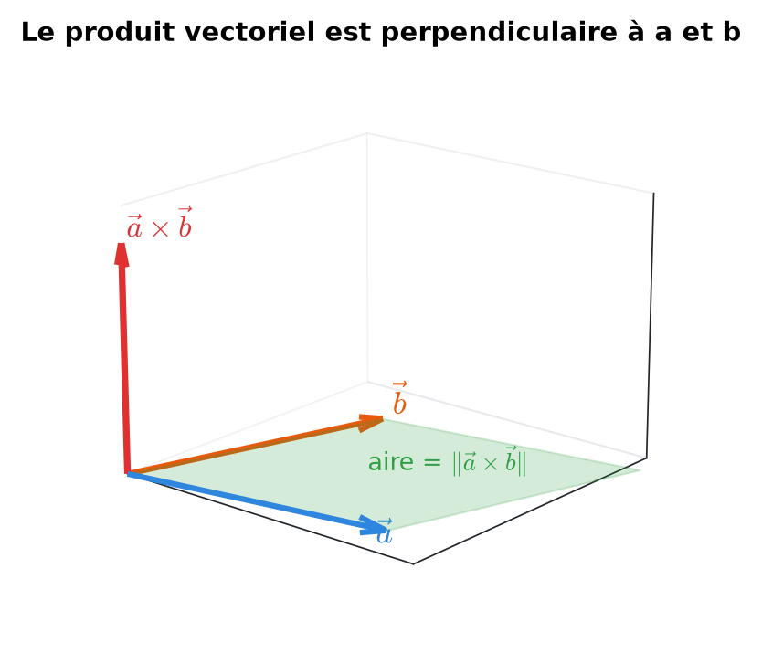
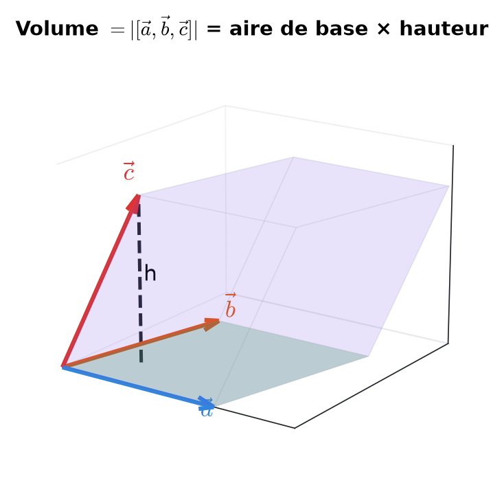
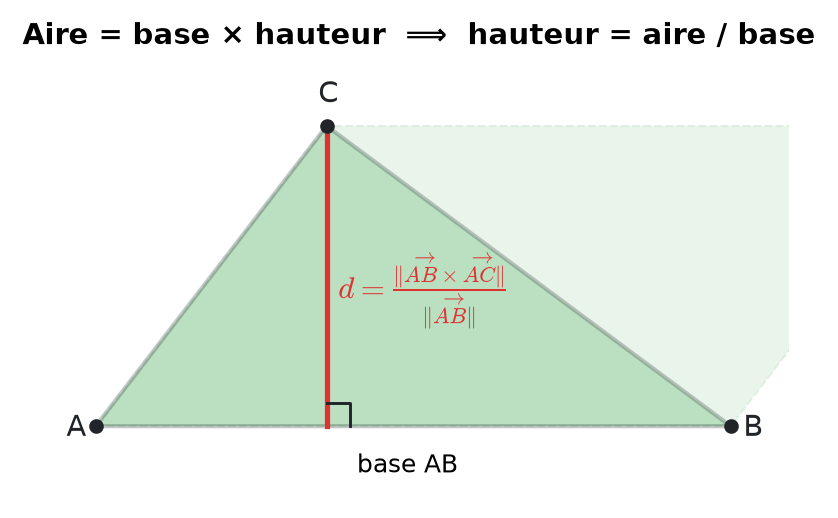
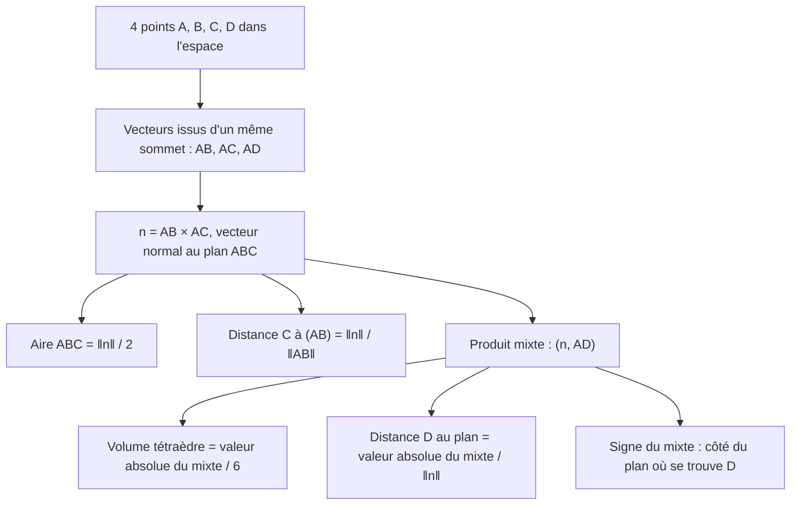
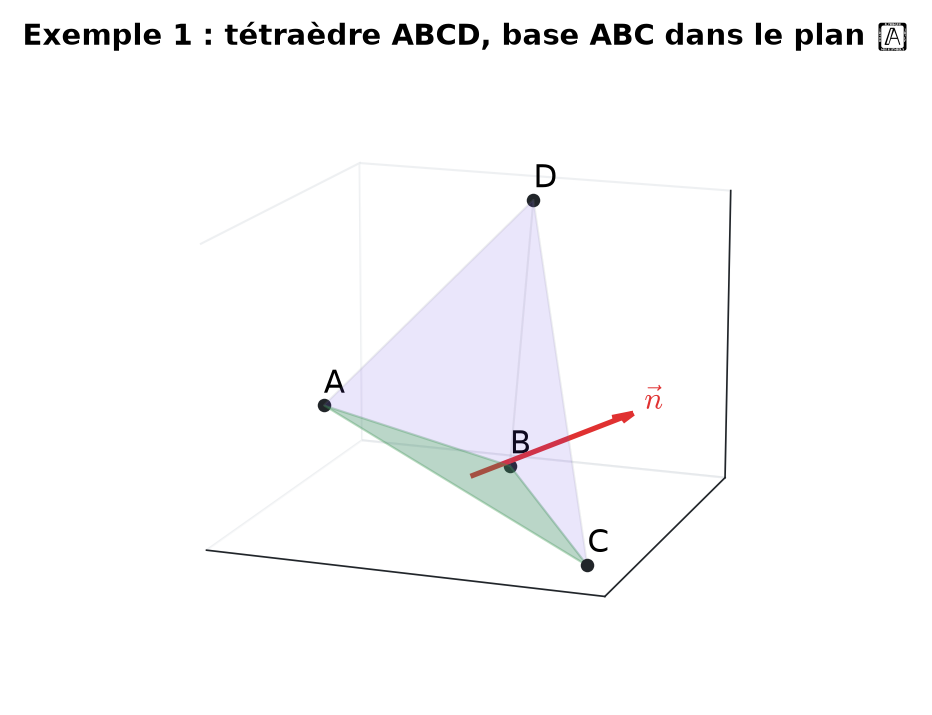
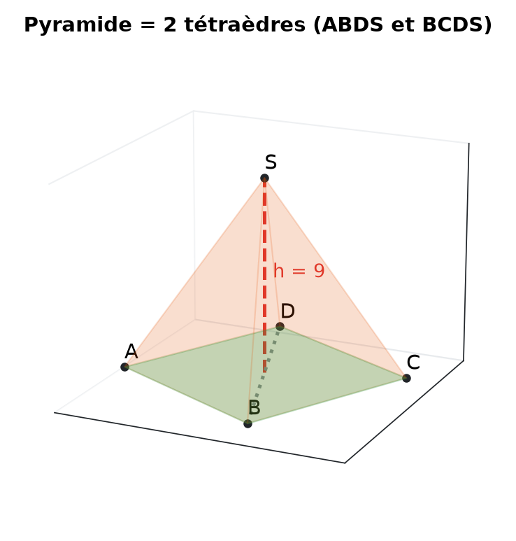
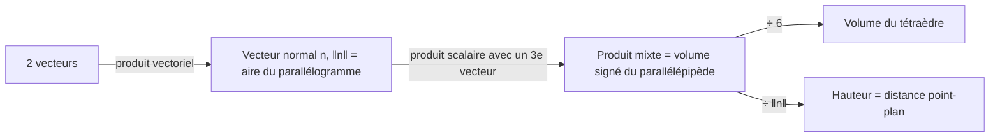

# 11. Produit vectoriel et produit mixte


**Objectif** : calculer produits vectoriels et produits mixtes pour obtenir <mark style="color:blue;">aires</mark>, <mark style="color:blue;">volumes</mark>, <mark style="color:blue;">distances</mark> (point-droite, point-plan) et angles dans l'espace. C'est « Test 3 Pb 4 » et l'exercice « Maison des lapins crétins » des TE F-2.


---

## 1. Introduction & définitions

### 1.1 Produit vectoriel (seulement dans ℝ³)

$$\Large \vec{a}\times\vec{b} = \begin{pmatrix} a_1 \\ a_2 \\ a_3 \end{pmatrix}\times\begin{pmatrix} b_1 \\ b_2 \\ b_3 \end{pmatrix} = \begin{pmatrix} a_2b_3 - a_3b_2 \\ a_3b_1 - a_1b_3 \\ a_1b_2 - a_2b_1 \end{pmatrix}$$


**Astuce de calcul** : pour la 1re composante, on <mark style="color:green;">cache la 1re ligne</mark> et on fait « produit en croix » des lignes 2 et 3 ; pour la 2e, on cache la 2e ligne et on fait les lignes 3 puis 1 ; pour la 3e, lignes 1 et 2.


<mark style="color:blue;">Propriétés géométriques</mark> — le résultat est un <mark style="color:green;">vecteur</mark> :

* <mark style="color:red;">perpendiculaire</mark> à a et à b (c'est un vecteur normal au plan qu'ils engendrent) ;
* de sens donné par la <mark style="color:blue;">règle de la main droite</mark> (a = pouce, b = index, a × b = majeur) ;
* de norme égale à l'<mark style="color:green;">aire du parallélogramme</mark> construit sur a et b :

$$\Large \boxed{\lVert\vec{a}\times\vec{b}\rVert = \lVert\vec{a}\rVert\,\lVert\vec{b}\rVert\sin\gamma}$$

<figure><figcaption>
a × b est normal au plan de a et b ; sa norme est l'aire du parallélogramme vert.
</figcaption></figure>

<mark style="color:blue;">Propriétés algébriques</mark> :

$$\large \vec{b}\times\vec{a} = -\vec{a}\times\vec{b} \qquad \vec{a}\times\vec{a} = \vec{0} \qquad \vec{a}\times\vec{b} = \vec{0} \iff \vec{a} \parallel \vec{b}$$


Le produit vectoriel est <mark style="color:red;">non associatif</mark> : en général a × (b × c) ≠ (a × b) × c.


<mark style="color:blue;">Identité de Lagrange</mark> (pratique pour une aire sans calculer le produit vectoriel) :

$$\Large \lVert\vec{a}\times\vec{b}\rVert^2 = \lVert\vec{a}\rVert^2\lVert\vec{b}\rVert^2 - (\vec{a}, \vec{b})^2$$

### 1.2 Produit mixte

Le <mark style="color:blue;">produit mixte</mark> de trois vecteurs de ℝ³ est un <mark style="color:green;">nombre</mark> :

$$\Large \boxed{[\vec{a}, \vec{b}, \vec{c}] = (\vec{a}\times\vec{b}, \vec{c}) = \det\begin{pmatrix} a_1 & b_1 & c_1 \\ a_2 & b_2 & c_2 \\ a_3 & b_3 & c_3 \end{pmatrix}}$$

<figure><figcaption>
La valeur absolue du produit mixte est le volume du parallélépipède.
</figcaption></figure>

* |\[a, b, c]| est le <mark style="color:green;">volume du parallélépipède</mark> construit sur les trois vecteurs.
* \[a, b, c] = 0 ⟺ les trois vecteurs sont <mark style="color:red;">coplanaires</mark> (linéairement dépendants).
* Il est invariant par <mark style="color:blue;">permutation circulaire</mark> : \[a, b, c] = \[b, c, a] = \[c, a, b] ; il change de signe si l'on échange deux vecteurs.
* Son <mark style="color:blue;">signe</mark> indique de quel côté du plan (a, b) se trouve c : positif si c est du côté de a × b.

### 1.3 Le formulaire géométrique

| Grandeur | Formule |
| --- | --- |
| Aire du parallélogramme ABDC | $$\lVert\overrightarrow{AB}\times\overrightarrow{AC}\rVert$$ |
| Aire du triangle ABC | $$\frac{1}{2}\lVert\overrightarrow{AB}\times\overrightarrow{AC}\rVert$$ |
| Distance de C à la droite (AB) | $$\dfrac{\lVert\overrightarrow{AB}\times\overrightarrow{AC}\rVert}{\lVert\overrightarrow{AB}\rVert}$$ (aire / base) |
| Volume du parallélépipède | $$\lvert[\overrightarrow{AB}, \overrightarrow{AC}, \overrightarrow{AD}]\rvert$$ |
| Volume du tétraèdre ABCD | $$\frac{1}{6}\lvert[\overrightarrow{AB}, \overrightarrow{AC}, \overrightarrow{AD}]\rvert$$ |
| Volume d'une pyramide à base parallélogramme | $$\frac{1}{3}\lvert[\dots]\rvert$$ (deux tétraèdres) |
| Distance de D au plan (ABC) | $$\dfrac{\lvert[\overrightarrow{AB}, \overrightarrow{AC}, \overrightarrow{AD}]\rvert}{\lVert\overrightarrow{AB}\times\overrightarrow{AC}\rVert}$$ (volume / aire de base) |

Les deux formules de distance découlent de <mark style="color:green;">« aire = base × hauteur »</mark> et <mark style="color:green;">« volume = aire de base × hauteur »</mark>.

<figure><figcaption>
La hauteur du parallélogramme est la distance de C à la droite (AB).
</figcaption></figure>

---

## 2. Méthodes de résolution

<mark style="color:blue;">Conseils</mark> :

* Toujours partir <mark style="color:green;">du même sommet</mark> pour les trois vecteurs.
* Calculer n = AB × AC <mark style="color:green;">une seule fois</mark> et le réutiliser.
* Vérifier le produit vectoriel : (n, AB) = 0 et (n, AC) = 0.

---

## 3. Exemples de calculs détaillés

### Exemple 1 — Le problème complet (Test 3 Pb 4, variante A)

*A(1 ; −1 ; 2), B(2 ; 0 ; 1), C(3 ; −4 ; 1), D(2 ; 1 ; 5) en mètres. 𝒫 est le plan (ABC) et ℒ la droite (AD).*

<figure><figcaption></figcaption></figure>

<mark style="color:orange;">Vecteurs de base :</mark>

$$\large \overrightarrow{AB} = \begin{pmatrix} 1 \\ 1 \\ -1 \end{pmatrix} \qquad \overrightarrow{AC} = \begin{pmatrix} 2 \\ -3 \\ -1 \end{pmatrix} \qquad \overrightarrow{AD} = \begin{pmatrix} 1 \\ 2 \\ 3 \end{pmatrix}$$

<mark style="color:orange;">Produit vectoriel :</mark>

$$\large \overrightarrow{AB}\times\overrightarrow{AC} = \begin{pmatrix} 1\cdot(-1) - (-1)(-3) \\ (-1)\cdot 2 - 1\cdot(-1) \\ 1\cdot(-3) - 1\cdot 2 \end{pmatrix} = \begin{pmatrix} -4 \\ -1 \\ -5 \end{pmatrix} \qquad \lVert\cdot\rVert = \sqrt{42}$$

Vérification : (n, AB) = −4 − 1 + 5 = 0 ✓.

<mark style="color:orange;">a) Aire du triangle ABC</mark> :

$$\large \frac{\sqrt{42}}{2} \approx \color{#2F9E44}3{,}24 \text{ m}^2$$

<mark style="color:orange;">b) Distance de C à (AB)</mark> :

$$\large \frac{\sqrt{42}}{\sqrt{3}} = \sqrt{14} \approx \color{#2F9E44}3{,}74 \text{ m}$$

<mark style="color:orange;">Produit mixte :</mark>

$$\large [\overrightarrow{AB}, \overrightarrow{AC}, \overrightarrow{AD}] = (-4)(1) + (-1)(2) + (-5)(3) = -21$$

<mark style="color:orange;">c) Distance de D au plan</mark> (même valeur que l'aire, par hasard) :

$$\large \frac{\lvert -21 \rvert}{\sqrt{42}} = \frac{\sqrt{42}}{2} \approx \color{#2F9E44}3{,}24 \text{ m}$$

<mark style="color:orange;">d) Volume du tétraèdre</mark> :

$$\large V = \frac{21}{6} = \color{#2F9E44}3{,}5 \text{ m}^3$$

<mark style="color:orange;">e) Angle entre n (normal, côté D) et AD.</mark> Le mixte est <mark style="color:red;">négatif</mark> : D est du côté <mark style="color:red;">opposé</mark> à AB × AC. Le normal qui pointe vers D est donc n = (4 ; 1 ; 5) :

$$\large \cos\gamma = \frac{(\vec{n}, \overrightarrow{AD})}{\lVert\vec{n}\rVert\,\lVert\overrightarrow{AD}\rVert} = \frac{21}{\sqrt{42}\,\sqrt{14}} = \frac{\sqrt{3}}{2} \quad\Rightarrow\quad \color{#2F9E44}\gamma = 30°$$

<mark style="color:orange;">f) Point X ∈ ℒ, du même côté que D, tel que V(ABCX) = 7 m³.</mark> On pose AX = λ AD avec λ > 0. Le produit mixte est linéaire :

$$\large V(ABCX) = \frac{1}{6}\lvert[\overrightarrow{AB}, \overrightarrow{AC}, \lambda\overrightarrow{AD}]\rvert = \frac{21\lambda}{6} = 7 \quad\Rightarrow\quad \lambda = 2$$

$$\large \overrightarrow{OX} = \overrightarrow{OA} + 2\overrightarrow{AD} = \begin{pmatrix} 3 \\ 3 \\ 8 \end{pmatrix} \quad\Rightarrow\quad \color{#2F9E44}X(3\,;\,3\,;\,8)$$

### Exemple 2 — Calculs directs (Test 3 Pb 4, variante A)

*Calculer (a, b), a × b, \[a, b, c] pour :*

$$\large \vec{a} = \begin{pmatrix} 1 \\ 1 \\ 0 \end{pmatrix} \quad \vec{b} = \begin{pmatrix} 1 \\ -1 \\ 3 \end{pmatrix} \quad \vec{c} = \begin{pmatrix} 3 \\ 1 \\ -1 \end{pmatrix}$$

$$\large (\vec{a}, \vec{b}) = \color{#2F9E44}0 \qquad \vec{a}\times\vec{b} = \begin{pmatrix} 1\cdot 3 - 0\cdot(-1) \\ 0\cdot 1 - 1\cdot 3 \\ 1\cdot(-1) - 1\cdot 1 \end{pmatrix} = \color{#2F9E44}\begin{pmatrix} 3 \\ -3 \\ -2 \end{pmatrix}$$

$$\large [\vec{a}, \vec{b}, \vec{c}] = (\vec{a}\times\vec{b}, \vec{c}) = 9 - 3 + 2 = \color{#2F9E44}8$$

### Exemple 3 — Pyramide (TE F-2, « Maison des lapins crétins »)

*Une pyramide a pour base le carré ABCD au sol avec A(1 ; 1 ; 0), B(5 ; −1 ; 0), C(7 ; 3 ; 0), D(3 ; 5 ; 0) et pour sommet S(4 ; 2 ; 9). Montrer que la base est un carré et calculer le volume.*

<figure><figcaption></figcaption></figure>

<mark style="color:orange;">Carré</mark> :

$$\large \overrightarrow{AB} = \begin{pmatrix} 4 \\ -2 \\ 0 \end{pmatrix} = \overrightarrow{DC} \qquad \overrightarrow{AD} = \begin{pmatrix} 2 \\ 4 \\ 0 \end{pmatrix}$$

* AB = DC : <mark style="color:blue;">parallélogramme</mark> ;
* ‖AB‖ = ‖AD‖ = √20 : <mark style="color:blue;">losange</mark> ;
* (AB, AD) = 8 − 8 = 0 : <mark style="color:blue;">angle droit</mark>.

C'est un <mark style="color:green;">carré</mark>.

<mark style="color:orange;">Volume</mark> : la pyramide se coupe en deux tétraèdres ABDS et BCDS de même volume, donc V = ⅓ |\[AB, AD, AS]| :

$$\large \overrightarrow{AB}\times\overrightarrow{AD} = \begin{pmatrix} 0 \\ 0 \\ 20 \end{pmatrix} \qquad \overrightarrow{AS} = \begin{pmatrix} 3 \\ 1 \\ 9 \end{pmatrix} \qquad [\dots] = 20\cdot 9 = 180$$

$$\Large V = \frac{180}{3} = \color{#2F9E44}60 \text{ unités}^3$$

<mark style="color:blue;">Contrôle</mark> avec la formule du collège : aire de base 20, hauteur 9, V = ⅓ · 20 · 9 = 60 ✓.

---

## 4. Visualisation : de l'aire au volume

---

## 5. Exercices pratiques

### Exercice 1 — Calculs de base (Test 3 Pb 4, variante B)

Calculer (a, b), a × b et \[a, b, c]. Les trois vecteurs sont-ils coplanaires ?

$$\large \vec{a} = \begin{pmatrix} 1 \\ 2 \\ 0 \end{pmatrix} \quad \vec{b} = \begin{pmatrix} -1 \\ 1 \\ 2 \end{pmatrix} \quad \vec{c} = \begin{pmatrix} 2 \\ 1 \\ -1 \end{pmatrix}$$

Cliquez pour voir l'indice

Calculez a × b composante par composante, vérifiez qu'il est orthogonal à a, puis faites le produit scalaire avec c.

Solution détaillée

<mark style="color:orange;">1.</mark> (a, b) = −1 + 2 + 0 = <mark style="color:green;">1</mark>.

<mark style="color:orange;">2.</mark> Produit vectoriel :

$$\large \vec{a}\times\vec{b} = \begin{pmatrix} 2\cdot 2 - 0\cdot 1 \\ 0\cdot(-1) - 1\cdot 2 \\ 1\cdot 1 - 2\cdot(-1) \end{pmatrix} = \color{#2F9E44}\begin{pmatrix} 4 \\ -2 \\ 3 \end{pmatrix}$$

Contrôle : (a × b, a) = 4 − 4 + 0 = 0 ✓.

<mark style="color:orange;">3.</mark> \[a, b, c] = 8 − 2 − 3 = <mark style="color:green;">3 ≠ 0</mark> : les vecteurs <mark style="color:red;">ne sont pas</mark> coplanaires.

### Exercice 2 — Tétraèdre (Test 3 Pb 4, 2023)

A(1 ; 2 ; 2), B(2 ; 1 ; −2), C(1 ; 1 ; 1), D(0 ; −2 ; 3). Calculer a) le volume du tétraèdre ABCD ; b) l'aire du triangle ABC ; c) la distance de D au plan (ABC).

Cliquez pour voir l'indice

Partez de A : AB, AC, AD. Calculez n = AB × AC, puis (n, AD).

Solution détaillée

<mark style="color:orange;">1.</mark> Vecteurs :

$$\large \overrightarrow{AB} = \begin{pmatrix} 1 \\ -1 \\ -4 \end{pmatrix} \quad \overrightarrow{AC} = \begin{pmatrix} 0 \\ -1 \\ -1 \end{pmatrix} \quad \overrightarrow{AD} = \begin{pmatrix} -1 \\ -4 \\ 1 \end{pmatrix}$$

<mark style="color:orange;">2.</mark> Normal :

$$\large \vec{n} = \overrightarrow{AB}\times\overrightarrow{AC} = \begin{pmatrix} -3 \\ 1 \\ -1 \end{pmatrix} \qquad \lVert\vec{n}\rVert = \sqrt{11}$$

<mark style="color:orange;">3.</mark> Mixte : (n, AD) = 3 − 4 − 1 = −2.

$$\large \text{a) } V = \frac{2}{6} = \color{#2F9E44}\frac{1}{3} \qquad \text{b) } \mathcal{A} = \frac{\sqrt{11}}{2} \approx \color{#2F9E44}1{,}66 \qquad \text{c) } d = \frac{2}{\sqrt{11}} \approx \color{#2F9E44}0{,}60$$

### Exercice 3 — Vrai ou faux (Test 3 Pb 4, 2023)

* a) Pour tous a, b ∈ ℝ³ : (a + b) × (a − b) = 2(b × a).
* b) Si a, b, c sont coplanaires, alors (a × b) × c = 0.
* c) Si ‖AB‖ = 4, ‖AC‖ = 3 et l'angle BAC vaut 30°, alors ‖AB × AC‖ = 6.
* d) Pour e₁, e₂, e₃ la base canonique, \[e₁, e₂, e₃] = 1.

Cliquez pour voir l'indice

a) Développez en utilisant a × a = 0 et l'anticommutativité. b) Où se trouve a × b par rapport au plan ? Est-il parallèle à c ? c) ‖a × b‖ = ‖a‖‖b‖ sin γ.

Solution détaillée

<mark style="color:orange;">a)</mark> <mark style="color:green;">Vrai</mark> :

$$\large (\vec{a} + \vec{b})\times(\vec{a} - \vec{b}) = \underbrace{\vec{a}\times\vec{a}}_{\vec 0} - \vec{a}\times\vec{b} + \vec{b}\times\vec{a} - \underbrace{\vec{b}\times\vec{b}}_{\vec 0} = 2(\vec{b}\times\vec{a})$$

<mark style="color:orange;">b)</mark> <mark style="color:red;">Faux</mark> : a × b est perpendiculaire au plan, et c est dans le plan ; ils sont orthogonaux, donc leur produit <mark style="color:blue;">scalaire</mark> est nul, mais leur produit <mark style="color:blue;">vectoriel</mark> a pour norme ‖a × b‖ ‖c‖ ≠ 0 en général.

<mark style="color:orange;">c)</mark> <mark style="color:green;">Vrai</mark> : 4 · 3 · sin 30° = 12 · ½ = 6.

<mark style="color:orange;">d)</mark> <mark style="color:green;">Vrai</mark> : e₁ × e₂ = e₃ et (e₃, e₃) = 1 (c'est le volume du cube unité).

