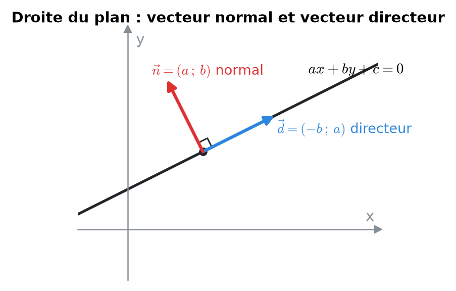
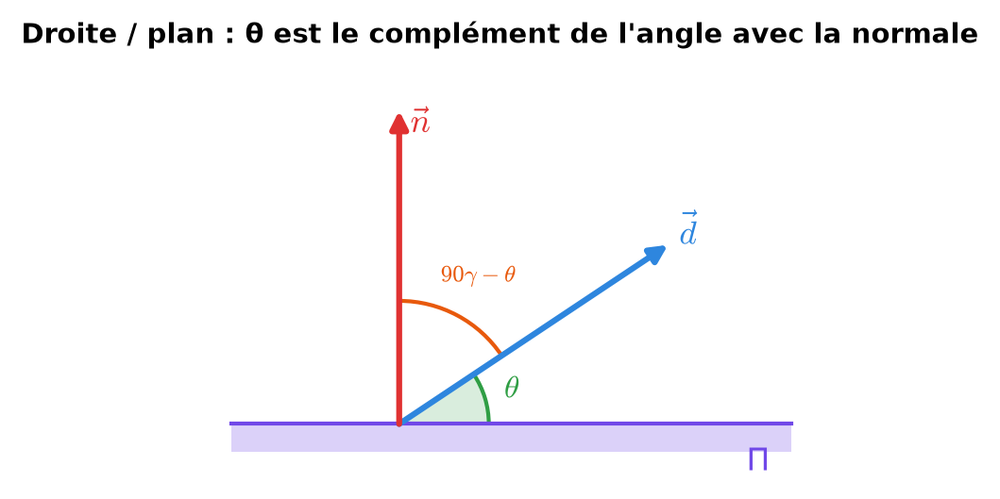
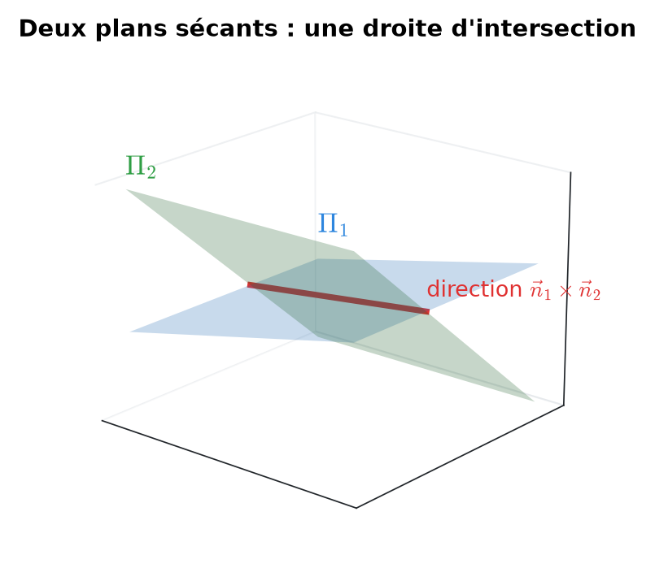
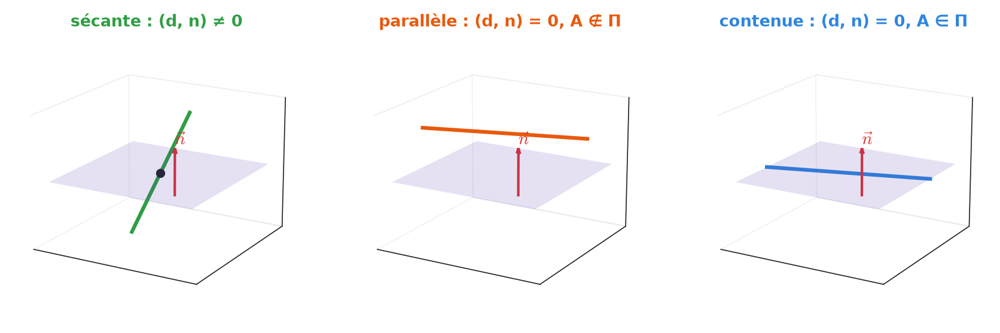
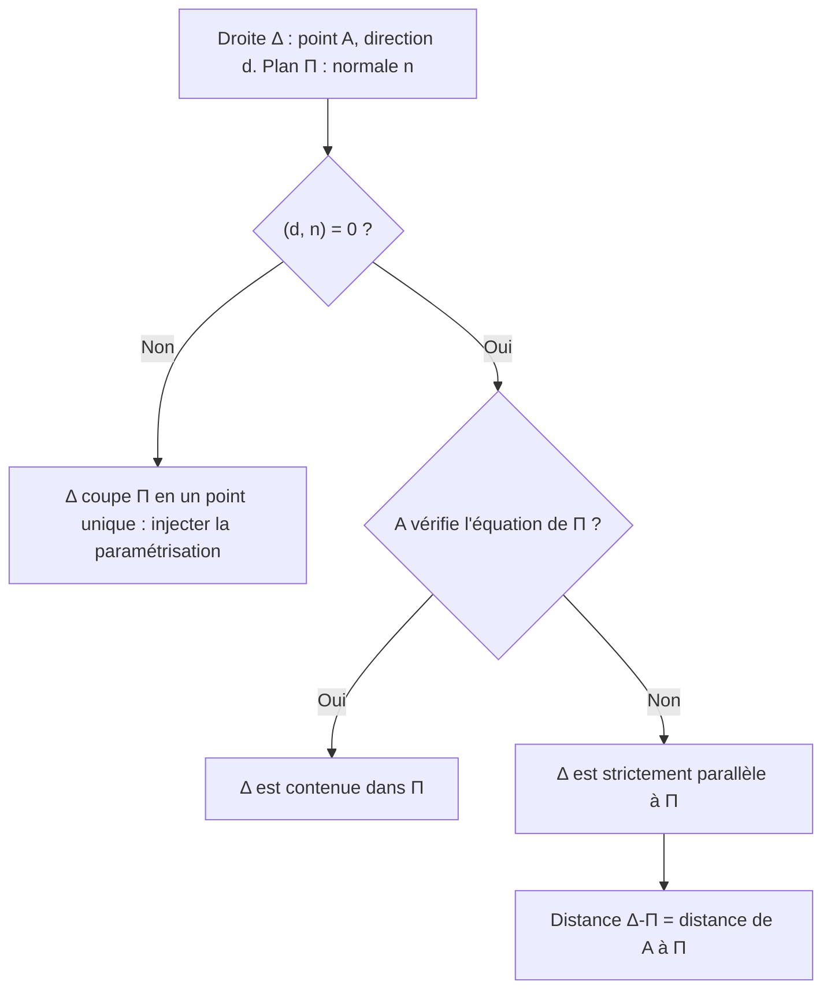
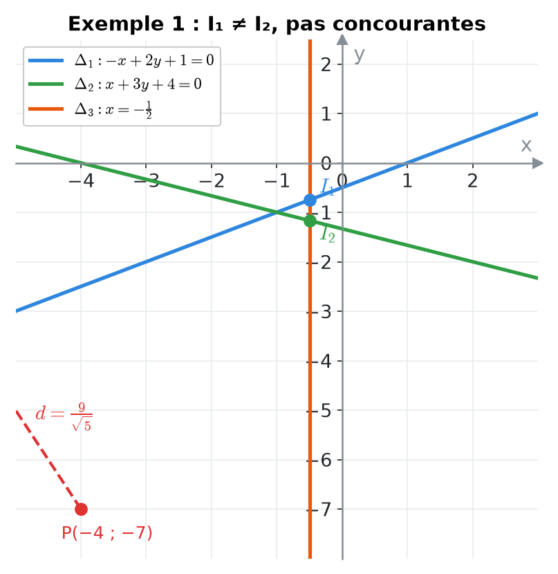
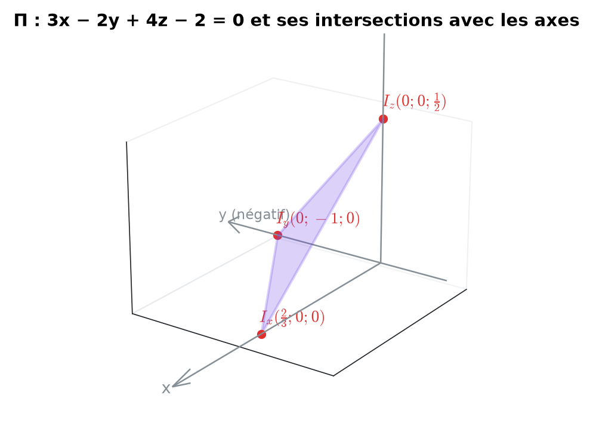
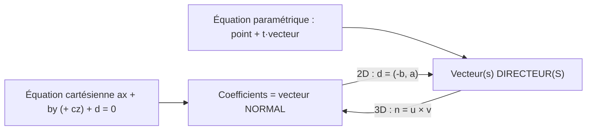

# 12. Droites et plans (géométrie analytique)


**Objectif** : passer d'une forme d'équation à l'autre (cartésienne ↔ paramétrique), calculer intersections, distances et angles pour des droites du plan et des droites/plans de l'espace. C'est l'exercice <mark style="color:blue;">« Droites & Co »</mark> et <mark style="color:blue;">« Plan »</mark> des TE F-2.


---

## 1. Introduction & définitions

### 1.1 Droites dans le plan ℝ²

Une droite peut s'écrire de trois façons :

| Forme | Équation | Informations lisibles |
| --- | --- | --- |
| Cartésienne (implicite) | $$ax + by + c = 0$$ | vecteur <mark style="color:red;">normal</mark> n = (a ; b) |
| Explicite | $$y = mx + p$$ | pente m, ordonnée à l'origine p |
| Paramétrique | $$x = x_0 + t\,d_1, \ \ y = y_0 + t\,d_2$$ | point (x₀ ; y₀), vecteur <mark style="color:blue;">directeur</mark> d = (d₁ ; d₂) |

<figure><figcaption>
Les coefficients de l'équation cartésienne donnent le vecteur normal.
</figcaption></figure>

Liens :

$$\Large \vec{d} = \begin{pmatrix} -b \\ a \end{pmatrix} \qquad m = \frac{d_2}{d_1}$$

Une droite verticale x = c n'a <mark style="color:red;">pas</mark> de forme explicite.

### 1.2 Droites et plans dans l'espace ℝ³

<mark style="color:blue;">Droite</mark> : seulement la forme <mark style="color:blue;">paramétrique</mark> (une équation cartésienne seule décrit un plan !) :

$$\Large \Delta : \begin{pmatrix} x \\ y \\ z \end{pmatrix} = \begin{pmatrix} x_0 \\ y_0 \\ z_0 \end{pmatrix} + t\begin{pmatrix} d_1 \\ d_2 \\ d_3 \end{pmatrix}, \quad t \in \mathbb{R}$$

<mark style="color:purple;">Plan</mark> :

* forme <mark style="color:purple;">cartésienne</mark> ax + by + cz + d = 0, de vecteur normal n = (a ; b ; c) ;
* forme <mark style="color:purple;">paramétrique</mark> avec un point et <mark style="color:green;">deux</mark> vecteurs directeurs non colinéaires :

$$\Large \Pi : \begin{pmatrix} x \\ y \\ z \end{pmatrix} = \overrightarrow{OP} + k\,\vec{u} + r\,\vec{v}, \quad k, r \in \mathbb{R}$$

Passage paramétrique → cartésien : <mark style="color:green;">n = u × v</mark>, puis d en imposant que P vérifie l'équation.

### 1.3 Distances

<mark style="color:blue;">Point–droite dans ℝ²</mark> et <mark style="color:blue;">point–plan dans ℝ³</mark> (même structure) :

$$\Large d\left(P_0, \Delta\right) = \frac{\lvert ax_0 + by_0 + c \rvert}{\sqrt{a^2 + b^2}} \qquad d\left(P_0, \Pi\right) = \frac{\lvert ax_0 + by_0 + cz_0 + d \rvert}{\sqrt{a^2 + b^2 + c^2}}$$

<mark style="color:blue;">Point–droite dans ℝ³</mark> (voir chapitre 11) :

$$\Large d = \frac{\lVert\overrightarrow{AP_0}\times\vec{d}\rVert}{\lVert\vec{d}\rVert}$$

### 1.4 Angles

Entre deux droites : angle <mark style="color:green;">aigu</mark> entre leurs vecteurs directeurs. Entre deux plans : même formule avec les <mark style="color:red;">normales</mark>.

$$\Large \cos\theta = \frac{\lvert(\vec{d}_1, \vec{d}_2)\rvert}{\lVert\vec{d}_1\rVert\lVert\vec{d}_2\rVert}$$

Entre une droite et un plan : on utilise un <mark style="color:red;">sinus</mark> (complémentaire de l'angle avec la normale) :

$$\Large \sin\theta = \frac{\lvert(\vec{d}, \vec{n})\rvert}{\lVert\vec{d}\rVert\lVert\vec{n}\rVert}$$

<figure><figcaption>
L'angle avec le plan est le complément de l'angle avec la normale.
</figcaption></figure>

---

## 2. Méthodes de résolution

### Méthode A — Paramétrique → cartésienne (dans le plan)

Isoler t dans une équation, remplacer dans l'autre.

### Méthode B — Intersection

* <mark style="color:blue;">Deux droites de ℝ² cartésiennes</mark> : résoudre le système 2 × 2.
* <mark style="color:blue;">Droite paramétrique ∩ plan cartésien</mark> : injecter x(t), y(t), z(t) dans l'équation du plan → une équation en t.
* <mark style="color:blue;">Deux plans</mark> : la droite d'intersection a pour direction n₁ × n₂ ; un point s'obtient en fixant une coordonnée (par exemple z = 0) et en résolvant le système restant.
* <mark style="color:blue;">Plan et axes</mark> : poser deux coordonnées nulles.

<figure><figcaption></figcaption></figure>

### Méthode C — Position relative d'une droite et d'un plan

<figure><figcaption></figcaption></figure>

### Méthode D — Trois droites concourantes ?

Calculer l'intersection de deux d'entre elles, puis tester si ce point est sur la troisième.

---

## 3. Exemples de calculs détaillés

### Exemple 1 — Droites du plan (TE F-2, 2023, « Droites & Co »)

$$\large \Delta_1 : -x + 2y + 1 = 0 \qquad \Delta_2 : x = -3t,\ y = t - \frac{4}{3} \qquad \Delta_3 : x = -\frac{1}{2}$$

<figure><figcaption></figcaption></figure>

<mark style="color:orange;">a) Forme cartésienne de Δ₂.</mark> De x = −3t : t = −x/3. Dans la 2e équation :

$$\large y = -\frac{x}{3} - \frac{4}{3} \iff 3y = -x - 4 \iff \color{#2F9E44}x + 3y + 4 = 0$$

<mark style="color:orange;">b) Les trois droites sont-elles concourantes ?</mark>

$$\large \Delta_1 \cap \Delta_3 : \ \frac{1}{2} + 2y + 1 = 0 \iff y = -\frac{3}{4} \qquad I_1\left(-\tfrac{1}{2}\,;\,-\tfrac{3}{4}\right)$$

$$\large \Delta_2 \cap \Delta_3 : \ -\frac{1}{2} + 3y + 4 = 0 \iff y = -\frac{7}{6} \qquad I_2\left(-\tfrac{1}{2}\,;\,-\tfrac{7}{6}\right)$$

I₁ ≠ I₂ : les trois droites <mark style="color:red;">ne</mark> se coupent <mark style="color:red;">pas</mark> en un même point.

<mark style="color:orange;">c) Distance du point P(−4 ; −7) à Δ₁</mark> :

$$\large d = \frac{\lvert -(-4) + 2(-7) + 1 \rvert}{\sqrt{1 + 4}} = \frac{9}{\sqrt{5}} \approx \color{#2F9E44}4{,}02$$

<mark style="color:orange;">d) Angle entre Δ₁ et Δ₃.</mark> Directeurs : d₁ = (2 ; 1) (car n₁ = (−1 ; 2)) et d₃ = (0 ; 1) :

$$\large \cos\theta = \frac{\lvert 0 + 1 \rvert}{\sqrt{5}\cdot 1} = \frac{1}{\sqrt{5}} \quad\Rightarrow\quad \color{#2F9E44}\theta \approx 63{,}4°$$

<mark style="color:orange;">e) Projection du normal n₁ sur le directeur d₂ = (−3 ; 1)</mark> :

$$\large \operatorname{proj}_{\vec{d}_2}(\vec{n}_1) = \frac{(\vec{n}_1, \vec{d}_2)}{(\vec{d}_2, \vec{d}_2)}\vec{d}_2 = \frac{5}{10}\begin{pmatrix} -3 \\ 1 \end{pmatrix} = \color{#2F9E44}\begin{pmatrix} -\frac{3}{2} \\ \frac{1}{2} \end{pmatrix}$$

### Exemple 2 — Un plan (TE F-2, 2023, « Plan »)

$$\Large \Pi : 3x - 2y + 4z - 2 = 0$$

<mark style="color:orange;">a) Intersections avec les axes</mark> (on annule deux coordonnées) :

$$\large I_x\left(\tfrac{2}{3}\,;\,0\,;\,0\right) \qquad I_y(0\,;\,-1\,;\,0) \qquad I_z\left(0\,;\,0\,;\,\tfrac{1}{2}\right)$$

<figure><figcaption></figcaption></figure>

<mark style="color:orange;">b) Forme paramétrique.</mark> Point P = I\_y ; directeurs u = I\_yI\_x et v = I\_yI\_z :

$$\large \vec{u} = \begin{pmatrix} \frac{2}{3} \\ 1 \\ 0 \end{pmatrix} \qquad \vec{v} = \begin{pmatrix} 0 \\ 1 \\ \frac{1}{2} \end{pmatrix} \qquad \color{#2F9E44}\Pi : \begin{cases} x = \frac{2}{3}k \\ y = -1 + k + r \\ z = \frac{1}{2}r \end{cases}$$

<mark style="color:blue;">Contrôle</mark> :

$$\large 3\cdot\tfrac{2}{3}k - 2(-1 + k + r) + 4\cdot\tfrac{1}{2}r - 2 = 0 \ ✓$$

<mark style="color:orange;">c) Intersection avec Δ : x = −1 − t, y = 4 + t, z = 2 − t.</mark> On injecte :

$$\large 3(-1 - t) - 2(4 + t) + 4(2 - t) - 2 = 0 \iff -9t - 5 = 0 \iff t = -\frac{5}{9}$$

$$\Large \color{#2F9E44} I = \left(-\frac{4}{9}\,;\ \frac{31}{9}\,;\ \frac{23}{9}\right)$$

### Exemple 3 — Droite parallèle à un plan (TE F-2, 2026)

$$\large \Delta : x = 2 + t,\ y = 1 - 4t,\ z = -2t \qquad \Pi : 6x - y + 5z + 5 = 0$$

<mark style="color:orange;">1.</mark> d = (1 ; −4 ; −2), n = (6 ; −1 ; 5) : (d, n) = 6 + 4 − 10 = 0. La droite est <mark style="color:blue;">parallèle</mark> au plan.

<mark style="color:orange;">2.</mark> A(2 ; 1 ; 0) ∈ Δ : 12 − 1 + 0 + 5 = 16 ≠ 0, donc A ∉ Π. La droite n'est <mark style="color:red;">pas contenue</mark> dans le plan.

<mark style="color:orange;">3.</mark> Distance :

$$\large d(\Delta, \Pi) = d(A, \Pi) = \frac{16}{\sqrt{36 + 1 + 25}} = \frac{16}{\sqrt{62}} \approx \color{#2F9E44}2{,}03$$

### Exemple 4 — Deux plans (TE F-2, 2024, « Plans »)

$$\large \Pi_1 : x = 1 + k,\ y = 2 + r,\ z = 3 - k + 4r \qquad \Pi_2 : 2x + y - z - 1 = 0$$

<mark style="color:orange;">a) Forme cartésienne de Π₁.</mark> Avec u = (1 ; 0 ; −1) et v = (0 ; 1 ; 4) :

$$\large \vec{n}_1 = \vec{u}\times\vec{v} = \begin{pmatrix} 0\cdot 4 - (-1)\cdot 1 \\ (-1)\cdot 0 - 1\cdot 4 \\ 1\cdot 1 - 0\cdot 0 \end{pmatrix} = \begin{pmatrix} 1 \\ -4 \\ 1 \end{pmatrix}$$

x − 4y + z + d = 0 passe par (1 ; 2 ; 3) : 1 − 8 + 3 + d = 0, donc d = 4.

$$\Large \color{#2F9E44}\Pi_1 : x - 4y + z + 4 = 0$$

<mark style="color:orange;">b) Les plans se coupent-ils ?</mark> n₁ = (1, −4, 1) et n₂ = (2, 1, −1) ne sont pas colinéaires : oui. Direction de la droite d'intersection :

$$\large \vec{n}_1\times\vec{n}_2 = \begin{pmatrix} 3 \\ 3 \\ 9 \end{pmatrix} \parallel \color{#2F9E44}\begin{pmatrix} 1 \\ 1 \\ 3 \end{pmatrix}$$

<mark style="color:orange;">c) Angle entre les plans</mark> :

$$\large \cos\theta = \frac{\lvert 2 - 4 - 1 \rvert}{\sqrt{18}\sqrt{6}} = \frac{3}{\sqrt{108}} = \frac{1}{2\sqrt{3}} \quad\Rightarrow\quad \color{#2F9E44}\theta \approx 73{,}2°$$

---

## 4. Visualisation : vecteur normal ou directeur ?

---

## 5. Exercices pratiques

### Exercice 1 — Droites du plan (TE F-2, 2024)

$$\large \Delta_1 : \frac{1}{2}x - y - \frac{1}{2} = 0 \qquad \Delta_2 : x = -3 - 3t,\ y = t - \frac{1}{3}$$

a) Écrire Δ₂ sous forme cartésienne. b) Calculer l'intersection de Δ₁ et Δ₂. c) Calculer l'angle entre les deux droites.

Cliquez pour voir l'indice

a) t = y + 1/3, à injecter dans x. b) Résolvez le système 2 × 2. c) Utilisez les vecteurs directeurs d₁ = (2 ; 1) et d₂ = (−3 ; 1).

Solution détaillée

<mark style="color:orange;">a)</mark>

$$\large x = -3 - 3\left(y + \frac{1}{3}\right) = -4 - 3y \quad\Rightarrow\quad \color{#2F9E44}\Delta_2 : x + 3y + 4 = 0$$

<mark style="color:orange;">b)</mark> De Δ₁ : x = 2y + 1. Dans Δ₂ : 2y + 1 + 3y + 4 = 0 ⟺ y = −1, puis x = −1. Intersection <mark style="color:green;">(−1 ; −1)</mark>.

<mark style="color:orange;">c)</mark>

$$\large \cos\theta = \frac{\lvert -6 + 1 \rvert}{\sqrt{5}\sqrt{10}} = \frac{1}{\sqrt{2}} \quad\Rightarrow\quad \color{#2F9E44}\theta = 45°$$

### Exercice 2 — Droite et plan

Soit Π : 2x − y + 2z − 6 = 0 et Δ : x = 1 + t, y = 2t, z = 3 − t. a) Position relative ? b) Distance de l'origine au plan. c) Angle entre Δ et Π.

Cliquez pour voir l'indice

Calculez (d, n). Pour c), l'angle droite-plan se calcule avec un **sinus**.

Solution détaillée

<mark style="color:orange;">a)</mark> d = (1, 2, −1), n = (2, −1, 2) : (d, n) = −2 ≠ 0. Intersection unique :

$$\large 2(1 + t) - 2t + 2(3 - t) - 6 = 0 \iff 2 - 2t = 0 \iff t = 1 \quad\Rightarrow\quad \color{#2F9E44}(2\,;\,2\,;\,2)$$

<mark style="color:orange;">b)</mark>

$$\large d(O, \Pi) = \frac{\lvert -6 \rvert}{\sqrt{4 + 1 + 4}} = \color{#2F9E44}2$$

<mark style="color:orange;">c)</mark>

$$\large \sin\theta = \frac{2}{\sqrt{6}\cdot 3} \approx 0{,}272 \quad\Rightarrow\quad \color{#2F9E44}\theta \approx 15{,}8°$$

### Exercice 3 — Plan par trois points

Trouver l'équation cartésienne du plan passant par A(1 ; 0 ; 0), B(0 ; 2 ; 0), C(0 ; 0 ; 3), puis la distance de D(1 ; 2 ; 3) à ce plan.

Cliquez pour voir l'indice

n = AB × AC, puis d avec le point A. (Astuce : un plan qui coupe les axes en a, b, c a pour équation x/a + y/b + z/c = 1.)

Solution détaillée

<mark style="color:orange;">1.</mark> AB = (−1, 2, 0), AC = (−1, 0, 3), puis :

$$\large \vec{n} = \begin{pmatrix} 2\cdot 3 - 0\cdot 0 \\ 0\cdot(-1) - (-1)\cdot 3 \\ (-1)\cdot 0 - 2\cdot(-1) \end{pmatrix} = \begin{pmatrix} 6 \\ 3 \\ 2 \end{pmatrix}$$

<mark style="color:orange;">2.</mark> 6x + 3y + 2z + d = 0 par A : d = −6.

$$\Large \color{#2F9E44} 6x + 3y + 2z - 6 = 0 \quad \left(\iff \frac{x}{1} + \frac{y}{2} + \frac{z}{3} = 1 \ ✓\right)$$

<mark style="color:orange;">3.</mark> Distance :

$$\large d(D, \Pi) = \frac{\lvert 6 + 6 + 6 - 6 \rvert}{\sqrt{36 + 9 + 4}} = \frac{12}{7} \approx \color{#2F9E44}1{,}71$$

