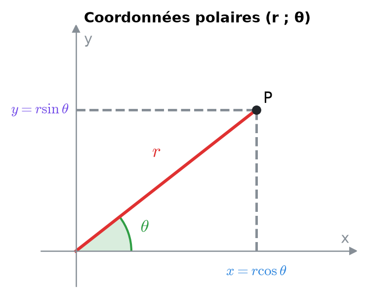
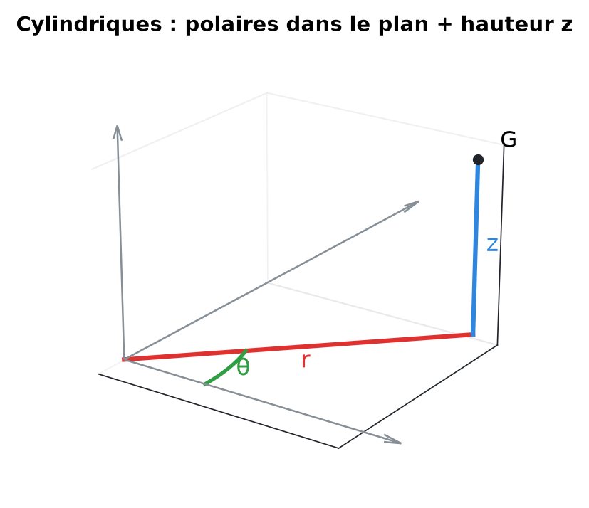
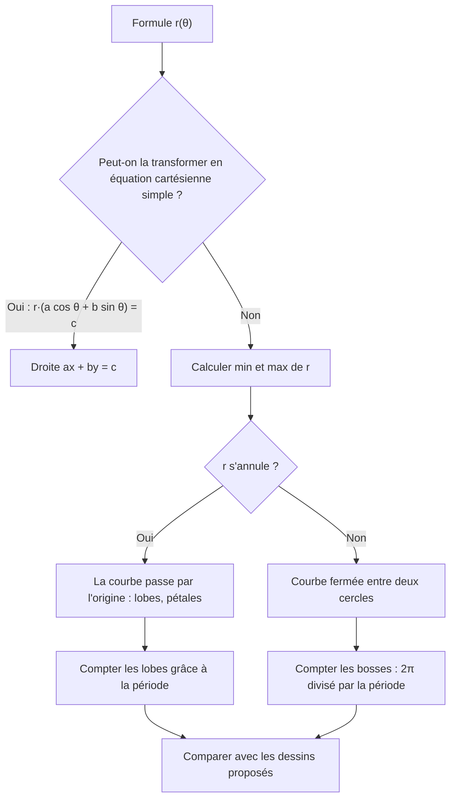
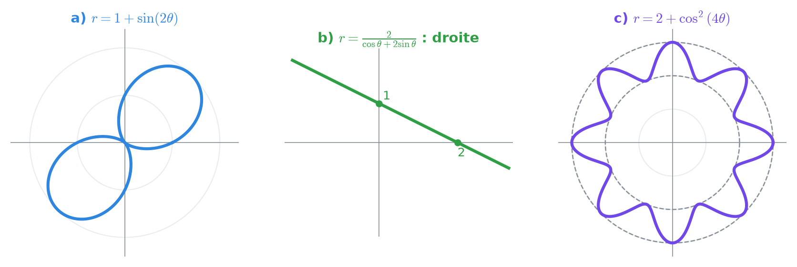
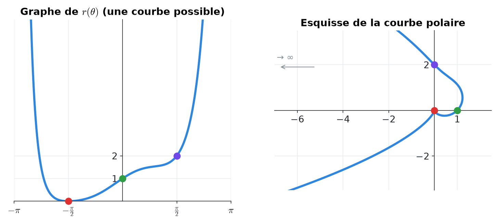
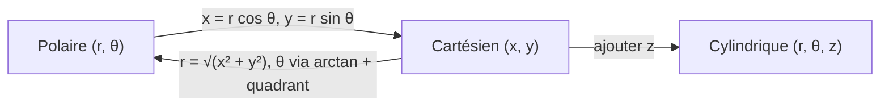
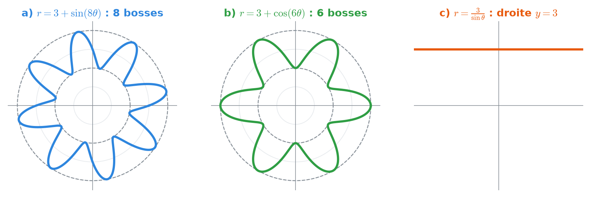
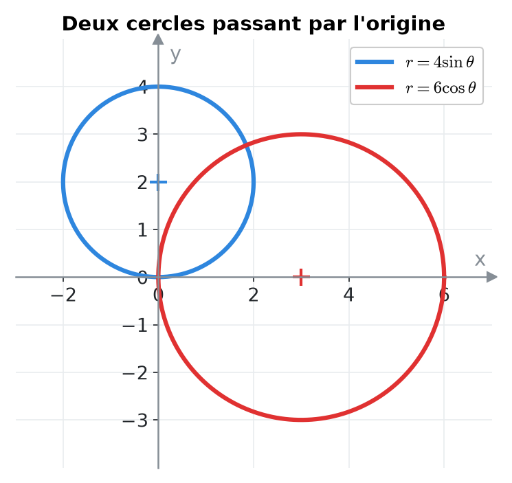

# 13. Coordonnées polaires et courbes polaires


**Objectif** : convertir entre coordonnées cartésiennes et polaires (ou cylindriques), reconnaître une courbe polaire r(θ) à partir de sa formule, et esquisser une courbe à partir du graphe de r en fonction de θ. C'est l'exercice <mark style="color:blue;">« Courbes polaires »</mark> des TE F-2.


---

## 1. Introduction & définitions

### 1.1 Repérer un point par une distance et un angle

Au lieu de donner (x ; y), on peut donner :

* <mark style="color:red;">r ≥ 0</mark> : la distance du point à l'origine ;
* <mark style="color:green;">θ</mark> : l'angle entre l'axe Ox positif et la demi-droite \[OP).

Ce sont les <mark style="color:blue;">coordonnées polaires</mark> (r ; θ). C'est exactement le module et l'argument d'un nombre complexe (chapitre 7).

<figure><figcaption></figcaption></figure>

<mark style="color:blue;">Polaire → cartésien</mark> :

$$\Large \boxed{x = r\cos\theta \qquad y = r\sin\theta}$$

<mark style="color:blue;">Cartésien → polaire</mark> :

$$\Large \boxed{r = \sqrt{x^2 + y^2} \qquad \tan\theta = \frac{y}{x}}$$


Comme pour l'argument d'un complexe, si <mark style="color:red;">x < 0</mark> il faut <mark style="color:red;">ajouter π</mark> à arctan(y/x).


### 1.2 Coordonnées cylindriques (dans l'espace)

On garde la hauteur z et on passe en polaire dans le plan horizontal :

$$\Large (r\,;\,\theta\,;\,z) \qquad x = r\cos\theta \quad y = r\sin\theta \quad z = z$$

<figure><figcaption></figcaption></figure>

### 1.3 Courbes polaires

Une <mark style="color:blue;">courbe polaire</mark> est l'ensemble des points (r(θ) ; θ) lorsque θ parcourt un intervalle. On la lit comme un <mark style="color:green;">radar</mark> : pour chaque direction θ, on s'éloigne de l'origine de la distance r(θ).

| Équation polaire | Équation cartésienne | Courbe |
| --- | --- | --- |
| $$r = R$$ | $$x^2 + y^2 = R^2$$ | cercle de centre O |
| $$\theta = \theta_0$$ | $$y = \tan(\theta_0)\,x$$ | demi-droite issue de O |
| $$r = \frac{c}{a\cos\theta + b\sin\theta}$$ | $$ax + by = c$$ | droite |
| $$r = 2a\sin\theta$$ | $$x^2 + (y - a)^2 = a^2$$ | cercle passant par O |
| $$r = a + b\cos(n\theta)$$, a > b > 0 | | « fleur » à n bosses |
| $$r = a\,\theta$$ | | spirale d'Archimède |

### 1.4 Lire une courbe polaire

* <mark style="color:blue;">Nombre de bosses</mark> : r = a + b cos(nθ) ou a + b sin(nθ) a pour période 2π/n, donc <mark style="color:green;">n bosses</mark> sur un tour. Avec un <mark style="color:red;">carré</mark> (cos²(nθ)), la période est divisée par 2 : <mark style="color:green;">2n bosses</mark>.
* <mark style="color:blue;">Rayon minimal / maximal</mark> : les bornes de r donnent le cercle intérieur et le cercle extérieur entre lesquels la courbe oscille.
* <mark style="color:blue;">Passage par l'origine</mark> : là où r(θ) = 0.
* <mark style="color:blue;">Symétries</mark> : si r(−θ) = r(θ), la courbe est symétrique par rapport à l'axe Ox.

---

## 2. Méthodes de résolution

### Méthode A — Associer une formule à un dessin

### Méthode B — Esquisser une courbe à partir du graphe r(θ)

1. Lire r pour des angles clés : θ = 0 (axe Ox positif), π/2 (axe Oy positif), ±π (axe Ox négatif), −π/2 (axe Oy négatif).
2. Repérer où <mark style="color:red;">r = 0</mark> (la courbe touche l'origine) et où <mark style="color:blue;">r → +∞</mark> (la courbe part à l'infini dans cette direction).
3. Relier les points en tournant dans le sens de θ croissant.

### Méthode C — Transformer une équation cartésienne en polaire (et inversement)

* Remplacer :

$$\large x = r\cos\theta \qquad y = r\sin\theta \qquad x^2 + y^2 = r^2$$

* Dans l'autre sens, <mark style="color:green;">multiplier par r</mark> si besoin pour faire apparaître r cos θ, r sin θ ou r².

---

## 3. Exemples de calculs détaillés

### Exemple 1 — Associer formules et dessins (TE F-2, 2026)

*Associer à chaque courbe le bon graphique :*

$$\large \text{a) } r = 1 + \sin(2\theta) \qquad \text{b) } r = \frac{2}{\cos\theta + 2\sin\theta} \qquad \text{c) } r = 2 + \cos^2(4\theta)$$

<figure><figcaption></figcaption></figure>

<mark style="color:orange;">b)</mark> On multiplie par le dénominateur :

$$\large r\cos\theta + 2r\sin\theta = 2 \iff x + 2y = 2$$

C'est une <mark style="color:green;">droite</mark> coupant les axes en (2 ; 0) et (0 ; 1).

<mark style="color:orange;">c)</mark> cos²(4θ) ∈ \[0, 1], donc r ∈ \[2, 3] : la courbe <mark style="color:red;">ne passe pas</mark> par l'origine et reste entre les cercles de rayons 2 et 3. La période de cos²(4θ) est π/4, donc 2π / (π/4) = 8 bosses. C'est une <mark style="color:green;">fleur à 8 bosses</mark>.

<mark style="color:orange;">a)</mark> r = 1 + sin(2θ) ∈ \[0, 2] :

* r = 0 quand sin(2θ) = −1, soit θ = −π/4 et θ = 3π/4 : la courbe <mark style="color:blue;">touche l'origine</mark> dans les directions des quadrants II et IV ;
* r = 2 (maximum) quand θ = π/4 ou 5π/4 : deux grands lobes dans les quadrants I et III.

C'est une courbe à <mark style="color:green;">deux lobes</mark> orientés selon la bissectrice y = x.

### Exemple 2 — Conversions

*a) Convertir P(r = 4 ; θ = 5π/6) en cartésien. b) Convertir Q(−2 ; −2√3) en polaire.*

<mark style="color:orange;">a)</mark>

$$\large x = 4\cos\frac{5\pi}{6} = -2\sqrt{3} \qquad y = 4\sin\frac{5\pi}{6} = 2 \quad\Rightarrow\quad \color{#2F9E44}P(-2\sqrt{3}\,;\,2)$$

<mark style="color:orange;">b)</mark> r = √(4 + 12) = 4. tan θ = √3, angle de référence π/3, mais Q est au <mark style="color:red;">quadrant III</mark> :

$$\large \theta = \frac{\pi}{3} + \pi = \color{#2F9E44}\frac{4\pi}{3} \quad \left(\text{ou } -\frac{2\pi}{3}\right)$$

### Exemple 3 — Coordonnées cylindriques (TE F-2, 2024)

*Le sommet G(10 ; 1,5 ; 10) d'un bâtiment : coordonnées cylindriques ?*

$$\large r = \sqrt{10^2 + 1{,}5^2} \approx \color{#2F9E44}10{,}11 \qquad \theta = \arctan\left(\frac{1{,}5}{10}\right) \approx \color{#2F9E44}0{,}149 \text{ rad} \approx 8{,}5° \qquad \color{#2F9E44}z = 10$$

(x > 0, donc pas de correction de quadrant.)

### Exemple 4 — Esquisse à partir du graphe r(θ) (TE F-2, 2026)

*On lit sur un graphe r(θ), pour −π < θ < π : r → +∞ quand θ → ±π ; r(−π/2) = 0 ; r(0) = 1 ; r(π/2) = 2.*

<mark style="color:orange;">1.</mark> θ = −π/2 : r = 0, la courbe passe par l'<mark style="color:red;">origine</mark>.

<mark style="color:orange;">2.</mark> θ = 0 : point <mark style="color:green;">(1 ; 0)</mark> sur l'axe Ox positif.

<mark style="color:orange;">3.</mark> θ = π/2 : point <mark style="color:purple;">(0 ; 2)</mark> sur l'axe Oy positif.

<mark style="color:orange;">4.</mark> θ → ±π : r → ∞ dans la direction de l'axe Ox <mark style="color:blue;">négatif</mark> : la courbe part vers la gauche.

On relie : partant de la gauche à l'infini (en dessous de l'axe, θ proche de −π), la courbe arrive à l'origine, passe par (1 ; 0), monte à (0 ; 2) puis repart vers la gauche à l'infini (au-dessus de l'axe).

<figure><figcaption>
Une fonction r(θ) possible vérifiant les données, et la courbe polaire correspondante.
</figcaption></figure>

---

## 4. Visualisation : conversions

---

## 5. Exercices pratiques

### Exercice 1 — Conversions

a) Convertir en cartésien : A(r = 2 ; θ = −3π/4). b) Convertir en polaire : B(0 ; −5) et C(−√3 ; 1).

Cliquez pour voir l'indice

Pour C, placez le point : il est au quadrant II. L'angle de référence vient de tan θ = 1 / (−√3).

Solution détaillée

<mark style="color:orange;">a)</mark>

$$\large x = 2\cos\left(-\frac{3\pi}{4}\right) = -\sqrt{2} \qquad y = 2\sin\left(-\frac{3\pi}{4}\right) = -\sqrt{2} \quad\Rightarrow\quad \color{#2F9E44}A(-\sqrt{2}\,;\,-\sqrt{2})$$

<mark style="color:orange;">b)</mark> B est sur l'axe Oy négatif : <mark style="color:green;">r = 5, θ = −π/2</mark> (ou 3π/2).

C : r = √(3 + 1) = 2 ; arctan(1/(−√3)) = −π/6, puis correction (<mark style="color:red;">quadrant II</mark>) :

$$\large \theta = -\frac{\pi}{6} + \pi = \color{#2F9E44}\frac{5\pi}{6}$$

### Exercice 2 — Reconnaître des courbes (TE F-2, 2023)

Décrire (nombre de bosses, rayons extrêmes, passage par l'origine) :

$$\large \text{a) } r = 3 + \sin(8\theta) \qquad \text{b) } r = 3 + \cos(6\theta) \qquad \text{c) } r = \frac{3}{\sin\theta}$$

Cliquez pour voir l'indice

Pour a) et b), calculez la période de la fonction trigonométrique et les bornes de r. Pour c), multipliez par sin θ.

Solution détaillée

<mark style="color:orange;">a)</mark> Période 2π/8 = π/4 : <mark style="color:green;">8 bosses</mark> ; r ∈ \[2, 4] ; pas de passage par l'origine. Les sommets sont en θ = π/16 + kπ/4 (là où sin(8θ) = 1).

<mark style="color:orange;">b)</mark> Période π/3 : <mark style="color:green;">6 bosses</mark> ; r ∈ \[2, 4] ; un sommet sur l'axe Ox positif (θ = 0 donne r = 4).

<mark style="color:orange;">c)</mark> r sin θ = 3 ⟺ y = 3 : la <mark style="color:green;">droite horizontale y = 3</mark>.

<figure><figcaption></figcaption></figure>

### Exercice 3 — Cartésien vers polaire

Écrire en polaire : a) le cercle x² + y² = 4y ; b) la droite x − y = 2. Puis écrire en cartésien : c) r = 6 cos θ.

Cliquez pour voir l'indice

Remplacez x² + y² par r² et y par r sin θ. Pour c), multipliez les deux membres par r.

Solution détaillée

<mark style="color:orange;">a)</mark> On simplifie par r (l'origine, r = 0, est déjà sur la courbe pour θ = 0) :

$$\large r^2 = 4r\sin\theta \iff \color{#2F9E44}r = 4\sin\theta$$

C'est le cercle de centre (0 ; 2) et de rayon 2.

<mark style="color:orange;">b)</mark>

$$\large r\cos\theta - r\sin\theta = 2 \iff \color{#2F9E44}r = \frac{2}{\cos\theta - \sin\theta}$$

<mark style="color:orange;">c)</mark>

$$\large r^2 = 6r\cos\theta \iff x^2 + y^2 = 6x \iff \color{#2F9E44}(x - 3)^2 + y^2 = 9$$

Cercle de centre (3 ; 0) et de rayon 3.

<figure><figcaption></figcaption></figure>

