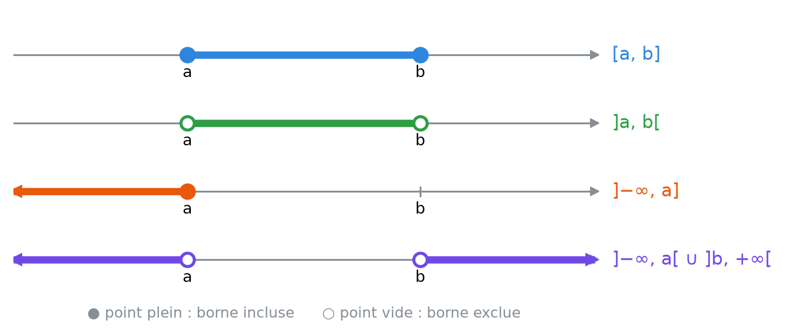
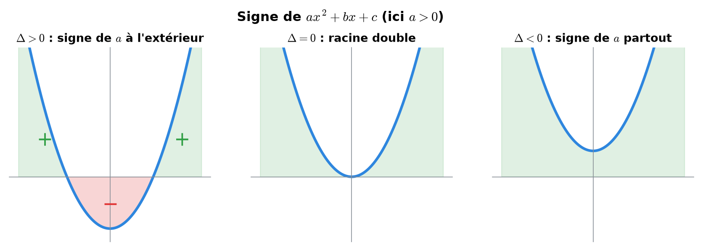
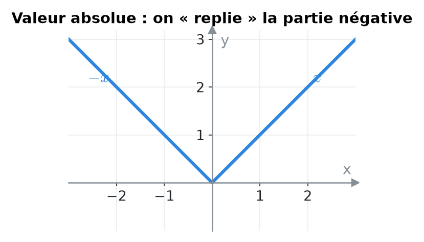
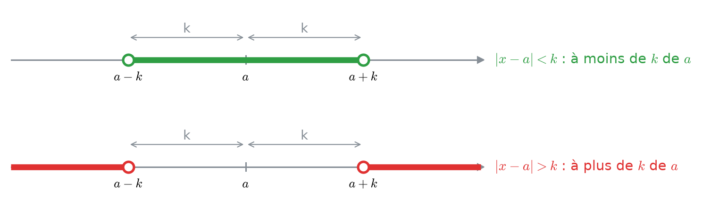
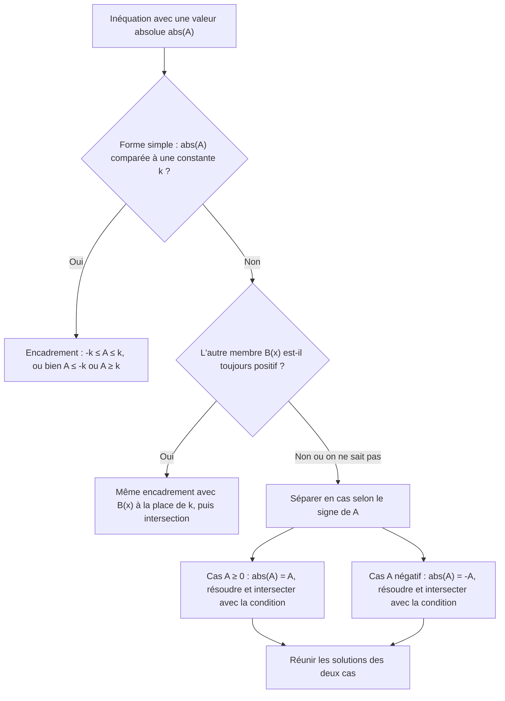
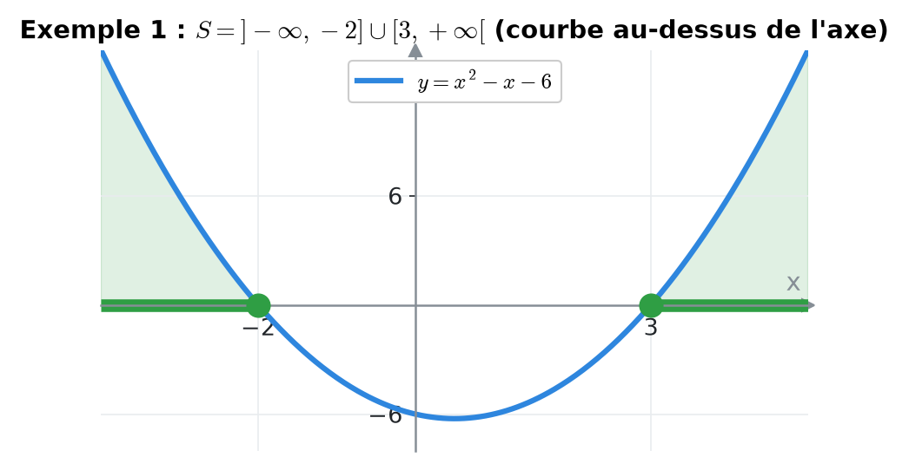
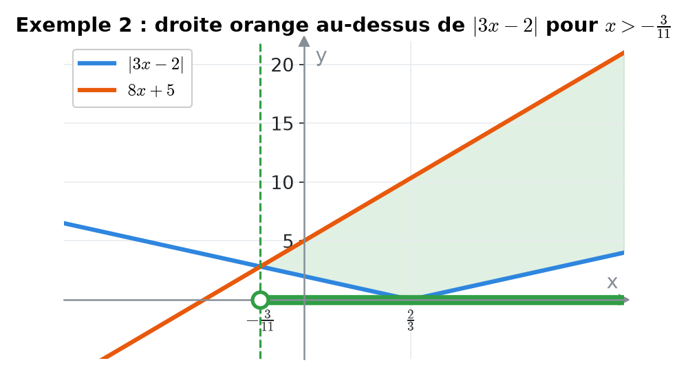
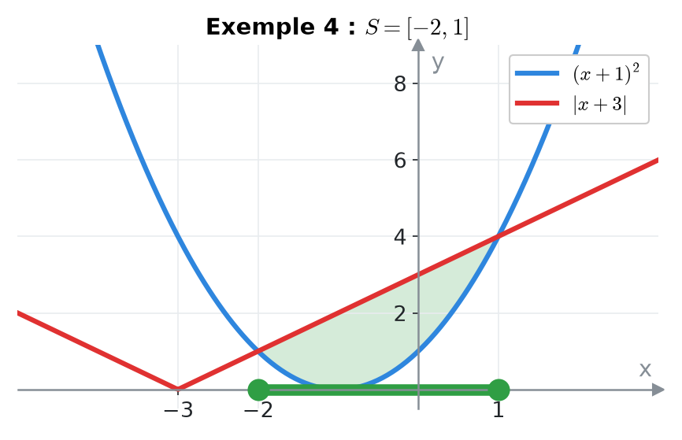
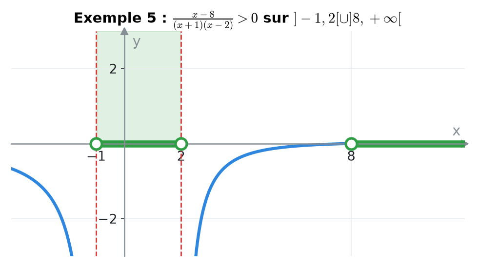
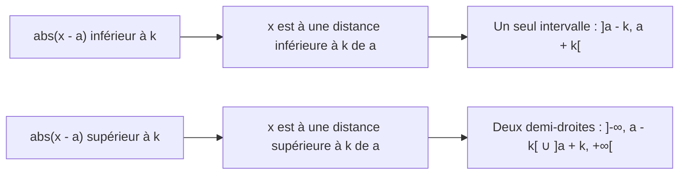

# 1. Inéquations, tableaux de signes et valeurs absolues


**Objectif** : résoudre toute inéquation polynomiale, rationnelle ou avec valeur absolue, et écrire la solution sous forme d'<mark style="color:blue;">intervalles</mark>. C'est la première question de <mark style="color:blue;">presque tous</mark> les travaux écrits d'Analyse 1 (TE 1 « Révision et limites », « Inéquations »).


---

## 1. Introduction & définitions

### 1.1 Inéquation et ensemble solution

Une <mark style="color:blue;">inéquation</mark> compare deux expressions avec <, ≤, > ou ≥. La résoudre, c'est trouver <mark style="color:green;">l'ensemble S de tous les réels</mark> qui la vérifient. On l'écrit avec des intervalles :

| Notation | Signification |
| --- | --- |
| \[a, b] | a ≤ x ≤ b (bornes incluses) |
| ]a, b\[ | a < x < b (bornes exclues) |
| ]−∞, a] | x ≤ a (∞ est <mark style="color:red;">toujours</mark> exclu) |
| A ∪ B | x est dans A <mark style="color:blue;">ou</mark> dans B |
| ℝ ∖ {a} | tous les réels sauf a |
| ∅ | aucune solution |

<figure><figcaption>
Crochet tourné vers l'intérieur = point plein (inclus) ; vers l'extérieur = point vide (exclu).
</figcaption></figure>

### 1.2 Règles de manipulation

* On peut <mark style="color:green;">ajouter</mark> ou <mark style="color:green;">soustraire</mark> le même nombre aux deux membres.
* On peut <mark style="color:green;">multiplier</mark> ou <mark style="color:green;">diviser</mark> par un nombre <mark style="color:green;">positif</mark> sans changer le sens.
* Multiplier ou diviser par un nombre <mark style="color:red;">négatif inverse le sens</mark> :

$$\Large -2x < 6 \iff x > -3$$


On ne multiplie <mark style="color:red;">jamais</mark> par une expression contenant x dont on ne connaît pas le signe (par exemple un dénominateur x − 2). On passe tout du même côté et on fait un <mark style="color:green;">tableau de signes</mark>.


### 1.3 Signe d'un facteur du premier degré et d'un trinôme

<mark style="color:blue;">Facteur affine</mark> ax + b : il s'annule en x = −b/a ; il a le <mark style="color:green;">signe de a à droite</mark> de cette racine et le signe contraire à gauche.

<mark style="color:blue;">Trinôme</mark> ax² + bx + c, de discriminant :

$$\Large \Delta = b^2 - 4ac$$

* si Δ > 0 : deux racines x₁ < x₂ ; le trinôme a le <mark style="color:green;">signe de a à l'extérieur</mark> des racines et le signe contraire <mark style="color:red;">entre</mark> elles ;
* si Δ = 0 : une racine double ; signe de a partout ailleurs ;
* si Δ < 0 : aucune racine ; <mark style="color:green;">signe de a partout</mark>.

<figure><figcaption>
Vert : trinôme positif ; rouge : trinôme négatif.
</figcaption></figure>

### 1.4 Valeur absolue

$$\Large \lvert A \rvert = \begin{cases} A & \text{si } A \geq 0 \\ -A & \text{si } A < 0 \end{cases}$$

<figure><figcaption></figcaption></figure>

Géométriquement, |x − a| est la <mark style="color:blue;">distance</mark> entre x et a sur la droite réelle. Pour k > 0 :

$$\Large \boxed{\lvert A \rvert < k \iff -k < A < k} \qquad \boxed{\lvert A \rvert > k \iff A < -k \ \text{ ou } \ A > k}$$

<figure><figcaption>
« Plus petit que k » donne un seul intervalle ; « plus grand que k » donne deux demi-droites.
</figcaption></figure>

Si k < 0 : |A| < k n'a <mark style="color:red;">aucune</mark> solution et |A| > k est <mark style="color:green;">toujours</mark> vraie. Ces équivalences restent valables si k est une expression B(x) <mark style="color:blue;">positive</mark>.

---

## 2. Méthodes de résolution

### Méthode A — Inéquation polynomiale ou rationnelle

1. Tout passer <mark style="color:blue;">d'un seul côté</mark> : expression □ 0.
2. Mettre au <mark style="color:blue;">même dénominateur</mark> si besoin.
3. <mark style="color:blue;">Factoriser</mark> numérateur et dénominateur au maximum.
4. Chercher les <mark style="color:green;">valeurs critiques</mark> (zéros de chaque facteur) ; marquer les valeurs <mark style="color:red;">interdites</mark> (zéros du dénominateur).
5. Construire le <mark style="color:green;">tableau de signes</mark> : une ligne par facteur, une ligne pour le produit/quotient.
6. Lire les intervalles ; les valeurs interdites sont <mark style="color:red;">toujours exclues</mark>.

### Méthode B — Inéquation avec valeur absolue

### Méthode C — Encadrement double

Pour a ≤ … ≤ b, on applique <mark style="color:blue;">la même opération aux trois membres</mark> (et on inverse les deux signes si l'on multiplie par un négatif).

---

## 3. Exemples de calculs détaillés

### Exemple 1 — Inéquation du second degré (TE 1, 2024)

$$\Large x^2 - x \geq 6$$

<mark style="color:orange;">1.</mark> Un seul côté : x² − x − 6 ≥ 0.

<mark style="color:orange;">2.</mark> Factorisation :

$$\large x = \frac{1 \pm\sqrt{1 + 24}}{2} = \frac{1 \pm 5}{2} \in \{3\,;\,-2\} \quad\Rightarrow\quad (x - 3)(x + 2) \geq 0$$

<mark style="color:orange;">3.</mark> Tableau de signes :

| x | −∞ … −2 | −2 | −2 … 3 | 3 | 3 … +∞ |
| --- | --- | --- | --- | --- | --- |
| x + 2 | <mark style="color:red;">−</mark> | 0 | <mark style="color:green;">+</mark> | <mark style="color:green;">+</mark> | <mark style="color:green;">+</mark> |
| x − 3 | <mark style="color:red;">−</mark> | <mark style="color:red;">−</mark> | <mark style="color:red;">−</mark> | 0 | <mark style="color:green;">+</mark> |
| produit | <mark style="color:green;">+</mark> | 0 | <mark style="color:red;">−</mark> | 0 | <mark style="color:green;">+</mark> |

$$\Large \color{#2F9E44} S = \left]-\infty, -2\right] \cup \left[3, +\infty\right[$$

<figure><figcaption>
La solution correspond aux x où la parabole est au-dessus de l'axe.
</figcaption></figure>

### Exemple 2 — Valeur absolue contre expression affine (TE 1, 2024)

$$\Large \lvert 3x - 2 \rvert < 8x + 5$$

L'autre membre 8x + 5 peut être négatif : on <mark style="color:blue;">sépare en cas</mark> selon le signe de 3x − 2 (qui change en x = 2/3).

<mark style="color:orange;">Cas 1 : x ≥ 2/3</mark>, alors |3x − 2| = 3x − 2 :

$$\large 3x - 2 < 8x + 5 \iff -7 < 5x \iff x > -\frac{7}{5}$$

Avec la condition x ≥ 2/3 :

$$\large S_1 = \left[\frac{2}{3}, +\infty\right[$$

<mark style="color:orange;">Cas 2 : x < 2/3</mark>, alors |3x − 2| = −3x + 2 :

$$\large -3x + 2 < 8x + 5 \iff -3 < 11x \iff x > -\frac{3}{11}$$

Avec la condition :

$$\large S_2 = \left]-\frac{3}{11}, \frac{2}{3}\right[$$

<mark style="color:orange;">Réunion</mark> :

$$\Large \color{#2F9E44} S = S_1 \cup S_2 = \left]-\frac{3}{11}, +\infty\right[$$

<figure><figcaption></figcaption></figure>

### Exemple 3 — Le membre de droite est toujours positif (TE 2, 2019)

$$\Large \lvert 3x - 5 \rvert < x^2 - 3x + 4$$

<mark style="color:orange;">1.</mark> x² − 3x + 4 a pour discriminant 9 − 16 < 0 et a = 1 > 0 : il est <mark style="color:green;">toujours positif</mark>. On peut donc encadrer :

$$\large -(x^2 - 3x + 4) < 3x - 5 < x^2 - 3x + 4$$

<mark style="color:orange;">2. Inégalité de droite</mark> :

$$\large 0 < x^2 - 6x + 9 = (x - 3)^2 \qquad \text{vraie pour tout } x \neq 3$$

<mark style="color:orange;">3. Inégalité de gauche</mark> :

$$\large -x^2 + 3x - 4 < 3x - 5 \iff 1 < x^2 \iff x < -1 \ \text{ ou } \ x > 1$$

<mark style="color:orange;">4. Intersection</mark> des deux conditions :

$$\Large \color{#2F9E44} S = \left]-\infty, -1\right[ \cup \left]1, 3\right[ \cup \left]3, +\infty\right[$$

### Exemple 4 — Carré contre valeur absolue (TE, 2025)

$$\Large (x + 1)^2 \leq \lvert x + 3 \rvert$$

<mark style="color:orange;">Cas 1 : x ≥ −3</mark> :

$$\large x^2 + 2x + 1 \leq x + 3 \iff x^2 + x - 2 \leq 0 \iff (x + 2)(x - 1) \leq 0 \iff x \in [-2, 1]$$

Tout cet intervalle respecte x ≥ −3 : S₁ = \[−2, 1].

<mark style="color:orange;">Cas 2 : x < −3</mark> :

$$\large x^2 + 2x + 1 \leq -x - 3 \iff x^2 + 3x + 4 \leq 0$$

Discriminant 9 − 16 < 0 et a > 0 : le trinôme est toujours <mark style="color:red;">strictement positif</mark>. S₂ = ∅.

$$\Large \color{#2F9E44} S = [-2, 1]$$

<figure><figcaption></figcaption></figure>

### Exemple 5 — Inéquation rationnelle (TE, 2023)

$$\Large \frac{3}{x + 1} > \frac{2}{x - 2}$$

<mark style="color:orange;">1.</mark> Valeurs <mark style="color:red;">interdites</mark> : x ≠ −1 et x ≠ 2.

<mark style="color:orange;">2.</mark> Un seul côté, même dénominateur :

$$\large \frac{3}{x + 1} - \frac{2}{x - 2} > 0 \iff \frac{3(x - 2) - 2(x + 1)}{(x + 1)(x - 2)} > 0 \iff \frac{x - 8}{(x + 1)(x - 2)} > 0$$

<mark style="color:orange;">3.</mark> Tableau de signes (valeurs critiques −1, 2, 8) :

| x | x < −1 | −1 < x < 2 | 2 < x < 8 | x > 8 |
| --- | --- | --- | --- | --- |
| x − 8 | <mark style="color:red;">−</mark> | <mark style="color:red;">−</mark> | <mark style="color:red;">−</mark> | <mark style="color:green;">+</mark> |
| x + 1 | <mark style="color:red;">−</mark> | <mark style="color:green;">+</mark> | <mark style="color:green;">+</mark> | <mark style="color:green;">+</mark> |
| x − 2 | <mark style="color:red;">−</mark> | <mark style="color:red;">−</mark> | <mark style="color:green;">+</mark> | <mark style="color:green;">+</mark> |
| quotient | <mark style="color:red;">−</mark> | <mark style="color:green;">+</mark> | <mark style="color:red;">−</mark> | <mark style="color:green;">+</mark> |

$$\Large \color{#2F9E44} S = \left]-1, 2\right[ \cup \left]8, +\infty\right[$$

<figure><figcaption></figcaption></figure>


Erreur classique : « produit en croix » 3(x − 2) > 2(x + 1). C'est <mark style="color:red;">faux</mark>, car on a multiplié par (x + 1)(x − 2) dont le signe varie !


---

## 4. Visualisation : la valeur absolue comme distance

---

## 5. Exercices pratiques

### Exercice 1 — (TE 1, 2022)

Résoudre et écrire la solution sous forme d'intervalles :

$$\large \text{a) } -\frac{1}{2} \leq \frac{2x + 3}{5} < \frac{3}{2} \qquad \text{b) } \lvert 2x - 9 \rvert > 3 \qquad \text{c) } \lvert 16 - 3y \rvert \leq 5$$

Cliquez pour voir l'indice

a) Multipliez les trois membres par 5, soustrayez 3, divisez par 2. c) Attention : diviser par −3 inverse les deux inégalités.

Solution détaillée

<mark style="color:orange;">a)</mark>

$$\large -\frac{5}{2} \leq 2x + 3 < \frac{15}{2} \iff -\frac{11}{2} \leq 2x < \frac{9}{2} \iff -\frac{11}{4} \leq x < \frac{9}{4} \qquad \color{#2F9E44}S = \left[-\frac{11}{4}, \frac{9}{4}\right[$$

<mark style="color:orange;">b)</mark> 2x − 9 > 3 ou 2x − 9 < −3, soit x > 6 ou x < 3 :

$$\large \color{#2F9E44}S = \left]-\infty, 3\right[ \cup \left]6, +\infty\right[$$

<mark style="color:orange;">c)</mark> Diviser par −3 <mark style="color:red;">inverse</mark> le sens :

$$\large -5 \leq 16 - 3y \leq 5 \iff -21 \leq -3y \leq -11 \iff \frac{11}{3} \leq y \leq 7 \qquad \color{#2F9E44}S = \left[\frac{11}{3}, 7\right]$$

### Exercice 2 — (TE 1, 2019)

Résoudre :

$$\large \text{a) } x^2 + 3x \geq -2 \qquad \text{b) } \frac{-2}{\lvert x - 4 \rvert} < -3 \qquad \text{c) } 5x^2 < -2$$

Cliquez pour voir l'indice

b) Multipliez par −1 (le sens change), puis remarquez que |x − 4| > 0 : on peut alors multiplier par |x − 4| sans danger.

Solution détaillée

<mark style="color:orange;">a)</mark> x² + 3x + 2 ≥ 0 ⟺ (x + 1)(x + 2) ≥ 0. Le trinôme (a > 0) est positif à l'extérieur des racines :

$$\large \color{#2F9E44}S = \left]-\infty, -2\right] \cup \left[-1, +\infty\right[$$

<mark style="color:orange;">b)</mark> Valeur interdite x = 4. On obtient 2/|x − 4| > 3 ; comme |x − 4| > 0 :

$$\large 2 > 3\lvert x - 4 \rvert \iff \lvert x - 4 \rvert < \frac{2}{3} \iff \frac{10}{3} < x < \frac{14}{3}$$

On retire 4 :

$$\large \color{#2F9E44}S = \left]\frac{10}{3}, 4\right[ \cup \left]4, \frac{14}{3}\right[$$

<mark style="color:orange;">c)</mark> 5x² ≥ 0 > −2 pour tout x : un carré ne peut pas être négatif. <mark style="color:green;">S = ∅</mark>.

### Exercice 3 — (TE, 2023)

Résoudre :

$$\large \text{a) } x^3 - 4x^2 < -3x \qquad \text{b) } \ln(x) > \ln(5x - 2)$$

Cliquez pour voir l'indice

a) Factorisez par x. b) Déterminez d'abord le domaine (arguments des logarithmes strictement positifs), puis utilisez que ln est strictement croissante.

Solution détaillée

<mark style="color:orange;">a)</mark> Factorisation :

$$\large x^3 - 4x^2 + 3x < 0 \iff x(x - 1)(x - 3) < 0$$

| x | x < 0 | 0 < x < 1 | 1 < x < 3 | x > 3 |
| --- | --- | --- | --- | --- |
| x | <mark style="color:red;">−</mark> | <mark style="color:green;">+</mark> | <mark style="color:green;">+</mark> | <mark style="color:green;">+</mark> |
| x − 1 | <mark style="color:red;">−</mark> | <mark style="color:red;">−</mark> | <mark style="color:green;">+</mark> | <mark style="color:green;">+</mark> |
| x − 3 | <mark style="color:red;">−</mark> | <mark style="color:red;">−</mark> | <mark style="color:red;">−</mark> | <mark style="color:green;">+</mark> |
| produit | <mark style="color:red;">−</mark> | <mark style="color:green;">+</mark> | <mark style="color:red;">−</mark> | <mark style="color:green;">+</mark> |

$$\large \color{#2F9E44}S = \left]-\infty, 0\right[ \cup \left]1, 3\right[$$

<mark style="color:orange;">b)</mark> Domaine : x > 0 et 5x − 2 > 0, donc x > 2/5. Comme ln est strictement croissante :

$$\large x > 5x - 2 \iff x < \frac{1}{2} \qquad \color{#2F9E44}S = \left]\frac{2}{5}, \frac{1}{2}\right[$$

