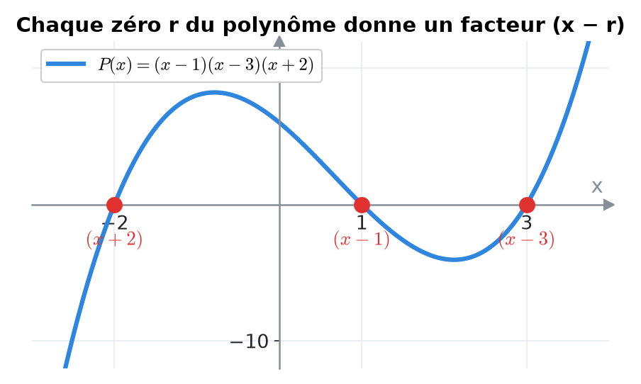
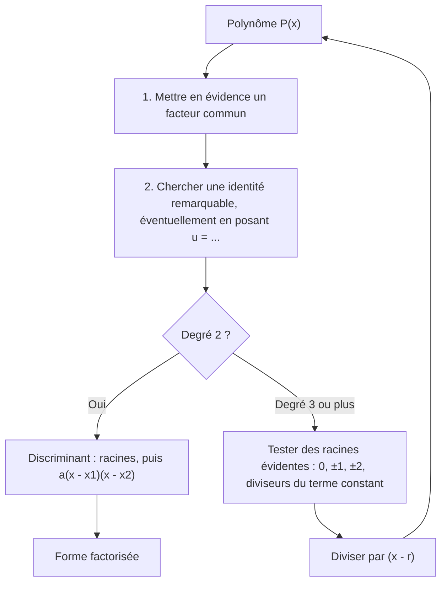
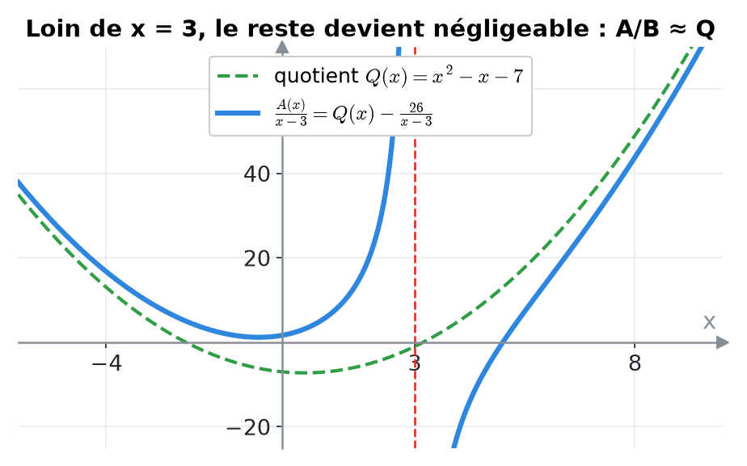
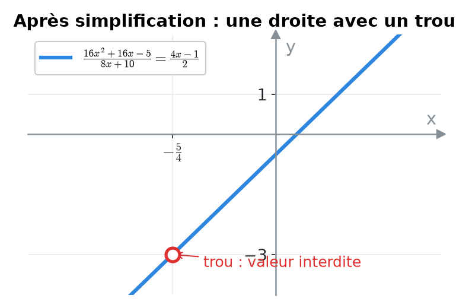
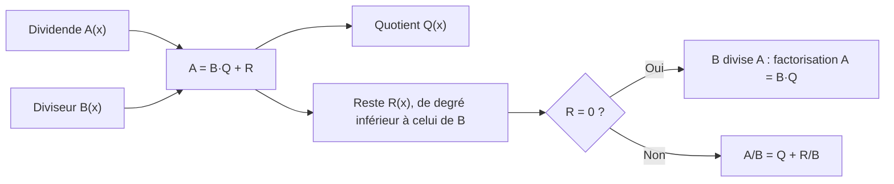

# 2. Polynômes : factorisation et division polynomiale


**Objectif** : factoriser un polynôme en facteurs du premier degré, effectuer une division polynomiale (euclidienne), et simplifier des fractions rationnelles. Ces techniques servent <mark style="color:blue;">partout</mark> : tableaux de signes, limites indéterminées 0/0, dérivées. C'est « Produit de facteurs » et « Division polynomiale » du TE 1.


---

## 1. Introduction & définitions

### 1.1 Polynômes

Un <mark style="color:blue;">polynôme</mark> de degré n est une expression :

$$\Large P(x) = a_nx^n + a_{n-1}x^{n-1} + \dots + a_1x + a_0, \qquad a_n \neq 0$$

Un <mark style="color:blue;">zéro</mark> (ou racine) de P est un réel r tel que P(r) = 0.

### 1.2 Théorème du facteur


r est un zéro de P <mark style="color:green;">si et seulement si</mark> (x − r) divise P(x) :

$$P(x) = (x - r)\,Q(x) \qquad \deg Q = n - 1$$


C'est la clé de la factorisation : <mark style="color:green;">chaque zéro trouvé fournit un facteur</mark>.

<figure><figcaption>
Les zéros se lisent là où la courbe coupe l'axe des x.
</figcaption></figure>

### 1.3 Division euclidienne

Pour deux polynômes A et B (B ≠ 0), il existe un unique <mark style="color:blue;">quotient</mark> Q et un unique <mark style="color:red;">reste</mark> R tels que :

$$\Large \boxed{A(x) = B(x)\,Q(x) + R(x), \qquad \deg R < \deg B}$$

En divisant par B :

$$\Large \frac{A(x)}{B(x)} = Q(x) + \frac{R(x)}{B(x)}$$

<mark style="color:green;">Théorème du reste</mark> : si B(x) = x − r, le reste est un nombre et vaut R = A(r).

### 1.4 Outils de factorisation

| Outil | Formule |
| --- | --- |
| Facteur commun | $$ab + ac = a(b + c)$$ |
| Identités remarquables | $$a^2 \pm 2ab + b^2 = (a \pm b)^2 \qquad a^2 - b^2 = (a - b)(a + b)$$ |
| Trinôme (Δ ≥ 0) | $$ax^2 + bx + c = a(x - x_1)(x - x_2), \quad x_{1,2} = \frac{-b \pm\sqrt{\Delta}}{2a}$$ |
| Cube | $$a^3 \mp b^3 = (a \mp b)(a^2 \pm ab + b^2)$$ |
| Racine évidente r | division par (x − r) |

Un trinôme de discriminant <mark style="color:red;">négatif</mark> ne se factorise <mark style="color:red;">pas</mark> dans ℝ : il est « irréductible ».

---

## 2. Méthodes de résolution

### Méthode A — Factoriser au maximum

### Méthode B — Division polynomiale « en potence »

1. Ordonner A et B par <mark style="color:blue;">puissances décroissantes</mark>, en écrivant les termes manquants avec un coefficient 0.
2. Diviser le <mark style="color:blue;">terme de plus haut degré</mark> de A par celui de B : c'est le premier terme du quotient.
3. Multiplier B par ce terme et <mark style="color:red;">soustraire</mark> le résultat de A.
4. Recommencer avec le reste obtenu, tant que son degré est ≥ deg B.
5. <mark style="color:green;">Vérifier</mark> : B · Q + R doit redonner A.

### Méthode C — Schéma de Horner (division par x − r)

On écrit les coefficients de A ; on abaisse le premier ; puis on répète <mark style="color:blue;">« multiplier par r, ajouter au coefficient suivant »</mark>. Les nombres obtenus sont les coefficients du quotient, le dernier est le reste.

---

## 3. Exemples de calculs détaillés

### Exemple 1 — Produit de facteurs (TE 1, 2024)

*Écrire comme produit de facteurs du premier degré :*

$$\Large (4x + 5)^2 - 2(4x + 5) + 1$$

<mark style="color:orange;">Idée</mark> : l'expression (4x + 5) se répète. Posons u = 4x + 5 :

$$\large u^2 - 2u + 1 = (u - 1)^2$$

C'est l'identité remarquable (a − b)². On revient à x :

$$\large (4x + 5 - 1)^2 = (4x + 4)^2 = \left[4(x + 1)\right]^2 = \color{#2F9E44}16(x + 1)^2$$


Développer d'abord marche aussi, mais est plus long et plus risqué. <mark style="color:green;">Repérez les blocs qui se répètent.</mark>


### Exemple 2 — Division polynomiale (TE 1, 2024)

*Compléter l'égalité :*

$$\Large \frac{x^3 - 4x^2 - 4x - 5}{x - 3} = \dots$$

<mark style="color:orange;">Étape 1</mark> : x³ / x = x². On soustrait x²(x − 3) = x³ − 3x² :

$$\large (x^3 - 4x^2 - 4x - 5) - (x^3 - 3x^2) = -x^2 - 4x - 5$$

<mark style="color:orange;">Étape 2</mark> : −x² / x = −x. On soustrait −x(x − 3) = −x² + 3x :

$$\large (-x^2 - 4x - 5) - (-x^2 + 3x) = -7x - 5$$

<mark style="color:orange;">Étape 3</mark> : −7x / x = −7. On soustrait −7(x − 3) = −7x + 21 :

$$\large (-7x - 5) - (-7x + 21) = -26$$

Le reste −26 est de degré 0 < 1 : on s'arrête. <mark style="color:blue;">Quotient</mark> Q = x² − x − 7, <mark style="color:red;">reste</mark> R = −26 :

$$\Large \color{#2F9E44}\frac{x^3 - 4x^2 - 4x - 5}{x - 3} = x^2 - x - 7 - \frac{26}{x - 3}$$

<mark style="color:blue;">Vérification par le théorème du reste</mark> : A(3) = 27 − 36 − 12 − 5 = −26 ✓.

<mark style="color:blue;">Même calcul par Horner</mark> (coefficients 1, −4, −4, −5 et r = 3) :

| | 1 | −4 | −4 | −5 |
| --- | --- | --- | --- | --- |
| × 3 | | 3 | −3 | −21 |
| somme | <mark style="color:blue;">1</mark> | <mark style="color:blue;">−1</mark> | <mark style="color:blue;">−7</mark> | <mark style="color:red;">−26</mark> |

On lit Q = x² − x − 7 et R = −26 ✓.

<figure><figcaption>
Loin de x = 3, la fraction se comporte comme son quotient Q.
</figcaption></figure>

### Exemple 3 — Factorisation par racine évidente

*Factoriser :*

$$\Large P(x) = x^3 - 2x^2 - 5x + 6$$

<mark style="color:orange;">1.</mark> On teste x = 1 : 1 − 2 − 5 + 6 = 0. Donc (x − 1) est un facteur.

<mark style="color:orange;">2.</mark> Horner avec r = 1 sur 1, −2, −5, 6 : on obtient 1, −1, −6 et reste 0. Donc :

$$\large P(x) = (x - 1)(x^2 - x - 6)$$

<mark style="color:orange;">3.</mark> x² − x − 6 = (x − 3)(x + 2) (racines 3 et −2).

$$\Large \color{#2F9E44}P(x) = (x - 1)(x - 3)(x + 2)$$

### Exemple 4 — Préparer une limite (Test 1, 2023)

*Factoriser 16x² + 16x − 5 pour calculer :*

$$\Large \lim_{x \to -5/4}\frac{16x^2 + 16x - 5}{8x + 10}$$

Le dénominateur s'annule en x = −5/4 ; si le numérateur aussi, (4x + 5) est un <mark style="color:blue;">facteur commun</mark>. On vérifie : 16 · 25/16 − 20 − 5 = 0 ✓.

Division de 16x² + 16x − 5 par 4x + 5 : 16x² ÷ 4x = 4x ; reste −4x − 5 ; puis −1 ; reste 0. Donc :

$$\large 16x^2 + 16x - 5 = (4x + 5)(4x - 1)$$

et la fraction se simplifie (voir chapitre 5) :

$$\large \frac{(4x + 5)(4x - 1)}{2(4x + 5)} = \color{#2F9E44}\frac{4x - 1}{2}$$

<figure><figcaption>
Le graphe de la fraction est une droite privée du point d'abscisse −5/4.
</figcaption></figure>

---

## 4. Visualisation : l'égalité de la division

---

## 5. Exercices pratiques

### Exercice 1 — Factoriser au maximum

Factoriser :

$$\large \text{a) } 3x^3 - 12x \qquad \text{b) } (2x - 1)^2 - (x + 3)^2 \qquad \text{c) } 2x^2 - 5x - 3$$

Cliquez pour voir l'indice

a) Facteur commun puis a² − b². b) C'est directement une différence de deux carrés. c) Discriminant.

Solution détaillée

<mark style="color:orange;">a)</mark>

$$\large 3x(x^2 - 4) = \color{#2F9E44}3x(x - 2)(x + 2)$$

<mark style="color:orange;">b)</mark> a² − b² = (a − b)(a + b) avec a = 2x − 1, b = x + 3 :

$$\large \left[(2x - 1) - (x + 3)\right]\left[(2x - 1) + (x + 3)\right] = \color{#2F9E44}(x - 4)(3x + 2)$$

<mark style="color:orange;">c)</mark> Δ = 25 + 24 = 49, racines (5 ± 7)/4, soit 3 et −1/2 :

$$\large 2x^2 - 5x - 3 = 2(x - 3)\left(x + \frac{1}{2}\right) = \color{#2F9E44}(x - 3)(2x + 1)$$

### Exercice 2 — Division polynomiale

Effectuer la division de A(x) par B(x), puis écrire A/B sous la forme Q(x) + R/B(x) :

$$\large A(x) = 2x^3 + 3x^2 - 5x + 7 \qquad B(x) = x + 2$$

Cliquez pour voir l'indice

Diviser par x + 2, c'est diviser par x − (−2) : utilisez Horner avec r = −2 et vérifiez que le reste vaut A(−2).

Solution détaillée

Horner avec r = −2 sur 2, 3, −5, 7 :

| | 2 | 3 | −5 | 7 |
| --- | --- | --- | --- | --- |
| × (−2) | | −4 | 2 | 6 |
| somme | <mark style="color:blue;">2</mark> | <mark style="color:blue;">−1</mark> | <mark style="color:blue;">−3</mark> | <mark style="color:red;">13</mark> |

Q(x) = 2x² − x − 3 et R = 13. Vérification : A(−2) = −16 + 12 + 10 + 7 = 13 ✓.

$$\Large \color{#2F9E44}\frac{2x^3 + 3x^2 - 5x + 7}{x + 2} = 2x^2 - x - 3 + \frac{13}{x + 2}$$

### Exercice 3 — Simplifier une fraction (TE 1, 2020)

Écrire sous la forme d'une seule fraction simplifiée :

$$\Large \frac{2x - 5}{x} - \frac{2x - 3}{x - 3}$$

Cliquez pour voir l'indice

Dénominateur commun x(x − 3). Développez soigneusement les deux produits au numérateur ; attention au signe « moins » devant la seconde fraction.

Solution détaillée

<mark style="color:orange;">1.</mark> Numérateur :

$$\large (2x - 5)(x - 3) - (2x - 3)x = (2x^2 - 11x + 15) - (2x^2 - 3x) = -8x + 15$$

<mark style="color:orange;">2.</mark> Résultat :

$$\Large \color{#2F9E44}\frac{2x - 5}{x} - \frac{2x - 3}{x - 3} = \frac{15 - 8x}{x(x - 3)}, \qquad x \neq 0,\ x \neq 3$$

