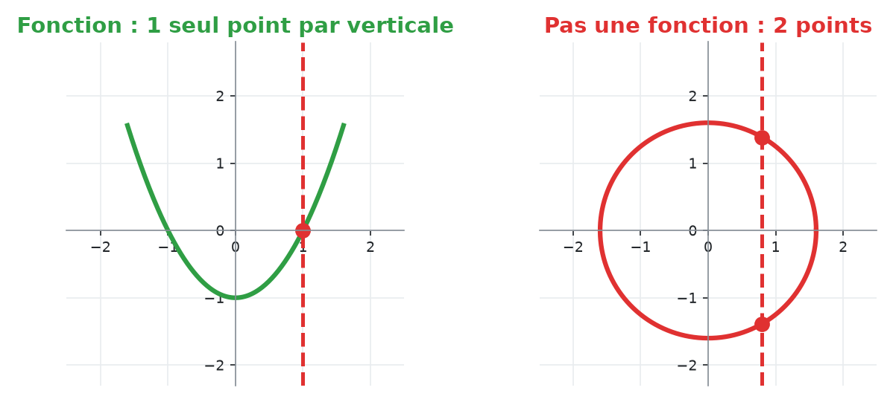
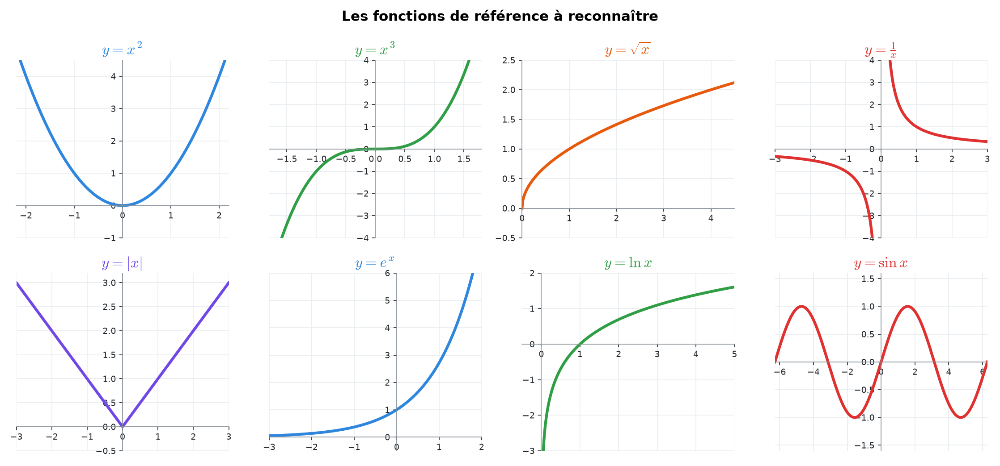
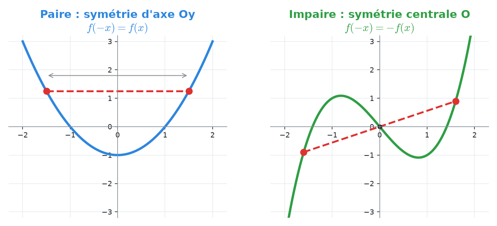
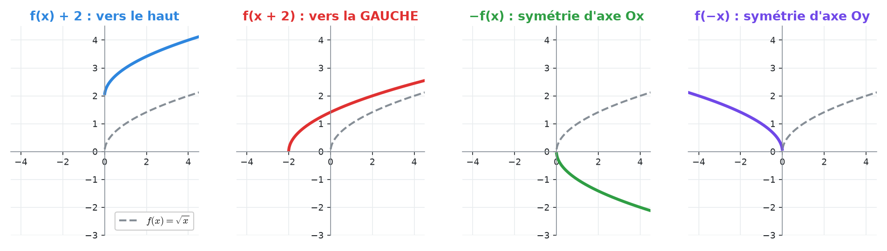
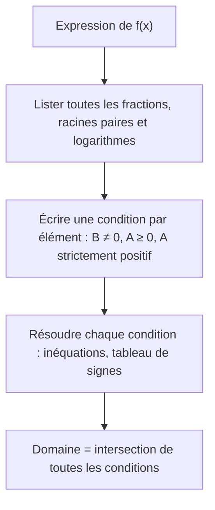
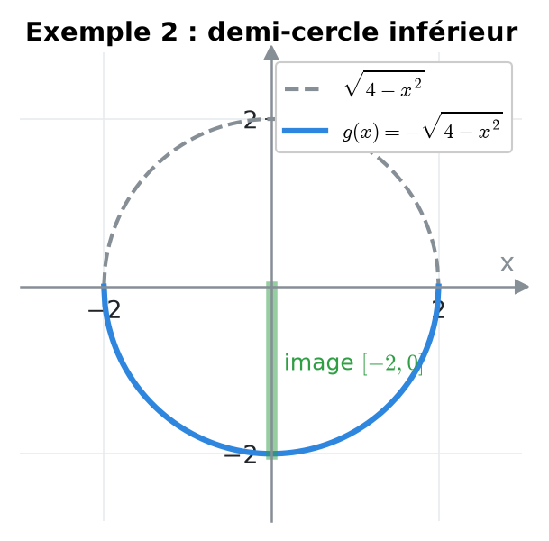
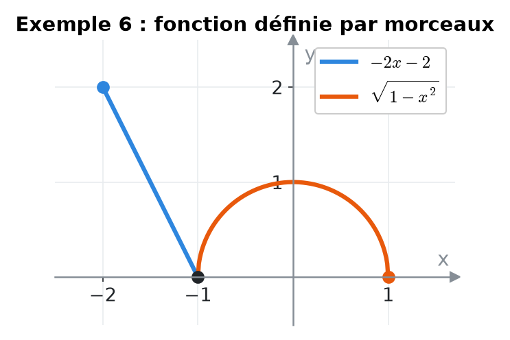
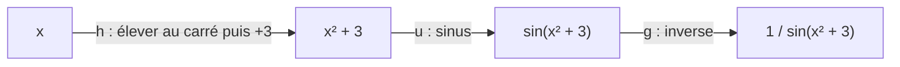
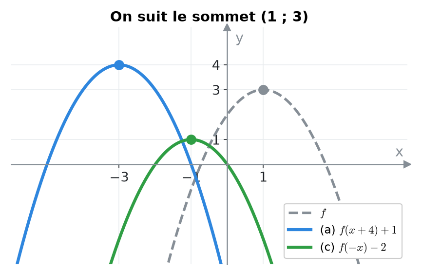

# 3. Fonctions : domaine, image, composition, parité et transformations


**Objectif** : déterminer le domaine de définition et l'image d'une fonction, composer et décomposer des fonctions, étudier la parité, reconnaître les transformations d'un graphe et écrire une fonction définie par morceaux. C'est le cœur du <mark style="color:blue;">« Travail écrit 1 »</mark> (2022) et du TE de novembre 2023.


---

## 1. Introduction & définitions

### 1.1 Fonction, domaine, image

Une <mark style="color:blue;">fonction</mark> f associe à chaque x de son domaine de définition D\_f <mark style="color:green;">un unique</mark> réel f(x).

* Le <mark style="color:blue;">domaine</mark> D\_f : l'ensemble des x pour lesquels le calcul de f(x) a un sens.
* L'<mark style="color:blue;">image</mark> Im(f) : l'ensemble de toutes les valeurs f(x) effectivement atteintes.
* Le <mark style="color:blue;">graphe</mark> : l'ensemble des points (x ; f(x)).

<mark style="color:green;">Test de la droite verticale</mark> : une courbe est le graphe d'une fonction si et seulement si toute droite verticale la coupe <mark style="color:green;">au plus une fois</mark>.

<figure><figcaption></figcaption></figure>

<figure><figcaption>
Les graphes de référence : toutes les transformations partent de ces courbes.
</figcaption></figure>

### 1.2 Les trois interdits pour le domaine

| Expression | Condition |
| --- | --- |
| $$\frac{A}{B}$$ | <mark style="color:red;">B ≠ 0</mark> |
| $$\sqrt{A}$$ (et toute racine d'indice pair) | <mark style="color:red;">A ≥ 0</mark> |
| $$\ln(A), \ \log_a(A)$$ | <mark style="color:red;">A > 0</mark> |

Les polynômes, eˣ, aˣ, sin, cos, les racines <mark style="color:green;">cubiques</mark> sont définis sur <mark style="color:green;">tout ℝ</mark>.

### 1.3 Composition

La <mark style="color:blue;">composée</mark> g ∘ f (lire « g rond f ») applique <mark style="color:blue;">d'abord f, puis g</mark> :

$$\Large \boxed{(g \circ f)(x) = g\left(f(x)\right)}$$

En général g ∘ f ≠ f ∘ g. <mark style="color:blue;">Décomposer</mark> une fonction, c'est l'écrire comme une chaîne de fonctions simples (très utile pour la dérivée en chaîne).

### 1.4 Parité

* f est <mark style="color:blue;">paire</mark> si f(−x) = f(x) : graphe <mark style="color:blue;">symétrique par rapport à l'axe Oy</mark> (ex. : x², cos x, |x|).
* f est <mark style="color:green;">impaire</mark> si f(−x) = −f(x) : graphe <mark style="color:green;">symétrique par rapport à l'origine</mark> (ex. : x³, sin x, 1/x).
* Le domaine doit être symétrique (x ∈ D\_f ⇒ −x ∈ D\_f).
* La plupart des fonctions ne sont <mark style="color:red;">ni paires ni impaires</mark>.

<figure><figcaption></figcaption></figure>

Règles de calcul (comme les signes + et −) :

$$\large \text{pair} \times \text{pair} = \text{pair} \qquad \text{impair} \times \text{impair} = \text{pair} \qquad \text{pair} \times \text{impair} = \text{impair}$$

### 1.5 Transformations de graphes

Partant du graphe de y = f(x), avec c > 0 :

| Nouvelle fonction | Effet sur le graphe |
| --- | --- |
| f(x) + c | translation de c vers le <mark style="color:blue;">haut</mark> |
| f(x) − c | translation de c vers le <mark style="color:blue;">bas</mark> |
| f(x + c) | translation de c vers la <mark style="color:red;">gauche</mark> |
| f(x − c) | translation de c vers la <mark style="color:red;">droite</mark> |
| −f(x) | symétrie par rapport à l'axe Ox |
| f(−x) | symétrie par rapport à l'axe Oy |
| a f(x) | étirement vertical de facteur a |
| f(ax) | compression horizontale de facteur a |

<figure><figcaption>
En pointillés : f(x) = √x ; en couleur : la courbe transformée.
</figcaption></figure>


Les transformations <mark style="color:red;">à l'intérieur</mark> de f(…) agissent sur les x et vont « à l'envers » : f(x + 3) décale vers la <mark style="color:red;">gauche</mark>.


### 1.6 Fonctions affines et définies par morceaux

La droite passant par (x₁ ; y₁) et (x₂ ; y₂) :

$$\Large m = \frac{y_2 - y_1}{x_2 - x_1} \qquad y = m(x - x_1) + y_1$$

Deux droites sont <mark style="color:blue;">parallèles</mark> si elles ont la même pente, <mark style="color:blue;">perpendiculaires</mark> si m₁m₂ = −1.

Une fonction <mark style="color:blue;">définie par morceaux</mark> utilise des formules différentes sur des intervalles différents : on l'écrit avec une accolade.

---

## 2. Méthodes de résolution

### Méthode A — Domaine de définition

### Méthode B — Image d'une fonction

1. Partir des bornes du domaine et suivre les transformations successives (encadrement).
2. Ou <mark style="color:blue;">esquisser le graphe</mark> et lire l'intervalle des ordonnées atteintes.

### Méthode C — Parité

1. Vérifier que le domaine est symétrique.
2. Calculer f(−x) en remplaçant <mark style="color:red;">chaque</mark> x par (−x) et simplifier.
3. Comparer avec f(x) et −f(x). Pour prouver « ni paire ni impaire », un <mark style="color:green;">contre-exemple numérique</mark> suffit (par ex. f(1) et f(−1)).

### Méthode D — Trouver l'expression d'une courbe transformée

Repérer un <mark style="color:blue;">point caractéristique</mark> (sommet, zéro, asymptote) sur le graphe de f et sur la courbe transformée : l'écart horizontal et vertical, et un éventuel « retournement », donnent la formule.

---

## 3. Exemples de calculs détaillés

### Exemple 1 — Domaines (Travail écrit 1, 2022)

<mark style="color:orange;">i.</mark> Racine au dénominateur → x − 3 > 0 (<mark style="color:red;">strict</mark>, car le dénominateur ne doit pas s'annuler) :

$$\large f_1(x) = \frac{7}{\sqrt{x - 3}} \qquad \color{#2F9E44}D = \left]3, +\infty\right[$$

<mark style="color:orange;">ii.</mark> Dénominateur ≠ 0 → x ≠ −9 et x ≠ 1 :

$$\large f_2(x) = \frac{2x - 5}{3(x + 9)(x - 1)} \qquad \color{#2F9E44}D = \mathbb{R} \setminus \{-9, 1\}$$

<mark style="color:orange;">iii.</mark> Il faut x + 2 ≠ 0 <mark style="color:blue;">et</mark> 1/(x + 2) > 0, soit x + 2 > 0 :

$$\large f_3(x) = \ln\left(\frac{1}{x + 2}\right) \qquad \color{#2F9E44}D = \left]-2, +\infty\right[$$

<mark style="color:orange;">iv.</mark> Une exponentielle est définie partout :

$$\large f_4(x) = 5^{3x + 1} \qquad \color{#2F9E44}D = \mathbb{R}$$

### Exemple 2 — Domaine et image (Travail écrit 1, 2022)

*Esquisser et donner l'image de :*

$$\Large g(x) = -\sqrt{4 - x^2}$$

* <mark style="color:orange;">Domaine</mark> : 4 − x² ≥ 0 ⟺ −2 ≤ x ≤ 2.
* y = √(4 − x²) est le <mark style="color:blue;">demi-cercle supérieur</mark> de centre O et de rayon 2 (car y² = 4 − x² ⟺ x² + y² = 4 avec y ≥ 0).
* Le signe « − » le retourne : g est le <mark style="color:blue;">demi-cercle inférieur</mark>.
* <mark style="color:orange;">Image</mark> : √(4 − x²) varie de 0 à 2, donc g(x) varie de −2 à 0.

$$\Large \color{#2F9E44}\operatorname{Im}(g) = [-2, 0]$$

<figure><figcaption></figcaption></figure>

### Exemple 3 — Composition (Travail écrit 1, 2022)

*f(x) = √(2x + 3) et g(x) = x² + 1. Calculer f ∘ g et g ∘ f.*

$$\large (f \circ g)(x) = f\left(x^2 + 1\right) = \sqrt{2(x^2 + 1) + 3} = \color{#2F9E44}\sqrt{2x^2 + 5}$$

$$\large (g \circ f)(x) = g\left(\sqrt{2x + 3}\right) = \left(\sqrt{2x + 3}\right)^2 + 1 = \color{#2F9E44}2x + 4$$

(la dernière égalité est valable sur le domaine de f, x ≥ −3/2).

*Décomposer f(x) = 1 / sin(x² + 3) en g ∘ u ∘ h.* On lit les opérations <mark style="color:blue;">de l'intérieur vers l'extérieur</mark> :

$$\large h(x) = x^2 + 3 \quad\longrightarrow\quad u(x) = \sin x \quad\longrightarrow\quad g(x) = \frac{1}{x}$$

### Exemple 4 — Parité (Travail écrit 1, 2022)

<mark style="color:orange;">a)</mark> Domaine symétrique (sin x ≠ 0). Avec sin(−x) = −sin x :

$$\large f(x) = \frac{x^3 - 2x}{4\sin x} \qquad f(-x) = \frac{(-x)^3 - 2(-x)}{4\sin(-x)} = \frac{-(x^3 - 2x)}{-4\sin x} = f(x)$$

f est <mark style="color:green;">paire</mark> (quotient de deux fonctions impaires).

<mark style="color:orange;">b)</mark>

$$\large g(x) = 3x^2 - x^4 + 2x^5 \qquad g(-x) = 3x^2 - x^4 - 2x^5$$

g(−x) n'est égal ni à g(x) ni à −g(x). Contre-exemple : g(1) = 4 et g(−1) = 0. g n'est <mark style="color:red;">ni paire ni impaire</mark>.

### Exemple 5 — Suite de composées (TE, novembre 2025)

*f₀(x) = x / (x + 1) et fₙ₊₁ = f₀ ∘ fₙ. Trouver f₁, f₂, f₃, puis fₙ.*

$$\large f_1(x) = f_0\left(f_0(x)\right) = \frac{\frac{x}{x + 1}}{\frac{x}{x + 1} + 1} = \frac{\frac{x}{x + 1}}{\frac{2x + 1}{x + 1}} = \frac{x}{2x + 1}$$

De même :

$$\large f_2(x) = \frac{x}{3x + 1} \qquad f_3(x) = \frac{x}{4x + 1}$$

On devine le motif :

$$\Large \color{#2F9E44}f_n(x) = \frac{x}{(n + 1)x + 1}$$

(Et D\_f₀ = ℝ ∖ {−1}.)

### Exemple 6 — Fonction par morceaux (TE, novembre 2023)

*Graphe formé du segment joignant (−2 ; 2) à (−1 ; 0), puis de la moitié supérieure du cercle de centre O et de rayon 1.*

<figure><figcaption></figcaption></figure>

* <mark style="color:blue;">Segment</mark> : pente m = (0 − 2)/(−1 − (−2)) = −2 ; y = −2(x + 1) = −2x − 2.
* <mark style="color:orange;">Demi-cercle supérieur</mark> : y = √(1 − x²) pour −1 ≤ x ≤ 1.

$$\Large \color{#2F9E44}f(x) = \begin{cases} -2x - 2 & \text{si } -2 \leq x < -1 \\ \sqrt{1 - x^2} & \text{si } -1 \leq x \leq 1 \end{cases}$$

Les deux morceaux se raccordent en (−1 ; 0) : la fonction est continue.

---

## 4. Visualisation : lire une composition

---

## 5. Exercices pratiques

### Exercice 1 — Domaines

Déterminer le domaine de :

$$\large \text{a) } f(x) = \sqrt{-x^2 + 6x - 8} \qquad \text{b) } g(x) = \frac{1}{\sqrt{x^2 - 3x}} \qquad \text{c) } h(x) = \ln(\ln(x) - 3)$$

Cliquez pour voir l'indice

a) Factorisez −x² + 6x − 8 = −(x − 2)(x − 4). b) Racine au dénominateur : inégalité **stricte**. c) Deux logarithmes emboîtés : deux conditions.

Solution détaillée

<mark style="color:orange;">a)</mark>

$$\large -(x - 2)(x - 4) \geq 0 \iff (x - 2)(x - 4) \leq 0 \iff \color{#2F9E44}D_f = [2, 4]$$

<mark style="color:orange;">b)</mark>

$$\large x^2 - 3x > 0 \iff x(x - 3) > 0 \iff \color{#2F9E44}D_g = \left]-\infty, 0\right[ \cup \left]3, +\infty\right[$$

<mark style="color:orange;">c)</mark> x > 0 et ln x − 3 > 0 :

$$\large \ln x > 3 \iff x > e^3 \qquad \color{#2F9E44}D_h = \left]e^3, +\infty\right[$$

### Exercice 2 — Transformations (Travail écrit 1, 2022)

Le graphe (b) est celui de −f(x). Le graphe (a) est le graphe de f décalé de 4 unités vers la gauche et 1 unité vers le haut ; le graphe (c) est le symétrique de f par rapport à l'axe Oy, décalé de 2 unités vers le bas. Donner les équations de (a) et (c).

Cliquez pour voir l'indice

Décalage vers la gauche de 4 : f(x + 4). Symétrie par rapport à Oy : f(−x).

Solution détaillée

Translation horizontale <mark style="color:red;">à l'intérieur</mark>, verticale <mark style="color:blue;">à l'extérieur</mark> :

$$\Large \color{#2F9E44}\text{(a) } y = f(x + 4) + 1 \qquad \text{(c) } y = f(-x) - 2$$

<mark style="color:blue;">Contrôle</mark> sur un point : si f a un sommet en (1 ; 3), alors (a) a son sommet en (−3 ; 4) et (c) en (−1 ; 1).

<figure><figcaption></figcaption></figure>

### Exercice 3 — Parité et composition

a) Étudier la parité de f(x) = x² sin(x) + tan(x). b) Pour f(x) = cos x et g(x) = 1/x, calculer f ∘ g, g ∘ f et f ∘ f.

Cliquez pour voir l'indice

a) x² est paire, sin et tan sont impaires. b) Appliquez la définition (g ∘ f)(x) = g(f(x)).

Solution détaillée

<mark style="color:orange;">a)</mark>

$$\large f(-x) = (-x)^2\sin(-x) + \tan(-x) = -x^2\sin x - \tan x = -f(x)$$

f est <mark style="color:green;">impaire</mark>.

<mark style="color:orange;">b)</mark>

$$\large (f \circ g)(x) = \cos\left(\frac{1}{x}\right) \qquad (g \circ f)(x) = \frac{1}{\cos x} = \sec x \qquad (f \circ f)(x) = \cos(\cos x)$$

