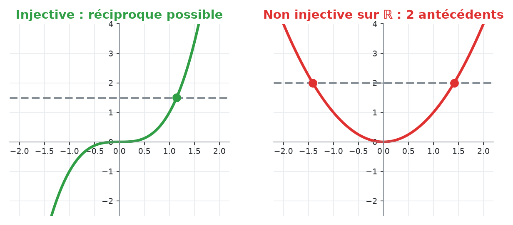
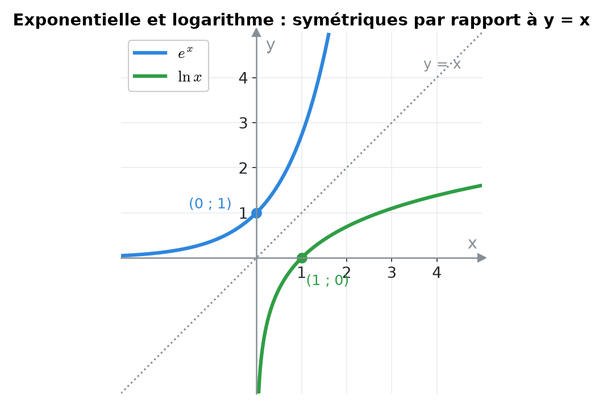
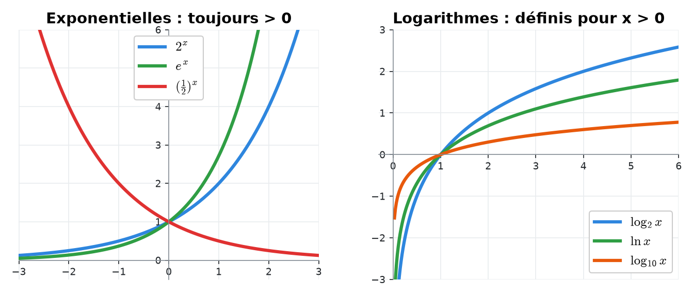
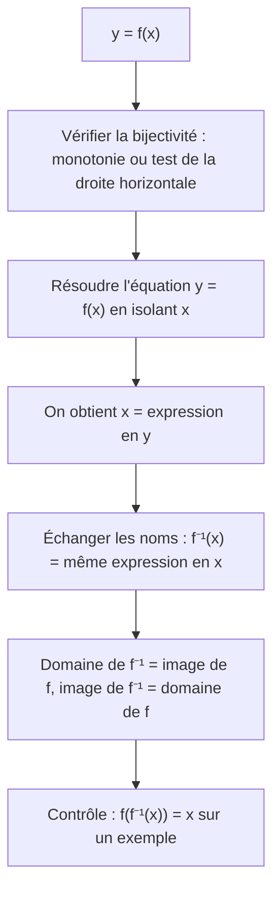
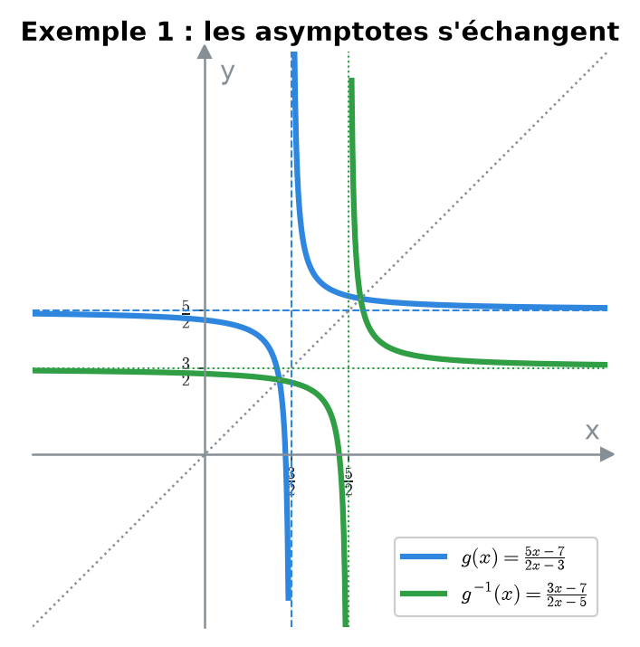
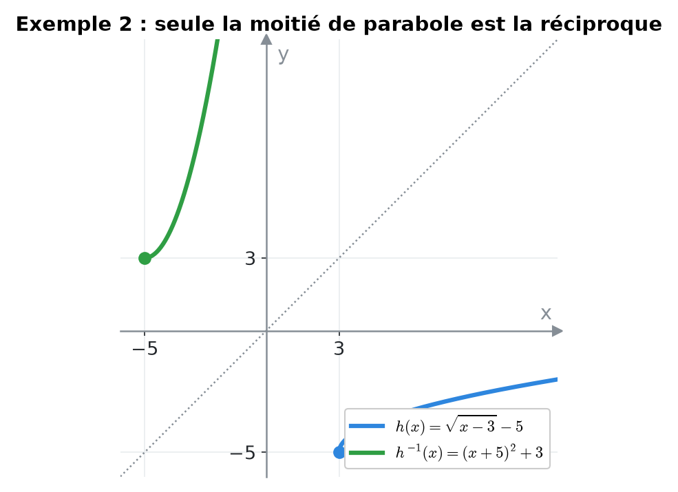
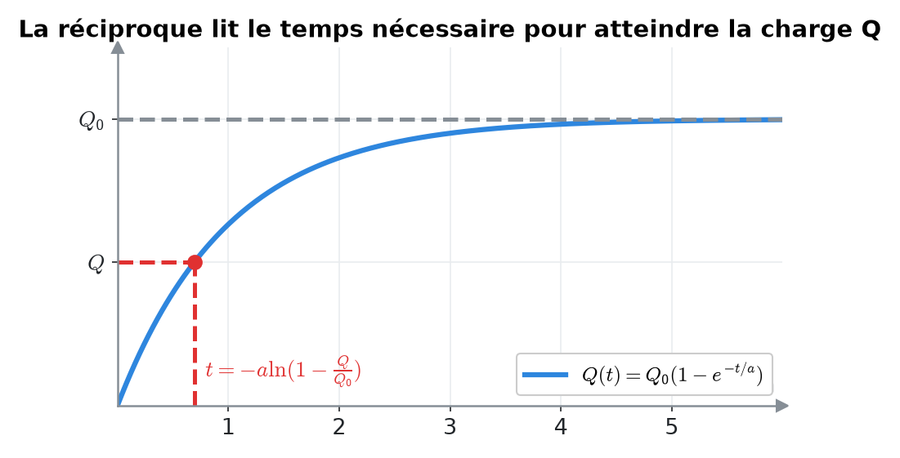
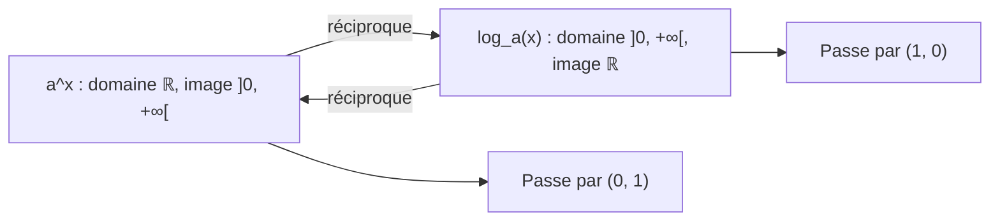
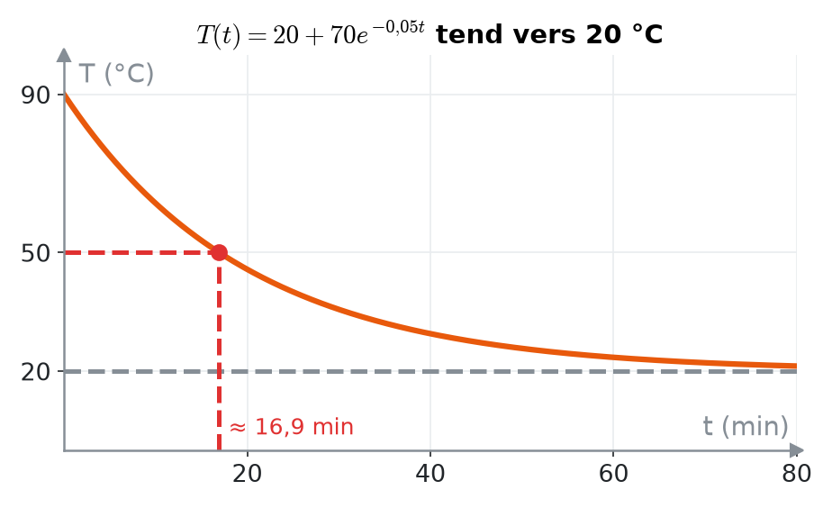

# 4. Fonctions réciproques, exponentielles et logarithmes


**Objectif** : savoir quand une fonction admet une réciproque, la calculer (avec domaine et image), et résoudre des équations exponentielles et logarithmiques, y compris dans des modèles appliqués (échelle de Richter, charge d'un condensateur). C'est la fin du <mark style="color:blue;">« Travail écrit 1 »</mark> et des TE de novembre.


---

## 1. Introduction & définitions

### 1.1 Bijection et réciproque

Une fonction f : A → B est <mark style="color:blue;">bijective</mark> si chaque y ∈ B est atteint par <mark style="color:green;">exactement un</mark> x ∈ A. Elle possède alors une <mark style="color:green;">réciproque</mark> f⁻¹ : B → A telle que :

$$\Large \boxed{y = f(x) \iff x = f^{-1}(y)} \qquad f^{-1}\left(f(x)\right) = x \qquad f\left(f^{-1}(y)\right) = y$$

* <mark style="color:blue;">Test de la droite horizontale</mark> : f est injective (donc bijective sur son image) si toute droite horizontale coupe le graphe <mark style="color:green;">au plus une fois</mark>. Une fonction strictement monotone passe toujours ce test.
* Le domaine de f⁻¹ est l'<mark style="color:blue;">image</mark> de f, et l'image de f⁻¹ est le <mark style="color:blue;">domaine</mark> de f.
* Le graphe de f⁻¹ est le <mark style="color:green;">symétrique</mark> de celui de f par rapport à la droite y = x.

<figure><figcaption></figcaption></figure>


f⁻¹(x) ne signifie <mark style="color:red;">pas</mark> 1/f(x).


### 1.2 Exponentielles et logarithmes

Pour a > 0, a ≠ 1, la fonction x ↦ aˣ est une bijection de ℝ sur ]0, +∞\[. Sa réciproque est le <mark style="color:blue;">logarithme de base a</mark> :

$$\Large \boxed{y = a^x \iff x = \log_a(y)} \qquad (y > 0)$$

Cas particuliers : <mark style="color:green;">ln = log\_e</mark> (base e ≈ 2,718) et log₁₀.

<figure><figcaption>
eˣ passe par (0 ; 1), ln x par (1 ; 0) : ce sont des « miroirs ».
</figcaption></figure>

<figure><figcaption></figcaption></figure>

<mark style="color:blue;">Règles de calcul</mark> (x, y > 0) :

| Exponentielles | Logarithmes |
| --- | --- |
| $$a^x a^y = a^{x + y}$$ | $$\log_a(xy) = \log_a x + \log_a y$$ |
| $$\frac{a^x}{a^y} = a^{x - y}$$ | $$\log_a\frac{x}{y} = \log_a x - \log_a y$$ |
| $$(a^x)^y = a^{xy}$$ | $$\log_a(x^y) = y\log_a x$$ |
| $$a^0 = 1$$ | $$\log_a 1 = 0 \qquad \log_a a = 1$$ |

<mark style="color:blue;">Changement de base</mark> :

$$\Large \log_a x = \frac{\ln x}{\ln a} \qquad a^x = e^{x\ln a}$$


log\_a(x + y) ≠ log\_a x + log\_a y : il n'y a <mark style="color:red;">pas</mark> de règle pour le logarithme d'une somme.


---

## 2. Méthodes de résolution

### Méthode A — Calculer la réciproque

### Méthode B — Équation exponentielle

1. Si possible, écrire les deux membres comme <mark style="color:blue;">puissances d'une même base</mark> : a^A = a^B ⟺ A = B.
2. Sinon, <mark style="color:blue;">isoler</mark> la puissance puis appliquer ln aux deux membres :

$$\large e^{A} = c \iff A = \ln c \qquad (\text{si } c > 0 \text{ ; si } c \leq 0, \text{ aucune solution})$$

### Méthode C — Équation logarithmique

1. <mark style="color:red;">Domaine d'abord</mark> : chaque argument de logarithme doit être > 0.
2. Regrouper avec les règles en <mark style="color:blue;">un seul logarithme</mark> de chaque côté.
3. Passer à l'exponentielle : log\_a(A) = c ⟺ A = aᶜ.
4. Résoudre, puis <mark style="color:red;">rejeter</mark> les solutions hors du domaine.

---

## 3. Exemples de calculs détaillés

### Exemple 1 — Réciproque d'une homographie (Travail écrit 1, 2022)

*g : ℝ ∖ {3/2} → ℝ ∖ {5/2} est bijective. Trouver g⁻¹.*

$$\Large g(x) = \frac{5x - 7}{2x - 3}$$

On résout y = g(x) en x :

$$\large y(2x - 3) = 5x - 7 \iff 2xy - 5x = 3y - 7 \iff x(2y - 5) = 3y - 7 \iff x = \frac{3y - 7}{2y - 5}$$

On échange les noms des variables :

$$\Large \color{#2F9E44}g^{-1}(x) = \frac{3x - 7}{2x - 5}, \qquad D_{g^{-1}} = \mathbb{R}\setminus\left\{\tfrac{5}{2}\right\}$$

Cohérent : le domaine de g⁻¹ est bien l'image de g.

<figure><figcaption>
L'asymptote verticale de g devient l'asymptote horizontale de g⁻¹, et inversement.
</figcaption></figure>

### Exemple 2 — Réciproque avec racine (Travail écrit 1, 2022)

*h : \[3, +∞\[ → Im(h), h(x) = √(x − 3) − 5.*

* h est la racine carrée décalée de 3 vers la droite et de 5 vers le bas : elle est <mark style="color:green;">strictement croissante</mark>, donc passe le test de la droite horizontale. Im(h) = \[−5, +∞\[.
* On isole x (le carré est légitime car y + 5 ≥ 0) :

$$\large y + 5 = \sqrt{x - 3} \iff (y + 5)^2 = x - 3 \iff x = (y + 5)^2 + 3$$

$$\Large \color{#2F9E44}h^{-1}(x) = (x + 5)^2 + 3, \qquad h^{-1} : [-5, +\infty[ \to [3, +\infty[$$

<figure><figcaption></figcaption></figure>

### Exemple 3 — Réciproque d'un logarithme emboîté (TE, novembre 2025)

$$\Large f(x) = \ln(\ln(x) - 3)$$

* Domaine : x > 0 et ln x > 3, soit D\_f = ]e³, +∞\[.
* On isole x :

$$\large y = \ln(\ln x - 3) \iff e^y = \ln x - 3 \iff \ln x = e^y + 3 \iff x = e^{e^y + 3}$$

$$\Large \color{#2F9E44}f^{-1}(x) = e^{e^x + 3}, \qquad D_{f^{-1}} = \mathbb{R}$$

### Exemple 4 — Équations (Travail écrit 1, 2022)

<mark style="color:orange;">b)</mark> Même base, 16 = 4² :

$$\large 4^{x^2 + x} = 16 \iff x^2 + x = 2 \iff (x + 2)(x - 1) = 0 \qquad \color{#2F9E44}S = \{-2\,;\,1\}$$

<mark style="color:orange;">c)</mark> On isole l'exponentielle :

$$\large e^{2x + 3} - 7 = 0 \iff 2x + 3 = \ln 7 \iff \color{#2F9E44}x = \frac{\ln 7 - 3}{2} \approx -0{,}527$$

<mark style="color:orange;">d)</mark>

$$\Large \log_3(2x + 1) - 2\log_3(x - 3) = 2$$

1. <mark style="color:red;">Domaine</mark> : 2x + 1 > 0 et x − 3 > 0, soit x > 3.
2. Un seul logarithme :

$$\large \log_3\frac{2x + 1}{(x - 3)^2} = 2$$

3. Exponentielle de base 3 :

$$\large \frac{2x + 1}{(x - 3)^2} = 9 \iff 2x + 1 = 9(x^2 - 6x + 9) \iff 9x^2 - 56x + 80 = 0$$

4. Δ = 3136 − 2880 = 256 : x = (56 ± 16)/18, soit x = 4 ou x = 20/9 ≈ 2,2.
5. 20/9 < 3 est <mark style="color:red;">hors domaine</mark> : rejetée.

$$\Large \color{#2F9E44}S = \{4\}$$

### Exemple 5 — Échelle de Richter (TE, novembre 2025)

*E en joules. a) Exprimer E en fonction de M. b) Combien d'énergie un séisme de magnitude 6 libère-t-il de plus qu'un séisme de magnitude 4 ?*

$$\Large M = \frac{\log_{10}(E) - 11{,}4}{1{,}5}$$

<mark style="color:orange;">a)</mark>

$$\large 1{,}5M = \log_{10}E - 11{,}4 \iff \color{#2F9E44}E = 10^{1{,}5M + 11{,}4}$$

<mark style="color:orange;">b)</mark> Le <mark style="color:blue;">rapport</mark> des énergies :

$$\large \frac{E(6)}{E(4)} = \frac{10^{1{,}5\cdot 6 + 11{,}4}}{10^{1{,}5\cdot 4 + 11{,}4}} = 10^{1{,}5\cdot 2} = \color{#2F9E44}1000$$

Un séisme de magnitude 6 libère <mark style="color:green;">1000 fois plus</mark> d'énergie. En valeur absolue, la différence vaut E(6) − E(4) = 10^20,4 − 10^17,4 ≈ 2,51 · 10²⁰ J.

### Exemple 6 — Charge d'un condensateur (TE, 2022)

*a > 0. Écrire la réciproque et l'interpréter.*

$$\Large Q(t) = Q_0\left(1 - e^{-t/a}\right)$$

$$\large \frac{Q}{Q_0} = 1 - e^{-t/a} \iff e^{-t/a} = 1 - \frac{Q}{Q_0} \iff \color{#2F9E44}t = -a\ln\left(1 - \frac{Q}{Q_0}\right)$$

Cette fonction donne le <mark style="color:green;">temps nécessaire</mark> pour atteindre une charge Q (avec 0 ≤ Q < Q₀).

<figure><figcaption></figcaption></figure>

---

## 4. Visualisation : exponentielle et logarithme sont « miroirs »

---

## 5. Exercices pratiques

### Exercice 1 — (Travail écrit 1, 2022)

La fonction f(x) = 2 log₃(x), de ]0, +∞\[ dans ℝ, est bijective. Déterminer f⁻¹, son domaine et son image.

Cliquez pour voir l'indice

Isolez log₃(x) = y/2 puis passez à l'exponentielle de base 3.

Solution détaillée

<mark style="color:orange;">1.</mark>

$$\large y = 2\log_3 x \iff \log_3 x = \frac{y}{2} \iff x = 3^{y/2}$$

<mark style="color:orange;">2.</mark>

$$\Large \color{#2F9E44}f^{-1}(x) = 3^{x/2} = \left(\sqrt{3}\right)^x$$

<mark style="color:orange;">3.</mark> D\_f⁻¹ = ℝ (image de f) et Im(f⁻¹) = ]0, +∞\[ (domaine de f).

### Exercice 2 — Équations

Résoudre :

$$\large \text{a) } 2^{2x + 1} = 3\cdot 2^x + 2 \qquad \text{b) } \ln(x) + \ln(x + 2) = \ln(8) \qquad \text{c) } e^{2x} - 5e^x + 6 = 0$$

Cliquez pour voir l'indice

a) et c) : posez u = 2ˣ (resp. u = eˣ), on obtient une équation du second degré en u, avec u > 0. b) Domaine, puis ln A + ln B = ln(AB).

Solution détaillée

<mark style="color:orange;">a)</mark> 2^(2x+1) = 2 · (2ˣ)². Avec u = 2ˣ > 0 :

$$\large 2u^2 - 3u - 2 = 0 \qquad u = \frac{3 \pm 5}{4} \in \left\{2\,;\,-\tfrac{1}{2}\right\}$$

u = −1/2 est <mark style="color:red;">rejeté</mark> (u > 0). 2ˣ = 2 ⟺ <mark style="color:green;">x = 1</mark>.

<mark style="color:orange;">b)</mark> Domaine : x > 0.

$$\large \ln\left(x(x + 2)\right) = \ln 8 \iff x^2 + 2x - 8 = 0 \iff (x + 4)(x - 2) = 0$$

x = −4 est hors domaine. <mark style="color:green;">S = {2}</mark>.

<mark style="color:orange;">c)</mark> u = eˣ > 0 : u² − 5u + 6 = 0 ⟺ u = 2 ou u = 3. Donc <mark style="color:green;">x = ln 2 ou x = ln 3</mark>.

### Exercice 3 — Modèle de refroidissement

La température d'un café suit (t en minutes, T en °C) :

$$\Large T(t) = 20 + 70e^{-0{,}05t}$$

a) Température initiale ? b) Au bout de combien de temps le café est-il à 50 °C ? c) Exprimer t en fonction de T.

Cliquez pour voir l'indice

Isolez l'exponentielle avant d'appliquer ln.

Solution détaillée

<mark style="color:orange;">a)</mark> T(0) = 20 + 70 = <mark style="color:green;">90 °C</mark>.

<mark style="color:orange;">b)</mark>

$$\large 50 = 20 + 70e^{-0{,}05t} \iff e^{-0{,}05t} = \frac{3}{7} \iff \color{#2F9E44}t = 20\ln\frac{7}{3} \approx 16{,}9 \text{ min}$$

<mark style="color:orange;">c)</mark> Pour 20 < T ≤ 90 :

$$\large e^{-0{,}05t} = \frac{T - 20}{70} \iff \color{#2F9E44}t = 20\ln\left(\frac{70}{T - 20}\right)$$

<figure><figcaption></figcaption></figure>

