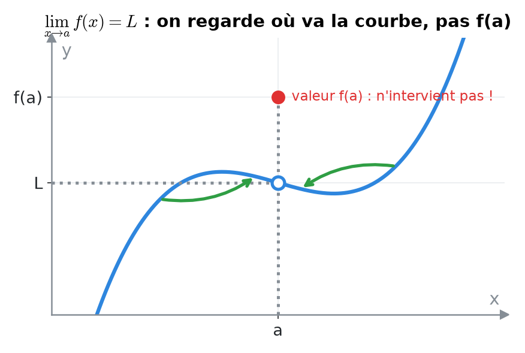
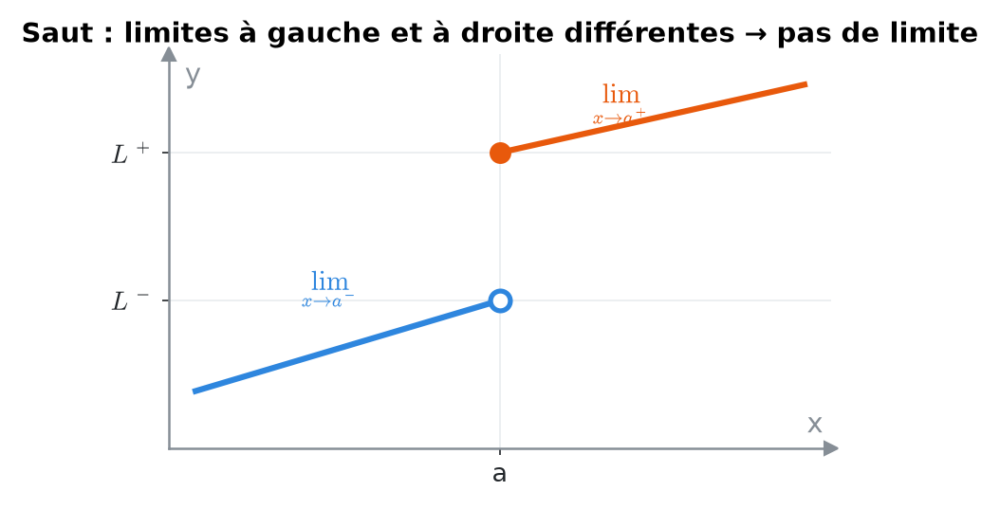
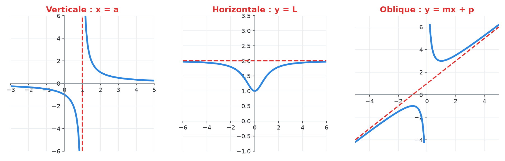
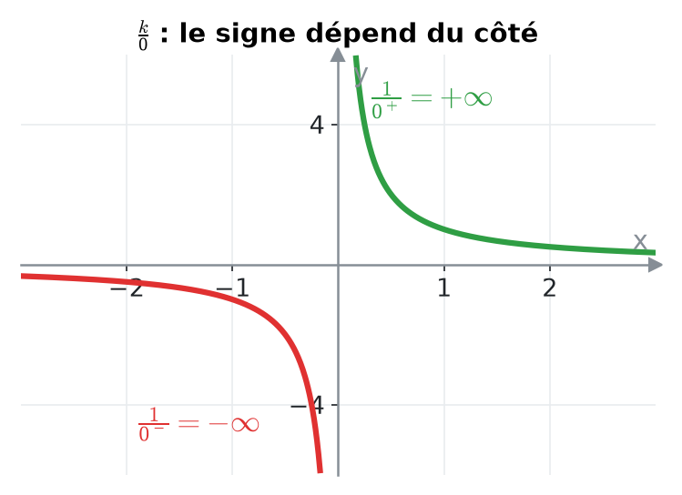
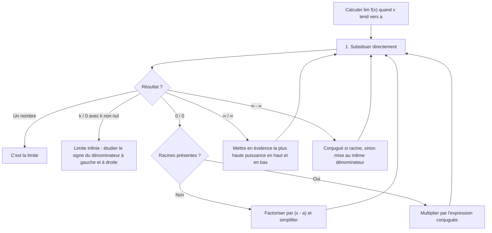
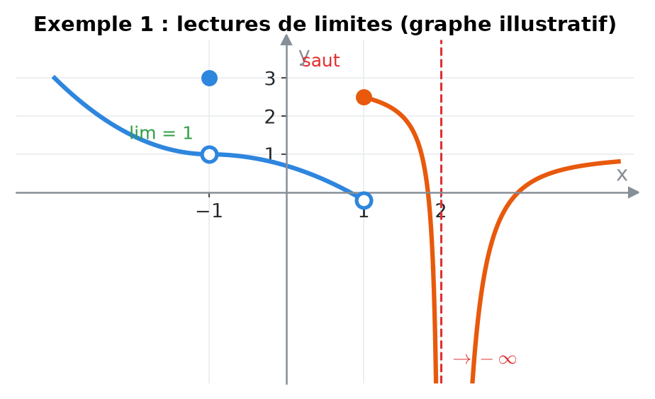
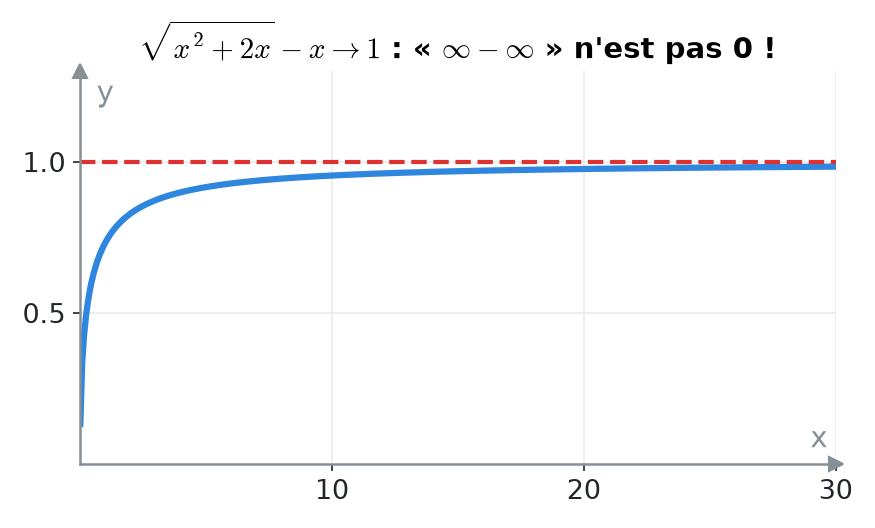
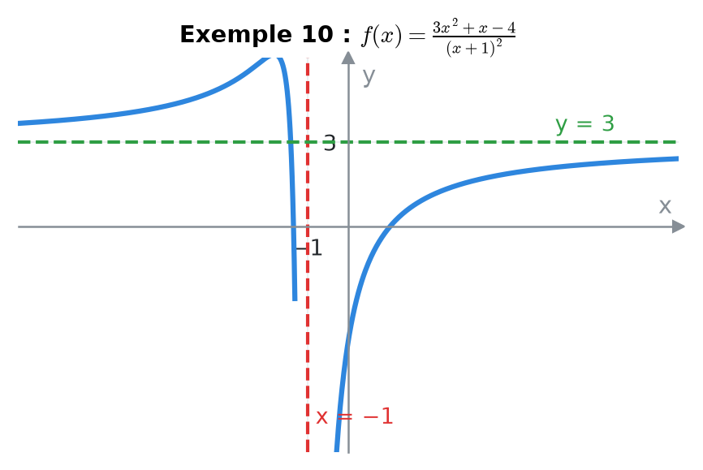
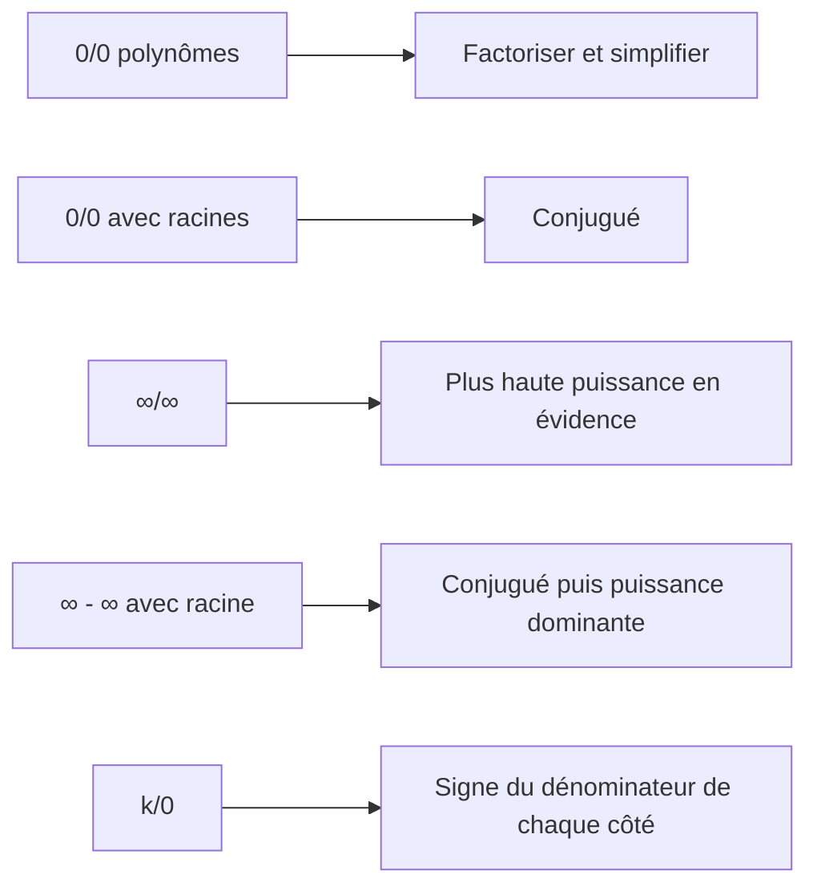
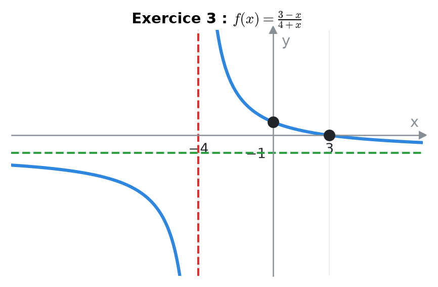

# 5. Limites et asymptotes


**Objectif** : lire des limites sur un graphe, calculer des limites en levant les indéterminations (0/0, ∞/∞, ∞ − ∞, k/0), trouver les asymptotes, et esquisser une fonction à partir de conditions de limites. C'est dans <mark style="color:blue;">tous</mark> les TE 1 et TE 2 d'Analyse (« Calculs de limites », « Limites graphiques »).



Consigne fréquente : « il n'est pas autorisé d'utiliser la règle de l'Hospital ». Toutes les méthodes ci-dessous sont <mark style="color:blue;">algébriques</mark>.


---

## 1. Introduction & définitions

### 1.1 L'idée de limite

$$\Large \lim_{x \to a} f(x) = L$$

signifie : <mark style="color:blue;">quand x s'approche de a</mark> (sans forcément l'atteindre), <mark style="color:green;">f(x) s'approche de L</mark>. La valeur f(a) elle-même <mark style="color:red;">n'intervient pas</mark> (elle peut même ne pas exister).

<figure><figcaption></figcaption></figure>

### 1.2 Limites latérales

* x → a⁻ : x s'approche de a <mark style="color:blue;">par la gauche</mark> (x < a).
* x → a⁺ : x s'approche <mark style="color:orange;">par la droite</mark> (x > a).


La limite (bilatérale) existe <mark style="color:green;">si et seulement si</mark> les deux limites latérales existent et sont <mark style="color:green;">égales</mark>.


<figure><figcaption></figcaption></figure>

### 1.3 Limites infinies et à l'infini

* lim f(x) = +∞ : f(x) devient arbitrairement grand. On écrit toujours <mark style="color:red;">+∞ ou −∞</mark>, jamais « ∞ » sans signe.
* x → +∞ : comportement quand x devient très grand.

### 1.4 Asymptotes

| Type | Condition | Équation |
| --- | --- | --- |
| <mark style="color:blue;">Verticale</mark> | $$\lim_{x \to a^\pm} f(x) = \pm\infty$$ | x = a |
| <mark style="color:blue;">Horizontale</mark> | $$\lim_{x \to \pm\infty} f(x) = L$$ | y = L |
| <mark style="color:blue;">Oblique</mark> | $$\lim_{x \to \pm\infty}\left[f(x) - (mx + p)\right] = 0$$ | y = mx + p |

<figure><figcaption></figcaption></figure>

Les asymptotes verticales se cherchent aux <mark style="color:red;">valeurs interdites</mark> (zéros du dénominateur qui ne sont <mark style="color:red;">pas</mark> aussi zéros du numérateur).

### 1.5 Règles de calcul et formes indéterminées

Si f est continue en a (polynômes, fractions hors valeurs interdites, racines, exp, ln…), on <mark style="color:green;">substitue</mark> directement : lim f(x) = f(a).

Formes <mark style="color:green;">déterminées</mark> (k réel non nul) :

$$\Large \frac{k}{\pm\infty} = 0 \qquad \frac{k}{0^{\pm}} = \pm\infty \qquad +\infty + \infty = +\infty \qquad k\cdot\infty = \pm\infty$$

(pour k/0, règle des signes).

<figure><figcaption></figcaption></figure>

Formes <mark style="color:red;">indéterminées</mark> (travail algébrique nécessaire) :

$$\Large \color{#E03131}\frac{0}{0} \qquad \frac{\infty}{\infty} \qquad \infty - \infty \qquad 0\cdot\infty$$

---

## 2. Méthodes de résolution

### Arbre de décision

### Méthode A — 0/0 avec des polynômes

Si P(a) = 0 et Q(a) = 0, alors <mark style="color:green;">(x − a) divise P et Q</mark> (théorème du facteur, chapitre 2). On factorise, on simplifie, on substitue.

### Méthode B — 0/0 ou ∞ − ∞ avec des racines : le conjugué

On utilise l'identité :

$$\Large (\sqrt{A} - \sqrt{B})(\sqrt{A} + \sqrt{B}) = A - B$$

On multiplie numérateur <mark style="color:blue;">et</mark> dénominateur par l'expression conjuguée pour faire disparaître la racine « gênante ».

### Méthode C — ∞/∞ pour une fraction rationnelle (en ±∞)

On met en évidence la <mark style="color:blue;">plus haute puissance</mark>. Résultat à retenir (aₙ, bₘ coefficients dominants) :

| Degrés | Limite en ±∞ de la fraction |
| --- | --- |
| n < m | <mark style="color:green;">0</mark> |
| n = m | $$\frac{a_n}{b_m}$$ (asymptote horizontale) |
| n > m | <mark style="color:red;">±∞</mark> (signe à étudier) |

### Méthode D — k/0 : étude du signe

On détermine si le dénominateur tend vers <mark style="color:green;">0⁺</mark> ou <mark style="color:red;">0⁻</mark> <mark style="color:blue;">de chaque côté</mark>, en regardant le signe de chaque facteur.

### Méthode E — Fonctions bornées

sin x et cos x restent entre −1 et 1 : face à un terme qui tend vers l'infini, ils sont <mark style="color:green;">négligeables</mark>.

---

## 3. Exemples de calculs détaillés

### Exemple 1 — Lecture graphique (TE 1, 2024)

*Sur un graphe : autour de x = −1 la courbe arrive à la hauteur 1 des deux côtés (avec un point isolé ailleurs) ; en x = 1 il y a un saut ; en x = 2 une asymptote verticale où la courbe plonge vers −∞ des deux côtés.*

<figure><figcaption></figcaption></figure>

* <mark style="color:green;">lim(x → −1) f(x) = 1</mark> : les deux côtés arrivent à la même hauteur, peu importe la valeur f(−1).
* lim(x → 1) f(x) <mark style="color:red;">n'existe pas</mark> : les limites à gauche et à droite diffèrent (saut).
* <mark style="color:green;">lim(x → 2⁺) f(x) = −∞</mark>.

### Exemple 2 — Limite infinie (TE 2, 2024)

$$\Large \lim_{x \to -1^+}\frac{4x^2 - 5x + 7}{x + 1}$$

Substitution : numérateur → 4 + 5 + 7 = 16 ; dénominateur → 0. Forme 16/0. Pour x > −1, x + 1 > 0 : le dénominateur tend vers <mark style="color:green;">0⁺</mark>.

$$\Large \lim_{x \to -1^+}\frac{4x^2 - 5x + 7}{x + 1} = \frac{16}{0^+} = \color{#2F9E44}+\infty$$

### Exemple 3 — 0/0 polynomial (TE 2, 2024)

$$\Large \lim_{x \to -2}\frac{2x^2 + 5x + 2}{-2 - x}$$

Substitution : (8 − 10 + 2)/0 = <mark style="color:red;">0/0</mark>. On factorise : 2x² + 5x + 2 = (x + 2)(2x + 1) et −2 − x = −(x + 2) :

$$\large \lim_{x \to -2}\frac{(x + 2)(2x + 1)}{-(x + 2)} = \lim_{x \to -2}-(2x + 1) = -(-4 + 1) = \color{#2F9E44}3$$

### Exemple 4 — Conjugué (TE 2, 2024)

$$\Large \lim_{x \to -3}\frac{\sqrt{2x + 7} - \sqrt{4 + x}}{x + 3}$$

Substitution : (√1 − √1)/0 = <mark style="color:red;">0/0</mark>. On multiplie par le conjugué √(2x + 7) + √(4 + x) :

$$\large = \lim_{x \to -3}\frac{(2x + 7) - (4 + x)}{(x + 3)\left(\sqrt{2x + 7} + \sqrt{4 + x}\right)} = \lim_{x \to -3}\frac{x + 3}{(x + 3)\left(\sqrt{2x + 7} + \sqrt{4 + x}\right)}$$

$$\large = \frac{1}{\sqrt{1} + \sqrt{1}} = \color{#2F9E44}\frac{1}{2}$$

### Exemple 5 — Conjugué au numérateur (Travail écrit 2, 2022)

$$\Large \lim_{x \to -2}\frac{3 - \sqrt{x^2 + 5}}{3x + 6}$$

Forme <mark style="color:red;">0/0</mark>. Conjugué 3 + √(x² + 5) :

$$\large = \lim_{x \to -2}\frac{9 - (x^2 + 5)}{3(x + 2)\left(3 + \sqrt{x^2 + 5}\right)} = \lim_{x \to -2}\frac{(2 - x)(2 + x)}{3(x + 2)\left(3 + \sqrt{x^2 + 5}\right)} = \frac{4}{3\cdot 6} = \color{#2F9E44}\frac{2}{9}$$

### Exemple 6 — ∞/∞ (TE 2, 2024 et TE 2025)

$$\Large \lim_{x \to -\infty}\frac{(3x + 2)(x^2 - 4x + 3)}{5x^3 - x}$$

Numérateur et dénominateur de degré 3 ; coefficients dominants 3 · 1 = 3 et 5. En détail :

$$\large = \lim_{x \to -\infty}\frac{x^3\left(3 + \frac{2}{x}\right)\left(1 - \frac{4}{x} + \frac{3}{x^2}\right)}{x^3\left(5 - \frac{1}{x^2}\right)} = \color{#2F9E44}\frac{3}{5}$$

De même :

$$\large \lim_{x \to +\infty}\frac{8x^2 + 2}{-x^2 + x + 1} = \frac{8}{-1} = \color{#2F9E44}-8$$

### Exemple 7 — ∞ − ∞ (TE, novembre 2023)

$$\Large \lim_{x \to +\infty}\left(\sqrt{x^2 + 2x} - x\right)$$

Conjugué (pour x > 0, √(x²) = x) :

$$\large = \lim_{x \to +\infty}\frac{(x^2 + 2x) - x^2}{\sqrt{x^2 + 2x} + x} = \lim_{x \to +\infty}\frac{2x}{x\left(\sqrt{1 + \frac{2}{x}} + 1\right)} = \frac{2}{1 + 1} = \color{#2F9E44}1$$

<figure><figcaption></figcaption></figure>

### Exemple 8 — Fonction bornée (Travail écrit 2, 2022)

$$\large \lim_{x \to +\infty}\frac{3x^2 + 4}{5x^2 + \sin x} = \lim_{x \to +\infty}\frac{3 + \frac{4}{x^2}}{5 + \frac{\sin x}{x^2}} = \color{#2F9E44}\frac{3}{5}$$

car le terme borné disparaît :

$$\large -\frac{1}{x^2} \leq \frac{\sin x}{x^2} \leq \frac{1}{x^2} \quad\Rightarrow\quad \frac{\sin x}{x^2} \to 0$$

### Exemple 9 — Trouver des paramètres (TE, novembre 2025)

*Déterminer a et b sachant que lim(x → 3⁻) f(x) = −∞ et lim(x → 5) f(x) = 11 :*

$$\Large f(x) = ax + \frac{2}{x - b}$$

<mark style="color:orange;">1.</mark> Une limite infinie en 3 ne peut venir que de la fraction : il faut x − b → 0 en x = 3, donc <mark style="color:green;">b = 3</mark>. Vérification : pour x < 3, x − 3 → 0⁻ et 2/0⁻ = −∞ ✓.

<mark style="color:orange;">2.</mark>

$$\large \lim_{x \to 5} f(x) = 5a + \frac{2}{5 - 3} = 5a + 1 = 11 \quad\Rightarrow\quad \color{#2F9E44}a = 2$$

### Exemple 10 — Asymptotes (Travail écrit 2, 2022)

$$\Large f(x) = \frac{3x^2 + x - 4}{(x + 1)^2}$$

* Domaine : ℝ ∖ {−1}. En x = −1 : numérateur 3 − 1 − 4 = −4 ≠ 0, dénominateur → 0⁺ (un carré). La limite vaut −4/0⁺ = −∞ des deux côtés : <mark style="color:red;">asymptote verticale x = −1</mark>.
* Degrés égaux, coefficients dominants 3 et 1 : lim(x → ±∞) f(x) = 3 : <mark style="color:green;">asymptote horizontale y = 3</mark>.

<figure><figcaption></figcaption></figure>

---

## 4. Visualisation : les formes indéterminées et leur remède

---

## 5. Exercices pratiques

### Exercice 1 — (Travail écrit 2, 2022)

Calculer, sans la règle de l'Hospital :

$$\large \text{a) } \lim_{x \to 4}\frac{x^2 - 4x}{x^2 - 3x - 4} \qquad \text{b) } \lim_{x \to 5^+}\frac{7}{x^2 - 3x - 10} \qquad \text{c) } \lim_{x \to -\infty}\frac{7x^3 + 2x^2 + x}{3x^2 - 5x + 1}$$

Cliquez pour voir l'indice

a) Forme 0/0 : factorisez. b) Factorisez le dénominateur (x − 5)(x + 2) et étudiez son signe à droite de 5. c) Degré du haut supérieur au degré du bas.

Solution détaillée

<mark style="color:orange;">a)</mark>

$$\large \frac{x(x - 4)}{(x - 4)(x + 1)} = \frac{x}{x + 1} \to \color{#2F9E44}\frac{4}{5}$$

<mark style="color:orange;">b)</mark> Pour x > 5 : x − 5 → 0⁺ et x + 2 → 7 > 0, donc le dénominateur tend vers 0⁺ :

$$\large \frac{7}{0^+} = \color{#2F9E44}+\infty$$

<mark style="color:orange;">c)</mark>

$$\large \frac{x^3\left(7 + \frac{2}{x} + \frac{1}{x^2}\right)}{x^2\left(3 - \frac{5}{x} + \frac{1}{x^2}\right)} \approx \frac{7}{3}x \to \color{#2F9E44}-\infty$$

### Exercice 2 — (TE, novembre 2023)

Calculer :

$$\large \text{a) } \lim_{x \to 0}\frac{\sqrt{x^2 + 4} + 1}{2x + 1} \qquad \text{b) } \lim_{x \to 1}\frac{2x^2 + x - 3}{1 - x} \qquad \text{c) } \lim_{x \to -\infty}\frac{2x + 7x^2 - 3x^5}{x^2 + 3x^6}$$

Cliquez pour voir l'indice

a) Essayez d'abord la substitution directe ! b) x = 1 annule le numérateur. c) Comparez les degrés.

Solution détaillée

<mark style="color:orange;">a)</mark> Pas d'indétermination :

$$\large \frac{\sqrt{4} + 1}{1} = \color{#2F9E44}3$$

<mark style="color:orange;">b)</mark> 2x² + x − 3 = (x − 1)(2x + 3) et 1 − x = −(x − 1) :

$$\large \lim_{x \to 1} -(2x + 3) = \color{#2F9E44}-5$$

<mark style="color:orange;">c)</mark> Degré 5 en haut, 6 en bas : la limite vaut <mark style="color:green;">0</mark>.

### Exercice 3 — Asymptotes et esquisse (TE 2, 2019)

Soit :

$$\Large f(x) = \frac{3 - x}{4 + x}$$

a) Trouver les asymptotes. b) Calculer f'(x) par la définition (chapitre 7) ou vérifier son signe, et esquisser le graphe.

Cliquez pour voir l'indice

Valeur interdite x = −4 ; étudiez le signe de 7/0±. En ±∞, degrés égaux.

Solution détaillée

<mark style="color:orange;">a)</mark> En x = −4 : numérateur → 7.

$$\large \lim_{x \to -4^+} f(x) = \frac{7}{0^+} = +\infty \qquad \lim_{x \to -4^-} f(x) = \frac{7}{0^-} = -\infty$$

<mark style="color:red;">Asymptote verticale x = −4</mark>. En ±∞ :

$$\large \lim_{x \to \pm\infty}\frac{-x + 3}{x + 4} = \frac{-1}{1} = -1$$

<mark style="color:green;">Asymptote horizontale y = −1</mark>.

<mark style="color:orange;">b)</mark>

$$\large f'(x) = \frac{-(4 + x) - (3 - x)}{(4 + x)^2} = \frac{-7}{(4 + x)^2} < 0$$

f décroît sur chaque intervalle du domaine. Esquisse : une hyperbole passant par (3 ; 0) et (0 ; 3/4).

<figure><figcaption></figcaption></figure>

