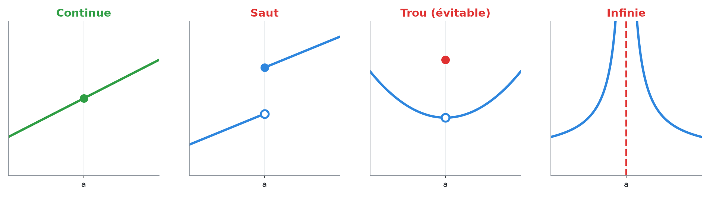
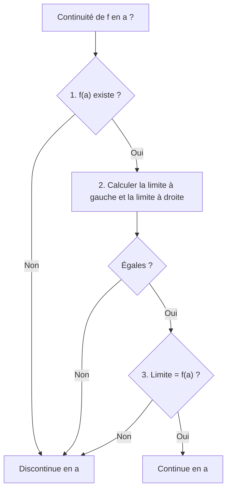
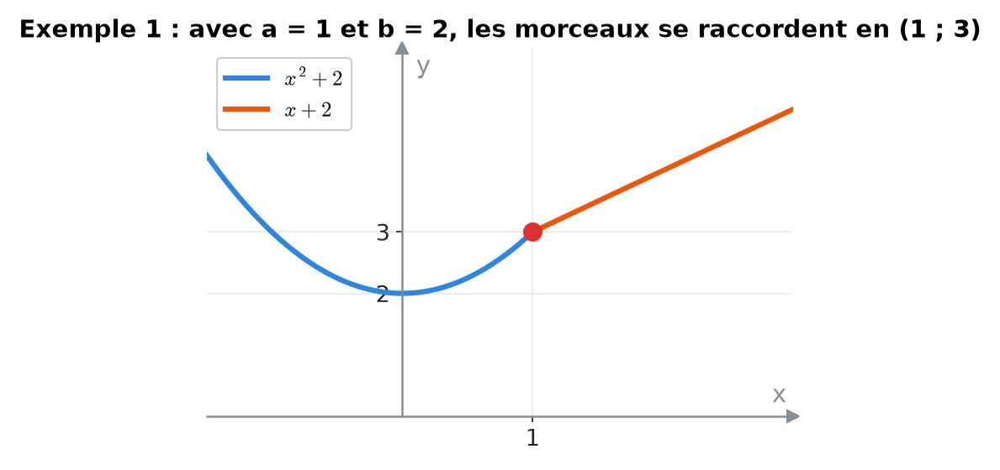
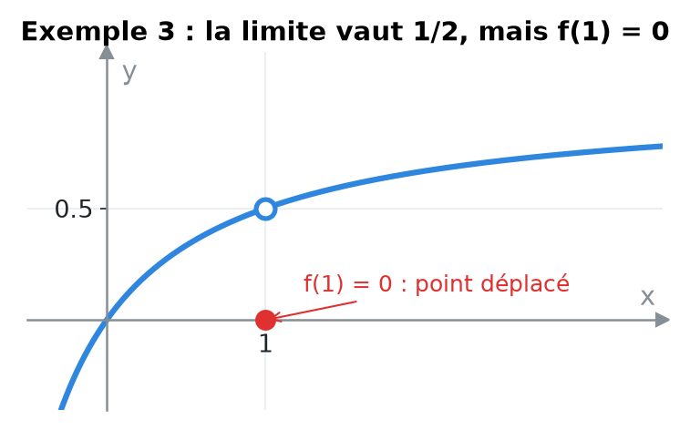
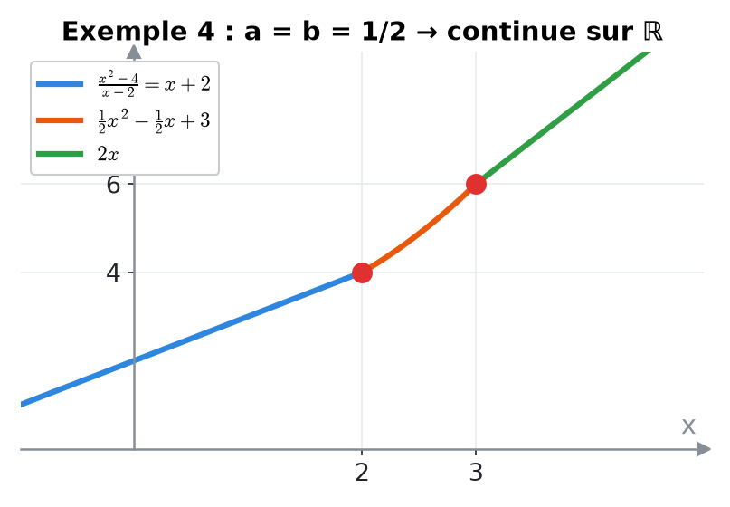
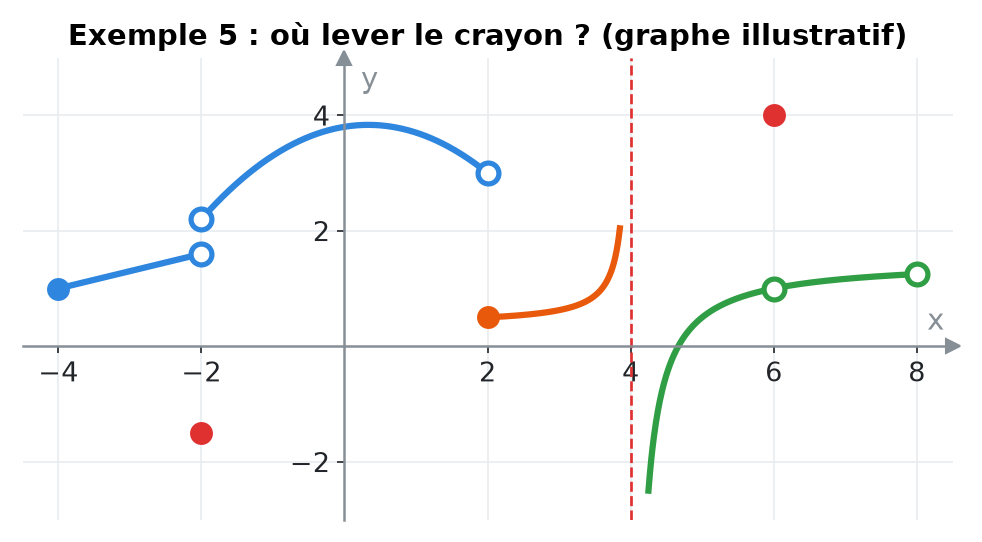
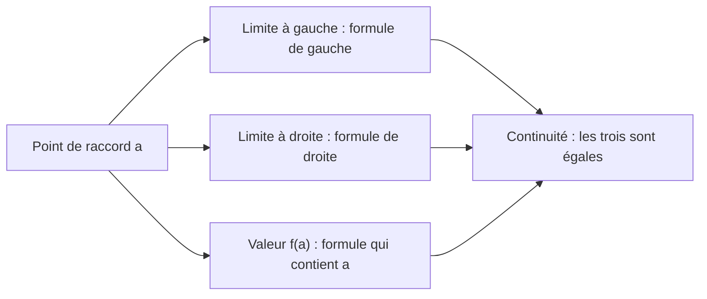
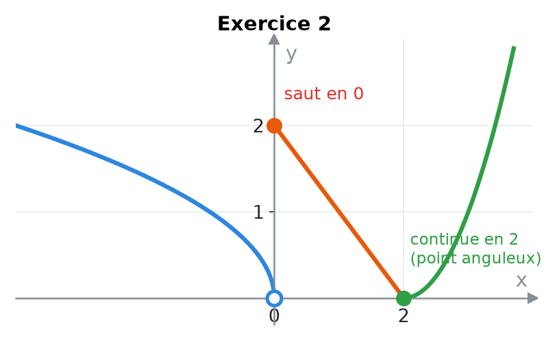

# 6. Continuité


**Objectif** : justifier la continuité (ou non) d'une fonction en un point avec la définition, lire les intervalles de continuité sur un graphe, et <mark style="color:blue;">déterminer des paramètres</mark> pour qu'une fonction définie par morceaux soit continue. C'est le « Problème 4. Continuité » des TE 2 et l'exercice 2 du Travail écrit 2 (2022).


---

## 1. Introduction & définitions

### 1.1 Définition

Intuitivement, une fonction est <mark style="color:blue;">continue</mark> si l'on peut tracer son graphe <mark style="color:green;">sans lever le crayon</mark>. Formellement :


f est <mark style="color:green;">continue en a</mark> si et seulement si les <mark style="color:green;">trois conditions</mark> suivantes sont réunies :

1. f(a) existe (a ∈ D\_f) ;
2. la limite de f en a existe (limites à gauche et à droite égales) ;
3. cette limite est égale à f(a).

$$\Large \lim_{x \to a^-} f(x) = \lim_{x \to a^+} f(x) = f(a)$$


f est continue <mark style="color:blue;">sur un intervalle</mark> si elle est continue en chacun de ses points (aux bornes fermées, on utilise la limite latérale appropriée).

### 1.2 Types de discontinuités

<figure><figcaption>
● point plein : valeur de la fonction ; ○ point vide : valeur non atteinte.
</figcaption></figure>

| Type | Ce qui ne va pas | Dessin |
| --- | --- | --- |
| <mark style="color:red;">Saut</mark> | limites à gauche et à droite différentes | la courbe « saute » |
| <mark style="color:red;">Trou</mark> (discontinuité évitable) | la limite existe mais f(a) n'existe pas ou est différente | un point « déplacé » ou manquant |
| <mark style="color:red;">Infinie</mark> | une limite latérale est infinie | asymptote verticale |

### 1.3 Fonctions continues « de référence »

Sont continues <mark style="color:green;">sur leur domaine</mark> : polynômes, fractions rationnelles, racines, eˣ, ln x, sin, cos, tan, et toutes les sommes, produits, quotients et composées de telles fonctions. Pour une fonction <mark style="color:blue;">par morceaux</mark>, il ne reste donc à étudier que les <mark style="color:blue;">points de raccord</mark>.

### 1.4 Continuité et dérivabilité

Une fonction dérivable en a est forcément continue en a. La réciproque est <mark style="color:red;">fausse</mark> : |x| est continue en 0 mais présente un <mark style="color:blue;">point anguleux</mark> (pas de tangente unique).

---

## 2. Méthodes de résolution

### Méthode A — Justifier la continuité en un point

<mark style="color:blue;">Rédaction attendue</mark> : écrire explicitement les trois quantités f(a), la limite à gauche, la limite à droite, et conclure.

### Méthode B — Paramètres d'une fonction par morceaux

1. Pour chaque point de raccord a : calculer la <mark style="color:blue;">limite à gauche</mark> avec la formule de gauche, la <mark style="color:orange;">limite à droite</mark> avec la formule de droite, et <mark style="color:red;">f(a)</mark> avec la formule qui contient a.
2. Écrire les <mark style="color:green;">égalités</mark> (une ou deux équations par raccord).
3. Résoudre le système d'équations en les paramètres.

### Méthode C — Intervalles de continuité sur un graphe

Repérer tous les points « à problème » (sauts, trous, asymptotes, points isolés). Les intervalles de continuité s'arrêtent à ces points ; une borne est <mark style="color:green;">fermée</mark> si la fonction y est définie et que le graphe « arrive » sur le point plein depuis l'intérieur de l'intervalle.

---

## 3. Exemples de calculs détaillés

### Exemple 1 — Deux paramètres, un raccord (TE 2, 2019)

*Déterminer a et b pour que f soit continue en x = 1 :*

$$\Large f(x) = \begin{cases} x^2 + b & \text{si } x < 1 \\ 3 & \text{si } x = 1 \\ ax + b & \text{si } x > 1 \end{cases}$$

<mark style="color:orange;">1.</mark> f(1) = 3.

<mark style="color:orange;">2.</mark> À gauche :

$$\large \lim_{x \to 1^-}(x^2 + b) = 1 + b = 3 \quad\Rightarrow\quad \color{#2F9E44}b = 2$$

<mark style="color:orange;">3.</mark> À droite :

$$\large \lim_{x \to 1^+}(ax + b) = a + b = 3 \quad\Rightarrow\quad \color{#2F9E44}a = 1$$

<figure><figcaption></figcaption></figure>

### Exemple 2 — Continuité sur ℝ (Travail écrit 2, 2022)

*Déterminer A et B pour que f soit continue sur ℝ :*

$$\Large f(x) = \begin{cases} Ax + 3 & \text{si } x < 1 \\ 2 & \text{si } x = 1 \\ x^2 + B & \text{si } x > 1 \end{cases}$$

Chaque morceau est un polynôme, donc continu ; seul x = 1 pose question. Il faut limite à gauche = f(1) = limite à droite :

$$\large A + 3 = 2 \Rightarrow {\color{#2F9E44}A = -1} \qquad 1 + B = 2 \Rightarrow {\color{#2F9E44}B = 1}$$

### Exemple 3 — Discontinuité évitable (TE, 2022)

*f(x) = (x² − x)/(x² − 1) pour x ≠ 1 et f(1) = 0. f est-elle continue en x = 1 ?*

<mark style="color:orange;">1.</mark> f(1) = 0 existe.

<mark style="color:orange;">2.</mark> La limite existe :

$$\large \lim_{x \to 1}\frac{x(x - 1)}{(x - 1)(x + 1)} = \lim_{x \to 1}\frac{x}{x + 1} = \frac{1}{2}$$

<mark style="color:orange;">3.</mark> 1/2 ≠ 0 = f(1) : <mark style="color:red;">f n'est pas continue en 1</mark>. C'est un « trou » : en posant f(1) = 1/2, on la rendrait continue.

<figure><figcaption></figcaption></figure>

### Exemple 4 — Deux raccords, système (TE, 2020)

*Trouver a et b pour que f soit continue sur ℝ :*

$$\Large f(x) = \begin{cases} \frac{x^2 - 4}{x - 2} & \text{si } x < 2 \\ ax^2 - bx + 3 & \text{si } 2 \leq x < 3 \\ 2x - a + b & \text{si } x \geq 3 \end{cases}$$

<mark style="color:orange;">Raccord en 2</mark> :

$$\large \lim_{x \to 2^-}\frac{(x - 2)(x + 2)}{x - 2} = 4 \qquad f(2) = 4a - 2b + 3 \quad\Rightarrow\quad 4a - 2b = 1$$

<mark style="color:orange;">Raccord en 3</mark> :

$$\large \lim_{x \to 3^-}(ax^2 - bx + 3) = 9a - 3b + 3 \qquad f(3) = 6 - a + b \quad\Rightarrow\quad 10a - 4b = 3$$

<mark style="color:orange;">Système</mark> : on multiplie la 1re équation par 2 (8a − 4b = 2) et on soustrait de la 2e : 2a = 1.

$$\Large \color{#2F9E44}a = \frac{1}{2} \qquad b = \frac{1}{2}$$

<figure><figcaption></figcaption></figure>

### Exemple 5 — Lecture graphique (TE, novembre 2025)

*Sur le graphe de g : saut en x = −2 (point plein isolé en dessous) ; en x = 2, la courbe de gauche arrive sur un cercle vide et celle de droite part d'un point plein plus bas ; asymptote verticale en x = 4 ; en x = 6, trou avec un point isolé ailleurs ; la courbe s'arrête en x = 8 sur un cercle vide.*

<figure><figcaption>
Un graphe correspondant à la description.
</figcaption></figure>

Intervalles de continuité :

$$\Large \color{#2F9E44}[-4, -2[ \ ; \ ]-2, 2[ \ ; \ [2, 4[ \ ; \ ]4, 6[ \ ; \ ]6, 8[$$

Justification des bornes :

* en −2 et 6, la valeur g(·) ne correspond à aucune des deux limites (bornes <mark style="color:red;">ouvertes</mark> des deux côtés) ;
* en 2, le point plein appartient à la branche de droite (borne <mark style="color:green;">fermée</mark> à droite) ;
* en 4, asymptote (bornes <mark style="color:red;">ouvertes</mark>).

---

## 4. Visualisation

---

## 5. Exercices pratiques

### Exercice 1 — (TE 2, 2019)

Déterminer l'intervalle de continuité de :

$$\Large g(x) = \begin{cases} x^2 & \text{si } 0 \leq x < 2 \\ 3x + 1 & \text{si } 2 \leq x < 5 \end{cases}$$

Cliquez pour voir l'indice

Chaque morceau est continu. Comparez la limite à gauche en 2 avec g(2).

Solution détaillée

<mark style="color:orange;">1.</mark> g(2) = 3 · 2 + 1 = 7 et la limite à droite vaut 7.

<mark style="color:orange;">2.</mark> La limite à gauche vaut 2² = 4 ≠ 7 : <mark style="color:red;">saut</mark> en x = 2.

<mark style="color:orange;">3.</mark> g est continue sur <mark style="color:green;">\[0, 2\[</mark> et sur <mark style="color:green;">\[2, 5\[</mark> (en 2, elle est continue <mark style="color:blue;">à droite</mark>), mais pas sur \[0, 5\[.

### Exercice 2 — Continuité en un point (TE, 2022)

Étudier la continuité en x = 0 et en x = 2 de :

$$\Large f(x) = \begin{cases} \sqrt{-x} & \text{si } x < 0 \\ 2 - x & \text{si } 0 \leq x < 2 \\ (x - 2)^2 & \text{si } x \geq 2 \end{cases}$$

Cliquez pour voir l'indice

Calculez les trois quantités (gauche, droite, valeur) à chaque raccord.

Solution détaillée

<mark style="color:orange;">En x = 0</mark> :

$$\large \lim_{0^-}\sqrt{-x} = 0 \qquad \lim_{0^+}(2 - x) = 2$$

Limites différentes : <mark style="color:red;">discontinue</mark> (saut) en 0.

<mark style="color:orange;">En x = 2</mark> :

$$\large \lim_{2^-}(2 - x) = 0 \qquad \lim_{2^+}(x - 2)^2 = 0 \qquad f(2) = 0$$

<mark style="color:green;">Continue</mark> en 2 (point anguleux, mais sans saut).

<figure><figcaption></figcaption></figure>

### Exercice 3 — Paramètre unique

Pour quelle valeur de k la fonction suivante est-elle continue en 0 ?

$$\Large h(x) = \begin{cases} \frac{\sqrt{x + 4} - 2}{x} & \text{si } x \neq 0 \\ k & \text{si } x = 0 \end{cases}$$

Cliquez pour voir l'indice

La limite en 0 est de la forme 0/0 avec une racine : conjugué.

Solution détaillée

$$\large \lim_{x \to 0}\frac{\sqrt{x + 4} - 2}{x} = \lim_{x \to 0}\frac{(x + 4) - 4}{x\left(\sqrt{x + 4} + 2\right)} = \lim_{x \to 0}\frac{1}{\sqrt{x + 4} + 2} = \frac{1}{4}$$

Il faut <mark style="color:green;">k = 1/4</mark>.

