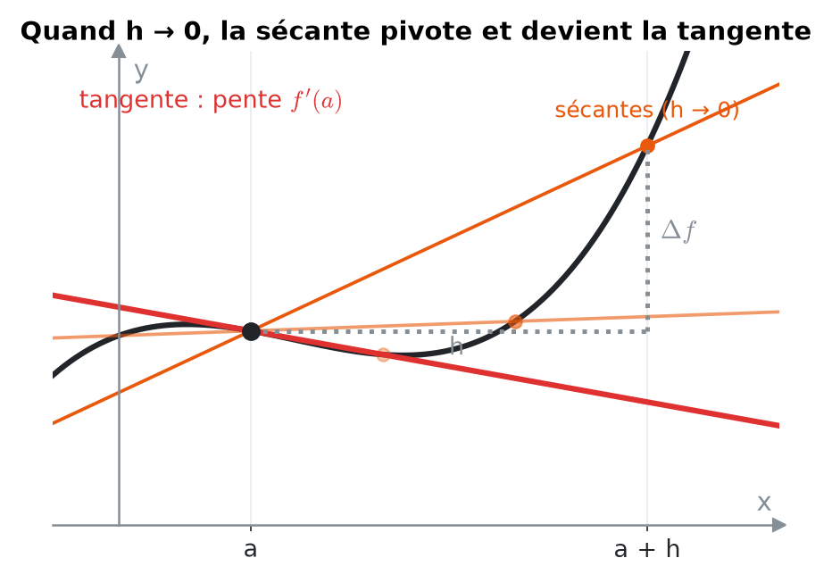
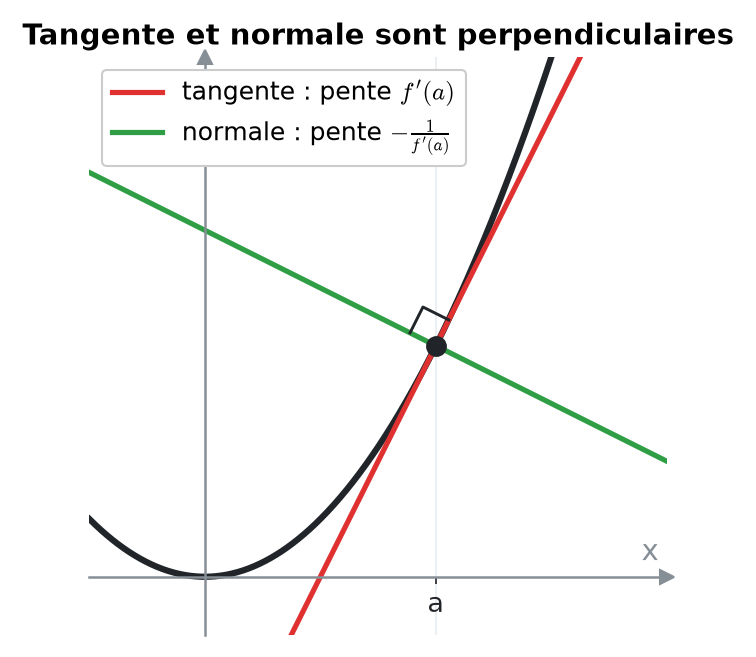
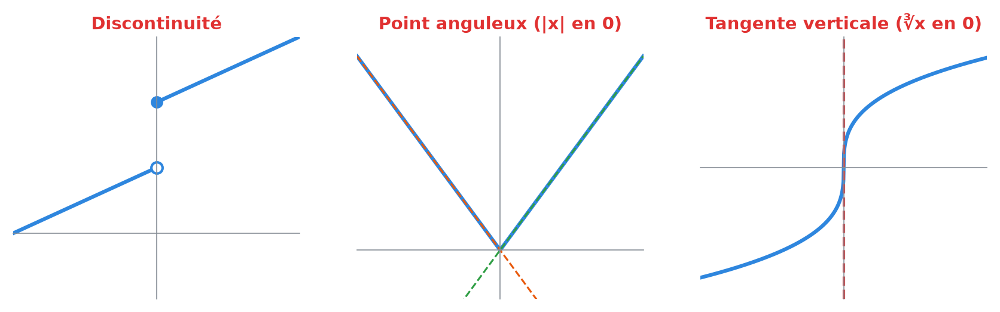
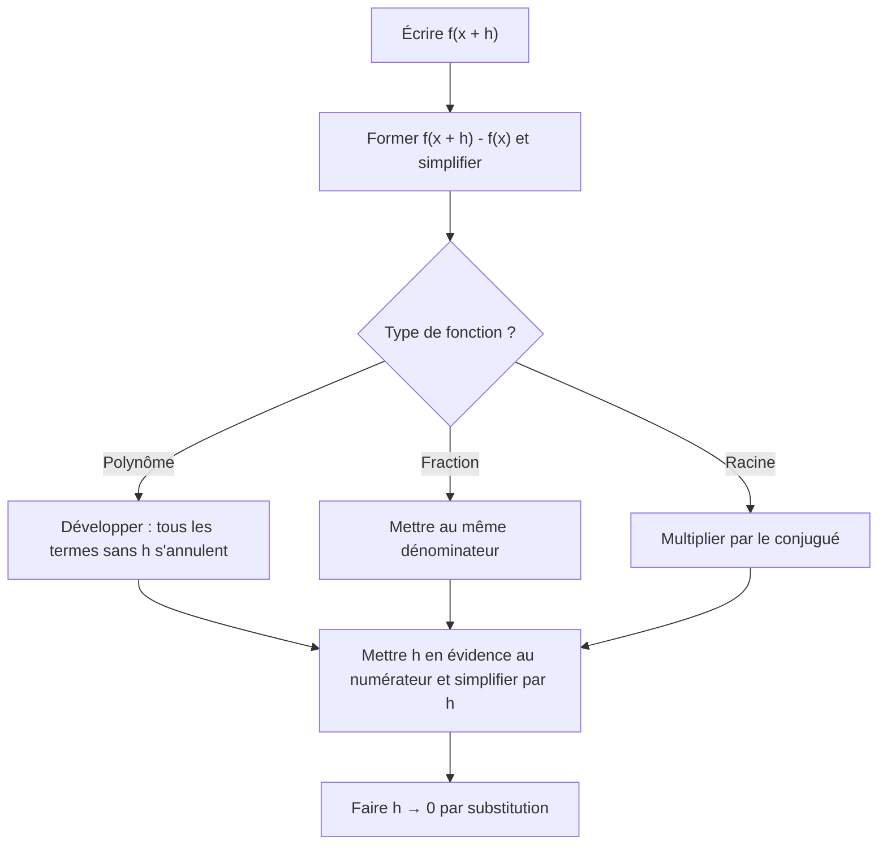
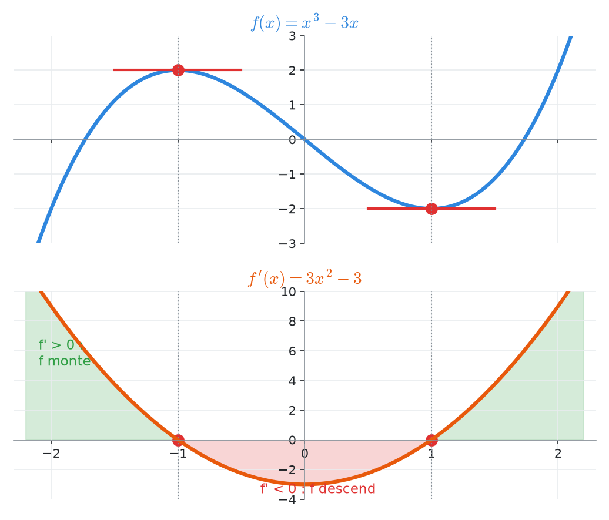
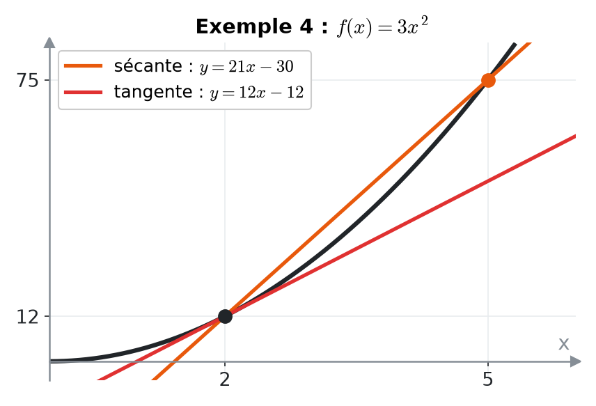
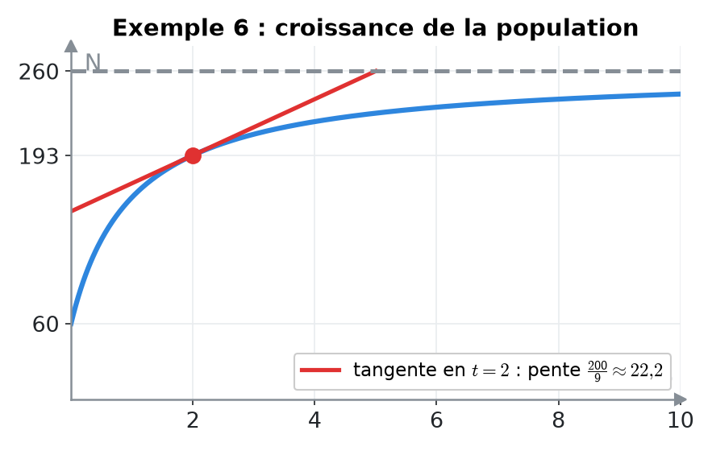
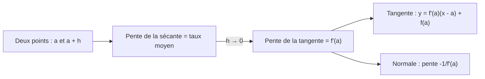
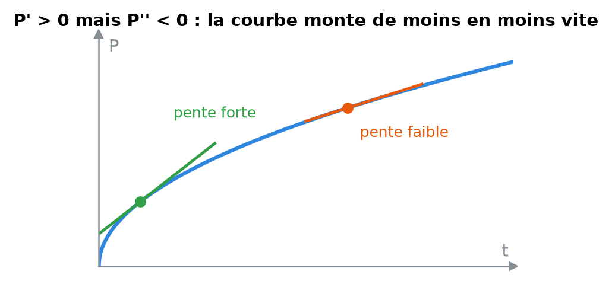

# 7. La dérivée : taux de variation, définition et tangentes


**Objectif** : comprendre la dérivée comme <mark style="color:blue;">taux de variation instantané</mark> et <mark style="color:blue;">pente de la tangente</mark>, la calculer <mark style="color:green;">par la définition</mark> (limite), écrire les équations des droites sécante, tangente et normale, et interpréter une dérivée dans un contexte (population, vitesse). C'est « Taux de variation », « Définition de la dérivée » et « Droites sécantes, tangentes et normales » des TE 1 et TE 2.


---

## 1. Introduction & définitions

### 1.1 Taux de variation moyen

Entre x = a et x = b, la fonction passe de f(a) à f(b). Le <mark style="color:orange;">taux de variation moyen</mark> est :

$$\Large \frac{\Delta f}{\Delta x} = \frac{f(b) - f(a)}{b - a}$$

C'est la <mark style="color:orange;">pente de la droite sécante</mark> passant par (a ; f(a)) et (b ; f(b)). En physique : vitesse moyenne, accélération moyenne…

En posant b = x + h (un petit pas h à partir de x) :

$$\Large T_v(x, h) = \frac{f(x + h) - f(x)}{h}$$

### 1.2 Taux de variation instantané : la dérivée

En faisant tendre le pas h vers 0, la sécante « pivote » et devient la <mark style="color:red;">tangente</mark>. Sa pente est la <mark style="color:red;">dérivée</mark> :

$$\Large \boxed{f'(x) = \lim_{h \to 0}\frac{f(x + h) - f(x)}{h}}$$

<figure><figcaption></figcaption></figure>

Notations équivalentes : f'(x), df/dx, dy/dx, ẋ(t) (en physique). Si la limite existe, f est <mark style="color:green;">dérivable</mark> en x.

### 1.3 Interprétations

| Contexte | f'(a) signifie… | Unité |
| --- | --- | --- |
| Géométrie | pente de la tangente au graphe en a | — |
| Position x(t) | vitesse instantanée | m/s |
| Vitesse v(t) | accélération instantanée | m/s² |
| Population N(t) | vitesse de croissance de la population | individus/an |


L'<mark style="color:green;">unité</mark> d'une dérivée est toujours « unité de f » <mark style="color:green;">par</mark> « unité de x ».


### 1.4 Tangente et normale

La <mark style="color:red;">tangente</mark> au graphe de f au point d'abscisse a :

$$\Large \boxed{t(x) = f'(a)\,(x - a) + f(a)}$$

La <mark style="color:green;">normale</mark> est la droite <mark style="color:green;">perpendiculaire</mark> à la tangente au même point. Sa pente vaut −1/f'(a) (si f'(a) ≠ 0) :

$$\Large n(x) = -\frac{1}{f'(a)}\,(x - a) + f(a)$$

<figure><figcaption></figcaption></figure>

Si f'(a) = 0, la tangente est horizontale et la normale est la droite verticale x = a.

### 1.5 Où une fonction n'est-elle pas dérivable ?

* en un <mark style="color:red;">point de discontinuité</mark> ;
* en un <mark style="color:red;">point anguleux</mark> (pentes différentes à gauche et à droite, ex. |x| en 0) ;
* en un point à <mark style="color:red;">tangente verticale</mark> (ex. ∛x en 0).

<figure><figcaption></figcaption></figure>

---

## 2. Méthodes de résolution

### Méthode A — Dérivée par la définition


On ne remplace <mark style="color:red;">jamais</mark> h par 0 avant d'avoir simplifié : on obtiendrait 0/0.


### Méthode B — Équations de droites

1. <mark style="color:orange;">Sécante</mark> par (a ; f(a)) et (b ; f(b)) : pente m = (f(b) − f(a))/(b − a), puis y = m(x − a) + f(a).
2. <mark style="color:red;">Tangente</mark> en a : calculer f(a) <mark style="color:blue;">et</mark> f'(a), puis la formule.
3. <mark style="color:green;">Normale</mark> en a : pente −1/f'(a), même point.
4. <mark style="color:blue;">Contrôle</mark> : la droite doit passer par le point ; la pente doit être cohérente avec l'allure du graphe.

### Méthode C — Lire le graphe de f' à partir de celui de f

* Là où f <mark style="color:green;">monte</mark>, f' > 0 ; là où f <mark style="color:red;">descend</mark>, f' < 0.
* Aux sommets et creux (tangente horizontale), <mark style="color:blue;">f' = 0</mark>.
* Là où f est la plus raide, |f'| est maximale.
* En un point anguleux, f' n'est pas définie (saut dans le graphe de f').

<figure><figcaption>
Les tangentes horizontales de f correspondent aux zéros de f'.
</figcaption></figure>

---

## 3. Exemples de calculs détaillés

### Exemple 1 — Taux de variation (TE 1, 2024)

*Donner le taux de variation de f(x) = 5x² + 3.*

$$\large T_v = \frac{5(x + h)^2 + 3 - 5x^2 - 3}{h} = \frac{5x^2 + 10xh + 5h^2 - 5x^2}{h} = \frac{10xh + 5h^2}{h} = \color{#2F9E44}10x + 5h$$

(pour h ≠ 0). En faisant h → 0, on obtient la dérivée <mark style="color:green;">f'(x) = 10x</mark>.

### Exemple 2 — Dérivée par la définition d'une fraction (Travail écrit 3, 2023)

*Calculer par la définition la dérivée de :*

$$\Large f(x) = \frac{1}{2 - 3x}$$

<mark style="color:orange;">Étape 1 — Différence</mark> au même dénominateur :

$$\large f(x + h) - f(x) = \frac{1}{2 - 3x - 3h} - \frac{1}{2 - 3x} = \frac{(2 - 3x) - (2 - 3x - 3h)}{(2 - 3x - 3h)(2 - 3x)} = \frac{3h}{(2 - 3x - 3h)(2 - 3x)}$$

<mark style="color:orange;">Étape 2 — Division par h</mark> et limite :

$$\large f'(x) = \lim_{h \to 0}\frac{3}{(2 - 3x - 3h)(2 - 3x)} = \color{#2F9E44}\frac{3}{(2 - 3x)^2}$$

### Exemple 3 — Définition avec une racine (TE 2, 2019)

*Calculer par la définition la dérivée de :*

$$\Large g(x) = \sqrt{1 - x}$$

On multiplie par le <mark style="color:blue;">conjugué</mark> :

$$\large \frac{\sqrt{1 - x - h} - \sqrt{1 - x}}{h}\cdot\frac{\sqrt{1 - x - h} + \sqrt{1 - x}}{\sqrt{1 - x - h} + \sqrt{1 - x}} = \frac{(1 - x - h) - (1 - x)}{h\left(\sqrt{1 - x - h} + \sqrt{1 - x}\right)}$$

$$\large = \frac{-1}{\sqrt{1 - x - h} + \sqrt{1 - x}} \xrightarrow[h \to 0]{} \color{#2F9E44}\frac{-1}{2\sqrt{1 - x}}$$

### Exemple 4 — Sécante, tangente, normale (TE 2, 2019)

*Soit f(x) = 3x² (donc f'(x) = 6x).*

<mark style="color:orange;">a) Sécante</mark> par (2 ; 12) et (5 ; 75) :

$$\large m = \frac{75 - 12}{5 - 2} = 21 \qquad \color{#2F9E44}y = 21(x - 2) + 12 = 21x - 30$$

<mark style="color:red;">b) Tangente</mark> en x = 2, avec f'(2) = 12 :

$$\large \color{#2F9E44}y = 12(x - 2) + 12 = 12x - 12$$

<mark style="color:green;">c) Normale</mark> en x = 2, pente −1/12 :

$$\large \color{#2F9E44}y = -\frac{1}{12}(x - 2) + 12 = -\frac{x}{12} + \frac{73}{6}$$

<figure><figcaption></figcaption></figure>

### Exemple 5 — Tangente et normale plus riches (TE 3, 2019)

$$\Large f(x) = 3x^3 - 6x + \frac{2}{x} \qquad g(x) = 3e^{2x}$$

*a) Tangente à f en x = 2. b) Normale à g en x = −1.*

<mark style="color:orange;">a)</mark> Valeur et pente :

$$\large f(2) = 24 - 12 + 1 = 13 \qquad f'(x) = 9x^2 - 6 - \frac{2}{x^2} \qquad f'(2) = \frac{59}{2}$$

$$\large \color{#2F9E44}t(x) = \frac{59}{2}(x - 2) + 13 = \frac{59}{2}x - 46$$

<mark style="color:orange;">b)</mark> g(−1) = 3e⁻² et g'(x) = 6e^(2x), donc g'(−1) = 6e⁻². Pente de la normale : −e²/6.

$$\large \color{#2F9E44}n(x) = -\frac{e^2}{6}(x + 1) + \frac{3}{e^2}$$

### Exemple 6 — Taux de variation en contexte (Travail écrit 2, 2022)

*a) Une population vaut N(t) (t en années). Taux de variation instantané en t = 2 ?*

$$\Large N(t) = \frac{200t}{1 + t} + 60$$

Avec les règles (chapitre 8) :

$$\large N'(t) = \frac{200(1 + t) - 200t}{(1 + t)^2} = \frac{200}{(1 + t)^2} \qquad N'(2) = \frac{200}{9} \approx \color{#2F9E44}22{,}2 \text{ individus/an}$$

<mark style="color:blue;">Interprétation</mark> : à l'instant t = 2 ans, la population augmente à la vitesse d'environ 22 individus par an.

<figure><figcaption></figcaption></figure>

*b) Un objet a une vitesse v(t) = 1,2√t m/s. Taux de variation moyen de la vitesse sur \[1 s, 4 s] ?*

$$\large \frac{v(4) - v(1)}{4 - 1} = \frac{2{,}4 - 1{,}2}{3} = \color{#2F9E44}0{,}4 \text{ m/s}^2$$

C'est l'<mark style="color:orange;">accélération moyenne</mark> entre 1 s et 4 s. Le taux instantané v'(4) = 0,6/√4 = 0,3 m/s² est la <mark style="color:red;">pente de la tangente</mark> au graphe de v en t = 4.

---

## 4. Visualisation : de la sécante à la tangente

---

## 5. Exercices pratiques

### Exercice 1 — Définition (TE, 2024)

Calculer par la définition la dérivée de :

$$\Large f(x) = \frac{x}{x + 1}$$

Cliquez pour voir l'indice

Mettez (x + h)/(x + h + 1) − x/(x + 1) au même dénominateur ; au numérateur, tous les termes sauf un multiple de h se simplifient.

Solution détaillée

<mark style="color:orange;">1.</mark> Numérateur de la différence :

$$\large (x + h)(x + 1) - x(x + h + 1) = x^2 + x + hx + h - x^2 - xh - x = h$$

<mark style="color:orange;">2.</mark> Division par h :

$$\large \frac{f(x + h) - f(x)}{h} = \frac{h}{h(x + h + 1)(x + 1)} = \frac{1}{(x + h + 1)(x + 1)}$$

<mark style="color:orange;">3.</mark> Limite :

$$\Large \color{#2F9E44}f'(x) = \frac{1}{(x + 1)^2}$$

### Exercice 2 — Tangente, sécante, normale (TE 2, 2024)

Une fonction f passe par les points (1 ; −1) et (2 ; 8) et sa dérivée est f'(x) = 6x. Déterminer : a) la sécante par ces deux points ; b) la tangente en x = 1 ; c) la normale en x = 1.

Cliquez pour voir l'indice

Pour b) et c), le point de contact est (1 ; −1) et la pente de la tangente est f'(1).

Solution détaillée

<mark style="color:orange;">a)</mark> m = (8 − (−1))/(2 − 1) = 9 :

$$\large \color{#2F9E44}y = 9(x - 1) - 1 = 9x - 10$$

<mark style="color:orange;">b)</mark> f'(1) = 6 :

$$\large \color{#2F9E44}y = 6(x - 1) - 1 = 6x - 7$$

<mark style="color:orange;">c)</mark> Pente −1/6 :

$$\large \color{#2F9E44}y = -\frac{1}{6}(x - 1) - 1 = -\frac{x}{6} - \frac{5}{6}$$

### Exercice 3 — Lecture de dérivée (Test 1, 2023)

Une population P(t) <mark style="color:green;">augmente</mark> sur \[a, b], mais son <mark style="color:red;">taux de croissance diminue</mark>. a) Quelle expression correspond au taux de croissance instantané ? b) Quel est le signe de P'(t) sur ]a, b\[ ? c) Comment traduire mathématiquement que le taux de croissance décroît ? d) Décrire l'allure de la courbe.

Cliquez pour voir l'indice

Le taux de croissance est une dérivée ; « ce taux diminue » concerne la dérivée **de la dérivée**.

Solution détaillée

<mark style="color:orange;">a)</mark> P'(t).

<mark style="color:orange;">b)</mark> La population augmente : <mark style="color:green;">P'(t) > 0</mark>.

<mark style="color:orange;">c)</mark> Le taux P' décroît : sa dérivée est négative, <mark style="color:red;">P''(t) < 0</mark>.

<mark style="color:orange;">d)</mark> Une courbe <mark style="color:green;">croissante</mark> mais qui <mark style="color:red;">s'aplatit</mark> : elle monte de moins en moins vite (concave, « en dôme »), comme √t ou ln t.

<figure><figcaption></figcaption></figure>

