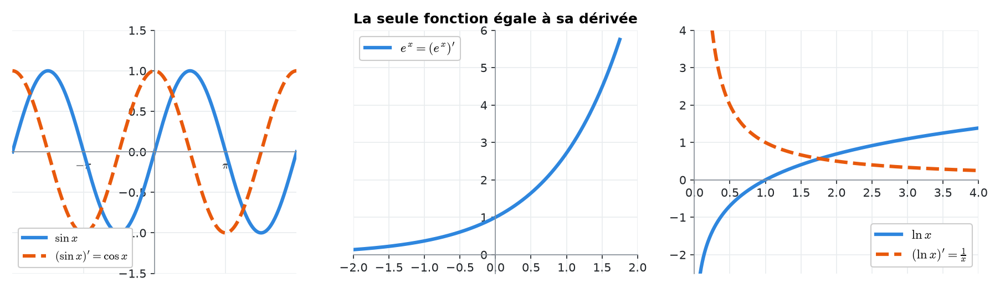
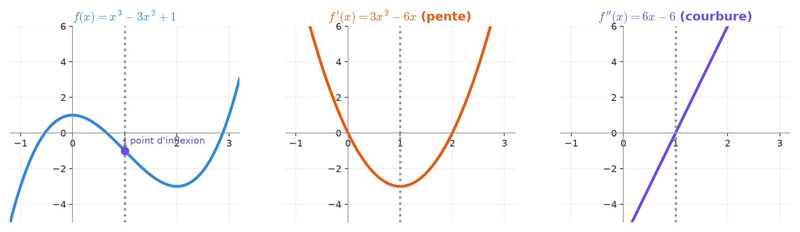
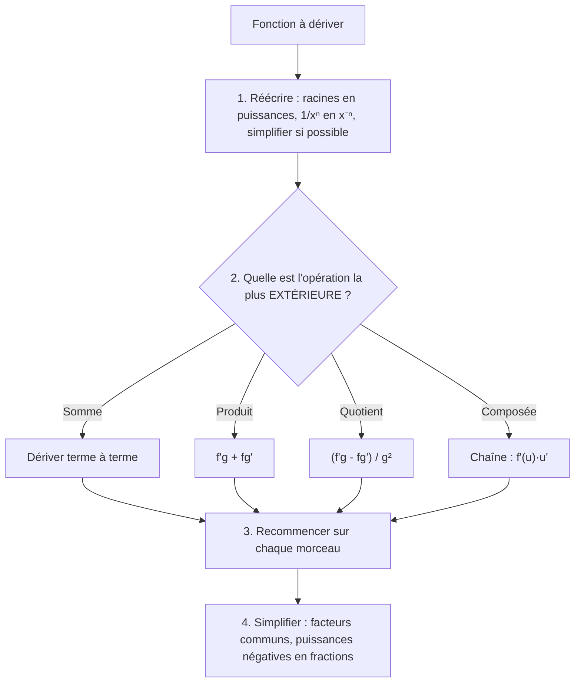
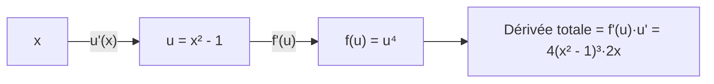

# 8. Règles de dérivation


**Objectif** : dériver rapidement et sans erreur <mark style="color:blue;">n'importe quelle</mark> fonction construite à partir des fonctions usuelles (puissances, racines, exponentielles, logarithmes, trigonométriques, arctan), en combinant les règles du produit, du quotient et de la chaîne, puis <mark style="color:green;">simplifier</mark> le résultat. C'est « Dérivées » dans les TE 2, TE 3, Test 1 (2023) et l'examen de décembre 2023.


---

## 1. Introduction & définitions

Calculer une dérivée par la définition (chapitre 7) est long. On établit une fois pour toutes les dérivées des fonctions de base et des <mark style="color:blue;">règles</mark> pour les combiner.

### 1.1 Table des dérivées usuelles

| f(x) | f'(x) | Remarque |
| --- | --- | --- |
| c (constante) | $$0$$ | <mark style="color:red;">π, e², ln 2, sin 4 sont des constantes !</mark> |
| $$x^n$$ | $$nx^{n-1}$$ | valable pour tout exposant réel n |
| $$\sqrt{x}$$ | $$\frac{1}{2\sqrt{x}}$$ | cas n = 1/2 |
| $$\frac{1}{x}$$ | $$-\frac{1}{x^2}$$ | cas n = −1 |
| $$e^x$$ | $$e^x$$ | |
| $$a^x$$ | $$a^x\ln a$$ | |
| $$\ln x$$ | $$\frac{1}{x}$$ | |
| $$\log_a x$$ | $$\frac{1}{x\ln a}$$ | |
| $$\sin x$$ | $$\cos x$$ | |
| $$\cos x$$ | $$-\sin x$$ | |
| $$\tan x$$ | $$\frac{1}{\cos^2 x} = 1 + \tan^2 x$$ | |
| $$\arctan x$$ | $$\frac{1}{1 + x^2}$$ | |
| $$\arcsin x$$ | $$\frac{1}{\sqrt{1 - x^2}}$$ | |
| $$\arccos x$$ | $$-\frac{1}{\sqrt{1 - x^2}}$$ | |

<figure><figcaption>
Quelques fonctions (trait plein) et leurs dérivées (pointillés).
</figcaption></figure>

### 1.2 Règles de combinaison

<mark style="color:blue;">Linéarité</mark> :

$$\Large (af + bg)' = af' + bg'$$

<mark style="color:blue;">Produit</mark> :

$$\Large \boxed{(f\cdot g)' = f'g + fg'}$$

<mark style="color:blue;">Quotient</mark> :

$$\Large \boxed{\left(\frac{f}{g}\right)' = \frac{f'g - fg'}{g^2}}$$

<mark style="color:blue;">Chaîne</mark> (fonction composée) — « dérivée de l'extérieur, évaluée à l'intérieur, <mark style="color:green;">fois</mark> dérivée de l'intérieur » :

$$\Large \boxed{\left(f(u(x))\right)' = f'(u(x))\cdot u'(x)}$$

Formes fréquentes de la règle de chaîne :

$$\large \left(u^n\right)' = nu^{n-1}u' \qquad \left(e^u\right)' = e^uu' \qquad \left(\ln u\right)' = \frac{u'}{u}$$

$$\large \left(\sin u\right)' = u'\cos u \qquad \left(\sqrt{u}\right)' = \frac{u'}{2\sqrt{u}}$$

### 1.3 Dérivées d'ordre supérieur

f'' = (f')' est la <mark style="color:purple;">dérivée seconde</mark> (concavité, accélération), f''' = (f'')' la dérivée troisième, etc. Notation de Leibniz :

$$\large \frac{d^2y}{dx^2} \qquad \frac{d^3x}{dt^3}$$

<figure><figcaption>
f'' s'annule là où la courbure de f change de sens (point d'inflexion).
</figcaption></figure>

---

## 2. Méthodes de résolution

### Méthode générale

### Astuces

* <mark style="color:green;">Avant de dériver, simplifier</mark> :

$$\large \frac{x}{e^x} = xe^{-x} \qquad \ln(5t^2) = \ln 5 + 2\ln t \qquad \frac{x^2 - 3x}{x^3} = \frac{1}{x} - \frac{3}{x^2}$$

* Pour un <mark style="color:blue;">produit de puissances</mark>, mettre en évidence les <mark style="color:blue;">plus petites puissances</mark> communes à la fin.
* Pour évaluer une dérivée en un point, <mark style="color:blue;">dériver d'abord, puis substituer</mark>.

---

## 3. Exemples de calculs détaillés

### Exemple 1 — Somme de puissances (TE 2, 2024)

$$\Large a(x) = 2x^5 - 8x^3 + 11x^2 + 7\sqrt[3]{x} + \frac{1}{3x} + \frac{5}{\sqrt{x}}$$

<mark style="color:orange;">Réécriture</mark> en puissances :

$$\large a(x) = 2x^5 - 8x^3 + 11x^2 + 7x^{1/3} + \frac{1}{3}x^{-1} + 5x^{-1/2}$$

<mark style="color:orange;">Dérivation</mark> terme à terme avec (xⁿ)' = nxⁿ⁻¹ :

$$\large a'(x) = 10x^4 - 24x^2 + 22x + \frac{7}{3}x^{-2/3} - \frac{1}{3}x^{-2} - \frac{5}{2}x^{-3/2}$$

$$\Large \color{#2F9E44}a'(x) = 10x^4 - 24x^2 + 22x + \frac{7}{3\sqrt[3]{x^2}} - \frac{1}{3x^2} - \frac{5}{2x\sqrt{x}}$$


Erreur vue en examen :

$$\left(\frac{1}{3x}\right)' = -\frac{1}{3x^2}$$

et <mark style="color:red;">non</mark> −1/(9x²) ni −3x⁻². Le 1/3 est une <mark style="color:green;">constante multiplicative</mark>.


### Exemple 2 — Quotient (TE 2, 2024)

$$\Large b(t) = \frac{2t - 5}{1 - 3t}$$

$$\large b'(t) = \frac{2(1 - 3t) - (2t - 5)(-3)}{(1 - 3t)^2} = \frac{2 - 6t + 6t - 15}{(1 - 3t)^2} = \color{#2F9E44}\frac{-13}{(1 - 3t)^2}$$

### Exemple 3 — La chaîne sous toutes ses formes (TE 3, 2024)

<mark style="color:orange;">a)</mark> (log₇ u)' = u' / (u ln 7) avec u' = 10x :

$$\large a(x) = \log_7(5x^2 - 3) \qquad \color{#2F9E44}a'(x) = \frac{10x}{(5x^2 - 3)\ln 7}$$

<mark style="color:orange;">b)</mark> (3ᵘ)' = 3ᵘ ln 3 · u' :

$$\large b(x) = 3^{4x + 5} \qquad \color{#2F9E44}b'(x) = 4\ln 3\cdot 3^{4x + 5}$$

<mark style="color:red;">Attention</mark> : on ne peut pas écrire 4 · 3^(4x+5) = 12^(4x+5) !

<mark style="color:orange;">c)</mark> Chaîne à deux étages :

$$\large c(x) = 4\arctan\left(\sqrt{x - 1}\right)$$

$$\large c'(x) = 4\cdot\frac{1}{1 + \left(\sqrt{x - 1}\right)^2}\cdot\frac{1}{2\sqrt{x - 1}} = \frac{4}{x}\cdot\frac{1}{2\sqrt{x - 1}} = \color{#2F9E44}\frac{2}{x\sqrt{x - 1}}$$

<mark style="color:orange;">d)</mark> Intérieur u = (2/3)x⁻¹, u' = −2/(3x²) :

$$\large d(x) = \cos\left(\frac{2}{3x}\right) \qquad d'(x) = -\sin\left(\frac{2}{3x}\right)\cdot\left(-\frac{2}{3x^2}\right) = \color{#2F9E44}\frac{2}{3x^2}\sin\left(\frac{2}{3x}\right)$$

### Exemple 4 — Produit de puissances et factorisation (TE 3, 2024)

$$\Large e(x) = (x^2 - 1)^4(x^3 + 2)^5$$

Produit, puis chaîne sur chaque facteur :

$$\large e'(x) = 4(x^2 - 1)^3\cdot 2x\cdot(x^3 + 2)^5 + (x^2 - 1)^4\cdot 5(x^3 + 2)^4\cdot 3x^2$$

On met en évidence les <mark style="color:blue;">plus petites puissances communes</mark> x(x² − 1)³(x³ + 2)⁴ :

$$\large e'(x) = x(x^2 - 1)^3(x^3 + 2)^4\left[8(x^3 + 2) + 15x(x^2 - 1)\right]$$

$$\Large \color{#2F9E44}e'(x) = x(x^2 - 1)^3(x^3 + 2)^4\left(23x^3 - 15x + 16\right)$$

### Exemple 5 — Exponentielles et logarithmes (TE 3, 2024)

<mark style="color:orange;">h</mark> :

$$\large h(x) = (x - 1)e^{-2x} \qquad h'(x) = e^{-2x} + (x - 1)(-2)e^{-2x} = \color{#2F9E44}e^{-2x}(3 - 2x)$$

<mark style="color:orange;">i</mark> :

$$\large i(x) = \ln\left(\sin(3e^{2x})\right) \qquad i'(x) = \frac{\cos(3e^{2x})\cdot 6e^{2x}}{\sin(3e^{2x})} = \color{#2F9E44}6e^{2x}\cot\left(3e^{2x}\right)$$

<mark style="color:orange;">j</mark> (on simplifie d'abord) :

$$\large j(x) = \frac{x}{e^x} = xe^{-x} \qquad j'(x) = e^{-x} - xe^{-x} = \color{#2F9E44}e^{-x}(1 - x)$$

<mark style="color:orange;">g</mark> (duplication à la fin) :

$$\large g(x) = 5\sin^2(4x) \qquad g'(x) = 5\cdot 2\sin(4x)\cdot\cos(4x)\cdot 4 = 40\sin(4x)\cos(4x) = \color{#2F9E44}20\sin(8x)$$

### Exemple 6 — Dérivée en un point et dérivée troisième (Travail écrit 3, 2023)

<mark style="color:orange;">e)</mark> *dy/dx en x = 4 pour :*

$$\large y = \frac{x^2 - x - 2}{x^2 - 6}$$

$$\large y' = \frac{(2x - 1)(x^2 - 6) - (x^2 - x - 2)(2x)}{(x^2 - 6)^2} \qquad y'(4) = \frac{7\cdot 10 - 10\cdot 8}{100} = \color{#2F9E44}-\frac{1}{10}$$

<mark style="color:orange;">f)</mark> *x'''(t) pour x(t) = ln(5t²).* On simplifie d'abord : x(t) = ln 5 + 2 ln t (pour t > 0).

$$\large x'(t) = \frac{2}{t} \qquad x''(t) = -\frac{2}{t^2} \qquad \color{#2F9E44}x'''(t) = \frac{4}{t^3}$$

---

## 4. Visualisation : la règle de chaîne comme une chaîne d'engrenages

Chaque « étage » <mark style="color:green;">multiplie</mark> par sa propre dérivée, évaluée à l'étage inférieur.

---

## 5. Exercices pratiques

### Exercice 1 — (Travail écrit 3, 2023)

Dériver :

$$\large \text{a) } f(x) = 5x^6\tan x \qquad \text{b) } g(t) = 2\sqrt{t^2 + t} \qquad \text{c) } k(y) = \cos(3y^3 - 5y) + 2 \qquad \text{d) } h(t) = 2te^{4t^2}$$

Cliquez pour voir l'indice

a) produit ; b) chaîne avec √u ; c) chaîne avec cos u (la constante 2 disparaît) ; d) produit **et** chaîne.

Solution détaillée

<mark style="color:orange;">a)</mark>

$$\large f'(x) = 30x^5\tan x + 5x^6\cdot\frac{1}{\cos^2 x} = \color{#2F9E44}5x^5\left(6\tan x + \frac{x}{\cos^2 x}\right)$$

<mark style="color:orange;">b)</mark>

$$\large g'(t) = 2\cdot\frac{2t + 1}{2\sqrt{t^2 + t}} = \color{#2F9E44}\frac{2t + 1}{\sqrt{t^2 + t}}$$

<mark style="color:orange;">c)</mark>

$$\large k'(y) = -\sin(3y^3 - 5y)\cdot(9y^2 - 5) = \color{#2F9E44}(5 - 9y^2)\sin(3y^3 - 5y)$$

<mark style="color:orange;">d)</mark>

$$\large h'(t) = 2e^{4t^2} + 2t\cdot e^{4t^2}\cdot 8t = \color{#2F9E44}2e^{4t^2}\left(1 + 8t^2\right)$$

### Exercice 2 — (TE 3, 2019)

Dériver :

$$\large \text{a) } f(x) = 2e^{-\sqrt{x}} + \pi^2x - \ln(2)x^2 \qquad \text{b) } g(a) = \sqrt[7]{(4a^3 + 2)^5} \qquad \text{c) } h(u) = \frac{u^2 - 2}{7 - 3u}$$

Cliquez pour voir l'indice

a) π² et ln 2 sont des **constantes**. b) Écrivez (4a³ + 2)^(5/7). c) Quotient.

Solution détaillée

<mark style="color:orange;">a)</mark>

$$\large f'(x) = 2e^{-\sqrt{x}}\cdot\left(-\frac{1}{2\sqrt{x}}\right) + \pi^2 - 2\ln(2)\,x = \color{#2F9E44}-\frac{e^{-\sqrt{x}}}{\sqrt{x}} + \pi^2 - 2\ln(2)\,x$$

<mark style="color:orange;">b)</mark>

$$\large g'(a) = \frac{5}{7}(4a^3 + 2)^{-2/7}\cdot 12a^2 = \color{#2F9E44}\frac{60a^2}{7\sqrt[7]{(4a^3 + 2)^2}}$$

<mark style="color:orange;">c)</mark>

$$\large h'(u) = \frac{2u(7 - 3u) - (u^2 - 2)(-3)}{(7 - 3u)^2} = \color{#2F9E44}\frac{-3u^2 + 14u - 6}{(7 - 3u)^2}$$

### Exercice 3 — (Examen, décembre 2023)

$$\large \text{a) } f(x) = \frac{(x^2 - 16)^2}{\pi} \qquad \text{b) } f(x) = \ln\left(e^{x^2 - 5x + 3}\right) \qquad \text{c) } f(x) = (x^2 - 7)\sqrt{3x - 5}$$

d) Sachant que f(2) = −4 et f'(2) = 1, écrire la tangente en x = 2.

Cliquez pour voir l'indice

a) 1/π est une constante. b) Simplifiez d'abord : ln(e^A) = A. d) Formule de la tangente.

Solution détaillée

<mark style="color:orange;">a)</mark>

$$\large f'(x) = \frac{2(x^2 - 16)\cdot 2x}{\pi} = \color{#2F9E44}\frac{4x^3 - 64x}{\pi}$$

<mark style="color:orange;">b)</mark> f(x) = x² − 5x + 3, donc <mark style="color:green;">f'(x) = 2x − 5</mark>.

<mark style="color:orange;">c)</mark>

$$\large f'(x) = 2x\sqrt{3x - 5} + (x^2 - 7)\cdot\frac{3}{2\sqrt{3x - 5}} = \frac{4x(3x - 5) + 3(x^2 - 7)}{2\sqrt{3x - 5}} = \color{#2F9E44}\frac{15x^2 - 20x - 21}{2\sqrt{3x - 5}}$$

<mark style="color:orange;">d)</mark>

$$\large y = f'(2)(x - 2) + f(2) = (x - 2) - 4 = \color{#2F9E44}x - 6$$

