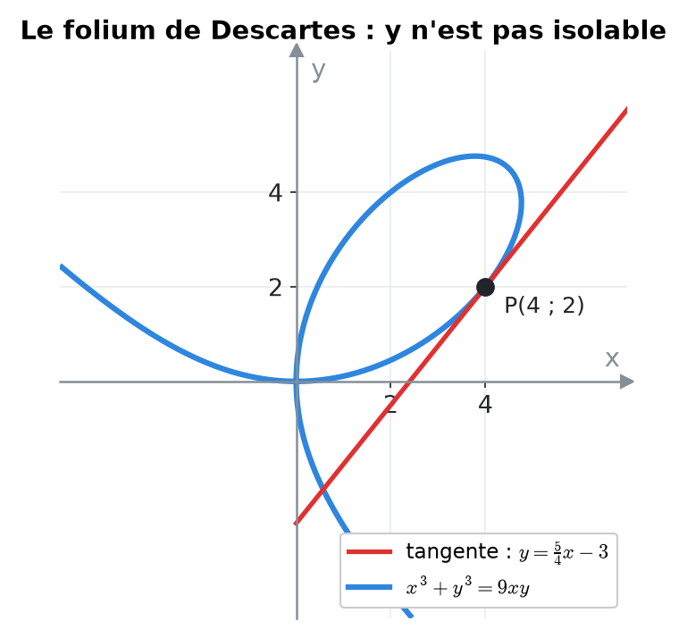
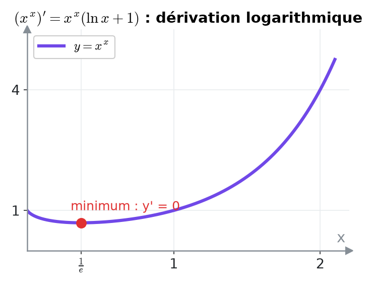
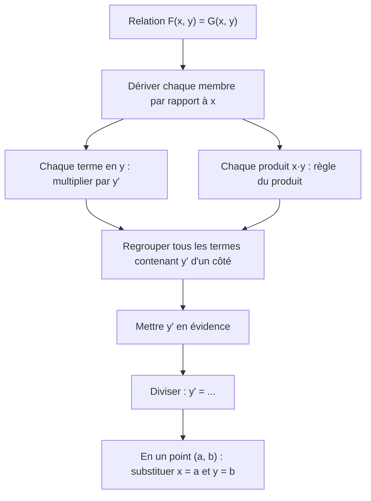
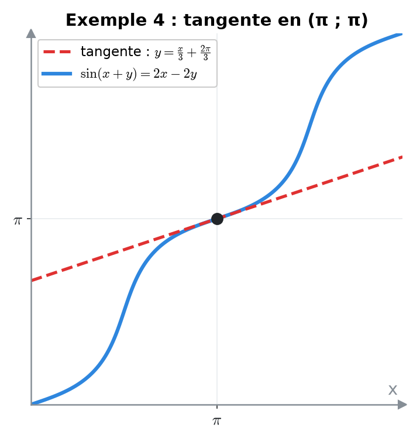
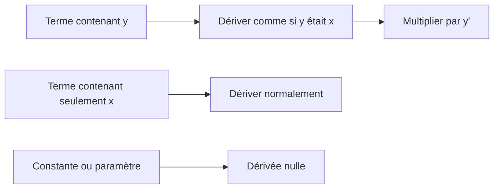
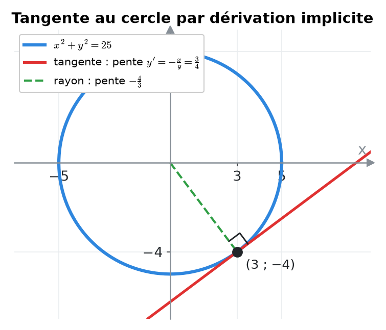

# 9. Dérivation implicite et dérivation logarithmique


**Objectif** : dériver une relation F(x, y) = 0 où y n'est pas isolable (dérivation <mark style="color:blue;">implicite</mark>), trouver la pente d'une courbe en un point, et dériver des fonctions du type f(x)^g(x) (dérivation <mark style="color:purple;">logarithmique</mark>). C'est « Dérivée implicite » (TE 2, TE 3), « Dérivées logarithmiques » (TE 3, 2024) et le « folium de Descartes » (Test 1, 2023).


---

## 1. Introduction & définitions

### 1.1 Fonctions implicites

Une équation comme x² + y² = 25 décrit une courbe (ici un cercle) sans donner y <mark style="color:blue;">explicitement</mark> en fonction de x. Localement, autour d'un point, y <mark style="color:green;">est</mark> une fonction de x : y = y(x). On peut la dériver <mark style="color:green;">sans l'isoler</mark>.

<figure><figcaption>
Impossible d'écrire y = … pour cette courbe, mais on peut quand même calculer la pente de sa tangente.
</figcaption></figure>

<mark style="color:blue;">Principe</mark> : on dérive les deux membres par rapport à x, en se souvenant que y dépend de x. Par la règle de chaîne :

$$\Large \frac{d}{dx}\left(y^2\right) = 2y\cdot {\color{#E03131}y'} \qquad \frac{d}{dx}\left(e^y\right) = e^y\cdot {\color{#E03131}y'} \qquad \frac{d}{dx}\left(\sin y\right) = \cos y\cdot {\color{#E03131}y'}$$

et, par la règle du produit :

$$\Large \frac{d}{dx}\left(xy\right) = 1\cdot y + x\cdot {\color{#E03131}y'}$$


**Réflexe** : chaque fois qu'on dérive une expression contenant y, on <mark style="color:red;">multiplie par y'</mark> (ou dy/dx). C'est la règle de chaîne, avec y comme « fonction intérieure ».


### 1.2 Dérivation logarithmique

Pour une fonction où la variable est <mark style="color:purple;">à la fois dans la base et dans l'exposant</mark>, comme y = xˣ ou y = (cos 3x)^(sin 3x), aucune règle du chapitre 8 ne s'applique directement :

* (uⁿ)' = nuⁿ⁻¹u' exige un <mark style="color:red;">exposant constant</mark> ;
* (aᵘ)' = aᵘ ln a · u' exige une <mark style="color:red;">base constante</mark>.

On prend le logarithme :

$$\Large y = f(x)^{g(x)} \implies \ln y = g(x)\ln f(x)$$

puis on dérive implicitement :

$$\Large \frac{y'}{y} = \left(g(x)\ln f(x)\right)' \qquad\Rightarrow\qquad y' = y\cdot\left(g(x)\ln f(x)\right)'$$

Équivalent : f^g = e^(g ln f), puis règle de chaîne.

<figure><figcaption></figcaption></figure>

---

## 2. Méthodes de résolution

### Méthode A — Dérivation implicite

### Méthode B — Tangente à une courbe implicite

1. <mark style="color:blue;">Vérifier</mark> que le point appartient à la courbe.
2. Calculer y' implicitement et l'évaluer au point : pente m.
3. y = m(x − a) + b.

### Méthode C — Dérivation logarithmique

1. Écrire ln y = g(x) ln f(x) (en supposant y > 0).
2. Dériver :

$$\large \frac{y'}{y} = g'(x)\ln f(x) + g(x)\frac{f'(x)}{f(x)}$$

3. <mark style="color:green;">Multiplier par y</mark> et remplacer y par son expression.

---

## 3. Exemples de calculs détaillés

### Exemple 1 — Un exemple de base (TE 3, 2024)

$$\Large e^{xy} + x^2 = 10 + y^2$$

<mark style="color:orange;">Étape 1 — Dériver</mark> chaque terme :

* e^(xy) → e^(xy) · (y + xy') (chaîne puis produit) ;
* x² → 2x ; 10 → 0 ; y² → 2yy'.

$$\large e^{xy}(y + xy') + 2x = 2yy'$$

<mark style="color:orange;">Étape 2 — Regrouper</mark> les y' à gauche :

$$\large xe^{xy}y' - 2yy' = -ye^{xy} - 2x \iff y'\left(xe^{xy} - 2y\right) = -\left(ye^{xy} + 2x\right)$$

<mark style="color:orange;">Étape 3 — Isoler</mark> :

$$\Large \color{#2F9E44}y' = -\frac{ye^{xy} + 2x}{xe^{xy} - 2y}$$

### Exemple 2 — Deux variables et un paramètre (TE 3, 2019)

*Calculer dy/dx et dy/du pour :*

$$\Large 8ux^3y + 3e^{-4x} - 7x^2y^{-3} = 0$$

<mark style="color:orange;">dy/dx</mark> (u est une <mark style="color:blue;">constante</mark>) :

$$\large 8u\left(3x^2y + x^3y'\right) - 12e^{-4x} - 7\left(2xy^{-3} - 3x^2y^{-4}y'\right) = 0$$

$$\large y'\left(8ux^3 + 21x^2y^{-4}\right) = 12e^{-4x} + 14xy^{-3} - 24ux^2y$$

$$\Large \color{#2F9E44}\frac{dy}{dx} = \frac{12e^{-4x} + 14xy^{-3} - 24ux^2y}{8ux^3 + 21x^2y^{-4}}$$

<mark style="color:orange;">dy/du</mark> (x est maintenant <mark style="color:blue;">constant</mark>, y = y(u)) :

$$\large 8x^3\left(y + uy'\right) - 7x^2\left(-3y^{-4}y'\right) = 0 \iff y'\left(8ux^3 + 21x^2y^{-4}\right) = -8x^3y$$

$$\Large \color{#2F9E44}\frac{dy}{du} = \frac{-8x^3y}{8ux^3 + 21x^2y^{-4}}$$

### Exemple 3 — Pente d'une courbe en un point : le folium de Descartes (Test 1, 2023)

*La courbe x³ + y³ = 9xy passe par P(4 ; 2). Pente de la tangente en P ?*

<mark style="color:orange;">Vérification</mark> : 64 + 8 = 72 et 9 · 4 · 2 = 72 ✓.

<mark style="color:orange;">Dérivation</mark> :

$$\large 3x^2 + 3y^2y' = 9y + 9xy' \iff y'\left(3y^2 - 9x\right) = 9y - 3x^2 \iff y' = \frac{3y - x^2}{y^2 - 3x}$$

<mark style="color:orange;">En P</mark> :

$$\large y'(4\,;\,2) = \frac{6 - 16}{4 - 12} = \color{#2F9E44}\frac{5}{4}$$

Tangente :

$$\Large \color{#2F9E44}y = \frac{5}{4}(x - 4) + 2 = \frac{5}{4}x - 3$$

### Exemple 4 — Tangente avec des fonctions trigonométriques (Examen, janvier 2023)

*Équation de la tangente au point (π ; π) à la courbe :*

$$\Large \sin(x + y) = 2x - 2y$$

<mark style="color:orange;">Vérification</mark> : sin(2π) = 0 et 2π − 2π = 0 ✓.

<mark style="color:orange;">Dérivation</mark> :

$$\large \cos(x + y)\cdot(1 + y') = 2 - 2y'$$

<mark style="color:orange;">Isoler</mark> :

$$\large y'\left(\cos(x + y) + 2\right) = 2 - \cos(x + y) \iff y' = \frac{2 - \cos(x + y)}{2 + \cos(x + y)}$$

<mark style="color:orange;">En (π ; π)</mark> : cos(2π) = 1, donc y' = 1/3 :

$$\Large \color{#2F9E44}y = \frac{1}{3}(x - \pi) + \pi = \frac{x}{3} + \frac{2\pi}{3}$$

<figure><figcaption></figcaption></figure>

### Exemple 5 — Dérivation logarithmique (TE 3, 2024)

<mark style="color:orange;">a)</mark> *Sur ]−π/6, π/6\[ (où cos 3x > 0) :*

$$\Large f(x) = (\cos 3x)^{\sin 3x}$$

$$\large \ln y = \sin(3x)\ln\left(\cos 3x\right)$$

$$\large \frac{y'}{y} = 3\cos(3x)\ln(\cos 3x) + \sin(3x)\cdot\frac{-3\sin 3x}{\cos 3x}$$

$$\Large \color{#2F9E44}f'(x) = 3(\cos 3x)^{\sin 3x}\left[\cos(3x)\ln(\cos 3x) - \sin(3x)\tan(3x)\right]$$

<mark style="color:orange;">b)</mark> *Pour x > 0 :*

$$\Large f(x) = x^{2e^x}$$

$$\large \ln y = 2e^x\ln x \implies \frac{y'}{y} = 2e^x\ln x + \frac{2e^x}{x} \implies \color{#2F9E44}f'(x) = 2e^x\,x^{2e^x}\left(\ln x + \frac{1}{x}\right)$$

---

## 4. Visualisation

---

## 5. Exercices pratiques

### Exercice 1 — (TE 3, 2024)

Déterminer dy/dx (on suppose x > 0 et y ≠ 0) pour :

$$\Large 3^x + \ln(xy^2) = 5y$$

Cliquez pour voir l'indice

Simplifiez d'abord ln(xy²) = ln x + 2 ln|y|. La dérivée de 2 ln|y| est 2y'/y.

Solution détaillée

<mark style="color:orange;">1.</mark> Simplification :

$$\large 3^x + \ln x + 2\ln\lvert y \rvert = 5y$$

<mark style="color:orange;">2.</mark> Dérivation :

$$\large 3^x\ln 3 + \frac{1}{x} + \frac{2y'}{y} = 5y'$$

<mark style="color:orange;">3.</mark> Regrouper :

$$\large y'\left(5 - \frac{2}{y}\right) = 3^x\ln 3 + \frac{1}{x}$$

<mark style="color:orange;">4.</mark> Simplifier en multipliant haut et bas par xy :

$$\Large \color{#2F9E44}\frac{dy}{dx} = \frac{y\left(x\,3^x\ln 3 + 1\right)}{x(5y - 2)}$$

### Exercice 2 — (Examen, janvier 2023)

Calculer dy/dx pour :

$$\Large \cos(xy) = \sin(x + y)$$

Cliquez pour voir l'indice

La dérivée de cos(xy) est −sin(xy) · (y + xy') et celle de sin(x + y) est cos(x + y) · (1 + y').

Solution détaillée

<mark style="color:orange;">1.</mark> Dérivation :

$$\large -\sin(xy)(y + xy') = \cos(x + y)(1 + y')$$

<mark style="color:orange;">2.</mark> Développer et regrouper :

$$\large -y'\left[x\sin(xy) + \cos(x + y)\right] = \cos(x + y) + y\sin(xy)$$

$$\Large \color{#2F9E44}\frac{dy}{dx} = -\frac{\cos(x + y) + y\sin(xy)}{x\sin(xy) + \cos(x + y)}$$

### Exercice 3 — Tangente à un cercle et dérivation logarithmique

a) Trouver la tangente au cercle x² + y² = 25 au point (3 ; −4). b) Dériver y = x^(sin x) pour x > 0.

Cliquez pour voir l'indice

a) 2x + 2yy' = 0. Contrôle : la tangente à un cercle est perpendiculaire au rayon. b) ln y = sin x ln x.

Solution détaillée

<mark style="color:orange;">a)</mark> y' = −x/y, donc en (3 ; −4) : y' = 3/4.

$$\Large \color{#2F9E44}y = \frac{3}{4}(x - 3) - 4 = \frac{3}{4}x - \frac{25}{4}$$

<mark style="color:blue;">Contrôle</mark> : le rayon a pour pente −4/3 et (3/4) · (−4/3) = −1 ✓ (perpendiculaires).

<figure><figcaption></figcaption></figure>

<mark style="color:orange;">b)</mark>

$$\large \frac{y'}{y} = \cos x\ln x + \frac{\sin x}{x} \quad\Rightarrow\quad \color{#2F9E44}y' = x^{\sin x}\left(\cos x\ln x + \frac{\sin x}{x}\right)$$

