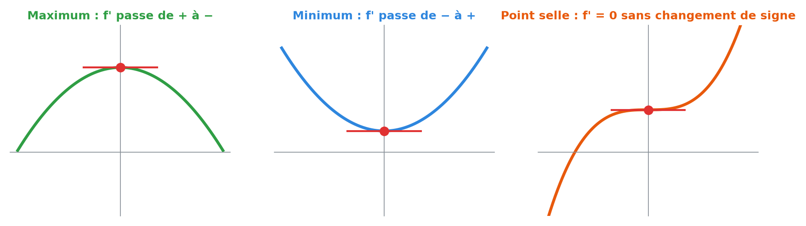
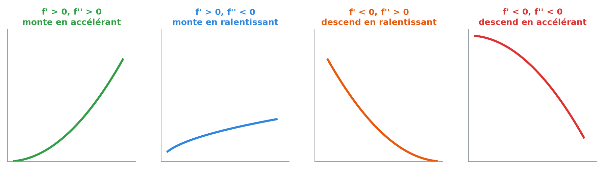
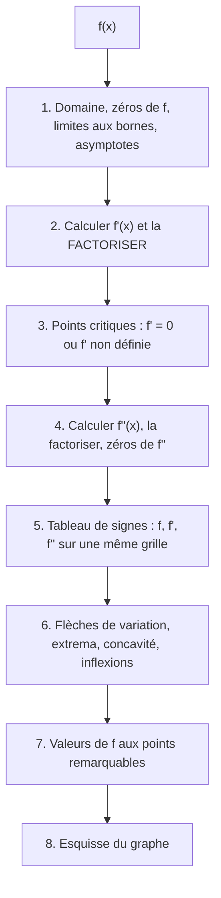
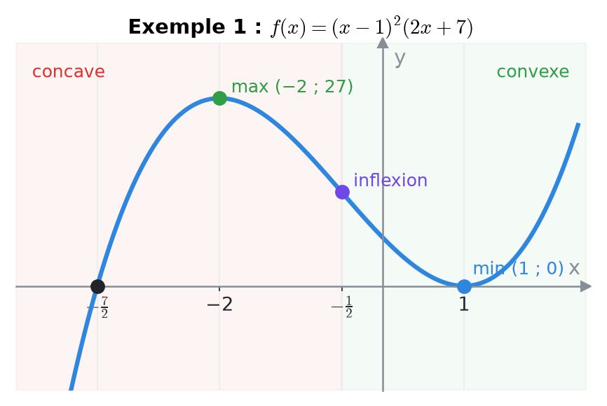
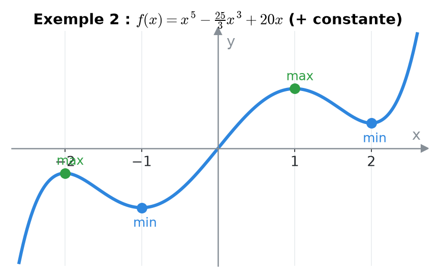
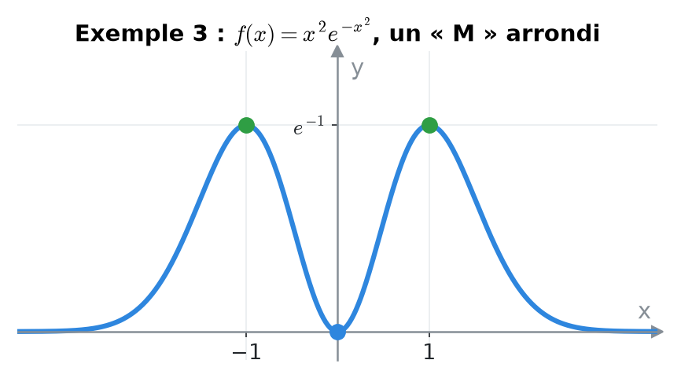
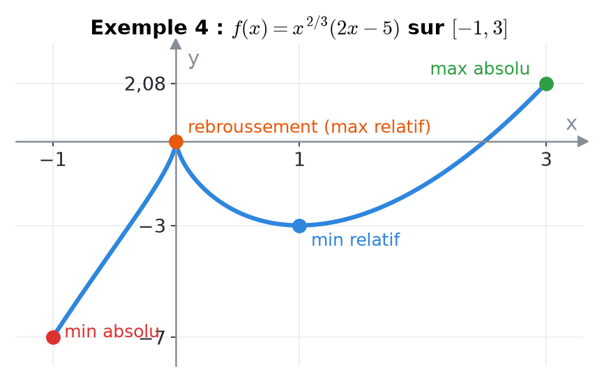
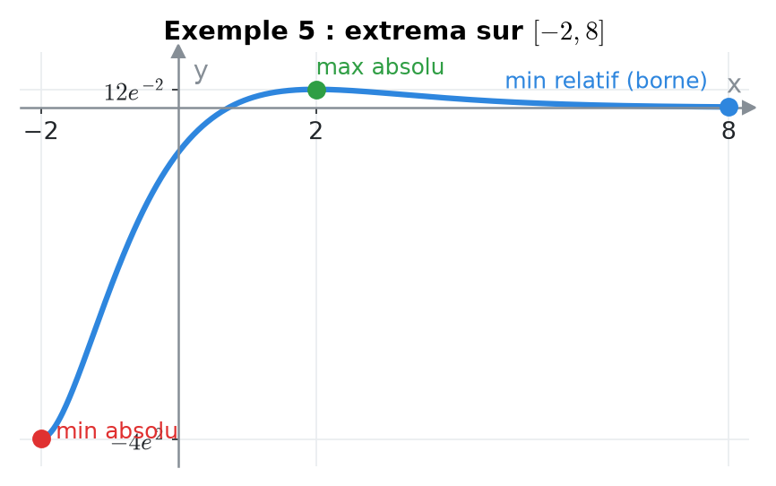
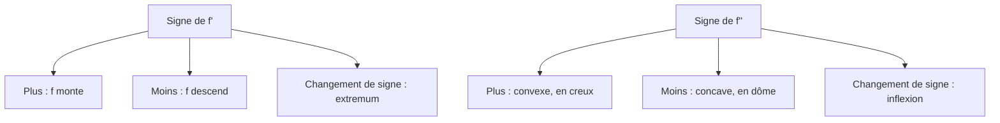
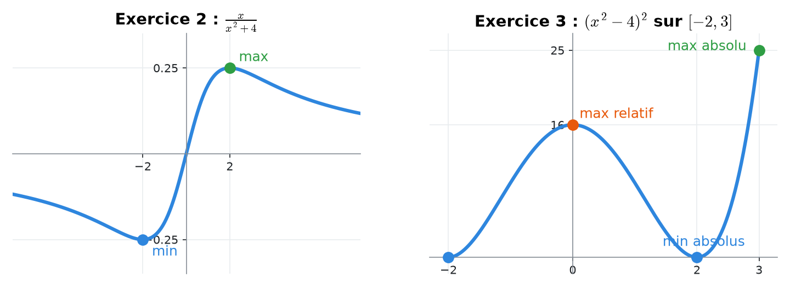

# 10. Étude de fonction : variations, extrema et concavité


**Objectif** : utiliser f' et f'' pour trouver les intervalles de croissance, les extrema (relatifs et absolus), la concavité et les points d'inflexion, construire le <mark style="color:blue;">tableau de signes complet</mark> et esquisser le graphe. C'est « Étude de fonction » (TE 3, 2019), « Croissance/décroissance et extrema » (TE 4, 2025), « Représentation graphique » et les exercices 6-7 du Travail écrit 3 (2023).


---

## 1. Introduction & définitions

### 1.1 Monotonie et signe de la dérivée

Sur un intervalle :

* <mark style="color:green;">f'(x) > 0</mark> ⟹ f <mark style="color:green;">croissante</mark> ;
* <mark style="color:red;">f'(x) < 0</mark> ⟹ f <mark style="color:red;">décroissante</mark> ;
* f'(x) = 0 partout ⟹ f constante.

### 1.2 Points critiques et extrema

Un <mark style="color:blue;">point critique</mark> (ou valeur critique) est un c ∈ D\_f où <mark style="color:blue;">f'(c) = 0 ou f'(c) n'existe pas</mark>.

* <mark style="color:green;">Maximum relatif</mark> (local) en c : f(c) ≥ f(x) pour les x proches de c.
* <mark style="color:blue;">Minimum relatif</mark> : f(c) ≤ f(x) au voisinage.
* <mark style="color:purple;">Extremum absolu</mark> (global) sur un intervalle I : la plus grande (plus petite) valeur de f sur <mark style="color:purple;">tout</mark> I.


**Théorème** : un extremum relatif à l'intérieur du domaine ne peut se trouver qu'en un <mark style="color:green;">point critique</mark>. Mais un point critique n'est <mark style="color:red;">pas forcément</mark> un extremum : f(x) = x³ a f'(0) = 0 sans extremum (c'est un <mark style="color:orange;">point selle</mark>, ou « replat »).


<figure><figcaption></figcaption></figure>

### 1.3 Test de la dérivée première

En un point critique c :

| Signe de f' à gauche puis à droite | Conclusion |
| --- | --- |
| <mark style="color:green;">+</mark> puis <mark style="color:red;">−</mark> | <mark style="color:green;">maximum</mark> relatif |
| <mark style="color:red;">−</mark> puis <mark style="color:green;">+</mark> | <mark style="color:blue;">minimum</mark> relatif |
| même signe des deux côtés | pas d'extremum (point selle si f'(c) = 0) |

### 1.4 Concavité et dérivée seconde

* <mark style="color:green;">f''(x) > 0</mark> : f est <mark style="color:green;">convexe</mark> (courbe « en creux », ∪) ; les tangentes sont sous la courbe.
* <mark style="color:red;">f''(x) < 0</mark> : f est <mark style="color:red;">concave</mark> (courbe « en dôme », ∩).
* Un <mark style="color:purple;">point d'inflexion</mark> est un point où la concavité <mark style="color:purple;">change</mark> (souvent là où f'' = 0 <mark style="color:blue;">et</mark> change de signe).

<figure><figcaption>
Le signe de f' donne le sens, celui de f'' donne la courbure.
</figcaption></figure>

<mark style="color:blue;">Test de la dérivée seconde</mark> : si f'(c) = 0 et

* f''(c) < 0 : c'est un <mark style="color:green;">maximum</mark> ;
* f''(c) > 0 : un <mark style="color:blue;">minimum</mark> ;
* f''(c) = 0 : on <mark style="color:red;">ne peut pas conclure</mark> (revenir au test de la dérivée première).

### 1.5 Extrema absolus sur un intervalle fermé \[a, b]

Une fonction <mark style="color:blue;">continue</mark> sur \[a, b] atteint toujours un maximum et un minimum absolus. Ils se trouvent <mark style="color:green;">soit en un point critique, soit à une borne</mark>.

### 1.6 Points particuliers du graphe

* <mark style="color:blue;">Point anguleux</mark> : f continue mais pentes différentes à gauche et à droite (f' n'existe pas).
* <mark style="color:blue;">Point de rebroussement</mark> : tangente verticale, pentes ±∞ (ex. x^(2/3) en 0).
* <mark style="color:blue;">Asymptotes</mark> : voir chapitre 5.

---

## 2. Méthodes de résolution

### Méthode complète d'étude de fonction

### Méthode — Extrema absolus sur \[a, b]

1. Trouver les points critiques <mark style="color:blue;">dans</mark> ]a, b\[.
2. Calculer f en ces points <mark style="color:blue;">et</mark> en a et b.
3. La plus grande valeur est le <mark style="color:green;">maximum absolu</mark>, la plus petite le <mark style="color:blue;">minimum absolu</mark>.
4. Nature des autres points (extrema relatifs) par le tableau de variation.

### Méthode inverse — Tableau de signes à partir de conditions

Quand l'énoncé donne les signes de f' et f'' sur des intervalles, on les reporte dans un tableau puis on traduit chaque combinaison :

| f' | f'' | Allure |
| --- | --- | --- |
| <mark style="color:green;">+</mark> | <mark style="color:green;">+</mark> | monte de plus en plus vite (↗, convexe) |
| <mark style="color:green;">+</mark> | <mark style="color:red;">−</mark> | monte de moins en moins vite (↗, concave) |
| <mark style="color:red;">−</mark> | <mark style="color:green;">+</mark> | descend en ralentissant (↘, convexe) |
| <mark style="color:red;">−</mark> | <mark style="color:red;">−</mark> | descend en accélérant (↘, concave) |

---

## 3. Exemples de calculs détaillés

### Exemple 1 — Étude complète d'un polynôme (TE 3, 2019)

$$\Large f(x) = (x^2 - 2x + 1)(2x + 7)$$

<mark style="color:orange;">a) Zéros.</mark> x² − 2x + 1 = (x − 1)², donc :

$$\large f(x) = (x - 1)^2(2x + 7) \qquad \text{zéros : } x = 1 \text{ (double) et } x = -\frac{7}{2}$$

<mark style="color:orange;">b) Dérivée</mark> (produit) :

$$\large f'(x) = 2(x - 1)(2x + 7) + 2(x - 1)^2 = 2(x - 1)\left[(2x + 7) + (x - 1)\right] = \color{#2F9E44}6(x - 1)(x + 2)$$

Zéros de f' : x = 1 et x = −2.

<mark style="color:orange;">c) Dérivée seconde</mark> : f'(x) = 6(x² + x − 2), donc

$$\large f''(x) = 6(2x + 1) \qquad \text{nulle en } x = -\frac{1}{2}$$

<mark style="color:orange;">d) Tableau de signes.</mark>

| x | < −7/2 | −7/2 | ]−7/2, −2\[ | −2 | ]−2, −1/2\[ | −1/2 | ]−1/2, 1\[ | 1 | > 1 |
| --- | --- | --- | --- | --- | --- | --- | --- | --- | --- |
| f | <mark style="color:red;">−</mark> | 0 | <mark style="color:green;">+</mark> | <mark style="color:green;">+</mark> | <mark style="color:green;">+</mark> | <mark style="color:green;">+</mark> | <mark style="color:green;">+</mark> | 0 | <mark style="color:green;">+</mark> |
| f' | <mark style="color:green;">+</mark> | <mark style="color:green;">+</mark> | <mark style="color:green;">+</mark> | 0 | <mark style="color:red;">−</mark> | <mark style="color:red;">−</mark> | <mark style="color:red;">−</mark> | 0 | <mark style="color:green;">+</mark> |
| f'' | <mark style="color:red;">−</mark> | <mark style="color:red;">−</mark> | <mark style="color:red;">−</mark> | <mark style="color:red;">−</mark> | <mark style="color:red;">−</mark> | 0 | <mark style="color:green;">+</mark> | <mark style="color:green;">+</mark> | <mark style="color:green;">+</mark> |
| allure | ↗ concave | | ↗ concave | <mark style="color:green;">max</mark> | ↘ concave | <mark style="color:purple;">inflexion</mark> | ↘ convexe | <mark style="color:blue;">min</mark> | ↗ convexe |

<mark style="color:orange;">Valeurs</mark> :

$$\large f(-2) = 27 \ \text{(max relatif)} \qquad f(1) = 0 \ \text{(min relatif)} \qquad f\left(-\tfrac{1}{2}\right) = \tfrac{27}{2} \ \text{(inflexion)}$$

<figure><figcaption></figcaption></figure>

### Exemple 2 — Croissance et extrema (TE 4, 2025)

$$\Large f(x) = x^5 - \frac{25}{3}x^3 + 20x + e^{2\pi}$$

e^(2π) est une <mark style="color:red;">constante</mark> : sa dérivée est nulle.

$$\large f'(x) = 5x^4 - 25x^2 + 20 = 5(x^4 - 5x^2 + 4) = 5(x^2 - 1)(x^2 - 4)$$

Zéros : ±1 et ±2. Signes :

| x | x < −2 | −2 < x < −1 | −1 < x < 1 | 1 < x < 2 | x > 2 |
| --- | --- | --- | --- | --- | --- |
| x² − 1 | <mark style="color:green;">+</mark> | <mark style="color:green;">+</mark> | <mark style="color:red;">−</mark> | <mark style="color:green;">+</mark> | <mark style="color:green;">+</mark> |
| x² − 4 | <mark style="color:green;">+</mark> | <mark style="color:red;">−</mark> | <mark style="color:red;">−</mark> | <mark style="color:red;">−</mark> | <mark style="color:green;">+</mark> |
| f' | <mark style="color:green;">+</mark> | <mark style="color:red;">−</mark> | <mark style="color:green;">+</mark> | <mark style="color:red;">−</mark> | <mark style="color:green;">+</mark> |

* <mark style="color:green;">Croissante</mark> sur ]−∞, −2], \[−1, 1] et \[2, +∞\[ ; <mark style="color:red;">décroissante</mark> sur \[−2, −1] et \[1, 2].
* <mark style="color:green;">Maxima</mark> relatifs en x = −2 et x = 1 ; <mark style="color:blue;">minima</mark> relatifs en x = −1 et x = 2.

<figure><figcaption></figcaption></figure>

### Exemple 3 — Avec une exponentielle (Travail écrit 3, 2023)

$$\Large f(x) = x^2e^{-x^2}$$

<mark style="color:orange;">a) Valeurs critiques</mark> (produit + chaîne) :

$$\large f'(x) = 2xe^{-x^2} - 2x^3e^{-x^2} = 2xe^{-x^2}\left(1 - x^2\right) = 2x(1 - x)(1 + x)e^{-x^2}$$

e^(−x²) > 0 ne s'annule jamais : points critiques x = 0, x = 1, x = −1.

<mark style="color:orange;">b) Variations</mark> : signe de 2x(1 − x²) :

| x | x < −1 | −1 < x < 0 | 0 < x < 1 | x > 1 |
| --- | --- | --- | --- | --- |
| f' | <mark style="color:green;">+</mark> | <mark style="color:red;">−</mark> | <mark style="color:green;">+</mark> | <mark style="color:red;">−</mark> |

<mark style="color:green;">Maxima</mark> relatifs en x = ±1 : f(±1) = e⁻¹ ≈ 0,37 ; <mark style="color:blue;">minimum</mark> relatif en x = 0 : f(0) = 0.

<mark style="color:orange;">c) Esquisse</mark> : un seul zéro (x = 0), f ≥ 0, f → 0 en ±∞ : une courbe <mark style="color:blue;">paire</mark> en forme de « M » arrondi.

<figure><figcaption></figcaption></figure>

### Exemple 4 — Point critique où f' n'existe pas (Travail écrit 3, 2023)

*D\_f = ℝ. a) Montrer que f'(x) = 10(x − 1)/(3∛x). b) Sachant f(3) ≈ 2,08, trouver les extrema de f sur \[−1, 3].*

$$\Large f(x) = x^{2/3}(2x - 5)$$

<mark style="color:orange;">a)</mark> Produit, puis même dénominateur (2x^(2/3) = 6x / (3x^(1/3))) :

$$\large f'(x) = \frac{2}{3}x^{-1/3}(2x - 5) + 2x^{2/3} = \frac{2(2x - 5)}{3x^{1/3}} + \frac{6x}{3x^{1/3}} = \color{#2F9E44}\frac{10(x - 1)}{3\sqrt[3]{x}}$$

<mark style="color:orange;">b)</mark> Points critiques : x = 1 (f' = 0) et x = 0 (f' <mark style="color:red;">non définie</mark> : dénominateur nul). Signes :

| x | −1 < x < 0 | 0 < x < 1 | 1 < x < 3 |
| --- | --- | --- | --- |
| 10(x − 1) | <mark style="color:red;">−</mark> | <mark style="color:red;">−</mark> | <mark style="color:green;">+</mark> |
| ∛x | <mark style="color:red;">−</mark> | <mark style="color:green;">+</mark> | <mark style="color:green;">+</mark> |
| f' | <mark style="color:green;">+</mark> | <mark style="color:red;">−</mark> | <mark style="color:green;">+</mark> |

Valeurs : f(−1) = −7 ; f(0) = 0 ; f(1) = −3 ; f(3) ≈ 2,08.

* <mark style="color:orange;">Maximum relatif</mark> en x = 0 (f = 0) : c'est un <mark style="color:orange;">point de rebroussement</mark> (tangente verticale).
* <mark style="color:blue;">Minimum relatif</mark> en x = 1 (f = −3).
* <mark style="color:red;">Minimum absolu</mark> sur \[−1, 3] : −7 en x = −1 ; <mark style="color:green;">maximum absolu</mark> : ≈ 2,08 en x = 3.

<figure><figcaption></figcaption></figure>

### Exemple 5 — Extrema sur un intervalle (Test 2, 2024)

*Sur \[−2, 8] :*

$$\Large f(x) = 2x^2e^{-x} + 4xe^{-x} - 4e^{-x} = e^{-x}(2x^2 + 4x - 4)$$

$$\large f'(x) = -e^{-x}(2x^2 + 4x - 4) + e^{-x}(4x + 4) = e^{-x}(8 - 2x^2) = 2e^{-x}(2 - x)(2 + x)$$

Points critiques : x = ±2 (−2 est aussi une borne). f' ≥ 0 sur \[−2, 2], f' < 0 sur ]2, 8].

$$\large f(-2) = -4e^2 \approx -29{,}6 \qquad f(2) = 12e^{-2} \approx 1{,}62 \qquad f(8) = 156e^{-8} \approx 0{,}05$$

* <mark style="color:red;">Minimum absolu</mark> : −4e² en x = −2.
* <mark style="color:green;">Maximum absolu</mark> : 12e⁻² en x = 2.
* En x = 8 : <mark style="color:blue;">minimum relatif</mark> (la fonction décroît jusqu'à la borne), mais pas absolu.

<figure><figcaption></figcaption></figure>

---

## 4. Visualisation : ce que disent f' et f''

---

## 5. Exercices pratiques

### Exercice 1 — Tableau à partir de conditions (TE 4, 2025)

f est continue, avec :

* f'(2) = f'(5) = 0, f'(7) n'existe pas ;
* f' > 0 si x < 2 ou 2 < x < 5 ; f' < 0 si x > 5 ;
* f'' > 0 si 2 < x < 4 ou x > 7 ; f'' < 0 si x < 2 ou 4 < x < 7.

a) Dresser le tableau et décrire les points x = 2, 4, 5, 7. b) Que se passe-t-il en x = 7 ?

Cliquez pour voir l'indice

En x = 2, f' s'annule sans changer de signe. En x = 7, f est continue mais pas dérivable, et f' garde le même signe.

Solution détaillée

| x | < 2 | 2 | ]2, 4\[ | 4 | ]4, 5\[ | 5 | ]5, 7\[ | 7 | > 7 |
| --- | --- | --- | --- | --- | --- | --- | --- | --- | --- |
| f' | <mark style="color:green;">+</mark> | 0 | <mark style="color:green;">+</mark> | <mark style="color:green;">+</mark> | <mark style="color:green;">+</mark> | 0 | <mark style="color:red;">−</mark> | non déf. | <mark style="color:red;">−</mark> |
| f'' | <mark style="color:red;">−</mark> | | <mark style="color:green;">+</mark> | 0 | <mark style="color:red;">−</mark> | <mark style="color:red;">−</mark> | <mark style="color:red;">−</mark> | | <mark style="color:green;">+</mark> |
| allure | ↗ concave | <mark style="color:orange;">selle</mark> | ↗ convexe | <mark style="color:purple;">inflexion</mark> | ↗ concave | <mark style="color:green;">max</mark> | ↘ concave | <mark style="color:blue;">anguleux</mark> | ↘ convexe |

<mark style="color:orange;">a)</mark>

* x = 2 : <mark style="color:orange;">point selle</mark> (tangente horizontale, pas d'extremum, et changement de concavité) ;
* x = 4 : <mark style="color:purple;">point d'inflexion</mark> ;
* x = 5 : <mark style="color:green;">maximum relatif</mark>.

<mark style="color:orange;">b)</mark> En x = 7, f est continue mais f' n'existe pas : c'est un <mark style="color:blue;">point anguleux</mark> (pas une asymptote, ni un trou, puisque f est continue).

### Exercice 2 — Points critiques et nature (Examen, janvier 2023)

Soit :

$$\Large f(x) = \frac{x}{x^2 + 4}$$

a) Trouver les points critiques. b) Utiliser le test de la dérivée seconde pour déterminer leur nature.

Cliquez pour voir l'indice

f'(x) = (4 − x²)/(x² + 4)². Pour f'', simplifiez par un facteur (x² + 4) avant de développer.

Solution détaillée

<mark style="color:orange;">a)</mark>

$$\large f'(x) = \frac{(x^2 + 4) - x\cdot 2x}{(x^2 + 4)^2} = \frac{4 - x^2}{(x^2 + 4)^2} \qquad \text{nulle en } x = \pm 2$$

<mark style="color:orange;">b)</mark> Dérivée seconde :

$$\large f''(x) = \frac{-2x(x^2 + 4) - 4x(4 - x^2)}{(x^2 + 4)^3} = \frac{2x(x^2 - 12)}{(x^2 + 4)^3}$$

* f''(2) = 4 · (−8)/8³ < 0 : <mark style="color:green;">maximum</mark> relatif, f(2) = 1/4.
* f''(−2) = −4 · (−8)/8³ > 0 : <mark style="color:blue;">minimum</mark> relatif, f(−2) = −1/4.

### Exercice 3 — Extrema absolus (Examen, janvier 2023)

Déterminer les valeurs extrêmes absolues sur \[−2, 3] de :

$$\Large f(x) = (x^2 - 4)^2$$

Cliquez pour voir l'indice

f'(x) = 4x(x² − 4). Comparez les valeurs de f aux points critiques de ]−2, 3\[ et aux deux bornes.

Solution détaillée

<mark style="color:orange;">1.</mark> f'(x) = 4x(x − 2)(x + 2) : points critiques 0, 2 (et −2, qui est une borne).

<mark style="color:orange;">2.</mark> Valeurs : f(−2) = 0, f(0) = 16, f(2) = 0, f(3) = 25.

<mark style="color:orange;">3.</mark> <mark style="color:green;">Maximum absolu</mark> : 25 en x = 3. <mark style="color:blue;">Minimum absolu</mark> : 0 en x = −2 et x = 2. (En x = 0 : maximum <mark style="color:orange;">relatif</mark> 16.)

<figure><figcaption>
À gauche : exercice 2 ; à droite : exercice 3.
</figcaption></figure>

