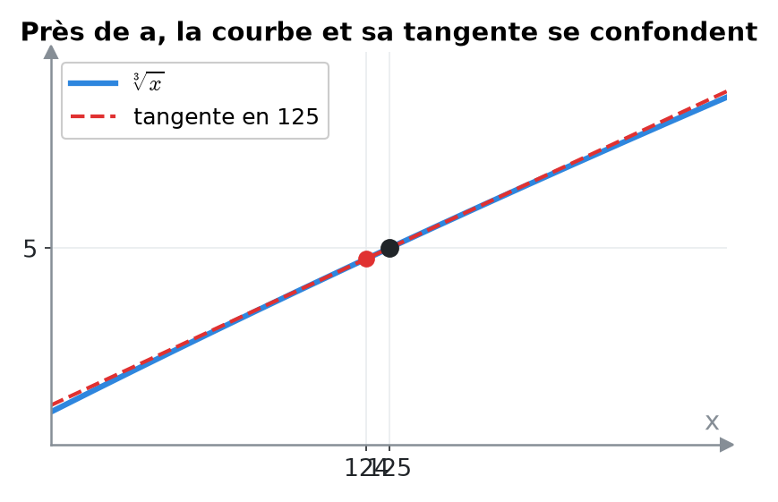
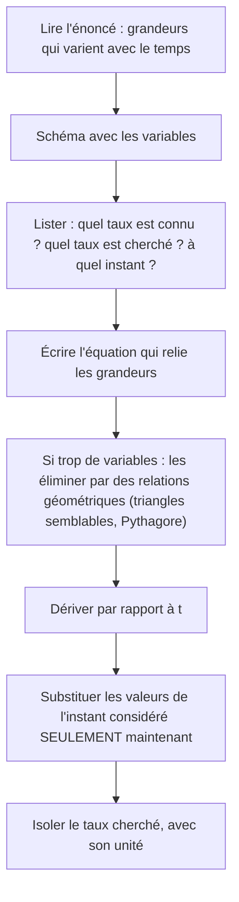
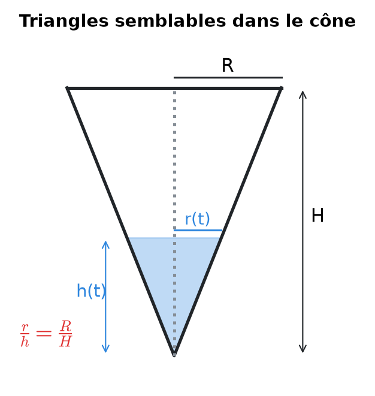
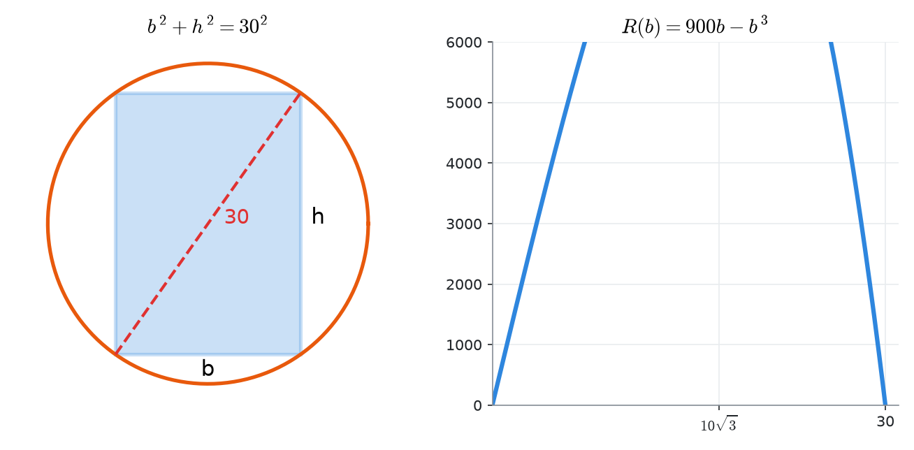
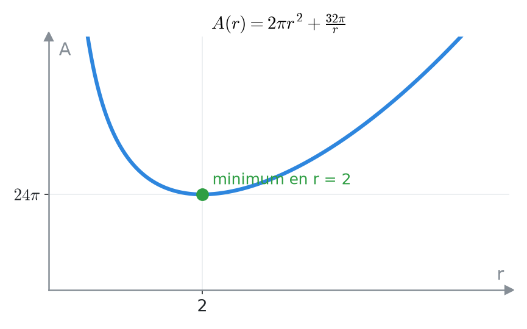
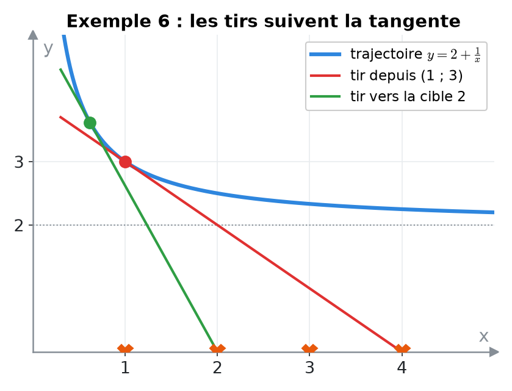
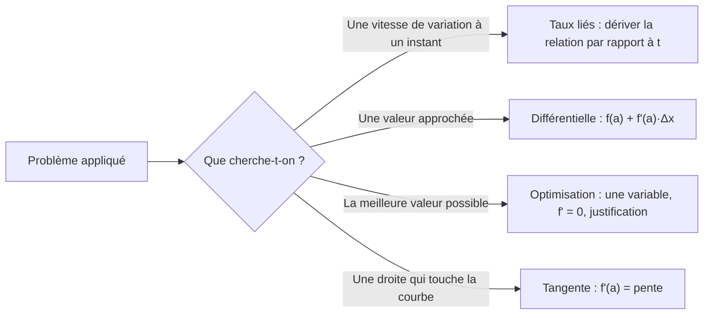
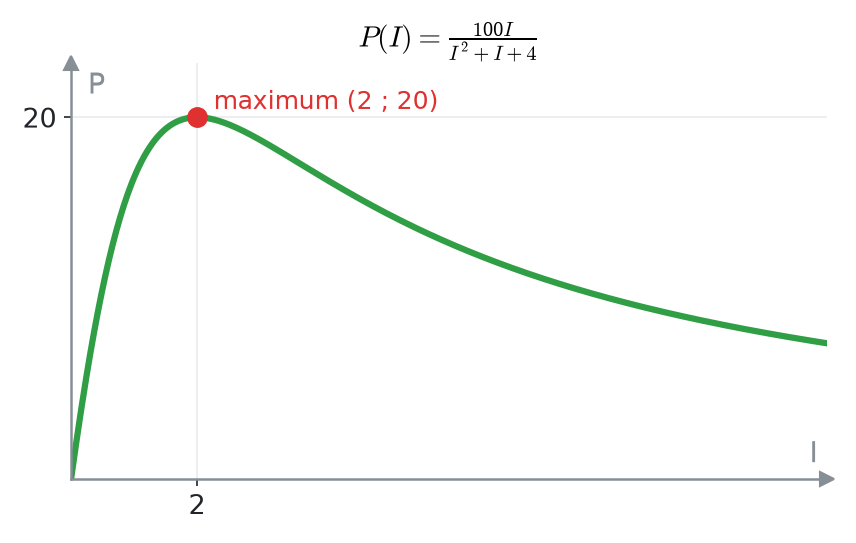
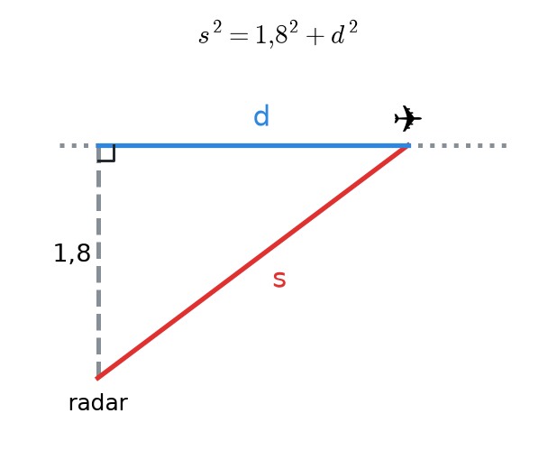

# 11. Applications des dérivées : taux liés, approximations et optimisation


**Objectif** : résoudre les trois grands types de problèmes appliqués : <mark style="color:blue;">taux de variation liés</mark> (ballon, cône, radar), <mark style="color:green;">approximation linéaire</mark> par la différentielle, et <mark style="color:purple;">optimisation</mark> (poutre, boîte de conserve, photosynthèse), ainsi que les problèmes de <mark style="color:red;">tangentes</mark> (avions et cibles, tangentes horizontales). C'est le TE 4 « Dérivées – applications » (2025), le Test 2 « Applications des dérivées » (2024) et l'examen de janvier 2023.


---

## 1. Introduction & définitions

### 1.1 Taux de variation liés

Quand plusieurs grandeurs dépendent du <mark style="color:blue;">temps</mark> et sont reliées par une équation (géométrique ou physique), leurs <mark style="color:blue;">vitesses de variation</mark> sont reliées aussi. On dérive l'équation par rapport à t (dérivation implicite, chapitre 9) :

$$\Large V = \frac{4}{3}\pi r^3 \implies \frac{dV}{dt} = 4\pi r^2\frac{dr}{dt}$$

### 1.2 Approximation linéaire (différentielle)

Près d'un point a, le graphe <mark style="color:green;">se confond avec sa tangente</mark>. Pour un petit écart Δx :

$$\Large \boxed{f(a + \Delta x) \approx f(a) + f'(a)\,\Delta x}$$

<figure><figcaption></figcaption></figure>

La quantité df = f'(a) dx s'appelle la <mark style="color:green;">différentielle</mark>. On choisit a <mark style="color:blue;">proche</mark> du point voulu et <mark style="color:blue;">où f(a) se calcule facilement</mark>.

### 1.3 Optimisation

Trouver la valeur d'une variable qui rend une grandeur <mark style="color:purple;">maximale</mark> ou <mark style="color:purple;">minimale</mark> : c'est chercher un extremum absolu (chapitre 10), mais d'une fonction qu'il faut d'abord <mark style="color:blue;">construire</mark> à partir de l'énoncé.

---

## 2. Méthodes de résolution

### Méthode A — Taux liés


Ne substituer les valeurs numériques <mark style="color:red;">qu'après</mark> avoir dérivé : une grandeur qui varie ne doit pas être remplacée par une constante avant la dérivation.


### Méthode B — Approximation linéaire

1. Identifier la fonction f (par ex. eˣ, sin x, ∛x).
2. Choisir a « facile » proche de la valeur voulue et poser Δx = valeur − a.
3. Pour un angle : <mark style="color:red;">convertir Δx en radians</mark>.
4. Calculer f(a) + f'(a)Δx.

### Méthode C — Optimisation

1. Identifier la grandeur à optimiser et l'écrire en formule (plusieurs variables au départ).
2. Utiliser la <mark style="color:blue;">contrainte</mark> pour n'avoir qu'<mark style="color:blue;">une seule variable</mark>.
3. Déterminer le <mark style="color:blue;">domaine</mark> réaliste de cette variable (longueurs positives…).
4. Dériver, chercher les points critiques.
5. <mark style="color:green;">Justifier</mark> qu'il s'agit bien d'un maximum ou d'un minimum (tableau de signes ou f'').
6. Répondre à la question <mark style="color:green;">posée</mark> (toutes les dimensions, avec unités).

### Méthode D — Tangente passant par un point extérieur

1. Écrire la tangente en un point <mark style="color:blue;">inconnu</mark> a :

$$\large y = f'(a)(x - a) + f(a)$$

2. Imposer que le point extérieur (x₀ ; y₀) vérifie cette équation.
3. Résoudre l'équation obtenue en a.

---

## 3. Exemples de calculs détaillés

### Exemple 1 — Ballon sphérique (TE 4, 2025)

*On gonfle un ballon sphérique. Quand son rayon vaut 2 m, son volume augmente de 2π m³/min. a) À quel taux varie son rayon ? b) Sa surface ?*

<mark style="color:orange;">a)</mark> V = (4/3)πr³. Dérivée par rapport à t :

$$\large \frac{dV}{dt} = 4\pi r^2\frac{dr}{dt} \implies \frac{dr}{dt} = \frac{dV/dt}{4\pi r^2} = \frac{2\pi}{4\pi\cdot 4} = \color{#2F9E44}\frac{1}{8} \text{ m/min}$$

<mark style="color:orange;">b)</mark> A = 4πr² :

$$\large \frac{dA}{dt} = 8\pi r\frac{dr}{dt} = 8\pi\cdot 2\cdot\frac{1}{8} = \color{#2F9E44}2\pi \text{ m}^2/\text{min}$$

### Exemple 2 — Récipient conique (Test 2, 2024)

*On verse de l'eau dans un cône (pointe en bas) de hauteur H = 100 cm et de rayon R = 20 cm. Lorsque la hauteur d'eau vaut 5 cm, elle monte à 2 cm/s. À quel rythme le volume augmente-t-il ?*

<figure><figcaption></figcaption></figure>

<mark style="color:orange;">Étape 1 — Variables</mark> : h(t) hauteur d'eau, r(t) rayon de la surface.

$$\large V = \frac{1}{3}\pi r^2h$$

<mark style="color:orange;">Étape 2 — Éliminer r</mark> par triangles semblables : r/h = R/H, donc r = (R/H) h et :

$$\large V = \frac{1}{3}\pi\frac{R^2}{H^2}h^3$$

<mark style="color:orange;">Étape 3 — Dériver</mark> :

$$\large \frac{dV}{dt} = \pi\frac{R^2}{H^2}h^2\frac{dh}{dt}$$

<mark style="color:orange;">Étape 4 — Substituer</mark> (h = 5, dh/dt = 2) :

$$\large \frac{dV}{dt} = \pi\cdot\frac{400}{10\,000}\cdot 25\cdot 2 = \color{#2F9E44}2\pi \text{ cm}^3/\text{s} \approx 6{,}28 \text{ cm}^3/\text{s}$$

### Exemple 3 — Approximations linéaires (TE 4, 2025)

<mark style="color:orange;">a)</mark> e^0,03 : f(x) = eˣ, a = 0, Δx = 0,03 :

$$\large e^{0{,}03} \approx e^0 + e^0\cdot 0{,}03 = \color{#2F9E44}1{,}03$$

<mark style="color:orange;">b)</mark> sin(59°) : f(x) = sin x, a = 60° = π/3, Δx = −1° = <mark style="color:red;">−π/180 rad</mark> :

$$\large \sin(59°) \approx \sin\frac{\pi}{3} + \cos\frac{\pi}{3}\cdot\left(-\frac{\pi}{180}\right) = \frac{\sqrt{3}}{2} - \frac{\pi}{360} \approx \color{#2F9E44}0{,}8573$$

<mark style="color:orange;">c)</mark> ∛124 : f(x) = ∛x, a = 125, Δx = −1, f'(x) = 1/(3∛x²) :

$$\large \sqrt[3]{124} \approx 5 + \frac{1}{3\cdot 25}\cdot(-1) = 5 - \frac{1}{75} = \frac{374}{75} \approx \color{#2F9E44}4{,}9867$$

(valeur exacte : 4,98663… : l'approximation est excellente).

### Exemple 4 — La poutre la plus résistante (TE 4, 2025)

*La résistance d'une poutre de section rectangulaire (base b, hauteur h) vaut R = bh². Quelles dimensions donnent la poutre la plus résistante tirée d'une bille de 30 cm de diamètre ?*

<figure><figcaption></figcaption></figure>

<mark style="color:orange;">Contrainte</mark> : la diagonale du rectangle est un diamètre :

$$\large b^2 + h^2 = 30^2 = 900 \quad\Rightarrow\quad h^2 = 900 - b^2$$

<mark style="color:orange;">Une seule variable</mark>, pour b ∈ ]0, 30\[ :

$$\large R(b) = b(900 - b^2) = 900b - b^3$$

<mark style="color:orange;">Dérivée</mark> (on rejette la valeur négative) :

$$\large R'(b) = 900 - 3b^2 = 0 \iff b^2 = 300 \iff b = 10\sqrt{3}$$

<mark style="color:orange;">Nature</mark> : R''(b) = −6b < 0 : c'est un <mark style="color:green;">maximum</mark>.

<mark style="color:orange;">Réponse</mark> :

$$\Large \color{#2F9E44}b = 10\sqrt{3} \approx 17{,}3 \text{ cm} \qquad h = 10\sqrt{6} \approx 24{,}5 \text{ cm}$$

### Exemple 5 — La boîte de conserve (Test 2, 2024)

*Dimensions d'une boîte cylindrique de volume 16π cm³ utilisant le moins de métal possible ?*

* Surface totale (deux disques + paroi) : A = 2πr² + 2πrh.
* <mark style="color:blue;">Contrainte</mark> : πr²h = 16π, donc h = 16/r².
* Une variable, r > 0 :

$$\large A(r) = 2\pi r^2 + \frac{32\pi}{r} \qquad A'(r) = 4\pi r - \frac{32\pi}{r^2} = 0 \iff r^3 = 8 \iff r = 2 \text{ cm}$$

* A'' = 4π + 64π/r³ > 0 : <mark style="color:green;">minimum</mark>.

$$\Large \color{#2F9E44}r = 2 \text{ cm} \qquad h = 4 \text{ cm} \qquad A = 24\pi \text{ cm}^2$$

<figure><figcaption></figcaption></figure>

On remarque h = 2r : la boîte optimale est aussi haute que large.

### Exemple 6 — L'avion et les cibles (Test 1, 2023)

*Un avion suit la trajectoire y = (2x + 1)/x (x > 0) et tire selon la <mark style="color:red;">tangente</mark> vers des cibles sur l'axe Ox en x = 1, 2, 3, 4. a) Touche-t-il la cible 4 s'il tire depuis (1 ; 3) ? b) D'où doit-il tirer pour atteindre la cible 2 ?*

<figure><figcaption></figcaption></figure>

On écrit :

$$\large y = 2 + \frac{1}{x} \qquad y' = -\frac{1}{x^2}$$

<mark style="color:orange;">a)</mark> En x = 1 : pente −1 ; tangente y = −(x − 1) + 3 = −x + 4. En x = 4 : y = 0. <mark style="color:green;">Oui</mark>, la cible 4 est touchée.

<mark style="color:orange;">b)</mark> Tangente au point d'abscisse a, qui doit passer par (2 ; 0) :

$$\large 0 = -\frac{2 - a}{a^2} + 2 + \frac{1}{a} \iff 0 = -(2 - a) + 2a^2 + a \iff a^2 + a - 1 = 0$$

$$\large a = \frac{-1 + \sqrt{5}}{2} \approx 0{,}618 \qquad (\text{la racine négative est exclue car } x > 0)$$

Point de tir :

$$\Large \color{#2F9E44}\left(\frac{\sqrt{5} - 1}{2}\,;\ \frac{5 + \sqrt{5}}{2}\right) \approx (0{,}618\,;\,3{,}618)$$

### Exemple 7 — Tangentes horizontales (TE 3, 2019)

*Pour quelles valeurs de x la fonction suivante a-t-elle une tangente horizontale ?*

$$\Large f(x) = (5 - x^3)^4(4x^2 - 11)^5$$

Tangente horizontale ⟺ <mark style="color:blue;">f'(x) = 0</mark>. Produit et chaîne :

$$\large f'(x) = 4(5 - x^3)^3(-3x^2)(4x^2 - 11)^5 + (5 - x^3)^4\cdot 5(4x^2 - 11)^4\cdot 8x$$

On met en évidence 4x(5 − x³)³(4x² − 11)⁴ :

$$\large f'(x) = 4x(5 - x^3)^3(4x^2 - 11)^4\left(-22x^3 + 33x + 50\right)$$

Zéros faciles :

$$\Large \color{#2F9E44}x = 0 \qquad x = \sqrt[3]{5} \qquad x = \pm\frac{\sqrt{11}}{2}$$

Cela fait <mark style="color:green;">quatre valeurs</mark> (le dernier facteur a encore une racine réelle, difficile à calculer à la main).

---

## 4. Visualisation : les trois familles de problèmes

---

## 5. Exercices pratiques

### Exercice 1 — Mobile sur une courbe (Examen, janvier 2023)

Un mobile parcourt la courbe y = √(1 + x³). Au moment où il passe par le point (2 ; 3), son ordonnée croît à la vitesse de 8 cm/s. À quelle vitesse croît son abscisse à cet instant ?

Cliquez pour voir l'indice

Dérivez y = √(1 + x³) par rapport au temps (règle de chaîne), puis substituez.

Solution détaillée

<mark style="color:orange;">1.</mark> Dérivée par rapport au temps :

$$\large \frac{dy}{dt} = \frac{3x^2}{2\sqrt{1 + x^3}}\frac{dx}{dt}$$

<mark style="color:orange;">2.</mark> En (2 ; 3) : 3 · 4 / (2 · 3) = 2, donc 8 = 2 dx/dt.

$$\Large \color{#2F9E44}\frac{dx}{dt} = 4 \text{ cm/s}$$

### Exercice 2 — Photosynthèse (Examen, janvier 2023)

Le taux de photosynthèse d'un phytoplancton vaut (I > 0 est l'intensité lumineuse) :

$$\Large P(I) = \frac{100I}{I^2 + I + 4}$$

Pour quelle intensité P est-il maximal ?

Cliquez pour voir l'indice

Règle du quotient ; au numérateur de P', les termes en I² et en I se simplifient en partie.

Solution détaillée

<mark style="color:orange;">1.</mark> Quotient :

$$\large P'(I) = \frac{100(I^2 + I + 4) - 100I(2I + 1)}{(I^2 + I + 4)^2} = \frac{100(4 - I^2)}{(I^2 + I + 4)^2}$$

<mark style="color:orange;">2.</mark> P'(I) = 0 ⟺ I = 2 (car I > 0).

<mark style="color:orange;">3.</mark> P' > 0 pour 0 < I < 2 et P' < 0 pour I > 2 : <mark style="color:green;">maximum en I = 2</mark>, avec P(2) = 200/10 = 20.

<figure><figcaption></figcaption></figure>

### Exercice 3 — Radar et différentielle (TE, 2022 et Test 2, 2024)

a) Un avion vole horizontalement à 750 km/h, à une altitude de 1,8 km, et passe exactement à la verticale d'une station radar à t = 0. À quelle vitesse la distance avion-radar augmente-t-elle quand l'avion est à 2,4 km (horizontalement) de la station ?

b) Utiliser la différentielle pour approcher :

$$\Large \ln\left(\frac{1}{0{,}98}\right)$$

Cliquez pour voir l'indice

a) s² = 1,8² + d² avec dd/dt = 750. b) ln(1/x) = −ln x avec a = 1 et Δx = −0,02.

Solution détaillée

<figure><figcaption></figcaption></figure>

<mark style="color:orange;">a)</mark> Dérivée de s² = 1,8² + d² :

$$\large 2s\frac{ds}{dt} = 2d\frac{dd}{dt} \quad\Rightarrow\quad \frac{ds}{dt} = \frac{d}{s}\cdot\frac{dd}{dt}$$

Pour d = 2,4 : s = √(3,24 + 5,76) = 3 km. Donc :

$$\large \frac{ds}{dt} = \frac{2{,}4}{3}\cdot 750 = \color{#2F9E44}600 \text{ km/h}$$

<mark style="color:orange;">b)</mark> f(x) = −ln x, f'(x) = −1/x ; en a = 1 : f(1) = 0, f'(1) = −1. Avec Δx = −0,02 :

$$\large \ln\left(\frac{1}{0{,}98}\right) \approx 0 + (-1)(-0{,}02) = \color{#2F9E44}0{,}02$$

(valeur exacte ≈ 0,0202).

