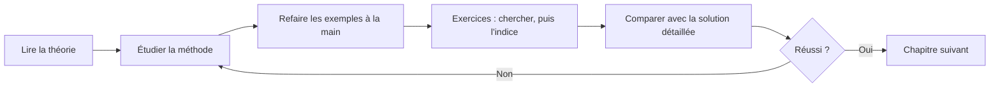

# Mathématiques : cours complet (ISC, HEIA-FR)

Bienvenue ! Ce GitBook est un <mark style="color:blue;">cours théorique complet</mark> construit à partir des évaluations des années précédentes (tests, travaux écrits et examens) d'<mark style="color:blue;">Algèbre linéaire 1</mark> et d'<mark style="color:blue;">Analyse 1</mark>. Chaque type de question rencontré dans ces épreuves y est expliqué, méthodé, illustré et corrigé.

## Les deux parties

| Partie | Contenu | Point d'entrée |
| --- | --- | --- |
| <mark style="color:blue;">Algèbre linéaire 1</mark> | Trigonométrie, oscillations, nombres complexes, vecteurs, produits scalaire/vectoriel/mixte, droites et plans, coordonnées polaires | [Algèbre](algebre/algebre.md) |
| <mark style="color:blue;">Analyse 1</mark> | Inéquations, polynômes, fonctions, exponentielles et logarithmes, limites, continuité, dérivées et leurs applications | [Analyse](analyse/analyse.md) |

## Comment utiliser ce cours

## Légende

### Les encadrés


**Objectif** : ce que le chapitre vous apprend à faire, et où cela tombe en examen.



**À retenir** : la règle essentielle, à connaître par cœur.



**Attention** : une erreur classique vue dans les copies.


### Le code couleur

| Couleur | Signification |
| --- | --- |
| <mark style="color:blue;">Bleu</mark> | notion, définition, mot-clé |
| <mark style="color:green;">Vert</mark> | résultat, règle à retenir, bonne réponse |
| <mark style="color:red;">Rouge</mark> | piège, condition à ne pas oublier, réponse fausse |
| <mark style="color:orange;">Orange</mark> | étape d'une méthode ou d'un calcul |
| <mark style="color:purple;">Violet</mark> | notion secondaire (inflexion, conjugué…) |

Dans les formules, le <mark style="color:green;">résultat final</mark> est écrit en vert, et les formules essentielles sont <mark style="color:blue;">encadrées</mark> :

$$\Large \boxed{\sin^2 x + \cos^2 x = 1}$$

### Les exercices

Les <mark style="color:blue;">indices</mark> et les <mark style="color:green;">solutions détaillées</mark> sont repliés : cherchez d'abord seul, puis ouvrez l'indice, et seulement ensuite la solution !

## Notations

* Unité imaginaire : j (avec j² = −1), comme en électrotechnique.
* Intervalles à la française : ]a, b\[ est ouvert, \[a, b] est fermé.
* Les figures utilisent les mêmes couleurs que le texte qui les accompagne.
