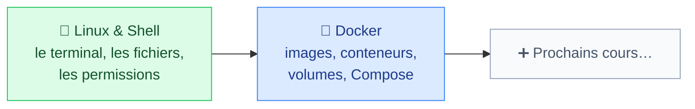

# Méthodologie et Sécurité IT

<mark style="color:blue;">**Les outils que tout informaticien utilise chaque jour, et comment s'en servir en sécurité.**</mark>

&#x20;


**En bref**

On commence par **Linux et la ligne de commande**, puis on apprend à emballer et lancer des applications avec **Docker**. La sécurité est présente partout : permissions, moindre privilège, secrets hors des images…


&#x20;

***

&#x20;

## <mark style="color:purple;">01</mark> · Les chapitres

&#x20;

&#x20;



### 🐧 [Linux & Shell](linux/README.md)

Histoire de Linux, arborescence, commandes de base, redirections et pipes, variables d'environnement, permissions, systèmes de fichiers.

&#x20;

<mark style="color:green;">**10 pages · 33 questions**</mark>



### 🐳 [Docker](docker/README.md)

Conteneurs vs VM, architecture, images et Dockerfile, conteneurs, volumes, maintenance et Docker Compose.

&#x20;

<mark style="color:green;">**10 pages · 24 questions**</mark>



&#x20;


**Dans quel ordre ?** Commence par **Linux** : Docker s'appuie sur la ligne de commande, les permissions et les systèmes de fichiers.

