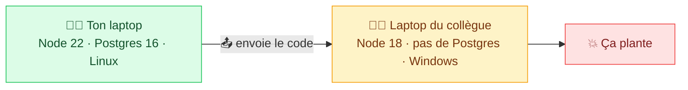
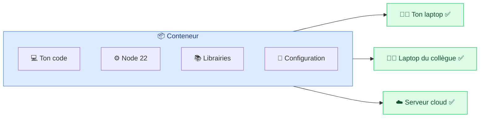
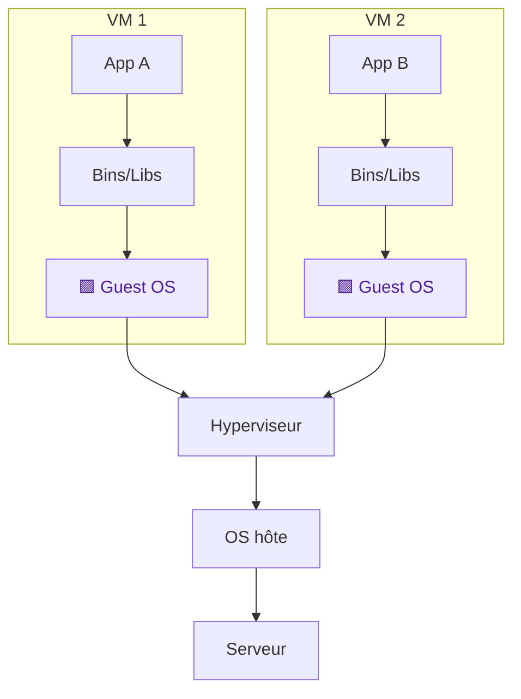
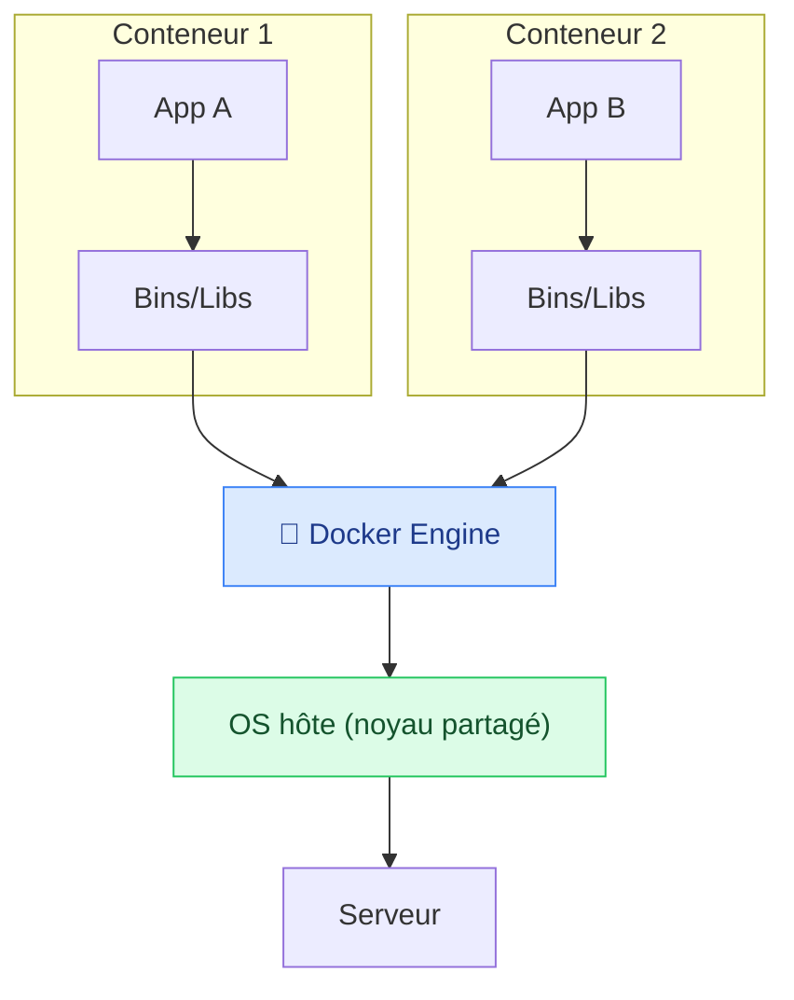
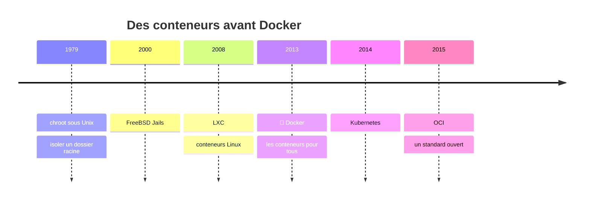

# 1. Introduction à Docker

<mark style="color:blue;">**Pourquoi tout le monde s'est mis aux conteneurs.**</mark>

&#x20;


**En bref**

Docker emballe une application **avec son environnement** dans un conteneur. Le conteneur tourne pareil partout, et il est bien plus léger qu'une machine virtuelle.


&#x20;

***

&#x20;

## <mark style="color:purple;">01</mark> · Le problème de départ

&#x20;

Tu développes une application web sur ton laptop. Elle utilise Node.js 22, PostgreSQL 16 et quelques librairies. Tout fonctionne. Tu l'envoies à un collègue… et chez lui, **rien ne marche**.

&#x20;

&#x20;

Le problème ne vient pas du **code**, mais de l'**environnement** : versions différentes, logiciels manquants, autre système d'exploitation, variable d'environnement oubliée…

&#x20;

C'est le fameux <mark style="color:red;">**« ça marche sur ma machine »**</mark>.

&#x20;

***

&#x20;

## <mark style="color:purple;">02</mark> · La solution : Docker

&#x20;

> **Docker** est une plateforme ouverte pour **développer, livrer et exécuter** des applications. Il permet de **séparer l'application de l'infrastructure** pour livrer du logiciel rapidement.

&#x20;

Au lieu d'envoyer seulement ton code, tu envoies **ton code + tout ce dont il a besoin** (runtime, librairies, configuration), dans une boîte standard : un <mark style="color:blue;">**conteneur**</mark>.

&#x20;

&#x20;

### 🚢 L'analogie du conteneur maritime

&#x20;

Avant les années 1950, charger un bateau était un cauchemar : sacs de café, tonneaux, caisses de toutes tailles… Chaque marchandise demandait une manutention différente.

&#x20;

Puis on a inventé le **conteneur maritime standard**. Peu importe ce qu'il contient, **tous les ports, grues, bateaux et camions du monde savent le manipuler de la même façon**.

&#x20;

| 🌊 Monde maritime       | 🐳 Monde Docker                    |
| ----------------------- | ---------------------------------- |
| La marchandise          | Ton application + ses dépendances  |
| Le conteneur standard   | Le conteneur Docker                |
| Bateau, train, camion   | Ton laptop, un serveur, le cloud   |
| La grue du port         | Le moteur Docker                   |

&#x20;


**À retenir** — un conteneur Docker tourne **de la même manière partout** où Docker est installé. L'environnement voyage avec l'application.


&#x20;

***

&#x20;

## <mark style="color:purple;">03</mark> · Conteneurs vs machines virtuelles

&#x20;

Avant Docker, pour isoler une application, on utilisait des **machines virtuelles** (VM). Les deux isolent, mais pas au même étage.

&#x20;



**🖥️ Machine virtuelle**

Chaque VM embarque **un OS complet** → <mark style="color:orange;">**lourd**</mark>.



**📦 Conteneur**

Les conteneurs **partagent le noyau** de l'hôte → <mark style="color:green;">**léger**</mark>.



&#x20;

### 🏠 L'analogie du logement

&#x20;

* Une **VM**, c'est une **maison individuelle** : chacune a ses fondations, sa plomberie, son électricité. Très isolée, mais coûteuse à construire.
* Un **conteneur**, c'est un **appartement** : chacun a sa porte fermée à clé, mais tous partagent les fondations et les canalisations (le noyau). Bien plus rapide et économique.

&#x20;

| Critère                    | 🖥️ Machine virtuelle                              | 📦 Conteneur                                          |
| -------------------------- | ------------------------------------------------- | ----------------------------------------------------- |
| Contient                   | Un OS complet                                     | Seulement l'app et ses dépendances                    |
| Taille                     | <mark style="color:orange;">Plusieurs Go</mark>   | <mark style="color:green;">Quelques Mo à centaines de Mo</mark> |
| Démarrage                  | <mark style="color:orange;">Minutes</mark>        | <mark style="color:green;">Secondes, voire moins</mark> |
| Isolation                  | Très forte (matériel virtualisé)                  | Forte (processus isolés, noyau partagé)               |
| Combien sur une machine ?  | Quelques-unes                                     | Des dizaines, voire des centaines                     |

&#x20;


**Attention** — comme les conteneurs partagent le noyau de l'hôte, un conteneur Linux a besoin d'un **noyau Linux**. Sur Windows et macOS, Docker Desktop fait tourner discrètement une petite VM Linux pour les héberger.


&#x20;

***

&#x20;

## <mark style="color:purple;">04</mark> · Un peu d'histoire

&#x20;

L'idée d'isoler des processus ne date pas de Docker. Docker l'a simplement rendue **facile**.

&#x20;

&#x20;

***

&#x20;

## <mark style="color:purple;">05</mark> · Conteneur ≠ Docker

&#x20;

Docker est l'outil le plus populaire pour gérer des conteneurs, **mais pas le seul**. Le format des conteneurs est un standard ouvert : l'<mark style="color:blue;">**OCI**</mark> (_Open Container Initiative_).

&#x20;



### 🐳 Docker

Le plus répandu, très simple à prendre en main.



### 🦭 Podman

Sans daemon, fonctionne sans droits root, commandes compatibles Docker.



### ⚙️ containerd

Le moteur bas niveau utilisé par Docker lui-même et par Kubernetes.



&#x20;


Une image construite avec Docker peut tourner avec Podman ou containerd, et inversement : elles suivent toutes le standard **OCI**.


&#x20;

***

&#x20;

## <mark style="color:purple;">06</mark> · En résumé

&#x20;


* Docker **emballe une application avec son environnement** dans un conteneur.
* Un conteneur **tourne pareil partout** : fini le « ça marche sur ma machine ».
* Les conteneurs sont **plus légers que les VM** car ils partagent le noyau de l'hôte.
* Docker n'est qu'**un outil parmi d'autres** : le standard, c'est l'OCI.


&#x20;

<mark style="color:green;">**→ Suite :**</mark> [2. Architecture de Docker](02-architecture.md)
