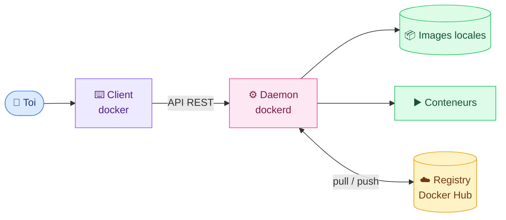
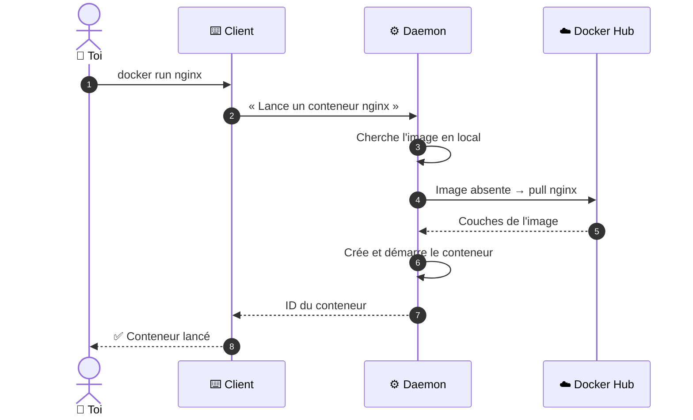
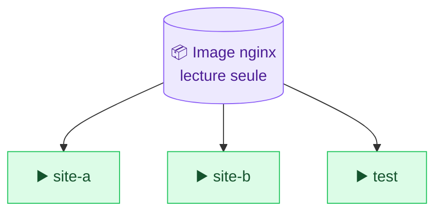

# 2. Architecture de Docker

<mark style="color:blue;">**Qui fait quoi quand tu tapes `docker run`.**</mark>

&#x20;


**En bref**

Tu parles au **client**, le client parle au **daemon**, et le daemon va chercher les images au **registry** si besoin. L'**image** est le modèle, le **conteneur** est la copie qui tourne.


&#x20;

***

&#x20;

## <mark style="color:purple;">01</mark> · Vue d'ensemble

&#x20;

&#x20;

***

&#x20;

## <mark style="color:purple;">02</mark> · Les trois composants

&#x20;



### ⌨️ Le client

La commande `docker` dans ton terminal. Il ne fait rien lui-même : il **transmet tes ordres** au daemon et t'affiche les réponses.



### ⚙️ Le daemon

`dockerd` tourne en arrière-plan sur la machine hôte. C'est **lui qui fait le vrai travail** : images, conteneurs, réseaux, volumes.



### ☁️ Le registry

Une **bibliothèque d'images** en ligne. Par défaut : [Docker Hub](https://hub.docker.com). Les entreprises ont souvent un registry privé.



&#x20;


Tu n'interagis **jamais directement** avec le daemon : le client lui parle via une **API REST**, à travers un socket Unix ou le réseau.


&#x20;

### 🍽️ L'analogie du restaurant

&#x20;

| 🍽️ Restaurant                      | 🐳 Docker                          |
| ---------------------------------- | ---------------------------------- |
| Toi, le client                     | Toi, dans le terminal              |
| Le serveur qui prend la commande   | Le **client** `docker`             |
| La cuisine qui prépare les plats   | Le **daemon** `dockerd`            |
| Le fournisseur de produits         | Le **registry** (Docker Hub)       |
| La recette                         | L'**image**                        |
| Le plat servi                      | Le **conteneur**                   |

&#x20;

Tu ne vas jamais en cuisine : tu passes par le serveur. Et s'il manque un ingrédient, la cuisine le commande au fournisseur.

&#x20;

***

&#x20;

## <mark style="color:purple;">03</mark> · Ce qui se passe vraiment

&#x20;

Voici le trajet complet d'un `docker run nginx` quand l'image n'est pas encore sur ta machine :

&#x20;

&#x20;



1. Le client demande au daemon de récupérer une image.
2. Le daemon **la télécharge depuis le registry**.
3. L'image est stockée localement, prête à l'emploi.



1. Le client envoie au daemon un `Dockerfile` et les fichiers du projet (le _build context_).
2. Le daemon **construit une nouvelle image** en suivant les instructions.
3. L'image est stockée localement.



1. Le client demande de lancer un conteneur à partir d'une image.
2. Si l'image **manque**, le daemon la **télécharge** d'abord.
3. Le daemon **crée et démarre** le conteneur.



&#x20;

***

&#x20;

## <mark style="color:purple;">04</mark> · Image et conteneur

&#x20;

Ce sont les deux objets Docker les plus importants. Il faut **absolument** bien les distinguer.

&#x20;



### 📦 Image

* Un **modèle en lecture seule**
* Contient les instructions pour créer un conteneur
* Souvent **basée sur une autre image**
* _Ex. :_ `ubuntu` + Apache + ton application



### ▶️ Conteneur

* Une **instance qui tourne**, créée à partir d'une image
* On peut la démarrer, l'arrêter, la supprimer
* On peut lui attacher du stockage et des réseaux
* Plusieurs conteneurs peuvent venir de la **même** image



&#x20;

&#x20;

### 🧁 L'analogie du moule à gâteau

&#x20;

> L'**image** est le **moule** : il ne change jamais.
> Le **conteneur** est le **gâteau** : tu peux en faire autant que tu veux avec le même moule, et chacun peut ensuite être décoré différemment.

&#x20;


**Pour les développeurs** — une image est à un conteneur ce qu'une **classe** est à un **objet**.


&#x20;


Les autres objets Docker sont les **volumes** (stockage persistant, voir [chapitre 6](06-volumes.md)) et les **réseaux** (communication entre conteneurs, voir [Docker Compose](08-docker-compose.md)).


&#x20;

***

&#x20;

## <mark style="color:purple;">05</mark> · En résumé

&#x20;


* Le **client** (`docker`) envoie tes commandes au **daemon** (`dockerd`), qui fait le travail.
* Le **registry** (Docker Hub) stocke et distribue les images.
* Une **image** est un modèle figé ; un **conteneur** est une instance vivante de cette image.


&#x20;

<mark style="color:green;">**→ Suite :**</mark> [3. Les images](03-images.md)
