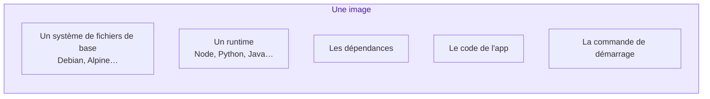
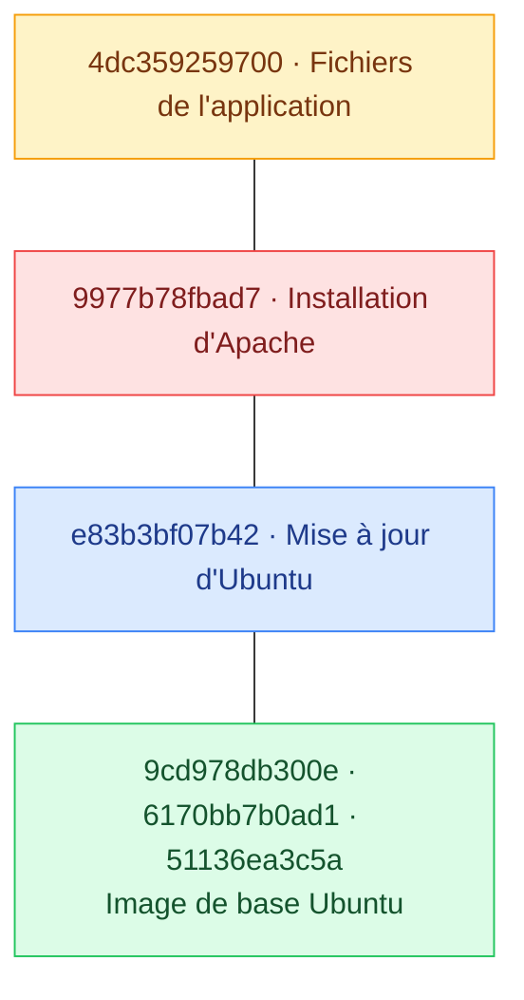
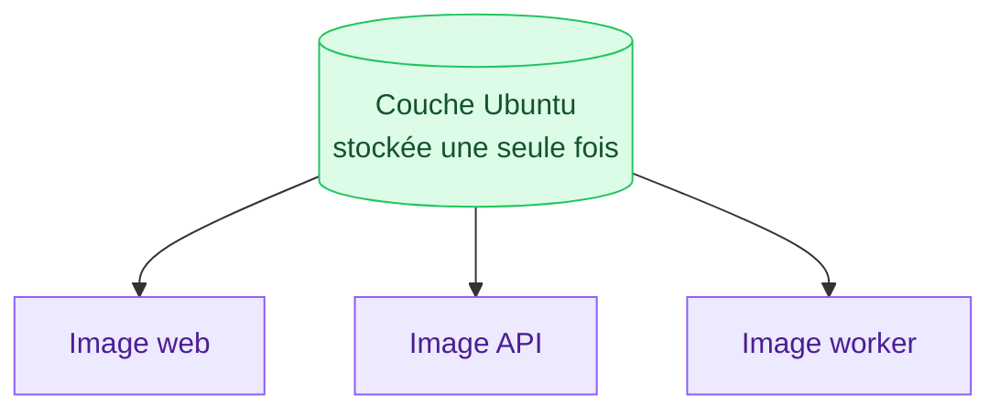
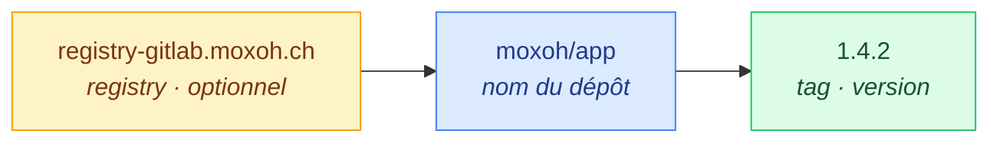
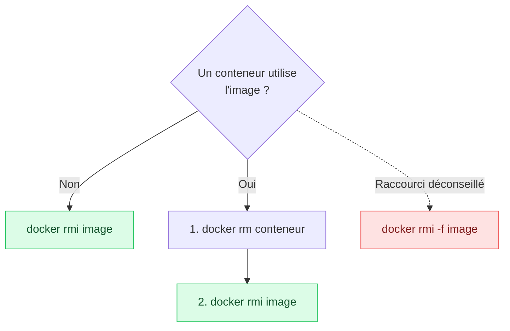
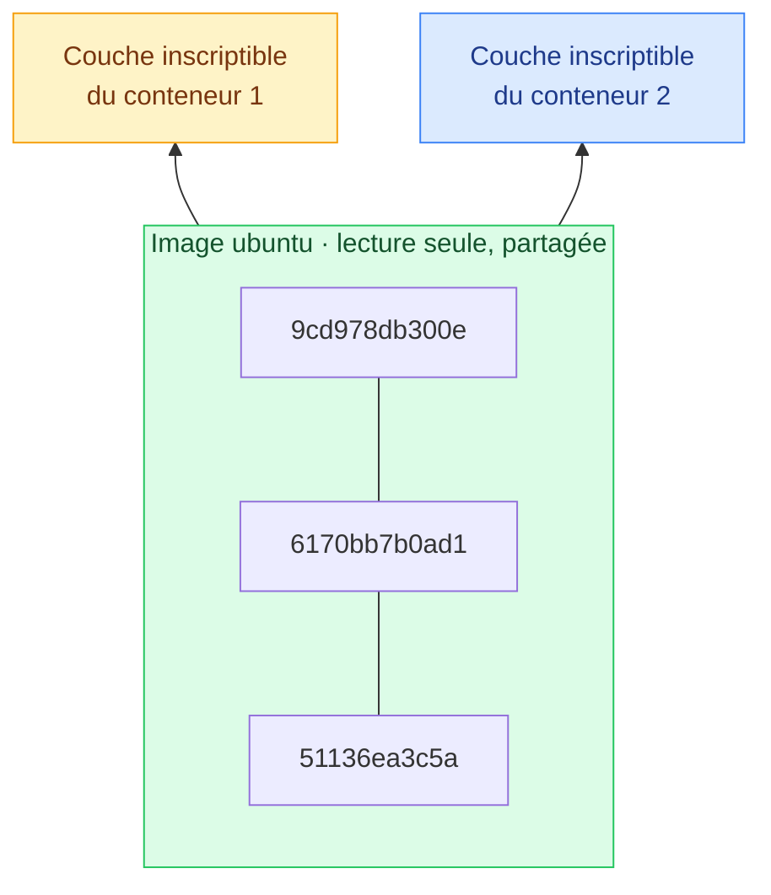

# 3. Les images Docker

<mark style="color:blue;">**Des calques empilés, en lecture seule, partagés entre tous.**</mark>

&#x20;


**En bref**

Une image est un **paquet figé** qui contient tout ce qu'il faut pour lancer une application. Elle est faite de **couches** empilées et **partagées** entre images, ce qui économise énormément de place et de temps.


&#x20;

***

&#x20;

## <mark style="color:purple;">01</mark> · Qu'y a-t-il dans une image ?

&#x20;



&#x20;


**Règle de base** — une image est **en lecture seule**. On ne la modifie jamais : pour changer quelque chose, on en **construit une nouvelle**.


&#x20;

***

&#x20;

## <mark style="color:purple;">02</mark> · Les couches (layers)

&#x20;

Une image n'est pas un gros bloc : c'est un **empilement de couches** en lecture seule. Chaque couche est une modification par rapport à celle d'en dessous.

&#x20;



&#x20;

### L'analogie des calques

&#x20;

Pense aux **calques transparents** d'un logiciel de dessin : chaque calque ajoute quelque chose par-dessus les autres, et l'image finale est la superposition de tous les calques.

&#x20;

### Pourquoi c'est génial ?

&#x20;

Les couches sont **partagées**. Si tu as 10 images basées sur `ubuntu`, la couche Ubuntu n'est stockée et téléchargée **qu'une seule fois**.

&#x20;



&#x20;

C'est pour ça que lors d'un `docker pull`, certaines couches sont marquées `Already exists` :

&#x20;

```
$ docker pull ohmyzsh/zsh:latest
latest: Pulling from ohmyzsh/zsh
d7ff0c89abc4: Already exists      ◄── déjà là, pas retéléchargée
58edd5531a03: Already exists
e6db72ea7b7f: Already exists
c820844652a5: Pull complete       ◄── nouvelle couche
4f4fb700ef54: Pull complete
Digest: sha256:6c64ebe0fcc7144a1a105e2526a5448228...
Status: Downloaded newer image for ohmyzsh/zsh:latest
```

&#x20;

***

&#x20;

## <mark style="color:purple;">03</mark> · Nom et tags

&#x20;

Une image s'identifie par un **nom** et un **tag** (une étiquette de version) :

&#x20;



&#x20;

| Exemple                                  | Signification                                           |
| ---------------------------------------- | ------------------------------------------------------- |
| `nginx`                                  | Image `nginx` sur Docker Hub, tag `latest` implicite     |
| `postgres:16-alpine`                     | PostgreSQL 16, variante Alpine (plus légère)             |
| `traefik:v3.6`                           | Traefik version 3.6                                      |
| `registry.exemple.ch/equipe/app:1.0`     | Image hébergée sur un registry privé                     |

&#x20;


**Le piège du tag `latest`** — `latest` ne veut **pas** dire « la dernière version ». C'est juste le tag par défaut quand on n'en précise aucun. Il peut pointer vers n'importe quoi et changer du jour au lendemain. En production, **fixe toujours une version** (ex. `postgres:16.4`).


&#x20;

Une même image peut avoir **plusieurs tags**. Ici, `traefik:3.6` et `traefik:v3.6` ont le même ID :

&#x20;

```
$ docker image ls traefik
IMAGE           ID             DISK USAGE
traefik:3.6     6a74c416e0c4       172MB
traefik:v3.6    6a74c416e0c4       172MB     ◄── même ID = même image
traefik:v3.7    2eb085ca3ba8       175MB
```

&#x20;

***

&#x20;

## <mark style="color:purple;">04</mark> · Les commandes essentielles

&#x20;



```bash
docker image ls           # ou : docker images
docker image ls postgres  # filtrer par nom
```



```bash
docker pull nginx                  # depuis Docker Hub
docker pull postgres:16-alpine     # avec un tag précis
```

Depuis un registry privé :

```bash
docker login registry-gitlab.moxoh.ch
docker pull registry-gitlab.moxoh.ch/moxoh/hypotheses/app:latest
```



```bash
docker search redis
```

Ou directement sur [hub.docker.com](https://hub.docker.com). Privilégie les images avec le badge <mark style="color:green;">**Docker Official Image**</mark> ou <mark style="color:green;">**Verified Publisher**</mark>.



```bash
docker image rm nginx     # ou : docker rmi nginx
```



&#x20;

### Supprimer une image utilisée

&#x20;

On ne peut supprimer une image que si **aucun conteneur ne l'utilise** :

&#x20;

```
$ docker image rm ohmyzsh/zsh:latest
Error response from daemon: conflict: unable to remove repository reference
"ohmyzsh/zsh:latest" (must force) - container ff680893a575 is using its
referenced image 5443742302f5
```

&#x20;



&#x20;


**`-f` ne fait pas le ménage** — il force la suppression de l'image, mais **le conteneur arrêté n'est pas supprimé** : il reste là, rattaché à une image sans nom. Supprime proprement le conteneur d'abord.


&#x20;

***

&#x20;

## <mark style="color:purple;">05</mark> · La couche inscriptible du conteneur

&#x20;

Quand on lance un conteneur, Docker ajoute **une fine couche en lecture/écriture** par-dessus les couches de l'image. Toutes les modifications faites dans le conteneur vont dans cette couche.

&#x20;



&#x20;

C'est ce qui permet de lancer **plusieurs conteneurs depuis la même image** sans dupliquer les données : seule la petite couche du dessus est propre à chacun.

&#x20;


**Attention** — quand un conteneur est **supprimé**, sa couche inscriptible disparaît avec lui, et **toutes les données écrites dedans sont perdues**. Pour les garder, il faut des [volumes](06-volumes.md).


&#x20;

***

&#x20;

## <mark style="color:purple;">06</mark> · En résumé

&#x20;


* Une image est un **modèle en lecture seule**, fait de **couches empilées**.
* Les couches sont **partagées** entre images → gain de place et de temps.
* Une image s'identifie par `registry/nom:tag`. Évite `latest` en production.
* Un conteneur = une image + **une couche inscriptible** au-dessus.


&#x20;

<mark style="color:green;">**→ Suite :**</mark> [4. Le Dockerfile](04-dockerfile.md)
