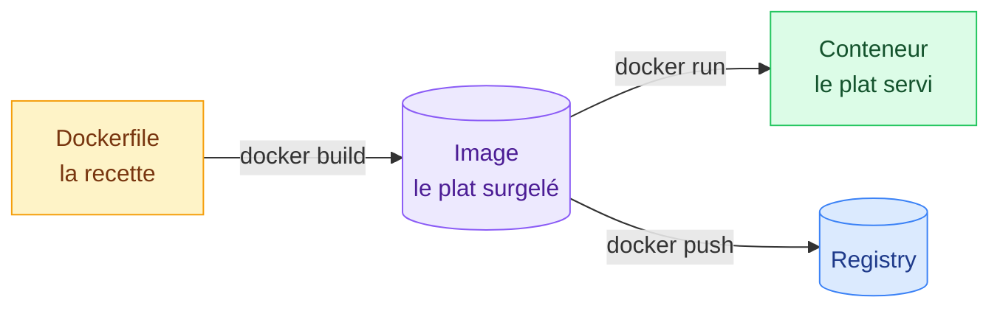
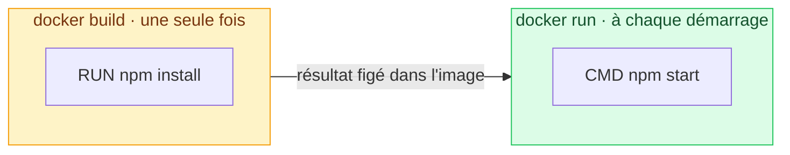
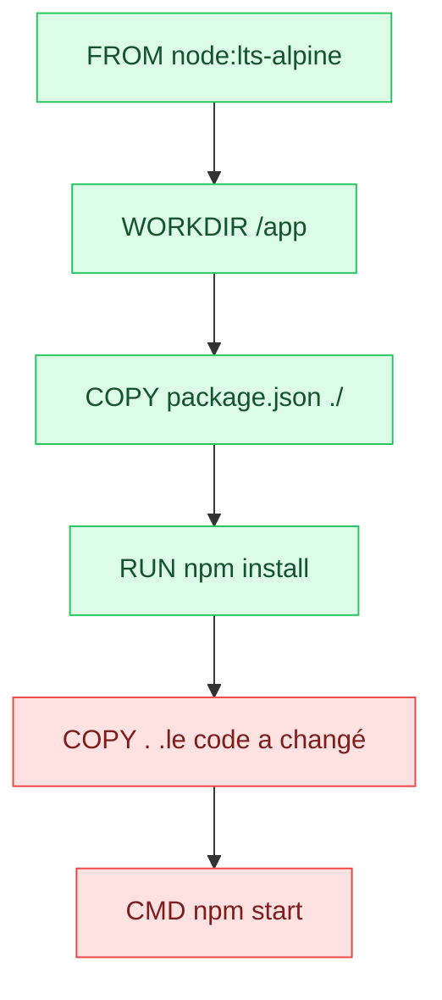
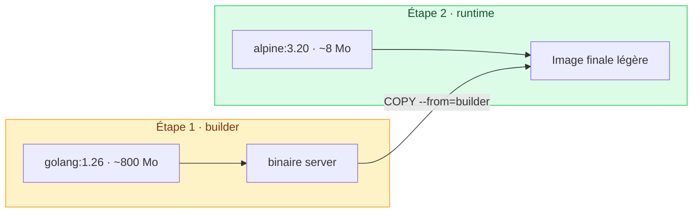

# 4. Le Dockerfile

<mark style="color:blue;">**La recette de cuisine de ton image.**</mark>

&#x20;


**En bref**

Un `Dockerfile` décrit **étape par étape** comment construire une image. `docker build` suit la recette, et Docker **met en cache** chaque étape pour aller plus vite la fois suivante.


&#x20;

***

&#x20;

## <mark style="color:purple;">01</mark> · Du Dockerfile au conteneur

&#x20;



&#x20;

### L'analogie de la recette

&#x20;

| Cuisine                          | Docker            |
| ------------------------------------- | -------------------- |
| La recette écrite                     | Le **Dockerfile**    |
| Cuisiner en suivant la recette        | `docker build`       |
| Le plat surgelé, prêt à réchauffer    | L'**image**          |
| Le plat réchauffé et servi            | Le **conteneur**     |

&#x20;

***

&#x20;

## <mark style="color:purple;">02</mark> · Un premier Dockerfile

&#x20;

Voici un Dockerfile pour une application Node.js, commenté ligne par ligne :

&#x20;

```dockerfile
# 1. Partir d'une image qui contient déjà Node.js
FROM node:lts-alpine

# 2. Se placer dans /app à l'intérieur de l'image
WORKDIR /app

# 3. Copier la liste des dépendances et les installer
COPY package.json package-lock.json ./
RUN npm install

# 4. Copier le reste du code source
COPY . .

# 5. Documenter le port utilisé par l'application
EXPOSE 3000

# 6. Commande lancée au démarrage du conteneur
CMD ["npm", "start"]
```

&#x20;



### Construire l'image

&#x20;

```bash
docker build -t mon-app:1.0 .
```

&#x20;

* `-t mon-app:1.0` → le nom et le tag de l'image
* `.` → le **build context** : le dossier envoyé au daemon



### Vérifier qu'elle existe

&#x20;

```bash
docker image ls mon-app
```



### Lancer un conteneur

&#x20;

```bash
docker run -p 3000:3000 mon-app:1.0
```

&#x20;

<mark style="color:green;">**C'est prêt.**</mark> Ouvre `http://localhost:3000`.



&#x20;

***

&#x20;

## <mark style="color:purple;">03</mark> · Les instructions principales

&#x20;

| Instruction   | Rôle                                                              | Exemple                          |
| ------------- | ----------------------------------------------------------------- | -------------------------------- |
| `FROM`        | Image de base — **toujours la première ligne**                    | `FROM python:3.12-slim`          |
| `WORKDIR`     | Dossier de travail pour les instructions suivantes                | `WORKDIR /app`                   |
| `COPY`        | Copie des fichiers de ta machine vers l'image                     | `COPY src/ ./src/`               |
| `ADD`         | Comme `COPY`, sait aussi extraire des archives                    | `ADD app.tar.gz /opt/`           |
| `RUN`         | Exécute une commande **pendant le build**                         | `RUN apt-get install -y curl`    |
| `ENV`         | Définit une variable d'environnement                              | `ENV NODE_ENV=production`        |
| `ARG`         | Variable disponible uniquement pendant le build                   | `ARG VERSION=1.0`                |
| `EXPOSE`      | **Documente** le port utilisé par l'app                           | `EXPOSE 8080`                    |
| `CMD`         | Commande par défaut **au lancement du conteneur**                 | `CMD ["python", "app.py"]`       |
| `ENTRYPOINT`  | Programme principal du conteneur                                  | `ENTRYPOINT ["nginx"]`           |

&#x20;

### `RUN` ou `CMD` ? La confusion n°1

&#x20;



&#x20;



**`RUN`** s'exécute **au build**, une fois. Son résultat (paquets installés, fichiers compilés) est **figé dans l'image**.



**`CMD`** s'exécute **à chaque démarrage** d'un conteneur. C'est ce que fait le conteneur (lancer le serveur, par exemple).



&#x20;

***

&#x20;

## <mark style="color:purple;">04</mark> · Le cache : l'ordre compte !

&#x20;

Chaque `RUN`, `COPY` et `ADD` crée **une couche**. Au build suivant, Docker ne reconstruit **que les couches modifiées… et toutes celles qui viennent après**.

&#x20;



<mark style="color:green;">**Vert**</mark> = repris du cache · <mark style="color:red;">**Rouge**</mark> = reconstruit

&#x20;


**Règle d'or** — mets en haut ce qui **change rarement** (dépendances) et en bas ce qui **change souvent** (code source).


&#x20;



```dockerfile
FROM node:lts-alpine
WORKDIR /app
COPY . .            # le code change à chaque commit…
RUN npm install     # …donc npm install repart à CHAQUE build
CMD ["npm", "start"]
```



```dockerfile
FROM node:lts-alpine
WORKDIR /app
COPY package.json package-lock.json ./
RUN npm install     # relancé seulement si les dépendances changent
COPY . .
CMD ["npm", "start"]
```



&#x20;

***

&#x20;

## <mark style="color:purple;">05</mark> · Avancé : le multi-stage build

&#x20;

Pour compiler, il faut souvent plein d'outils (compilateur, SDK…) dont on n'a **plus besoin à l'exécution**. Le **multi-stage build** sépare les deux.

&#x20;



&#x20;

### L'analogie du chantier

&#x20;

On construit une maison avec des grues et des échafaudages. Mais on ne **livre pas** la maison avec les grues dans le jardin ! On ne garde que la maison finie.

&#x20;

```dockerfile
# ─── Étape 1 : BUILD ─────────────────────────────
FROM golang:1.26-alpine AS builder
WORKDIR /build
COPY go.mod go.sum ./
RUN go mod download
COPY . .
RUN CGO_ENABLED=0 go build -o server ./cmd/server

# ─── Étape 2 : RUNTIME ───────────────────────────
FROM alpine:3.20
RUN apk add --no-cache ca-certificates tzdata
WORKDIR /app
COPY --from=builder /build/server .    # on ne récupère QUE le binaire
EXPOSE 8080
CMD ["./server"]
```

&#x20;

* `AS builder` → donne un nom à une étape
* `COPY --from=builder` → copie un fichier depuis une étape précédente

&#x20;

<mark style="color:green;">**Résultat :**</mark> une image de quelques dizaines de Mo au lieu de plusieurs centaines, avec **moins de logiciels donc moins de failles**.

&#x20;

***

&#x20;

## <mark style="color:purple;">06</mark> · Le fichier `.dockerignore`

&#x20;

Avec `docker build .`, **tout le dossier** est envoyé au daemon. Le `.dockerignore` (même syntaxe que `.gitignore`) exclut l'inutile.

&#x20;

```
# .dockerignore
.git
.cache
node_modules
.env
*.log
```

&#x20;



### Plus rapide

Un gros `node_modules` ou l'historique `.git` n'est plus envoyé au daemon avant chaque build.



### Plus sûr

Les secrets (`.env`, clés, identifiants) ne finissent pas dans l'image, où **n'importe qui pourrait les extraire**.



### Plus léger

Un `COPY . .` ne copie plus les fichiers inutiles dans l'image.



&#x20;

***

&#x20;

## <mark style="color:purple;">07</mark> · `EXPOSE` ne publie pas de port !

&#x20;


**Différence importante** — `EXPOSE` dans un Dockerfile **n'ouvre aucun port**. C'est de la **documentation** : « cette application écoute sur ce port ».

&#x20;

Pour rendre un port accessible, il faut le **publier au lancement du conteneur** :

```bash
docker run -p 8080:80 nginx
```

&#x20;

**Le Dockerfile crée des images. Ports publiés et volumes s'appliquent aux conteneurs.**


&#x20;

***

&#x20;

## <mark style="color:purple;">08</mark> · Les 6 bonnes pratiques

&#x20;



**1. Multi-stage builds**
L'image finale ne contient que ce dont l'app a besoin.

&#x20;

**2. Image de base petite et fiable**
_Official_ ou _Verified Publisher_, variantes `-alpine` ou `-slim`.

&#x20;

**3. Fixer les versions, reconstruire souvent**
`node:22.9-alpine` plutôt que `latest`, et `docker build --pull` pour les correctifs.



**4. Exploiter le cache**
Étapes stables en haut, `.dockerignore` pour le superflu.

&#x20;

**5. `apt-get update && apt-get install` ensemble**
Dans un seul `RUN`, pour ne jamais réutiliser un index de paquets périmé.

&#x20;

**6. Un rôle par conteneur**
Un conteneur = un service, sans état, facile à remplacer et à dupliquer.



&#x20;

```dockerfile
# Pratique n°5 : un seul RUN, update et install toujours synchronisés
RUN apt-get update && apt-get install -y \
      curl \
      git \
    && rm -rf /var/lib/apt/lists/*
```

&#x20;

[Dockerfile best practices](https://docs.docker.com/build/building/best-practices/) · [Référence Dockerfile](https://docs.docker.com/reference/dockerfile/)

&#x20;

***

&#x20;

## <mark style="color:purple;">09</mark> · En résumé

&#x20;


* Un **Dockerfile** est la recette d'une image ; `docker build -t nom:tag .` la construit.
* `RUN` s'exécute au build, `CMD` au démarrage du conteneur.
* **L'ordre des instructions compte** pour profiter du cache.
* Le **multi-stage build** produit des images légères et plus sûres.
* `.dockerignore` accélère les builds et protège tes secrets.
* `EXPOSE` documente, `-p` publie.


&#x20;

<mark style="color:green;">**→ Suite :**</mark> [5. Les conteneurs](05-conteneurs.md)
