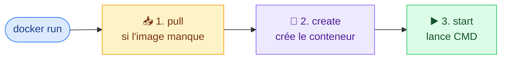
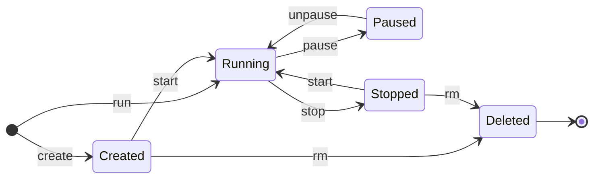
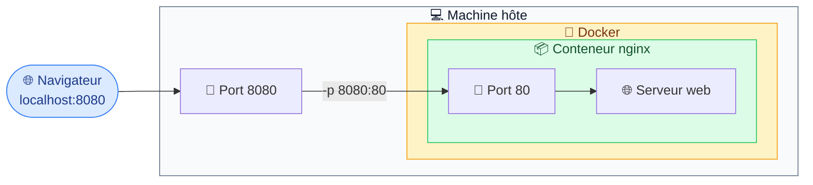

# 5. Les conteneurs

<mark style="color:blue;">**Une image qui prend vie.**</mark>

&#x20;


**En bref**

`docker run` crée et démarre un conteneur. On l'arrête avec `stop`, on le supprime avec `rm`, on entre dedans avec `exec`, et on le rend accessible avec `-p`.


&#x20;

***

&#x20;

## <mark style="color:purple;">01</mark> · Lancer un conteneur

&#x20;

```bash
docker run ohmyzsh/zsh
```

&#x20;

`docker run` fait en réalité **trois choses d'un coup** :

&#x20;



&#x20;


Un conteneur vit **aussi longtemps que son processus principal**. Quand la commande se termine, le conteneur s'arrête. C'est pour ça que `docker run ohmyzsh/zsh` rend la main tout de suite : sans terminal attaché, le shell n'a rien à faire et quitte.


&#x20;

### Les options à connaître

&#x20;

| Option              | Effet                                                                  | Exemple                          |
| ------------------- | ---------------------------------------------------------------------- | -------------------------------- |
| `-it`               | Mode **interactif** : ton clavier et ton écran sont branchés dessus     | `docker run -it ubuntu bash`     |
| `--name`            | Donne un **nom** (sinon Docker invente, ex. `condescending_tharp`)      | `--name my-server`               |
| `-d`                | Mode **détaché** : tourne en arrière-plan                               | `docker run -d nginx`            |
| `-p hôte:conteneur` | **Publie un port**                                                      | `-p 8080:80`                     |
| `-e`                | Définit une **variable d'environnement**                                | `-e POSTGRES_PASSWORD=secret`    |
| `-v`                | Monte un **volume** (voir [chapitre 6](06-volumes.md))                  | `-v data:/var/lib/data`          |
| `--rm`              | **Supprime automatiquement** le conteneur à l'arrêt                     | `docker run --rm -it alpine sh`  |

&#x20;



```bash
docker run -it --name my-zsh ohmyzsh/zsh
```



```bash
docker run -d --name my-server -p 8080:80 nginx
```



```bash
docker run --rm -it alpine sh
```

Parfait pour tester quelque chose : le conteneur disparaît dès que tu quittes.



&#x20;

***

&#x20;

## <mark style="color:purple;">02</mark> · Lister, arrêter, supprimer

&#x20;

```bash
docker ps            # conteneurs EN COURS  (= docker container ls)
docker ps -a         # TOUS, y compris arrêtés
```

&#x20;

```
$ docker ps -a
CONTAINER ID   IMAGE   STATUS                     PORTS    NAMES
3f72126a581a   nginx   Up 48 seconds              80/tcp   my-server2
6fd0cc9552ea   nginx   Exited (0) 2 minutes ago            my-server
```

&#x20;



### ⏹️ Arrêter / relancer

```bash
docker stop my-server
docker start my-server
docker restart my-server
```

Par nom ou par ID (les premiers caractères suffisent).



### 🗑️ Supprimer

```bash
docker rm my-server
docker rm 16aea41c1946

# tous les conteneurs arrêtés
docker container prune
```



&#x20;


**Arrêté ≠ supprimé** — un conteneur stoppé existe toujours (visible avec `docker ps -a`) et **occupe de l'espace disque**. Pense à faire le ménage.


&#x20;

***

&#x20;

## <mark style="color:purple;">03</mark> · Le cycle de vie

&#x20;



&#x20;

| État                  | Description                                    | Commande          |
| --------------------- | ---------------------------------------------- | ----------------- |
| ⚪ **Created**        | Créé, jamais démarré                           | `docker create`   |
| 🟢 **Running**        | En cours d'exécution                           | `docker start` / `run` |
| 🟡 **Paused**         | Processus gelés en mémoire                     | `docker pause`    |
| 🔴 **Stopped**        | <mark style="color:orange;">Arrêté, mais encore sur le disque</mark> | `docker stop`     |
| ⚫ **Deleted**        | Supprimé définitivement                        | `docker rm`       |

&#x20;

***

&#x20;

## <mark style="color:purple;">04</mark> · Entrer dans un conteneur : `exec`

&#x20;

`docker exec` lance une commande **supplémentaire** dans un conteneur **qui tourne déjà**.

&#x20;

```bash
# Exécute et rend la main
$ docker exec my-server2 whoami
root

# Ouvre un shell dedans
$ docker exec -it my-server2 bash
root@3f72126a581a:/#
```

&#x20;



**`docker run`**

<mark style="color:blue;">**Crée un nouveau**</mark> conteneur à partir d'une image.

🏗️ Construire une nouvelle maison.



**`docker exec`**

<mark style="color:blue;">**Entre dans**</mark> un conteneur qui tourne déjà.

🚪 Entrer dans une maison existante.



&#x20;

### Inspecter ce qui se passe

&#x20;

```bash
docker logs my-server         # les logs
docker logs -f my-server      # suivre les logs en direct
docker inspect my-server      # toute la configuration (JSON)
docker container stats        # CPU / RAM en temps réel
```

&#x20;

***

&#x20;

## <mark style="color:purple;">05</mark> · Publier un port

&#x20;

Par défaut, un conteneur est **isolé** : un serveur web qui écoute sur le port 80 **à l'intérieur** n'est pas joignable depuis ton navigateur. On **publie** le port avec `-p <port_hôte>:<port_conteneur>`.

&#x20;

```bash
docker run --name my-server2 -p 8080:80 nginx
```

&#x20;



&#x20;

<figure><figcaption><p>Ce que tu obtiens en ouvrant http://localhost:8080.</p></figcaption></figure>

&#x20;

### 🏨 L'analogie de l'hôtel

&#x20;

L'hôtel (ta machine) a un **standard téléphonique**. La chambre 80 (le conteneur) a un téléphone, mais personne dehors ne peut l'appeler directement. Avec `-p 8080:80`, tu dis au standard : **« quand on appelle le poste 8080, transfère vers la chambre 80 »**.

&#x20;


**L'ordre est toujours `hôte:conteneur`.** Tu peux lancer trois nginx sur les ports `8080`, `8081`, `8082` de ta machine, tous pointant vers le port `80` de leur propre conteneur.


&#x20;

***

&#x20;

## <mark style="color:purple;">06</mark> · En résumé

&#x20;


* `docker run` = pull + create + start. Options clés : `-it`, `-d`, `--name`, `-p`, `-e`, `--rm`.
* `docker ps -a` liste tous les conteneurs, même arrêtés.
* Un conteneur arrêté **occupe encore de la place** → `docker rm` ou `docker container prune`.
* `docker exec -it <conteneur> bash` pour entrer dans un conteneur qui tourne.
* `-p hôte:conteneur` pour rendre un service accessible depuis ta machine.


&#x20;

<mark style="color:green;">**→ Suite :**</mark> [6. Les données et volumes](06-volumes.md)
