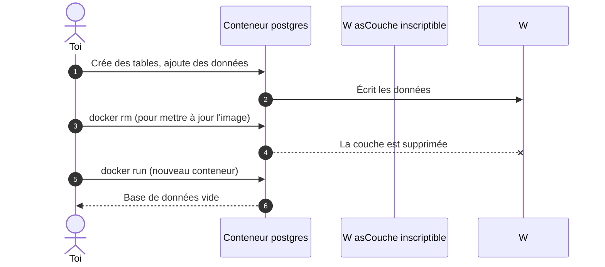
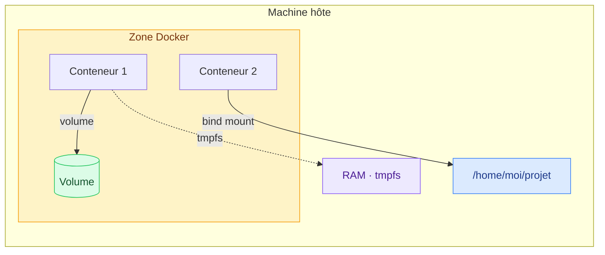
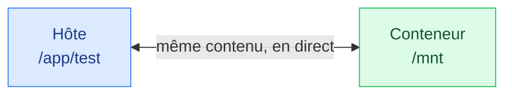
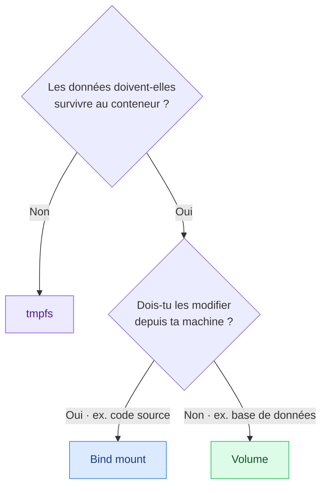

# 6. Les données et volumes

<mark style="color:blue;">**Les conteneurs sont jetables. Tes données, non.**</mark>

&#x20;


**En bref**

Sans précaution, les données écrites dans un conteneur **meurent avec lui**. Pour les garder, on les range **à l'extérieur** : dans un **volume** (géré par Docker) ou un **bind mount** (un dossier de ta machine). Pour du temporaire, il y a **tmpfs** (en RAM).


&#x20;

***

&#x20;

## <mark style="color:purple;">01</mark> · Le problème

&#x20;



&#x20;

Les conteneurs sont conçus pour être **jetables**. Les données, elles, ne doivent pas l'être : il faut les stocker **en dehors** du conteneur.

&#x20;

***

&#x20;

## <mark style="color:purple;">02</mark> · Les trois types de stockage

&#x20;



&#x20;

| Type              | Persistant ?                                    | Où ?                                   | Cas d'usage                                            |
| ----------------- | ----------------------------------------------- | -------------------------------------- | ------------------------------------------------------ |
| **Volume**     | <mark style="color:green;">**Oui**</mark>       | Zone gérée par Docker                  | Bases de données, données d'application                |
| **Bind mount** | <mark style="color:green;">**Oui**</mark>       | Un dossier **de ton choix** sur l'hôte | Développement : modifier le code sans rebuild          |
| **tmpfs**      | <mark style="color:red;">**Non**</mark>         | **RAM** uniquement                     | Données temporaires ou sensibles, jamais sur disque    |

&#x20;

### L'analogie de l'étudiant en location

&#x20;

Le conteneur est une **chambre meublée** que tu peux rendre à tout moment :

&#x20;



**Volume**

Un **casier de consigne** géré par la résidence. Tes affaires y restent même si tu changes de chambre.



**Bind mount**

Un **carton de chez tes parents**. C'est ton dossier à toi, tu sais où il est et tu le modifies depuis la maison.



**tmpfs**

Un **tableau blanc** dans la chambre. Pratique pour noter, mais tout s'efface quand tu pars.



&#x20;

***

&#x20;

## <mark style="color:purple;">03</mark> · Les volumes

&#x20;

Un volume est un espace de stockage **créé et géré par Docker**.

&#x20;

```bash
docker volume create volume_test    # créer
docker volume ls                    # lister
docker volume inspect volume_test   # détails, dont l'emplacement réel
docker volume rm volume_test        # supprimer
```

&#x20;

### Monter un volume

&#x20;



```bash
docker run -it --volume volume_test:/volume_test ohmyzsh/zsh
#                       └────┬────┘ └────┬─────┘
#                        volume      chemin dans
#                                    le conteneur
```



```bash
docker run -it \
  --mount type=volume,source=volume_test,target=/volume_test \
  ohmyzsh/zsh
```



&#x20;

Tout ce qui est écrit dans `/volume_test` va dans le volume et **survit à la suppression du conteneur**.

&#x20;


**Pratique** — si le volume n'existe pas encore, Docker le **crée automatiquement** au lancement du conteneur.


&#x20;

### Exemple concret : PostgreSQL

&#x20;



### Lancer la base avec un volume

&#x20;

```bash
docker run -d --name db \
  -e POSTGRES_PASSWORD=secret \
  -v pgdata:/var/lib/postgresql/data \
  postgres:16
```



### Supprimer le conteneur

&#x20;

```bash
docker rm -f db
```



### Recréer le conteneur avec le même volume

&#x20;

```bash
docker run -d --name db \
  -e POSTGRES_PASSWORD=secret \
  -v pgdata:/var/lib/postgresql/data \
  postgres:16
```

&#x20;

<mark style="color:green;">**Les données sont toujours là.**</mark>



&#x20;

### Pourquoi préférer les volumes ?

&#x20;

* <mark style="color:green;">**Faciles à sauvegarder et migrer**</mark>, plus que les bind mounts
* Gérables via la **CLI Docker** ou l'**API Docker**
* **Partageables plus sûrement** entre plusieurs conteneurs
* Un nouveau volume peut être **pré-rempli** par le contenu de l'image
* Meilleures **performances d'entrée/sortie**, surtout sur macOS et Windows

&#x20;

[Documentation sur les volumes](https://docs.docker.com/engine/storage/volumes/)

&#x20;

***

&#x20;

## <mark style="color:purple;">04</mark> · Les bind mounts

&#x20;

Un bind mount relie **un dossier précis de ta machine** à un dossier du conteneur. Les deux voient **les mêmes fichiers, en temps réel**.

&#x20;

```bash
mkdir /app/test

docker run -it --mount type=bind,source=/app/test,target=/mnt ohmyzsh/zsh
docker run -it --volume /app/test:/mnt ohmyzsh/zsh     # équivalent
```

&#x20;



&#x20;


**Volume ou bind mount avec `-v` ?** Si la partie gauche est un **chemin** (`/…` ou `./…`), c'est un bind mount. Si c'est un **simple nom**, c'est un volume.

* `-v ./src:/app/src` → bind mount
* `-v mesdonnees:/data` → volume


&#x20;

**Cas d'usage typique :** en développement, tu montes ton code source dans le conteneur. Tu modifies un fichier dans ton éditeur, et le changement est **immédiatement visible** dans le conteneur, sans reconstruire l'image.

&#x20;


**Attention** — un bind mount donne au conteneur un **accès direct à ton système de fichiers**. Ne monte jamais un dossier sensible (`/`, `/etc`…) sans bonne raison.


&#x20;

***

&#x20;

## <mark style="color:purple;">05</mark> · tmpfs

&#x20;

Un montage `tmpfs` stocke les données **uniquement en RAM**. Elles disparaissent dès que le conteneur s'arrête.

&#x20;

```bash
docker run -it --mount type=tmpfs,destination=/mnt --name mycon ohmyzsh/zsh
```

&#x20;

**Cas d'usage :** fichiers temporaires, cache, ou données sensibles (tokens, secrets) qu'on ne veut **jamais écrire sur le disque**.

&#x20;


`tmpfs` n'existe que pour les conteneurs Linux. C'est le même mécanisme que le `tmpfs` de Linux (voir [Systèmes de fichiers](../linux/08-systemes-de-fichiers.md)).


&#x20;

***

&#x20;

## <mark style="color:purple;">06</mark> · Lequel choisir ?

&#x20;



&#x20;

***

&#x20;

## <mark style="color:purple;">07</mark> · En résumé

&#x20;


* Sans montage, **les données meurent avec le conteneur**.
* **Volume** pour les données d'application, **bind mount** pour le développement, **tmpfs** pour le temporaire.
* `-v nom:/chemin` → volume ; `-v /chemin/hote:/chemin` → bind mount.


&#x20;

<mark style="color:green;">**→ Suite :**</mark> [7. Maintenance](07-maintenance.md)
