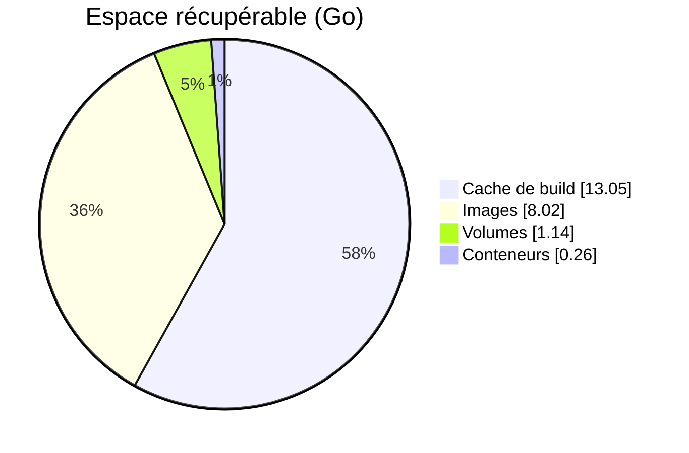
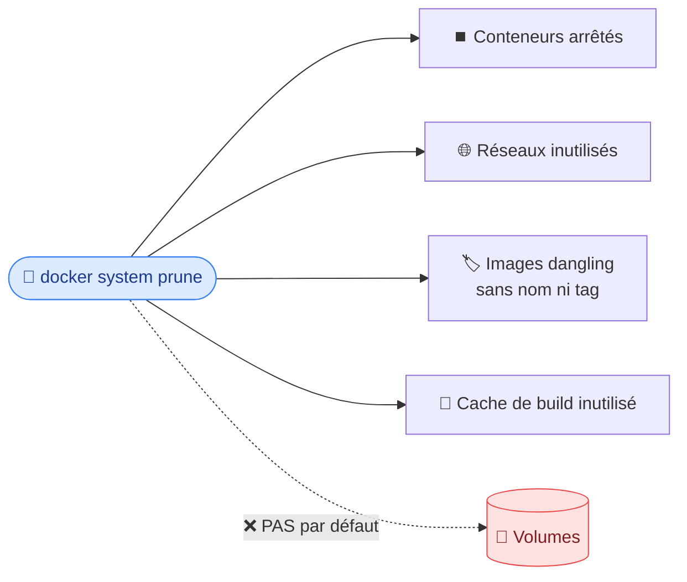

# 7. Maintenance de base

<mark style="color:blue;">**Docker adore le disque. Apprends-lui à ranger.**</mark>

&#x20;


**En bref**

Images anciennes, conteneurs arrêtés, cache de build : tout s'accumule **en silence**. `docker system df` mesure, `docker system prune` nettoie.


&#x20;

### 🧹 L'analogie du garage

&#x20;

Chaque `docker build`, `docker pull` ou `docker run` dépose un carton dans ton garage. Au bout de quelques mois, la voiture ne rentre plus. **`docker system prune`**, c'est le grand rangement de printemps.

&#x20;

***

&#x20;

## <mark style="color:purple;">01</mark> · Voir ce qui prend de la place

&#x20;

```
$ docker system df
TYPE            TOTAL     ACTIVE    SIZE      RECLAIMABLE
Images          123       8         9.926GB   8.019GB (80%)
Containers      14        1         257.1MB   257.1MB (100%)
Local Volumes   46        2         1.193GB   1.144GB (95%)
Build Cache     600       0         15.27GB   13.05GB
```

&#x20;

La colonne **RECLAIMABLE** indique ce qu'on peut récupérer. Ici, plus de <mark style="color:red;">**22 Go**</mark> dorment pour rien :

&#x20;



&#x20;

***

&#x20;

## <mark style="color:purple;">02</mark> · Tout nettoyer : `docker system prune`

&#x20;

```
$ docker system prune
WARNING! This will remove:
  - all stopped containers
  - all networks not used by at least one container
  - all dangling images
  - unused build cache

Are you sure you want to continue? [y/N]
```

&#x20;



&#x20;


**« Dangling »** = image sans nom ni tag. Typiquement l'ancienne version d'une image que tu viens de reconstruire : le tag est passé à la nouvelle, l'ancienne reste orpheline.


&#x20;

### Pourquoi c'est important

&#x20;



**💾 Espace disque**
Libère des Go inutiles, évite les erreurs « disque plein ».

&#x20;

**⚡ Performances**
Système plus réactif, déploiements plus rapides.

&#x20;

**🔒 Sécurité**
De vieilles images oubliées contiennent des **vulnérabilités connues**. Moins d'images = moins de surface d'attaque.



**🌐 Réseau propre**
Supprime les bridges et règles iptables laissés par d'anciens conteneurs.

&#x20;

**🤖 Automatisable**
Une seule commande à planifier, au lieu de scripts de nettoyage maison.



&#x20;

***

&#x20;

## <mark style="color:purple;">03</mark> · Et les volumes ?

&#x20;


**Protégés par défaut** — `docker system prune` **ne supprime pas les volumes**, pour éviter de perdre des données importantes (ta base de données, par exemple).


&#x20;

Pour les inclure, il faut le demander explicitement :

&#x20;

```
$ docker system prune --volumes
WARNING! This will remove:
  - all stopped containers
  - all networks not used by at least one container
  - all anonymous volumes not used by at least one container
  - all dangling images
  - unused build cache
```

&#x20;

***

&#x20;

## <mark style="color:purple;">04</mark> · Nettoyer de façon ciblée

&#x20;

| Commande                               | Ce qu'elle supprime                                         |
| -------------------------------------- | ----------------------------------------------------------- |
| `docker container prune`               | Conteneurs arrêtés                                          |
| `docker image prune`                   | Images dangling (sans tag)                                  |
| `docker image prune -a`                | <mark style="color:orange;">**Toutes** les images non utilisées</mark> |
| `docker volume prune`                  | Volumes non utilisés                                        |
| `docker network prune`                 | Réseaux non utilisés                                        |
| `docker builder prune`                 | Cache de build                                              |
| `docker system prune -a --volumes`     | <mark style="color:red;">⚠️ **Tout** ce qui n'est pas utilisé</mark> |

&#x20;


**Avant un gros ménage** — vérifie avec `docker system df` et `docker volume ls` que tu ne vas rien perdre d'important. **Il n'y a pas de corbeille.**


&#x20;

***

&#x20;

## <mark style="color:purple;">05</mark> · Les autres commandes `docker system`

&#x20;

| Commande                | Rôle                                                              |
| ----------------------- | ----------------------------------------------------------------- |
| `docker system df`      | Espace disque utilisé                                             |
| `docker system info`    | Version, nombre de conteneurs et d'images, driver de stockage…    |
| `docker system events`  | Flux en temps réel : conteneur démarré, arrêté, image supprimée…  |
| `docker system prune`   | Supprime les données inutilisées                                  |

&#x20;

***

&#x20;

## <mark style="color:purple;">06</mark> · En résumé

&#x20;


* `docker system df` pour **mesurer**, `docker system prune` pour **nettoyer**.
* Les **volumes ne sont pas supprimés par défaut** : il faut `--volumes`.
* Nettoyer régulièrement, c'est aussi une **mesure de sécurité**.


&#x20;

<mark style="color:green;">**→ Suite :**</mark> [8. Docker Compose](08-docker-compose.md)
