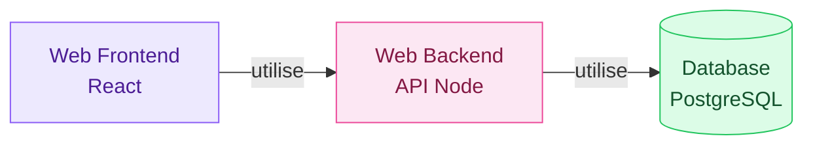
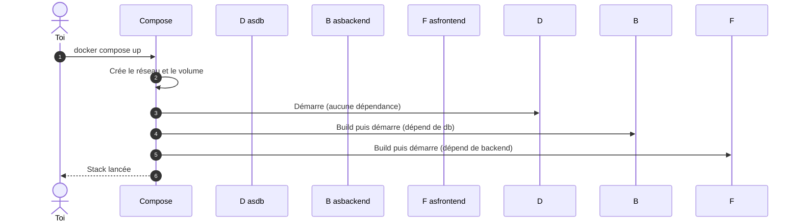
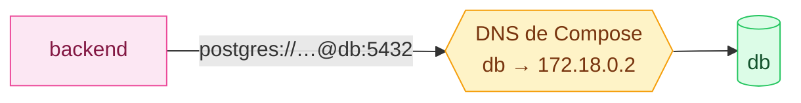
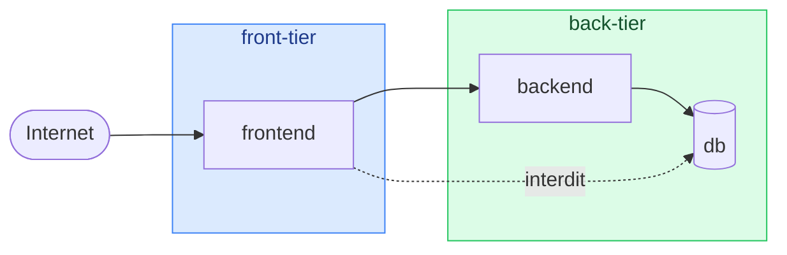

# 8. Docker Compose

<mark style="color:blue;">**Toute ton application, une seule commande.**</mark>

&#x20;


**En bref**

Docker Compose décrit **tous les conteneurs d'une application** (frontend, backend, base de données…) dans un fichier `compose.yaml`. Ensuite : `docker compose up`, et tout démarre.


&#x20;

***

&#x20;

## <mark style="color:purple;">01</mark> · Le problème : trop de conteneurs

&#x20;

Tu développes une application SaaS pour un client. Son architecture :

&#x20;



&#x20;

Chaque développeur de l'équipe doit pouvoir lancer **toute la stack** en local. Avec `docker run`, ça donne :

&#x20;

```bash
docker network create app-net
docker volume create db-data
docker run -d --name db --network app-net -v db-data:/var/lib/postgresql/data \
  -e POSTGRES_PASSWORD=secret postgres:16
docker build -t backend ./backend
docker run -d --name backend --network app-net -p 3000:3000 \
  -e DATABASE_URL=postgres://postgres:secret@db:5432/postgres backend
docker build -t frontend ./frontend
docker run -d --name frontend --network app-net -p 8080:80 frontend
```

&#x20;

…à retenir, dans le bon ordre, à chaque fois. Il nous faut un **mécanisme d'orchestration** : <mark style="color:blue;">**Docker Compose**</mark>.

&#x20;

***

&#x20;

## <mark style="color:purple;">02</mark> · La solution : un fichier pour tout décrire

&#x20;

### L'analogie du chef d'orchestre

&#x20;



**Les musiciens**

Chaque **conteneur** sait jouer sa partie.



**La partition**

Le **`compose.yaml`** dit qui joue quoi, avec qui, dans quel ordre.



**Le chef**

**Docker Compose** lit la partition et fait jouer tout le monde ensemble.



&#x20;

### Un exemple complet

&#x20;

```yaml
# compose.yaml
services:
  frontend:
    build: ./frontend            # construit depuis ./frontend/Dockerfile
    ports:
      - "8080:80"                # hôte:conteneur
    depends_on:
      - backend                  # démarre après le backend

  backend:
    build: ./backend
    ports:
      - "3000:3000"
    environment:
      DATABASE_URL: postgres://postgres:secret@db:5432/postgres
    depends_on:
      - db

  db:
    image: postgres:16           # image prise sur Docker Hub
    environment:
      POSTGRES_PASSWORD: secret
    volumes:
      - db-data:/var/lib/postgresql/data

volumes:
  db-data:                       # volume nommé, géré par Docker
```

&#x20;

Pour tout lancer :

&#x20;

```bash
docker compose up
```

&#x20;

<mark style="color:green;">**Trois conteneurs, un réseau, un volume — en une commande.**</mark>

&#x20;

***

&#x20;

## <mark style="color:purple;">03</mark> · Ce qui se passe au `up`

&#x20;



&#x20;


`depends_on` règle **l'ordre de démarrage**, mais n'attend pas que le service soit réellement **prêt** (une base peut mettre quelques secondes à accepter des connexions). Pour ça, on ajoute un `healthcheck` — sujet avancé.


&#x20;

***

&#x20;

## <mark style="color:purple;">04</mark> · Les clés du fichier

&#x20;

| Clé                     | Rôle                                                          | Équivalent `docker run` |
| ----------------------- | ------------------------------------------------------------- | ----------------------- |
| `services`              | La liste des conteneurs de l'application                      | —                       |
| `image`                 | Image à utiliser (depuis un registry)                         | `docker run <image>`    |
| `build`                 | Dossier contenant un Dockerfile à construire                  | `docker build`          |
| `ports`                 | Ports publiés `hôte:conteneur`                                | `-p`                    |
| `environment`           | Variables d'environnement                                     | `-e`                    |
| `volumes`               | Volumes ou bind mounts                                        | `-v`                    |
| `depends_on`            | Ordre de démarrage                                            | —                       |
| `networks`              | Réseaux auxquels le service est connecté                      | `--network`             |
| `volumes:` (racine)     | Déclaration des volumes nommés                                | `docker volume create`  |
| `networks:` (racine)    | Déclaration des réseaux                                       | `docker network create` |

&#x20;

### La magie du réseau

&#x20;

Compose crée automatiquement un **réseau commun**, où chaque service est joignable **par son nom**. C'est pour ça que le backend se connecte à la base via l'hôte `db` : pas besoin de connaître d'adresse IP.

&#x20;



&#x20;

### Isoler des réseaux (avancé)

&#x20;

On peut séparer les services. Ici, le frontend **ne peut pas** parler directement à la base : c'est une bonne pratique de sécurité.

&#x20;



&#x20;

```yaml
services:
  frontend:
    image: example/webapp
    ports:
      - "443:8043"
    networks: [front-tier, back-tier]

  backend:
    image: example/api
    networks: [back-tier]

  db:
    image: postgres:16
    volumes:
      - db-data:/var/lib/postgresql/data
    networks: [back-tier]

volumes:
  db-data:

networks:
  front-tier: {}
  back-tier: {}
```

&#x20;

***

&#x20;

## <mark style="color:purple;">05</mark> · Les commandes essentielles

&#x20;

| Commande                            | Effet                                                        |
| ----------------------------------- | ------------------------------------------------------------ |
| `docker compose up`                 | Crée et démarre **tous les services**                         |
| `docker compose up -d`              | Idem, en arrière-plan                                         |
| `docker compose up --build`         | Reconstruit les images avant de démarrer                      |
| `docker compose down`               | **Arrête et supprime** conteneurs et réseaux                  |
| `docker compose down -v`            | <mark style="color:red;">Idem + supprime les volumes</mark> |
| `docker compose ps`                 | État des services                                             |
| `docker compose logs -f backend`    | Suit les logs d'un service                                    |
| `docker compose exec backend sh`    | Shell dans un service qui tourne                              |
| `docker compose restart`            | Redémarre les services                                        |

&#x20;


Les commandes `docker compose` s'exécutent **dans le dossier qui contient `compose.yaml`**.


&#x20;


**`docker-compose` ou `docker compose` ?** L'ancienne commande avec un tiret était un outil séparé écrit en Python. Aujourd'hui, Compose est intégré à Docker : on écrit **`docker compose`**, avec un espace.


&#x20;

***

&#x20;

## <mark style="color:purple;">06</mark> · `docker run` vs Compose

&#x20;

|                              | `docker run`                          | Docker Compose                                   |
| ---------------------------- | ------------------------------------- | --------------------------------------------------- |
| Conteneurs                   | Un à la fois                          | Toute l'application                                 |
| Configuration                | Dans la ligne de commande             | Dans un fichier **versionné avec le code**           |
| Réseau entre conteneurs      | À créer à la main                     | <mark style="color:green;">Automatique, par nom</mark> |
| Reproductible par l'équipe   | <mark style="color:orange;">Difficile</mark> | <mark style="color:green;">`git clone` + `docker compose up`</mark> |

&#x20;

**À toi de jouer :** [Docker Compose — Getting started](https://docs.docker.com/compose/gettingstarted/) · [Compose file reference](https://docs.docker.com/reference/compose-file/)

&#x20;

***

&#x20;

## <mark style="color:purple;">07</mark> · En résumé

&#x20;


* Docker Compose **décrit une application multi-conteneurs** dans `compose.yaml`.
* `docker compose up` lance tout, `docker compose down` arrête et nettoie tout.
* Les services se joignent **par leur nom** sur le réseau créé par Compose.
* Le fichier est **versionné avec le code** : toute l'équipe a le même environnement.


&#x20;

<mark style="color:green;">**→ Suite :**</mark> [9. Aide-mémoire](09-aide-memoire.md)
