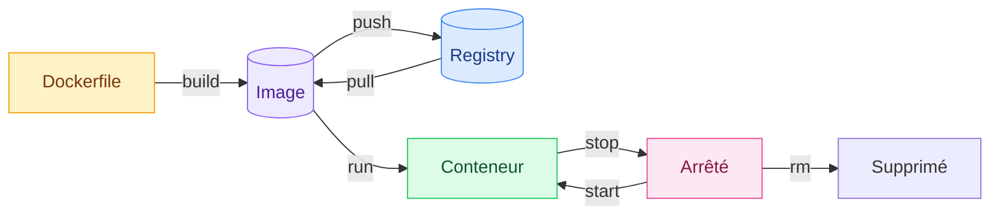

# 9. Aide-mémoire

<mark style="color:blue;">**Toutes les commandes, une seule page.**</mark>

&#x20;


**Comment lire** — remplace `<image>`, `<conteneur>` et `<volume>` par le nom ou l'ID concerné. Pour un ID, les premiers caractères suffisent s'ils sont uniques.


&#x20;



&#x20;

***

&#x20;

## <mark style="color:purple;">01</mark> · Images

&#x20;

| Action                                        | Commande                                    |
| --------------------------------------------- | ------------------------------------------- |
| Construire depuis un Dockerfile               | `docker build -t <image> .`                 |
| Construire sans cache                         | `docker build -t <image> . --no-cache`      |
| Construire avec les dernières images de base  | `docker build --pull -t <image> .`          |
| Lister les images                             | `docker images`                             |
| Supprimer une image                           | `docker rmi <image>`                        |
| Supprimer les images inutilisées              | `docker image prune`                        |

&#x20;

## <mark style="color:purple;">02</mark> · Registry

&#x20;

| Action                            | Commande                                  |
| --------------------------------- | ----------------------------------------- |
| Se connecter                      | `docker login -u <utilisateur>`           |
| Se connecter à un registry privé  | `docker login <registry>`                 |
| Rechercher                        | `docker search <image>`                   |
| Télécharger                       | `docker pull <image>`                     |
| Publier                           | `docker push <utilisateur>/<image>`       |

&#x20;

## <mark style="color:purple;">03</mark> · Conteneurs

&#x20;

| Action                                  | Commande                                              |
| --------------------------------------- | ----------------------------------------------------- |
| Lancer avec un nom                      | `docker run --name <conteneur> <image>`               |
| Lancer en interactif                    | `docker run -it <image> sh`                           |
| Lancer en arrière-plan                  | `docker run -d <image>`                               |
| Publier un port                         | `docker run -p <hôte>:<conteneur> <image>`            |
| Variable d'environnement                | `docker run -e CLE=valeur <image>`                    |
| Supprimer à l'arrêt                     | `docker run --rm <image>`                             |
| Démarrer / arrêter                      | `docker start <conteneur>` / `docker stop <conteneur>` |
| Lister (en cours / tous)                | `docker ps` / `docker ps -a`                          |
| Supprimer                               | `docker rm <conteneur>`                               |
| Supprimer tous les arrêtés              | `docker container prune`                              |
| Shell dans un conteneur qui tourne      | `docker exec -it <conteneur> sh`                      |
| Suivre les logs                         | `docker logs -f <conteneur>`                          |
| Inspecter                               | `docker inspect <conteneur>`                          |
| CPU / RAM                               | `docker container stats`                              |

&#x20;

## <mark style="color:purple;">04</mark> · Volumes

&#x20;

| Action                          | Commande                                                     |
| ------------------------------- | ------------------------------------------------------------ |
| Créer / lister / supprimer      | `docker volume create` · `ls` · `rm <volume>`                |
| Monter un volume                | `docker run -v <volume>:/chemin <image>`                     |
| Monter un dossier de l'hôte     | `docker run -v /chemin/hôte:/chemin <image>`                 |
| Monter un tmpfs                 | `docker run --mount type=tmpfs,destination=/chemin <image>`  |

&#x20;

## <mark style="color:purple;">05</mark> · Maintenance

&#x20;

| Action                          | Commande                              |
| ------------------------------- | ------------------------------------- |
| Espace disque                   | `docker system df`                    |
| Nettoyage général               | `docker system prune`                 |
| Nettoyage + volumes             | `docker system prune --volumes` |
| Infos sur l'installation        | `docker system info`                  |

&#x20;

## <mark style="color:purple;">06</mark> · Docker Compose

&#x20;

| Action                  | Commande                                    |
| ----------------------- | ------------------------------------------- |
| Tout démarrer           | `docker compose up` (`-d` en fond)          |
| Reconstruire et démarrer | `docker compose up --build`                 |
| Tout arrêter            | `docker compose down` (`-v` = volumes)   |
| État                    | `docker compose ps`                         |
| Logs                    | `docker compose logs -f`                    |
| Shell dans un service   | `docker compose exec <service> sh`          |

&#x20;

***

&#x20;

## <mark style="color:purple;">07</mark> · Modèles prêts à copier

&#x20;



```dockerfile
FROM <image_de_base>:<version>
WORKDIR /app
COPY <fichiers_de_dépendances> ./
RUN <installation_des_dépendances>
COPY . .
EXPOSE <port>
CMD ["<commande>", "<argument>"]
```



```yaml
services:
  app:
    build: .
    ports:
      - "8080:8080"
    environment:
      DB_HOST: db
    depends_on:
      - db
  db:
    image: postgres:16
    environment:
      POSTGRES_PASSWORD: secret
    volumes:
      - db-data:/var/lib/postgresql/data

volumes:
  db-data:
```



```
.git
node_modules
.env
*.log
```



&#x20;

Cheat sheet officielle : [docker\_cheatsheet.pdf](https://docs.docker.com/get-started/docker_cheatsheet.pdf)

&#x20;

<mark style="color:green;">**→ Suite :**</mark> [10. Questions de révision](10-questions-revision.md)
