```mermaid
flowchart LR
    A["1. Introduction"] --> B["2. Architecture"]
    B --> C["3. Images"]
    C --> D["4. Dockerfile"]
    D --> E["5. Conteneurs"]
    E --> F["6. Volumes"]
    F --> G["7. Maintenance"]
    G --> H["8. Compose"]
    H --> I["Révision"]

    style A fill:#dbeafe,stroke:#3b82f6,color:#1e3a8a
    style B fill:#dbeafe,stroke:#3b82f6,color:#1e3a8a
    style C fill:#ede9fe,stroke:#8b5cf6,color:#4c1d95
    style D fill:#ede9fe,stroke:#8b5cf6,color:#4c1d95
    style E fill:#fce7f3,stroke:#ec4899,color:#831843
    style F fill:#fce7f3,stroke:#ec4899,color:#831843
    style G fill:#fef3c7,stroke:#f59e0b,color:#78350f
    style H fill:#fef3c7,stroke:#f59e0b,color:#78350f
    style I fill:#dcfce7,stroke:#22c55e,color:#14532d
```

# Docker

<mark style="color:blue;">**Emballer une application une fois, la faire tourner partout.**</mark>

&#x20;

> _« Mais… ça marche sur ma machine ! »_
> Docker existe pour que cette phrase disparaisse.

&#x20;


**En bref**

Docker met ton application **et tout ce dont elle a besoin** dans une boîte standard, le **conteneur**. Cette boîte tourne à l'identique sur ton laptop, celui de ton collègue ou un serveur dans le cloud.


&#x20;

<figure><figcaption><p>La baleine de Docker transporte des conteneurs, exactement comme un cargo.</p></figcaption></figure>

&#x20;

***

&#x20;

## <mark style="color:purple;">01</mark> · Ce que tu vas apprendre

&#x20;

À la fin de ce chapitre, tu sauras :

&#x20;

* <mark style="color:blue;">**Ce qu'est Docker**</mark> et en quoi un conteneur diffère d'une machine virtuelle
* <mark style="color:blue;">**Comment Docker fonctionne**</mark> : client, daemon, registry
* <mark style="color:blue;">**Ce qu'est une image**</mark>, comment elle est construite en couches, et comment en créer une avec un `Dockerfile`
* <mark style="color:blue;">**Piloter des conteneurs**</mark> : démarrer, arrêter, supprimer, entrer dedans, publier des ports
* <mark style="color:blue;">**Garder ses données**</mark> avec les volumes, bind mounts et tmpfs
* <mark style="color:blue;">**Faire le ménage**</mark> et surveiller l'espace disque
* <mark style="color:blue;">**Orchestrer plusieurs conteneurs**</mark> avec Docker Compose

&#x20;

***

&#x20;

## <mark style="color:purple;">02</mark> · Ton parcours

&#x20;



&#x20;

| #  | Page                                                  | L'idée clé en une phrase                              |
| -- | ----------------------------------------------------- | ----------------------------------------------------- |
| 1  | [Introduction](01-introduction.md)                    | Pourquoi Docker ? Conteneurs vs machines virtuelles   |
| 2  | [Architecture](02-architecture.md)                    | Qui fait quoi : client, daemon, registry              |
| 3  | [Les images](03-images.md)                            | Un modèle en lecture seule, construit en couches      |
| 4  | [Le Dockerfile](04-dockerfile.md)                     | La recette pour fabriquer ses propres images          |
| 5  | [Les conteneurs](05-conteneurs.md)                    | Lancer, arrêter, supprimer, publier des ports         |
| 6  | [Les données et volumes](06-volumes.md)               | Où ranger les données qui doivent survivre            |
| 7  | [Maintenance](07-maintenance.md)                      | Faire le ménage et surveiller le disque               |
| 8  | [Docker Compose](08-docker-compose.md)                | Toute une application en une seule commande           |
| 9  | [Aide-mémoire](09-aide-memoire.md)                    | Toutes les commandes sur une page                     |
| 10 | [Questions de révision](10-questions-revision.md)     | Vérifier que tout est compris                         |

&#x20;

***

&#x20;

## <mark style="color:purple;">03</mark> · Avant de commencer

&#x20;



### Installer Docker

&#x20;

Installe [Docker Desktop](https://www.docker.com/products/docker-desktop/) (Windows, macOS) ou Docker Engine (Linux).

&#x20;



### Vérifier que tout marche

&#x20;

```bash
docker --version
docker run hello-world
```

&#x20;

<mark style="color:green;">**Si tu vois « Hello from Docker! », c'est prêt.**</mark>



### Pratiquer en lisant

&#x20;

Tape chaque commande toi-même. Docker s'apprend avec les doigts, pas avec les yeux.



&#x20;

***

&#x20;

<details>

<summary>Références</summary>

&#x20;

* [Docker — Get started](https://docs.docker.com/get-started/)
* [Docker Hub](https://hub.docker.com)
* [Building images](https://docs.docker.com/get-started/docker-concepts/building-images/)
* [Publishing ports](https://docs.docker.com/get-started/docker-concepts/running-containers/publishing-ports/)
* [Docker Compose](https://docs.docker.com/compose/)
* [Docker workshop](https://docs.docker.com/get-started/workshop/)

&#x20;

_Source : cours « IT Methodology — Docker », P. Rétornaz & A. Jungo, HEIA-FR._

&#x20;

</details>
